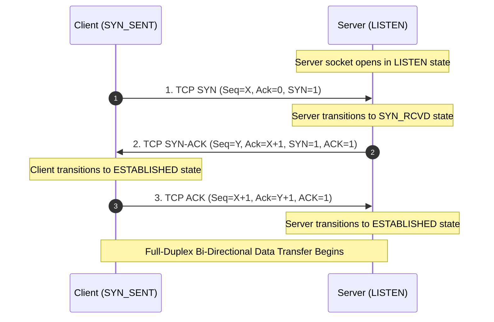

# Volume 02: Linux, Networking & Security Foundations
# Special Master Guide: Computer Networking Foundations, IP Addressing, Subnetting & Protocol Architecture
## An Authoritative Reference Covering Network Topologies, Hardware Devices, IPv4/IPv6 Types, CIDR Mathematics, VLSM & Transport Layer Mechanics

---

## 1. Executive Summary & Foundational Overview

Computer networking is the engineering discipline of interconnecting autonomous computing devices—ranging from physical servers and microcontrollers to virtualized cloud containers and smartphones—via shared physical or wireless transmission media to exchange data reliably, securely, and efficiently.

Every network interaction, whether browsing a web page, authenticating to an Active Directory domain controller, or transmitting telemetry from a satellite, is governed by structured protocols, mathematical addressing schemes, and physical transmission constraints.

```
+----------------------------------------------------------------------------------------------------+
|                               THE COMPUTER NETWORKING HIERARCHY                                    |
+------------------------------------+---------------------------------------------------------------+
| Domain                             | Core Concepts & Technologies                                  |
+------------------------------------+---------------------------------------------------------------+
| 1. Physical & Topologies           | Bus, Star, Ring, Mesh, Tree, Hybrid; UTP/STP, Fiber Optic     |
| 2. Scale & Classification          | PAN, LAN, CAN, MAN, WAN, WLAN, SAN, VPN                       |
| 3. Hardware Intermediaries         | Hubs, Switches, Routers, Bridges, Gateways, Access Points      |
| 4. Transmission & Switching        | Simplex, Half-Duplex, Full-Duplex; Circuit vs. Packet Switch  |
| 5. IP Addressing Architecture      | IPv4 Classes (A–E), Public vs. Private (RFC 1918), IPv6 Types  |
| 6. Subnetting & CIDR Mathematics   | Dotted-Decimal Masks, Bitwise AND, Block Size, VLSM, Supernet |
| 7. Transport Protocols             | TCP (FSM, 3-Way Handshake, Flow/Congestion Control) vs. UDP   |
| 8. Routing Protocols & Metrics     | Static vs. Dynamic; IGP (OSPF/RIP) vs. EGP (BGP); Latency, BDP|
+------------------------------------+---------------------------------------------------------------+
```

---

## 2. Network Topologies: Geometric & Physical Architectures

A **network topology** defines how nodes (computers, printers, switches, routers) are arranged and connected to one another. Topologies are categorized into **physical topology** (the physical layout of cables and hardware) and **logical topology** (how data flows through the network regardless of physical placement).

```
+----------------------------------------------------------------------------------------------------+
|                                      NETWORK TOPOLOGIES OVERVIEW                                   |
+-------------------+-------------------+--------------------+-------------------+-------------------+
| Bus Topology      | Star Topology     | Ring Topology      | Mesh Topology     | Tree Topology     |
+-------------------+-------------------+--------------------+-------------------+-------------------+
| [Node]-[Node]-[N] |     [Node]        |    [Node]-[Node]   |   [Node]---[Node] |       [Root]      |
|        |          |       |           |   /             \  |   | \     / |     |       /    \      |
| ====[Backbone]=== | [N]-[Switch]-[N]  | [Node]       [Node]|   |   \ /   |     |    [Sw1]  [Sw2]   |
|        |          |       |           |   \             /  |   |   / \   |     |    /  \    /  \   |
| [Node]-[Node]-[N] |     [Node]        |    [Node]-[Node]   |   [Node]---[Node] |  [N] [N] [N] [N]  |
+-------------------+-------------------+--------------------+-------------------+-------------------+
```

### 2.1 Bus Topology
* **Architecture**: All devices connect directly to a single shared central coaxial or twisted-pair cable called the **backbone**. Both ends of the cable must be terminated with a **terminator** (typically a 50-ohm resistor) to absorb signals and prevent signal reflection.
* **Advantages**: Minimal cabling required; inexpensive and straightforward to deploy for small networks.
* **Disadvantages**: A single break in the central backbone halts all communications across the entire network; high collision rates under heavy traffic (CSMA/CD required); troubleshooting is difficult.

### 2.2 Star Topology (Modern Standard for LANs)
* **Architecture**: Every host connects to a central intermediary device (typically an Ethernet switch, historically a hub) via dedicated point-to-point twisted-pair cables (Cat5e/Cat6).
* **Advantages**: High fault tolerance: if a single cable or host fails, only that host is disconnected; the rest of the network continues uninterrupted. Easy to add or remove devices; centralized traffic monitoring and port management.
* **Disadvantages**: The central switch is a **Single Point of Failure (SPOF)**. If the central switch loses power or fails, the entire network partition goes down. Requires significantly more cabling than a bus topology.

### 2.3 Ring Topology
* **Architecture**: Devices are connected sequentially in a closed loop. Each device has exactly two neighbors. Data travels in a single direction (unidirectional) or bidirectional (dual-ring, such as FDDI - Fiber Distributed Data Interface) using a **Token Passing** arbitration protocol (IEEE 802.5).
* **Advantages**: No data packet collisions because only the node holding the token can transmit. Predictable, deterministic latency.
* **Disadvantages**: In a unidirectional ring, a single node failure or broken cable breaks the entire loop. Reconfiguring the network requires interrupting the entire ring.

### 2.4 Mesh Topology (Full vs. Partial)
* **Architecture**:
  - **Full Mesh**: Every single device is connected directly to every other device via dedicated point-to-point links. For $N$ devices, the number of required physical links is:
    $$\text{Number of Links} = \frac{N(N - 1)}{2}$$
    *(For example, connecting 10 routers in a full mesh requires $(10 \times 9) / 2 = 45$ physical cables and 9 network interfaces per router).*
  - **Partial Mesh**: Critical nodes (such as core routers and data center gateways) are redundantly interconnected, while secondary nodes connect to only one or two neighbors.
* **Advantages**: Unmatched redundancy and fault tolerance. No single point of failure. If any single link is cut, dynamic routing algorithms (OSPF, BGP) route traffic through alternate paths instantly.
* **Disadvantages**: Extremely expensive; high cabling and hardware port requirements; complex to install and administer physically.

### 2.5 Tree (Hierarchical) Topology
* **Architecture**: Combines multiple star topologies connected to a central bus or root backbone switch. Structured into three classic enterprise tiers: **Core Layer** (ultra-high-speed packet switching) $\to$ **Distribution Layer** (routing, access control lists, policy enforcement) $\to$ **Access Layer** (connecting end-user workstations and access points).
* **Advantages**: Highly scalable; easy to isolate faults to specific departmental branches; straightforward expansion.

---

## 3. Geographical Scale & Network Classifications

Networks are classified by the geographic area they encompass and the administrative boundaries they cross:

| Classification | Full Name | Geographic Scope | Typical Transmission Media | Everyday Real-World Examples |
| :--- | :--- | :--- | :--- | :--- |
| **PAN** | Personal Area Network | Within 10 meters (Personal reach) | Bluetooth (BLE), Zigbee, USB, NFC | Wireless headphones paired to smartphone; smartwatch health sensors. |
| **LAN** | Local Area Network | Single room, office suite, or home | Twisted-pair Ethernet (Cat6), Wi-Fi (802.11ax) | Corporate office network, home Wi-Fi network, school computer lab. |
| **CAN** | Campus Area Network | Contiguous multi-building property (1–5 km) | Private multi-mode/single-mode fiber optic | University campus, military base, corporate headquarters campus. |
| **MAN** | Metropolitan Area Network | An entire city or town (5–50 km) | Dark fiber, Metro Ethernet, microwave wireless | City-wide cable television networks, municipal traffic control systems. |
| **WAN** | Wide Area Network | Country, continent, or global scope | Transoceanic submarine fiber cables, satellite | The global Internet; multinational bank interconnecting global branches. |
| **WLAN** | Wireless Local Area Network | Same as LAN, but radio-frequency based | IEEE 802.11a/b/g/n/ac/ax/be RF spectrum | Coffee shop guest Wi-Fi, enterprise wireless networks. |
| **SAN** | Storage Area Network | Dedicated data center storage fabric | Fibre Channel (FC), iSCSI over 100GbE | Connecting high-speed disk arrays to virtualization hypervisors. |
| **VPN** | Virtual Private Network | Overlay network over public WAN | Encrypted tunnels (IPsec, WireGuard, OpenVPN) | Remote employees securely tunneling into corporate intranet over Internet. |

---

## 4. Networking Hardware & Intermediary Devices

Intermediary devices forward, regenerate, switch, route, and filter traffic between endpoints. Each device operates at a specific layer of the OSI model:

```
+----------------------------------------------------------------------------------------------------+
|                               NETWORKING HARDWARE AT A GLANCE                                      |
+-------------------+-----------+------------------+------------------+------------------------------+
| Device            | OSI Layer | Collision Domain | Broadcast Domain | Forwarding Decision Based On |
+-------------------+-----------+------------------+------------------+------------------------------+
| **Repeater**      | Layer 1   | Extends Domain   | Extends Domain   | None (Electrical signal regen|
| **Hub**           | Layer 1   | 1 Shared Domain  | 1 Shared Domain  | None (Floods to all ports)   |
| **Bridge**        | Layer 2   | 2 (1 per port)   | 1 Shared Domain  | Destination MAC Address      |
| **Switch**        | Layer 2/3 | 1 Per Port       | 1 (per VLAN)     | MAC Address Table (CAM)      |
| **Router**        | Layer 3   | 1 Per Port       | Breaks Broadcast | Destination IP Routing Table |
| **Gateway**       | Layer 4–7 | 1 Per Port       | Breaks Broadcast | Protocol Translation / Proxy |
| **Wireless AP**   | Layer 2   | 1 Shared RF Air  | 1 Shared Domain  | 802.11 RF to 802.3 Ethernet  |
+-------------------+-----------+------------------+------------------+------------------------------+
```

### 4.1 Collision Domains vs. Broadcast Domains
Understanding the difference between collision and broadcast domains is a cornerstone of networking:
* **Collision Domain**: A physical or logical network segment where data packets can collide with one another when two devices transmit simultaneously over a shared medium.
  - In a **Hub**, all ports share **one single collision domain**. If Port 1 and Port 4 transmit at the same time, electrical signals collide, corrupting data.
  - In a **Switch**, **every individual port is its own separate collision domain**. The switch buffers frames in memory and delivers full-duplex transmission without collisions.
* **Broadcast Domain**: A logical segment of a network in which any device can broadcast a frame (e.g., ARP Request or DHCP Discover) and have it received by every other device in that segment.
  - Switches and Hubs forward broadcast frames out of every port (within the same VLAN).
  - **Routers break broadcast domains**. Routers drop Layer-2 broadcast frames (`FF:FF:FF:FF:FF:FF`) by default, preventing broadcast traffic from flooding across the Internet.

```
Hub (1 Collision Domain, 1 Broadcast Domain):
[PC1] ----\
[PC2] -----+--> [ HUB ] (Signal echoed to all ports simultaneously)
[PC3] ----/

Switch (Independent Collision Domain per Port, 1 Broadcast Domain):
[PC1] (Col Dom 1) ----\
[PC2] (Col Dom 2) -----+--> [ SWITCH ] (Micro-segmented forwarding via CAM table)
[PC3] (Col Dom 3) ----/

Router (Breaks Broadcast Domains):
[ LAN A: Broadcast Domain 1 ] ---> [ ROUTER ] ---> [ LAN B: Broadcast Domain 2 ]
```

---

## 5. Transmission Media & Modes

### 5.1 Guided (Wired) Transmission Media
* **Twisted-Pair Copper Cable**: Pairs of insulated copper wires twisted around each other at specific twist rates to cancel out electromagnetic interference (EMI) and cross-talk from adjacent pairs.
  - **UTP (Unshielded Twisted Pair)**: Standard, flexible, inexpensive indoor cabling.
  - **STP (Shielded Twisted Pair)**: Wrapped in metal foil or braided shielding for electrically noisy industrial environments.
  - **Ethernet Cable Categories**:
    - **Cat 5e**: Rated up to 100 MHz, supports 1 Gbps (1000BASE-T) up to 100 meters.
    - **Cat 6**: Rated up to 250 MHz, supports 1 Gbps up to 100 meters, 10 Gbps up to 55 meters.
    - **Cat 6a**: Rated up to 500 MHz, supports 10 Gbps (10GBASE-T) up to 100 meters.
    - **Cat 7 / Cat 8**: Heavily shielded, rated up to 600 MHz / 2000 MHz, supports 25G/40G in data centers.
  - **Wiring Standards**: TIA/EIA-568A and TIA/EIA-568B. Connecting identical pinouts on both ends creates a **Straight-Through Cable** (Host to Switch). Reversing pairs creates a **Crossover Cable** (Host to Host, Switch to Switch; largely automated today by Auto-MDIX).
* **Coaxial Cable**: Solid copper core wire surrounded by a dielectric insulator, metallic braided shielding, and outer plastic jacket. Used in cable internet (DOCSIS) and CCTV.
* **Fiber Optic Cable**: Transmits pulses of light through a microscopic strand of ultra-pure silica glass. Completely immune to electromagnetic interference (EMI), radio frequency interference (RFI), and wiretapping.
  - **Single-Mode Fiber (SMF)**: Tiny core (8–10 microns). Light travels along a single path using a laser transmitter. Used for long-distance telecommunications and transoceanic links (up to 100+ kilometers without amplification).
  - **Multi-Mode Fiber (MMF)**: Wider core (50–62.5 microns). Light travels along multiple reflection paths using inexpensive LED transmitters. Used for short-distance inter-rack data center connections (up to 300–500 meters).

### 5.2 Switching Techniques: Circuit vs. Packet Switching
1. **Circuit Switching**:
   - A dedicated physical communication path is established between sender and receiver *before* data transmission begins (call setup phase).
   - Resources (bandwidth, buffers) along the path are strictly reserved for the duration of the session, even when no data is being transmitted.
   - Example: Traditional Public Switched Telephone Network (PSTN).
2. **Packet Switching (The Foundation of the Modern Internet)**:
   - Data is broken down into small, structured chunks called **packets**. Each packet contains header metadata (source IP, destination IP, sequence number) and a payload.
   - Packets travel independently across intermediate routers using **store-and-forward** packet inspection. Packets may take different physical paths and arrive out of order; the receiving host reassembles them.
   - **Connectionless (Datagram Packet Switching)**: Each packet is routed independently (e.g., IPv4/IPv6).
   - **Connection-Oriented (Virtual Circuit Switching)**: A logical route is pre-planned (e.g., MPLS, ATM), and all packets follow that identifier.

### 5.3 Transmission Modes
* **Simplex**: Unidirectional communication. Data travels in only one direction; the receiver cannot reply (e.g., keyboard to computer, FM radio broadcast, television signal).
* **Half-Duplex**: Bidirectional communication, but **only one direction at a time**. Devices take turns transmitting and receiving (e.g., walkie-talkies, legacy Ethernet hubs running CSMA/CD).
* **Full-Duplex**: Simultaneous bidirectional communication. Both devices can send and receive data at the exact same instant (e.g., modern switched Ethernet, mobile telephone calls).

---

## 6. IP Addressing Architecture: The Spectrum of IP Types

An **Internet Protocol (IP) address** is a numerical label assigned to every device connected to a computer network that uses the Internet Protocol for communication. It serves two primary functions: host identification and location addressing.

---

### 6.1 Unicast, Multicast, Broadcast & Anycast
Traffic distribution across a network falls into four transmission models:

```
+----------------------------------------------------------------------------------------------------+
|                                      TRANSMISSION PATTERNS                                         |
+-------------------+-------------------+--------------------+---------------------------------------+
| Unicast           | Broadcast         | Multicast          | Anycast                               |
+-------------------+-------------------+--------------------+---------------------------------------+
| One-to-One        | One-to-All        | One-to-Many        | One-to-Nearest                        |
| [Source]          | [Source]          | [Source]           | [Source]                              |
|    |              |   /  |  \         |    /    \          |    |                                  |
|    v              |  v   v   v        |   v      v         |    v (Shortest BGP path)              |
| [Target Host]     | [H1] [H2] [H3]    | [Sub1]  [Sub2]     | [Server Instance A] (closest instance)|
+-------------------+-------------------+--------------------+---------------------------------------+
```

1. **Unicast (One-to-One)**: Data is transmitted from a single sender to a single, specific destination host IP address. Example: Browsing a website via HTTPS.
2. **Broadcast (One-to-All)**: Data is transmitted from a single sender to every host residing in the local broadcast domain.
   - *Limited Broadcast*: Sent to destination `255.255.255.255`. Stays strictly within the local subnet; routers will never forward it.
   - *Directed Broadcast*: Sent to the broadcast address of a specific remote subnet (e.g., `192.168.1.255` on a `/24`).
   - *Note*: **IPv6 does not have broadcast!** IPv6 completely replaced broadcast with specialized multicast groups, eliminating network noise and battery drain.
3. **Multicast (One-to-Many)**: Data is transmitted from a single sender to a specific group of interested subscribing hosts identified by a multicast IP address (`224.0.0.0/4` in IPv4; `ff00::/8` in IPv6). Routers use IGMP (Internet Group Management Protocol) to replicate packets only to ports that explicitly requested the stream. Example: IPTV streaming, OSPF link-state updates (`224.0.0.5`).
4. **Anycast (One-to-Nearest)**: The same single IP address is assigned to multiple physical servers distributed globally across different continents. Using Border Gateway Protocol (BGP), Internet routers automatically route the user's traffic to whichever server instance is topologically closest in network hops. Example: Global DNS root servers, Cloudflare and Google Public DNS (`8.8.8.8`, `1.1.1.1`), and Content Delivery Networks (CDNs).

---

### 6.2 Classful IPv4 Addressing (Historical Foundation)
In 1981, RFC 791 partitioned the 32-bit IPv4 address space ($2^{32} = 4,294,967,296$ addresses) into five rigid **Classes**:

| Class | Leading Bits | First Octet Range | Default Subnet Mask | Network / Host Bits | Total Networks | Hosts per Network | Primary Purpose |
| :---: | :---: | :---: | :---: | :---: | :---: | :---: | :--- |
| **Class A** | `0` | `1.0.0.0` – `126.255.255.255` | `255.0.0.0` (`/8`) | 8 Net / 24 Host | 128 ($2^7$) | 16,777,214 ($2^{24}-2$) | Massive multinational organizations & governments. |
| **Class B** | `10` | `128.0.0.0` – `191.255.255.255`| `255.255.0.0` (`/16`)| 16 Net / 16 Host | 16,384 ($2^{14}$)| 65,534 ($2^{16}-2$) | Universities, mid-size enterprises, ISPs. |
| **Class C** | `110` | `192.0.0.0` – `223.255.255.255`| `255.255.255.0` (`/24`)| 24 Net / 8 Host | 2,097,152 ($2^{21}$)| 254 ($2^8-2$) | Small businesses, home local area networks. |
| **Class D** | `1110` | `224.0.0.0` – `239.255.255.255`| N/A | N/A | N/A | N/A | Multicast groups (audio/video streams, routing updates).|
| **Class E** | `1111` | `240.0.0.0` – `255.255.255.255`| N/A | N/A | N/A | N/A | Reserved by IETF for experimental / future research. |

*Note on `127.0.0.0/8`: The entire block from `127.0.0.0` to `127.255.255.255` was excluded from Class A to serve as the system **Loopback Address** (localhost).*

#### The Flaw of Classful Addressing:
Classful addressing was disastrously wasteful. If an organization needed 300 IP addresses, a Class C network (254 hosts) was too small, forcing the allocation of a full Class B network (65,534 addresses), resulting in more than 65,000 wasted public IPv4 addresses. This rapid exhaustion led directly to the invention of **CIDR** and **NAT**.

---

### 6.3 Public vs. Private IP Addresses (RFC 1918)
To prevent the global exhaustion of IPv4 addresses, the IETF reserved three ranges of addresses for internal, private networks in **RFC 1918**.

* **Private IP addresses are non-routable on the public Internet**. Internet routers immediately drop packets destined for private addresses.
* Devices with private IPs communicate with the Internet through a gateway performing **Network Address Translation (NAT)**.

| Private Block | CIDR Prefix | Subnet Mask | IP Address Range | Total Addresses | Class Equivalent |
| :--- | :--- | :--- | :--- | :--- | :--- |
| **10.0.0.0/8** | `/8` | `255.0.0.0` | `10.0.0.0` – `10.255.255.255` | 16,777,216 | 1 Single Class A Network |
| **172.16.0.0/12**| `/12` | `255.240.0.0` | `172.16.0.0` – `172.31.255.255` | 1,048,576 | 16 Contiguous Class B Networks |
| **192.168.0.0/16**| `/16` | `255.255.0.0` | `192.168.0.0` – `192.168.255.255` | 65,536 | 256 Contiguous Class C Networks |

---

### 6.4 Special-Purpose & Reserved IPv4 Blocks

| Address Block | Purpose / RFC | Description & Behavior |
| :--- | :--- | :--- |
| **`0.0.0.0/8`** | Current Network (RFC 1122) | Used as source IP when a host does not yet have an address (e.g., DHCP Discover). |
| **`127.0.0.0/8`** | Loopback (RFC 1122) | Communicates internally with localhost without packet leaving physical network adapter. |
| **`169.254.0.0/16`** | Link-Local / APIPA (RFC 3927) | Automatic Private IP Addressing: self-assigned when DHCP server is unreachable. |
| **`100.64.0.0/10`** | Shared CGNAT (RFC 6598) | Carrier-Grade NAT used by ISPs to multiplex public IPv4 across mobile subscribers. |
| **`192.0.2.0/24`** | TEST-NET-1 (RFC 5737) | Reserved exclusively for technical documentation and textbook examples. |
| **`198.51.100.0/24`**| TEST-NET-2 (RFC 5737) | Reserved exclusively for technical documentation and code documentation. |
| **`203.0.113.0/24`** | TEST-NET-3 (RFC 5737) | Reserved exclusively for technical documentation and security whitepapers. |
| **`255.255.255.255`** | Limited Broadcast (RFC 919)| Broadcast frame directed to every local host; discarded at router interface. |

---

### 6.5 IPv6 Address Architecture & Types (RFC 4291)
IPv6 addresses are **128 bits** long, represented as eight groups of four hexadecimal digits separated by colons (e.g., `2001:0db8:85a3:0000:0000:8a2e:0370:7334`).

#### Formatting Compression Rules:
1. Leading zeros in any group can be omitted: `0db8` $\to$ `db8`.
2. One contiguous block of consecutive zero groups can be replaced with a double colon (`::`):
   `2001:db8:85a3::8a2e:370:7334`.

#### Core IPv6 Address Types:
* **Global Unicast Address (GUA - `2000::/3`)**: Publicly routable across the global Internet (equivalent to public IPv4).
* **Unique Local Address (ULA - `fc00::/7`)**: Private internal network addressing (equivalent to RFC 1918 private IPv4).
* **Link-Local Address (`fe80::/10`)**: Mandatory auto-configured address on every IPv6 interface. Used for local neighbor discovery (NDP) on the same wire segment. Routers never forward link-local packets.
* **Multicast Address (`ff00::/8`)**: Identifies a group of interfaces. Includes well-known groups: `ff02::1` (all nodes on local link), `ff02::2` (all routers on local link).
* **Loopback Address (`::1/128`)**: Localhost equivalent of `127.0.0.1`.
* **Unspecified Address (`::/128`)**: Absence of address, equivalent to `0.0.0.0`.

---

## 7. Subnet Masks, CIDR & Subnetting Mathematics

---

### 7.1 What is a Subnet Mask?
An IP address by itself does not tell a computer which part of the address represents the **Network** and which part represents the individual **Host**.

A **Subnet Mask** is a 32-bit sequence of contiguous binary `1`s followed by contiguous binary `0`s:
* The binary `1`s designate the **Network Portion**.
* The binary `0`s designate the **Host Portion**.

#### How a Computer Calculates the Network Address: Bitwise AND
When a host wants to send a packet, it must determine whether the target destination IP is on its own local network or if it must forward the packet to the Default Gateway. It does this by performing a **Bitwise AND operation** between the IP address and the Subnet Mask:

```
IP Address:    192.168.1.130  -->  11000000 . 10101000 . 00000001 . 10000010
Subnet Mask:   255.255.255.0  -->  11111111 . 11111111 . 11111111 . 00000000
---------------------------------------------------------------------------------
Bitwise AND:                       11000000 . 10101000 . 00000001 . 00000000
Network ID:    192.168.1.0    <-- (Identifies the subnet!)
Host ID:       .130           <-- (Identifies the physical machine within the subnet)
```

---

### 7.2 Classless Inter-Domain Routing (CIDR - RFC 1519)
Introduced in 1993, **CIDR (Classless Inter-Domain Routing)** abolished the rigid Class A, B, and C boundaries. Instead of fixed 8, 16, or 24-bit masks, CIDR allows the subnet mask boundary to be placed at **any arbitrary bit position from `/0` to `/32`**.

The number after the slash (`/`) indicates the exact count of contiguous binary `1`s in the subnet mask:
* `/24` = 24 ones = `11111111.11111111.11111111.00000000` = `255.255.255.0`
* `/26` = 26 ones = `11111111.11111111.11111111.11000000` = `255.255.255.192`

---

### 7.3 Master CIDR Prefix Reference Table (`/0` through `/32`)

| CIDR Prefix | Subnet Mask (Dotted Decimal) | Wildcard Mask | Total IP Count | Usable Hosts ($2^h - 2$) | Class Equivalent |
| :---: | :--- | :--- | :---: | :---: | :--- |
| **/32** | `255.255.255.255` | `0.0.0.0` | 1 | 1 (Single Host) | Host Route |
| **/31** | `255.255.255.254` | `0.0.0.1` | 2 | 2 (RFC 3021 Point-to-Point)| Router Links |
| **/30** | `255.255.255.252` | `0.0.0.3` | 4 | 2 | Legacy Point-to-Point |
| **/29** | `255.255.255.248` | `0.0.0.7` | 8 | 6 | Small DMZ / 6 Hosts |
| **/28** | `255.255.255.240` | `0.0.0.15` | 16 | 14 | Small Subnet / 14 Hosts |
| **/27** | `255.255.255.224` | `0.0.0.31` | 32 | 30 | Department Subnet / 30 Hosts |
| **/26** | `255.255.255.192` | `0.0.0.63` | 64 | 62 | Medium Subnet / 62 Hosts |
| **/25** | `255.255.255.128` | `0.0.0.127` | 128 | 126 | Large Subnet / 126 Hosts |
| **/24** | `255.255.255.0` | `0.0.0.255` | 256 | 254 | 1 Full Class C Network |
| **/23** | `255.255.254.0` | `0.0.1.255` | 512 | 510 | 2 Class C Networks |
| **/22** | `255.255.252.0` | `0.0.3.255` | 1,024 | 1,022 | 4 Class C Networks |
| **/21** | `255.255.248.0` | `0.0.7.255` | 2,048 | 2,046 | 8 Class C Networks |
| **/20** | `255.255.240.0` | `0.0.15.255` | 4,096 | 4,094 | 16 Class C Networks |
| **/19** | `255.255.224.0` | `0.0.31.255` | 8,192 | 8,190 | 32 Class C Networks |
| **/18** | `255.255.192.0` | `0.0.63.255` | 16,384 | 16,382 | 64 Class C Networks |
| **/17** | `255.255.128.0` | `0.0.127.255` | 32,768 | 32,766 | 128 Class C Networks |
| **/16** | `255.255.0.0` | `0.0.255.255` | 65,536 | 65,534 | 1 Full Class B Network |
| **/12** | `255.240.0.0` | `0.15.255.255` | 1,048,576 | 1,048,574 | RFC 1918 Class B Block |
| **/8** | `255.0.0.0` | `0.255.255.255` | 16,777,216 | 16,777,214 | 1 Full Class A Network |
| **/0** | `0.0.0.0` | `255.255.255.255`| 4,294,967,296 | The Entire Internet | Default Route (`0.0.0.0/0`) |

---

### 7.4 Subnetting Step-by-Step Calculation Guide
Subnetting is the practice of taking a single physical network and mathematically carving it into multiple smaller logical sub-networks (subnets).

#### The Fundamental Mathematical Formulas:
1. **Number of Created Subnets**:
   $$\text{Subnets} = 2^s$$
   *(where $s$ is the number of bits borrowed from the host portion).*
2. **Number of Total IP Addresses per Subnet**:
   $$\text{Total IPs} = 2^h$$
   *(where $h$ is the number of remaining host bits, $h = 32 - \text{prefix}$).*
3. **Number of Usable Hosts per Subnet**:
   $$\text{Usable Hosts} = 2^h - 2$$
   *(We must always subtract 2 because the very first IP is the **Network Address** and the very last IP is the **Broadcast Address**).*
4. **The "Magic Number" (Block Size)**:
   $$\text{Block Size} = 256 - \text{Value of the Interesting Octet in Subnet Mask}$$
   *(The block size tells you the exact counting interval between consecutive subnets!)*

---

#### Worked Subnetting Example 1: Splitting a `/24` into `/26`
* **Given Network**: `192.168.10.0/24`
* **Target Prefix**: `/26`
* **Calculation**:
  1. *Bits Borrowed*: $26 - 24 = 2$ bits borrowed.
  2. *Number of Subnets*: $2^2 = \mathbf{4}$ subnets.
  3. *Remaining Host Bits*: $32 - 26 = 6$ bits.
  4. *Total IPs per Subnet*: $2^6 = \mathbf{64}$ IPs.
  5. *Usable Hosts per Subnet*: $64 - 2 = \mathbf{62}$ hosts.
  6. *New Subnet Mask*: Last octet has 2 ones: `11000000` in binary = $128 + 64 = \mathbf{192}$. So mask is `255.255.255.192`.
  7. *Block Size (Magic Number)*: $256 - 192 = \mathbf{64}$.
* **The 4 Generated Subnet Ranges**:

| Subnet # | Network ID | First Usable Host | Last Usable Host | Broadcast Address | Usable Capacity |
| :---: | :--- | :--- | :--- | :--- | :---: |
| **1** | `192.168.10.0` | `192.168.10.1` | `192.168.10.62` | `192.168.10.63` | 62 Hosts |
| **2** | `192.168.10.64` | `192.168.10.65` | `192.168.10.126`| `192.168.10.127`| 62 Hosts |
| **3** | `192.168.10.128`| `192.168.10.129`| `192.168.10.190`| `192.168.10.191`| 62 Hosts |
| **4** | `192.168.10.192`| `192.168.10.193`| `192.168.10.254`| `192.168.10.255`| 62 Hosts |

---

#### Worked Subnetting Example 2: Host Requirement Sizing
* **Scenario**: You are designing a network for a branch office requiring **50 usable hosts**. What CIDR mask should you choose?
* **Calculation**:
  1. Find smallest power of 2 where $2^h - 2 \ge 50$.
     - $h=5 \implies 2^5 - 2 = 30$ (Too small!)
     - $h=6 \implies 2^6 - 2 = 62$ (Fits 50 hosts with room for growth).
  2. Prefix: $32 - 6 = \mathbf{/26}$.
  3. Mask: `255.255.255.192`.

---

### 7.5 Variable Length Subnet Masking (VLSM)
Traditional subnetting forces every subnet to be the exact same size. In enterprise design, this wastes immense address space (e.g., assigning a 64-address `/26` subnet to a point-to-point router link that only needs 2 IP addresses).

**VLSM (Variable Length Subnet Masking)** allows network architects to use different masks for different subnets within the same overall address space.

* **Best Practice Rule for VLSM**: Always allocate subnets in descending order of size: **Largest Subnet First $\to$ Smallest Subnet Last**.

```
Master Block: 192.168.1.0/24 (256 Addresses)
├── Subnet A: Engineering (Requires 100 hosts) -> Assign /25 (128 IPs: .0 to .127)
├── Subnet B: Sales (Requires 50 hosts)        -> Assign /26 (64 IPs: .128 to .191)
├── Subnet C: Executives (Requires 20 hosts)   -> Assign /27 (32 IPs: .192 to .223)
├── Subnet D: DMZ Servers (Requires 10 hosts)  -> Assign /28 (16 IPs: .224 to .239)
└── Subnet E: Router Link (Requires 2 hosts)   -> Assign /30 (4 IPs: .240 to .243)
```

---

## 8. Layer 4 Transport Protocols: TCP vs. UDP Deep Dive

The Transport Layer is responsible for logical end-to-end communication between software applications running on different hosts. The two dominant protocols are **TCP** and **UDP**.

---

### 8.1 Architectural Comparison: TCP vs. UDP

| Feature / Dimension | Transmission Control Protocol (TCP - RFC 9293) | User Datagram Protocol (UDP - RFC 768) |
| :--- | :--- | :--- |
| **Connection Paradigm**| **Connection-Oriented**: Requires formal 3-way handshake before transmitting data. | **Connectionless**: Datagrams sent immediately without handshakes or pre-established state. |
| **Reliability** | **Guaranteed Delivery**: Sender retransmits lost packets via ACK timers. | **Unreliable / Best-Effort**: No retransmission; dropped packets are lost. |
| **Packet Ordering** | **Guaranteed In-Order**: Reorders packets using 32-bit Sequence Numbers. | **Unordered**: Datagrams arrive in whatever order networks deliver them. |
| **Header Overhead** | **Heavyweight**: Minimum 20 Bytes (up to 60 Bytes with Options). | **Lightweight**: Fixed 8 Bytes (Source, Dest, Length, Checksum). |
| **Transmission Speed** | **Slower**: Overhead from ACKs, windowing, and congestion management. | **Extremely Fast**: Zero latency overhead, minimal CPU processing. |
| **Flow Control** | **Yes**: Uses Sliding Window algorithm to prevent buffer overflow. | **No**: Sends data at whatever rate the application delivers. |
| **Congestion Control** | **Yes**: Reduces transmission rate upon packet loss (Cubic, Reno, BBR).| **No**: Traffic rate unthrottled by the transport protocol. |
| **Data Boundary** | **Byte Stream**: Application data viewed as continuous byte flow. | **Message-Oriented**: Preserves distinct packet datagram boundaries. |
| **Broadcasting** | **Unicast Only**: Cannot broadcast or multicast. | **Supports Unicast, Multicast, and Broadcast**. |
| **Primary Use Cases** | Web (HTTP/HTTPS), SSH, FTP, Email (SMTP/IMAP), Database connections. | Real-time gaming, VoIP, Video Streaming, DNS queries, DHCP, SNMP. |

---

### 8.2 TCP Finite State Machine (FSM) & 3-Way Handshake



#### TCP Flow Control: The Sliding Window
* To prevent a fast sender from overwhelming a slow receiver's memory buffer, the receiver advertises a **Receive Window (rwnd)** field in every TCP ACK header.
* If the receiver's application buffer fills up, it advertises a window size of `0` (**TCP Zero Window**), forcing the sender to halt transmission until the buffer empties.

#### TCP Congestion Control: Protecting the Network
When packet drops occur across intermediate routers, TCP invokes congestion control state machines:
* **Slow Start**: Transmission starts with a small Congestion Window (`cwnd = 10 MSS`) and doubles exponentially each round-trip time (RTT).
* **Congestion Avoidance**: Once `cwnd` reaches a threshold (`ssthresh`), window growth becomes linear.
* **Modern Algorithms**: Linux default is **CUBIC** (optimized for high-bandwidth, high-latency networks); Google developed **BBR (Bottleneck Bandwidth and RTT)** to maximize throughput without bufferbloat.

---

## 9. Routing Architectures & Performance Metrics

### 9.1 Autonomous Systems & Routing Hierarchies
The global Internet is not a single homogenous network. It is a federation of over 100,000 independently operated networks called **Autonomous Systems (AS)**, each identified by an Autonomous System Number (ASN).

* **Interior Gateway Protocols (IGP)**: Route traffic *within* a single organization or Autonomous System.
  - **Distance Vector (e.g., RIP - Routing Information Protocol)**: Routers share their entire routing table only with immediate neighbors. Metric based strictly on hop count (maximum 15 hops). Suffers from slow convergence and count-to-infinity loops.
  - **Link State (e.g., OSPF - Open Shortest Path First)**: Every router calculates a complete topological map of the entire network using Dijkstra's Shortest Path First (SPF) algorithm. Rapid convergence, supports large hierarchical networks divided into areas.
* **Exterior Gateway Protocols (EGP)**: Route traffic *between* different Autonomous Systems.
  - **BGP (Border Gateway Protocol - RFC 4271)**: The glue of the global Internet. A **Path Vector protocol** where routing decisions are based on network policies, geographic path attributes, and commercial peering agreements.

---

### 9.2 Key Network Performance Metrics
1. **Bandwidth**: The theoretical maximum data transfer capacity of a physical link, measured in bits per second (bps, Mbps, Gbps).
2. **Throughput**: The actual rate of successful data delivery achieved across the link after protocol overhead, packet loss, and retransmissions.
3. **Latency (Delay)**: The total time required for a packet to travel from source to destination. Composed of four components:
   $$\text{Total Latency} = \text{Propagation Delay} + \text{Transmission Delay} + \text{Queuing Delay} + \text{Processing Delay}$$
4. **Jitter**: The statistical variation in packet transit delay. High jitter causes audio distortion and stuttering in real-time VoIP and video calls.
5. **Packet Loss**: Percentage of transmitted packets that fail to arrive at their destination due to buffer overflow in congested routers or physical line noise.
6. **Bandwidth-Delay Product (BDP)**:
   $$\text{BDP} = \text{Bandwidth (bps)} \times \text{Round-Trip Latency (seconds)}$$
   *Represents the maximum volume of "in-flight" unacknowledged data that can fill the network pipe at any given moment. Critical for tuning TCP window buffers on transoceanic 100Gbps links!*

---

## 10. Summary & Cross-Curriculum Integration

This guide establishes the theoretical and mathematical groundwork for all subsequent modules across the curriculum:

* **Next Practical Step**: Transition to [Module 08: Networking Protocols, Traffic Analysis & Port Scanning Mechanics](file:///home/kali/Ethical_Hacking_VAPT_Master_Notes/Volume_02_Linux_Networking_and_Security_Foundations/Module_08_Networking_Protocols_and_Security.md) to dissect these packet headers on the wire in Wireshark and configure stateful Linux firewalls.
* **Layer 2 Defense**: Continue to [Module 11: Network Sniffing, Protocol Spoofing & Layer 2/3 Defense](file:///home/kali/Ethical_Hacking_VAPT_Master_Notes/Volume_04_Core_Ethical_Hacking/Module_11_Sniffing_Spoofing_and_Layer2_Defense.md) to audit ARP cache poisoning, DHCP snooping, and switch port security.
* **Enterprise Network Pentesting**: Advance to [Module 32: Network Penetration Testing Execution & Pivoting](file:///home/kali/Ethical_Hacking_VAPT_Master_Notes/Volume_07_Network_Penetration_Testing/Module_32_Network_Penetration_Testing_Execution.md) to route subnets through encrypted SOCKS5 and Ligolo-ng Layer-3 TUN pivots.
