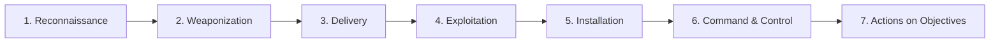
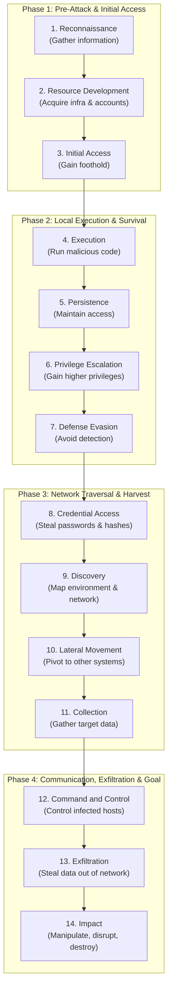

# Volume 04: Core Ethical Hacking
# Special Master Guide: Cyber Threat Frameworks — Lockheed Martin Cyber Kill Chain® & MITRE ATT&CK® Matrix
## An Authoritative Reference Covering Adversarial Behavioral Modeling, Tactics, Techniques, Procedures (TTPs), Detection Engineering & the Pyramid of Pain

---

## 1. Executive Summary & Foundational Overview

In the early decades of information security, defensive operations were largely reactive and signature-based. Antivirus engines scanned disks for static file hashes, firewalls filtered single IP addresses, and intrusion detection systems looked for exact string matches.

This reactive posture failed against modern advanced persistent threats (APTs) and sophisticated ransomware syndicates. Attackers easily bypass hash-based and IP-based defenses by recompiling binaries, altering single bytes (polymorphism), or spinning up disposable cloud infrastructure.

To build resilient defensive postures and conduct high-fidelity penetration testing, security operations transitioned to **Adversarial Behavioral Modeling**. Instead of focusing on *what* artifact an attacker leaves behind, modern cybersecurity analyzes *how* an attacker operates: their **Tactics, Techniques, and Procedures (TTPs)**.

```
+----------------------------------------------------------------------------------------------------+
|                         THE EVOLUTION OF ADVERSARY THREAT MODELING                                 |
+------------------------------------+---------------------------------------------------------------+
| Legacy Reactive Security           | Modern Behavioral Security (CKC & MITRE ATT&CK)               |
+------------------------------------+---------------------------------------------------------------+
| • Focuses on static artifacts      | • Focuses on adversary behavior, goals, and execution patterns|
| • Indicators: Hashes, IPs, Domains | • Indicators: Tactics, Techniques, and Procedures (TTPs)      |
| • Trivial for attackers to bypass  | • Extremely costly and difficult for attackers to alter       |
| • Disconnected point-in-time scans | • Continuous lifecycle visibility across the attack chain     |
+------------------------------------+---------------------------------------------------------------+
```

---

## 2. David Bianco's Pyramid of Pain

Published in 2013 by cybersecurity investigator David Bianco, the **Pyramid of Pain** illustrates the direct relationship between the types of Indicators of Compromise (IoCs) security teams track and the amount of pain (financial cost, development time, and operational disruption) inflicted upon an adversary when that indicator is blocked.

```
                             /\
                            /  \
                           /    \
                          / TTPs \             <-- TOUGH! (Forces adversary to redesign operations)
                         /--------\
                        /  Tools   \           <-- Challenging (Must re-write/acquire new software)
                       /------------\
                      / Network/Host \         <-- Annoying (Must modify C2 profiles & registry keys)
                     /   Artifacts    \
                    /------------------\
                   /   Domain Names     \      <-- Simple (Must register new domains / change DNS)
                  /----------------------\
                 /      IP Addresses      \    <-- Easy (Must spin up a new $5 VPS / proxy)
                /--------------------------\
               /        Hash Values         \  <-- Trivial (Altering 1 bit changes MD5/SHA256 completely)
              +------------------------------+
```

### Deconstructing the Tiers of the Pyramid:
1. **Hash Values (Trivial)**: MD5, SHA-1, SHA-256 signatures of specific malware binaries. An adversary can bypass hash-based detection instantly by changing a single comment, compilation timestamp, or adding arbitrary padding bytes.
2. **IP Addresses (Easy)**: The IP address of a Command and Control (C2) server. Attackers use fast-flux DNS, Tor exit nodes, residential proxies, and disposable cloud servers; an IP address can be replaced in seconds.
3. **Domain Names (Simple)**: Domain names used for hosting payloads or C2 communication. Attackers use Domain Generation Algorithms (DGAs) to generate thousands of pseudo-random domains daily.
4. **Network & Host Artifacts (Annoying)**: Observable artifacts left on an infected operating system or wire trace (e.g., custom User-Agent strings, specific URI paths, registry keys, named pipes). Forcing an adversary to change these requires modifying their source code or C2 profile.
5. **Tools (Challenging)**: The software utilities the adversary relies on (e.g., Mimikatz, Cobalt Strike, Impacket, BloodHound, Chisel). If defenders detect the underlying operational mechanisms of the tool, the attacker must invest engineering hours creating or buying new software.
6. **TTPs (Tough!)**: The actual tactics, techniques, and procedures an attacker uses to achieve their mission (e.g., abusing Kerberos tickets via Kerberoasting, DLL search order hijacking, pass-the-hash). Blocking a technique invalidates an adversary's entire operational playbook and training, forcing them to invent completely new methodology.

---

## 3. The Lockheed Martin Cyber Kill Chain® (CKC)

Developed in 2011 by computer scientists at Lockheed Martin, the **Cyber Kill Chain** is adapted from the military concept of the "kill chain"—a structured, sequential model detailing the phases an attacker must complete to achieve an objective.

The core defensive thesis of the Cyber Kill Chain is:
> **An intrusion is a multi-step chain. If defenders break *any single link* in the chain, the entire attack fails.**



---

### 3.1 The Seven Sequential Phases in Depth

#### Phase 1: Reconnaissance
* **Adversary Activity**: The adversary gathers intelligence on the target organization to identify vulnerabilities, employee identities, email patterns, public-facing server software, and cloud infrastructure.
  - *Passive Recon*: OSINT, WHOIS queries, LinkedIn staff profiling, Certificate Transparency logs, GitHub source code leak searches.
  - *Active Recon*: Nmap port scanning, web application directory discovery, DNS zone transfers.
* **Defensive Controls**: Attack surface management, disabling DNS zone transfers, enforcing strict information classification, monitoring external paste sites, and threat intelligence alerts.

#### Phase 2: Weaponization
* **Adversary Activity**: The adversary pairs an exploit with a malicious payload (Remote Access Trojan / RAT) inside a deliverable file format. **This phase occurs entirely on the adversary's infrastructure without contacting the victim.**
  - Examples: Embedding a malicious VBA macro inside an Excel invoice document (`.xlsm`); compiling an executable with a shellcode runner; creating a weaponized PDF with an embedded CVE exploit.
* **Defensive Controls**: Threat intelligence sharing, analyzing adversary malware infrastructure, and securing software supply chains.

#### Phase 3: Delivery
* **Adversary Activity**: The adversary transmits the weaponized payload into the targeted enterprise environment.
  - Delivery vectors: Spear-phishing email with malicious attachment; phishing email with malicious hyperlink; infected USB drives dropped in parking lots; watering hole attacks (compromising websites frequently visited by target staff).
* **Defensive Controls**: Secure Email Gateways (SEG) with attachment sandboxing; DMARC/SPF/DKIM enforcement; web proxy content filtering; user security awareness training.

#### Phase 4: Exploitation
* **Adversary Activity**: The delivered payload executes, triggering a vulnerability in software, operating systems, hardware, or human behavior.
  - Technical: Exploiting a zero-day or unpatched flaw in Microsoft Office, Adobe Reader, or browser rendering engines; executing a memory buffer overflow.
  - Human: Tricking the user into clicking "Enable Content" or "Run Anyway" on a macro-enabled file.
* **Defensive Controls**: Host-based defenses (EDR), hardware-enforced memory protections (DEP, ASLR, Control Flow Guard - CFG), disabling Office macros globally via Group Policy, patch management.

#### Phase 5: Installation
* **Adversary Activity**: The adversary establishes permanent persistence on the compromised victim asset so that rebooting the machine or logging out does not terminate their access.
  - Techniques: Creating a Windows Scheduled Task; registering an autostart Registry Run key; creating a malicious Windows Service; planting a Linux cron job or systemd unit; installing a web shell on an internal IIS/Apache server.
* **Defensive Controls**: File Integrity Monitoring (FIM), Sysmon telemetry monitoring service/task creation, application allowlisting (AppLocker / Windows Defender Application Control - WDAC), unprivileged local accounts.

#### Phase 6: Command and Control (C2)
* **Adversary Activity**: The installed malware opens a secure, two-way communication channel back to the adversary's listening infrastructure over the Internet. The attacker can now issue remote commands, upload tools, and download data.
  - Channels: Encrypted HTTPS beacons mimicking normal web browsing, DNS tunneling (exfiltrating data in DNS query labels), WebSocket streams, or public cloud services (Slack, Discord, Telegram bots).
* **Defensive Controls**: Egress firewall filtering, Next-Generation Firewall (NGFW) SSL/TLS inspection, DNS query logging, detecting periodic beaconing intervals using Zeek, proxy authentication.

#### Phase 7: Actions on Objectives
* **Adversary Activity**: With full access established, the adversary accomplishes the actual goal of their intrusion campaign:
  - **Data Theft / Espionage**: Stealing proprietary intellectual property, customer credit cards, or source code (exfiltration).
  - **Extortion & Disruption**: Deploying enterprise-wide ransomware to encrypt file servers, backups, and hypervisors.
  - **Identity Compromise**: Dumping domain controller credentials (Active Directory NTDS.dit) to achieve complete domain dominance.
* **Defensive Controls**: Network micro-segmentation, Data Loss Prevention (DLP) gateways, immutable offline backups, honeypots, canary tokens, and rapid incident containment playbooks.

---

### 3.2 Architectural Strengths & Limitations of the Cyber Kill Chain
* **Strengths**:
  - Clear, intuitive, linear model accessible to executive leadership and boardrooms.
  - Emphasizes that perimeter defense must be layered: failing to block Phase 3 (Delivery) does not mean the breach succeeds if Phase 4 (Exploitation) is blocked by EDR.
* **Limitations**:
  - **Perimeter-Centric**: Assumes a classic corporate network with a well-defined border. Does not model modern insider threats, cloud-native architectures, or supply chain compromises (e.g., SolarWinds).
  - **Lacks Internal Granularity**: Lumps lateral movement, privilege escalation, credential dumping, and internal discovery into the final vague phase ("Actions on Objectives").

---

## 4. The MITRE ATT&CK® Framework

To overcome the linear limitations of the Cyber Kill Chain, the **MITRE Corporation** introduced the **ATT&CK (Adversarial Tactics, Techniques, and Common Knowledge)** framework in 2013.

Rather than a linear pipeline, MITRE ATT&CK is a **multi-dimensional, structured matrix** documenting the real-world behaviors, tools, and technical procedures observed in actual nation-state APT and cybercriminal campaigns.

```
+----------------------------------------------------------------------------------------------------+
|                                THE ATT&CK OPERATIONAL TAXONOMY                                     |
+------------------------------------+---------------------------------------------------------------+
| Layer                              | Description & Structural Hierarchy                            |
+------------------------------------+---------------------------------------------------------------+
| **Tactics** ("The Why")            | The adversary's high-level operational goal or objective.     |
| **Techniques** ("The How")         | The specific technical method used to achieve a tactic.       |
| **Sub-Techniques** ("The Specific")| A specialized, lower-level variation of a parent technique.  |
| **Procedures** ("The Execution")   | The exact command-line, code snippet, or tool syntax used.    |
+------------------------------------+---------------------------------------------------------------+
```

*Example Hierarchy*:
* **Tactic**: Credential Access (`TA0006`)
  * **Technique**: OS Credential Dumping (`T1003`)
    * **Sub-Technique**: LSASS Memory (`T1003.001`)
      * **Procedure**: `procdump.exe -ma lsass.exe lsass.dmp` or Mimikatz `sekurlsa::logonpasswords`.

---

### 4.1 The 14 Enterprise Tactics (In Sequential Operational Order)



---

### 4.2 Comprehensive Deep Dive: The 14 Enterprise Tactics

| # | Tactic ID & Name | Adversary Goal ("The Why") | Key High-Priority Techniques & IDs |
| :-: | :--- | :--- | :--- |
| **1** | **TA0043: Reconnaissance** | Gather target intelligence to plan future campaign operations. | • `T1595` Active Scanning (IP blocks, ports)<br/>• `T1596` Search Open Technical Databases (DNS, WHOIS)<br/>• `T1589` Gather Victim Identity Information |
| **2** | **TA0042: Resource Development**| Establish and acquire physical/virtual resources (infrastructure, accounts). | • `T1583` Acquire Infrastructure (Domains, VPS, Botnets)<br/>• `T1588` Obtain Capabilities (Exploits, Certificates)<br/>• `T1584` Compromise Infrastructure |
| **3** | **TA0001: Initial Access** | Gain an initial entry foothold inside the target enterprise network. | • `T1566` Phishing (Spearphishing attachments, links)<br/>• `T1190` Exploit Public-Facing Application (Log4j, VPN CVEs)<br/>• `T1078` Valid Accounts |
| **4** | **TA0002: Execution** | Run attacker-controlled code on a local or remote target system. | • `T1059` Command and Scripting Interpreter (PowerShell, Bash)<br/>• `T1204` User Execution (Malicious files, links)<br/>• `T1047` Windows Management Instrumentation (WMI) |
| **5** | **TA0003: Persistence** | Maintain access across system reboots, credential changes, and interruptions. | • `T1053` Scheduled Task/Job (Cron, Windows Tasks)<br/>• `T1547` Boot or Logon Autostart Execution (Registry Run keys)<br/>• `T1136` Create Account |
| **6** | **TA0004: Privilege Escalation**| Elevate permissions from standard user to SYSTEM, root, or Domain Admin. | • `T1548` Abuse Elevation Control Mechanism (UAC bypass, sudo)<br/>• `T1068` Exploitation for Privilege Escalation (Kernel CVEs)<br/>• `T1543` Create or Modify System Process |
| **7** | **TA0005: Defense Evasion** | Conceal malicious presence and avoid detection by security tools (EDR/AV). | • `T1027` Obfuscated/Encrypted Files or Information<br/>• `T1070` Indicator Removal on Host (Clear event logs)<br/>• `T1562` Impair Defenses (Disable Windows Defender, EDR) |
| **8** | **TA0006: Credential Access** | Steal passwords, cryptographic keys, hashes, and Kerberos tickets. | • `T1003` OS Credential Dumping (LSASS, SAM, `/etc/shadow`)<br/>• `T1110` Brute Force (Password spraying)<br/>• `T1558` Steal or Forge Kerberos Tickets (Kerberoasting) |
| **9** | **TA0007: Discovery** | Interrogate the internal environment to observe network and system layout. | • `T1087` Account Discovery (Enumerate domain users)<br/>• `T1046` Network Service Discovery (Internal port scanning)<br/>• `T1082` System Information Discovery |
| **10**| **TA0008: Lateral Movement** | Move through the internal network from one compromised host to another. | • `T1021` Remote Services (SMB/Windows Admin Shares, RDP, SSH)<br/>• `T1550` Use Alternate Authentication Material (Pass-the-Hash)<br/>• `T1570` Lateral Tool Transfer |
| **11**| **TA0009: Collection** | Locate and assemble target files and data prior to exfiltration. | • `T1005` Data from Local System (Searching for `.docx`, `.xlsx`)<br/>• `T1114` Email Collection (Interrogating Outlook/Exchange)<br/>• `T1560` Archive Collected Data (ZIP, RAR, 7z compression) |
| **12**| **TA0011: Command & Control**| Communicate with compromised systems to send instructions and maintain control. | • `T1071` Application Layer Protocol (HTTPS, DNS, WebSockets)<br/>• `T1572` Protocol Tunneling (SSH/Chisel tunneling)<br/>• `T1090` Proxy (Multi-hop external proxy networks) |
| **13**| **TA0010: Exfiltration** | Transmit sensitive collected data out of the enterprise network to attacker. | • `T1041` Exfiltration Over C2 Channel<br/>• `T1567` Exfiltration Over Web Service (Cloud buckets, Mega.nz)<br/>• `T1048` Exfiltration Over Alternative Protocol |
| **14**| **TA0040: Impact** | Disrupt availability, destroy integrity, or extort the victim organization. | • `T1486` Data Encrypted for Impact (Ransomware encryption)<br/>• `T1485` Data Destruction (Wiper malware)<br/>• `T1489` Service Stop (Terminating SQL, hypervisor services) |

---

## 5. Comparative Analysis: Cyber Kill Chain vs. MITRE ATT&CK

Understanding the distinct roles of both frameworks is essential for any cybersecurity professional:

| Comparison Dimension | Lockheed Martin Cyber Kill Chain® | MITRE ATT&CK® Framework |
| :--- | :--- | :--- |
| **Structural Paradigm** | **Linear Pipeline**: Rigid 7-phase chronological sequence. | **Non-Linear Matrix**: Relational matrix of tactics and techniques. |
| **Perspective** | **Perimeter-Focused**: How to break in from the outside. | **Post-Compromise Focused**: How attackers move *inside* after breach. |
| **Granularity** | **High-Level / Abstract**: Broad operational phases. | **Deeply Granular**: Hundreds of specific techniques and sub-techniques. |
| **Flexibility** | Rigid: Assumes every intrusion follows phases 1 through 7. | Flexible: Adversaries can execute tactics in any order, skip, or repeat. |
| **Primary Audience** | CISOs, Executive Leadership, High-Level Strategy. | SOC Analysts, Threat Hunters, Red Teamers, Detection Engineers. |
| **Defense Alignment** | Strategic defense-in-depth across the ingress path. | Granular mapping of telemetry (Sysmon, Event IDs) and Sigma rules. |

---

## 6. Operational Security Applications

### 6.1 Threat Hunting & Detection Engineering
Security Operations Centers (SOC) use MITRE ATT&CK as a common language to map their detection coverage.
* Rather than asking *"Are we secure against ransomware?"*, engineers ask:
  *"Do we have telemetry and alerting for `T1059.001` (PowerShell execution with base64 encoded parameters) and `T1003.001` (LSASS process memory dumping)?"*

### 6.2 Visualizing Coverage with the MITRE ATT&CK Navigator
The **ATT&CK Navigator** is a web-based matrix visualization tool used by blue and purple teams:
* **Red Team Layer**: Colors techniques successfully executed during a penetration test in Red.
* **Blue Team Layer**: Colors techniques with confirmed SIEM detection rules in Green.
* **Overlay Analysis**: Highlights coverage gaps (unmonitored techniques that attackers successfully used) in Yellow, establishing an empirical remediation roadmap.

### 6.3 MITRE D3FEND™: The Defensive Counterpart
While ATT&CK documents adversary techniques, MITRE developed **D3FEND** as an ontology of defensive cybersecurity techniques:
* Maps specific defensive capabilities (e.g., *Process Spawning Analysis*, *Decoy File*, *Certificate Pinning Verification*) directly to the ATT&CK techniques they mitigate.

---

## 7. Knowledge Check & Scenario Analysis

### Scenario: The Ransomware Incident
*An attacker sends an email with a password-protected ZIP containing a shortcut file (`invoice.lnk`). The employee opens the shortcut, which launches PowerShell to download `agent.exe` from a remote server. The agent injects shellcode into `explorer.exe`, adds a Registry Run key, executes `vssadmin.exe delete shadows`, runs Mimikatz to dump memory, connects via SMB to the domain controller, and encrypts network file shares.*

#### Mapping to Frameworks:

```
+----------------------------------------------------------------------------------------------------+
|                                      SCENARIO MAPPING ANALYSIS                                     |
+--------------------------+------------------------------+------------------------------------------+
| Attack Action            | Cyber Kill Chain Phase       | MITRE ATT&CK Tactic & Technique          |
+--------------------------+------------------------------+------------------------------------------+
| Phishing email with ZIP  | Phase 3: Delivery            | TA0001: Initial Access (T1566.001)       |
| User clicks .lnk file    | Phase 4: Exploitation        | TA0002: Execution (T1204.002)            |
| PowerShell download      | Phase 2/3: Weaponization/Del | TA0002: Execution (T1059.001)            |
| Injects into explorer    | Phase 5: Installation        | TA0005: Defense Evasion (T1055)          |
| Registry Run key added   | Phase 5: Installation        | TA0003: Persistence (T1547.001)          |
| Deletes Volume Shadows   | Phase 7: Actions on Obj      | TA0040: Impact (T1490 Inhibit Recovery)  |
| Mimikatz memory dump     | Phase 7: Actions on Obj      | TA0006: Credential Access (T1003.001)    |
| SMB lateral pivot to DC  | Phase 7: Actions on Obj      | TA0008: Lateral Movement (T1021.002)     |
| Encrypts file shares     | Phase 7: Actions on Obj      | TA0040: Impact (T1486 Data Encrypted)    |
+--------------------------+------------------------------+------------------------------------------+
```

---

## 8. Curriculum Learning Roadmap

With mastery of the Cyber Kill Chain and the MITRE ATT&CK matrix:

* **Operationalize Reconnaissance**: Explore [Module 06: Information Gathering & OSINT](../Volume_03_Reconnaissance_OSINT_and_Enumeration/Module_06_Information_Gathering_and_Footprinting.md) to audit adversary reconnaissance techniques (`TA0043`).
* **Audit System Defense & Persistence**: Continue to [Module 14: System Security & Host Defense](../Volume_10_Malware_Wireless_IoT_and_Advanced_Security/Module_14_System_Security_and_Host_Defense.md) to evaluate Registry Run keys (`T1547`) and unquoted service paths (`T1543`).
* **Execute Lateral Movement**: Advance to [Module 32: Network Penetration Testing Execution](../Volume_07_Network_Penetration_Testing/Module_32_Network_Penetration_Testing_Execution.md) to audit Pass-the-Hash (`T1550`) and Kerberoasting (`T1558.003`).
