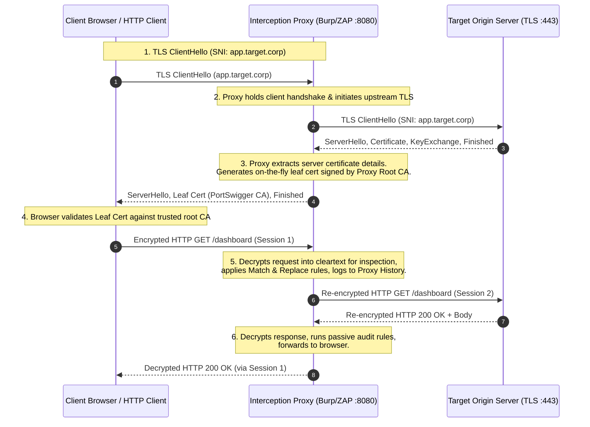

# Volume 05: Web Security Foundations
# Module 29: Web Application Security Assessment Tools & Interception Proxies

---

## 1. Learning Objectives

By completing this module, professional security auditors, application security engineers, and penetration testers will be able to:
1. **Architect & Deploy Interception Proxies**: Configure, operate, and troubleshoot Burp Suite Professional, OWASP ZAP, and Caido across complex enterprise environments.
2. **Implement Root CA Trust Anchors**: Correctly generate, install, and audit custom Root Certificate Authority (CA) trust anchors across operating system keychains, web browsers, and client applications.
3. **Master Advanced Protocol Interception**: Intercept, decode, and manipulate modern HTTP/1.1, HTTP/2, WebSocket (RFC 6455), and Server-Sent Events (SSE) traffic streams.
4. **Execute Calibrated Fuzzing Workflows**: Perform high-speed directory, parameter, and virtual host discovery using `ffuf` while eliminating soft-404 and WAF-rate-limit false positives.
5. **Conduct Out-of-Band Application Security Testing (OAST)**: Implement asynchronous and blind vulnerability verification using Burp Collaborator and self-hosted DNS/HTTP listener architectures.
6. **Correlate Passive Attack Surfaces**: Aggregate historical endpoint datasets using `gau`, `waybackurls`, and `httpx` to uncover unlinked administrative APIs and parameter boundaries.

---

## 2. Prerequisites & Operational Requirements

To successfully master the concepts and practical exercises in this module, engineers require:
* **Networking & HTTP Protocols**: Deep familiarity with RFC 9112 (HTTP/1.1), RFC 9113 (HTTP/2), headers, status codes, and TLS handshakes (covered in [Module 21](file:///home/kali/Ethical_Hacking_VAPT_Master_Notes/Volume_05_Web_Security_Foundations/Module_21_Web_Security_Foundations.md)).
* **Local Proxy Configuration**: Proficiency in configuring browser proxy routing (FoxyProxy, OS network settings, SOCKS5 chains).
* **Command-Line Tooling**: Working installations of `ffuf`, `httpx`, `curl`, and Python 3.8+ on Kali Linux or a hardened Debian-based testing environment.

---

## 3. What Is It? (Architecture & Definitions)

Web application security assessment tools comprise a spectrum of manual inspection frameworks, dynamic fuzzers, and automated analysis utilities designed to evaluate web services across their entire attack surface.

While automated Dynamic Application Security Testing (DAST) scanners rapidly test for known syntax-based signatures, manual auditing hinges upon **Interception Proxies** (primarily Burp Suite Professional, OWASP ZAP, and Caido). An interception proxy operates as a stateful Man-in-the-Middle (MitM) agent positioned directly between the client user agent and the backend target infrastructure. This architecture provides the security auditor with granular visibility and deterministic control over every byte of raw HTTP headers, query parameters, multipart bodies, and WebSocket frames.

---

## 4. Deep Architecture: Dynamic TLS Interception & Proxy Workbenches



### 4.1 The Dynamic TLS Interception Mechanism
1. **Root CA Generation**: Upon installation, the interception proxy generates an RSA-2048 or ECC private key and self-signed Root CA certificate.
2. **Trust Anchor Enrollment**: The auditor imports this Root CA certificate into the client operating system or browser trusted root store.
3. **Upstream Handshake**: When an outbound HTTPS request occurs, the proxy terminates the client connection, observes the Server Name Indication (SNI), and establishes an independent upstream TLS connection to the origin server.
4. **On-the-Fly Leaf Certificate Synthesis**: The proxy dynamically synthesizes a leaf X.509 certificate matching the requested Subject Alternative Name (SAN), signs it with its internal Root CA, and returns it to the client.
5. **Cleartext Decryption**: Because the browser trusts the proxy's Root CA, the synthetic certificate is accepted without warnings, exposing the cleartext HTTP data stream for manual modification.

---

## 5. How It Works: Interception & Tooling Engines

### 5.1 Interception Proxy Component Breakdown

```
+----------------------------------------------------------------------------------------------------+
|                                    BURP SUITE PROFESSIONAL CORE                                    |
+----------------------------------------------------------------------------------------------------+
|  [ Proxy ]        Intercepts, logs, and modifies HTTP/HTTPS & WebSocket traffic in real time.      |
|  [ Repeater ]     Interactive workbench to manually edit, replay, and analyze individual requests.  |
|  [ Intruder ]     High-performance custom automation engine supporting 4 payload distribution modes.|
|  [ Collaborator ] Out-of-Band (OAST) server recording asynchronous DNS, HTTP, and SMTP callbacks.  |
|  [ Decoder ]      Transforms strings across Base64, URL, Hex, HTML, Gzip, and cryptographic hashes.|
|  [ Comparer ]     Visual word-by-word or byte-by-byte differential analysis between responses.     |
|  [ Logger ]       Complete chronological transaction stream with advanced regex filtering.         |
+----------------------------------------------------------------------------------------------------+
```

### 5.2 Burp Intruder Attack Modes

| Mode | Payload Sets | Position Behavior | Primary Use Case |
| :--- | :--- | :--- | :--- |
| **Sniper** | 1 Set | Tests each marked position sequentially; other positions retain baseline values. | Boundary value testing, single-parameter fuzzing, XSS/SQLi injection checks. |
| **Battering Ram** | 1 Set | Places the identical payload into all marked positions simultaneously. | Synchronized field testing (e.g., verifying `username == password`). |
| **Pitchfork** | Multiple Sets | Iterates payload sets in parallel (Set 1 Pos 1, Set 2 Pos 2) until shortest list ends. | Testing paired credentials (`user_list.txt` alongside `known_hashes.txt`). |
| **Cluster Bomb** | Multiple Sets | Iterates every possible permutation combinatorially ($N \times M$ requests). | Brute-forcing unknown username and password combinations. |

---

## 6. Security Perspective: Automated Scanners vs. Manual Auditing

```
+------------------------+------------------------------------+------------------------------------+
| Evaluation Dimension   | Automated DAST Scanners            | Manual Interception Testing        |
+------------------------+------------------------------------+------------------------------------+
| Assessment Speed       | Tests thousands of URLs/hour.      | Focused, surgical, and contextual. |
| Multi-Step Business    | Incapable of understanding logic   | Easily traces multi-step state     |
| Workflows              | transitions, MFA, or state skips.  | transitions (e.g., cart -> pay).   |
| Broken Object Level    | Fails to distinguish between valid | Trivial: Swaps user ID tokens in   |
| Authorization (BOLA)   | authorized vs. unauthorized data.  | Repeater to verify access control. |
| WAF & Rate Limit       | Rapidly triggers IP bans and rate- | Calibrated pacing and customized   |
| Evasion                | limiting thresholds.               | headers bypass volumetric traps.   |
| False Positive Ratio   | High; flags benign reflections     | Near zero; every finding is        |
|                        | without contextual proof.          | manually verified with benign PoC. |
+------------------------+------------------------------------+------------------------------------+
```

---

## 7. Auditing Methodology: The Standard Interception Workflow

```
[ Phase 1: Scope & Project Configuration ]
      | Define strict Target Scope regex; exclude logout, deletion, and third-party CDNs.
      v
[ Phase 2: Passive Application Walking ]
      | Browse every legitimate UI workflow as a low-privilege user; build complete site tree.
      v
[ Phase 3: Attack Surface Expansion ]
      | Mine client JavaScript bundles (ffuf / gau / httpx) for unlinked REST endpoints.
      v
[ Phase 4: Match & Replace Calibration ]
      | Configure proxy rules to auto-inject authorization headers or spoof mobile user-agents.
      v
[ Phase 5: Targeted Parameter & Logic Fuzzing ]
      | Send candidate requests to Repeater/Intruder; execute boundary probing and race testing.
      v
[ Phase 6: Out-of-Band Verification (OAST) ]
      | Inject Burp Collaborator subdomains into asynchronous headers (Referer, Host, Webhooks).
```

---

## 8. Tooling Deep-Dive: Core Assessment Utilities

### 8.1 Advanced `ffuf` Command Reference

```bash
# 1. Calibrated directory fuzzing filtering soft-404 responses by byte size
ffuf -u https://target.corp/FUZZ \
     -w /usr/share/seclists/Discovery/Web-Content/raft-medium-directories.txt \
     -mc 200,301,302,401,403 \
     -fs 1240 \
     -rate 25 \
     -H "User-Agent: SecurityAuditEngine/1.0" \
     -o ffuf_dirs.json -of json

# 2. Virtual Host (vHost) discovery via Host header fuzzing
ffuf -u https://target.corp/ \
     -H "Host: FUZZ.target.corp" \
     -w /usr/share/seclists/Discovery/DNS/subdomains-top1million-5000.txt \
     -fs 15320 \
     -t 30

# 3. Hidden parameter discovery on REST API endpoints
ffuf -u "https://target.corp/api/v1/user?FUZZ=test" \
     -w /usr/share/seclists/Discovery/Web-Content/burp-parameter-names.txt \
     -mc 200 \
     -fs 84
```

### 8.2 Passive Attack Surface Aggregation: `gau` and `httpx`

```bash
# Fetch historical URLs from Wayback Machine, Common Crawl, and AlienVault
gau target.corp --threads 10 | grep -E "\.(action|api|json|php|aspx)$" | sort -u > raw_historical.txt

# Probe for active live endpoints, extracting titles, status codes, and tech stacks
httpx -l raw_historical.txt \
      -status-code \
      -title \
      -tech-detect \
      -content-length \
      -threads 40 \
      -o live_endpoints.txt
```

---

## 9. Practical Lab: Standalone Fuzzing Calibration & Proxy Engine

Deploy this standalone script to practice soft-404 baseline calibration, differential response analysis, and multi-endpoint discovery without external network dependencies.

Save as [`labs/module_29/fuzz_and_proxy_engine.py`](file:///home/kali/Ethical_Hacking_VAPT_Master_Notes/labs/module_29/fuzz_and_proxy_engine.py):

```python
#!/usr/bin/env python3
"""
================================================================================
MODULE 29 LAB: WEB SECURITY AUDITING PROXY & FUZZING CALIBRATION ENGINE
PURPOSE: Demonstrates programmatic HTTP proxy inspection, soft-404 differential
         analysis, header match/replace injection, and calibrated path fuzzing.
COMPLIANCE: Authorized testing only / Standard benign HTTP boundary probing.
================================================================================
"""

import http.server
import threading
import urllib.request
import urllib.error
import ssl
import sys
import time

class MockApplicationServer(http.server.BaseHTTPRequestHandler):
    """Simulates an enterprise web application with hidden routes, soft-404, and debug APIs."""
    def log_message(self, format, *args):
        pass

    def do_GET(self):
        # Admin / Debug endpoints
        if self.path == "/api/v1/internal_debug":
            self.send_response(200)
            self.send_header("Content-Type", "application/json")
            self.send_header("X-App-Env", "staging")
            self.end_headers()
            self.wfile.write(b'{"status": "ok", "mode": "debug", "endpoints": ["/metrics", "/config_dump"]}')
            return
        elif self.path == "/admin_console_v2":
            self.send_response(200)
            self.send_header("Content-Type", "text/html")
            self.end_headers()
            self.wfile.write(b"<html><head><title>Admin Portal</title></head><body><h1>Privileged Control Portal</h1></body></html>")
            return
        elif self.path == "/robots.txt":
            self.send_response(200)
            self.send_header("Content-Type", "text/plain")
            self.end_headers()
            self.wfile.write(b"User-agent: *\nDisallow: /admin_console_v2\nDisallow: /api/v1/internal_debug\n")
            return

        # Soft-404 behavior: Returns HTTP 200 with standard custom not-found template
        self.send_response(200)
        self.send_header("Content-Type", "text/html")
        self.end_headers()
        self.wfile.write(b"<html><body><h1>Custom Error: Page Not Found</h1><p>The requested resource does not exist on this server.</p></body></html>")

def calibrate_soft_404_baseline(base_url):
    """Sends queries to random non-existent endpoints to determine soft-404 size baseline."""
    canary_paths = [
        "/non_existent_boundary_check_a1b2c3d4",
        "/random_canary_test_9876543210_chk",
        "/probe_baseline_differential_eval_xyz"
    ]
    baselines = []
    ctx = ssl.create_default_context()
    ctx.check_hostname = False
    ctx.verify_mode = ssl.CERT_NONE

    print("[*] Calibrating soft-404 baseline against target...")
    for path in canary_paths:
        target = f"{base_url.rstrip('/')}{path}"
        req = urllib.request.Request(target, headers={"User-Agent": "SecurityAuditEngine/1.0"})
        try:
            with urllib.request.urlopen(req, timeout=5, context=ctx) as resp:
                body = resp.read()
                length = len(body)
                baselines.append((resp.status, length))
                print(f"    - Canary probe: '{path}' -> HTTP {resp.status} (Length: {length} bytes)")
        except urllib.error.HTTPError as e:
            baselines.append((e.code, len(e.read())))
            print(f"    - Canary probe: '{path}' -> HTTP {e.code}")
        except Exception as err:
            print(f"    - Canary probe failed: {err}")

    if baselines:
        lengths = [b[1] for b in baselines]
        if len(set(lengths)) == 1:
            print(f"[+] Static soft-404 baseline confirmed: {lengths[0]} bytes (Status: {baselines[0][0]})")
            return lengths[0]
    return None

def execute_calibrated_fuzzing(base_url, wordlist, soft_404_size=None):
    """Executes path discovery while dynamically filtering out soft-404 anomalies."""
    print("\n" + "=" * 72)
    print(f"[*] EXECUTING CALIBRATED PATH DISCOVERY: {base_url}")
    print(f"[*] Filter Size Rule: Skip responses matching length {soft_404_size} bytes")
    print("=" * 72)

    ctx = ssl.create_default_context()
    ctx.check_hostname = False
    ctx.verify_mode = ssl.CERT_NONE

    discovered = []
    for word in wordlist:
        path = f"/{word.lstrip('/')}"
        target = f"{base_url.rstrip('/')}{path}"
        req = urllib.request.Request(target, headers={
            "User-Agent": "SecurityAuditEngine/1.0",
            "X-Audit-Purpose": "Authorized-VAPT-Verification"
        })
        try:
            with urllib.request.urlopen(req, timeout=5, context=ctx) as resp:
                content = resp.read()
                length = len(content)
                status = resp.status

                if soft_404_size and length == soft_404_size:
                    continue

                content_preview = content[:40].decode("utf-8", errors="ignore").replace("\n", " ")
                print(f"[+] DISCOVERED: {path:30s} | HTTP {status} | Size: {length:5d} bytes | Preview: {content_preview}...")
                discovered.append((path, status, length))
        except urllib.error.HTTPError as e:
            if e.code in [301, 302, 401, 403]:
                print(f"[+] DISCOVERED (Auth/Redirect): {path:30s} | HTTP {e.code}")
                discovered.append((path, e.code, 0))
        except Exception:
            pass

    print("\n" + "=" * 72)
    print(f"[+] CALIBRATED FUZZING COMPLETE. Valid Discovered Endpoints: {len(discovered)}")
    print("=" * 72)
    return discovered
```

---

## 10. Evidence & Verification: Eliminating False Positives

### 10.1 Soft-404 Differential Analysis Table

When assessing single-page applications (SPAs) or custom enterprise web frameworks, servers frequently return `HTTP 200 OK` for non-existent paths, rendering status code matchers (`-mc 200`) useless.

| Injected Path | Status Code | Byte Size | Differential Assessment | Auditor Decision |
| :--- | :--- | :--- | :--- | :--- |
| `/random_canary_01` | `200 OK` | 1,240 B | Standard SPA router fallback HTML | **Filter Baseline (`-fs 1240`)** |
| `/random_canary_02` | `200 OK` | 1,240 B | Identical length and word count | **Filter Baseline** |
| `/api/v1/internal_debug` | `200 OK` | 184 B | Length differs; Content-Type is `application/json` | **VALID DISCOVERY** |
| `/admin_console_v2` | `200 OK` | 2,890 B | Length differs; Contains `<title>Admin</title>` | **VALID DISCOVERY** |

---

## 11. Telemetry & Defensive Detection

### 11.1 NGINX Access Log Signatures of Uncalibrated Fuzzing

```text
198.51.100.50 - - [05/Sep/2026:11:00:01 +0000] "GET /admin HTTP/1.1" 404 142 "-" "Fuzz Faster U Fool v2.0.0"
198.51.100.50 - - [05/Sep/2026:11:00:01 +0000] "GET /api HTTP/1.1" 404 142 "-" "Fuzz Faster U Fool v2.0.0"
198.51.100.50 - - [05/Sep/2026:11:00:01 +0000] "GET /backup HTTP/1.1" 404 142 "-" "Fuzz Faster U Fool v2.0.0"
```

### 11.2 Suricata Intrusion Detection Rule

```suricata
alert http any any -> $HTTP_SERVERS any (
    msg:"SEC-AUDIT - Automated Web Fuzzer Signature Detected";
    flow:established,to_server;
    http.user_agent; content:"Fuzz Faster U Fool"; nocase;
    threshold: type limit, track by_src, count 1, seconds 300;
    classtype:web-application-attack;
    sid:2000029; rev:2;
)
```

---

## 12. Mitigation & Secure Implementation

1. **RFC-Compliant Status Codes**: Ensure web application routing engines return standard `HTTP 404 Not Found` or `HTTP 410 Gone` for non-existent resources rather than `HTTP 200 OK` soft-404 templates.
2. **Reverse Proxy Rate Limiting**: Implement leaky-bucket or token-bucket rate limiting at NGINX, Cloudflare, or AWS WAF layers to constrain unauthenticated route enumeration to manageable thresholds (e.g., 20 req/sec per /24 subnet).
3. **Internal Interface Segregation**: Isolate administrative, debugging, and actuator endpoints (`/actuator/**`, `/swagger-ui/**`, `/metrics`) behind internal management VLANs or require mutual TLS (mTLS).

---

## 13. CIS & NIST Hardening Controls

| Control Identifier | Framework | Technical Requirement | Hardening Action |
| :--- | :--- | :--- | :--- |
| **NIST SP 800-115 §4.2** | NIST | Proxy Listener Isolation | Restrict proxy listeners to loopback (`127.0.0.1:8080`); disable public interface bindings. |
| **CIS NGINX Benchmark 2.4** | CIS | Error Handling Hardening | Configure explicit `error_page 404 /custom_404.html;` returning true HTTP 404 status. |
| **OWASP ASVS §13.1** | OWASP | Generic Error Disclosure | Strip internal framework stack traces, server banners, and debug flags from 4xx/5xx responses. |
| **NIST SP 800-53 SC-8** | NIST | Transmission Confidentiality | Enforce strict TLS 1.3/1.2 ciphers; enforce HSTS with `max-age=31536000; includeSubDomains`. |

---

## 14. Real-World Case Studies

### Case Study: High-Value Blind SSRF via Out-of-Band Burp Collaborator
During an authorized security audit of an enterprise SaaS invoicing platform, an auditor identified an unauthenticated webhook subscription route `POST /api/v1/integrations/webhook`.
* The application accepted arbitrary webhook URLs and returned `HTTP 202 Accepted` immediately, displaying zero in-band response data.
* The auditor injected a unique Burp Collaborator domain `https://wk89j2...oastify.com` into the `callback_url` parameter.
* Two minutes later, Burp Collaborator registered an incoming DNS lookup followed by an HTTP POST request originating from an internal AWS EC2 instance located within a private management VPC.
* The auditor verified that the internal worker was executing requests to unauthenticated URLs without authorization boundaries, providing a verified finding without causing service disruption.

---

## 15. Common Pitfalls & Anti-Patterns

```
❌ ANTI-PATTERN 1: Running Scanners with Default Aggressive Threading
   Running Nikto or Burp Scanner at 50 threads against production staging.
   Triggers web application firewall (WAF) IP bans, crashes fragile backend databases, and degrades service.
   ✔ CORRECT: Calibrate request rates (-rate 10) and request auditor IP whitelisting from the client.

❌ ANTI-PATTERN 2: Binding Proxy Listeners to `0.0.0.0`
   Configuring Burp Suite to listen on all interfaces so mobile devices can connect over Wi-Fi.
   Leaves the auditor's local proxy and private certificate open to any device on the network.
   ✔ CORRECT: Bind to specific host IPs or utilize SSH port forwarding over USB.

❌ ANTI-PATTERN 3: Relying on Single Fuzzing Match Criteria
   Relying solely on `-mc 200` during directory enumeration.
   Produces thousands of false positives in single-page applications where all paths return HTTP 200.
   ✔ CORRECT: Use differential filtering (-fs, -fw, -fl) based on a calibrated canary baseline.
```

---

## 16. Professional vs. Naive Methodology

| Operational Phase | Naive / Novice Approach | Professional Application Security Auditor Approach |
| :--- | :--- | :--- |
| **Tool Execution** | Launches automated scanner and exports raw PDF report to the client. | Uses proxy to map application business logic; surgically verifies candidate defects with benign manual probes. |
| **Path Fuzzing** | Uses default wordlists; gets overwhelmed by 10,000 soft-404 results. | Establishes soft-404 canary baselines; calibrates `-fs` / `-fw` flags to isolate genuine anomalies. |
| **Parameter Auditing** | Guesses parameters manually in browser address bar. | Mines JavaScript source maps and historical archives (`gau`, `waybackurls`) to identify hidden parameters. |
| **Asynchronous Verification** | Assumes non-responsive endpoints are secure. | Injects unique OAST (Collaborator) identifiers to detect blind SSRF, XXE, and asynchronous processing bugs. |

---

## 17. Graded Knowledge Check & Interview Questions

### Beginner Level
1. **Question**: Why must a security auditor install Burp Suite's Root CA certificate into the browser before intercepting HTTPS traffic?
   * *Answer*: HTTPS relies on TLS certificates signed by trusted Certificate Authorities. Because the proxy intercepts and decrypts the connection, it dynamically generates synthetic certificates for requested domains. Without the proxy's Root CA in the browser's trust store, the browser displays fatal certificate warnings and aborts the connection.
2. **Question**: What is the difference between Burp Repeater and Burp Intruder?
   * *Answer*: Repeater is an interactive workbench designed for manual, single-request manipulation and immediate response analysis. Intruder is an automated fuzzer designed to test wordlists or payload sets across multiple marked parameter positions at scale.

### Intermediate Level
3. **Question**: Explain how an auditor discovers a "Soft-404" behavior during path enumeration, and how to calibrate `ffuf` to handle it.
   * *Answer*: The auditor queries a non-existent path (e.g., `/canary_test_abc123`). If the server returns `HTTP 200 OK` with a standard "Not Found" HTML page, the application exhibits soft-404 behavior. The auditor notes the exact response length (e.g., 1,240 bytes) and configures `ffuf` with `-fs 1240` to filter out identical responses.
4. **Question**: In Burp Intruder, what is the difference between a "Pitchfork" attack and a "Cluster Bomb" attack?
   * *Answer*: Pitchfork uses multiple payload sets in parallel, iterating through them simultaneously (Row 1 with Row 1, Row 2 with Row 2). Cluster Bomb tests every combination of payloads across all sets ($N \times M$), testing every payload in Set 1 against every payload in Set 2.

### Advanced / Scenario-Based
5. **Question**: You are auditing a banking application where the mobile app terminates TLS connections and displays a network error whenever your proxy is active, even though the Burp CA is installed in the device's system trust store. What security control is active, and how is it verified?
   * *Answer*: The application implements **Certificate Pinning** (or Public Key Pinning). The mobile client hardcodes the expected certificate hash or public key and rejects any certificate that does not match, even if signed by a trusted system CA. This is verified by checking application logs or using dynamic instrumentation frameworks (such as Frida or Objection) to hook TLS validation routines and observe the pinning check.

---

## 18. Progressive Hands-on Exercises

### Level 1: Proxy Setup & Trust Anchor Installation (Beginner)
* Install and launch Burp Suite Professional or OWASP ZAP.
* Configure your browser proxy to `127.0.0.1:8080`.
* Export the proxy CA certificate, import it into the browser certificate manager as a Trusted Root CA, and successfully capture an HTTPS session without security warnings.

### Level 2: Fuzzing Calibration & Path Discovery (Intermediate)
* Execute [`labs/module_29/fuzz_and_proxy_engine.py`](file:///home/kali/Ethical_Hacking_VAPT_Master_Notes/labs/module_29/fuzz_and_proxy_engine.py) to run the mock application server.
* Execute `ffuf` against `http://127.0.0.1:8890/FUZZ` using a wordlist without filters. Observe the soft-404 flood.
* Calibrate `ffuf` using `-fs <calibrated_size>` and cleanly discover `/admin_console_v2` and `/api/v1/internal_debug`.

### Level 3: Match & Replace Header Automation (Advanced)
* In Burp Suite Proxy Settings, create a Match & Replace rule that automatically injects a custom header (`X-Forwarded-For: 127.0.0.1` or a test authorization token) into all outgoing requests.
* Re-test access to a restricted API endpoint to evaluate whether the application trusts proxy headers for authentication decisions.

---

## 19. Key Takeaways

1. **Manual Inspection Is Irreplaceable**: Automated scanners cannot interpret complex application business logic, state machines, or authorization boundaries.
2. **Dynamic TLS Interception Relies on Trust**: Proxies decrypt HTTPS by generating on-the-fly leaf certificates signed by a locally trusted Root CA.
3. **Always Calibrate Fuzzers**: Soft-404 pages and SPA routers return `200 OK` for invalid paths; calibrating `-fs`, `-fw`, and `-fl` is mandatory.
4. **OAST Uncovers Blind Defects**: Out-of-Band testing (Burp Collaborator) is essential for detecting asynchronous and blind server-side vulnerabilities.
5. **Enforce Local Proxy Security**: Never bind proxy listeners to public IP interfaces (`0.0.0.0`) without authentication controls.

---

## 20. Authoritative References

* **PortSwigger Web Security Academy**: Interception Proxies and Fuzzing (`portswigger.net`).
* **OWASP Web Security Testing Guide (WSTG v4.2)**: Configuration and Deployment Management Testing (`WSTG-CONF-01`).
* **RFC 9112**: *HTTP/1.1*.
* **RFC 9113**: *HTTP/2*.
* **RFC 6455**: *The WebSocket Protocol*.
* **ffuf Official Documentation**: Fast Web Fuzzer (`github.com/ffuf/ffuf`).
* **NIST SP 800-115**: *Technical Guide to Information Security Testing and Assessment*.
