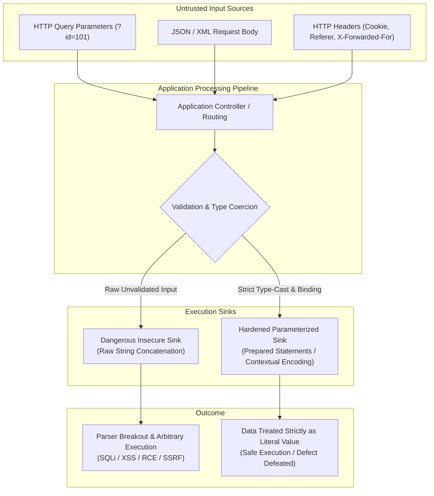
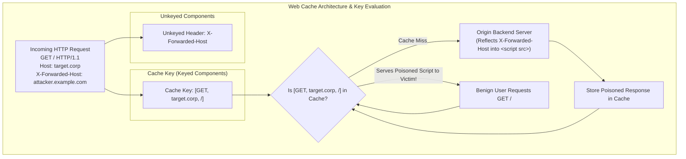
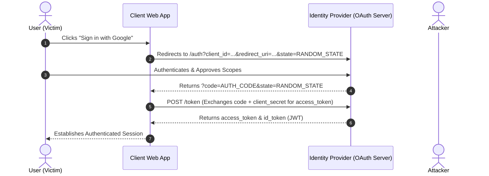

# Volume 06: Web Application VAPT
# Module 30: OWASP Top 10 Deep Dive & Vulnerability Engineering

---

## 1. Learning Objectives

By completing this module, application security engineers, penetration testers, and security auditors will be able to:
1. **Deconstruct the OWASP Top 10 Architecture**: Analyze the root cause mechanisms, attack surfaces, and threat models across all OWASP Top 10 categories.
2. **Formulate Benign Boundary Probes**: Construct non-destructive, benign test inputs for injection flaws (SQLi, Command Injection, XXE, SSTI) that verify defects without causing data loss or denial of service.
3. **Execute Access Control Matrix Audits**: Systematically detect Broken Object Level Authorization (BOLA/IDOR) and Broken Function Level Authorization (BFLA) across complex multi-tenant environments.
4. **Audit Client-Side Injection Defenses**: Trace data flows from untrusted inputs to DOM sinks, evaluating Reflected, Stored, and DOM-based Cross-Site Scripting (XSS) alongside Content Security Policy (CSP Level 3) defenses.
5. **Analyze Server-Side Request Forgery (SSRF)**: Map cloud metadata (IMDSv1 vs. IMDSv2) and internal service boundaries, evaluating DNS rebinding and TOCTOU vulnerabilities.
6. **Engineer Production-Ready Defenses**: Provide exact framework-specific remediation patches (parameterized queries, object-level tenancy checks, contextual output encoders).
7. **Audit Advanced Web Exploitation Vectors**: Detect and exploit Web Cache Poisoning (unkeyed headers), Web Cache Deception (path confusion), and OAuth 2.0/OIDC implementation flaws (state CSRF, redirect URI leakage, account takeover).

---

## 2. Prerequisites & Operational Requirements

To master the concepts in this module, engineers require:
* **HTTP & Session Foundations**: Mastery of HTTP status codes, headers, cookie flags (`Secure`, `HttpOnly`, `SameSite`), and CORS policies ([Module 21](file:///home/kali/Ethical_Hacking_VAPT_Master_Notes/Volume_05_Web_Security_Foundations/Module_21_Web_Security_Foundations.md)).
* **Interception Tooling**: Operational proficiency with Burp Suite Professional, OWASP ZAP, and `ffuf` ([Module 29](file:///home/kali/Ethical_Hacking_VAPT_Master_Notes/Volume_05_Web_Security_Foundations/Module_29_Web_Application_Security_Tools.md)).
* **Database & Architecture Literacy**: Understanding of relational databases (SQL execution plans), modern RESTful APIs, and cloud infrastructure metadata services.

---

## 3. What Is It? (Architecture & Definitions)

The **OWASP Top 10** represents the globally recognized consensus standard for critical security risks in web applications. Published periodically by the Open Web Application Security Project (OWASP), the ranking combines empirical vulnerability prevalence data gathered from commercial DAST/SAST scanners, bug bounty platforms, and enterprise security consultancies with expert consensus surveys.

In modern application security engineering, the OWASP Top 10 is not a mere compliance checkbox. It serves as an architectural taxonomy of structural flaws in software systems:
* **A01:2021 – Broken Access Control**: Authorization failure allowing unauthorized data access or privilege elevation.
* **A02:2021 – Cryptographic Failures**: Flaws in data-at-rest or data-in-transit protection.
* **A03:2021 – Injection**: Untrusted input altering execution semantics (SQLi, OS Command, XSS).
* **A04:2021 – Insecure Design**: Flaws inherent in architecture rather than code implementation.
* **A05:2021 – Security Misconfiguration**: Unhardened default settings, open cloud buckets, exposed debug flags.
* **A06:2021 – Vulnerable and Outdated Components**: Unpatched third-party libraries and dependencies.
* **A07:2021 – Identification and Authentication Failures**: Session fixation, credential stuffing, weak MFA.
* **A08:2021 – Software and Data Integrity Failures**: Unsigned updates, CI/CD pipeline flaws, insecure deserialization.
* **A09:2021 – Security Logging and Monitoring Failures**: Inadequate auditing and threat detection telemetry.
* **A10:2021 – Server-Side Request Forgery (SSRF)**: Backend fetching arbitrary remote/internal resources.

---

## 4. Deep Architecture: Source-to-Sink Execution Pipelines



### 4.1 Injection Mechanics: The Parser Context Confusion
Injection vulnerabilities occur when an interpreter cannot differentiate between code instructions and user-supplied data. When an application concatenates strings:
$$\text{Query} = \text{"SELECT * FROM accounts WHERE user = '"} + \text{input} + \text{"';"}$$
An input containing syntax boundaries (e.g., `' OR '1'='1`) shifts the input out of the **data literal context** and into the **syntactic command context**. In contrast, prepared statements compile the SQL abstract syntax tree (AST) beforehand; user data is transmitted via a distinct data protocol channel and bound directly to placeholder nodes, mathematically preventing parser breakout.

---

## 5. How It Works: Deconstructing High-Impact Vulnerability Classes

### 5.1 Broken Access Control (BOLA / IDOR)
* **CWE-639 / CWE-284**: Occurs when an application accepts an object identifier from the client (e.g., `/api/v1/invoices/1042`) and performs database operations without verifying that the requesting user's identity (`request.user.id` or `tenant_id`) owns or has explicit permission to access that object.
* **Architectural Flaw**: Relying on client-side routing or obscurity (such as GUIDs) rather than server-side relational authorization queries.

### 5.2 Server-Side Request Forgery (SSRF)
* **CWE-918**: Arises when a server accepts a target URL from a client and fetches it using backend libraries (`requests.get()`, `cURL`) without validating the IP resolution.
* **Cloud Metadata Vulnerability**: In cloud instances (AWS EC2, GCP, Azure), the link-local metadata address `169.254.169.254` serves instance identity documents, IAM role credentials, and startup tokens. Unauthenticated GET requests to IMDSv1 expose critical infrastructure secrets.

### 5.3 Cross-Site Scripting (XSS)
* **CWE-79**: Occurs when untrusted data is rendered into an HTML document context without contextual encoding.
* **Tiers**:
  * *Reflected*: Payload is sent in the immediate HTTP request and reflected synchronously in the HTTP response.
  * *Stored*: Payload is persisted in a database, cache, or file system and later served to other users.
  * *DOM-based*: Payload never leaves the client; client-side JavaScript reads from a source (`location.hash`, `document.referrer`) and passes it into an execution sink (`innerHTML`, `eval()`, `document.write()`).

### 5.4 Web Cache Poisoning & Web Cache Deception

Modern web architectures place caching proxies (Cloudflare, Fastly, Akamai, Varnish, NGINX) in front of application backends to reduce latency and server load. When caching logic and backend routing logic disagree, severe vulnerabilities emerge.



#### 5.4.1 Web Cache Poisoning (Unkeyed Input Injection)

* **Core Concept (Cache Keys vs. Unkeyed Inputs)**:
  - When a cache receives a request, it checks whether the request matches a previously stored entry using the **Cache Key** (typically composed of: HTTP Method, `Host` header, and Request Path).
  - Headers not included in the cache key are **Unkeyed Inputs** (e.g., `X-Forwarded-Host`, `X-Forwarded-Proto`, `X-Original-URL`, `User-Agent`).
* **The Attack Vector**:
  1. The auditor identifies an unkeyed header that the backend reflects into the HTML response (e.g., generating asset URLs):
     ```http
     GET / HTTP/1.1
     Host: target.corp
     X-Forwarded-Host: attacker.example.com
     ```
  2. The origin backend processes the request and responds:
     ```html
     HTTP/1.1 200 OK
     Cache-Control: public, max-age=3600
     ...
     <script src="https://attacker.example.com/assets/app.js"></script>
     ```
  3. The cache saves this poisoned HTML under the cache key `[GET, target.corp, /]`.
  4. For the next hour, every legitimate user browsing to `https://target.corp/` receives the cached response executing the attacker's JavaScript file!
* **Remediation**: Strip all untrusted forwarded headers at the reverse proxy boundary; include dynamic headers in the Cache Key (`Vary` header); enforce hardcoded base URLs for static asset loading.

#### 5.4.2 Web Cache Deception (Path Confusion & Extension Sniffing)

Unlike cache poisoning (which injects malicious content into the cache), **Web Cache Deception** tricks a caching proxy into publicly storing a legitimate victim's private, authenticated data.
* **Mechanism**:
  1. An attacker crafts a link appending a static file extension to an authenticated endpoint: `https://target.corp/my-account/settings/profile.css`.
  2. The victim clicks the link while logged in.
  3. **Backend Origin Parser**: Frameworks like Spring or Express may ignore the trailing `/profile.css` (or delimiter `;`) and return the victim's private JSON/HTML profile (containing email, API tokens, and addresses).
  4. **Frontend CDN Cache Parser**: The CDN inspects the URL, observes the `.css` extension, assumes it is a public stylesheet, and saves the response in the public cache!
  5. The attacker requests `https://target.corp/my-account/settings/profile.css` and views the victim's cached sensitive account data.
* **Remediation**: Mandate `Cache-Control: no-store, private` on all authenticated endpoints; configure CDN caching rules based strictly on HTTP `Content-Type` headers rather than URL file extensions.

---

### 5.5 OAuth 2.0 & OpenID Connect (OIDC) Security Flaws

OAuth 2.0 is the foundational protocol for federated authentication and authorization ("Sign in with Google / GitHub"). Implementation deviations in the Authorization Code Flow lead to full account takeover.



#### 5.5.1 Critical OAuth 2.0 Vulnerability Classes

1. **Missing or Predictable `state` Parameter (OAuth Login CSRF)**:
   * **Root Cause**: The `state` parameter binds the client application's user session with the OAuth authorization request to prevent Cross-Site Request Forgery.
   * **Exploitation**: If `state` is missing or static:
     1. The attacker initiates the OAuth flow with their own Google account, intercepting the redirect before the code is exchanged: `https://app.corp/oauth/callback?code=ATTACKER_AUTH_CODE`.
     2. The attacker tricks the victim into opening that URL.
     3. The victim's active session exchanges the attacker's code, linking the attacker's Google account to the victim's corporate profile!
     4. The attacker logs in using "Sign in with Google" and gains full access to the victim's account.
   * **Remediation**: Generate a cryptographically random, high-entropy `state` token bound to the user's browser session cookie (`SameSite=Lax`), and strictly validate it upon callback.

2. **Flawed `redirect_uri` Validation (Authorization Code Interception)**:
   * **Root Cause**: If the authorization server uses weak regex or prefix matching for `redirect_uri`, attackers steal authorization codes:
     - *Subdomain / TLD Bypass*: `redirect_uri=https://app.corp.attacker.example.com`
     - *Directory Traversal / Open Redirect*: `redirect_uri=https://app.corp/oauth/callback/../../open-redirect?url=https://attacker.example.com`
     - *Parameter Pollution*: Appending secondary `redirect_uri` parameters.
   * **Remediation**: Use exact, fully qualified string matching for pre-registered redirect URIs; prohibit wildcards.

3. **Pre-Account Takeover via Unverified Identity Provider Emails**:
   * **Root Cause**: An application permits traditional email/password registration and OAuth social login. If an attacker registers `victim@example.com` with a password before the victim signs up with Google, and the application merges accounts on email match without checking Google's `email_verified: true` claim, the attacker retains password access to the victim's newly created account.

---

## 6. Security Perspective: Trust Boundaries & Threat Modeling

```
+----------------------------------------------------------------------------------------------------+
|                                    APPLICATION TRUST BOUNDARIES                                    |
+----------------------------------------------------------------------------------------------------+
|  [ UNTRUSTED ZONE ]   Client Browser / Mobile App / Third-Party Webhooks / External DNS / CDNs     |
|  --------------------------------- [ PERIMETER WAF / INGRESS ] ---------------------------------  |
|  [ DMZ / PROXY ]      Reverse Proxy (NGINX / Envoy) / TLS Termination / Rate Limiting              |
|  --------------------------------- [ INTERNAL TRUST BOUNDARY ] ---------------------------------  |
|  [ APP CORE ]         Business Logic / Microservice Controllers / Policy Enforcement Points (PEP)  |
|  --------------------------------- [ DATA STORAGE BOUNDARY ] -----------------------------------  |
|  [ PERSISTENCE ]      Relational DB (PostgreSQL) / Object Store (S3) / Metadata Service (IMDSv2)   |
+----------------------------------------------------------------------------------------------------+
```

### Key Principles:
1. **Never Trust the Client**: Headers (`Origin`, `User-Agent`, `X-Forwarded-For`), cookies, query parameters, and JSON payloads are attacker-controlled.
2. **Horizontal vs. Vertical Authorization**:
   * *Vertical Authorization*: Verifying access across privilege roles (e.g., standard User vs. Manager vs. Site Administrator).
   * *Horizontal Authorization*: Verifying tenant boundaries between identical privilege roles (e.g., Tenant A User vs. Tenant B User).

---

## 7. Auditing Methodology: The OWASP WSTG Framework

```
[ Phase 1: Information Gathering & Route Mapping ]
      | Enumerate REST/GraphQL endpoints, URL parameters, and authentication schemes.
      v
[ Phase 2: Role & Privilege Matrix Definition ]
      | Provision multiple accounts across distinct roles (Admin, User A, User B, Unauthenticated).
      v
[ Phase 3: Authorization Boundary Verification (BOLA / BFLA) ]
      | Execute requests from User A using User B's object IDs; verify HTTP 403/404 response.
      v
[ Phase 4: Non-Destructive Boundary Probing ]
      | Inject benign syntax checks ("'><test>, {{7*7}}, SLEEP(0), benign URLs) to identify sinks.
      v
[ Phase 5: Asynchronous & Out-of-Band Probing (OAST) ]
      | Inject unique DNS/HTTP listener tokens to detect blind SSRF, XXE, and command injection.
      v
[ Phase 6: Root Cause Analysis & Remediation Formulation ]
      | Trace flaw to source code; provide production-ready parameterized patches.
```

---

## 8. Tooling Deep-Dive: Assessment Utilities

### 8.1 Authorization Auditing via Burp Match & Replace
To audit authorization boundaries systematically without manually swapping cookies on hundreds of requests:
1. Capture authenticated administrative session tokens.
2. Navigate to **Proxy -> Options -> Match and Replace**.
3. Add a rule: Replace `Cookie: session=<Admin_Token>` with `Cookie: session=<LowPriv_Token>`.
4. Browse administrative features; any endpoint returning `HTTP 200 OK` with sensitive data represents a Broken Function Level Authorization (BFLA) defect.

### 8.2 Safe Static Analysis with Semgrep

```bash
# Audit Python codebases for SQL injection vulnerabilities
semgrep --config "p/sql-injection" ./backend/src

# Audit for SSRF flaws in URL requests
semgrep --config "p/ssrf" ./backend/src

# Audit for client-side DOM XSS sinks in JavaScript/TypeScript
semgrep --config "p/xss" ./frontend/src
```

---

## 9. Practical Lab: Standalone OWASP Top 10 Verification & Defense

Deploy this standalone script to verify BOLA, SQL Injection, SSRF, and XSS vulnerabilities, alongside testing their corresponding production-grade remediations.

Save as `owasp_top10_lab.py`:

```python
#!/usr/bin/env python3
"""
================================================================================
MODULE 30 LAB: OWASP TOP 10 VULNERABILITY VERIFICATION & DEFENSE ENGINE
PURPOSE: Programmatic verification of BOLA/IDOR, SQL Injection, SSRF, and XSS
         sinks alongside production-grade parameterized and defensive remediations.
COMPLIANCE: Authorized testing only / Standard benign HTTP boundary probing.
================================================================================
"""

import sqlite3
import ipaddress
import urllib.parse
import html

def setup_mock_database():
    """Initializes in-memory SQLite database simulating multi-tenant enterprise data."""
    conn = sqlite3.connect(":memory:")
    cur = conn.cursor()
    cur.execute("""
        CREATE TABLE users (
            id INTEGER PRIMARY KEY,
            username TEXT,
            role TEXT,
            tenant_id INTEGER
        )
    """)
    cur.execute("""
        CREATE TABLE documents (
            id INTEGER PRIMARY KEY,
            tenant_id INTEGER,
            owner_id INTEGER,
            title TEXT,
            content TEXT
        )
    """)
    cur.executemany("INSERT INTO users VALUES (?, ?, ?, ?)", [
        (1, "alice", "user", 10),
        (2, "bob",   "user", 20),
        (3, "admin", "admin", 10)
    ])
    cur.executemany("INSERT INTO documents VALUES (?, ?, ?, ?, ?)", [
        (101, 10, 1, "Alice Confidential Strategy", "Strategic revenue targets for FY2027"),
        (102, 10, 1, "Alice Personal Notes", "Security meeting action items"),
        (201, 20, 2, "Bob Proprietary Blueprint", "Next-generation widget schematics")
    ])
    conn.commit()
    return conn

# ----------------------------------------------------------------------
# 1. BOLA / IDOR Verification & Defensive Pattern
# ----------------------------------------------------------------------
def insecure_get_document(conn, doc_id_param):
    """VULNERABLE: Direct object reference without tenant or owner verification."""
    cur = conn.cursor()
    query = f"SELECT id, tenant_id, owner_id, title, content FROM documents WHERE id = {doc_id_param}"
    cur.execute(query)
    return cur.fetchall()

def secure_get_document(conn, requesting_user, doc_id_param):
    """SECURE: Enforces strict type conversion, parameterization, and tenant boundaries."""
    try:
        clean_doc_id = int(doc_id_param)
    except (ValueError, TypeError):
        return {"error": "Invalid document identifier format", "status": 400}

    cur = conn.cursor()
    cur.execute("""
        SELECT id, tenant_id, owner_id, title, content 
        FROM documents 
        WHERE id = ? AND tenant_id = ?
    """, (clean_doc_id, requesting_user["tenant_id"]))
    row = cur.fetchone()
    if not row:
        return {"error": "Resource not found or access unauthorized", "status": 404}
    return {
        "status": 200,
        "doc": {
            "id": row[0],
            "tenant_id": row[1],
            "owner_id": row[2],
            "title": row[3],
            "content": row[4]
        }
    }

# ----------------------------------------------------------------------
# 2. SSRF URL Validation Engine
# ----------------------------------------------------------------------
BLOCKED_NETWORKS = [
    ipaddress.ip_network("127.0.0.0/8"),
    ipaddress.ip_network("10.0.0.0/8"),
    ipaddress.ip_network("172.16.0.0/12"),
    ipaddress.ip_network("192.168.0.0/16"),
    ipaddress.ip_network("169.254.0.0/16"),     # Cloud metadata / Link-Local
    ipaddress.ip_network("::1/128"),
    ipaddress.ip_network("fc00::/7")
]

def validate_ssrf_destination(target_url, simulated_ip=None):
    """Validates destination scheme and resolves IP to prevent SSRF against internal/cloud services."""
    parsed = urllib.parse.urlparse(target_url)
    if parsed.scheme not in ["http", "https"]:
        return False, f"Forbidden URI scheme: {parsed.scheme}"

    hostname = parsed.hostname
    if not hostname:
        return False, "Missing hostname in target URL"

    try:
        ip_obj = ipaddress.ip_address(simulated_ip or hostname)
    except ValueError:
        if hostname.lower() in ["localhost", "127.0.0.1", "metadata.google.internal"]:
            return False, f"SSRF probe blocked: Hostname '{hostname}' maps to internal namespace"
        return True, f"Hostname '{hostname}' validated successfully"

    for net in BLOCKED_NETWORKS:
        if ip_obj in net:
            return False, f"SSRF probe blocked: IP {ip_obj} resides in restricted network {net}"

    return True, f"Destination IP {ip_obj} validated for external routing"

# ----------------------------------------------------------------------
# 3. Contextual XSS Encoding & Sink Remediation
# ----------------------------------------------------------------------
def render_insecure_profile(username_input):
    """VULNERABLE: Direct concatenation of untrusted input into HTML markup."""
    return f"<div class='user-card'><h3>User Profile</h3><span id='name'>{username_input}</span></div>"

def render_secure_profile(username_input):
    """SECURE: HTML-entities encoding neutralizes tag and script breakouts."""
    sanitized = html.escape(username_input, quote=True)
    return f"<div class='user-card'><h3>User Profile</h3><span id='name'>{sanitized}</span></div>"
```

---

## 10. Evidence & Verification: Safe Boundary Testing

### 10.1 Benign Injection Probes Matrix

When conducting authorized penetration tests, invasive or destructive exploits (e.g., `DROP TABLE`, `alert(1)`, `rm -rf`) violate professional rules of engagement. Security auditors use benign, non-destructive boundary probes:

| Vulnerability Class | Benign Probe String | Expected Safe Response | Confirmation Indicator |
| :--- | :--- | :--- | :--- |
| **SQL Injection** | `' AND 1=1 --` vs. `' AND 1=2 --` | Page loads normally vs. Page returns missing item | Boolean differential confirmed without altering data |
| **Numeric SQLi** | `id=101+0` vs. `id=101+1` | Returns record 101 vs. Returns record 102 | Mathematical evaluation proves parser execution |
| **Command Injection** | `; echo "AUDIT_TEST_PROBE" ;` | String `AUDIT_TEST_PROBE` returned in output | Command evaluated without filesystem modifications |
| **SSTI (Template)** | `{{7*7}}` or `${7*7}` | String `49` rendered in response | Arithmetic evaluation proves template engine execution |
| **Reflected XSS** | `"><testprobe attr="check">` | String appears in raw HTML source as literal tag | Verifies absence of HTML entity encoding safely |

---

## 11. Telemetry & Defensive Detection

### 11.1 ModSecurity Core Rule Set (CRS) SQLi Rule
```apache
SecRule REQUEST_COOKIES|!REQUEST_COOKIES:/__utm/|REQUEST_COOKIES_NAMES|ARGS_NAMES|ARGS|XML:/* "@detectSQLi" \
    "id:942100,\
    phase:2,\
    block,\
    capture,\
    t:none,t:utf8toUnicode,t:urlDecodeUni,t:removeNulls,\
    msg:'SQL Injection Attempt Detected via libinjection',\
    logdata:'Matched Data: %{TX.0} found within %{MATCHED_VAR_NAME}: %{MATCHED_VAR}',\
    tag:'OWASP_CRS',\
    tag:'attack-sqli',\
    severity:'CRITICAL'"
```

### 11.2 AWS WAF Rule: Blocking Cloud Metadata SSRF
```json
{
  "Name": "Block-IMDSv1-Metadata-SSRF",
  "Priority": 1,
  "Statement": {
    "ByteMatchStatement": {
      "SearchString": "169.254.169.254",
      "FieldToMatch": {
        "AllQueryArguments": {}
      },
      "TextTransformations": [
        {
          "Priority": 0,
          "Type": "URL_DECODE"
        },
        {
          "Priority": 1,
          "Type": "LOWERCASE"
        }
      ],
      "PositionalConstraint": "CONTAINS"
    }
  },
  "Action": {
    "Block": {}
  },
  "VisibilityConfig": {
    "SampledRequestsEnabled": true,
    "CloudWatchMetricsEnabled": true,
    "MetricName": "BlockIMDSv1SSRF"
  }
}
```

---

## 12. Mitigation & Production-Ready Code Patches

### 12.1 Parameterized SQL Queries (Python SQLAlchemy)
```python
from sqlalchemy import text

def get_user_invoices(engine, tenant_id: int, user_id: int):
    """Enforces both SQL parameterization and strict multi-tenant authorization boundaries."""
    query = text("""
        SELECT invoice_id, amount, status, created_at
        FROM invoices
        WHERE tenant_id = :tenant_id AND customer_id = :user_id
    """)
    with engine.connect() as connection:
        result = connection.execute(query, {"tenant_id": tenant_id, "user_id": user_id})
        return [dict(row._mapping) for row in result]
```

### 12.2 Enforcing Object Ownership (Node.js & Express / Prisma)
```javascript
app.get('/api/v1/invoices/:id', authenticateJWT, async (req, res) => {
  const invoiceId = parseInt(req.params.id, 10);
  if (isNaN(invoiceId)) {
    return res.status(400).json({ error: "Invalid invoice identifier format." });
  }

  // Enforces authorization boundary by querying tenantId alongside object ID
  const invoice = await prisma.invoice.findFirst({
    where: {
      id: invoiceId,
      tenantId: req.user.tenantId
    }
  });

  if (!invoice) {
    // Return 404 rather than 403 to prevent object existence enumeration
    return res.status(404).json({ error: "Invoice not found or unauthorized." });
  }

  return res.status(200).json(invoice);
});
```

---

## 13. CIS & NIST Hardening Controls

| Control Identifier | Framework | Technical Requirement | Hardening Action |
| :--- | :--- | :--- | :--- |
| **OWASP ASVS §5.3** | OWASP | Output Encoding & Injection Defense | Ensure all database queries use parameterized interfaces; eliminate dynamic string evaluation. |
| **OWASP ASVS §4.1** | OWASP | Access Control Enforcement | Verify user authorization on every single request; enforce tenant segregation at the database layer. |
| **NIST SP 800-53 AC-3** | NIST | Access Enforcement | Deny access by default; enforce role-based and attribute-based access controls (RBAC/ABAC). |
| **AWS IMDSv2 Guide** | CIS Cloud | Cloud Metadata Hardening | Require IMDSv2 (`HttpTokens=required`) with Hop Limit = 1 on all EC2 instances to neutralize SSRF. |
| **W3C CSP Level 3** | W3C | Content Security Policy | Implement `default-src 'self'; script-src 'self' 'nonce-...'` to eliminate client-side script execution. |

---

## 14. Real-World Case Studies

### 14.1 Capital One Breach (2019) – Cloud Metadata SSRF
* **Vulnerability Class**: CWE-918 (Server-Side Request Forgery).
* **Mechanism**: A misconfigured open-source web application firewall (ModSecurity) running on an AWS EC2 instance was exploited via SSRF. The attacker directed the server to query `http://169.254.169.254/latest/meta-data/iam/security-credentials/`, obtaining temporary IAM credentials that granted read access to over 700 S3 buckets containing customer financial records.
* **Architectural Remediation**: Enforcement of AWS **IMDSv2** (requiring session tokens transmitted via `HTTP PUT` requests that simple SSRF proxies cannot generate) and setting `HttpPutResponseHopLimit: 1`.

### 14.2 Equifax Breach (2017) – Apache Struts OGNL Injection (CVE-2017-5638)
* **Vulnerability Class**: CWE-917 (Expression Language Injection).
* **Mechanism**: The Apache Struts framework failed to properly handle file upload exceptions. When an unvalidated `Content-Type` header containing Object-Graph Navigation Language (OGNL) syntax was supplied, the Jakarta Multipart parser evaluated the header as executable code, resulting in remote command execution.
* **Architectural Remediation**: Strict input validation prior to parser invocation, elimination of dynamic expression language evaluation on user input, and automated Software Composition Analysis (SCA) patching.

---

## 15. Common Pitfalls & Anti-Patterns

```
❌ ANTI-PATTERN 1: Relying on Blacklist Regular Expressions
   Attempting to detect SQLi by matching words like `SELECT`, `UNION`, or `' OR 1=1`.
   Attackers bypass regex blacklists using URL/Unicode encodings, comments (`UN/**/ION`), or alternate cases (`sElEcT`).
   ✔ CORRECT: Use parameterized prepared statements or ORM interfaces where data is mathematically isolated from code.

❌ ANTI-PATTERN 2: Assuming GUIDs / UUIDs Solve Authorization
   Believing that using unpredictable UUIDs (/api/documents/550e8400-e29b-41d4-a716-446655440000) eliminates BOLA.
   UUIDs prevent brute-force enumeration, but do not enforce authorization. If an attacker learns an ID through logs, URLs, or APIs, the lack of server-side checks still allows full unauthorized data access.
   ✔ CORRECT: Always bind database queries to the requesting session's tenant/user identifier.

❌ ANTI-PATTERN 3: Validating SSRF URLs with Naive String Prefixes
   Checking if a URL starts with `https://trusted.corp`.
   Bypassed via `https://trusted.corp.attacker-domain.com` or `https://trusted.corp@169.254.169.254`.
   ✔ CORRECT: Parse URLs strictly using standards-compliant URI parsers, resolve IP addresses, and evaluate against RFC 1918 / link-local subnets before socket connection.
```

---

## 16. Professional vs. Naive Methodology

| Operational Phase | Naive / Novice Approach | Professional Application Security Auditor Approach |
| :--- | :--- | :--- |
| **SQLi Testing** | Injects destructive `DROP TABLE` or noisy automated sqlmap sweeps that lock database tables. | Submits benign mathematical boundary values (`+0`, `' AND 1=1`) to confirm parser differentials cleanly. |
| **XSS Testing** | Injects disruptive `alert(1)` popups that break application styling and affect real users. | Injects benign, passive tags (`"><testprobe attr="check">`) and inspects raw DOM context. |
| **BOLA Auditing** | Guesses sequential IDs manually in browser address bar. | Provisions multiple distinct role test accounts; swaps session cookies across all routes systematically. |
| **Remediation** | Advises developers to "filter out quotes and angle brackets." | Delivers production-ready parameterized code patches and framework-specific secure coding standards. |

---

## 17. Graded Knowledge Check & Interview Questions

### Beginner Level
1. **Question**: What is the root cause difference between Authentication and Authorization?
   * *Answer*: Authentication is the process of verifying *who* a user is (identity confirmation, e.g., username/password, MFA). Authorization is the process of verifying *what* an authenticated user is permitted to do or access (permission checking, e.g., role-based access control, tenant ownership).
2. **Question**: Why does the use of an Object-Relational Mapper (ORM) not completely guarantee immunity from SQL Injection?
   * *Answer*: While standard ORM query builders (e.g., `User.find_by(id: params[:id])`) automatically use parameterized statements, many ORMs permit developers to write raw SQL fragments (e.g., `.where("name = '#{user_input}'")` or raw query execution methods). If untrusted data is concatenated into these raw SQL strings, SQL injection occurs regardless of the ORM framework.

### Intermediate Level
3. **Question**: Explain the mechanism of a Time-of-Check to Time-of-Use (TOCTOU) DNS rebinding vulnerability in SSRF defenses.
   * *Answer*: In a naive SSRF defense, the application resolves a user-supplied hostname to an IP address, verifies that the IP is public (Time-of-Check), and then calls an HTTP library (e.g., `requests.get(url)`) to fetch the URL (Time-of-Use). In DNS rebinding, an attacker configures a custom DNS server with a low Time-To-Live (TTL = 0 seconds). During the check, the DNS server returns a public IP. By the time the HTTP library executes its independent DNS lookup a few milliseconds later, the server returns `127.0.0.1` or `169.254.169.254`, completely bypassing the check. Secure defenses must pin the resolved IP and connect directly to that socket.

### Advanced / Scenario-Based
4. **Question**: You identify an API endpoint `PUT /api/v1/users/profile` that accepts JSON data `{"bio": "Software Engineer"}`. How would you test for Mass Assignment (Over-Posting), and what architectural defense should be implemented?
   * *Answer*: To test for Mass Assignment (CWE-915), add privileged object attributes to the JSON payload, such as `{"bio": "Software Engineer", "role": "admin", "is_verified": true, "account_balance": 100000}`. If the server updates the user's role to admin or alters the account balance, the application is vulnerable. The root cause is the automatic deserialization of user input directly into internal database model entities. The architectural defense is enforcing Data Transfer Objects (DTOs) or explicit parameter whitelisting, where only designated mutable fields are extracted and passed to the model.
5. **Question**: What is the fundamental difference between Web Cache Poisoning and Web Cache Deception?
   * *Answer*: In Web Cache Poisoning, an attacker injects malicious content (such as an XSS payload or malicious script reference via an unkeyed HTTP header like `X-Forwarded-Host`) into the cache, so that subsequent legitimate users visiting that cached page receive the attacker's payload. In Web Cache Deception, the attacker does not inject content; rather, they exploit a delimiter/path confusion mismatch between the origin server and the caching proxy (e.g. `/account/profile/styles.css`). The backend returns the victim's private profile data, while the CDN mistakenly identifies it as a static asset due to the `.css` extension and caches the private user data publicly, enabling the attacker to retrieve the victim's sensitive data.
6. **Question**: Why is the `state` parameter mandatory in OAuth 2.0 Authorization Code flows, and what vulnerability occurs if it is omitted?
   * *Answer*: The `state` parameter is an unpredictable, cryptographically random token generated by the client application and stored in the user's browser session. It protects against Cross-Site Request Forgery (CSRF) in the OAuth callback (`/oauth/callback?code=...&state=...`). If omitted, an attacker initiates an OAuth flow with their own credentials, captures the authorization code, and tricks the victim's browser into visiting the callback URL with that code. The victim's browser sends its active session cookie, linking the attacker's third-party identity to the victim's account, allowing the attacker to sign into the victim's account via "Sign in with..."

---

## 18. Progressive Hands-on Exercises

### Level 1: Multi-Tenant Access Control Verification (Beginner)
* Run `owasp_top10_lab.py`.
* Review the output for the BOLA audit. Add a third tenant and third user to the SQLite database.
* Implement a test verifying that User 3 cannot access documents owned by Tenant 1 or Tenant 2.

### Level 2: Parameterization Defense Verification (Intermediate)
* In the lab script, modify `query_insecure_note` to test both string-based and numeric-based SQL injection probes (`101 OR 1=1`, `101; DROP TABLE documents;`).
* Verify that the secure function (`secure_get_document`) handles all boundary inputs without syntax evaluation errors.

### Level 3: Hardened SSRF Socket Fetcher (Advanced)
* Write a Python function that implements safe URL fetching:
  1. Resolves hostname to IP addresses via `socket.getaddrinfo()`.
  2. Validates that every resolved IP does not belong to RFC 1918, RFC 3927 (link-local), loopback, or multicast ranges.
  3. Establishes a raw socket connection directly to the verified IP address, passing the original hostname strictly in the `Host` header, eliminating DNS rebinding.

---

## 19. Key Takeaways

1. **Access Control Over Everything**: Broken Access Control remains the #1 web application risk because automated scanners cannot infer human business logic.
2. **Prepared Statements Eliminate SQLi**: SQL injection is mathematically impossible when data is passed through parameterized prepared statement channels.
3. **Context Matters for XSS**: Context-aware output encoding (HTML, JavaScript, CSS, URL) must match the exact destination sink in the DOM.
4. **Harden Cloud Metadata**: Migrate all cloud workloads to IMDSv2 to neutralize Server-Side Request Forgery credential exfiltration.
5. **Enforce DTO Boundaries**: Prevent Mass Assignment by explicitly whitelisting permitted fields rather than binding raw request JSON directly to database models.

---

## 20. Authoritative References

* **OWASP Top 10 (2021)**: The Ten Most Critical Web Application Security Risks (`owasp.org/Top10`).
* **OWASP Web Security Testing Guide (WSTG v4.2)**: Comprehensive Web Assessment Framework.
* **OWASP Application Security Verification Standard (ASVS v4.0.3)**: Levels 1, 2, and 3 Security Requirements.
* **CWE - Common Weakness Enumeration**: CWE-89 (SQLi), CWE-79 (XSS), CWE-639 (BOLA), CWE-918 (SSRF).
* **NIST SP 800-95**: *Guide to Secure Web Services*.
* **RFC 6265bis**: *Cookies: HTTP State Management Mechanism*.
