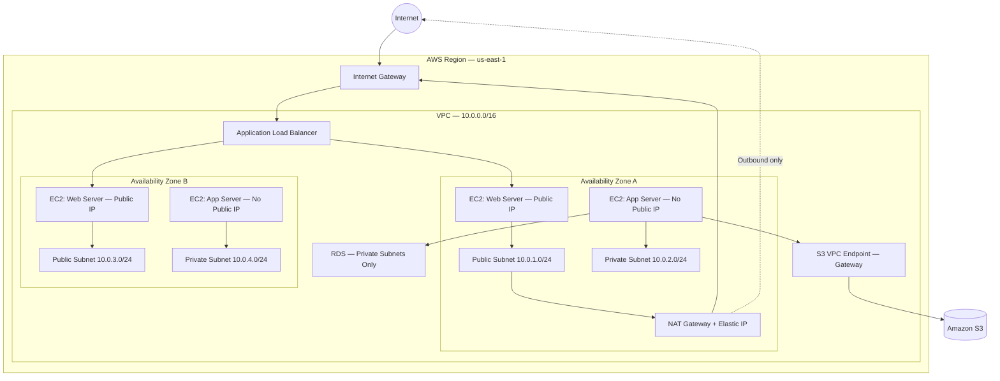
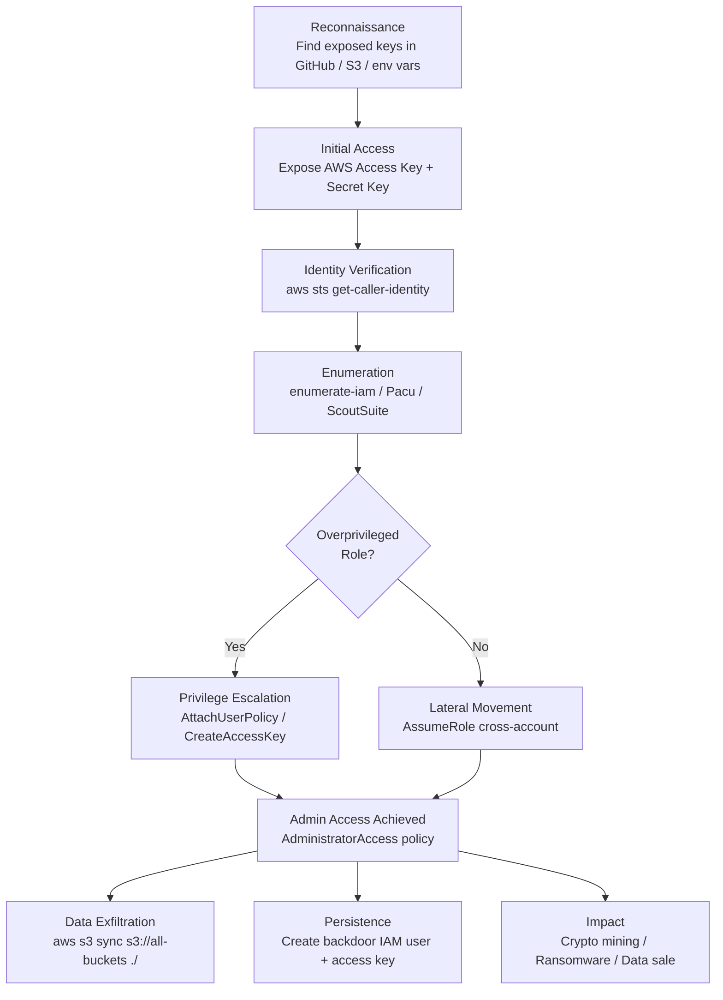

<!--
Title: Cloud Security Foundations — AWS, Azure & GCP
Volume: Volume 07 — Network Penetration Testing
Category: Module
Prerequisites:
  - Volume_02_Linux_Networking_and_Security_Foundations/Networking_Foundations_IP_Addressing_and_Subnetting_Master_Guide.md
  - Volume_07_Network_Penetration_Testing/Module_26_Penetration_Testing_Fundamentals.md
Last Updated: 2026-09-05
-->

# Cloud Security Foundations — AWS, Azure & GCP

> **Reading Time**: ~75 minutes | **Difficulty**: Beginner → Advanced

---

## Table of Contents

1. [What is Cloud Computing?](#1-what-is-cloud-computing)
2. [Service Models: IaaS, PaaS, SaaS, FaaS](#2-service-models-iaas-paas-saas-faas)
3. [The Shared Responsibility Model](#3-the-shared-responsibility-model)
4. [The Big 3: AWS vs Azure vs GCP](#4-the-big-3-aws-vs-azure-vs-gcp)
5. [AWS Deep Dive — Security Focus](#5-aws-deep-dive--security-focus)
   - [IAM: Identity & Access Management](#51-iam-identity--access-management)
   - [S3: Simple Storage Service](#52-s3-simple-storage-service)
   - [EC2: Elastic Compute Cloud](#53-ec2-elastic-compute-cloud)
   - [VPC: Virtual Private Cloud](#54-vpc-virtual-private-cloud)
   - [CloudTrail, Config, GuardDuty, Security Hub, Macie](#55-cloudtrail-config-guardduty-security-hub-macie)
   - [KMS: Key Management Service](#56-kms-key-management-service)
6. [Azure Deep Dive — Security Focus](#6-azure-deep-dive--security-focus)
   - [Azure AD / Entra ID](#61-azure-ad--entra-id)
   - [Azure Storage Accounts](#62-azure-storage-accounts)
   - [Azure VMs, NSGs & JIT Access](#63-azure-vms-nsgs--jit-access)
   - [Azure Key Vault](#64-azure-key-vault)
   - [Azure Sentinel & Defender for Cloud](#65-azure-sentinel--defender-for-cloud)
7. [GCP Basics — Security Focus](#7-gcp-basics--security-focus)
8. [Cloud Attack Vectors](#8-cloud-attack-vectors)
9. [Cloud Pentesting Tools](#9-cloud-pentesting-tools)
10. [Cloud Hardening Checklist: Top 20 Quick Wins](#10-cloud-hardening-checklist-top-20-quick-wins)
11. [Architecture Diagrams](#architecture-diagrams)
12. [Summary](#11-summary)
13. [Next Steps](#12-next-steps)

---

## Prerequisites

Before reading this module, ensure you are comfortable with:

- **Networking fundamentals** — IP addressing, subnetting, routing, and TCP/IP:
  [Networking Foundations — IP Addressing and Subnetting Master Guide](file:///home/kali/Ethical_Hacking_VAPT_Master_Notes/Volume_02_Linux_Networking_and_Security_Foundations/Networking_Foundations_IP_Addressing_and_Subnetting_Master_Guide.md)

- **Penetration testing methodology** — scoping, rules of engagement, reporting:
  [Module 26 — Penetration Testing Fundamentals](file:///home/kali/Ethical_Hacking_VAPT_Master_Notes/Volume_07_Network_Penetration_Testing/Module_26_Penetration_Testing_Fundamentals.md)

---

## 1. What is Cloud Computing?

Imagine you need a server. Traditionally, you would buy physical hardware, rack it in a data centre, cable it up, install the OS, configure networking, and manage it forever. This is **on-premises** infrastructure — you own everything and control everything.

**Cloud computing** is the on-demand delivery of IT resources (compute, storage, networking, databases, AI, etc.) over the internet, billed on a pay-as-you-go model. Instead of buying a server, you rent virtual compute capacity from a provider who operates thousands of physical machines in geographically distributed **data centres** (called **regions**).

### Key Characteristics (NIST Definition)

| Characteristic | Explanation |
|---|---|
| **On-demand self-service** | Provision resources without human interaction with provider |
| **Broad network access** | Accessible from anywhere via internet |
| **Resource pooling** | Multi-tenant — resources shared among customers (isolated) |
| **Rapid elasticity** | Scale up/down instantly to match demand |
| **Measured service** | Pay only for what you consume |

### Deployment Models

| Model | Who Owns/Operates It | Example Use Case |
|---|---|---|
| **Public Cloud** | Cloud provider (AWS, Azure, GCP) | SaaS startup, web app |
| **Private Cloud** | Organisation (on-premises or dedicated) | Financial institution, regulated data |
| **Hybrid Cloud** | Mix of public + private | Dev in cloud, prod on-prem |
| **Multi-Cloud** | Multiple public cloud providers | Avoid vendor lock-in |
| **Community Cloud** | Shared among organisations with common concerns | Government agencies |

---

## 2. Service Models: IaaS, PaaS, SaaS, FaaS

Think of cloud service models like a pizza analogy:

```
MADE AT HOME (On-Premises)    TAKE AND BAKE (IaaS)    DELIVERY (PaaS)    RESTAURANT (SaaS)
You manage EVERYTHING         Provider manages:        Provider manages:  Provider manages:
  - Building                    - Physical hardware      + OS               + Everything
  - Oven                        - Networking hardware    + Runtime
  - Ingredients                 - Virtualisation         + Middleware
  - Cooking                   You manage:              You manage:
  - Serving                     - OS, runtime, data      - App code + data
```

### Service Model Comparison Table

| Aspect | IaaS | PaaS | SaaS | FaaS (Serverless) |
|---|---|---|---|---|
| **Full Name** | Infrastructure as a Service | Platform as a Service | Software as a Service | Function as a Service |
| **You Manage** | OS, runtime, apps, data | App code, data | Just configuration | Function code only |
| **Provider Manages** | Physical HW, network, virtualisation | + OS, runtime, middleware | Everything | + Infrastructure, scaling |
| **AWS Example** | EC2 (virtual machines) | Elastic Beanstalk, RDS | WorkMail, Chime | Lambda |
| **Azure Example** | Azure VMs | Azure App Service | Microsoft 365, Teams | Azure Functions |
| **GCP Example** | Compute Engine | App Engine | Google Workspace | Cloud Functions |
| **Best For** | Full control, lift-and-shift | Developers who don't want to manage infra | End users | Event-driven microservices |
| **Security Responsibility** | Heavy on customer | Shared, customer owns app | Mostly provider | Customer owns code logic |
| **Pricing Model** | Per VM-hour | Per app tier | Per user/month | Per invocation + duration |

### Security Implication per Model

- **IaaS**: You are responsible for patching the OS, configuring firewalls, managing keys. A misconfigured EC2 security group exposing RDP is **your fault**.
- **PaaS**: You are responsible for app-layer security (SQLi, XSS, broken auth). The platform manages the underlying OS patching.
- **SaaS**: You are responsible for user access management, data governance, and integration security. Provider handles everything else.
- **FaaS**: You are responsible for the function code (injection, logic flaws), environment variables (secrets management), and IAM roles assigned to the function.

---

## 3. The Shared Responsibility Model

The **Shared Responsibility Model** is one of the most critical concepts in cloud security. It defines exactly where the cloud provider's security obligation ends and where the customer's begins.

> **Plain English**: AWS does not protect you from putting your S3 bucket public. That is your responsibility. AWS guarantees the physical data centre is secure. You guarantee your IAM policies are not wildly permissive.

### Shared Responsibility by Service Model

| Security Domain | On-Premises | IaaS | PaaS | SaaS |
|---|---|---|---|---|
| Physical data centre security | **Customer** | **Provider** | **Provider** | **Provider** |
| Hardware & virtualisation | **Customer** | **Provider** | **Provider** | **Provider** |
| Network infrastructure | **Customer** | **Provider** | **Provider** | **Provider** |
| Operating system | **Customer** | **Customer** | **Provider** | **Provider** |
| Runtime & middleware | **Customer** | **Customer** | **Provider** | **Provider** |
| Application code | **Customer** | **Customer** | **Customer** | **Provider** |
| Data encryption | **Customer** | **Customer** | **Customer** | **Shared** |
| Identity & access management | **Customer** | **Customer** | **Customer** | **Customer** |
| Network controls (firewall rules) | **Customer** | **Customer** | **Customer** | **Shared** |
| Client-side data | **Customer** | **Customer** | **Customer** | **Customer** |

### AWS Shared Responsibility Visual

```
+----------------------------------------------------------+
|                 CUSTOMER RESPONSIBILITY                   |
|   (Security IN the cloud)                                 |
|  +----------+ +----------+ +----------+ +-------------+  |
|  | Customer | | Platform,| | Identity | |  Network &  |  |
|  |  Data    | | Apps, IAM| | & Access | |  Firewall   |  |
|  +----------+ +----------+ +----------+ +-------------+  |
+----------------------------------------------------------+
|                    AWS RESPONSIBILITY                     |
|   (Security OF the cloud)                                 |
|  +------------------------------------------------------+ |
|  |  Compute  |  Storage  |  Database  |  Networking     | |
|  +------------------------------------------------------+ |
|  |   Regions   |   Availability Zones   |  Edge Locs    | |
|  +------------------------------------------------------+ |
+----------------------------------------------------------+
```

---

## 4. The Big 3: AWS vs Azure vs GCP

### Market Share (2025 Estimates)

| Provider | Market Share | Core Strengths |
|---|---|---|
| **Amazon Web Services (AWS)** | ~32% | Largest service catalogue, most mature, broadest ecosystem |
| **Microsoft Azure** | ~23% | Enterprise integration (Active Directory, Office 365), hybrid cloud |
| **Google Cloud Platform (GCP)** | ~12% | Data analytics, ML/AI, Kubernetes (GKE), competitive pricing |

### Key Services Terminology Comparison

| Function | AWS | Azure | GCP |
|---|---|---|---|
| Virtual Machine | EC2 | Azure VM | Compute Engine |
| Managed Kubernetes | EKS | AKS | GKE |
| Serverless Functions | Lambda | Azure Functions | Cloud Functions |
| Object Storage | S3 | Blob Storage | Cloud Storage |
| Block Storage | EBS | Managed Disks | Persistent Disk |
| Managed Database (SQL) | RDS | Azure SQL / Database | Cloud SQL |
| NoSQL Database | DynamoDB | Cosmos DB | Firestore / Bigtable |
| DNS | Route 53 | Azure DNS | Cloud DNS |
| CDN | CloudFront | Azure CDN | Cloud CDN |
| Load Balancer | ALB / NLB / ELB | Azure Load Balancer | Cloud Load Balancing |
| VPN | AWS VPN | Azure VPN Gateway | Cloud VPN |
| Identity Management | IAM | Azure AD / Entra ID | Cloud IAM |
| Key Management | KMS | Azure Key Vault | Cloud KMS |
| SIEM / Security Monitoring | Security Hub | Sentinel | Chronicle |
| Threat Detection | GuardDuty | Defender for Cloud | Security Command Center |
| Logging | CloudTrail / CloudWatch | Azure Monitor / Log Analytics | Cloud Logging (Stackdriver) |
| Container Registry | ECR | ACR | Artifact Registry |
| Secret Management | Secrets Manager | Key Vault | Secret Manager |

---

## 5. AWS Deep Dive — Security Focus

### 5.1 IAM: Identity & Access Management

**AWS IAM** is the bedrock of AWS security. It controls **who** can do **what** to **which** AWS resources. Getting IAM wrong is the single biggest source of cloud breaches.

#### Core IAM Concepts

**Users** — A permanent identity representing a person or service. Has long-term credentials (username/password for console, access keys for API/CLI). Best practice: humans should use IAM Identity Center (SSO), not IAM users with access keys.

**Groups** — A collection of IAM users. You assign policies to groups, not individual users. Example: `Developers` group with `AmazonEC2FullAccess`.

**Roles** — A temporary identity that can be assumed by AWS services, users, or external identities. No permanent credentials — generates **temporary security tokens** via STS (Security Token Service). An EC2 instance should assume a role to call S3, never have hardcoded keys.

**Policies** — JSON documents that define permissions. They specify which **Actions** are allowed or denied on which **Resources** under what **Conditions**.

#### Policy Types

| Type | Description | Scope | Example |
|---|---|---|---|
| **Identity-based policy** | Attached to a user, group, or role | What the identity can do | Allow EC2 describe instances |
| **Resource-based policy** | Attached to a resource (e.g. S3 bucket) | Who can access this resource | Allow Account B to read my S3 |
| **Permission boundary** | Sets maximum permissions for an identity | Limits effective permissions | Dev role cannot escalate beyond boundary |
| **SCP (Service Control Policy)** | Org-level policy via AWS Organizations | Applies across all accounts in OU | Block EC2 in non-approved regions |
| **Session policy** | Passed at role assumption time | Limits permissions for that session | Restrict to specific S3 prefix |

#### Inline vs Managed Policies

| | Inline Policy | Managed Policy |
|---|---|---|
| **Storage** | Embedded inside a single identity | Standalone policy object with ARN |
| **Reuse** | No — one identity only | Yes — attach to many identities |
| **Types** | Always customer-managed | AWS-managed (pre-built) or Customer-managed |
| **Best Practice** | Avoid — hard to audit | Use managed for consistency |

#### Sample IAM Policy (JSON)

```json
{
  "Version": "2012-10-17",
  "Statement": [
    {
      "Sid": "AllowS3ReadOnMyBucket",
      "Effect": "Allow",
      "Action": [
        "s3:GetObject",
        "s3:ListBucket"
      ],
      "Resource": [
        "arn:aws:s3:::my-secure-bucket",
        "arn:aws:s3:::my-secure-bucket/*"
      ],
      "Condition": {
        "StringEquals": {
          "aws:RequestedRegion": "us-east-1"
        }
      }
    }
  ]
}
```

#### IAM Policy Effect: Allow vs Deny

| Scenario | Result |
|---|---|
| No policy exists | **Implicit DENY** — default is deny everything |
| Allow policy attached | **ALLOW** — action permitted |
| Explicit Deny policy attached | **DENY** — overrides any Allow, no exceptions |
| Allow in identity policy + Explicit Deny in SCP | **DENY** — SCP wins |
| Allow in identity policy + Allow in resource policy (cross-account) | **ALLOW** — both sides must allow |
| Permission boundary restricts action | **DENY** — effective permissions = policy intersect boundary |

#### IAM Security Assessment Commands

```bash
# List all IAM users
aws iam list-users

# List all IAM roles
aws iam list-roles

# List all policies attached to a user
aws iam list-attached-user-policies --user-name <username>

# Get the inline policies for a user
aws iam list-user-policies --user-name <username>

# Simulate what an identity can do
aws iam simulate-principal-policy \
  --policy-source-arn arn:aws:iam::123456789012:user/alice \
  --action-names s3:GetObject ec2:DescribeInstances

# Generate a credential report (all users, MFA status, key age)
aws iam generate-credential-report
aws iam get-credential-report --query Content --output text | base64 -d

# List access keys for a user (find old/unused keys)
aws iam list-access-keys --user-name <username>

# Find who has AdministratorAccess
aws iam list-entities-for-policy \
  --policy-arn arn:aws:iam::aws:policy/AdministratorAccess
```

---

### 5.2 S3: Simple Storage Service

**Amazon S3** is AWS's object storage service. Objects (files) are stored in **buckets** (containers). S3 misconfigurations are the most common cause of cloud data breaches — billions of records have been exposed through public S3 buckets.

#### S3 Access Control Layers (in order of evaluation)

1. **Block Public Access settings** (bucket-level or account-level) — the master override
2. **Bucket Policy** (resource-based policy)
3. **ACLs** (legacy, per-object or per-bucket)
4. **IAM policies** on the requesting identity

#### Bucket Policies

A JSON policy attached directly to the S3 bucket. Controls access for AWS accounts, IAM users/roles, and **anonymous (public) users**.

```json
{
  "Version": "2012-10-17",
  "Statement": [
    {
      "Effect": "Allow",
      "Principal": "*",
      "Action": "s3:GetObject",
      "Resource": "arn:aws:s3:::example-bucket/*"
    }
  ]
}
```

> **WARNING**: `"Principal": "*"` with no conditions = **PUBLIC READ ACCESS**. This is how data breaches happen.

#### Block Public Access (BPA) Settings

| Setting | What It Blocks |
|---|---|
| `BlockPublicAcls` | Prevent new ACLs that grant public access |
| `IgnorePublicAcls` | Ignore existing public ACLs |
| `BlockPublicPolicy` | Block new bucket policies granting public access |
| `RestrictPublicBuckets` | Restrict access even if policy grants public |

Best practice: Enable **all four** at the **account level** as a default.

#### S3 Encryption Options

| Type | Who Manages Keys | How It Works | Use Case |
|---|---|---|---|
| **SSE-S3** (AES-256) | AWS manages everything | AWS generates and manages encryption keys automatically | Default, low-overhead |
| **SSE-KMS** | AWS KMS (customer controls key policy) | Data encrypted with KMS Customer Managed Key (CMK) | Audit trail, key control, cross-account |
| **SSE-C** | Customer provides key per request | You send encryption key with each PUT/GET | Maximum customer key control |
| **CSE** (Client-Side) | Customer, done before upload | Data encrypted client-side before sending to S3 | Most restrictive, compliance |
| **DSSE-KMS** | AWS KMS, dual layer | Two layers of encryption with separate keys | Highly regulated workloads |

```bash
# Check if a bucket has default encryption enabled
aws s3api get-bucket-encryption --bucket my-bucket

# Check Block Public Access settings
aws s3api get-public-access-block --bucket my-bucket

# Check bucket policy
aws s3api get-bucket-policy --bucket my-bucket

# List all buckets
aws s3api list-buckets

# Check bucket ACL
aws s3api get-bucket-acl --bucket my-bucket

# List buckets anonymously (test public access)
aws s3 ls s3://<bucket-name> --no-sign-request
```

#### Presigned URLs

A **presigned URL** grants temporary, time-limited access to a private S3 object without requiring AWS credentials. The URL embeds the signature of the IAM identity that created it.

```bash
# Generate a presigned URL (valid 1 hour = 3600 seconds)
aws s3 presign s3://my-bucket/sensitive-file.pdf --expires-in 3600
```

**Security risk**: If a presigned URL leaks (logged in web server access logs, sent over HTTP), anyone with the URL can access the object until it expires.

---

### 5.3 EC2: Elastic Compute Cloud

EC2 provides virtual machines (**instances**) in the cloud. Each instance runs in a VPC and has associated security controls.

#### Security Groups vs NACLs

| Feature | Security Group | Network ACL (NACL) |
|---|---|---|
| **Level** | Instance level (ENI) | Subnet level |
| **State** | **Stateful** — return traffic automatically allowed | **Stateless** — must explicitly allow both directions |
| **Rules** | Allow rules only (no explicit deny) | Allow AND Deny rules |
| **Rule Evaluation** | All rules evaluated, most permissive wins | Evaluated in **order** (lowest number first), first match wins |
| **Default** | Deny all inbound, allow all outbound | Allow all inbound AND outbound |
| **Scope** | Applied to instances within any subnet | Applied to all instances in a subnet |
| **Analogy** | Door lock on each apartment | Security guard at the building entrance |

#### EC2 Key Pairs

Key pairs provide SSH (Linux) or RDP password decryption (Windows) access to EC2 instances. The **private key** is downloaded once at creation — AWS never stores it.

```bash
# Create a key pair
aws ec2 create-key-pair --key-name my-key --query 'KeyMaterial' --output text > my-key.pem
chmod 400 my-key.pem

# SSH to instance using key pair
ssh -i my-key.pem ec2-user@<public-ip>
```

**Security risk**: Hardcoded key pairs in automation scripts, committed to git repositories.

#### Instance Metadata Service (IMDS): IMDSv1 vs IMDSv2

The **Instance Metadata Service** is a special HTTP endpoint accessible only from within an EC2 instance at `http://169.254.169.254/latest/`. It provides the instance with information about itself — crucially including **IAM role credentials**.

| Feature | IMDSv1 | IMDSv2 |
|---|---|---|
| **Authentication** | None — simple GET request | Requires session token (PUT first, then GET) |
| **SSRF Risk** | **HIGH** — any SSRF can steal credentials | **LOW** — SSRF must also forge PUT request |
| **Request Method** | `curl http://169.254.169.254/latest/meta-data/` | Two-step: get token, then use token |
| **Default (new instances)** | Legacy | IMDSv2 is default (2023+) |
| **Enforcement** | Optional | Can be enforced via `HttpTokens=required` |

```bash
# IMDSv1 credential theft (classic SSRF target)
curl http://169.254.169.254/latest/meta-data/iam/security-credentials/
curl http://169.254.169.254/latest/meta-data/iam/security-credentials/<role-name>
# Returns: AccessKeyId, SecretAccessKey, Token, Expiration

# IMDSv2 — requires session token first
TOKEN=$(curl -s -X PUT "http://169.254.169.254/latest/api/token" \
  -H "X-aws-ec2-metadata-token-ttl-seconds: 21600")
curl -s http://169.254.169.254/latest/meta-data/iam/security-credentials/ \
  -H "X-aws-ec2-metadata-token: $TOKEN"

# Enforce IMDSv2 on an existing instance
aws ec2 modify-instance-metadata-options \
  --instance-id i-1234567890abcdef0 \
  --http-tokens required \
  --http-endpoint enabled

# Find instances still using IMDSv1 (assessment)
aws ec2 describe-instances \
  --query 'Reservations[].Instances[?MetadataOptions.HttpTokens!=`required`].[InstanceId,MetadataOptions.HttpTokens]' \
  --output table
```

#### User Data Scripts

Scripts that run automatically when an instance **first launches**. Commonly used to install software, configure the OS, or join domains.

**Security risk**: Secrets (passwords, API keys) hardcoded in user-data scripts. User-data is **readable via IMDS** without authentication in IMDSv1:

```bash
# Read user-data from inside instance (IMDSv1)
curl http://169.254.169.254/latest/user-data

# Read user-data via AWS CLI (if you have IAM access)
aws ec2 describe-instance-attribute \
  --instance-id i-1234567890abcdef0 \
  --attribute userData \
  --query 'UserData.Value' --output text | base64 -d
```

---

### 5.4 VPC: Virtual Private Cloud

A **VPC** is your private, isolated section of the AWS cloud — a logically isolated network where you launch AWS resources. Think of it as your own data-centre network inside AWS.

#### VPC Components

```
+----------------------- VPC (10.0.0.0/16) -------------------------+
|                                                                     |
|  +--- Public Subnet (10.0.1.0/24) ---+  +--- Private Subnet ---+  |
|  |                                    |  |   (10.0.2.0/24)      |  |
|  |  [EC2: Web]    [NAT Gateway]       |  |   [EC2: App/DB]      |  |
|  |  (Public IP)   (Elastic IP)        |  |   (No Public IP)     |  |
|  +------------------------------------+  +----------------------+  |
|                    |                                                |
|           [Internet Gateway]                                        |
+--------------------|-------------------------------------------------+
                     |
                 INTERNET
```

| Component | Purpose |
|---|---|
| **Subnet** | A range of IP addresses within a VPC. Public subnets have a route to IGW; private subnets do not. |
| **Internet Gateway (IGW)** | Allows resources in public subnets to communicate with the internet |
| **NAT Gateway** | Allows resources in private subnets to initiate outbound internet connections (no inbound) |
| **Route Table** | Controls where network traffic is directed |
| **VPC Peering** | Private network connection between two VPCs (same or different accounts/regions) |
| **Transit Gateway** | Hub-and-spoke to connect many VPCs and on-premises networks |
| **VPC Endpoints** | Private connection to AWS services without traversing internet |

```bash
# List all VPCs
aws ec2 describe-vpcs

# List security groups with internet-open inbound (0.0.0.0/0)
aws ec2 describe-security-groups \
  --filters "Name=ip-permission.cidr,Values=0.0.0.0/0" \
  --query 'SecurityGroups[*].[GroupId,GroupName]'

# List all NACLs
aws ec2 describe-network-acls

# Check if VPC flow logs are enabled
aws ec2 describe-flow-logs

# Enable VPC flow logs to S3 (if not already enabled)
aws ec2 create-flow-logs \
  --resource-type VPC \
  --resource-ids vpc-12345678 \
  --traffic-type ALL \
  --log-destination-type s3 \
  --log-destination arn:aws:s3:::my-flowlogs-bucket
```

---

### 5.5 CloudTrail, Config, GuardDuty, Security Hub, Macie

#### AWS CloudTrail

CloudTrail records **API calls** made to your AWS account — who did what, when, and from where. It is the **audit log** for AWS.

| Event Type | What It Captures | Example |
|---|---|---|
| **Management events** | Control-plane operations | CreateBucket, DeleteUser, AttachRolePolicy |
| **Data events** | Object-level operations (optional, high volume) | S3 GetObject, Lambda Invoke |
| **Insights events** | Unusual API call patterns (ML-based) | Sudden spike in IAM calls |

**Critical CloudTrail events to monitor**:

```
ConsoleLogin                  <- Who is logging in? From where?
DeleteTrail                   <- Attacker trying to cover tracks
StopLogging                   <- Same as above
CreateAccessKey               <- New programmatic access created
AttachUserPolicy              <- Privilege escalation attempt
PutBucketPolicy               <- S3 permissions changed
AuthorizeSecurityGroupIngress <- Firewall rule opened
AssumeRoleWithWebIdentity     <- Federated access
```

```bash
# Search CloudTrail for a specific event
aws cloudtrail lookup-events \
  --lookup-attributes AttributeKey=EventName,AttributeValue=ConsoleLogin \
  --start-time 2026-09-01T00:00:00Z

# Check if CloudTrail is enabled in all regions
aws cloudtrail describe-trails --include-shadow-trails true

# Verify log file integrity (tampering detection)
aws cloudtrail validate-logs \
  --trail-arn arn:aws:cloudtrail:us-east-1:123456789012:trail/my-trail \
  --start-time 2026-09-01T00:00:00Z
```

#### AWS Config

AWS Config **continuously records** the configuration state of your AWS resources and evaluates them against compliance rules.

- Tracks resource changes over time (configuration history)
- Evaluates resources against **Config Rules** (e.g. "all S3 buckets must have encryption enabled")
- Provides compliance dashboard showing COMPLIANT vs NON_COMPLIANT resources

```bash
# List all Config rules and their compliance status
aws configservice describe-compliance-by-config-rule

# Get non-compliant resources for a specific rule
aws configservice get-compliance-details-by-config-rule \
  --config-rule-name s3-bucket-server-side-encryption-enabled \
  --compliance-types NON_COMPLIANT
```

#### AWS GuardDuty

GuardDuty is a **threat detection service** that uses machine learning to analyse VPC Flow Logs, CloudTrail, and DNS logs for malicious activity.

| Finding | What It Means |
|---|---|
| `UnauthorizedAccess:EC2/TorClient` | EC2 instance communicating with Tor exit node |
| `Recon:IAMUser/MaliciousIPCaller` | API calls from known malicious IP |
| `CredentialAccess:IAMUser/AnomalousBehavior` | Unusual credential usage pattern |
| `Exfiltration:S3/MaliciousIPCaller` | S3 access from known bad IP |
| `Persistence:IAMUser/UserPermissions` | Suspicious IAM policy change |
| `CryptoCurrency:EC2/BitcoinTool` | EC2 mining cryptocurrency |

```bash
# Enable GuardDuty in a region
aws guardduty create-detector --enable

# List all findings
aws guardduty list-findings --detector-id <detector-id>

# Get finding details
aws guardduty get-findings \
  --detector-id <detector-id> \
  --finding-ids <finding-id>
```

#### AWS Security Hub

Security Hub aggregates findings from GuardDuty, Macie, Inspector, and third-party tools into a single pane of glass. It scores your environment against:
- **CIS AWS Foundations Benchmark** (v1.2, v1.4, v3.0)
- **AWS Foundational Security Best Practices**
- **PCI DSS**
- **NIST SP 800-53**

#### Amazon Macie

Macie uses **machine learning to discover and protect sensitive data** in S3. Automatically scans buckets for PII, credentials, medical records, and financial data.

```bash
# Enable Macie
aws macie2 enable-macie

# Create a classification job
aws macie2 create-classification-job \
  --job-type ONE_TIME \
  --s3-job-definition '{"bucketDefinitions":[{"accountId":"123456789012","buckets":["my-bucket"]}]}'
```

---

### 5.6 KMS: Key Management Service

AWS KMS provides **managed cryptographic keys** for encrypting data across AWS services.

**Envelope Encryption** concept:

```
+----------------------------------------------------------+
|               ENVELOPE ENCRYPTION                         |
|                                                           |
|  1. KMS generates a DATA KEY (plaintext + encrypted)     |
|                                                           |
|  2. Plaintext data key encrypts your data:               |
|     [Your Data] --encrypt--> [Encrypted Data]            |
|                                                           |
|  3. Plaintext data key is DISCARDED (never stored)       |
|                                                           |
|  4. Encrypted data key stored ALONGSIDE encrypted data   |
|                                                           |
|  To decrypt:                                              |
|  KMS decrypts data key --> data key decrypts data        |
|  (KMS never sees your raw data -- only the wrapped key)  |
+----------------------------------------------------------+
```

| Key Type | Management | Cost | Use Case |
|---|---|---|---|
| **AWS Managed Keys** | AWS manages automatically | Free | Default encryption for AWS services |
| **Customer Managed Keys (CMK)** | You create and control key policy | $1/month/key | Custom key policy, rotation, cross-account |
| **AWS Owned Keys** | AWS, shared across customers | Free, not visible | Internal AWS service use |

```bash
# List all KMS keys
aws kms list-keys

# Get key metadata and policy
aws kms describe-key --key-id <key-id>
aws kms get-key-policy --key-id <key-id> --policy-name default

# List key rotation status
aws kms get-key-rotation-status --key-id <key-id>

# Enable automatic annual key rotation
aws kms enable-key-rotation --key-id <key-id>
```

---

## 6. Azure Deep Dive — Security Focus

### 6.1 Azure AD / Entra ID

**Microsoft Entra ID** (formerly Azure Active Directory) is Azure's cloud-based identity and access management service. Unlike AWS IAM which is account-scoped, Entra ID is **tenant-scoped** and spans all Azure subscriptions.

#### Azure Hierarchy

```
Tenant (your organisation's Entra ID directory)
  +-- Management Groups (optional hierarchy)
        +-- Subscriptions (billing + access boundary)
              +-- Resource Groups (logical containers)
                    +-- Resources (VMs, storage, etc.)
```

- **Tenant**: A dedicated Entra ID instance. Each has a unique domain (e.g. `contoso.onmicrosoft.com`).
- **Subscription**: A billing and access container. Multiple subscriptions per tenant allowed.
- **Resource Group**: A logical container for resources in a subscription.

#### Azure RBAC Roles

| Role | Permissions | Scope |
|---|---|---|
| **Owner** | Full access including manage access (assign roles) | Subscription, RG, or Resource |
| **Contributor** | Create/manage all resources, cannot assign roles | Subscription, RG, or Resource |
| **Reader** | View-only, no changes | Subscription, RG, or Resource |
| **User Access Administrator** | Manage user access to Azure resources only | Subscription, RG, or Resource |
| **Custom Roles** | Define specific Actions/NotActions | Tenant, Subscription, or RG |

```bash
# List all role assignments in a subscription
az role assignment list --all --output table

# List all custom roles
az role definition list --custom-role-only true

# List users with Owner role on a subscription
az role assignment list \
  --role "Owner" \
  --scope "/subscriptions/<sub-id>" \
  --output table

# List all service principals (non-human identities)
az ad sp list --all --output table

# List all app registrations
az ad app list --all --output table
```

---

### 6.2 Azure Storage Accounts

Azure storage accounts hold **Blobs** (unstructured files), Tables, Queues, and Files. Blob storage is the most commonly misconfigured.

#### Blob Public Access Levels

| Setting | Access Level |
|---|---|
| **Private** | No public access — all requests must be authenticated |
| **Blob** | Anonymous read access for blobs only (must know URL) |
| **Container** | Anonymous read + list access (list all blobs in container) |

```bash
# Check public access level on all storage accounts
az storage account list \
  --query "[].{name:name, allowBlobPublicAccess:allowBlobPublicAccess}" -o table

# List containers in a storage account
az storage container list --account-name <name> --auth-mode login

# Test public blob access (no auth needed if set to Container/Blob)
curl https://<account>.blob.core.windows.net/<container>/<blob>

# List blobs in a public container anonymously
curl "https://<account>.blob.core.windows.net/<container>?restype=container&comp=list"
```

#### SAS Tokens (Shared Access Signatures)

A **SAS token** grants time-limited, scoped access to storage resources without exposing the account key.

```
https://myaccount.blob.core.windows.net/mycontainer/myfile.txt
  ?sv=2021-06-08     <- Storage service version
  &ss=b              <- Service: blob
  &srt=o             <- Resource type: object
  &sp=r              <- Permissions: read
  &se=2026-09-05T23:59:59Z   <- Expiry
  &spr=https         <- Protocol
  &sig=<REDACTED>    <- Signature
```

**Security risk**: SAS tokens in browser history, server logs, shared links with no expiry.

#### Shared Keys

Storage account **shared keys** provide full, unrestricted access. If leaked, an attacker can read, write, and delete all data.

```bash
# Get storage account keys (PROTECT THESE)
az storage account keys list --account-name <name> --resource-group <rg>

# Rotate a key
az storage account keys renew --account-name <name> --resource-group <rg> --key primary
```

---

### 6.3 Azure VMs, NSGs & JIT Access

#### Network Security Groups (NSGs)

Azure NSGs function like AWS Security Groups (stateful) but can be applied to **subnets** AND **individual NICs**. Rules are prioritised by number (lower = higher priority).

```bash
# List all NSGs
az network nsg list --output table

# Show rules for a specific NSG
az network nsg rule list --nsg-name <nsg-name> -g <rg> --output table

# Find NSGs allowing RDP (3389) or SSH (22) from internet
az network nsg list --query \
  "[?securityRules[?destinationPortRange=='3389' && sourceAddressPrefix=='*']]" \
  -o table
```

#### Just-In-Time (JIT) VM Access

JIT access (part of **Defender for Cloud**) locks down management ports (RDP/SSH) and only opens them for approved users during an approved time window. This eliminates persistent internet-facing RDP/SSH exposure.

```bash
# Enable JIT on a VM
az security jit-policy create \
  --resource-group <rg> \
  --name default \
  --virtual-machines '[{"id":"/subscriptions/.../virtualMachines/myVM","ports":[{"number":22,"protocol":"TCP","allowedSourceAddressPrefix":"*","maxRequestAccessDuration":"PT3H"}]}]'

# Request JIT access
az security jit-policy initiate \
  --resource-group <rg> \
  --name default \
  --virtual-machines '[{"id":"...","ports":[{"number":22,"duration":"PT1H","allowedSourceAddressPrefix":"<your-ip>"}]}]'
```

#### Azure Bastion

Azure Bastion provides browser-based SSH and RDP access to VMs **without** exposing public IPs or management ports. Traffic flows through Azure's backbone, not the internet. No public IP needed on the VM.

---

### 6.4 Azure Key Vault

Azure Key Vault stores **secrets**, **keys**, and **certificates** for applications. Equivalent to AWS Secrets Manager + KMS combined.

```bash
# List all Key Vaults
az keyvault list --output table

# List secrets in a vault (names only)
az keyvault secret list --vault-name <vault-name>

# Get a secret value
az keyvault secret show --vault-name <vault-name> --name <secret-name>

# Check access policies
az keyvault show --name <vault-name> --query properties.accessPolicies

# Check network rules (is vault restricted to specific VNets/IPs?)
az keyvault show --name <vault-name> --query properties.networkAcls
```

**Assessment focus**: Overly permissive access policies (`All` permissions to All users), Key Vault accessible from all networks, secrets with no expiry date.

---

### 6.5 Azure Sentinel & Defender for Cloud

**Microsoft Sentinel** is Azure's cloud-native SIEM and SOAR platform. It ingests logs from Azure, Microsoft 365, AWS, and third-party sources. Uses built-in analytics rules and ML to detect threats. Provides automated response via playbooks (Logic Apps).

**Microsoft Defender for Cloud** (formerly Azure Security Center):
- Provides a **Secure Score** (0–100%) measuring your security posture
- Gives prioritised security recommendations with remediation steps
- Detects threats against VMs, containers, databases, storage
- Integrates with Azure Policy for governance

```bash
# Check Defender for Cloud pricing tier (free vs standard)
az security pricing list --output table

# Get security recommendations
az security assessment list --output table

# Get Secure Score
az security secure-score-controls list --output table
```

---

## 7. GCP Basics — Security Focus

### GCP Resource Hierarchy

```
Organisation
  +-- Folders (optional, for grouping)
        +-- Projects (billing + identity + API boundary)
              +-- Resources (GCE, GCS, GKE, BigQuery, etc.)
```

**Projects** in GCP are the primary isolation boundary — equivalent to an AWS account or an Azure subscription.

### GCP IAM

GCP IAM uses a **policy binding** model: you grant a **member** a **role** on a **resource**.

```
MEMBER (who) + ROLE (what can they do) + RESOURCE (on what)
```

#### Role Types

| Type | Description | Example |
|---|---|---|
| **Primitive Roles** | Legacy — very coarse-grained, avoid in production | `roles/viewer`, `roles/editor`, `roles/owner` |
| **Predefined Roles** | Service-specific, curated by Google | `roles/storage.objectViewer`, `roles/compute.instanceAdmin` |
| **Custom Roles** | Define exact permissions at project or org level | Your own combination of permissions |

```bash
# List all IAM policy bindings for a project
gcloud projects get-iam-policy <project-id>

# List all service accounts in a project
gcloud iam service-accounts list

# List roles bound to a service account
gcloud projects get-iam-policy <project-id> \
  --flatten="bindings[].members" \
  --filter="bindings.members:serviceAccount:<sa-email>" \
  --format="table(bindings.role)"

# Check for service account key files (security risk)
gcloud iam service-accounts keys list --iam-account <sa-email>

# List all predefined roles for a service
gcloud iam roles list --filter="name:roles/storage"
```

### GCP Cloud Storage Security

| Access Model | Description |
|---|---|
| **Uniform bucket-level access** | IAM controls only — consistent, recommended |
| **Fine-grained (legacy ACLs)** | Combination of IAM + per-object ACLs — complex and error-prone |

```bash
# List all buckets in a project
gsutil ls

# Check IAM policy on a bucket
gsutil iam get gs://<bucket-name>

# Check if bucket is publicly accessible (allUsers = public)
gsutil iam get gs://<bucket-name> | grep allUsers

# Check bucket ACL
gsutil acl get gs://<bucket-name>

# Enable uniform bucket-level access (disables legacy ACLs)
gsutil uniformbucketlevelaccess set on gs://<bucket-name>
```

### GKE Security Basics

**Google Kubernetes Engine (GKE)** security essentials:

| Control | Description |
|---|---|
| **Workload Identity** | Bind K8s service accounts to GCP service accounts (avoids node-level key files) |
| **Private clusters** | Nodes have no public IPs; control plane access restricted to authorised networks |
| **Binary Authorization** | Only allow signed, attested container images |
| **Network Policies** | Control pod-to-pod traffic |
| **RBAC** | Control who can access the Kubernetes API |
| **Node auto-upgrade** | Keep node OS patched automatically |
| **Shielded GKE Nodes** | Secure boot, measured boot, vTPM |

```bash
# List GKE clusters
gcloud container clusters list

# Describe a cluster (check private endpoint, RBAC, etc.)
gcloud container clusters describe <cluster-name> --zone <zone>

# Check if dashboard is enabled (should be disabled)
gcloud container clusters describe <cluster-name> | grep addonsConfig

# Get kubeconfig for a cluster
gcloud container clusters get-credentials <cluster-name> --zone <zone>

# Check RBAC policies in the cluster
kubectl get clusterrolebindings -o wide
kubectl get rolebindings --all-namespaces -o wide
```

---

## 8. Cloud Attack Vectors

### 8.1 S3/Blob Bucket Misconfiguration Discovery

Finding publicly accessible cloud storage buckets that should be private.

```bash
# AWS: Test anonymous access to a bucket
aws s3 ls s3://<bucket-name> --no-sign-request

# GCP: Check if bucket is public
curl -s https://storage.googleapis.com/<bucket-name>
gsutil ls gs://<bucket-name>   # Succeeds if allUsers has access

# Azure: List blobs anonymously
curl -s "https://<account>.blob.core.windows.net/<container>?restype=container&comp=list"

# AWSBucketDump — enumerate and download from public buckets
python3 AWSBucketDump.py -D -l bucket_names.txt -g interesting_files.txt

# S3Scanner
python3 s3scanner.py --bucket <name>
python3 s3scanner.py --list bucket_names.txt

# GrayhatWarfare — search public buckets (web)
# https://buckets.grayhatwarfare.com/
```

---

### 8.2 IMDSv1 SSRF to Credential Theft

If a web application is vulnerable to SSRF and the EC2 instance uses IMDSv1, an attacker can steal IAM role credentials.

**Attack Flow**:

```
Attacker
  |
  | SSRF payload in vulnerable URL parameter
  v
Web App on EC2
  |
  | HTTP GET to 169.254.169.254
  v
IMDS Endpoint
  |
  | Returns: AccessKeyId, SecretAccessKey, Token
  v
Web App response (attacker receives credentials)
  |
  | Configure AWS CLI with stolen creds
  v
AWS APIs --> S3, EC2, RDS, etc. --> Data Exfiltration
```

```bash
# Step 1: Test SSRF with metadata endpoint
# Vulnerable URL example:
# https://target.com/fetch?url=http://169.254.169.254/latest/meta-data/

# Step 2: Get the role name
# https://target.com/fetch?url=http://169.254.169.254/latest/meta-data/iam/security-credentials/

# Step 3: Get the credentials
# https://target.com/fetch?url=http://169.254.169.254/latest/meta-data/iam/security-credentials/MyRole

# Step 4: Configure AWS CLI with stolen credentials
export AWS_ACCESS_KEY_ID="ASIA****REDACTED"
export AWS_SECRET_ACCESS_KEY="abc1****REDACTED"
export AWS_SESSION_TOKEN="IQoJ****REDACTED"

# Step 5: Verify access
aws sts get-caller-identity

# Step 6: Enumerate accessible services
aws s3 ls
aws ec2 describe-instances
aws iam list-roles
```

---

### 8.3 Overprivileged IAM Roles & Access Key Exposure

**Common exposure vectors**:
- Access keys committed to public GitHub repositories (gitdorking)
- Access keys in `.env` files, application configs
- Access keys in Docker images (docker history)
- Access keys in Lambda environment variables
- Access keys in EC2 user-data scripts

```bash
# Use truffleHog to find secrets in git history
trufflehog git https://github.com/target/repo --only-verified

# Use gitleaks
gitleaks detect --source /path/to/repo -v

# Verify if found access key is still valid
aws sts get-caller-identity

# Enumerate ALL permissions for a set of credentials
# (tests every IAM action to find what is allowed)
git clone https://github.com/andresriancho/enumerate-iam
python3 enumerate-iam.py \
  --access-key AKIA****REDACTED \
  --secret-key abc1****REDACTED

# Use Pacu for AWS post-exploitation
git clone https://github.com/RhinoSecurityLabs/pacu
cd pacu && python3 pacu.py
# Pacu> import_keys <profile>
# Pacu> run iam__bruteforce_permissions
# Pacu> run iam__privesc_scan
```

---

### 8.4 Publicly Exposed EC2/VM Instances

```bash
# Find EC2 instances with public IPs that have unrestricted inbound
aws ec2 describe-instances \
  --filters "Name=instance-state-name,Values=running" \
  --query 'Reservations[].Instances[?PublicIpAddress!=null].[InstanceId,PublicIpAddress]' \
  --output table

# Shodan — discover internet-facing cloud assets
# Search on shodan.io:
#   org:"Amazon.com" port:22
#   org:"Amazon.com" port:3389
#   org:"Microsoft Azure" port:3389

# Scan discovered IPs for open management ports
nmap -sV -p 22,3389,5985,8080,8443 <public-ip>
```

---

### 8.5 Lambda/Cloud Function Environment Variable Leakage

```bash
# List Lambda functions
aws lambda list-functions --query 'Functions[*].[FunctionName,Runtime,Role]'

# Get function configuration -- shows environment variables in plaintext!
aws lambda get-function-configuration --function-name <name>
# Look for: "Environment": {"Variables": {"DB_PASSWORD": "...", "API_KEY": "..."}}

# From inside a Lambda (code execution context)
# import os; print(os.environ)  <- Dumps all environment variables

# Azure Functions -- check app settings (equivalent to env vars)
az functionapp config appsettings list --name <name> --resource-group <rg>

# GCP Cloud Functions -- check environment variables
gcloud functions describe <function-name> --format="get(environmentVariables)"
```

---

### 8.6 Exposed Kubernetes Dashboards

```bash
# Shodan search for exposed K8s dashboards
# Search: kubernetes-dashboard  http.title:"Kubernetes Dashboard"

# Check if K8s API server is unauthenticated
curl -sk https://<cluster-ip>:6443/api/v1/namespaces

# Check for unauthenticated kubelet API (common misconfiguration)
curl -sk https://<node-ip>:10250/pods
curl -sk https://<node-ip>:10250/run/default/<pod>/<container> \
  -d "cmd=id"

# Check for exposed etcd (K8s database -- contains all secrets)
curl -sk http://<etcd-ip>:2379/v2/keys/?recursive=true
```

---

### 8.7 Insecure Container Registries

```bash
# Check if ECR repository is public
aws ecr-public describe-repositories  # Lists public ECR repos

# Pull from a public ECR repository (no auth needed)
docker pull public.ecr.aws/<alias>/<repo>:<tag>

# Check ACR for anonymous pull access
az acr show --name <registry-name> --query "anonymousPullEnabled"

# List GCR images (if public)
curl https://gcr.io/v2/<project>/<image>/tags/list
```

---

## 9. Cloud Pentesting Tools

### Tools Comparison Table

| Tool | Cloud | Purpose | Install | Key Command |
|---|---|---|---|---|
| **ScoutSuite** | AWS, Azure, GCP | Multi-cloud security audit, HTML report | `pip3 install scoutsuite` | `scout aws` |
| **Prowler** | AWS, Azure, GCP | CIS benchmark checks, 300+ security tests | `pip3 install prowler` | `prowler aws` |
| **CloudFox** | AWS, Azure | Attack path discovery — finds exploitable configs | GitHub release | `cloudfox aws all-checks` |
| **Pacu** | AWS | AWS post-exploitation framework | GitHub + pip | `python3 pacu.py` |
| **ROADtools** | Azure | Entra ID enumeration, token manipulation | `pip3 install roadtools` | `roadrecon gather` |
| **CloudSploit** | AWS, Azure, GCP, OCI | Open-source cloud security scanner | npm | `node index.js` |
| **Trufflehog** | All | Find secrets in git, S3, GCS, etc. | `pip3 install trufflehog` | `trufflehog git <url>` |
| **S3Scanner** | AWS | Enumerate S3 buckets for public access | GitHub | `s3scanner scan --bucket <name>` |
| **enumerate-iam** | AWS | Enumerate all IAM permissions for credentials | GitHub | `python3 enumerate-iam.py` |
| **Netlas / Shodan** | All | Discover internet-facing cloud assets | Web / CLI | `shodan search "org:Amazon"` |

### ScoutSuite Walkthrough

```bash
# Install
pip3 install scoutsuite

# AWS (uses default CLI profile)
scout aws

# AWS with specific named profile
scout aws --profile pentest-profile

# Azure
scout azure --tenant-id <tenant-id> --user-account

# GCP
scout gcp --user-account --project <project-id>

# ScoutSuite generates: scoutsuite-report/
# Open: firefox scoutsuite-report/scoutsuite-results/scoutsuite-results.js
```

### Pacu (AWS Exploitation Framework)

```bash
git clone https://github.com/RhinoSecurityLabs/pacu
cd pacu && pip3 install -r requirements.txt
python3 pacu.py

# Inside Pacu shell:
Pacu> set_keys               # Enter Access Key ID, Secret, Session Token
Pacu> whoami                 # Show current identity and permissions
Pacu> run iam__bruteforce_permissions   # Test all IAM actions
Pacu> run iam__privesc_scan  # Find privilege escalation paths
Pacu> run s3__download_bucket           # Download accessible S3 buckets
Pacu> run ec2__enum          # Enumerate all EC2 resources
Pacu> run lambda__enum       # Enumerate Lambda functions + env vars
Pacu> run iam__backdoor_assume_role     # Create backdoor role
```

### ROADtools (Azure Entra ID)

```bash
pip3 install roadtools

# Authenticate and gather all Entra ID data
roadrecon auth -u user@tenant.com -p password
roadrecon gather           # Pulls all Entra ID objects to local DB

# Start web GUI to browse gathered data
roadrecon gui              # Opens http://localhost:5000

# Generate report
roadrecon plugin policies  # Analyse Conditional Access policies
roadrecon plugin bloodhound # Export to BloodHound format
```

---

## 10. Cloud Hardening Checklist: Top 20 Quick Wins

| # | Check | AWS | Azure | GCP |
|---|---|---|---|---|
| 1 | **Enable MFA for all privileged accounts** | IAM MFA enforcement | Entra ID Conditional Access | Org policy require_mfa |
| 2 | **Disable root/global admin access keys** | Delete root access keys; never use | N/A — use managed identities | Audit org admin keys |
| 3 | **Enable Block Public Access on all storage** | S3 BPA at account level | Storage account public access = disabled | Uniform bucket IAM |
| 4 | **Enforce IMDSv2 on all EC2 instances** | `HttpTokens=required` via instance metadata options | N/A | Disable legacy metadata server |
| 5 | **Enable CloudTrail / Audit Logs in all regions** | Multi-region trail with log validation | Enable Diagnostic settings for all services | Enable Cloud Audit Logs |
| 6 | **Enable threat detection** | GuardDuty all regions | Defender for Cloud all subscriptions | Security Command Center |
| 7 | **Rotate access keys older than 90 days** | IAM credential report | N/A — use managed identities | Rotate service account keys |
| 8 | **Remove unused IAM users, roles, accounts** | IAM last activity report | Entra ID access reviews | IAM recommender |
| 9 | **Apply principle of least privilege** | IAM Access Analyzer + policy refinement | Entra ID PIM for just-in-time access | IAM recommender |
| 10 | **Enable default encryption on all storage** | S3 SSE-S3 or SSE-KMS default | Storage account encryption enabled | Cloud Storage default encryption |
| 11 | **Restrict SSH/RDP to known IPs only** | Security group: specific CIDR only | NSG rules + JIT Access | Firewall rules: source IP restricted |
| 12 | **Enable VPC/network flow logs** | VPC Flow Logs to S3/CloudWatch | NSG flow logs to Log Analytics | VPC flow logs to Cloud Logging |
| 13 | **Enable versioning + MFA delete on object storage** | S3 versioning + MFA delete | Blob soft delete + versioning | Object versioning |
| 14 | **Audit Lambda/Function environment variables for secrets** | Lambda env var review | Azure Functions app settings audit | Cloud Functions env var audit |
| 15 | **Enable security compliance benchmark** | Security Hub with CIS Benchmark | Defender for Cloud Secure Score | Security Command Center findings |
| 16 | **Restrict public access to Kubernetes API** | EKS private endpoint + authorised networks | AKS private cluster | GKE private cluster + master authorised networks |
| 17 | **Use private endpoints for managed services** | VPC Endpoints (Interface + Gateway) | Azure Private Endpoints | Private Service Connect |
| 18 | **Enable CloudTrail log file validation** | `--enable-log-file-validation` | Activity log integrity monitoring | Log sinks with HMAC integrity |
| 19 | **Set up billing anomaly alerts** | AWS Budgets + Cost Anomaly Detection | Cost Management alerts | Budget alerts + anomaly detection |
| 20 | **Enable data classification scanning** | Amazon Macie on all S3 buckets | Microsoft Purview | Cloud DLP on Cloud Storage |

---

## Architecture Diagrams

### AWS VPC Architecture



### Cloud Attack Chain — Exposed Key to Data Exfiltration



---

## 11. Summary

Cloud security is fundamentally about **understanding the shared responsibility model** and fulfilling your side of the contract. Key takeaways:

1. **IAM is everything in the cloud** — overprivileged roles and exposed access keys are the primary breach vectors
2. **S3/storage misconfigurations** remain the #1 cause of cloud data breaches — always enable Block Public Access
3. **IMDSv2 is mandatory** — IMDSv1 SSRF is a complete account compromise
4. **CloudTrail is your friend** — enable it in all regions with log validation enabled
5. **Assume breach** — enable GuardDuty, Security Hub, and Macie in every account
6. **Least privilege is not optional** — use IAM Access Analyzer and permission boundaries regularly
7. **Cloud pentesting requires cloud-native tools** — ScoutSuite, Prowler, Pacu, CloudFox are essential
8. **Environment variables are not secrets management** — use AWS Secrets Manager, Azure Key Vault, or GCP Secret Manager

---

## 12. Next Steps

After mastering cloud security foundations, explore:

- **Cloud Privilege Escalation** — AWS IAM privilege escalation paths (PassRole, CreatePolicyVersion, UpdateFunctionCode)
- **Kubernetes Security** — RBAC, network policies, pod security standards, etcd encryption
- **Serverless Security** — Lambda cold start attacks, event injection, function chaining abuse
- **Cloud DFIR** — Incident Response in AWS using CloudTrail, VPC flow logs, and GuardDuty findings

**Related Modules in this Repository**:
- [Networking Foundations](file:///home/kali/Ethical_Hacking_VAPT_Master_Notes/Volume_02_Linux_Networking_and_Security_Foundations/Networking_Foundations_IP_Addressing_and_Subnetting_Master_Guide.md)
- [Penetration Testing Fundamentals](file:///home/kali/Ethical_Hacking_VAPT_Master_Notes/Volume_07_Network_Penetration_Testing/Module_26_Penetration_Testing_Fundamentals.md)

---

*Last Updated: 2026-09-05 | Volume 07 — Network Penetration Testing | Cloud Security Foundations*
