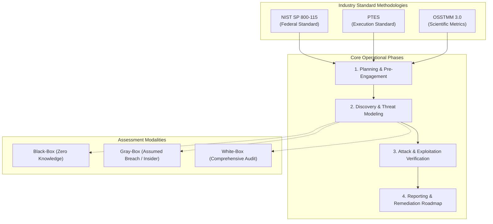

# Volume 07: Network Penetration Testing
# Module 26: Penetration Testing Fundamentals, Scoping & Methodologies

---

## 1. Learning Objectives

By completing this module, network penetration testers, infrastructure security auditors, and security operations engineers will be able to:
1. **Differentiate Testing Modalities**: Analyze the technical architectures, scoping trade-offs, and operational values across Black-Box, Gray-Box, and White-Box network assessments.
2. **Operationalize Enterprise Testing Frameworks**: Map assessment lifecycles to authoritative industry standards: NIST SP 800-115, the Penetration Testing Execution Standard (PTES), and the Open Source Security Testing Methodology Manual (OSSTMM 3.0).
3. **Establish Legally Enforceable Rules of Engagement (RoE)**: Formulate production-safe scoping constraints, emergency contact escalations, and out-of-bounds infrastructure definitions.
4. **Preserve Digital Evidence Chains of Custody**: Implement ISO/IEC 27037-compliant forensic integrity standards, capturing raw packet traces, terminal streams, and cryptographic SHA-256 evidence manifests.
5. **Manage Deconfliction & SOC Coordination**: Coordinate testing telemetry in real time with client Security Operations Centers (SOC) using structured deconfliction ledgers.
6. **Eliminate Operational Fragility Risks**: Execute rate-limited, bandwidth-calibrated network probes that prevent denial of service on legacy routing gear, medical devices, and industrial controllers.

---

## 2. Prerequisites & Operational Requirements

To master the concepts and practical implementations in this module, engineers require:
* **Networking Foundations**: Deep understanding of IPv4/IPv6 addressing, subnetting, TCP three-way handshakes, ICMP messages, and Layer 2 ARP/VLAN structures ([Module 08](file:///home/kali/Ethical_Hacking_VAPT_Master_Notes/Volume_02_Linux_Networking_and_Security_Foundations/Module_08_Networking_Protocols_and_Security.md)).
* **Network Interception & Diagnostics**: Familiarity with packet capturing tools (`tcpdump`, Wireshark) and scanning utilities (`nmap`, `masscan`).
* **Systems Administration**: Working knowledge of Linux and Windows networking configurations, firewall rules, and service architectures.

---

## 3. What Is It? (Architecture & Definitions)

Network Penetration Testing is the authorized, structured simulation of adversary tactics, techniques, and procedures (TTPs) targeting an organization's network perimeter, internal routing infrastructure, switching fabrics, domain environments, servers, and connected endpoints.

Unlike automated vulnerability scanning—which merely matches open ports against known software version banners—network penetration testing actively evaluates the true exploitability of identified defects, determines whether network segmentation boundaries (firewalls, VLANs, ACLs) prevent lateral movement, and establishes the verifiable business risk of infrastructure misconfigurations.

---

## 4. Deep Architecture: Framework Comparison & Testing Modalities



### 4.1 Assessment Modalities Compared

| Dimension | Black-Box (Blind Assessment) | Gray-Box (Translucent Assessment) | White-Box (Comprehensive Audit) |
| :--- | :--- | :--- | :--- |
| **Knowledge Provided** | Target company name or root domain only; no internal details. | Target subnets, standard domain user credentials, architectural diagrams. | Complete firewall ACLs, network topologies, router configs, full credentials. |
| **Simulated Adversary** | External opportunistic hacker or untargeted threat actor. | Malicious insider, rogue contractor, or attacker with initial foothold. | Adversary with complete source code access or compromised administrator. |
| **Time Allocation** | 60% spent on external reconnaissance and perimeter mapping. | 15% recon; 85% focused on internal segmentation, lateral movement, and AD. | 100% focused on architectural verification and deep configuration auditing. |
| **Enterprise ROI** | Moderate; risks missing deep internal risks due to time constraints. | **HIGHEST ROI (Industry Standard)**; maximizes high-value internal testing. | High; best suited for critical infrastructure and hardened environments. |

---

## 5. How It Works: The NIST SP 800-115 & PTES Execution Lifecycle

```
[ Phase 1: Pre-Engagement Scoping & Legal Authorization ]
      │ Finalize Statements of Work (SoW), Rules of Engagement (RoE), and emergency contacts.
      ▼
[ Phase 2: Active & Passive Intelligence Gathering ]
      │ Execute WHOIS queries, BGP prefix mapping, DNS enumeration, and passive OSINT.
      ▼
[ Phase 3: Threat Modeling & Vulnerability Analysis ]
      │ Perform calibrated TCP/UDP SYN sweeps, service version identification, and banner checks.
      ▼
[ Phase 4: Controlled Exploitation & Boundary Verification ]
      │ Execute benign, controlled proof-of-concept tests verifying service exploitability.
      ▼
[ Phase 5: Post-Exploitation, Pivoting & Lateral Movement ]
      │ Evaluate network segmentation controls; verify whether pivots between VLANs are blocked.
      ▼
[ Phase 6: Reporting, Executive Debrief & Remediation Verification ]
      │ Deliver 14-point finding dossiers, executive risk metrics, and conduct formal retests.
```

---

## 6. Security Perspective: Preventing Operational Disruption

Testing live enterprise infrastructure introduces severe operational risks if conducted recklessly:
1. **Buffer Overflows on Fragile Embedded / SCADA Systems**: Legacy operational technology (OT), hospital infusion pumps, and HVAC controllers crash when subjected to rapid SYN port sweeps.
2. **Network Saturation & Stateful Firewall Exhaustion**: High-rate scanning (`masscan` at 50,000 pps) fills state tables in stateful firewalls, dropping legitimate business transactions.
3. **Active Directory Account Lockouts**: Automated credential spraying without checking domain lockout policies (`LockoutThreshold`) locks hundreds of enterprise employee accounts, halting business operations.

---

## 7. Auditing Methodology: The Rules of Engagement (RoE) Matrix

An enterprise Rules of Engagement document must explicitly define the technical and operational boundaries before a single packet is transmitted:

```
+----------------------------------------------------------------------------------------------------+
|                                  ENTERPRISE RULES OF ENGAGEMENT MATRIX                             |
+----------------------------------------------------------------------------------------------------+
| Authorized Source IPs     | 198.51.100.15, 198.51.100.16 (Dedicated static auditor IP addresses)    |
| In-Scope Target Subnets   | 10.100.0.0/16 (Corporate User VLAN), 10.200.10.0/24 (DMZ Services)     |
| Strictly Out-of-Bounds    | 10.300.0.0/16 (Clinical Medical Network), 192.168.99.0/24 (SCADA/OT)   |
| Testing Time Windows      | Monday through Friday: 20:00 - 04:00 UTC (Off-peak maintenance window) |
| Bandwidth Limits          | Maximum 500 packets/sec for port scanning; max 5 Mbps bandwidth usage  |
| Emergency Stop Protocol   | Direct phone hotline to Client Lead: +1-555-0199 (Immediate cessation)  |
+----------------------------------------------------------------------------------------------------+
```

---

## 8. Tooling Deep-Dive: Calibrated Network Diagnostics

### 8.1 Bandwidth-Calibrated Network Discovery with Nmap

```bash
# Calibrated SYN scan with strict rate limiting and packet pacing (avoiding state table drops)
nmap -sS -p- \
     --max-rate 250 \
     --max-retries 1 \
     --host-timeout 30m \
     -oA cal_scan_subnet_10 \
     10.100.10.0/24

# Targeted banner grabbing and safe script enumeration on discovered services
nmap -sV -sC -p 21,22,80,443,445,3389 \
     --version-intensity 5 \
     -oA services_audit \
     10.100.10.25
```

### 8.2 Real-Time Network Packet Tracing via `tcpdump`

```bash
# Capture full raw packet trace during critical test execution for evidence preservation
tcpdump -i eth0 host 10.100.10.25 -w evidence_trace.pcap -C 100 -W 5
```

---

## 9. Practical Lab: Standalone Evidence Chain-of-Custody & Cryptographic Sealer

Deploy this standalone script to maintain an immutable forensic chain of custody across network assessment artifacts, computing SHA-256 digests and generating ISO/IEC 27037-compliant audit manifests.

Save as [`labs/module_26/evidence_chain_of_custody_sealer.py`](file:///home/kali/Ethical_Hacking_VAPT_Master_Notes/labs/module_26/evidence_chain_of_custody_sealer.py):

```python
#!/usr/bin/env python3
"""
================================================================================
MODULE 26 LAB: EVIDENCE CHAIN-OF-CUSTODY & CRYPTOGRAPHIC SEALER
PURPOSE: Implements ISO/IEC 27037 and NIST SP 800-115 digital evidence integrity,
         computing SHA-256 digests, UTC timestamps, and tamper verification.
COMPLIANCE: Authorized auditing methodology / Forensic evidence preservation.
================================================================================
"""

import os
import sys
import json
import hashlib
from datetime import datetime, timezone

def compute_sha256(filepath):
    """Computes streaming SHA-256 digest of a target file."""
    hasher = hashlib.sha256()
    with open(filepath, 'rb') as f:
        while chunk := f.read(65536):
            hasher.update(chunk)
    return hasher.hexdigest()

def seal_evidence_directory(target_dir):
    """Generates an immutable cryptographic manifest of all files in the directory."""
    print("=" * 72)
    print(f"[*] SEALING EVIDENCE DIRECTORY: {target_dir}")
    print("=" * 72)

    manifest_data = {
        "timestamp_utc": datetime.now(timezone.utc).isoformat(),
        "standard": "ISO/IEC 27037:2012 / NIST SP 800-115",
        "artifacts": []
    }

    manifest_filename = "evidence_manifest.json"

    for root, _, files in os.walk(target_dir):
        for fname in sorted(files):
            if fname == manifest_filename or fname.endswith(".manifest.txt"):
                continue
            full_path = os.path.join(root, fname)
            rel_path = os.path.relpath(full_path, target_dir)
            size_bytes = os.path.getsize(full_path)
            digest = compute_sha256(full_path)

            manifest_data["artifacts"].append({
                "relative_path": rel_path,
                "size_bytes": size_bytes,
                "sha256_digest": digest
            })
            print(f"[+] Sealed: {rel_path:35s} | Size: {size_bytes:6d} B | Digest: {digest[:16]}...[MASKED]")

    manifest_path = os.path.join(target_dir, manifest_filename)
    with open(manifest_path, 'w') as mf:
        json.dump(manifest_data, mf, indent=2)

    print(f"\n[+] Sealed {len(manifest_data['artifacts'])} artifacts.")
    print(f"[+] Evidence manifest written to: {manifest_path}")
    return manifest_path

def verify_evidence_manifest(target_dir):
    """Verifies all directory files against the sealed manifest to detect tampering."""
    print("\n" + "=" * 72)
    print(f"[*] VERIFYING EVIDENCE INTEGRITY: {target_dir}")
    print("=" * 72)

    manifest_path = os.path.join(target_dir, "evidence_manifest.json")
    if not os.path.exists(manifest_path):
        print("[-] Manifest not found! Directory is unsealed.")
        return False

    with open(manifest_path, 'r') as mf:
        manifest = json.load(mf)

    all_intact = True
    for item in manifest["artifacts"]:
        fpath = os.path.join(target_dir, item["relative_path"])
        if not os.path.exists(fpath):
            print(f"[!] CRITICAL: Missing artifact: {item['relative_path']}")
            all_intact = False
            continue

        current_digest = compute_sha256(fpath)
        if current_digest == item["sha256_digest"]:
            print(f"[+] VERIFIED: {item['relative_path']:35s} | SHA-256 matches sealed record.")
        else:
            print(f"[!] TAMPER DETECTED: {item['relative_path']:35s} | Checksum mismatch!")
            all_intact = False

    return all_intact
```

---

## 10. Evidence & Verification: Handling Backported Software Patches

A frequent pitfall in network vulnerability auditing is reporting false-positive vulnerabilities based purely on version banners.

### The Linux Package Backporting Reality
Enterprise Linux distributions (Red Hat Enterprise Linux, Debian, Ubuntu LTS) maintain long-term software stability by applying security fixes directly to older package builds without incrementing the upstream version number:

| Service Banner Detected | Upstream Status | Enterprise Distro Backport Status | True Vulnerability Status |
| :--- | :--- | :--- | :--- |
| `Apache/2.4.37 (CentOS)` | Upstream patched in 2.4.52 | `rpm -q --changelog httpd` shows CVE-2021-41773 patched | **NOT VULNERABLE (False Positive)** |
| `OpenSSH_7.4p1 (Debian)` | Upstream patched in 8.2 | `dpkg -l openssh-server` shows backported fix | **NOT VULNERABLE (False Positive)** |
| `vsftpd 2.3.4` | Compromised upstream build | Backdoor verified via non-destructive probe | **CRITICAL VULNERABILITY (True Positive)** |

---

## 11. Telemetry & Defensive Coordination: The SOC Deconfliction Ledger

During active penetration testing, the client Security Operations Center (SOC) may raise security alerts. To distinguish between authorized testing activity and real-world external attacks, assessors maintain a real-time **Deconfliction Ledger**:

```csv
Timestamp_UTC,Assessor_IP,Target_IP,Port,Tool_Used,Action_Executed,Expected_Detection
2026-09-05T10:00:00Z,198.51.100.15,10.100.10.5,445/tcp,nmap,SMBv2 negotiate probe,Port scan alert
2026-09-05T10:05:30Z,198.51.100.15,10.100.10.25,80/tcp,curl,Benign SQLi probe,WAF rule 942100 trigger
2026-09-05T10:12:00Z,198.51.100.15,10.100.10.50,389/tcp,ldapsearch,Unauth LDAP rootDSE query,LDAP recon alert
```

---

## 12. Mitigation & Pre-Engagement Safeguards

1. **Signed Legal Authorization**: Never initiate network scanning without a signed Statement of Work (SoW) containing explicit authorization and hold-harmless indemnification clauses.
2. **Third-Party Cloud Provider Notifications**: For cloud-hosted environments (AWS, Azure, GCP), verify whether penetration testing requires pre-authorization under current cloud provider policies.
3. **Explicit Off-Limits Declarations**: Document in writing all excluded systems (e.g., domain controllers, SCADA equipment, production databases).

---

## 13. CIS & NIST Hardening Controls

| Control ID | Framework | Technical Requirement | Hardening Action |
| :--- | :--- | :--- | :--- |
| **NIST SP 800-53 SC-7** | NIST | Boundary Protection | Enforce internal firewall segmentation between corporate subnets and server farms. |
| **CIS Cisco Benchmark 1.2** | CIS | ICMP Hardening | Disable ICMP redirects and timestamp responses to eliminate network reconnaissance. |
| **IEEE 802.1X** | IEEE | Port-Based Network Access Control | Require cryptographic certificate authentication for all physical switch ports. |
| **CISA Alert AA22-011A** | CISA | SMB Hardening | Block outbound port 445 at perimeter firewalls to prevent NTLM credential harvesting. |

---

## 14. Real-World Case Studies

### Case Study: Hospital Infusion Pump Disruption via Uncalibrated Scanning
During an authorized internal network assessment of a regional hospital network, a penetration testing team launched an automated, high-rate vulnerability scan against the campus `/16` subnet without obtaining a device exclusion list.
* **Operational Failure**: The scanning engine swept an embedded VLAN hosting legacy medical infusion pumps. The pumps' lightweight TCP/IP stacks were overwhelmed by concurrent half-open SYN packets, causing memory exhaustion and triggering emergency device restarts.
* **Assessment Resolution**: Testing was immediately suspended under emergency stop protocols. The Rules of Engagement were amended to mandate segment-by-segment subnet validation, strict device blacklisting, and a maximum scan rate of 50 pps on clinical VLANs.

---

## 15. Common Pitfalls & Anti-Patterns

```
❌ ANTI-PATTERN 1: Launching Uncalibrated High-Speed Scans
   Running `masscan` at 50,000 packets/sec over a shared WAN connection.
   Exhausts router NAT tables, crashes edge firewalls, and causes widespread corporate outage.
   ✔ CORRECT: Calibrate scan rates (--max-rate 250) and schedule active phases during approved maintenance windows.

❌ ANTI-PATTERN 2: Reporting Vulnerabilities from Raw Banner Strings
   Copying automated scanner CVE alerts into final reports without verifying backports.
   Generates 80% false positives on enterprise Linux distributions and destroys auditor credibility.
   ✔ CORRECT: Verify package build strings or execute non-destructive behavioral probes to confirm exploitability.

❌ ANTI-PATTERN 3: Disorganized, Unsealed Evidence Handling
   Saving unorganized screenshots and terminal logs across desktop folders.
   Fails legal evidentiary standards (ISO/IEC 27037); cannot withstand regulatory scrutiny.
   ✔ CORRECT: Maintain structured evidence folders sealed with SHA-256 cryptographic manifests.
```

---

## 16. Professional vs. Naive Methodology

| Operational Phase | Naive / Novice Approach | Professional Application Security Auditor Approach |
| :--- | :--- | :--- |
| **Scoping & Authorization** | Accepts verbal permission; begins scanning without signed legal documentation. | Insists on signed Statements of Work, strict RoE matrices, and emergency contacts. |
| **Network Scanning** | Runs unthrottled SYN scans across all ports; crashes fragile legacy devices. | Calibrates scan rates; consults network engineers regarding embedded/OT systems. |
| **Vulnerability Triage** | Trusts scanner banners blindly; flags dozens of false positives. | Validates package backport changelogs and verifies flaws with benign functional proofs. |
| **Evidence Management** | Scatters screenshots in unversioned folders; cannot prove chain of custody. | Structures evidence in timestamped directories sealed with cryptographic manifests. |

---

## 17. Graded Knowledge Check & Interview Questions

### Beginner Level
1. **Question**: What are the three primary assessment modalities in penetration testing, and how do they differ?
   * *Answer*: Black-Box (assessor has zero prior knowledge; simulates external attacker), Gray-Box (assessor has partial knowledge such as user credentials and subnets; simulates an insider or assumed breach), and White-Box (assessor has complete visibility including source code and network configs; simulates a comprehensive audit).
2. **Question**: Why is a signed Rules of Engagement (RoE) document mandatory before any network scanning begins?
   * *Answer*: The RoE provides explicit legal authorization under computer crime legislation (e.g., US Computer Fraud and Abuse Act), establishes indemnification, defines authorized target boundaries, sets communication protocols, and establishes emergency stop procedures.

### Intermediate Level
3. **Question**: Explain why automated vulnerability scanners frequently report false-positive CVEs on Red Hat Enterprise Linux and Debian systems.
   * *Answer*: Enterprise Linux distributions use software **backporting**. When a security vulnerability is identified, maintainers backport the security patch into the existing stable package version without updating the upstream version number. Vulnerability scanners that perform superficial banner grabbing see the older version number and falsely report the CVE as unpatched.

### Advanced / Scenario-Based
4. **Question**: During an internal network penetration test, the client's SOC detects your port scan and blocks your testing IP at the core firewall. Testing is scheduled to end in 24 hours. How do you handle this situation professionally?
   * *Answer*: Do not attempt to bypass the firewall block using unapproved external IPs. Immediately contact the designated primary client contact and SOC lead using the established RoE communication channel. Review the Deconfliction Ledger to verify that the detected activity was indeed the authorized test. Explain that while the SOC detection is a positive verification of their defensive monitoring capabilities, continuing the test requires restoring connectivity or whitelisting the auditor's IP so remaining scoped assets can be assessed within the agreed window.

---

## 18. Progressive Hands-on Exercises

### Level 1: Scope Parsing & Target Matrix Formulation (Beginner)
* Given a target CIDR (`10.50.0.0/22`) and an exclusion list (`10.50.1.10`, `10.50.2.0/24`), use `nmap` or Python to generate the exact list of in-scope target IP addresses.

### Level 2: Evidence Sealing & Chain of Custody (Intermediate)
* Execute [`labs/module_26/evidence_chain_of_custody_sealer.py`](file:///home/kali/Ethical_Hacking_VAPT_Master_Notes/labs/module_26/evidence_chain_of_custody_sealer.py).
* Create a mock evidence directory containing test logs and packet captures.
* Generate the cryptographic manifest and verify that modifying a single byte in any file triggers an immediate tamper alert.

### Level 3: Bandwidth-Calibrated Scanning Profile (Advanced)
* Configure an `nmap` scan profile optimized for fragile networks: limit packet rate to 100 pps, disable host discovery ping (`-Pn`), set `--max-retries 1`, and format output to XML, Grepable, and standard formats (`-oA`).

---

## 19. Key Takeaways

1. **Gray-Box Yields Maximum Value**: Gray-Box testing provides the highest return on investment by simulating realistic post-compromise adversary behavior.
2. **Rules of Engagement Protect Everyone**: Clear scoping, authorized testing windows, and emergency escalation hotlines prevent legal liability and operational downtime.
3. **Beware Banner False Positives**: Always verify Linux distribution package backports before reporting vulnerabilities based on banner version strings.
4. **Forensic Evidence Must Be Sealed**: Cryptographic SHA-256 manifests maintain an immutable chain of custody compliant with ISO/IEC 27037.
5. **Coordinate via Deconfliction**: Real-time deconfliction ledgers enable SOC teams to distinguish authorized penetration testing from true malicious attacks.

---

## 20. Authoritative References

* **NIST SP 800-115**: *Technical Guide to Information Security Testing and Assessment*.
* **Penetration Testing Execution Standard (PTES)**: *Core Methodology* (`pentest-standard.org`).
* **OSSTMM 3.0**: *Open Source Security Testing Methodology Manual*.
* **ISO/IEC 27037**: *Guidelines for Identification, Collection, Acquisition, and Preservation of Digital Evidence*.
* **CISA Alert AA22-011A**: *Mitigating Attacks on SMB Infrastructure*.
