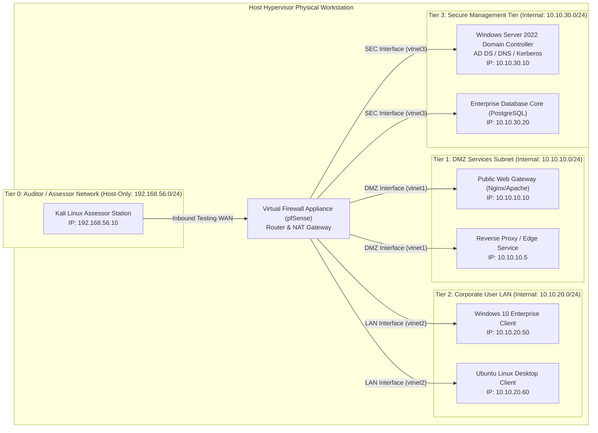

# Volume 07: Network Penetration Testing
# Module 27: Multi-Tier Network Lab Architecture & Isolation Engineering

---

## 1. Learning Objectives

By completing this module, security practitioners, lab architects, and penetration testers will be able to:
1. **Design Software-Defined Enterprise Lab Topologies**: Architect multi-tiered, virtualized enterprise research environments replicating real-world corporate perimeters, DMZs, and internal domains.
2. **Deploy Virtual Firewall & Router Appliances**: Configure and operate pfSense and OPNsense virtual appliances to enforce stateful routing, NAT policies, and inter-VLAN access control lists (ACLs).
3. **Construct Isolated Active Directory Forests**: Deploy Windows Server Domain Controllers, member servers, and enterprise workstations configured with real-world security boundaries.
4. **Enforce Hypervisor Isolation Boundaries**: Master the mechanics of Internal Networks, Host-Only switches, and software-defined bridges across VirtualBox, VMware ESXi, and Proxmox VE.
5. **Automate Infrastructure-as-Code (IaC) Deployments**: Provision and manage multi-system lab environments using Vagrant and hypervisor snapshot trees for instantaneous state rollback.
6. **Audit Virtual Network Containment**: Programmatically verify zero external egress leakage and confirm inter-tier access boundaries using standalone Python testing harnesses.

---

## 2. Prerequisites & Operational Requirements

To successfully construct and operate the lab environments detailed in this module, engineers require:
* **Hypervisor & Hardware Capabilities**: A host system with hardware virtualization (VT-x/AMD-V) enabled, minimum 16 GB RAM (32 GB recommended), and 150 GB free SSD storage.
* **Virtualization Platforms**: Working installation of Oracle VirtualBox 7.x, VMware Workstation Pro, or Proxmox VE.
* **Networking & OS Foundations**: Solid understanding of subnet masks, default gateways, VLAN tagging (802.1Q), and DNS/DHCP operation ([Module 08](../Volume_02_Linux_Networking_and_Security_Foundations/Module_08_Networking_Protocols_and_Security.md)).

---

## 3. What Is It? (Architecture & Definitions)

A **Multi-Tier Network Research Lab** is an isolated, software-defined enterprise environment engineered within a virtualized hypervisor fabric.

In professional penetration testing, single standalone target virtual machines (such as a single Linux VM on a local desktop) fail to replicate enterprise threat dynamics. Modern adversarial techniques—including Kerberoasting, NTLM relaying, Active Directory certificate abuse (ADCS), DNS poisoning, and multi-hop network pivoting—only manifest within complex multi-host topologies containing domain controllers, internal routing boundaries, stateful firewalls, and isolated VLAN tiers.

---

## 4. Deep Architecture: Multi-Tier Subnet Topologies & pfSense Routing



### 4.1 Inter-Tier Access Control Policy Matrix

| Source Tier | Destination Tier | Permitted Protocols & Ports | Policy Action | Operational Rationale |
| :--- | :--- | :--- | :--- | :--- |
| **Auditor WAN** | **Tier 1 (DMZ)** | TCP: 80, 443 | **PERMIT** | Simulates public internet access to external web services. |
| **Auditor WAN** | **Tier 2 (LAN)** | All Protocols | **BLOCK (Default Drop)** | Assessor must pivot through compromised DMZ hosts. |
| **Auditor WAN** | **Tier 3 (SEC)** | All Protocols | **BLOCK (Default Drop)** | Protects core Active Directory infrastructure from direct scan. |
| **Tier 1 (DMZ)** | **Tier 2 (LAN)** | All Protocols | **BLOCK (Default Drop)** | Prevents direct DMZ-to-workstation compromise. |
| **Tier 1 (DMZ)** | **Tier 3 (SEC)** | TCP: 5432 (DB query) | **PERMIT (Strict)** | Allows web app to query database backend only. |
| **Tier 2 (LAN)** | **Tier 3 (SEC)** | TCP/UDP: 53, 88, 389, 445 | **PERMIT (AD Services)**| Allows workstations to authenticate against Active Directory. |

---

## 5. How It Works: Hypervisor Virtual Switch Isolation

Hypervisors isolate and forward network frames using internal software-defined bridges:
1. **Internal Network (VirtualBox `intnet`)**:
   * Packets are switched exclusively in hypervisor memory between virtual network interfaces assigned to the identical network name string (e.g., `intnet-dmz`).
   * The host operating system does **not** create a virtual network adapter and cannot see, inject, or intercept packets on this segment.
2. **Host-Only Network (`vboxnet0` / VMware `vmnet1`)**:
   * Creates a virtual loopback adapter on the host operating system. Connected VMs communicate with each other and with the host OS IP stack, but traffic is not forwarded onto the physical Wi-Fi or Ethernet adapter.
3. **Bridged Adapter (EXTREMELY HAZARDOUS IN LABS)**:
   * Attaches the virtual NIC directly to the physical host network card.
   * **Hazard**: Placing intentionally vulnerable targets (e.g., Metasploitable, unpatched Windows with SMB flaws) on a Bridged adapter exposes them to the entire physical office or home Wi-Fi network, and to external Internet scans if router UPnP is active.

---

## 6. Security Perspective: Preventing Laboratory Contamination

Research laboratories hosting unpatched operating systems and live exploit payloads require rigorous physical and virtual boundaries:
* **Automated Worm Containment**: Self-propagating malware and automated network exploits (such as WannaCry or Mirai bots) scan local subnets via Layer-2 ARP and broadcast traffic. Strict internal virtual switches prevent worms from escaping into the host OS or physical LAN.
* **Host Clipboard & Drag-and-Drop Hardening**: Hypervisor "Guest Additions" features (shared clipboard, drag-and-drop file transfer) represent potential host-escape and accidental execution vectors. These must be disabled on all untrusted target VMs.
* **Shared Folder Isolation**: Never configure auto-mounted read-write host folders on vulnerable target machines.

---

## 7. Auditing Methodology: The Lab Containment Audit Lifecycle

```
[ Phase 1: Virtual Switch & NIC Configuration Audit ]
      │ Inspect hypervisor settings; verify zero target VMs use "Bridged" adapters.
      v
[ Phase 2: Layer-2 Broadcast & ARP Leakage Inspection ]
      │ Run tcpdump on physical host adapter; confirm zero lab ARP/broadcast leakage.
      v
[ Phase 3: External Egress Boundary Testing ]
      │ Transmit outbound TCP/ICMP probes from target VMs to public IPs; verify 100% drop.
      v
[ Phase 4: Inter-Tier Segmentation Verification ]
      │ Probe restricted ports across virtual firewalls; confirm ACLs drop unauthorized traffic.
      v
[ Phase 5: Baseline Snapshot Creation ]
      │ Freeze VM state into pristine cryptographic snapshots for instant rollback.
```

---

## 8. Tooling Deep-Dive: Infrastructure-as-Code with Vagrant & VBoxManage

### 8.1 Multi-Machine Vagrantfile Deployment Template

```ruby
# -*- mode: ruby -*-
# vi: set ft=ruby :
# Multi-Tier Isolated Enterprise Research Lab

Vagrant.configure("2") do |config|
  # 1. Auditor Station (Kali Linux on Host-Only Network)
  config.vm.define "auditor_kali" do |kali|
    kali.vm.box = "kalilinux/rolling"
    kali.vm.network "private_network", ip: "192.168.56.10"
    kali.vm.provider "virtualbox" do |vb|
      vb.memory = "4096"
      vb.cpus = 2
      vb.name = "Lab_Auditor_Kali"
    end
  end

  # 2. DMZ Web Gateway (Internal Switch: intnet-dmz)
  config.vm.define "dmz_gateway" do |dmz|
    dmz.vm.box = "ubuntu/jammy64"
    dmz.vm.network "private_network", ip: "10.10.10.10",
      virtualbox__intnet: "intnet-dmz"
    dmz.vm.provider "virtualbox" do |vb|
      vb.memory = "2048"
      vb.cpus = 1
      vb.name = "Lab_DMZ_Gateway"
    end
  end
end
```

### 8.2 VBoxManage CLI Command Reference

```bash
# List all internal virtual networks active in the hypervisor
VBoxManage list intnets

# Verify virtual network adapter properties of a specific VM
VBoxManage showvminfo "Lab_DMZ_Gateway" --machinereadable | grep -E "nic[0-9]|intnet"

# Create a clean baseline snapshot prior to penetration testing
VBoxManage snapshot "Lab_DMZ_Gateway" take "Clean_Baseline_State"

# Instantaneously restore VM back to pristine state after exploit execution
VBoxManage snapshot "Lab_DMZ_Gateway" restore "Clean_Baseline_State"
```

---

## 9. Practical Lab: Standalone Network Containment & Isolation Auditor

Deploy this standalone script to verify external egress containment and inter-tier access boundaries programmatically.

Save as `network_containment_auditor.py`:

```python
#!/usr/bin/env python3
"""
================================================================================
MODULE 27 LAB: MULTI-TIER NETWORK CONTAINMENT & ISOLATION AUDITOR
PURPOSE: Programmatic verification of virtual lab network segmentation, egress
         leakage testing, and cross-tier access boundary enforcement.
COMPLIANCE: Authorized testing only / Standard benign network diagnostic probing.
================================================================================
"""

import socket
import threading
import http.server
import time
import sys

class MockBoundaryListener(http.server.BaseHTTPRequestHandler):
    """Simulates an internal protected management service on a restricted subnet."""
    def log_message(self, format, *args):
        pass

    def do_GET(self):
        self.send_response(200)
        self.send_header("Content-Type", "application/json")
        self.end_headers()
        self.wfile.write(b'{"service": "ad_domain_controller", "status": "protected"}')

def test_egress_containment(probe_endpoints):
    """Audits whether lab VMs can establish unauthorized outbound connections to the internet."""
    print("=" * 72)
    print("[*] 1. AUDITING EXTERNAL EGRESS CONTAINMENT")
    print("=" * 72)

    leaks_found = 0
    for host, port in probe_endpoints:
        sock = socket.socket(socket.AF_INET, socket.SOCK_STREAM)
        sock.settimeout(1.0)
        try:
            sock.connect((host, port))
            sock.close()
            print(f"    [!] CRITICAL LEAK: Connection succeeded to {host}:{port}!")
            leaks_found += 1
        except (socket.timeout, ConnectionRefusedError, OSError):
            print(f"    [+] PASS (Contained): Connection blocked to {host}:{port}")

    if leaks_found == 0:
        print("[+] External egress containment confirmed: Zero outbound leaks.")
    else:
        print(f"[-] WARNING: {leaks_found} outbound connections succeeded. Check firewall NAT rules.")
    return leaks_found == 0

def test_tier_segmentation(target_ip, target_port, expected_blocked=True):
    """Audits inter-tier network segmentation barriers (e.g. DMZ -> Management Tier)."""
    print("\n" + "=" * 72)
    print(f"[*] 2. AUDITING INTER-TIER SEGMENTATION BARRIER: {target_ip}:{target_port}")
    print("=" * 72)

    sock = socket.socket(socket.AF_INET, socket.SOCK_STREAM)
    sock.settimeout(1.0)
    try:
        sock.connect((target_ip, int(target_port)))
        sock.close()
        connected = True
    except (socket.timeout, ConnectionRefusedError, OSError):
        connected = False

    if expected_blocked:
        if not connected:
            print(f"    [+] PASS: Direct access to {target_ip}:{target_port} blocked by policy.")
            return True
        else:
            print(f"    [!] VIOLATION: Unauthorized direct access to {target_ip}:{target_port} established!")
            return False
    else:
        if connected:
            print(f"    [+] PASS: Authorized connection established to {target_ip}:{target_port}.")
            return True
        else:
            print(f"    [-] FAIL: Expected authorized path to {target_ip}:{target_port} is blocked.")
            return False
```

---

## 10. Evidence & Verification: Verifying True Isolation

### 10.1 Diagnostic Checklist for Virtual Isolation Verification

```bash
# 1. Audit Hypervisor NIC Bindings (Must show 'intnet' or 'hostonly', never 'bridged')
VBoxManage showvminfo "Lab_Target_VM" --machinereadable | grep "nic1"
# Expected output: nic1="intnet"

# 2. Audit Physical Host Network Sniffer (Must show 0 packets from 10.10.x.x)
sudo tcpdump -i eth0 net 10.10.0.0/16 -c 10 --timeout 5
# Expected output: 0 packets captured

# 3. Audit Default Gateway on Target VM
ip route show
# Expected output: default via 10.10.10.1 (pointing strictly to pfSense VM)
```

---

## 11. Telemetry & Defensive Detection: Virtual SPAN & SIEM

In advanced research environments, virtual network taps (SPAN ports) route inter-tier packets to an automated monitoring appliance:
* **pfSense Port Mirroring**: Configure pfSense to clone all traffic passing through the DMZ and LAN interfaces to a dedicated monitoring interface attached to a **Security Onion** or **Suricata** sensor VM.
* **Syslog Forwarding**: Export all firewall packet filter drop logs to a local Elastic/Splunk instance to evaluate firewall alerting fidelity in real time.

---

## 12. Mitigation & Laboratory Containment Safeguards

1. **Air-Gapped NAT Configurations**: In pfSense, configure WAN NAT as manual/disabled for target subnets, ensuring target VMs cannot initiate outbound stateful connections to the internet.
2. **Strict DHCP Lease Scope Restrictions**: Configure DHCP servers to distribute static leases strictly mapped to known MAC addresses, preventing unapproved rogue VMs from obtaining IP addresses.
3. **Immutable Base Virtual Hard Disks**: Mark base `.vdi` or `.vmdk` disk files as "Immutable" in the hypervisor, forcing all writes into temporary differencing disks that are discarded upon reboot.

---

## 13. CIS & NIST Hardening Controls

| Control ID | Framework | Technical Requirement | Hardening Action |
| :--- | :--- | :--- | :--- |
| **NIST SP 800-115 §3.1** | NIST | Isolated Testing Environment | Maintain logically or physically separate networks for security testing activities. |
| **CIS VirtualBox Benchmark 1.2** | CIS | Guest Additions Restrictions | Disable shared clipboards and drag-and-drop on all untrusted virtual machines. |
| **PCI-DSS v4.0 Req 1.2** | PCI-DSS | Network Segmentation | Restrict inbound and outbound traffic to that which is necessary for business operations. |
| **ISO/IEC 27001 A.12.1.4** | ISO | Separation of Test Environments | Keep test and operational facilities completely segregated to prevent accidental data compromise. |

---

## 14. Real-World Case Studies

### Case Study: Conficker Worm Infection Escaping to Corporate LAN
A security researcher configured a vulnerable Windows XP virtual machine to analyze the MS08-067 (NetAPI) vulnerability. To simplify software updates, the researcher attached the VM to a **Bridged Network Adapter** on the corporate office Wi-Fi network.
* **The Failure**: Within 180 seconds of boot, the unpatched VM was infected by an automated worm propagating over SMB port 445 on the local subnet. The infected machine immediately began launching high-frequency port 445 scans against adjacent executive workstations.
* **Architectural Lesson**: Intentionally vulnerable research systems must **never** be attached to Bridged adapters. They must reside on isolated Internal Networks (`intnet`) behind a virtual firewall with strict egress filtering.

---

## 15. Common Pitfalls & Anti-Patterns

```
❌ ANTI-PATTERN 1: Deploying Target VMs on Bridged Adapters
   Configuring vulnerable machines on Bridged adapters for convenience.
   Exposes unpatched systems to the local physical LAN and public internet, risking automated exploitation.
   ✔ CORRECT: Use Internal Virtual Switches (intnet) with pfSense acting as the isolated gateway.

❌ ANTI-PATTERN 2: Performing Exploit Tests Without Baseline Snapshots
   Executing complex privilege escalation or kernel exploits on a single base VM image.
   Corrupts system files and registry hives, requiring hours of manual re-installation.
   ✔ CORRECT: Take clean hypervisor snapshots before every testing phase; roll back in 5 seconds.

❌ ANTI-PATTERN 3: Overcommitting Physical RAM to Virtual Machines
   Allocating 24 GB of RAM to virtual machines on a 16 GB physical workstation.
   Forces the host operating system into disk swap thrashing, causing system freezes.
   ✔ CORRECT: Budget VM memory conservatively (e.g., 2 GB for Linux targets, 4 GB for Windows Server Core).
```

---

## 16. Professional vs. Naive Methodology

| Operational Phase | Naive / Novice Approach | Professional Application Security Auditor Approach |
| :--- | :--- | :--- |
| **Lab Architecture** | Runs a single VM on a flat, unsegmented network without a firewall. | Architectures a multi-tier environment (DMZ, LAN, SEC) routed through pfSense. |
| **Network Isolation** | Assumes the VM is safe; never tests for external egress or packet leakage. | Executes automated socket scripts verifying 100% containment and zero Layer-2 leaks. |
| **Environment Recovery** | Re-installs operating systems manually from ISO files after system crashes. | Employs Vagrant IaC templates and automated snapshot rollbacks. |
| **Adversarial Realism** | Attacks services directly over the local subnet without firewall boundaries. | Forces testing through realistic multi-hop pivots, reverse proxies, and ACL barriers. |

---

## 17. Graded Knowledge Check & Interview Questions

### Beginner Level
1. **Question**: What is the primary security difference between a 'Host-Only' network and an 'Internal Network' in hypervisors?
   * *Answer*: In a Host-Only network, the hypervisor creates a virtual network interface on the physical host operating system. The host OS can communicate directly with the guest VMs. In an Internal Network, communication occurs strictly between guest VMs inside hypervisor memory; the host operating system does not participate in the network and cannot route packets on it, providing maximum isolation.
2. **Question**: Why is taking a baseline hypervisor snapshot mandatory before executing exploit code in a research lab?
   * *Answer*: Exploits frequently alter registry keys, modify system binaries, install background services, or crash operating system components. A baseline snapshot allows the auditor to roll the machine back to a pristine, uncompromised state in seconds, ensuring test repeatability.

### Intermediate Level
3. **Question**: Explain why a multi-tier lab containing a virtual firewall is required to simulate realistic enterprise Active Directory attacks.
   * *Answer*: In enterprise environments, Domain Controllers and core database servers are not placed on the same flat subnet as standard workstations; they reside in protected server tiers segregated by internal firewalls. A multi-tier lab forces the researcher to navigate real-world network boundaries, test egress filtering, and implement network pivoting (e.g., SSH tunneling, Chisel, or SOCKS proxies) to reach domain infrastructure.

### Advanced / Scenario-Based
4. **Question**: You are configuring a pfSense virtual appliance in a lab. How do you configure firewall rules to permit a compromised DMZ web server (`10.10.10.10`) to query a backend database (`10.10.30.20:5432`), while strictly blocking the DMZ server from initiating any other traffic into the management subnet?
   * *Answer*: In the pfSense WebGUI under **Firewall -> Rules -> DMZ**:
     1. Add a rule: Action = Pass, Interface = DMZ, Address Family = IPv4, Protocol = TCP, Source = `10.10.10.10`, Destination = `10.10.30.20`, Port = `5432` (PostgreSQL).
     2. Add a subsequent rule immediately below it: Action = Block, Interface = DMZ, Address Family = IPv4, Protocol = Any, Source = `DMZ net`, Destination = `SEC net` (`10.10.30.0/24`).
     Because pfSense evaluates rules from top to bottom on first match, only TCP 5432 queries to the database are allowed; all other lateral movement attempts into the management tier are dropped.

---

## 18. Progressive Hands-on Exercises

### Level 1: Hypervisor Internal Network Configuration (Beginner)
* Create two Linux virtual machines in VirtualBox.
* Attach both VMs to an Internal Network named `intnet-research`. Assign static IP addresses (`10.10.10.11` and `10.10.10.12`).
* Verify that `ping 10.10.10.12` succeeds, while `ping 8.8.8.8` fails immediately, proving complete isolation from the internet.

### Level 2: Virtual Firewall Deployment & Inter-VLAN Routing (Intermediate)
* Deploy a pfSense virtual appliance. Assign Interface 1 to Host-Only (`192.168.56.1/24`) and Interface 2 to `intnet-research` (`10.10.10.1/24`).
* Configure pfSense as the default gateway for the research VMs.
* Create a firewall rule in pfSense blocking all outbound DNS (UDP 53) from the research subnet to simulate an air-gapped enterprise network.

### Level 3: Programmatic Containment Verification (Advanced)
* Execute `network_containment_auditor.py` from within a guest VM.
* Verify that external egress probes are blocked while authorized internal services remain accessible.

---

## 19. Key Takeaways

1. **Replicate Enterprise Realism**: Multi-tier virtual topologies replicate real corporate network perimeters, DMZs, and Active Directory domains.
2. **Never Use Bridged Adapters**: Attaching vulnerable targets to Bridged adapters exposes the physical host and local network to worm propagation and external scans.
3. **State Rollback via Snapshots**: Baseline snapshots ensure instant recovery from destructive exploit payloads and system crashes.
4. **Programmatic Containment Verification**: Use automated socket harnesses to verify zero packet leakage before initiating assessments.
5. **Enforce Principle of Least Privilege**: Firewall rules between lab tiers must explicitly deny all traffic by default, whitelisting only essential service ports.

---

## 20. Authoritative References

* **NIST SP 800-115**: *Technical Guide to Information Security Testing and Assessment* (Section 3).
* **VirtualBox Documentation**: *Chapter 6 - Virtual Networking Architectures* (`virtualbox.org/manual`).
* **pfSense Community Edition**: *Firewall Rules and Inter-VLAN Routing Documentation* (`docs.netgate.com`).
* **PCI-DSS v4.0**: *Requirement 1 - Install and Maintain Network Security Controls*.
* **ISO/IEC 27001:2022**: *Annex A.12.1.4 - Separation of Development, Testing and Operational Environments*.
