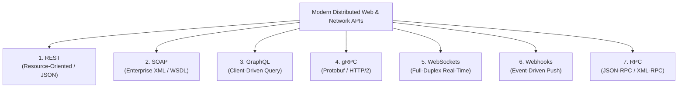

# Volume 08: API Security
# Master Guide: API Architectures, Protocols, Types & Security Assessment
## An Exhaustive Technical Analysis of REST, SOAP, GraphQL, gRPC, WebSockets, Webhooks, RPC, and System APIs

---

## 1. Executive Overview & Learning Objectives

Application Programming Interfaces (APIs) represent the primary architectural fabric connecting modern distributed computing systems. In contemporary enterprise infrastructure, APIs account for over **80% of all global internet traffic**. They power mobile application backends, single-page application (SPA) frontends, cloud-native microservice meshes, payment gateway integrations, and autonomous AI agent tool-calling pipelines.

Understanding the internal mechanics, serialization standards, statefulness models, and attack surfaces of different API types is a mandatory core competency for application security engineers, penetration testers, and software architects.

By completing this master guide, practitioners will be able to:
1. **Deconstruct the Spectrum of APIs**: Distinguish between low-level Operating System/Hardware APIs and distributed Web/Network APIs.
2. **Master the 7 Primary Web API Architectural Styles**: Detail the protocol mechanics, message structures, and communication lifecycles of **REST**, **SOAP**, **GraphQL**, **gRPC**, **WebSockets**, **Webhooks**, and **RPC (JSON-RPC / XML-RPC)**.
3. **Analyze Serialization & Wire Formats**: Contrast text-based serialization (JSON, XML) against binary serialization (Protocol Buffers) and examine the performance, bandwidth, and security implications of each.
4. **Identify Protocol-Specific Vulnerability Sinks**: Systematically audit for Broken Object Level Authorization (BOLA), XML External Entity (XXE) injection, GraphQL circular query DoS, gRPC reflection exposure, Cross-Site WebSocket Hijacking (CSWSH), and Webhook HMAC forgery.
5. **Implement Gateway-Level Defensive Controls**: Deploy schema-enforcing API gateways, query depth and complexity limiters, cryptographic token signature verifiers, and mutual TLS (mTLS) microservice architectures.

---

## 2. Taxonomy: Operating System APIs vs. Web & Network APIs

Before analyzing network-based web APIs, security engineers must understand the broader computer science definition of an API: **a contract-based abstraction boundary that allows two distinct software components to communicate without either needing to know the internal implementation details of the other.**

```
+-----------------------------------------------------------------------------------------------+
|                                      THE SPECTRUM OF APIS                                     |
+-----------------------------------------------------------------------------------------------+
|                                                                                               |
|  1. OPERATING SYSTEM & SYSTEM CALL APIS (Local Machine / In-Process / Ring 0 <-> Ring 3)      |
|     - POSIX System Calls (read, write, fork, execve, socket)                                  |
|     - Microsoft Win32 API (kernel32.dll, user32.dll, advapi32.dll)                            |
|     - Windows Native NT API (ntdll.dll: NtCreateProcess, NtAllocateVirtualMemory)             |
|                                                                                               |
|  2. HARDWARE, GRAPHICS & COMPUTE ACCELERATION APIS (Hardware Abstraction)                     |
|     - Direct3D, OpenGL, Vulkan, Apple Metal, NVIDIA CUDA, OpenCL                              |
|                                                                                               |
|  3. PROGRAMMING LANGUAGE RUNTIME & SDK APIS (Compile-Time / Link-Time)                        |
|     - Java Standard Library (java.util.*), Python Standard Library, C++ STL, .NET BCL         |
|                                                                                               |
|  4. DISTRIBUTED NETWORK & WEB APIS (Inter-Host / Network Sockets / Layer 7 Protocols)         |
|     ├── Resource-Oriented: REST (JSON/XML over HTTP/1.1 & HTTP/2)                             |
|     ├── Contract-Based Enterprise: SOAP (XML Envelope over HTTP/SMTP with WSDL)               |
|     ├── Client-Specified Query: GraphQL (Queries/Mutations over HTTP, Subscriptions over WS)  |
|     ├── High-Performance Microservice RPC: gRPC (Protocol Buffers over HTTP/2)               |
|     ├── Full-Duplex Real-Time Streaming: WebSockets (RFC 6455 persistent TCP channel)         |
|     ├── Event-Driven Reverse APIs: Webhooks (Asynchronous HTTP POST push notifications)       |
|     └── Action-Oriented Procedure Calls: JSON-RPC 2.0 & XML-RPC                              |
+-----------------------------------------------------------------------------------------------+
```

### 2.1 System APIs: The Foundation of OS Execution
* **POSIX APIs (Linux/Unix)**: Standardized by IEEE 1003.1. When a C program invokes `open("/etc/passwd", O_RDONLY)`, it calls the C standard library (`glibc`), which prepares the CPU registers (`RAX = 2` on x86_64 for `sys_open`) and executes the `syscall` CPU instruction to transition from Ring 3 to Ring 0.
* **Win32 & Native NT APIs (Windows)**: When a Windows application invokes `CreateFileW`, the call traverses `kernel32.dll` -> `KernelBase.dll` -> `ntdll.dll` (which exposes the Native API stub `NtCreateFile`) -> executes the `syscall` instruction -> kernel-mode execution inside `ntoskrnl.exe`.

### 2.2 Network & Web APIs: Distributed Systems Communication
Unlike local system APIs that rely on CPU registers and shared memory, distributed Web APIs execute across physical and logical network boundaries. They encapsulate communication over the **OSI Application Layer (Layer 7)**, predominantly leveraging HTTP/1.1, HTTP/2, or raw TCP sockets.

---

## 3. Deep Architectural Analysis: The 7 Primary Web API Types



---

### 3.1 Type 1: REST (Representational State Transfer)

#### 1. Architectural Principles & History
Formulated by **Roy Fielding** in his seminal 2000 doctoral dissertation (*"Architectural Styles and the Design of Network-based Software Architectures"*), REST is **not a strict protocol or standard**—it is an **architectural style** governed by six fundamental constraints:
1. **Client-Server Separation**: The user interface concerns are decoupled from data storage concerns.
2. **Statelessness**: Every request from client to server must contain all of the context and authentication required to understand and process the request. No client session state is stored on the server between requests.
3. **Cacheability**: Responses must explicitly define themselves as cacheable or non-cacheable (`Cache-Control`, `ETag`, `Last-Modified`) to prevent clients from retrieving stale data and reduce network overhead.
4. **Uniform Interface**: The cornerstone of REST. Resources are identified by URIs; resources are manipulated through representations (e.g., JSON); messages are self-descriptive; and interactions adhere to **HATEOAS** (Hypermedia as the Engine of Application State).
5. **Layered System**: A client cannot tell whether it is connected directly to the end server or to an intermediary (load balancer, API gateway, reverse proxy, CDN).
6. **Code on Demand (Optional)**: Servers can temporarily extend client functionality by transferring executable code (e.g., JavaScript).

#### 2. Protocol Anatomy & CRUD Mapping
REST treats data elements as **Resources**, which are referenced as nouns in hierarchical URIs. Actions are performed exclusively via standard **HTTP Methods (Verbs)**:

| HTTP Method | CRUD Operation | Idempotent? | Safe? | Typical Response Codes | Security Context |
| :--- | :--- | :---: | :---: | :--- | :--- |
| **`GET`** | Read / Retrieve | **Yes** | **Yes** | `200 OK`, `404 Not Found` | Must never mutate server-side state. Sensitive data in query parameters risks log exposure. |
| **`POST`** | Create / Append | **No** | **No** | `201 Created`, `400 Bad Request` | Target for Mass Assignment and Injection attacks. |
| **`PUT`** | Replace / Overwrite | **Yes** | **No** | `200 OK`, `204 No Content` | Complete resource replacement. If fields are omitted, they may be overwritten with nulls. |
| **`PATCH`** | Partial Modification | **No** | **No** | `200 OK`, `204 No Content` | Target for BOPLA (Broken Object Property Level Authorization) by injecting unauthorized attributes. |
| **`DELETE`** | Remove | **Yes** | **No** | `200 OK`, `204 No Content`, `404` | High-value target for Broken Function Level Authorization (BFLA). |
| **`OPTIONS`** | Capability Discovery | **Yes** | **Yes** | `200 OK`, `204 No Content` | Used in CORS preflight requests (`Access-Control-Allow-Methods`). |
| **`HEAD`** | Read Headers Only | **Yes** | **Yes** | `200 OK`, `404 Not Found` | Identical to GET but returns no message body; used to test resource existence. |

#### 3. Real-World Wire Example
```http
POST /api/v2/organizations/org_9912/members HTTP/1.1
Host: api.enterprise.internal
Authorization: Bearer eyJh****REDACTED
Content-Type: application/json
Accept: application/json

{
  "user_email": "auditor@company.internal",
  "role": "Analyst",
  "department_id": 401
}
```

#### 4. Security Attack Surface & Vulnerability Sinks
* **Broken Object Level Authorization (BOLA / IDOR - OWASP API1:2023)**: If the server checks that the caller possesses a valid session token, but fails to verify that the caller owns `org_9912`, changing the URI path to `org_9913` exposes or modifies another tenant's data.
* **Broken Object Property Level Authorization (BOPLA / Mass Assignment - OWASP API3:2023)**: If the backend model deserializer blindly binds incoming JSON properties to the internal database entity, an attacker appends `"is_admin": true` or `"verified": true` to elevate privileges.
* **Lack of Resource & Rate Limiting (OWASP API4:2023)**: Absence of token-bucket rate limiting on resource-heavy queries (e.g., `GET /api/v2/reports?page_size=1000000`) induces memory exhaustion denial of service.

---

### 3.2 Type 2: SOAP (Simple Object Access Protocol)

#### 1. Architectural Principles & History
Developed in 1998 by Microsoft, DevelopMentor, and UserLand Software, and subsequently standardized by the **World Wide Web Consortium (W3C)**, SOAP was designed for formal, strongly typed enterprise distributed computing. 

Unlike REST, which is an architectural style, SOAP is a **strict, standardized messaging protocol**. It operates exclusively using **XML (Extensible Markup Language)**.

#### 2. Protocol Anatomy & The SOAP Envelope
Every SOAP communication consists of a strictly structured XML document composed of four core elements:

```
+-------------------------------------------------------------------------------+
| SOAP ENVELOPE (<soap:Envelope>)                                               |
|                                                                               |
|   +-----------------------------------------------------------------------+   |
|   | SOAP HEADER (<soap:Header>) - Optional                                |   |
|   |   - WS-Security (Authentication Tokens, X.509 Signatures, Encryption) |   |
|   |   - WS-Addressing (Routing Information, Message IDs)                  |   |
|   |   - Transaction Management (WS-AtomicTransaction)                     |   |
|   +-----------------------------------------------------------------------+   |
|                                                                               |
|   +-----------------------------------------------------------------------+   |
|   | SOAP BODY (<soap:Body>) - Mandatory                                   |   |
|   |   - The actual procedure call or data payload                         |   |
|   |   - Method Name: <m:GetAccountBalance>                                |   |
|   |   - Method Parameters: <m:AccountId>10092</m:AccountId>               |   |
|   |                                                                       |   |
|   |   +---------------------------------------------------------------+   |   |
|   |   | SOAP FAULT (<soap:Fault>) - Only present in Error Responses   |   |   |
|   |   |   - Fault Code: <faultcode>SOAP-ENV:Server</faultcode>        |   |   |
|   |   |   - Fault String: <faultstring>Access Denied</faultstring>    |   |   |
|   |   +---------------------------------------------------------------+   |   |
|   +-----------------------------------------------------------------------+   |
+-------------------------------------------------------------------------------+
```

#### 3. Formal Service Contract: WSDL & XSD
SOAP services are strictly defined by a **WSDL (Web Services Description Language)** file (an XML document ending in `?wsdl`). The WSDL acts as a binding legal contract defining:
* `<types>`: Data type definitions using XML Schema Definition (XSD).
* `<message>`: Formal parameters of each method.
* `<portType>`: Operations (functions) performed by the web service.
* `<binding>`: Concrete protocol (e.g., SOAP over HTTP).
* `<service>`: Network endpoint location (URL).

#### 4. Real-World Wire Example
```xml
POST /ws/BankingService HTTP/1.1
Host: corebanking.enterprise.internal
Content-Type: text/xml; charset=utf-8
SOAPAction: "http://banking.enterprise.internal/TransferFunds"

<?xml version="1.0" encoding="utf-8"?>
<soap:Envelope xmlns:soap="http://schemas.xmlsoap.org/soap/envelope/"
               xmlns:bank="http://banking.enterprise.internal/">
  <soap:Header>
    <wsse:Security xmlns:wsse="http://docs.oasis-open.org/wss/2004/01/oasis-200401-wss-wssecurity-secext-1.0.xsd">
      <wsse:UsernameToken>
        <wsse:Username>svc_core_app</wsse:Username>
        <wsse:Password>P@ssw0rd123!</wsse:Password>
      </wsse:UsernameToken>
    </wsse:Security>
  </soap:Header>
  <soap:Body>
    <bank:TransferFunds>
      <bank:SourceAccount>10029384</bank:SourceAccount>
      <bank:DestinationAccount>99827162</bank:DestinationAccount>
      <bank:Amount>5000.00</bank:Amount>
    </bank:TransferFunds>
  </soap:Body>
</soap:Envelope>
```

#### 5. Security Attack Surface & Vulnerability Sinks
* **XML External Entity (XXE) Injection**: Because SOAP parses XML bodies, if the underlying XML parser does not explicitly disable DTDs (Document Type Definitions) and External Entities (`resolve-externals = false`), an attacker embeds `<!ENTITY xxe SYSTEM "file:///etc/passwd">`, extracting files or triggering internal SSRF.
* **XML Signature Wrapping (XSW)**: When WS-Security digital signatures are verified, flaws in the XML DOM traversal allow attackers to clone the signed `<soap:Body>`, inject a malicious unsigned body, and reposition the signature block, tricking the server into executing arbitrary transactions while reporting signature verification success.
* **Billion Laughs / XML Entity Expansion**: Nested entity definitions consume gigabytes of RAM during XML parsing, crashing the service (ReDoS / Memory Exhaustion).

---

### 3.3 Type 3: GraphQL

#### 1. Architectural Principles & History
Developed internally by **Meta (Facebook)** in 2012 and open-sourced in 2015, GraphQL was created to solve severe architectural limitations encountered when building complex mobile applications over mobile cellular networks using REST:
* **Over-Fetching**: REST endpoints frequently return hundreds of unnecessary database fields when the mobile UI only requires two fields (e.g., username and avatar).
* **Under-Fetching & N+1 Request Cascades**: To render a single dashboard, a mobile client had to execute separate sequential HTTP requests: `/users/1` -> `/users/1/posts` -> `/posts/5/comments` -> `/comments/12/author`.

GraphQL introduces a revolutionary architectural paradigm: **The client issues a single query to a single endpoint, describing the exact shape of the desired data, and the server returns a JSON response perfectly matching that shape.**

#### 2. Protocol Anatomy: Queries, Mutations & Subscriptions
GraphQL APIs operate via a **single HTTP POST endpoint** (conventionally `/graphql`):
1. **Queries (Read Operations)**: Equivalent to SQL `SELECT` or HTTP `GET`.
2. **Mutations (Write Operations)**: Equivalent to SQL `INSERT`/`UPDATE`/`DELETE` or HTTP `POST`/`PUT`/`PATCH`.
3. **Subscriptions (Real-Time Push Operations)**: Persistent connections over WebSockets that push data to the client whenever server-side events occur.

#### 3. Schema Definition Language (SDL) & Resolvers
The backend defines a strongly typed schema. Each field in the schema is backed by a **Resolver** (a function that queries a database or internal service):

```graphql
type User {
  id: ID!
  username: String!
  email: String!
  orders(limit: Int): [Order]
}

type Order {
  id: ID!
  totalAmount: Float!
  status: String!
}

type Query {
  user(id: ID!): User
}
```

#### 4. Real-World Wire Example
**Request:**
```http
POST /graphql HTTP/1.1
Host: api.retailer.internal
Authorization: Bearer eyJh****REDACTED
Content-Type: application/json

{
  "query": "query GetUserOrders($userId: ID!) { user(id: $userId) { username email orders(limit: 2) { id totalAmount } } }",
  "variables": { "userId": "8841" }
}
```

**Deterministic Server Response:**
```json
{
  "data": {
    "user": {
      "username": "alice_sec",
      "email": "alice@company.internal",
      "orders": [
        { "id": "ORD-101", "totalAmount": 149.50 },
        { "id": "ORD-102", "totalAmount": 29.99 }
      ]
    }
  }
}
```

#### 5. Security Attack Surface & Vulnerability Sinks
* **Introspection Query Information Disclosure**: In production, if schema introspection is enabled, an attacker sends an `__schema` introspection query. The server returns the entire data graph, exposing internal database models, hidden administrative fields, and deprecated mutations.
* **Deeply Nested / Circular Query Denial of Service**: If relationships are circular (`User -> Orders -> User -> Orders`), an attacker crafts a query nested 1,000 levels deep. When executed, the backend spawns millions of nested database queries, freezing the database server.
* **Batching Attacks (Rate Limit Bypass)**: Attackers exploit GraphQL batching to bypass authentication rate limits. By submitting an array of 500 `login(username, password)` mutations inside a single HTTP POST request, a brute-force attack executes in seconds while registering as only one request at the WAF.
* **Field-Level Authorization Drift**: Developers frequently enforce access control checks at the root query resolver (`user()`), but forget to implement authorization checks inside nested relationship resolvers (`orders()`), allowing users to access unauthorized nested data models.

---

### 3.4 Type 4: gRPC (Google Remote Procedure Call)

#### 1. Architectural Principles & History
Created by **Google** in 2015 based on their internal infrastructure project **Stubby**, gRPC was designed to deliver high-throughput, microsecond-latency communication across massive, containerized microservice meshes (e.g., Kubernetes).

Traditional REST APIs using JSON over HTTP/1.1 suffer from severe performance bottlenecks in microservice fabrics:
* JSON is plain text and must be repeatedly parsed, tokenized, and serialized, consuming high CPU cycles.
* HTTP/1.1 enforces **Head-of-Line Blocking**: each TCP socket can only handle one active HTTP request-response cycle at a time.

gRPC solves these bottlenecks through two foundational technologies:
1. **Binary Serialization via Protocol Buffers (`protobuf`)**.
2. **Transport exclusively over HTTP/2**.

#### 2. Protocol Buffers (`.proto`) Interface Definition
Instead of JSON schemas, gRPC contracts are defined in strictly typed `.proto` files. The Protocol Buffer compiler (`protoc`) compiles these files directly into native classes in Go, Python, C++, Java, or Rust:

```protobuf
syntax = "proto3";

package enterprise.billing;

service PaymentService {
  rpc ProcessTransaction (PaymentRequest) returns (PaymentResponse);
  rpc StreamTransactions (TransactionStreamRequest) returns (stream PaymentResponse);
}

message PaymentRequest {
  string account_id = 1;
  double amount = 2;
  string currency = 3;
}

message PaymentResponse {
  string transaction_id = 1;
  bool is_successful = 2;
  string error_message = 3;
}
```

#### 3. Communication Patterns
gRPC supports four distinct execution modes:
1. **Unary RPC**: Classic Client -> Server request, Server -> Client response.
2. **Server Streaming RPC**: Client sends single request; server responds with an asynchronous stream of binary messages.
3. **Client Streaming RPC**: Client sends an asynchronous stream of binary messages; server processes them and returns a single summary response.
4. **Bidirectional Streaming RPC**: Client and server concurrently stream binary messages over a single multiplexed connection.

#### 4. The Power of HTTP/2 Multiplexing
Because gRPC operates over HTTP/2:
* A single persistent TCP connection between two microservices can multiplex thousands of concurrent requests simultaneously across distinct HTTP/2 stream identifiers.
* HTTP/2 HPACK header compression drastically cuts bandwidth.
* Payloads are transmitted as compact binary byte sequences rather than verbose UTF-8 JSON text strings.

#### 5. Security Attack Surface & Vulnerability Sinks
* **gRPC Server Reflection Exposure**: If the server has the reflection service registered in production (`grpc.reflection.v1alpha.ServerReflection`), tools like `grpcurl` or `grpcui` can query the server over the wire and extract the complete `.proto` interface definition, exposing internal private RPC services.
* **Missing Mutual TLS (mTLS) in Service Meshes**: Because gRPC is primarily used for internal inter-service communication, organizations often mistakenly assume the internal network is trusted and transmit sensitive cleartext credentials without TLS.
* **HTTP/2 Stream Multiplexing Denial of Service (Rapid Reset)**: The HTTP/2 Rapid Reset vulnerability (CVE-2023-44487) exploited HTTP/2 multiplexing by opening thousands of streams and immediately resetting them with `RST_STREAM` frames, exhausting server CPU without registering TCP connection resets.

---

### 3.5 Type 5: WebSockets (Full-Duplex Real-Time Streaming)

#### 1. Architectural Principles & History
Standardized by the IETF in 2011 as **RFC 6455**, WebSockets revolutionized real-time web applications (financial trading tickers, collaborative document editing, chat platforms, multiplayer gaming, live telemetry monitoring).

Historically, web browsers had to simulate real-time updates using inefficient polling techniques:
* **Short Polling**: Browser sends an HTTP request every 1 second asking "Is there new data?" (Massive network waste).
* **Long Polling**: Server holds the HTTP connection open until new data arrives, then closes it. The browser must immediately establish a brand-new TCP and TLS connection.

WebSockets replace this with a **single, long-lived, full-duplex, bidirectional communication channel operating over a single TCP connection**.

#### 2. The WebSocket Upgrade Handshake
A WebSocket connection begins its life as a standard HTTP/1.1 request containing specific "Upgrade" negotiation headers:

```
[ BROWSER / CLIENT ]                                         [ SERVER ]
         │                                                       │
         │  1. HTTP/1.1 GET /ws/v1/telemetry                     │
         │     Upgrade: websocket                                │
         │     Connection: Upgrade                               │
         │     Sec-WebSocket-Key: dGhlIHNhbXBsZSBub25jZQ==       │
         │     Sec-WebSocket-Version: 13                         │
         │     Origin: https://app.enterprise.internal           │
         │     Cookie: session=eyJhbGciOi...                     │
         ├──────────────────────────────────────────────────────>│
         │                                                       │
         │  2. HTTP/1.1 101 Switching Protocols                  │
         │     Upgrade: websocket                                │
         │     Connection: Upgrade                               │
         │     Sec-WebSocket-Accept: s3pPLMBiTxaQ9kYGzzhZRbK+xOo=│
         │<──────────────────────────────────────────────────────┤
         │                                                       │
         │═══════════════════════════════════════════════════════│
         │   PERSISTENT FULL-DUPLEX TCP SOCKET CHANNEL ESTABLISHED│
         │   (No further HTTP headers. Raw 2-byte framed data)   │
         │═══════════════════════════════════════════════════════│
         │                                                       │
         │  3. Binary/Text Frame (Client -> Server)              │
         ├──────────────────────────────────────────────────────>│
         │  4. Binary/Text Frame (Server -> Client)              │
         │<──────────────────────────────────────────────────────┤
```

#### 3. Framing & Opcodes
Once the `101 Switching Protocols` handshake completes, standard HTTP framing ceases. Communication transitions to lightweight **WebSocket Frames** with minimal overhead (as little as 2 bytes of header data):
* `Opcode 0x1`: Text Frame (UTF-8 strings, usually JSON).
* `Opcode 0x2`: Binary Frame (raw byte arrays).
* `Opcode 0x8`: Connection Close.
* `Opcode 0x9`: Ping (Heartbeat).
* `Opcode 0xA`: Pong (Heartbeat response).

#### 4. Security Attack Surface & Vulnerability Sinks
* **Cross-Site WebSocket Hijacking (CSWSH)**: **The Same-Origin Policy (SOP) does not apply to WebSockets.** If an attacker tricks an authenticated user into visiting a malicious website, the attacker's JavaScript can establish a WebSocket connection to `wss://victim-bank.com/ws`. Because it is initiated by the browser, the victim's session cookies are automatically included in the handshake. If the server does not validate the `Origin` header, the attacker gains an authenticated full-duplex session into the victim's account!
* **Lack of In-Session Message Authorization**: Applications often authenticate the user during the initial HTTP handshake, but treat all subsequent messages sent across the WebSocket pipe as implicitly trusted without checking whether the user is authorized to issue that specific command.

---

### 3.6 Type 6: Webhooks (Reverse APIs / Event-Driven Push)

#### 1. Architectural Principles
Traditional APIs use a **Pull Model**: the client periodically polls the server asking if an event has occurred.
Webhooks introduce a **Push Model** (frequently referred to as **Reverse APIs**): **The client sets up an HTTP listening endpoint, registers its URL with the service provider, and when an event occurs, the provider immediately issues an asynchronous HTTP POST request to the client's URL.**

#### 2. Architecture & Data Flow
```
[ CONSUMER / MERCHANT ]                                     [ PRODUCER / STRIPE ]
         │                                                       │
         │  1. Pre-register webhook endpoint:                    │
         │     https://merchant.com/api/webhooks/payment         │
         │     (Shared Secret: whsec_4b91... exchanged)         │
         ├──────────────────────────────────────────────────────>│
         │                                                       │
         │                     [ Event Occurs: Customer Pays ]   │
         │                                                       │
         │  2. Asynchronous HTTP POST /api/webhooks/payment     │
         │     X-Signature: t=16938291,v1=99a8b12f7...           │
         │     Body: {"event": "charge.successful", "amt": 500}  │
         │<──────────────────────────────────────────────────────┤
         │                                                       │
         │  3. Merchant verifies HMAC-SHA256 signature           │
         │  4. HTTP 200 OK (Acknowledged)                        │
         ├──────────────────────────────────────────────────────>│
```

#### 3. Cryptographic Verification: HMAC Signatures
Because webhook endpoints are public HTTP URLs exposed to the internet, anyone could theoretically send forged fake payment confirmation events. To prevent this, providers utilize **Hash-based Message Authentication Codes (HMAC)**:
1. When the webhook is configured, the producer and consumer share a private cryptographic secret (`whsec_...`).
2. When dispatching a webhook, the producer computes an HMAC-SHA256 hash over the payload body combined with the current timestamp.
3. The signature is transmitted in an HTTP header (e.g., `Stripe-Signature`, `X-Hub-Signature-256`).
4. The consumer recalculates the HMAC using its shared secret. If the signatures do not match identically, the request is dropped as forged.

#### 4. Security Attack Surface & Vulnerability Sinks
* **Server-Side Request Forgery (SSRF) via Webhook Registration**: If an application allows users to register their own webhook URLs, an attacker inputs internal addresses (e.g., `http://169.254.169.254/latest/meta-data/` or `http://127.0.0.1:8080/admin`). When an event triggers, the server issues an internal HTTP request, leaking cloud metadata or triggering administrative actions.
* **Webhook Signature Forgery / Insecure Verification**: If the consumer code fails to verify the HMAC signature, uses weak string comparison vulnerable to timing attacks, or accepts payloads without validating timestamp freshness (replay attack), attackers can forge arbitrary events (e.g., marking unpaid orders as paid).

---

### 3.7 Type 7: RPC (Remote Procedure Call: JSON-RPC & XML-RPC)

#### 1. Architectural Principles
While REST is **Resource-Oriented** (manipulating nouns via standard HTTP verbs), RPC is **Action-Oriented / Verb-Oriented**: **The client asks the server to execute a specific named function and return the calculated result.**

#### 2. JSON-RPC 2.0
A lightweight, transport-agnostic remote procedure call specification defined in 2010. Widely utilized in blockchain networks (Ethereum Web3 JSON-RPC), IDE language servers, and developer tooling:

```json
// Request
{
  "jsonrpc": "2.0",
  "method": "calculateTaxes",
  "params": { "subtotal": 100.00, "state": "CA" },
  "id": 101
}

// Response
{
  "jsonrpc": "2.0",
  "result": { "tax": 8.50, "total": 108.50 },
  "id": 101
}
```

#### 3. XML-RPC
An older specification (1998) utilizing XML. Most famous in the security industry due to its historical presence in **WordPress (`xmlrpc.php`)**.

#### 4. Security Attack Surface & Vulnerability Sinks
* **Batching & Multicall Credential Brute-Forcing**: XML-RPC features a built-in method named `system.multicall`. Instead of sending 1,000 HTTP requests to attempt 1,000 passwords, an attacker bundles 1,000 `wp.getUsersBlogs` calls into a single XML-RPC POST request, completely bypassing standard HTTP request rate-limiting.
* **Pingback SSRF Amplification**: XML-RPC's `pingback.ping` method allows external sites to notify a blog when they link to a post. Attackers provide internal network IP addresses as the pingback source, inducing the server to execute port scans and internal network reconnaissance.

---

## 4. Master Comparative Matrix: All 7 Web API Types

The following table summarizes the architectural, protocol, and security characteristics of all 7 API types:

| Architectural Style | Primary Protocol & Transport | Data Wire Format | Contract / Schema Definition | State Model | Relative Overhead & Speed | Primary Enterprise Use Case | Key Defensive Controls | Primary Vulnerability Sink |
| :--- | :--- | :--- | :--- | :--- | :--- | :--- | :--- | :--- |
| **REST** | HTTP/1.1, HTTP/2 (TCP) | JSON, YAML, XML | OpenAPI (Swagger) v3.1 | **Stateless** | Moderate (Text parsing overhead) | Public SaaS, web backends, mobile APIs | Strict authorization, API Gateway schema validation | BOLA/IDOR, Mass Assignment, BOPLA |
| **SOAP** | HTTP, SMTP, JMS, TCP | XML | WSDL (XML Schema XSD) | **Stateless / Stateful** | High (Heavy XML envelope parsing) | Legacy banking, telecommunications, healthcare | Disable external DTDs, WS-Security signing | XXE Injection, XML Signature Wrapping |
| **GraphQL** | HTTP/1.1, HTTP/2 (POST) | JSON | Schema Definition Language (SDL) | **Stateless** | Moderate to High (Complex resolver trees) | Mobile apps, unified data aggregators | Disable introspection, query depth limits | Introspection leak, Circular query DoS, Batching |
| **gRPC** | HTTP/2 exclusively | Protocol Buffers (Binary) | Protocol Buffers (`.proto`) | **Stateless / Streaming** | **Ultra-Low** (Pre-compiled binary wire format) | Internal microservices, Kubernetes meshes | Enforce mTLS, disable server reflection | Missing mTLS, Reflection leak, Rapid Reset |
| **WebSockets** | RFC 6455 over TCP (Port 80/443) | Binary or UTF-8 Text | Application-defined framing | **Stateful** (Persistent socket connection) | **Extremely Low** (Minimal 2-byte frame overhead) | Financial tickers, chat apps, live gaming | Strict `Origin` check, in-session authorization | Cross-Site WebSocket Hijacking (CSWSH) |
| **Webhooks** | HTTP/1.1, HTTP/2 (POST) | JSON | Custom JSON schemas | **Asynchronous / Stateless** | Moderate | Asynchronous notifications (Stripe, GitHub) | HMAC-SHA256 signatures, timestamp checks | Webhook forgery, SSRF via callback URLs |
| **RPC** | HTTP, TCP, IPC | JSON (JSON-RPC) or XML (XML-RPC) | Often implicit or OpenRPC | **Stateless** | Low (JSON-RPC) to Moderate (XML-RPC) | Blockchain nodes (Web3), legacy CMSs | Disable unused RPC methods, strict auth | Multicall brute-force amplification, SSRF |

---

## 5. Security Testing & Verification Methodology

When conducting an authorized vulnerability assessment or penetration test across modern API architectures, security engineers must adapt their testing tools and methodologies to the specific API type:

### 5.1 REST API Auditing Methodology
1. **Endpoint Discovery**: Ingest OpenAPI specifications (`/v2/swagger.json`, `/openapi.json`). Extract endpoints from client-side JavaScript bundles using tools like `katana` or `gau`.
2. **BOLA/IDOR Testing**: Identify numeric or UUID path parameters (`/api/v1/accounts/1029/transactions`). Issue requests using Account A's session token while pointing to Account B's object IDs.
3. **Mass Assignment Probing**: Interrogate POST/PUT endpoints by appending unexpected parameters (`"role": "admin"`, `"is_verified": true`, `"status": "active"`).

### 5.2 SOAP API Auditing Methodology
1. **WSDL Extraction**: Append `?wsdl` to suspected SOAP endpoints (e.g., `/ws/payment?wsdl`). Ingest the WSDL into Burp Suite or SoapUI to enumerate available operations.
2. **XXE Probing**: Formulate non-destructive XML entity probes:
   ```xml
   <!DOCTYPE test [ <!ENTITY test "TEST_PROBE"> ]>
   <soap:Envelope ...><soap:Body><data>&test;</data></soap:Body></soap:Envelope>
   ```
   If the response reflects `TEST_PROBE`, the parser processes external entities and is vulnerable.

### 5.3 GraphQL API Auditing Methodology
1. **Introspection Query**: Submit a standard introspection query to `/graphql`:
   ```graphql
   {"query": "{ __schema { types { name fields { name } } } }"}
   ```
2. **Batching Amplification**: Submit an array of queries in a single HTTP request to verify if rate limits are enforced on a per-request or per-operation basis.
3. **Depth Limit Auditing**: Construct recursive queries nested 10 to 20 levels deep to evaluate whether the server implements query complexity and depth limiters.

### 5.4 gRPC API Auditing Methodology
1. **Reflection Discovery**: Interrogate target gRPC servers using `grpcurl`:
   ```bash
   grpcurl -plaintext 10.10.10.10:50051 list
   ```
2. **Schema Extraction**: If reflection is enabled, extract the `.proto` file:
   ```bash
   grpcurl -plaintext 10.10.10.10:50051 describe enterprise.billing.PaymentService
   ```

### 5.5 WebSocket API Auditing Methodology
1. **Handshake Verification**: Inspect the `Sec-WebSocket-Key` and `Origin` headers in Burp Repeater.
2. **CSWSH Testing**: Modify the `Origin` header to `Origin: https://evil.com`. If the server still returns `HTTP/1.1 101 Switching Protocols` and establishes the connection with authenticated cookies, the application is vulnerable to Cross-Site WebSocket Hijacking.

---

## 6. Key Takeaways & Authoritative References

### Core Tenets
* **Protocol Context Defines the Attack Surface**: A security engineer cannot audit GraphQL using traditional REST methodologies, nor audit gRPC with standard HTTP/1.1 fuzzers. Each API architectural style introduces distinct serialization formats, execution engines, and vulnerability classes.
* **Stateless vs. Stateful Boundaries**: REST and GraphQL rely on per-request stateless authentication (JWTs, Bearer tokens). WebSockets and gRPC maintain long-lived stateful socket streams where authentication occurs at the handshake, necessitating distinct in-session message-level authorization checks.
* **Defense-in-Depth at the Gateway**: Production API security requires strict schema validation at the perimeter API gateway (rejecting malformed XML, unvalidated JSON fields, or recursive GraphQL depths) before traffic reaches internal microservices.

### Authoritative References
* **Fielding, Roy Thomas (2000)**: *Architectural Styles and the Design of Network-based Software Architectures* (Ph.D. Dissertation, University of California, Irvine).
* **RFC 9110 / 9112 / 9113**: *HTTP Semantics, HTTP/1.1, and HTTP/2 Specifications* (IETF).
* **RFC 6455**: *The WebSocket Protocol* (IETF).
* **OWASP API Security Top 10 (2023)**: *Official Benchmark for API Vulnerabilities* (`owasp.org/API-Security`).
* **GraphQL Foundation**: *The GraphQL Specification (October 2021 Edition)* (`spec.graphql.org`).
* **gRPC Project Documentation**: *gRPC Core Concepts & Protocol Buffers v3* (`grpc.io`).
