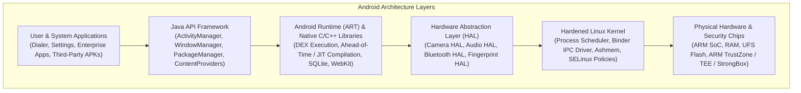
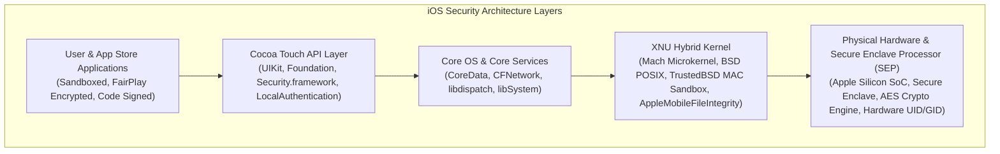

# Volume 09: Mobile & Android Security
# Module 17: Mobile Security Foundations & Android OS Architecture

---

## 1. Learning Objectives

By completing this module, mobile security practitioners, reverse engineers, and penetration testers will be able to:
1. **Deconstruct the Android OS Architecture**: Trace system layers from the Linux Kernel and Hardware Abstraction Layer (HAL) through the Android Runtime (ART) and Application Framework.
2. **Audit the Android Multi-User Application Sandbox**: Map Linux User Identifiers (UIDs), filesystem permissions (`/data/data/<package>`), and SELinux mandatory access controls.
3. **Analyze Android Inter-Process Communication (IPC)**: Evaluate trust boundaries across the four core components: Activities, Services, Broadcast Receivers, and Content Providers.
4. **Audit Cryptographic Storage Frameworks**: Distinguish insecure cleartext local storage from hardware-backed Android Keystore architectures and AndroidX `EncryptedSharedPreferences`.
5. **Evaluate Hardware Security Anchors**: Analyze the ARM TrustZone, Trusted Execution Environments (TEE), and StrongBox hardware key storage modules.
6. **Programmatically Audit Application Manifests**: Automate the identification of dangerous manifest flags (`debuggable`, `allowBackup`, un-permissioned exported components).

---

## 2. Prerequisites & Operational Requirements

To successfully master the concepts and practical exercises in this module, engineers require:
* **Operating System Foundations**: Understanding of Linux processes, file permissions, UIDs/GIDs, and system calls ([Module 05](file:///home/kali/Ethical_Hacking_VAPT_Master_Notes/Volume_02_Linux_Networking_and_Security_Foundations/Module_05_Linux_Architecture_and_Administration.md)).
* **Programming Literacy**: Familiarity with Java or Kotlin application structures and XML syntax.
* **Tooling Setup**: Android Debug Bridge (`adb`), Android SDK platform-tools, an Android Virtual Device (AVD) running Android 11+ (API 30+), and Python 3.8+.

---

## 3. What Is It? (Architecture & Definitions)

**Android Mobile Security** is the engineering discipline focused on protecting applications, user data, and system resources on the Android operating system platform.

Unlike traditional desktop operating systems—where all applications launched by a logged-in user typically run with the same ambient authority—Android enforces a **Multi-User Sandboxing Architecture**. Every Android application is assigned a unique, dedicated Linux User ID (UID) upon installation. By default, applications execute in isolated processes with separate memory spaces and private filesystem directories. Inter-application communication is strictly prohibited unless explicitly mediated by platform IPC mechanisms or declared system permissions.

---

## 4. Deep Architecture: The Android Platform Stack



### 4.1 The Android Application Sandbox & UID Isolation
During application installation, the platform Package Manager assigns each app a unique Linux UID (e.g., `u0_a142` mapping to integer UID `10142`):
```
+----------------------------------------------------------------------------------------------------+
|                                    ANDROID APPLICATION SANDBOX                                     |
+------------------------------------+---------------------------------------------------------------+
| Application Alpha (Banking App)    | Application Beta (Rogue Third-Party App)                      |
| Package: com.bank.corp             | Package: com.untrusted.game                                   |
| Linux UID: 10142                   | Linux UID: 10143                                              |
| Sandbox Directory:                 | Sandbox Directory:                                            |
|   /data/data/com.bank.corp/        |   /data/data/com.untrusted.game/                               |
| Permissions: drwx------ (0700)     | Permissions: drwx------ (0700)                                |
|   Owner: u0_a142:u0_a142           |   Owner: u0_a143:u0_a143                                      |
+------------------------------------+---------------------------------------------------------------+
```

### 4.2 iOS Security Architecture: The Apple Platform Security Model

While Android is built on the open-source Linux kernel and relies on Linux UIDs for application isolation, Apple's iOS is a proprietary, vertically integrated platform built on the **Darwin operating system** and the **XNU hybrid kernel** (combining the Mach microkernel with FreeBSD components).



#### Key iOS Architectural Security Pillars:
1. **Mandatory Code Signing & FairPlay DRM**:
   - The iOS kernel (`AppleMobileFileIntegrity` / AMFI) strictly enforces that every executable page in memory must be backed by an immutable cryptographic signature approved by Apple.
   - Applications downloaded from the App Store are encrypted on Apple's servers with FairPlay DRM. When launched, the kernel decrypts the executable in RAM using device-specific keys.
2. **The Secure Boot Chain**:
   - Begins at the physical hardware **Boot ROM** (etched in silicon during chip fabrication, establishing the immutable Root of Trust).
   - Boot ROM verifies the Low-Level Bootloader (LLB) signature $\rightarrow$ LLB verifies iBoot $\rightarrow$ iBoot verifies the iOS Kernel $\rightarrow$ Kernel verifies userland daemons (`launchd`).
3. **Secure Enclave Processor (SEP)**:
   - A physically isolated ARM-based co-processor built into Apple Silicon chips with dedicated RAM and its own secure microkernel (sepOS).
   - Manages biometric keys (Face ID / Touch ID) and hardware encryption. The main CPU *never* sees biometric data or the hardware Unique ID (UID) key fused into the silicon.

---

## 5. How It Works: The Zygote Process & Binder IPC

```
[ System Boot: Linux Kernel Initialized ]
      │
      ▼
[ Init Process (PID 1) Launches Daemons ]
      │
      ▼
[ Zygote Daemon Launched (Pre-loads Android Runtime & Framework Classes) ]
      │
      +---------------------------------------------------------------+
      │ Application Launch Request (User taps app icon on Launcher)   │
      +---------------------------------------------------------------+
      │
      ▼
[ Zygote forks() a Child Process in Memory ] (Sub-millisecond launch)
      │
      ▼
[ Process Demotion: setuid(10142) & setgid(10142) ] (Drops root authority)
      │
      ▼
[ SELinux Enforces 'untrusted_app' Context ] (Constrains syscalls & nodes)
      │
      ▼
[ Communication via /dev/binder Kernel Device ] (Validates UID against declared permissions)
```

### 5.1 The Binder Inter-Process Communication Mechanism
Because applications run in separate address spaces, they cannot access each other's memory directly. Inter-process communication is mediated by the **Binder Driver** (`/dev/binder`):
1. Client processes submit transaction parcels via `ioctl` system calls to `/dev/binder`.
2. The Binder kernel driver inspects the caller's verified Linux UID.
3. The driver forwards the request to the receiving service's thread pool, guaranteeing that the caller cannot forge its identity.

### 5.2 The iOS Application Sandbox & Container Directory Layout
Unlike Android's multi-user UID mapping, iOS enforces sandboxing at the kernel level using **TrustedBSD MAC (Mandatory Access Control)** policies (`Seatbelt` / `sandbox.kext`):
* Every iOS app is assigned a unique randomized container UUID upon installation.
* The container directory is partitioned into three distinct locations:
  1. **Bundle Container (`/var/containers/Bundle/Application/<UUID>/<AppName>.app`)**:
     - Holds the read-only compiled Mach-O binary, bundled assets, frameworks, and `Info.plist`.
     - Marked read-only at runtime; any file modification immediately triggers code signature verification failure.
  2. **Data Container (`/var/mobile/Containers/Data/Application/<UUID>/`)**:
     - `Documents/`: User-generated content backed up by iTunes/iCloud. Sensitive data here must be encrypted.
     - `Library/Caches/`: Temporary data not backed up. Often leaks sensitive cached API responses and images.
     - `Library/Preferences/`: Contains `<bundle_id>.plist` storing application settings via `NSUserDefaults` in unencrypted XML!
     - `tmp/`: Ephemeral scratch files purged on reboot.
  3. **iCloud Container**: Synchronized cloud data across user devices.

### 5.3 Hardware Roots of Trust: ARM TrustZone vs. Apple Secure Enclave (SEP)

| Feature | Android (ARM TrustZone / TEE / StrongBox) | iOS (Apple Secure Enclave Processor - SEP) |
| :--- | :--- | :--- |
| **Physical Implementation** | Uses ARM TrustZone processor "Normal World" vs "Secure World" context switching (or external StrongBox chip). | Dedicated physical ARM co-processor with its own isolated RAM, cryptographic engine, and sepOS. |
| **Key Storage** | Hardware-backed Android Keystore (`KeyGenParameterSpec.Builder`). | Hardware-backed iOS Keychain (`kSecAttrAccessible`). |
| **Biometric Match** | TEE processes fingerprint/face data; returns cryptographic attestation token to Android framework. | SEP authenticates Face ID/Touch ID internally; never exposes biometric templates or device encryption keys to main CPU. |
| **Hardware UID** | Device-specific hardware key burned into eFuse array. | Unique ID (UID) etched in silicon during manufacture; inaccessible to software, Apple, or debuggers. |

---

## 6. Security Perspective: Core Mobile Attack Surfaces

### 6.1 The Four Android Component Types & IPC Boundaries

| Component | Functional Purpose | Security Vulnerability If Exported | Remediation |
| :--- | :--- | :--- | :--- |
| **Activity** | Single screen with user interface. | External apps can launch internal screens, bypassing authentication. | Set `android:exported="false"`. |
| **Service** | Background processing without UI. | Malicious apps can trigger privileged tasks or exhaust battery. | Enforce signature-level permissions. |
| **Broadcast Receiver** | Asynchronous system/app event listener. | Rogue apps can inject spoofed broadcast intents. | Restrict with custom permissions or use `LocalBroadcastManager`. |
| **Content Provider** | Structured database access (`content://`). | Insecure providers expose SQLite tables to cross-app theft/SQLi. | Set `exported="false"` and validate URIs. |

### 6.2 iOS Core Attack Surfaces & Storage Security

1. **The iOS Keychain Architecture**:
   - SQLite database (`/var/Keychains/keychain-2.db`) encrypted with a hardware key derived from the user's passcode and the SEP hardware UID.
   - **Accessibility Classes (`kSecAttrAccessible`)**:
     - `kSecAttrAccessibleWhenUnlocked` *(Best Practice)*: Data accessible only when the device is unlocked by the user.
     - `kSecAttrAccessibleAfterFirstUnlock`: Data remains accessible in memory after the user unlocks the device once post-boot (used for background sync).
     - `kSecAttrAccessibleAlways` *(Deprecated & Dangerous)*: Accessible even when locked; vulnerable to forensic acquisition.
2. **Insecure Local Data Storage (NSUserDefaults & CoreData)**:
   - Novice iOS developers frequently store session tokens, JWTs, and passwords in `NSUserDefaults` for convenience. `NSUserDefaults` writes to a plaintext `.plist` file in `Library/Preferences/`, easily extracted during an audit.
3. **App Transport Security (ATS) Misconfiguration**:
   - Apple enforces TLS 1.2+ with forward secrecy on all HTTP connections via ATS.
   - Developers testing with staging servers often disable ATS by adding dangerous keys in `Info.plist`:
     ```xml
     <key>NSAppTransportSecurity</key>
     <dict>
         <key>NSAllowsArbitraryLoads</key>
         <true/> <!-- Critical: Permits unencrypted cleartext HTTP traffic! -->
     </dict>
     ```
4. **Custom URL Scheme Hijacking (`CFBundleURLTypes`)**:
   - iOS apps register custom URL schemes (e.g., `myapp://oauth-callback`). Because any application can register any URL scheme, a malicious app installed on the device can register the identical scheme and steal OAuth authorization codes or trigger unintended deep-link actions.

### 6.3 Mobile Security Comparison: Android vs. iOS

| Security Dimension | Android Ecosystem | iOS Ecosystem |
| :--- | :--- | :--- |
| **Operating System Base** | Hardened Linux Kernel (Monolithic). | Darwin / XNU (Hybrid: Mach microkernel + FreeBSD). |
| **Application Packaging** | `.apk` / `.aab` (ZIP archive containing Dalvik Executable DEX). | `.ipa` (ZIP archive containing native Mach-O binary and frameworks). |
| **Runtime Environment** | Android Runtime (ART) executing Ahead-of-Time (AOT) DEX bytecode. | Native ARM64 machine code executing directly on CPU. |
| **Application Sandboxing** | Linux UIDs (`u0_a142`) + SELinux domain isolation. | TrustedBSD Mandatory Access Control (`Seatbelt`) sandbox container. |
| **Code Signing Policy** | Signature verified at install time; apps can be sideloaded without root. | Signature enforced on every page execution by kernel (`AMFI`); no sideloading without developer cert or jailbreak. |
| **Privilege Escalation Term** | **Rooting** (installing `su` binary and modifying `/system` or Magisk boot image). | **Jailbreaking** (exploiting kernel/bootrom vulnerabilities like checkm8 to disable code signing and sandbox). |

---

## 7. Auditing Methodology: The Mobile Security Assessment Workflow

```
[ Phase 1: Static Application Assessment (SAST) ]
      │ Decompile APK using apktool and jadx; extract AndroidManifest.xml.
      v
[ Phase 2: Manifest & Configuration Auditing ]
      │ Audit debuggable, allowBackup, exported components, and cleartext traffic policies.
      v
[ Phase 3: Local Data Storage & Sandbox Inspection ]
      │ Inspect /data/data/<package>/ for cleartext XML, SQLite DBs, and log leakage.
      v
[ Phase 4: Inter-Process Communication (IPC) Fuzzing ]
      │ Transmit test intents to exported activities and providers via adb am/content.
      v
[ Phase 5: Dynamic Instrumentation (DAST) ]
      │ Hook runtime crypto methods and bypass root detection / TLS pinning via Frida.
      v
[ Phase 6: Reporting & Remediation Guidance ]
      │ Provide AndroidX EncryptedSharedPreferences and Network Security Config patches.
```

---

## 8. Tooling Deep-Dive: Android Debug Bridge (`adb`)

```bash
# 1. List connected physical devices and emulators
adb devices

# 2. Extract installed APK file from device to host
adb shell pm path com.target.app
adb pull /data/app/~~.../com.target.app-==/base.apk ./target.apk

# 3. Inspect application private sandbox directory
adb shell "run-as com.target.app ls -la /data/data/com.target.app"

# 4. Monitor real-time system logs for sensitive credential leaks
adb logcat | grep -iE "password|token|secret|auth"

# 5. Launch an unexported or exported activity directly via Activity Manager
adb shell am start -n com.target.app/.AdminSettingsActivity
```

---

## 9. Practical Lab: Standalone Android Storage & Manifest Auditor

Deploy this standalone script to audit Android application manifests and inspect local storage for cleartext credentials and unencrypted SQLite databases.

Save as [`labs/module_17/android_storage_and_manifest_auditor.py`](file:///home/kali/Ethical_Hacking_VAPT_Master_Notes/labs/module_17/android_storage_and_manifest_auditor.py):

```python
#!/usr/bin/env python3
"""
================================================================================
MODULE 17 LAB: ANDROID STORAGE & MANIFEST SECURITY AUDITING ENGINE
PURPOSE: Programmatic auditing of Android application manifests and local storage:
         - AndroidManifest.xml: debuggable, allowBackup, exported IPC components
         - SharedPreferences XML: plaintext credential detection (CWE-312)
         - SQLite database files: SQLCipher encryption verification
COMPLIANCE: Authorized testing only / Standard mobile app security evaluation.
================================================================================
"""

import xml.etree.ElementTree as ET

def redact_val(val_str):
    if len(val_str) > 4:
        return val_str[:4] + "****REDACTED"
    return "****REDACTED"

def audit_android_manifest(manifest_xml_str):
    """Audits AndroidManifest.xml for dangerous misconfigurations and exposed IPC components."""
    print("=" * 72)
    print("[*] 1. AUDITING ANDROIDMANIFEST.XML SECURITY POSTURE")
    print("=" * 72)

    root = ET.fromstring(manifest_xml_str)
    ns = {"android": "http://schemas.android.com/apk/res/android"}
    
    app = root.find("application")
    if app is not None:
        debuggable = app.attrib.get(f"{{{ns['android']}}}debuggable", "false")
        allow_backup = app.attrib.get(f"{{{ns['android']}}}allowBackup", "true")

        print(f"    - android:debuggable  : {debuggable}")
        print(f"    - android:allowBackup : {allow_backup}")

        if debuggable.lower() == "true":
            print("    [!] CRITICAL: android:debuggable='true' enabled in production!")
            print("        Allows ADB runtime memory inspection and code injection.")
        else:
            print("    [+] SECURE: Debuggable is disabled.")

        if allow_backup.lower() == "true":
            print("    [!] HIGH RISK: android:allowBackup='true' enabled!")
            print("        Allows extraction of private sandbox data via ADB backup.")
        else:
            print("    [+] SECURE: Backup is explicitly disabled.")

    print("\n[*] Auditing Exported IPC Components (Activities, Services, Providers):")
    components = [
        ("Activity", root.findall(".//activity")),
        ("Service", root.findall(".//service")),
        ("Provider", root.findall(".//provider")),
        ("Receiver", root.findall(".//receiver"))
    ]

    for comp_type, elems in components:
        for e in elems:
            name = e.attrib.get(f"{{{ns['android']}}}name", "unknown")
            exported = e.attrib.get(f"{{{ns['android']}}}exported", "false")
            
            is_launcher = False
            for intent in e.findall("intent-filter"):
                for cat in intent.findall("category"):
                    if "LAUNCHER" in cat.attrib.get(f"{{{ns['android']}}}name", ""):
                        is_launcher = True

            if exported.lower() == "true":
                if is_launcher:
                    print(f"    [i] {comp_type:10s}: {name:30s} (Exported Launcher - Expected)")
                else:
                    print(f"    [!] HIGH RISK: {comp_type:10s}: {name:30s} (EXPORTED WITHOUT PERMISSION!)")
            else:
                print(f"    [+] SECURE:    {comp_type:10s}: {name:30s} (Internal Only)")

def audit_shared_preferences(prefs_xml_str):
    """Audits SharedPreferences XML for unencrypted sensitive credentials (CWE-312)."""
    print("\n" + "=" * 72)
    print("[*] 2. AUDITING SHAREDPREFERENCES INSECURE DATA STORAGE (CWE-312)")
    print("=" * 72)

    root = ET.fromstring(prefs_xml_str)
    sensitive_patterns = ["token", "secret", "password", "key", "auth", "credential", "api_"]
    
    findings = []
    for elem in root:
        key_name = elem.attrib.get("name", "")
        val = elem.text if elem.text else elem.attrib.get("value", "")

        if any(p in key_name.lower() for p in sensitive_patterns):
            findings.append((key_name, val))

    if findings:
        print(f"    [!] VULNERABILITY CONFIRMED: Found {len(findings)} unencrypted sensitive items!")
        for k, v in findings:
            print(f"        - Flagged Key: '{k}' -> Raw Stored Value: {redact_val(str(v))}")
        print("        Remediation: Migrate to AndroidX EncryptedSharedPreferences with Keystore.")
    else:
        print("    [+] SECURE: No cleartext credentials found in SharedPreferences.")

def audit_sqlite_encryption(db_bytes):
    """Checks whether an SQLite database file is encrypted (SQLCipher) or cleartext."""
    print("\n" + "=" * 72)
    print("[*] 3. AUDITING SQLITE DATABASE FILE ENCRYPTION")
    print("=" * 72)

    sqlite_magic = b"SQLite format 3\x00"
    if db_bytes.startswith(sqlite_magic):
        print("    [!] CRITICAL: Cleartext SQLite database detected (Magic: 'SQLite format 3')!")
        print("        Database tables and sensitive records are unencrypted on disk.")
        return False
    else:
        print("    [+] SECURE: Database does not start with plaintext SQLite magic bytes.")
        return True
```

---

## 10. Evidence & Verification: Differentiating Plain vs. Encrypted Storage

| Storage Mechanism | Insecure Presentation (CWE-312) | Secure Presentation (OWASP MASVS-STORAGE) |
| :--- | :--- | :--- |
| **SharedPreferences** | `<string name="token">eyJhbGciOi...</string>` | Encrypted ciphertext: `{"keyset": "...", "ciphertext": "0x4f..."}` |
| **SQLite Database** | Magic header: `SQLite format 3\000`; tables readable via `sqlite3` CLI | SQLCipher database: Random binary bytes; `file` command reports "data" |
| **Application Logs** | `Log.d("AUTH", "Received token: " + token)` | Zero sensitive parameters logged; production ProGuard strips `Log.d` |

---

## 11. Telemetry & Defensive Detection: Logcat Credential Mining

In Android, any process with physical USB debugging authorization can monitor system logs via `adb logcat`. If applications output credentials to logs, this constitutes an information disclosure defect (CWE-532):

```text
09-05 10:50:12.415 10142 10142 D AUTH_CONTROLLER: User alice authenticated successfully.
09-05 10:50:12.416 10142 10142 D AUTH_CONTROLLER: Storing session token: eyJh****REDACTED
```

---

## 12. Mitigation & Secure Implementation

### 12.1 Secure Storage with AndroidX EncryptedSharedPreferences (Kotlin)

```kotlin
import androidx.security.crypto.EncryptedSharedPreferences
import androidx.security.crypto.MasterKeys

// 1. Generate or retrieve hardware-backed Master Key in Android Keystore
val masterKeyAlias = MasterKeys.getOrCreate(MasterKeys.AES256_GCM_SPEC)

// 2. Initialize EncryptedSharedPreferences (AES-256-GCM authenticated encryption)
val securePrefs = EncryptedSharedPreferences.create(
    "secure_app_prefs",
    masterKeyAlias,
    context,
    EncryptedSharedPreferences.PrefKeyEncryptionScheme.AES256_SIV,
    EncryptedSharedPreferences.PrefValueEncryptionScheme.AES256_GCM
)

// 3. Store sensitive authentication token safely
securePrefs.edit().putString("auth_token", sessionToken).apply()
```

---

## 13. CIS & NIST Hardening Controls: Android Manifest Checklist

| Control ID | Framework | Technical Requirement | Hardening Action |
| :--- | :--- | :--- | :--- |
| **MASVS-CODE-2** | OWASP | Debugging Protection | Set `android:debuggable="false"` in release builds. |
| **MASVS-STORAGE-1** | OWASP | Backup Protection | Explicitly set `android:allowBackup="false"` in `AndroidManifest.xml`. |
| **MASVS-IPC-1** | OWASP | Component Exposure | Set `android:exported="false"` on all Activities, Services, and Providers. |
| **MASVS-NETWORK-1** | OWASP | Transport Security | Define `network_security_config.xml` banning cleartext HTTP traffic. |

---

## 14. Real-World Case Studies

### Case Study: Insecure Content Provider Exposing 10 Million Bank Records
* **Vulnerability Classification**: CWE-284 (Improper Access Control) / CWE-926 (Improper Export of Android Application Components).
* **Mechanism**: A major consumer banking application declared a Content Provider `com.bank.app.provider.AccountProvider` with `android:exported="true"`, omitting read and write permission attributes. The developers assumed that because the URI was unlinked in the UI, other applications could not interact with it.
* **Exploitation**: A rogue mobile application installed on the same device queried `content://com.bank.app.provider.AccountProvider/transactions` and dumped customer balances and account numbers without requesting any Android runtime permissions.
* **Remediation**: Setting `android:exported="false"` and enforcing signature-level permissions.

---

## 15. Common Pitfalls & Anti-Patterns

```
❌ ANTI-PATTERN 1: Leaving `android:debuggable="true"` in Release Builds
   Compiling production APKs with debuggable enabled.
   Permits any user with physical access to attach `jdb` or Frida via ADB and inspect memory in cleartext.
   ✔ CORRECT: Enforce `android:debuggable="false"` across all release build variants.

❌ ANTI-PATTERN 2: Storing Cryptographic Keys in Native Libraries (.so)
   Embedding AES keys in C/C++ native code via JNI, believing it is "unhackable."
   Attackers easily extract strings using `strings libnative.so` or Ghidra decompilation in seconds.
   ✔ CORRECT: Generate and store cryptographic keys strictly within the hardware-backed Android Keystore.

❌ ANTI-PATTERN 3: Exporting Content Providers Without Explicit Permissions
   Setting `android:exported="true"` on Content Providers without declaring `readPermission`.
   Allows any app installed on the device to query private database tables.
   ✔ CORRECT: Mark providers `exported="false"` unless explicitly designed for public inter-app integration.
```

---

## 16. Professional vs. Naive Methodology

| Operational Phase | Naive / Novice Approach | Professional Application Security Auditor Approach |
| :--- | :--- | :--- |
| **Static Analysis** | Runs automated scanner (MobSF) and copies raw PDF into client report. | Decompiles APK to Java/Smali; reviews manifest permissions; audits IPC components. |
| **Storage Auditing** | Checks if files exist in `/data/data/`; ignores encryption posture. | Verifies SQLCipher headers and inspects Keystore hardware backing. |
| **Component Testing** | Only tests the app through the graphical user interface. | Crafts custom intents via ADB to test unlinked exported components directly. |
| **Remediation** | Advises developers to "obfuscate code with ProGuard." | Delivers AndroidX EncryptedSharedPreferences templates and Network Security Configs. |

---

## 17. Graded Knowledge Check & Interview Questions

### Beginner Level
1. **Question**: How does the Android Application Sandbox isolate applications from one another at the Linux kernel level?
   * *Answer*: Android assigns each application a unique Linux User ID (UID) at install time. Each application executes as an independent process owned by this UID. Directory permissions on the app's private data (`/data/data/<package>`) are set to `0700` (`rwx------`), restricting access strictly to that UID. In addition, SELinux policies (`untrusted_app`) enforce mandatory access controls restricting syscalls and device nodes.
2. **Question**: Why is leaving `android:allowBackup="true"` in a production mobile application a security risk?
   * *Answer*: When `allowBackup="true"`, any user with physical access and USB debugging enabled can run `adb backup` to extract the application's entire private sandbox directory (including databases, shared preferences, and cached tokens) to a desktop computer without requiring device root privileges.

### Intermediate Level
3. **Question**: What is the difference between an Explicit Intent and an Implicit Intent in Android?
   * *Answer*: An **Explicit Intent** specifies the exact target component by name (e.g., `Intent(context, TargetActivity::class.java)`), delivering the message strictly to that component. An **Implicit Intent** declares an abstract action to perform (e.g., `ACTION_VIEW` on a URL) without specifying the target class; the Android system queries all installed applications for matching intent filters. If sensitive data is transmitted via an implicit intent, a malicious application registering the same intent filter can intercept the sensitive payload.

### Advanced / Scenario-Based
4. **Question**: An enterprise banking app uses the Android Keystore to generate an AES-256 key. How does the hardware-backed Android Keystore protect this key even if the mobile device's Linux kernel is compromised via a root exploit?
   * *Answer*: In modern Android devices, the Android Keystore delegates key generation and cryptographic operations to the **ARM TrustZone / Trusted Execution Environment (TEE)** or a dedicated **StrongBox** hardware security module. The private/secret key never enters the main application processor or Linux kernel memory; it resides inside the isolated hardware security enclave. Even if the Android Linux kernel is completely compromised, an attacker can only request the enclave to perform operations; they cannot extract or dump the raw cryptographic key material from memory.

---

## 18. Progressive Hands-on Exercises

### Level 1: Inspecting Sandboxed Processes via ADB (Beginner)
* Launch an Android Virtual Device (AVD).
* Connect via `adb shell` and run `ps -ef`. Locate installed applications and note their distinct UIDs (e.g., `u0_a100`, `u0_a101`).
* Attempt to access another application's directory: `ls /data/data/<other_app>` and observe the Linux `Permission denied` error.

### Level 2: Auditing SharedPreferences for Credential Leakage (Intermediate)
* Execute [`labs/module_17/android_storage_and_manifest_auditor.py`](file:///home/kali/Ethical_Hacking_VAPT_Master_Notes/labs/module_17/android_storage_and_manifest_auditor.py).
* Review the output. Modify the test manifest to include a dangerous exported Broadcast Receiver.
* Verify that the audit engine flags the exported receiver as High Risk.

### Level 3: Interacting with Exported Activities via ADB (Advanced)
* On a test emulator, identify an exported activity using `dumpsys package <package_name>`.
* Use `adb shell am start -n <package_name>/<activity_name>` to launch the internal activity directly, demonstrating an authentication bypass.

---

## 19. Key Takeaways

1. **Android Security Is Linux Security**: Multi-user UID sandboxing and SELinux enforce strict isolation across apps.
2. **Exported IPC Components Are Entry Points**: Activities, Services, Receivers, and Providers must be explicitly set to `exported="false"` unless intended for public integration.
3. **Never Store Secrets in Cleartext**: Always use the Android Keystore with `EncryptedSharedPreferences` for sensitive authenticators.
4. **Harden the Application Manifest**: Always set `debuggable="false"` and `allowBackup="false"` in production release builds.
5. **Hardware Security Anchors**: Leverage ARM TrustZone and StrongBox modules to ensure keys remain secure even under device compromise.

---

## 20. Authoritative References

* **Android Open Source Project (AOSP)**: *Platform Security Architecture* (`source.android.com/security`).
* **OWASP Mobile Application Security (MASVS v2.0)**: Requirements for Mobile Security (`mas.owasp.org`).
* **Android Developers Guide**: *App Security Best Practices* (`developer.android.com/topic/security`).
* **NIST SP 800-163 Rev. 1**: *Vetting the Security of Mobile Applications*.
* **CWE-312**: *Cleartext Storage of Sensitive Information*.
