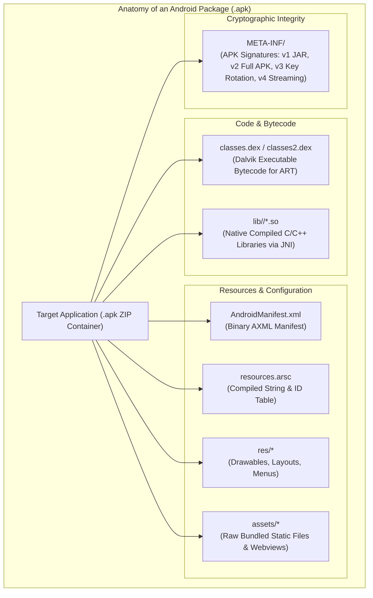
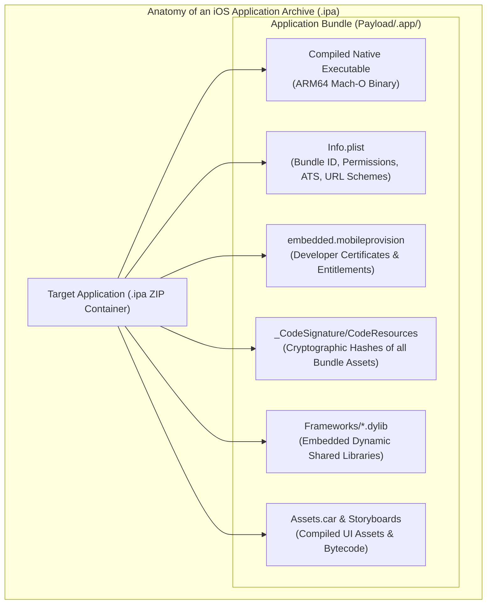

# Volume 09: Mobile & Android Security
# Module 34: Mobile Application VAPT (Android & iOS), Reverse Engineering & Dynamic Instrumentation

---

## 1. Learning Objectives

By completing this module, mobile penetration testers, reverse engineers, and application security auditors will be able to:
1. **Deconstruct Mobile Application Packages**: Dissect the internal structure of Android Packages (APK/AAB) and iOS Application Archives (IPA), mapping DEX/Mach-O binaries, binary manifests (`AndroidManifest.xml` / `Info.plist`), compiled resources, native shared objects/frameworks, and signature schemes.
2. **Execute Static Reverse Engineering Across Platforms**: Decompile, analyze, and patch Android applications via `apktool`/`jadx` and analyze decrypted iOS Mach-O binaries using Ghidra, `rabin2`, and `class-dump`.
3. **Configure Advanced Mobile Interception Workbenches**: Install custom Root Certificate Authorities into Android system trust stores and iOS profiles, routing application traffic through Burp Suite.
4. **Master Dynamic Binary Instrumentation with Frida & Objection**: Hook runtime methods in ART and Objective-C/Swift runtimes, tamper with return values, and systematically bypass SSL Certificate Pinning, Root, and Jailbreak detection controls.
5. **Audit Inter-Process Communication & URL Schemes**: Identify and verify SQL injection and path traversal in Android Content Providers, and validate custom URL scheme and Universal Link handling in iOS.
6. **Decrypt and Audit FairPlay-Protected iOS Binaries**: Dump App Store-encrypted iOS applications using `frida-ios-dump`, inspect `LC_ENCRYPTION_INFO_64`, and audit App Transport Security (ATS) configurations.
7. **Align Testing with OWASP MASVS & MASTG**: Standardize mobile assessment methodologies and vulnerability reporting against the OWASP Mobile Application Security Verification Standard across Android and iOS ecosystems.

---

## 2. Prerequisites & Operational Requirements

To successfully master the concepts and practical exercises in this module, engineers require:
* **Android OS Foundations**: Deep understanding of the Android platform stack, UIDs, and IPC boundaries ([Module 17](file:///home/kali/Ethical_Hacking_VAPT_Master_Notes/Volume_09_Mobile_and_Android_Security/Module_17_Mobile_Security_Foundations.md)).
* **Interception Proxies**: Operational proficiency with Burp Suite Professional and local proxy configurations ([Module 29](file:///home/kali/Ethical_Hacking_VAPT_Master_Notes/Volume_05_Web_Security_Foundations/Module_29_Web_Application_Security_Tools.md)).
* **Tooling Setup**: Kali Linux workstation with `apktool`, `jadx-gui`, `frida-tools`, `apksigner`, `zipalign`, and a rooted Android emulator (Genymotion, Android Studio AVD running Android 11+ with Google APIs).

---

## 3. What Is It? (Architecture & Definitions)

**Android Application VAPT & Reverse Engineering** is the technical discipline of evaluating the client-side binary and runtime security posture of an Android application.

While backend API testing evaluates server-side business logic, client-side mobile testing assesses vulnerabilities inherent in the compiled package:
* Hardcoded API credentials, cryptographic keys, and cloud bucket secrets.
* Insecure client-side authentication bypasses and business logic flaws.
* Insecure local data storage (cleartext SharedPreferences, unencrypted SQLite databases).
* Exported IPC components (Activities, Services, Providers) accessible to rogue apps.
* Weak network communication controls, including flawed TLS validation.

---

## 4. Deep Architecture: APK Packaging & Signature Verification



### 4.1 APK Signature Scheme Evolution

| Signature Scheme | Introduced In | Verification Boundary | Bypass / Tampering Vulnerability |
| :--- | :--- | :--- | :--- |
| **v1 (JAR Signing)** | Android 1.0 | Verifies individual file SHA-256 hashes listed in `MANIFEST.MF`. | Vulnerable to Janus vulnerability (CVE-2017-13156); files can be appended to APK ZIP without invalidating signature. |
| **v2 (Full APK)** | Android 7.0 (API 24) | Verifies cryptographic hash over the entire binary ZIP archive. | Blocks Janus; any modification to bytecode or manifest invalidates the signature block. |
| **v3 (Key Rotation)** | Android 9.0 (API 28) | Adds key rotation proof-of-rotation structs into the APK signing block. | Allows developers to rotate signing keys across app updates while preserving trust. |
| **v4 (Streaming)** | Android 11 (API 30) | Generates a separate `.idsig` tree hashing file for high-speed streaming install. | Accelerates installation of large games while enforcing cryptographic blocks. |

---

### 4.2 Deep Architecture: iOS IPA Packaging, Mach-O Format & FairPlay DRM

An iOS application archive (`.ipa`) is a standard ZIP container that encapsulates the application bundle, compiled native code, embedded third-party frameworks, and provisioning profiles:



#### 4.2.1 The Mach-O (Mach Object) Binary Format

Unlike Android's Dalvik Executable (DEX) bytecode, iOS compiles directly to native **ARM64 machine instructions** packaged in the Mach-O format:
1. **Mach-O Header**: Specifies the target CPU architecture (`ARM64` / `CPU_TYPE_ARM64 = 0x0100000C`), file type (`MH_EXECUTE`), and total load command count.
2. **Load Commands**: Directives instructing the dynamic linker (`dyld`) how to load the application into memory:
   - `LC_SEGMENT_64`: Defines memory segments and protection flags (Read/Write/Execute).
   - `LC_LOAD_DYLIB`: Identifies shared libraries required by the binary (e.g., `/usr/lib/libSystem.B.dylib`).
   - `LC_ENCRYPTION_INFO_64`: Tracks FairPlay DRM encryption state. Contains `cryptid` (`1` = encrypted via App Store; `0` = decrypted).
   - `LC_RPATH`: Run-path search paths for embedded frameworks.
3. **Segments and Sections**:
   - `__PAGEZERO`: Unmapped 4GB page catching NULL pointer dereferences.
   - `__TEXT`: Read-only executable code segment containing `__text` (machine code), `__cstring` (string literals), and `__objc_methname`.
   - `__DATA`: Read-write memory segment containing mutable global variables (`__data`), Objective-C class pointers (`__objc_classlist`), and method references.
   - `__LINKEDIT`: Raw metadata used by `dyld` including symbol tables, code signatures, and string tables.

#### 4.2.2 FairPlay DRM & The Binary Decryption Pipeline

```
[ App Store Server ] ──(Encrypts __TEXT segment via FairPlay DRM)──> [ Target .ipa (cryptid = 1) ]
                                                                                │
                                                                                ▼
[ Jailbroken iOS Test Device ] ──(Launches App; Kernel decrypts to RAM)──> [ Unencrypted Process Memory ]
                                                                                │
                                                                                ▼
[ frida-ios-dump / bagbak ] ──(Dumps memory pages & sets cryptid = 0)──> [ Decrypted Mach-O Binary ]
                                                                                │
                                                                                ▼
[ Static Reverse Engineering ] ──(Ghidra / IDA Pro / class-dump / rabin2)
```

1. **The FairPlay Challenge**: Binaries downloaded directly from the Apple App Store have their `__TEXT` segment encrypted with FairPlay DRM. Static reverse-engineering tools (Ghidra, IDA Pro, Hopper) cannot disassemble or decompile encrypted instructions.
2. **The Dynamic Memory Dumping Solution**: When an iOS app starts, the iOS kernel and Secure Enclave decrypt the executable code into RAM pages. By attaching to the running process on a jailbroken device, tools like `frida-ios-dump` read the decrypted pages from virtual memory, reconstruct the Mach-O header, patch the `cryptid` flag to `0`, and write the clean, decompilable Mach-O binary back to disk.

---

## 5. How It Works: Dynamic Binary Instrumentation with Frida

Frida injects Google's V8 JavaScript engine directly into a target process's memory space, allowing an auditor to hook functions, alter execution branches, and inspect arguments in real time:

```
[ Auditor Workstation (Kali Linux) ]
         │
         │ 1. Executes: frida -U -f com.target.app -l bypass_pinning.js
         ▼
[ Android Virtual Device (AVD) / Physical Rooted Phone ]
         │
         │ 2. frida-server daemon (running as root listening on :27042)
         ▼
[ Target Application Memory Space (ART Runtime) ]
         │
         │ 3. Injects V8 JavaScript Engine into target thread pool
         │ 4. Hooks Java.use('javax.net.ssl.X509TrustManager').checkServerTrusted
         │ 5. Replaces implementation to return immediately without exception!
         ▼
[ Encrypted TLS Connection to Burp Suite Proxy ]
(Target application now trusts Burp Suite's dynamically signed leaf certificate!)
```

---

## 6. Security Perspective: The Fallacy of Client-Side Trust

```
+----------------------------------------------------------------------------------------------------+
|                                    CLIENT-SIDE SECURITY REALITY                                    |
+------------------------------------+---------------------------------------------------------------+
| Client-Side Security Control       | Auditor Bypass Technique & Mechanism                          |
+------------------------------------+---------------------------------------------------------------+
| Root Detection (Check for /su)     | Hook `File.exists` via Frida; return `false` for `su`/Magisk. |
| SSL / TLS Certificate Pinning      | Overwrite `TrustManager.checkServerTrusted()` via Frida.     |
| Biometric Fingerprint Gate         | Hook `BiometricPrompt.AuthenticationCallback.onSucceeded()`.  |
| Code Obfuscation (ProGuard / R8)   | Dynamic tracing via Frida; Smali decompilation via apktool.   |
| Hardcoded API Keys / Tokens        | Run `strings` or dump memory strings during execution.        |
+------------------------------------+---------------------------------------------------------------+
```

> [!IMPORTANT]
> **Core Engineering Law**: Any security verification executed entirely on the client device can be bypassed by an auditor possessing physical or administrative control over the hardware. All authorization, validation, and business rules must be enforced on the backend server.

---

## 7. Auditing Methodology: The OWASP MASTG Assessment Lifecycle

```
[ Phase 1: Static Analysis (SAST) & Decompilation ]
      │ Decompile APK using apktool and jadx; review AndroidManifest.xml and hardcoded secrets.
      v
[ Phase 2: Network Interception Setup ]
      │ Install Burp Suite CA into Android System Trust Store; launch Frida pinning bypass.
      v
[ Phase 3: Dynamic Runtime Instrumentation ]
      │ Hook sensitive Java/Kotlin methods, trace crypto operations, and dump memory tables.
      v
[ Phase 4: Local Sandbox & Storage Auditing ]
      │ Inspect /data/data/<package>/ for cleartext XML, SQLite databases, and cached tokens.
      v
[ Phase 5: Inter-Process Communication (IPC) Auditing ]
      │ Use Drozer to enumerate exported Content Providers, test for SQLi and path traversal.
      v
[ Phase 6: Reporting & Remediation Guidance ]
      │ Provide production code patches: AndroidX EncryptedSharedPreferences & Play Integrity API.
```

---

## 8. Tooling Deep-Dive: Reverse Engineering & Instrumentation Utilities

### 8.1 Decompiling and Smali Patching with `apktool`

```bash
# 1. Disassemble APK into Smali assembly and decoded resources
apktool d target_app.apk -o decompiled_app/

# 2. Modify Smali code in decompiled_app/smali/com/target/app/AuthActivity.smali
# Invert conditional branch: if-eqz v0 -> if-nez v0

# 3. Rebuild modified source into a new APK
apktool b decompiled_app/ -o target_patched_unaligned.apk

# 4. Align APK on 4-byte boundaries (required by Android)
zipalign -v -p 4 target_patched_unaligned.apk target_patched.apk

# 5. Cryptographically sign the patched APK
apksigner sign --ks test.keystore --ks-pass pass:password123 target_patched.apk
```

### 8.2 Drozer Inter-Process Communication Auditing

```bash
# Forward Drozer port from emulator to host
adb forward tcp:31415 tcp:31415

# Connect Drozer interactive console
drozer console connect

# Enumerate package attack surface (exported components)
run app.package.attacksurface com.target.app

# Audit Content Providers for SQL Injection vulnerabilities
run scanner.provider.injection -a com.target.app
```

### 8.3 iOS Binary Decryption & Static Analysis Workflow

```bash
# 1. Establish USB SSH tunnel to jailbroken iOS device (listening on localhost:2222)
iproxy 2222 22 &

# 2. Dump decrypted IPA from running memory via frida-ios-dump
git clone https://github.com/AloneMonkey/frida-ios-dump
cd frida-ios-dump && pip install -r requirements.txt
python3 dump.py -u -H 127.0.0.1 -p 2222 "TargetApp"

# 3. Verify FairPlay DRM is removed (cryptid must be 0)
unzip TargetApp.ipa
otool -l Payload/TargetApp.app/TargetApp | grep -A 4 LC_ENCRYPTION_INFO_64
# Output:
#          cmd LC_ENCRYPTION_INFO_64
#      cmdsize 32
#     cryptoff 16384
#    cryptsize 1236992
#      cryptid 0    <-- 0 confirms binary is fully decrypted and ready for static analysis!

# 4. Check Mach-O Binary Security Compiler Hardening Flags
rabin2 -I Payload/TargetApp.app/TargetApp
# Verify:
#   pic: true      (PIE - Position Independent Executable)
#   canary: true   (Stack Smashing Protection / Stack Canaries)
#   arc: true      (Automatic Reference Counting / Memory Safety)

# 5. Extract Objective-C Class Headers
class-dump -H -o Headers/ Payload/TargetApp.app/TargetApp

# 6. Audit App Transport Security (ATS) & Sensitive Permissions in Info.plist
plutil -p Payload/TargetApp.app/Info.plist | grep -i -E "NSAllowsArbitraryLoads|CFBundleURLSchemes"
```

### 8.4 iOS Dynamic Instrumentation via Objection & Frida

```bash
# 1. Spawn target iOS application under Objection instrumentation
objection -g "TargetApp" explore

# 2. Disable iOS SSL Certificate Pinning (hooks SecTrustEvaluate and NSURLSession)
[TargetApp] -> ios sslpinning disable

# 3. Disable iOS Jailbreak Detection routines
[TargetApp] -> ios jailbreak disable

# 4. Dump entire iOS hardware-backed Keychain items
[TargetApp] -> ios keychain dump --dump-entitlements

# 5. Monitor runtime iOS clipboard/pasteboard leaks
[TargetApp] -> ios pasteboard monitor
```

#### Objective-C Dynamic Method Hooking via Frida:
```javascript
// Universal iOS NSURLSession HTTP Request Logger & Pinning Bypass
if (ObjC.available) {
    console.log("[*] iOS Objective-C Runtime Detected.");

    // Hook NSURLSession data tasks
    var NSURLSession = ObjC.classes.NSURLSession;
    var hook = NSURLSession["- dataTaskWithRequest:completionHandler:"];
    Interceptor.attach(hook.implementation, {
        onEnter: function(args) {
            var request = ObjC.Object(args[2]);
            var url = request.URL().absoluteString().toString();
            console.log("[+] [iOS HTTP Probe] Dispatched Request: " + url);
        }
    });

    // Bypass SecTrustEvaluate (CoreFoundation TLS verification)
    var SecTrustEvaluateWithError = Module.findExportByName("Security", "SecTrustEvaluateWithError");
    if (SecTrustEvaluateWithError) {
        Interceptor.attach(SecTrustEvaluateWithError, {
            onLeave: function(retval) {
                console.log("[+] [iOS SecTrustEvaluateWithError] Forcing TLS trust result to TRUE (1)");
                retval.replace(ptr(1));
            }
        });
    }
}
```

---

## 9. Practical Lab: Standalone Android APK Reversing & Frida Engine

Deploy this standalone script to simulate Smali bytecode patching, scan compiled binary string tables for leaked credentials, and synthesize universal Frida hooking scripts.

Save as `apk_reversing_and_frida_engine.py`:

```python
#!/usr/bin/env python3
"""
================================================================================
MODULE 34 LAB: ANDROID APK REVERSE ENGINEERING & FRIDA HOOKING ENGINE
PURPOSE: Programmatic simulation of APK deconstruction, Smali opcode patching,
         hardcoded secret extraction, and automated Frida script synthesis.
COMPLIANCE: Authorized testing only / Standard mobile app binary security analysis.
================================================================================
"""

import re

def redact_token(tok):
    if len(tok) > 4:
        return tok[:4] + "****REDACTED"
    return "****REDACTED"

def patch_smali_bytecode(smali_text):
    """
    Simulates reverse-engineering Smali logic inversion:
    Patches `if-eqz` (jump if zero) to `if-nez` (jump if not zero) to bypass check.
    """
    print("=" * 72)
    print("[*] 1. SIMULATING SMALI BYTECODE PATCHING (LOGIC INVERSION)")
    print("=" * 72)

    print("[*] Original Smali Instructions:")
    for line in smali_text.strip().splitlines():
        if "if-eqz" in line or "return" in line:
            print(f"    {line}")

    # Patch opcode
    patched = re.sub(r'\bif-eqz\b', 'if-nez', smali_text)

    print("\n[+] Patched Smali Instructions (Bypass Injected):")
    for line in patched.strip().splitlines():
        if "if-nez" in line or "return" in line:
            print(f"    {line}")

    if "if-nez" in patched:
        print("\n[+] SUCCESS: Conditional branch inverted (if-eqz -> if-nez).")
        print("    Application will now return TRUE even for invalid license keys.")
    return patched

def extract_hardcoded_secrets(string_pool):
    """Scans compiled binary string tables for leaked API keys, tokens, and credentials."""
    print("\n" + "=" * 72)
    print("[*] 2. EXTRACTING HARDCODED SECRETS FROM COMPILED STRING POOL")
    print("=" * 72)

    patterns = [
        ("Stripe/API Key", r'(sk_live_[0-9a-zA-Z]{4})[0-9a-zA-Z]+'),
        ("AWS Access Key", r'(AKIA[0-9A-Z]{4})[0-9A-Z]{12}'),
        ("JWT Auth Token", r'(Bearer\s+eyJ[A-Za-z0-9_\-]{4})[A-Za-z0-9_\-\.]+')
    ]

    discovered = []
    for s in string_pool:
        for name, pat in patterns:
            match = re.search(pat, s)
            if match:
                masked = redact_token(s)
                print(f"    [!] FOUND {name:15s}: {masked}")
                discovered.append((name, masked))

    return discovered

def generate_frida_bypass_script():
    """Generates universal Frida dynamic instrumentation script for SSL pinning and root bypass."""
    print("\n" + "=" * 72)
    print("[*] 3. SYNTHESIZING DYNAMIC INSTRUMENTATION SCRIPT (FRIDA)")
    print("=" * 72)

    script_content = """
Java.perform(function() {
    console.log("[*] Injected: Universal SSL Pinning & Root Detection Bypass");

    // 1. Bypass Android X509TrustManager checkServerTrusted
    var TrustManager = Java.use('javax.net.ssl.X509TrustManager');
    var SSLContext = Java.use('javax.net.ssl.SSLContext');

    var TrustAllCerts = Java.registerClass({
        name: 'com.audit.TrustAllCerts',
        implements: [TrustManager],
        methods: {
            checkClientTrusted: function(chain, authType) {},
            checkServerTrusted: function(chain, authType) {
                console.log("[+] Intercepted checkServerTrusted() -> Bypassed verification!");
            },
            getAcceptedIssuers: function() { return []; }
        }
    });

    var TrustAllArr = [TrustAllCerts.$new()];
    SSLContext.init.overload(
        '[Ljavax.net.ssl.KeyManager;',
        '[Ljavax.net.ssl.TrustManager;',
        'java.security.SecureRandom'
    ).implementation = function(km, tm, sr) {
        this.init(km, TrustAllArr, sr);
    };

    // 2. Bypass Root Detection File Checks
    var File = Java.use('java.io.File');
    File.exists.implementation = function() {
        var path = this.getAbsolutePath();
        if (path.indexOf("/system/bin/su") >= 0 || path.indexOf("magisk") >= 0) {
            console.log("[+] Root detection probe caught on: " + path + " -> Spoofed false");
            return false;
        }
        return this.exists();
    };
});
"""
    return script_content
```

---

## 10. Evidence & Verification: Validating Runtime Bypasses

1. **Distinguishing Bypasses from Application Crashes**:
   * If a Frida script causes the app process to terminate with `SIGSEGV` or `SIGBUS`, this is an unhandled native hook error or anti-tamper crash, not a successful bypass.
2. **Deterministic Verification Evidence**:
   * A verified finding dossier must include the Frida terminal output showing intercepted method calls alongside the corresponding Burp Suite HTTP history log showing decrypted cleartext traffic.

---

## 11. Telemetry & Defensive Detection: Anti-Frida & Root Detection

### 11.1 Runtime Root File Detection (Java)

```java
public static boolean isDeviceRooted() {
    String[] knownPaths = {
        "/system/bin/su", "/system/xbin/su", "/sbin/su",
        "/data/local/xbin/su", "/data/local/bin/su", "/system/sd/xbin/su"
    };
    for (String path : knownPaths) {
        if (new java.io.File(path).exists()) return true;
    }
    return false;
}
```

### 11.2 Detecting Frida Runtime Signatures in Native Code
Advanced mobile applications inspect `/proc/self/maps` and `/proc/self/status` for strings matching `frida`, `gadget`, or `gum-js-loop`, and poll for open TCP sockets listening on port `27042`.

---

## 12. Mitigation & Secure Implementation

1. **Google Play Integrity API**: Enforce server-side hardware-backed attestation to verify that incoming API requests originate from an un-tampered app installed on a genuine device.
2. **Cryptographic Authentication Objects**: Bind biometric authorization prompts directly to the Android Keystore using `BiometricPrompt.CryptoObject`, ensuring that bypassing the client UI callback does not yield access to the decryption key.

---

## 13. CIS & NIST Hardening Controls

| Control ID | Framework | Technical Requirement | Hardening Action |
| :--- | :--- | :--- | :--- |
| **MASVS-RESILIENCE-1** | OWASP | Tamper Detection | Implement basic root and emulator detection with server-side attestation. |
| **MASVS-NETWORK-2** | OWASP | Certificate Pinning | Enforce multi-digest certificate pinning with backup pin sets. |
| **MASVS-CODE-3** | OWASP | Build Obfuscation | Enable R8/ProGuard code obfuscation and identifier renaming in `build.gradle`. |
| **NIST SP 800-163 §4.2** | NIST | Sensitive Binary Artifacts | Eliminate hardcoded API keys, private certificates, and debug URLs from APK binaries. |

---

## 14. Real-World Case Studies

### Case Study: Biometric Authentication Bypass in Commercial Mobile Wallet
* **Vulnerability Class**: CWE-287 (Improper Authentication) / Client-Side Logic Flaw.
* **Mechanism**: A mobile banking application implemented biometric authentication using a simple Boolean callback (`onAuthenticationSucceeded()`). The subsequent funds transfer API request did not use cryptographic keys signed by the biometric prompt.
* **Exploitation**: The auditor wrote a 4-line Frida hook intercepting `BiometricPrompt.AuthenticationCallback` and invoked `onAuthenticationSucceeded(null)` directly upon application boot. The application accepted the spoofed event and authorized transactions without requesting fingerprint verification.
* **Remediation**: Use `BiometricPrompt.CryptoObject` initialized with an Android Keystore key to decrypt a session token, ensuring hardware validation is mandatory.

---

## 15. Common Pitfalls & Anti-Patterns

```
❌ ANTI-PATTERN 1: Relying on Client-Side Logic for Business Rules
   Enforcing user role checks, trial period expirations, or feature access in compiled Java code.
   Attackers easily patch Smali opcodes (`if-eqz -> if-nez`) or hook methods with Frida in seconds.
   ✔ CORRECT: Treat the mobile app as untrusted; enforce all permissions and logic on the server API.

❌ ANTI-PATTERN 2: Storing API Keys in Native `.so` Libraries
   Placing secrets into C/C++ native code via JNI, believing it prevents reverse engineering.
   Decompilers like Ghidra and simple command-line tools like `strings` extract the keys instantly.
   ✔ CORRECT: Implement backend-mediated OAuth token exchanges; never embed permanent secrets in client binaries.

❌ ANTI-PATTERN 3: Pinning a Single Leaf Certificate
   Hardcoding only one public certificate hash in the mobile client.
   When the production certificate expires or rotates, the app stops working for all users.
   ✔ CORRECT: Pin intermediate Certificate Authorities and include pre-configured backup pins.
```

---

## 16. Professional vs. Naive Methodology

| Operational Phase | Naive / Novice Approach | Professional Application Security Auditor Approach |
| :--- | :--- | :--- |
| **Static Code Audit** | Relies solely on automated MobSF scanners; pastes unverified alerts into report. | Decompiles APK with jadx; analyzes Smali; audits custom cryptographic routines. |
| **Traffic Interception** | Stops testing when the application blocks proxy connections due to SSL pinning. | Injects Frida hooks to bypass certificate pinning and inspect backend API requests. |
| **Binary Patching** | Guesses how to modify bytecode; corrupts APK archive alignment and signatures. | Uses `apktool` for Smali disassembly; aligns with `zipalign`; re-signs with `apksigner`. |
| **Remediation** | Tells developers to "add ProGuard obfuscation." | Delivers Play Integrity API architectures, Keystore `CryptoObject` patterns, and server defenses. |

---

## 17. Graded Knowledge Check & Interview Questions

### Beginner Level
1. **Question**: What is the difference between `apktool` and `jadx` during Android reverse engineering?
   * *Answer*: `apktool` decodes compiled resources (`resources.arsc`, `AndroidManifest.xml`) and disassembles DEX bytecode into human-readable **Smali** assembly code, enabling the auditor to modify instructions and recompile the APK. `jadx` is a decompiler that reconstructs readable Java/Kotlin source code from DEX bytecode, making it ideal for rapid static auditing and control flow analysis (though it cannot recompile modified source back into an APK).
2. **Question**: Why must a modified APK be signed with `apksigner` before it can be installed on an Android device?
   * *Answer*: The Android OS enforces a strict security policy requiring all installed application packages to be digitally signed by a developer certificate. The system uses this signature to verify application integrity, prevent unauthorized updates by third parties, and establish trust boundaries for Signature-level permissions. An unsigned APK will be rejected by the package manager.

### Intermediate Level
3. **Question**: Explain how an auditor bypasses SSL Certificate Pinning using Frida.
   * *Answer*: In Android, SSL pinning is typically enforced by custom `X509TrustManager` implementations or HTTP client interceptors (like OkHttp's `CertificatePinner`). When using Frida, the auditor injects JavaScript code into the running application process. The script hooks the target validation method (e.g., `CertificatePinner.check()` or `TrustManager.checkServerTrusted()`) and replaces the implementation with an empty function that returns immediately without throwing a `CertificateException`. As a result, the application accepts the proxy's certificate without error.
4. **Question**: What is App Transport Security (ATS) in iOS, and why is `NSAllowsArbitraryLoads = true` considered a critical misconfiguration?
   * *Answer*: App Transport Security (ATS) is an iOS networking security feature that enforces best-practice HTTPS connections (requiring TLS 1.2+, forward secrecy ciphers, and valid public CAs). If developers set `<key>NSAllowsArbitraryLoads</key><true/>` in `Info.plist`, ATS is completely deactivated for the application. This allows any component or third-party SDK to transmit credentials, session tokens, and personal data over unencrypted cleartext HTTP, leaving users vulnerable to adversary-in-the-middle (AiTM) eavesdropping and packet injection on untrusted Wi-Fi networks.

### Advanced / Scenario-Based
5. **Question**: You are auditing an Android application that implements root detection in native C code (`libsecurity.so`) rather than Java. Your standard Frida `Java.use()` hooks fail to bypass the check. How do you bypass native root detection?
   * *Answer*: Because native C code executes outside the Java ART runtime, `Java.use()` hooks have no effect. The auditor must use Frida's **`Interceptor` API** to hook native system calls exported by `libc.so` (such as `open`, `fopen`, `access`, and `stat`). When the native library queries file paths associated with root binaries (e.g., `/system/bin/su`, `/system/xbin/su`, `/sbin/su`, or Magisk binaries), the native Frida hook inspects the argument string. If a root-related path is detected, the hook modifies the return value to indicate the file does not exist (returning `-1` and setting `errno = 2` / `ENOENT`), successfully concealing the rooted environment from the native detection routine.
6. **Question**: Explain why an auditor cannot immediately decompile an App Store `.ipa` binary in Ghidra or IDA Pro, and explain the exact technical procedure used to decrypt it.
   * *Answer*: Applications distributed via the Apple App Store are encrypted using FairPlay DRM (`LC_ENCRYPTION_INFO_64` has `cryptid = 1`), encrypting the executable `__TEXT` segment with device-specific cryptographic keys. If opened in Ghidra or IDA, the code appears as unanalyzable ciphertext. To analyze it, the auditor runs the application on a physical jailbroken iOS test device. When launched, the iOS kernel and Secure Enclave decrypt the Mach-O binary into physical RAM. The auditor uses dynamic dumping utilities like `frida-ios-dump` or `bagbak` to attach to the live process, read the decrypted memory pages from the process address space, reconstruct the Mach-O binary structure, patch `cryptid` to `0`, and write the decrypted `.ipa` to the workstation for static reversing.

---

## 18. Progressive Hands-on Exercises

### Level 1: APK Decompilation & Manifest Analysis (Beginner)
* Decompile an APK using `apktool d target.apk -o out_dir`.
* Inspect `out_dir/AndroidManifest.xml` and locate all exported components and declared permissions.

### Level 2: Smali Bytecode Modification & Recompilation (Intermediate)
* Execute `apk_reversing_and_frida_engine.py`.
* Review the Smali opcode patching simulation (`if-eqz` to `if-nez`).
* In an isolated lab, modify a real Smali method, rebuild the APK with `apktool b`, align with `zipalign`, and sign with `apksigner`.

### Level 3: Dynamic Runtime Hooking via Frida (Advanced)
* Connect to a rooted Android emulator with `frida-server` running.
* Run `frida -U -f com.target.app -l bypass_pinning.js`.
* Verify that certificate pinning is defeated and capture encrypted HTTPS traffic in Burp Suite.

### Level 4: iOS Binary Decryption & Objection Runtime Auditing (Advanced)
* Establish an SSH tunnel to a jailbroken iOS device via `iproxy 2222 22`.
* Decrypt an App Store binary using `frida-ios-dump` and verify `cryptid 0` with `otool -l`.
* Launch Objection (`objection -g "TargetApp" explore`) and execute `ios sslpinning disable` and `ios keychain dump`.

---

## 19. Key Takeaways

1. **APK Packaging Decoded**: DEX bytecode, binary XML, resources, and signatures form the core binary attack surface.
2. **Reverse Engineering Tools**: Use `jadx` for code understanding and `apktool` for Smali disassembly and binary modification.
3. **Frida Dynamic Instrumentation**: Hook runtime memory to bypass client-side controls (pinning, root detection, biometrics).
4. **Client-Side Security Is an Illusion**: Never rely on client-side code for authorization or critical business logic.
5. **Enforce Backend Authority**: All security boundaries must be validated and enforced on backend API servers.

---

## 20. Authoritative References

* **OWASP Mobile Application Security Verification Standard (MASVS v2.0)**: (`mas.owasp.org/MASVS`).
* **OWASP Mobile Application Security Testing Guide (MASTG)**: (`mas.owasp.org/MASTG`).
* **Frida Official Documentation**: *Dynamic Binary Instrumentation* (`frida.re/docs`).
* **Android Developers**: *Application Signing & Verification Schemes* (`developer.android.com/tools/apksigner`).
* **CWE-428 & CWE-312**: *Mobile Weakness Classifications* (`cwe.mitre.org`).
