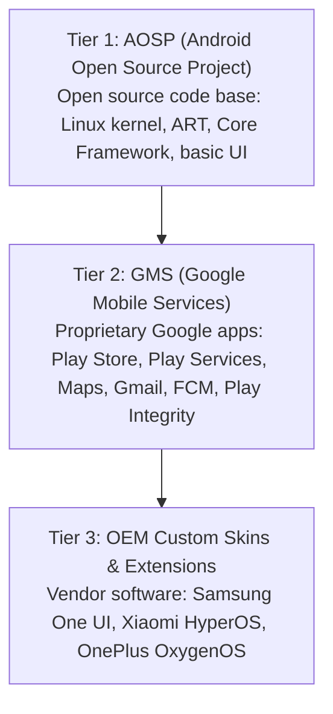
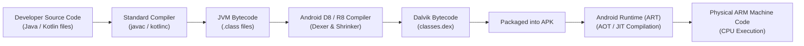
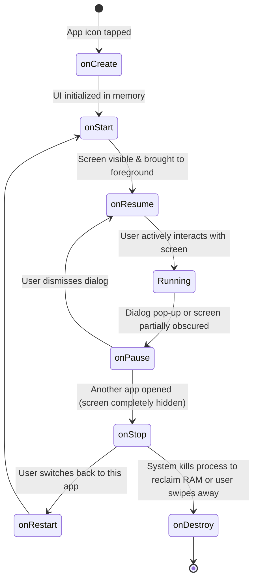

# Volume 09: Mobile & Android Security
# Special Primer: Android & Mobile Application Foundations from Absolute Zero
## A First-Principles Guide for Beginners, System Administrators & Aspiring Mobile Security Auditors

---

## 1. Introduction: Demystifying Mobile Devices

If you have never built an app, never touched an Android emulator, or wondered how a smartphone actually differs from a laptop or desktop computer, this guide is written specifically for you.

To secure, audit, or test a mobile application, you must first understand the machine it runs on and how software executes on mobile operating systems.

```
+----------------------------------------------------------------------------------------------------+
|                                    THE SMARTPHONE PARADIGM                                         |
+------------------------------------+---------------------------------------------------------------+
| Traditional PC / Laptop            | Modern Mobile Device (Smartphone / Tablet)                    |
+------------------------------------+---------------------------------------------------------------+
| • Dedicated desk or lap usage      | • Always carried, always connected (Cellular, WiFi, Bluetooth)|
| • AC wall power or large battery   | • Strict battery conservation & aggressive thermal management |
| • Keyboard, mouse, large display   | • Capacitive touchscreen, virtual keyboard, voice input       |
| • Few integrated sensors           | • Rich sensor array (GPS, gyroscope, camera, biometrics)      |
| • Modular hardware (CPU, GPU, RAM) | • System-on-a-Chip (SoC): everything integrated on one silicon|
| • Single-user/ambient authority    | • Multi-user sandboxing: every app is an isolated user        |
+------------------------------------+---------------------------------------------------------------+
```

---

### 1.1 How Smartphones Differ from Traditional Computers
1. **Continuous Connectivity**: A smartphone maintains persistent, simultaneous connections across multiple radio interfaces: Cellular baseband (4G LTE / 5G NR), WiFi (802.11ax/be), Bluetooth Low Energy (BLE), Near Field Communication (NFC), and Global Navigation Satellite Systems (GNSS / GPS).
2. **Dense Sensor Array**: Unlike a PC with an external webcam and mouse, a smartphone contains microscopic hardware sensors that continuously monitor the physical world:
   - **Accelerometer & Gyroscope**: Detect tilt, rotation, motion, and step counting.
   - **Magnetometer**: Acts as a digital compass detecting Earth's magnetic field.
   - **Ambient Light & Proximity Sensors**: Measure distance to the user's face and screen brightness.
   - **Biometric Sensors**: Ultrasonic or optical fingerprint scanners under the glass display, infrared 3D facial mapping cameras.
   - **Multiple High-Definition Cameras & Microphone Arrays**: Directional audio capture and multi-lens optical sensors.
3. **Severe Power and Thermal Budgets**: A desktop PC can consume 300 to 750 Watts of power with large fans and heat sinks. A smartphone operates within a **3 to 10 Watt** power budget inside a sealed, fanless aluminum or glass chassis. As a result, mobile operating systems aggressively terminate inactive background programs to preserve battery life.

---

### 1.2 The Hardware Heart: What is a System-on-a-Chip (SoC)?
On a desktop computer motherboard, you can point to separate, modular physical chips: the Intel or AMD CPU in a socket, the Nvidia or AMD graphics card in a PCIe slot, separate RAM sticks in DIMM slots, and a discrete WiFi card.

In a smartphone, there is no physical room for separate chips. Instead, the entire computer is printed onto a single microscopic piece of silicon called a **System-on-a-Chip (SoC)**.

```
+------------------------------------------------------------------------------------+
|                       SYSTEM-ON-A-CHIP (SoC) SILICON DIE                           |
+------------------------------------------------------------------------------------+
|  +-----------------------------------+  +---------------------------------------+  |
|  | Multi-Core Application CPU        |  | Graphics Processing Unit (GPU)        |  |
|  | (e.g., ARM Cortex-X4 + A720 + A520|  | (Qualcomm Adreno / ARM Mali / Apple)  |  |
|  |  big.LITTLE Architecture)         |  | Renders 120Hz UI, 3D Games, Shaders   |  |
|  +-----------------------------------+  +---------------------------------------+  |
|  +-----------------------------------+  +---------------------------------------+  |
|  | Cellular Baseband Modem (5G/LTE)  |  | Image Signal Processor (ISP)          |  |
|  | Dedicated processor running RTOS  |  | Hardware camera pipeline, HDR, noise  |  |
|  | handling raw radio frequencies    |  | reduction, computer vision            |  |
|  +-----------------------------------+  +---------------------------------------+  |
|  +-----------------------------------+  +---------------------------------------+  |
|  | Neural Processing Unit (NPU)      |  | Hardware Security Module / TEE        |  |
|  | Hardware matrix acceleration for  |  | Isolated crypto engine, biometric key |  |
|  | on-device machine learning & AI   |  | vault (ARM TrustZone, Google Titan M) |  |
|  +-----------------------------------+  +---------------------------------------+  |
+------------------------------------------------------------------------------------+
```

#### The big.LITTLE / DynamIQ CPU Architecture
To balance battery life with high performance, smartphone CPUs do not make all cores identical. They use a heterogeneous multi-processing architecture:
* **"LITTLE" High-Efficiency Cores**: Small, low-power cores (e.g., ARM Cortex-A520) running at low clock speeds. They handle background tasks, playing audio, checking notifications, and idle tasks using minimal battery.
* **"big" High-Performance Cores**: Large, powerful cores (e.g., ARM Cortex-X4 or Cortex-A720) that turn on only when the user opens an app, renders a web page, or plays a game. When the burst of work finishes, they immediately shut down to save power.

#### Major SoC Families in the Wild:
* **Qualcomm Snapdragon**: Powers the majority of Android flagship and mid-range devices globally (Samsung Galaxy, OnePlus, Xiaomi).
* **MediaTek Dimensity / Helio**: Prevalent in budget-to-mid-range smartphones and international markets.
* **Google Tensor**: Powers Google Pixel devices with custom TPU/NPU silicon for computational photography and speech processing.
* **Samsung Exynos**: Powers select international variants of Samsung Galaxy hardware.
* **Apple Silicon (A-Series / M-Series)**: Custom in-house ARM architecture powering iPhone and iPad devices.

---

### 1.3 Flash Storage & The Android Disk Partition Map
Smartphones do not use spinning hard drives or SATA SSDs. They use high-speed soldered flash memory chips based on **eMMC** (in budget devices) or **UFS (Universal Flash Storage)** (UFS 3.1 / 4.0 in modern smartphones).

The storage disk is divided into isolated physical and logical **partitions**, each serving a strict operational role:

| Partition Name | Mount Point | Filesystem Type | Access Mode | Description & Security Role |
| :--- | :--- | :--- | :--- | :--- |
| **boot** | N/A | Raw Image | Read-Only | Contains the Linux Kernel (`vmlinuz`) and the initial RAM disk (`initramfs`) required to start the device. |
| **system** | `/system` | `ext4` / `erofs` | Read-Only | Contains the core Android OS, framework libraries, runtime binaries, and pre-installed system applications. |
| **vendor** | `/vendor` | `ext4` / `erofs` | Read-Only | Contains proprietary hardware drivers and HAL implementations written by the SoC vendor (Qualcomm, MediaTek). |
| **userdata** | `/data` | `f2fs` / `ext4` | Read/Write (Encrypted)| Contains all user-installed applications, user files, photos, app databases, and settings. Hardware-encrypted via FBE. |
| **recovery** | N/A | Raw Image | Standalone OS | Contains a minimal emergency maintenance operating system used to apply OTA system updates or factory reset. |
| **misc** | N/A | Raw Partition | Read/Write | Small partition used by the bootloader to pass operational flags (e.g., reboot into recovery, wipe data). |

#### Modern A/B (Seamless) Partitioning
Modern Android devices use an **A/B dual-slot system** (`boot_a` and `boot_b`, `system_a` and `system_b`). When an Over-The-Air (OTA) system update arrives:
1. The update is written silently to the unused inactive slot (`Slot B`) in the background while you continue using the phone on `Slot A`.
2. Upon restarting, the bootloader switches active slots to `Slot B`.
3. If the update fails to boot, the bootloader automatically rolls back to `Slot A`, preventing the phone from ever getting "bricked".

---

## 2. What is Android? History, Ecosystem & Architecture

---

### 2.1 The History and Evolution of Android
* **2003**: Andy Rubin, Rich Miner, Nick Sears, and Chris White founded **Android Inc.** in Palo Alto, California. Their original vision was an advanced operating system for digital cameras that could wirelessly connect to cloud storage. Recognizing that the camera market was shrinking, they pivoted to smartphones.
* **2005**: **Google acquired Android Inc.** for approximately $50 million, bringing Andy Rubin and the team to Google to build an open mobile platform based on the Linux kernel.
* **2007**: Google and a coalition of hardware manufacturers, chipmakers, and telecom carriers announced the **Open Handset Alliance (OHA)** and unveiled Android as an open-source mobile platform to counter proprietary mobile operating systems (Symbian, BlackBerry OS, Windows Mobile, and Apple's newly announced iOS).
* **October 2008**: The first commercial Android smartphone was released: the **HTC Dream** (marketed in the US as the **T-Mobile G1**). It featured a physical slide-out QWERTY keyboard, a trackball, and ran Android 1.0.
* **The Sweet Naming Tradition**: Android versions were famously named alphabetically after desserts until Android 10:
  - Android 1.5 *Cupcake* $\rightarrow$ 1.6 *Donut* $\rightarrow$ 2.0/2.1 *Eclair* $\rightarrow$ 2.2 *Froyo* $\rightarrow$ 2.3 *Gingerbread*
  - Android 3.0 *Honeycomb* (tablet-only) $\rightarrow$ 4.0 *Ice Cream Sandwich* $\rightarrow$ 4.1–4.3 *Jelly Bean* $\rightarrow$ 4.4 *KitKat*
  - Android 5.0/5.1 *Lollipop* (introduced ART runtime, material design) $\rightarrow$ 6.0 *Marshmallow* (introduced runtime permissions)
  - Android 7.0 *Nougat* $\rightarrow$ 8.0 *Oreo* (Project Treble) $\rightarrow$ 9.0 *Pie*
  - Android 10, 11, 12, 13, 14, 15, 16 (transitioned to clean numerical branding).

---

### 2.2 Why Android is Linux, but NOT "GNU/Linux"
A common point of confusion for beginners is: *"If Android uses the Linux kernel, why doesn't it run regular Linux desktop programs or `.deb` packages?"*

```
+----------------------------------------------------------------------------------------------------+
|                                    LINUX DESKTOP vs. ANDROID                                       |
+------------------------------------+---------------------------------------------------------------+
| Standard GNU/Linux (Ubuntu / Kali) | Android Platform Stack                                        |
+------------------------------------+---------------------------------------------------------------+
| • Kernel: Monolithic Linux Kernel  | • Kernel: Hardened Linux Kernel (with Binder IPC & Ashmem)    |
| • C Library: GNU C Library (glibc) | • C Library: Bionic libc (lightweight, BSD-licensed, custom)   |
| • Userland: GNU Coreutils (ls, cp) | • Userland: Toybox / Toolbox (minimalist embedded utilities)  |
| • Display: X11 or Wayland          | • Display: SurfaceFlinger (hardware-accelerated compositor)   |
| • Audio: ALSA / PulseAudio / PipeWire| • Audio: AudioFlinger                                       |
| • Packaging: `.deb` / `.rpm` ELF   | • Packaging: `.apk` / `.aab` (ZIP containing DEX bytecode)    |
| • Execution: Native binary machine code| • Execution: ART (Android Runtime compiling DEX bytecode) |
| • Init System: systemd / SysVinit  | • Init System: Custom Android `init` daemon (`init.rc`)       |
+------------------------------------+---------------------------------------------------------------+
```

Android uses the Linux kernel for its core strengths: memory management, hardware drivers, network sockets, process scheduling, and security enforcement (SELinux, user permissions). However, Google replaced the entire GNU userland with lightweight, specialized alternatives designed specifically for low-RAM mobile hardware and Apache/BSD licensing.

---

### 2.3 The Three Tiers of the Android Ecosystem
When you use an Android device, you are interacting with three distinct layers of software:



1. **AOSP (Android Open Source Project)**: The public, free open-source codebase maintained by Google under Apache 2.0 and GPL licenses. Anyone can download the code, compile it, and run it on compatible hardware. It contains the core operating system, basic dialer, launcher, and calculator, but **no Google services**.
2. **GMS (Google Mobile Services)**: A proprietary suite of Google software and cloud APIs licensed to manufacturers who pass Google's Compatibility Test Suite (CTS). This includes Google Play Store, Google Play Services (location APIs, push notifications via Firebase Cloud Messaging), YouTube, Chrome, and security services like Google Play Protect.
3. **OEM Custom Skins**: Hardware manufacturers modify AOSP to brand their devices with custom graphical interfaces, camera software, and battery management features (e.g., Samsung One UI, Xiaomi HyperOS/MIUI, OnePlus OxygenOS, Motorola My UX).

---

## 3. What Actually Is an "Application" (App)?

---

### 3.1 Software from First Principles: What is an App?
An "application" (or "app") is simply a structured bundle of computer instructions, graphical assets (icons, images, audio), user interface layouts, and configuration metadata packaged together so that an operating system can install, verify, and execute it.

On a Windows PC, a software installer is typically an `.exe` or `.msi` file.
On macOS, it is a `.dmg` or `.app` bundle.
On Linux, it is a `.deb` or `.rpm` archive.

On Android, an application is packaged into a file format known as an **APK (Android Package)** or modern **AAB (Android App Bundle)**.

---

### 3.2 The APK Unmasked: It's Just a ZIP File!
Here is one of the most empowering foundational secrets for any aspiring mobile security auditor:

> **An `.apk` file is literally a standard ZIP archive.**

If you download any Android app (e.g., `whatsapp.apk`), rename the extension to `whatsapp.zip`, and open it with 7-Zip, WinRAR, or the `unzip` command on Linux, it extracts into a standard directory hierarchy.

```
whatsapp.apk (renamed to whatsapp.zip)
├── AndroidManifest.xml          <-- The Application Passport / Blueprint
├── classes.dex                  <-- The Compiled Application Code (Dalvik Executable)
├── classes2.dex                 <-- Secondary Code Chunk (Multi-dex)
├── classes3.dex                 <-- Additional Code Chunk
├── res/                         <-- Compiled Graphic & Layout Resources
│   ├── layout/                  <-- Screen designs (binary XML)
│   ├── drawable-xxhdpi/         <-- High-resolution buttons and icons
│   └── values/                  <-- Color definitions and styles
├── resources.arsc               <-- Compiled Resource Index Table
├── lib/                         <-- Native Compiled C/C++ Libraries (.so)
│   ├── arm64-v8a/               <-- 64-bit ARM mobile processors
│   ├── armeabi-v7a/             <-- 32-bit legacy ARM mobile processors
│   └── x86_64/                  <-- 64-bit Intel/AMD desktop emulators
├── assets/                      <-- Raw Uncompiled App Files (Web assets, fonts, SQLite templates)
└── META-INF/                    <-- Cryptographic Signatures & Certificates
    ├── MANIFEST.MF              <-- Cryptographic SHA-256 hash of every file in the APK
    ├── CERT.SF                  <-- Signature file signing the manifest
    └── CERT.RSA                 <-- Developer's Public Key Certificate
```

#### Detailed Breakdown of APK Anatomy:

1. `AndroidManifest.xml`:
   - The absolute master blueprint of the application.
   - Declares the app's unique package identifier (e.g., `com.company.bankingapp`).
   - Declares every permission the app requests (`INTERNET`, `CAMERA`, `READ_CONTACTS`).
   - Declares all user-facing screens (Activities), background processes (Services), listeners (Broadcast Receivers), and databases (Content Providers).
   - *Note*: Inside an APK, this file is compiled into **Android Binary XML** format for fast machine parsing. You cannot read it directly with `cat` or Notepad without decoding it using tools like `apktool` or `jadx`.
2. `classes.dex` (Dalvik Executable):
   - Contains the compiled executable code written by the developers.
   - When a programmer writes Java or Kotlin source code, the compiler turns that code into **DEX bytecode**, which the Android Runtime (ART) reads and executes.
   - If an app is large (containing more than 65,536 methods), it exceeds the Dalvik method limit and is split into multiple files: `classes.dex`, `classes2.dex`, `classes3.dex`, etc.
3. `res/` and `resources.arsc`:
   - `res/` holds compiled UI assets: XML layouts defining button positions, images, and localized language strings.
   - `resources.arsc` is a binary table that assigns every resource an integer ID (e.g., `0x7f040001` $\leftrightarrow$ `@string/login_button_title`).
4. `lib/` (Native Shared Libraries):
   - Contains pre-compiled C or C++ shared libraries (`.so` files) when developers write performance-critical code (game engines, video decoding, cryptography, or security anti-tampering checks) using the **Android NDK (Native Development Kit)**.
   - Organized into CPU architecture subdirectories called **ABIs (Application Binary Interfaces)**.
5. `assets/`:
   - Stores raw, uncompiled auxiliary files that the app needs at runtime (e.g., bundled web assets for hybrid apps like HTML/CSS/JS, machine learning models `.tflite`, custom typography fonts `.ttf`, or pre-populated SQLite databases).
6. `META-INF/`:
   - Contains the cryptographic integrity signatures that prove the app was signed by the original developer and has not been altered or tampered with by a malicious third party.

---

### 3.3 APK vs. AAB (Android App Bundle)
Historically, developers uploaded a single `.apk` file to the Google Play Store containing graphics for all screen sizes (phones, tablets, TVs) and native code for all CPU architectures (`armeabi-v7a`, `arm64-v8a`, `x86`, `x86_64`). This made app downloads needlessly large.

In 2021, Google mandated the **Android App Bundle (.aab)** for new apps:
* The developer uploads an `.aab` file to Google Play.
* When a user taps "Install" on their Samsung Galaxy S24, the Play Store's dynamic delivery system generates a customized **Split APK** containing *only* the `arm64-v8a` native libraries and *only* the high-density screen graphics needed for that specific phone.

---

## 4. How Code Runs: From Java/Kotlin to Hardware Execution

To audit an app, you need to know how human-written source code transforms into electrical pulses executing on a silicon chip.



---

### 4.1 The Step-by-Step Compilation Pipeline
1. **Source Code**: The developer writes code in **Kotlin** (the modern standard for Android) or **Java**.
2. **Java Compilation**: The `kotlinc` or `javac` compiler converts human-readable code into standard **Java Virtual Machine (JVM) Bytecode** stored in `.class` files.
3. **The Dexing Stage (`d8` / `r8`)**: Standard JVM bytecode is designed for desktop servers, not battery-constrained smartphones. Android runs a specialized translation tool called `d8` (the dexer) and `r8` (an optimizer and code shrinker). It consolidates all `.class` files, strips duplicate strings, optimizes constants, and generates one compact **`classes.dex`** file.
4. **Packaging**: The `.dex` file, compiled resources, assets, and the binary manifest are compressed into the final `.apk` archive and cryptographically signed.

---

### 4.2 The Virtual Machine Evolution: Dalvik vs. ART
Standard desktop computers execute machine code directly on the physical Intel/AMD CPU. Mobile applications execute on top of a specialized runtime environment:

```
+----------------------------------------------------------------------------------------------------+
|                                      DALVIK VM vs. ANDROID RUNTIME (ART)                           |
+------------------------------------+---------------------------------------------------------------+
| Dalvik Virtual Machine             | Modern Android Runtime (ART)                                  |
| (Android 1.0 through 4.4 KitKat)   | (Android 5.0 Lollipop through Present)                        |
+------------------------------------+---------------------------------------------------------------+
| • Mechanism: Just-In-Time (JIT)    | • Mechanism: Hybrid AOT + JIT + Cloud Profiles                |
| • Translation: Converts DEX to     | • Translation: Compiles DEX to native ELF machine code during |
|   machine code line-by-line while  |   installation and idle maintenance charging cycles           |
|   the user is actively running app |                                                               |
| • App Launch: Slower launch time   | • App Launch: Instant, highly optimized launch execution      |
| • Battery: Higher CPU & battery use| • Battery: Significantly lower CPU and battery consumption     |
+------------------------------------+---------------------------------------------------------------+
```

#### How Modern ART Works (Android 7.0+ to Present):
Modern Android does not force you to choose between pure JIT or pure AOT. It uses an intelligent **Hybrid Compilation Engine**:
1. When you first install an app, ART executes it quickly using a fast JIT interpreter without making you wait through a long installation process.
2. While you use the app, ART logs a **Profile** identifying the exact functions, classes, and methods you use most frequently (the "hot paths", like login and feed loading).
3. When you plug your phone into a charger overnight, a background maintenance service (`dex2oat`) triggers: it takes those hot paths and compiles them permanently into native machine code (`.oat` / `.vdex` files).
4. Google Play also aggregates anonymous profiles from millions of users (**Cloud Profiles**) so that new downloads are pre-optimized before they even open!

---

### 4.3 The Secret of Instant Launch: The "Zygote" Process
On a traditional Linux or Windows machine, launching an application requires loading dozens of operating system libraries from disk into RAM, which takes noticeable time.

Android solves this using a unique master process called **Zygote**:

```
[ Android Boot Complete ]
           |
           v
  +-------------------------------------------------------------------------+
  | ZYGOTE PROCESS                                                          |
  | • Preloads the entire Android Runtime (ART) into RAM                    |
  | • Preloads thousands of core Android framework Java classes             |
  | • Preloads common UI resources (system icons, fonts, layouts)           |
  | • Sits dormant, listening on a Unix domain socket: /dev/socket/zygote   |
  +-------------------------------------------------------------------------+
           |
           | User taps "WhatsApp" icon
           v
  [ ActivityManagerService sends request to Zygote socket ]
           |
           v
  [ Zygote calls Linux fork() ]
           |
           v
  +-------------------------------------------------------------------------+
  | NEW CHILD PROCESS SPAWNED IN MILLISECONDS                               |
  | • Inherits the warm, pre-initialized runtime and all preloaded classes  |
  | • Drops Linux privileges: switches from root to app's dedicated UID     |
  | • Loads WhatsApp's classes.dex and begins execution immediately         |
  +-------------------------------------------------------------------------+
```

Because Linux uses **Copy-on-Write (COW)** memory management, every running application shares the exact same physical RAM pages for the preloaded core operating system classes. This saves gigabytes of device memory!

---

## 5. The Four Pillars: Core Android Application Components

In traditional desktop programming, an application typically has a single entry point: the `main()` function.

Android apps do **not** have a `main()` function. Instead, an Android app is a collection of loosely coupled **Components** that the operating system can instantiate independently as needed.

There are **Four Core Application Components**:

```
+----------------------------------------------------------------------------------------------------+
|                               THE FOUR CORE ANDROID COMPONENTS                                     |
+----------------------+--------------------+-----------------------+--------------------------------+
| Component            | Has User Interface?| Primary Role          | Everyday Real-World Analogy    |
+----------------------+--------------------+-----------------------+--------------------------------+
| 1. Activity          | YES                | Single UI Screen      | A page in a physical book      |
| 2. Service           | NO                 | Background Processing | The engine running under a hood|
| 3. Broadcast Receiver| NO                 | Event Listener        | A radio antenna tuning into FM |
| 4. Content Provider  | NO                 | Data Store / Database | A bank teller checking your ID |
+----------------------+--------------------+-----------------------+--------------------------------+
```

---

### 5.1 Activity (The UI Screen)
An **Activity** represents a single, focused visual screen that a user can see and interact with.
* An email application might have:
  - `InboxActivity`: Shows the list of received emails.
  - `ComposeActivity`: A screen with text fields to write a new email.
  - `SettingsActivity`: A screen to toggle notifications and dark mode.

#### The Activity Lifecycle State Machine
Because mobile users are constantly interrupted (incoming phone calls, switching apps, rotating the screen, low battery warnings), an Activity must constantly transition through a lifecycle managed by the OS:



* **`onCreate()`**: The screen is first initialized. Memory is allocated, layouts (`setContentView()`) are loaded, and variables are bound.
* **`onResume()`**: The activity is in the foreground and has user input focus.
* **`onPause()` / `onStop()`**: The activity is no longer interacting with the user. The app should pause animations or save unsaved draft text.
* **`onDestroy()`**: The activity is completely purged from memory.

---

### 5.2 Service (The Background Worker)
A **Service** is a component that performs long-running operations in the background without providing any user interface.
* Examples:
  - Streaming music in Spotify while you browse Reddit or lock your phone.
  - Downloading a 2 GB game asset update in the background.
  - Tracking GPS location for a running workout app.

#### Types of Services:
1. **Background Service**: Performs a task without the user noticing. Modern Android (Android 8.0+) severely limits background services when the app is minimized to save battery.
2. **Foreground Service**: A service performing an operation the user is actively aware of (e.g., music playback, turn-by-turn navigation). **It must display a persistent, non-dismissible notification icon in the status bar** so the user knows an app is actively consuming battery and resources.
3. **Bound Service**: A client-server interface where other components can bind to the service, send requests, and receive responses.

---

### 5.3 Broadcast Receiver (The Event Listener)
A **Broadcast Receiver** is a dormant component designed to listen for system-wide or app-specific announcements (called "Broadcasts"). It has no user interface, but it can trigger a notification or start a Service when an event occurs.

* **System Broadcasts** sent by the Android OS:
  - `android.intent.action.BOOT_COMPLETED`: Sent when the phone finishes booting up.
  - `android.intent.action.BATTERY_LOW`: Sent when battery drops below 15%.
  - `android.intent.action.ACTION_POWER_CONNECTED`: Sent when a charger is plugged in.
  - `android.net.conn.CONNECTIVITY_CHANGE`: Sent when switching from WiFi to Cellular data.
  - `android.provider.Telephony.SMS_RECEIVED`: Sent when a new SMS text message arrives.

* **Security Relevance**: If a Broadcast Receiver is configured improperly, an unauthorized malicious application on the device can forge broadcast intents to trigger sensitive actions inside another app.

---

### 5.4 Content Provider (The Data Store)
A **Content Provider** manages access to a structured central repository of data. It acts as a standardized security boundary between an app's internal database and the outside world.

* **Analogy**: Think of a Content Provider as a bank teller behind bulletproof glass. External apps cannot walk into the bank vault and grab money; they must present a structured request to the teller, who validates their identity and permissions before returning the specific data.
* A Content Provider exposes data via standardized **Uniform Resource Identifiers (URIs)** starting with `content://`:
  ```
  content://com.example.banking.provider/accounts/checking
  |______| |___________________________| |_______________|
   Scheme             Authority                  Path
  ```
* Supports standard database operations:
  - `query()`: Read records.
  - `insert()`: Add a new record.
  - `update()`: Modify an existing record.
  - `delete()`: Remove a record.
* *Everyday Example*: The Android operating system provides built-in Content Providers for Contacts (`ContactsContract`), Calendar events, and Media gallery photos.

---

## 6. How Components Talk: The Magic of "Intents"

Because Android components are decoupled, they do not call each other directly like functions in a script. Instead, they communicate using an asynchronous messaging mechanism called an **Intent**.

```
+------------------------------------------------------------------------------------+
|                                WHAT IS AN INTENT?                                  |
+------------------------------------------------------------------------------------+
| An Intent is an operational message that says:                                     |
| "I want to perform [ACTION] on [DATA] with [EXTRA INFORMATION]."                   |
+------------------------------------------------------------------------------------+
```

---

### 6.1 Explicit Intents vs. Implicit Intents

```
+----------------------------------------------------------------------------------------------------+
|                                EXPLICIT vs. IMPLICIT INTENTS                                       |
+------------------------------------+---------------------------------------------------------------+
| Explicit Intent                    | Implicit Intent                                               |
+------------------------------------+---------------------------------------------------------------+
| • Target: Specifies the EXACT class| • Target: Specifies an ACTION without naming a recipient app  |
|   name and package to open         |                                                               |
| • Destination: Internal to the app | • Destination: Any app on the phone that handles this action  |
| • Example:                         | • Example:                                                    |
|   "Open ProfileActivity inside     |   "I want to view the web page https://example.com"           |
|    com.mybank.app"                 |   (Android displays the App Chooser: Chrome? Firefox? Opera?) |
+------------------------------------+---------------------------------------------------------------+
```

#### Code Demonstration of an Explicit Intent (Kotlin):
```kotlin
// Open the exact internal screen "SettingsActivity"
val intent = Intent(this, SettingsActivity::class.java)
intent.putExtra("user_id", 1042)
startActivity(intent)
```

#### Code Demonstration of an Implicit Intent (Kotlin):
```kotlin
// Request any installed app that can dial a phone number
val callIntent = Intent(Intent.ACTION_DIAL).apply {
    data = Uri.parse("tel:+18005550199")
}
startActivity(callIntent)
```

---

### 6.2 Intent Filters: How Apps Register to Handle Actions
If an app wants to handle implicit intents sent by other apps or the system, it must declare an **Intent Filter** in its `AndroidManifest.xml`:

```xml
<activity android:name=".SharePhotoActivity" android:exported="true">
    <intent-filter>
        <!-- The action this activity can perform -->
        <action android:name="android.intent.action.SEND" />
        <!-- Must be included for implicit intents -->
        <category android:name="android.intent.category.DEFAULT" />
        <!-- The type of data it accepts -->
        <data android:mimeType="image/*" />
    </intent-filter>
</activity>
```
When any app (like Twitter or Instagram) shares an image using `ACTION_SEND`, the Android OS inspects all installed apps' intent filters and lists `SharePhotoActivity` as an available option!

---

## 7. The Android Security Model from Ground Zero

Why can't a rogue game downloaded from the internet read your WhatsApp messages, steal your banking passwords, or secretly turn on your camera?

---

### 7.1 The Application Sandbox (Linux UID Isolation)
On a standard Windows or Linux desktop computer, security is centered around the **logged-in user**:
* If you log in to Windows as "Alice", every program you launch (Chrome, Word, Discord, or a malicious trojan downloaded from the web) runs with Alice's permissions.
* The trojan can freely read Alice's documents, steal Chrome's saved cookies, or encrypt Alice's files with ransomware because they all run under the same user token.

**Android completely revolutionized this paradigm by treating every application as a separate Linux user.**

```
+----------------------------------------------------------------------------------------------------+
|                                    ANDROID APPLICATION SANDBOX                                     |
+------------------------------------+---------------------------------------------------------------+
| App A: WhatsApp                    | App B: Malicious Torch App                                    |
| Package: com.whatsapp              | Package: com.untrusted.torch                                  |
| Assigned Linux UID: 10184 (u0_a184)| Assigned Linux UID: 10192 (u0_a192)                           |
| Private Directory:                 | Private Directory:                                            |
|   /data/data/com.whatsapp/         |   /data/data/com.untrusted.torch/                             |
| Directory Permissions:             | Directory Permissions:                                        |
|   drwx------ (0700)                |   drwx------ (0700)                                           |
|   Owner: u0_a184:u0_a184           |   Owner: u0_a192:u0_a192                                      |
+------------------------------------+---------------------------------------------------------------+
                                     |
                                     v
       [ Rogue App attempts to read: /data/data/com.whatsapp/databases/msgstore.db ]
                                     |
                                     v
                  +--------------------------------------+
                  | LINUX KERNEL (Ring 0) VFS CHECK      |
                  | UID 10192 does NOT match Owner 10184 |
                  | EACCES: "Permission Denied"          |
                  +--------------------------------------+
```

1. During installation, the Android Package Manager generates a brand new, unique Linux User ID (UID) for that app (e.g., `u0_a184`, integer `10184`).
2. The OS creates a private directory on the encrypted storage partition: `/data/data/<package_name>/`.
3. The filesystem permissions on this folder are strictly set to `0700` (`drwx------`), meaning **only the owning UID can read, write, or enter the directory**.
4. Even if an attacker writes code in an app that tries to open `/data/data/com.whatsapp/`, the underlying Linux kernel blocks the access at the hardware ring boundary before the app can read a single byte!

---

### 7.2 The Android Permission System
Because the application sandbox isolates everything by default, an app cannot even access the internet, vibrate the phone, or read the battery level without platform permissions.

Permissions act as controlled, auditable bridges through the sandbox boundary:

```
+----------------------------------------------------------------------------------------------------+
|                                 ANDROID PERMISSION PROTECTION LEVELS                               |
+----------------------+--------------------+-----------------------+--------------------------------+
| Permission Tier      | Risk Level         | How It Is Granted     | Common Examples                |
+----------------------+--------------------+-----------------------+--------------------------------+
| 1. Normal            | Minimal / Low      | Automatically granted | • android.permission.INTERNET  |
|                      |                    | at install time       | • ACCESS_NETWORK_STATE         |
|                      |                    | without prompt        | • VIBRATE                      |
+----------------------+--------------------+-----------------------+--------------------------------+
| 2. Dangerous /       | High (Accesses     | User MUST explicitly  | • CAMERA                       |
|    Runtime           | private data or    | approve via pop-up    | • ACCESS_FINE_LOCATION         |
|                      | sensitive sensors) | dialog while running  | • READ_CONTACTS, READ_SMS      |
+----------------------+--------------------+-----------------------+--------------------------------+
| 3. Signature         | Critical System    | Automatically granted | • BIND_DEVICE_ADMIN            |
|                      |                    | ONLY IF signed with   | • Internal system permissions  |
|                      |                    | the same developer key|                                |
+----------------------+--------------------+-----------------------+--------------------------------+
| 4. Special /         | Privileged         | User must navigate to | • SYSTEM_ALERT_WINDOW          |
|    System            |                    | deep Settings menu to | • PACKAGE_USAGE_STATS          |
|                      |                    | manually toggle       | • MANAGE_EXTERNAL_STORAGE      |
+----------------------+--------------------+-----------------------+--------------------------------+
```

#### The Revolution of Runtime Permissions (Android 6.0+):
Prior to Android 6.0 (Marshmallow), all permissions were accepted all-or-nothing during installation from the Play Store. If a simple flashlight app demanded access to your contacts, SMS, and GPS, you had to grant it all or refuse to install the app.

Modern Android uses **Runtime Permissions**:
* Apps can install without prompting.
* When the app actually attempts to use the camera or microphone, the OS halts execution and presents an explicit security prompt:
  ```
  "Allow WhatsApp to record audio?"
  [ While using the app ]
  [ Only this time ]
  [ Don't allow ]
  ```
* If the user selects "Don't allow", the app receives a security exception and must gracefully continue running without audio recording.

---

### 7.3 Android Storage Architecture Explained
Where do files live on an Android device?

```
/ (Root Filesystem)
├── system/                    <-- Read-only operating system code
├── vendor/                    <-- Hardware vendor drivers
└── data/                      <-- All mutable user data (Encrypted)
    ├── data/                  <-- Internal App Sandbox Directories (PRIVATE)
    │   └── com.example.app/
    │       ├── files/         <-- Internal private files
    │       ├── databases/     <-- Internal private SQLite database files (.db)
    │       ├── shared_prefs/  <-- Internal configuration XML files
    │       └── cache/         <-- Temporary cache
    │
    └── media/0/               <-- External / Shared Storage (PUBLIC)
        (Symlinked to: /sdcard and /storage/emulated/0)
        ├── DCIM/              <-- Photos and Videos taken by camera
        ├── Download/          <-- Browser downloads
        ├── Documents/         <-- PDFs, Word documents
        └── Music/             <-- Audio files
```

* **Internal Storage (`/data/data/<package>/`)**:
  - Completely private to the application.
  - Automatically deleted when the user uninstalls the app.
  - Inaccessible on a non-rooted device by users or other apps.
* **External Storage (`/sdcard/` or `/storage/emulated/0/`)**:
  - Legacy storage area shared across apps.
  - Historically, if an app had `READ_EXTERNAL_STORAGE`, it could read every file on the entire SD card!
* **Scoped Storage (Android 10+)**:
  - Google introduced **Scoped Storage** to isolate apps even on shared storage. Apps are given an isolated folder on external storage and cannot read other apps' files without using the platform **Storage Access Framework (SAF)** file-picker dialog.

---

## 8. The Security Auditor's Swiss Army Knife: Android Debug Bridge (ADB)

---

### 8.1 What is ADB?
**Android Debug Bridge (ADB)** is a command-line tool that allows a computer to communicate directly with an Android device (or emulator) via a USB cable or local WiFi network.

It uses a **Three-Component Client-Server Architecture**:

```
+------------------------------------------------------------------------------------+
| COMPUTER / WORKSTATION (Kali Linux / macOS / Windows)                              |
|                                                                                    |
|   [ adb client ]  <--------->  [ adb server ] (Background daemon on port 5037)     |
|   (CLI command you type)             |                                             |
+--------------------------------------|---------------------------------------------+
                                       | USB Cable or WiFi (TCP port 5555)
                                       v
+------------------------------------------------------------------------------------+
| ANDROID TARGET DEVICE OR EMULATOR                                                  |
|                                                                                    |
|   [ adbd daemon ] (Runs on the phone as an unprivileged or root background service)|
+------------------------------------------------------------------------------------+
```

---

### 8.2 Enabling Developer Options & USB Debugging
Every commercial Android phone ships with developer access disabled by default. Here is the universal method to unlock it:

1. Open the **Settings** app on the Android phone.
2. Scroll to the bottom and select **About phone** (or **About device**).
3. Locate the **Build number** field.
4. **Tap the "Build number" rapidly 7 times**.
5. You will see a toast popup: *"You are now a developer!"*
6. Return to the main **Settings** screen $\rightarrow$ navigate to **System** $\rightarrow$ **Developer options**.
7. Scroll down to the **Debugging** section and toggle **USB debugging** to **ON**.
8. Connect the phone to your computer via USB.
9. A security prompt will appear on the phone screen: *"Allow USB debugging? The computer's RSA key fingerprint is: XX:XX:XX..."*
10. Check **"Always allow from this computer"** and tap **Allow**.

---

### 8.3 Top 20 Essential ADB Commands for Beginners

| # | Command Syntax | What It Does (Plain English) | Security & Auditing Context |
| :-: | :--- | :--- | :--- |
| **1** | `adb devices -l` | Lists all connected physical phones and running emulators. | First command run in any audit to verify successful connection. |
| **2** | `adb shell` | Opens an interactive Linux command shell on the phone. | Drops you directly into the device terminal to inspect files and processes. |
| **3** | `adb install app.apk` | Pushes and installs an APK onto the target phone. | Used to deploy test target applications or debugging versions. |
| **4** | `adb install -r -d target.apk`| Reinstalls an app, preserving data (`-r`) and allowing downgrade (`-d`). | Used when testing patched or modified APK builds. |
| **5** | `adb uninstall <package_name>`| Completely removes an app and its private data directory. | Cleans up the test environment after security evaluations. |
| **6** | `adb pull <remote_path> <local>`| Copies a file from the phone to your computer. | Extracts databases, shared preferences, or logs for offline analysis. |
| **7** | `adb push <local> <remote_path>`| Copies a file from your computer onto the phone. | Transfers testing scripts, SSL certificates, or Frida server binaries. |
| **8** | `adb logcat` | Streams real-time operating system and application logs. | Detects hardcoded API keys, credentials, and debug output printed to logs. |
| **9** | `adb logcat -c` | Clears the entire current logcat memory buffer. | Clears stale log history before reproducing a specific login or flow. |
| **10**| `adb logcat \| grep "TOKEN"` | Filters live system logs for specific sensitive keywords. | Uncovers cleartext session tokens, JWTs, or passwords leaked on the wire. |
| **11**| `adb shell pm list packages` | Lists package names of all applications installed on device. | Identifies third-party target app packages (`-3` flag filters non-system). |
| **12**| `adb shell pm path <package>` | Shows the exact physical filesystem path of the installed APK. | Locates the base APK (e.g., `/data/app/~~.../base.apk`) to pull it for analysis. |
| **13**| `adb shell am start -n <act>` | Forces the phone to launch a specific Activity component. | Tests whether un-exported or hidden admin screens can be launched directly. |
| **14**| `adb shell am broadcast -a <act>`| Sends a simulated broadcast intent across the system. | Verifies whether unauthorized actions can trigger sensitive receivers. |
| **15**| `adb forward tcp:27042 tcp:27042`| Forwards a local workstation network port to the phone. | Connects dynamic reverse engineering tools like Frida or debugging hooks. |
| **16**| `adb backup -f backup.ab <pkg>`| Backs up an application's private `/data` directory to PC. | Verifies if `android:allowBackup="true"` allows private data extraction. |
| **17**| `adb shell dumpsys package <pkg>`| Dumps full permission grants, signatures, and components. | Audits granted permissions and exported component boundaries. |
| **18**| `adb shell getprop ro.build.version.release` | Prints the installed Android OS version (e.g., "14"). | Identifies the security baseline and platform version of the test host. |
| **19**| `adb shell screencap -p /sdcard/s.png`| Takes a screenshot of the phone screen from the CLI. | Captures visual proof-of-concept evidence for assessment reports. |
| **20**| `adb reboot bootloader` | Reboots the phone into Fastboot mode for low-level flashing. | Used when flashing custom recovery images or unlocking bootloaders. |

---

## 9. Baby Steps into Mobile App VAPT: How to Audit an App

Now that you understand what an APK is and how the sandbox functions, how does an auditor actually test an app?

---

### 9.1 The Two Essential Decompilation Tools
Security auditors do not test mobile apps as closed "black boxes". Because Android code is compiled into DEX bytecode, we can decompile the app back into human-readable source code in seconds using free, open-source tools:

```
+----------------------------------------------------------------------------------------------------+
|                                    APKTOOL vs. JADX-GUI                                            |
+------------------------------------+---------------------------------------------------------------+
| apktool (Disassembler & Decoder)   | jadx / jadx-gui (Decompiler)                                  |
+------------------------------------+---------------------------------------------------------------+
| • Input: `app.apk`                 | • Input: `app.apk`                                            |
| • Primary Output:                  | • Primary Output:                                             |
|   - Decodes `AndroidManifest.xml`  |   - Full reconstructed **Java source code**                   |
|   - Converts DEX to **Smali** code |   - Searchable method call hierarchies                        |
|   - Reconstructs raw `res/` assets |   - Interactive GUI with syntax highlighting                  |
| • Best For: Modifying code,        | • Best For: Reading and auditing application logic,           |
|   re-packaging, and re-signing apps|   finding hardcoded keys, and analyzing vulnerabilities       |
+------------------------------------+---------------------------------------------------------------+
```

#### Running JADX on Kali Linux:
```bash
# Launch the graphical interface and open any APK directly
jadx-gui target_app.apk
```

#### Running Apktool on the Command Line:
```bash
# Disassemble the APK into a project folder
apktool d target_app.apk -o unpacked_app/
```

---

### 9.2 The First Three Vulnerabilities Every Beginner Can Find

#### Vulnerability 1: Dangerous Manifest Misconfigurations
When you decompile an APK with JADX or Apktool, open `AndroidManifest.xml` and immediately search for three dangerous flags in the `<application>` tag:

```xml
<application
    android:icon="@mipmap/ic_launcher"
    android:label="@string/app_name"
    android:debuggable="true"       <!-- VULNERABILITY A -->
    android:allowBackup="true">     <!-- VULNERABILITY B -->

    <!-- VULNERABILITY C -->
    <activity 
        android:name=".AdminDashboardActivity" 
        android:exported="true" />  
</application>
```

* **Defect A: `android:debuggable="true"`**:
  - *What it means*: The developer left debugging mode turned on for production.
  - *Security Impact*: Any user connected via ADB can attach a Java debugger (`jdb`) to the running app process, freeze execution, inspect all variables in memory, read decrypted database records, and manipulate variables at runtime.
* **Defect B: `android:allowBackup="true"`**:
  - *What it means*: The app allows the Android backup manager to archive its internal data.
  - *Security Impact*: Anyone with physical access to an unlocked phone can connect via USB and run:
    ```bash
    adb backup -f app_private_data.ab com.company.app
    ```
    This dumps the entire private sandbox directory (`/data/data/com.company.app/`)—including session tokens, cached database records, and user preferences—onto the PC without needing root access!
* **Defect C: `android:exported="true"` without Permissions**:
  - *What it means*: An internal Activity, Service, or Broadcast Receiver is made visible to all other apps on the phone.
  - *Security Impact*: Any untrusted rogue app installed on the device can send an Intent directly to `.AdminDashboardActivity`, completely bypassing the login screen!

---

#### Vulnerability 2: Plaintext Secrets in Local App Storage
When an app stores sensitive data on the phone, where does it put it?

Developers frequently use a convenient Android key-value mechanism called **SharedPreferences**. Behind the scenes, SharedPreferences saves data in **plain, unencrypted XML files** inside `/data/data/<package>/shared_prefs/`:

```xml
<!-- File: /data/data/com.vulnerable.bank/shared_prefs/user_session.xml -->
<?xml version='1.0' encoding='utf-8' standalone='yes' ?>
<map>
    <string name="auth_token">eyJh****REDACTED</string>
    <string name="saved_username">john.doe@company.internal</string>
    <string name="plaintext_password">SuperSecretPass123!</string>
</map>
```
* **Auditing Methodology**:
  1. Install and log in to the application.
  2. Open an ADB shell on your test device/emulator:
     ```bash
     adb shell
     su
     cd /data/data/com.target.package/shared_prefs/
     cat *.xml
     ```
  3. If you find passwords, unmasked authorization tokens, or PIN numbers stored in cleartext XML, you have identified a vulnerability (**CWE-312: Cleartext Storage of Sensitive Information**).

---

#### Vulnerability 3: Sensitive Information Leakage via Logcat
During development, programmers print messages to the console to debug issues using Android's `Log` class:
```java
Log.d("AUTH_DEBUG", "User logged in with token: " + userToken);
```
If developers forget to strip these logging statements before releasing the app to the Google Play Store, those logs continue streaming to the operating system's global logging ring buffer!

* **Auditing Methodology**:
  1. Open a terminal and start streaming logs:
     ```bash
     adb logcat | grep -E "AUTH|TOKEN|PASS|USER|CRED"
     ```
  2. Perform logins, financial transactions, and account updates inside the app.
  3. Observe whether private user data, authorization headers, or sensitive API URLs are broadcasted into the log stream.

---

## 10. Android vs. iOS: The High-Level Security Comparison

While this guide focuses on Android fundamentals, mobile security engineers frequently assess both Android and iOS applications. Understanding how their security philosophies differ is crucial:

| Security Feature | Android Platform | Apple iOS Platform |
| :--- | :--- | :--- |
| **Underlying OS Kernel** | Hardened **Linux Kernel** | **Darwin XNU Hybrid Kernel** (Mach + FreeBSD) |
| **Platform Openness** | Open Source Base (AOSP) + Proprietary GMS | Completely Proprietary Closed Source |
| **Application Package** | `.apk` / `.aab` (ZIP containing DEX bytecode) | `.ipa` (ZIP containing compiled ARM64 Mach-O binary) |
| **Runtime Environment** | Android Runtime (ART) executing bytecode | Native ARM64 machine code executed directly |
| **App Sandboxing Mechanism** | Linux User IDs (**UIDs**) + SELinux Policies | Mach Sandbox (`sandbox_init()`) + TrustedBSD MAC |
| **Code Signing Mandate** | Apps must be signed, but self-signed keys allowed | Strict **Apple CA mandatory code signing** (AMFI) |
| **Sideloading Apps** | Allowed by default (toggle "Install Unknown Apps") | Severely restricted (App Store, TestFlight, enterprise certs) |
| **Hardware Security Vault** | ARM TrustZone / TEE / Google StrongBox | **Secure Enclave Processor (SEP)** running sepOS |
| **Elevation of Privilege** | **Rooting** (replacing `/system/xbin/su`) | **Jailbreaking** (exploiting kernel memory vulnerabilities) |
| **Decompilation Fidelity** | **Extremely High**: DEX bytecodes decompile cleanly to Java | **Lower / Assembly**: Requires Ghidra/IDA to read Mach-O assembly |

---

## 11. Hands-On Progressive Exercises for Absolute Beginners

Reinforce your foundational understanding by completing these five non-destructive practical exercises on your local computer:

### Exercise 1: APK Dissection by Hand
1. Download any free, open-source Android APK from F-Droid (e.g., a simple calculator or notepad app).
2. Make a copy of the file and rename the extension from `.apk` to `.zip`.
3. Extract the ZIP archive using your computer's standard archive tool.
4. Inspect the extracted folder: identify `classes.dex`, the `res/` folder, and `AndroidManifest.xml`.
5. Try opening `AndroidManifest.xml` in a text editor: observe that it is unreadable compiled binary XML.

### Exercise 2: Decompiling with JADX-GUI
1. Download and launch `jadx-gui` on your workstation.
2. Open the same `.apk` file inside JADX.
3. Observe how JADX automatically decodes `AndroidManifest.xml` into clean, human-readable XML!
4. Expand the Source Code tree and locate the main Activity class. Inspect the `onCreate()` method to see reconstructed Java code.

### Exercise 3: Setting Up ADB & Exploring the Shell
1. Launch an Android Virtual Device (AVD) using Android Studio or connect a physical Android test device with USB debugging enabled.
2. Open your terminal and run `adb devices` to verify the connection.
3. Run `adb shell` to open an interactive command prompt on the phone.
4. Run standard Linux commands inside the shell: `uname -a`, `id`, `whoami`, and `df -h`.
5. Run `exit` to return to your computer's terminal.

### Exercise 4: Auditing Installed Packages via ADB
1. In your terminal, run `adb shell pm list packages -3` to list all third-party applications installed on the device.
2. Pick one package name from the list and find its physical APK installation path:
   ```bash
   adb shell pm path <package_name>
   ```
3. Use `adb pull` to download that APK file directly from the phone onto your computer:
   ```bash
   adb pull /data/app/.../base.apk ./pulled_app.apk
   ```
4. Open the pulled APK in JADX-GUI.

### Exercise 5: Live Logcat Snooping
1. In your terminal, run:
   ```bash
   adb logcat -v time *:E
   ```
   *(This streams only Error-level logs with timestamps).*
2. Open various apps on the test phone and observe how the operating system generates real-time telemetry events.

---

## 12. Curriculum Learning Roadmap

Now that you understand the first principles of smartphone hardware, the Android platform stack, the APK packaging model, the four core components, and basic auditing techniques, you are fully prepared to advance into the technical modules:

* Advance to [Module 17: Mobile Security Foundations & Android OS Architecture](file:///home/kali/Ethical_Hacking_VAPT_Master_Notes/Volume_09_Mobile_and_Android_Security/Module_17_Mobile_Security_Foundations.md) to deconstruct low-level Binder IPC transactions, hardware-backed Keystore implementations, and SELinux policy enforcement.
* Explore [Module 34: Android App VAPT & Reverse Engineering](file:///home/kali/Ethical_Hacking_VAPT_Master_Notes/Volume_09_Mobile_and_Android_Security/Module_34_Android_App_VAPT_and_Reverse_Engineering.md) to master dynamic hooking with Frida, traffic interception through Burp Suite, and bypassing certificate pinning.
