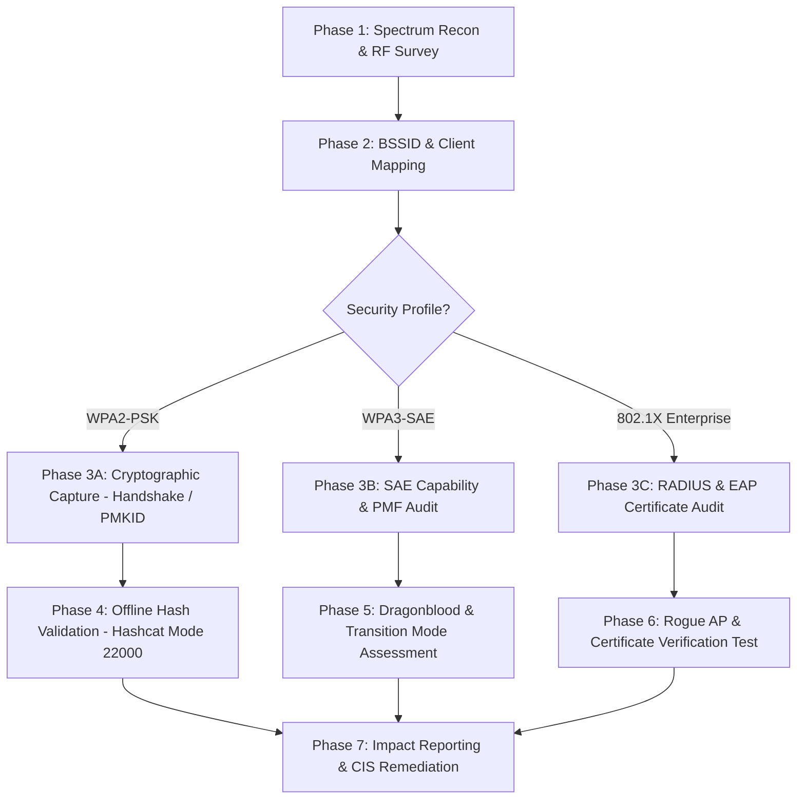

# Volume 10: Malware, Wireless, IoT & Advanced Security
# Module 13: Wireless Network Security, 802.11 Protocols & WPA2/WPA3 Architecture

---

## 1. Learning Objectives

By completing this module, security auditors, network engineers, and penetration testers will be able to:
1. Deconstruct the IEEE 802.11 PHY and MAC architecture, identifying the structural differences and security implications of Management, Control, and Data frames.
2. Formulate the exact mathematical and cryptographic derivations of the **WPA2 4-Way Handshake**, tracing Pairwise Master Keys (PMK), Pairwise Transient Keys (PTK), Key Confirmation Keys (KCK), and Message Integrity Codes (MIC).
3. Execute and verify the **PMKID Attack** (IEEE 802.11r Fast BSS Transition zero-client capture) to extract auditable cryptographic hashes directly from Access Points without client interaction.
4. Analyze the **WPA3 Simultaneous Authentication of Equals (SAE / Dragonfly)** protocol, zero-knowledge proofs, discrete logarithm cryptography, and Dragonblood side-channel attack surfaces (CVE-2019-9494, CVE-2019-9495).
5. Audit enterprise **802.1X/EAP** wireless deployments (EAP-TLS, PEAP-MSCHAPv2, EAP-TTLS), assessing RADIUS authentication flows, identity hiding, and rogue AP credential relaying.
6. Configure and evaluate **Protected Management Frames (IEEE 802.11w / PMF)** and Broadcast Integrity Protocols (BIP) to defend against deauthentication, disassociation, and denial-of-service injections.
7. Implement automated wireless defense monitoring and deploy Wireless Intrusion Prevention Systems (WIPS) detection rules for rogue APs, evil twins, and deauth floods.

---

## 2. Prerequisites

To derive the maximum technical benefit from this module, practitioners should possess:
* Thorough comprehension of OSI Layer 2 Data Link framing, MAC addressing, and Ethernet collision/carrier sense domains (covered in [Module 11](file:///home/kali/Ethical_Hacking_VAPT_Master_Notes/Volume_04_Core_Ethical_Hacking/Module_11_Sniffing_Spoofing_and_Layer2_Defense.md)).
* Working knowledge of cryptographic hashing (SHA-1, SHA-256), Key Derivation Functions (PBKDF2), and symmetric ciphers (AES-CCM, AES-GCM) (covered in [Module 24](file:///home/kali/Ethical_Hacking_VAPT_Master_Notes/Volume_02_Linux_Networking_and_Security_Foundations/Module_24_Applied_Cryptography_and_PKI.md)).
* Familiarity with Linux network interface management, kernel drivers, and monitor mode packet injection.

---

## 3. What Is It?

Wireless Security is the technical engineering discipline of protecting IEEE 802.11 Local Area Networks (WLANs) against unauthorized interception, frame injection, cryptographic compromise, and architectural subversion.

Unlike wired Ethernet networks—where physical walls, perimeter barriers, and controlled switch ports enforce clear physical and electrical access boundaries—radio frequency (RF) signals radiate omnidirectionally through walls, glass, ceilings, and perimeter boundaries. Anyone equipped with a compliant wireless interface operating within RF reception range can passively inspect raw link-layer frames, capture cryptographic negotiations, and transmit arbitrary frames into the transmission medium without physical entry.

Securing wireless environments therefore demands mathematically rigorous cryptographic authentication, forward-secret session key agreement, cryptographic integrity verification on management signaling, and strict zero-trust network segmentation.

---

## 4. Technical Explanation: IEEE 802.11 Architecture & Frame Mechanics

### 4.1 IEEE 802.11 Frame Anatomy & Classification

At Layer 2, all 802.11 transmissions are framed with a standard MAC header, an optional body, and a Frame Check Sequence (FCS / CRC-32):

```
+-----------------------------------------------------------------------------------------------+
| Octets: 2     | 2        | 6         | 6         | 6         | 2      | 6         | 0-2312 | 4     |
+---------------+----------+-----------+-----------+-----------+--------+-----------+--------+-------+
| Frame Control | Duration | Address 1 | Address 2 | Address 3 | Sequence| Address 4 | Frame  | FCS   |
|               | / ID     | (RA/DA)   | (TA/SA)   | (BSSID)   | Control| (Mesh/WDS)| Body   | CRC32 |
+-----------------------------------------------------------------------------------------------+
```

The 16-bit **Frame Control** field defines the fundamental behavior of the transmission:
* **Protocol Version (2 bits)**: Currently `00`.
* **Type (2 bits)**:
  * `00`: **Management Frame** (Mgt)
  * `01`: **Control Frame** (Ctrl)
  * `10`: **Data Frame** (Data)
* **Subtype (4 bits)**: Specifies the granular action (e.g., Beacon, Probe Request, Deauthentication, RTS, CTS, ACK, QoS Data).
* **To DS / From DS (1 bit each)**: Controls the semantic interpretation of the 4 address fields relative to the Distribution System.
* **More Fragments, Retry, Power Management, More Data, Protected Frame, Order**: Single-bit protocol state flags.

```
+------------------------------------------------------------------------------------------------------------+
| Category   | Subtype Name         | Subtype (Hex) | Purpose and Architectural Significance                 |
+------------+----------------------+---------------+--------------------------------------------------------+
| Management | Beacon               | 0x08          | Periodic AP broadcast advertising SSID, BSSID, rates,  |
|            |                      |               | encryption suites, RSN IE (0x30), and capability flags.|
|            | Probe Request        | 0x04          | Client active scan for available networks/specific SSID|
|            | Probe Response       | 0x05          | AP unicast reply to Probe Request with network profile.|
|            | Authentication       | 0x0B          | Initial open/shared key challenge-response sequence.   |
|            | Association Request  | 0x00          | Supplicant requests link-layer join to BSSID.          |
|            | Association Response | 0x01          | Authenticator grants or denies network membership.     |
|            | Deauthentication     | 0x0C          | Unsolicited link termination notification. In legacy   |
|            |                      |               | 802.11, UNENCRYPTED and UNSIGNED (DoS vulnerability).  |
|            | Disassociation       | 0x0A          | Terminates current association state.                  |
+------------+----------------------+---------------+--------------------------------------------------------+
| Control    | RTS (Request to Send)| 0x1B          | Medium reservation for collision avoidance (CSMA/CA).  |
|            | CTS (Clear to Send)  | 0x1C          | Clear-to-send medium reservation confirmation.         |
|            | ACK (Acknowledgment) | 0x1D          | Layer 2 positive frame acknowledgment.                 |
+------------+----------------------+---------------+--------------------------------------------------------+
| Data       | Data                 | 0x20          | Plaintext or encrypted network packet payload.         |
|            | QoS Data             | 0x28          | WMM/802.11e prioritized network frame payload.         |
|            | Null Function Data   | 0x24          | Keep-alive / power-save polling (no payload data).     |
+------------------------------------------------------------------------------------------------------------+
```

### 4.2 Cryptographic Key Hierarchies: WPA2-PSK vs WPA3-SAE

#### 4.2.1 WPA2-PSK Key Derivation (IEEE 802.11i)
In WPA2 Personal, the shared passphrase ($P$) and the network SSID ($S$) are used to compute the static **Pairwise Master Key (PMK)**:

$$\text{PMK} = \text{PBKDF2}(\text{HMAC-SHA1}, P, S, 4096, 256)$$

Because $P$ and $S$ are static, the PMK is identical for all clients and persists across reboots. During association, the **Pairwise Transient Key (PTK)** is dynamically derived for the individual session using a pseudo-random function (PRF-512):

$$\text{PTK} = \text{PRF-512}\left(\text{PMK}, \text{"Pairwise key expansion"}, \min(\text{MAC}_{\text{AP}}, \text{MAC}_{\text{STA}}) \parallel \max(\text{MAC}_{\text{AP}}, \text{MAC}_{\text{STA}}) \parallel \min(\text{ANonce}, \text{SNonce}) \parallel \max(\text{ANonce}, \text{SNonce})\right)$$

The resulting 512-bit PTK is partitioned into functional sub-keys:
1. **KCK (Key Confirmation Key, bits 0–127)**: 128-bit HMAC-SHA1/HMAC-MD5 key used to calculate the Message Integrity Code (MIC) in EAPOL-Key frames.
2. **KEK (Key Encryption Key, bits 128–255)**: 128-bit AES key used to encrypt the Group Temporal Key (GTK) during Message 3.
3. **TK (Temporal Key, bits 256–383)**: 128-bit AES-CCMP key used to encrypt and decrypt unicast user data frames.
4. **Tx/Rx MIC Keys (bits 384–511)**: Used only in legacy TKIP (deprecated).

```
+-----------------------------------------------------------------------------------------------+
|                                          PTK (512 bits)                                       |
+---------------------------+---------------------------+---------------------------+-----------+
| KCK (Bits 0-127)          | KEK (Bits 128-255)        | TK (Bits 256-383)         | Reserved  |
| 128-bit EAPOL MIC         | 128-bit GTK Wrap Key      | 128-bit AES-CCMP Data Enc | (TKIP MIC)|
+---------------------------+---------------------------+---------------------------+-----------+
```

#### 4.2.2 The PMKID Architecture (IEEE 802.11r / WPA2 / WPA3)
On access points supporting 802.11r (Fast BSS Transition) or modern WPA2/WPA3 implementations, the AP calculates and advertises a cache identifier called the **PMKID** inside the Robust Security Network Information Element (RSN IE, Element ID 48 / `0x30`) during the initial EAPOL Message 1:

$$\text{PMKID} = \text{HMAC-SHA1-128}\left(\text{PMK}, \text{"PMK Name"} \parallel \text{MAC}_{\text{AP}} \parallel \text{MAC}_{\text{STA}}\right)$$

*Security Implication*: Because the PMKID is computed directly from the static PMK and predictable MAC addresses without requiring the SNonce, an auditor can capture the PMKID immediately from the Access Point with a single frame without waiting for or disconnecting legitimate clients.

#### 4.2.3 WPA3-Personal: Simultaneous Authentication of Equals (SAE / Dragonfly)
WPA3 mandates the Dragonfly key exchange protocol (RFC 7664, IEEE 802.11-2020), a password-authenticated key exchange (PAKE) based on zero-knowledge proofs over elliptic curves (NIST P-256 / curve25519) or finite fields:
1. **Password-to-Curve Mapping**: Both parties map the passphrase and SSIDs to an ephemeral elliptic curve point $P$ using the Hash-to-Curve or Hunting-and-Pecking algorithm.
2. **Commit Exchange**: Both parties generate random scalar private values ($r_A, r_B$) and masks ($m_A, m_B$), exchanging blinded public values:
   $$\text{Scalar} = (r + m) \pmod q, \quad \text{Element} = -(m \cdot P)$$
3. **Key Derivation**: Both parties independently arrive at an identical ephemeral shared key $K$:
   $$K = r_A \cdot r_B \cdot P$$
4. **Confirm Exchange**: Both parties verify possession of $K$ via mutual cryptographic confirmation tokens.

*Crucial Security Advancement*: Even if an eavesdropper captures the entire exchange over the air, the transmitted values reveal no algebraic relationship to the passphrase. **Offline dictionary cracking is mathematically impossible.** An adversary can only test passwords through active online attempts with the AP, which triggers rate limiting and client lockouts.

---

## 5. How It Works: State Machines & Handshake Flows

### 5.1 The WPA2 4-Way Handshake State Machine

```mermaid
sequenceDiagram
    autonumber
    participant AP as Access Point (Authenticator)
    participant STA as Wireless Client (Supplicant)

    Note over AP,STA: Both possess PMK = PBKDF2(Passphrase, SSID, 4096)
    Note over AP: Generates random 256-bit ANonce
    AP->>STA: EAPOL-Key Frame 1 [ANonce, Replay Counter = 1, Unencrypted]
    
    Note over STA: Generates random 256-bit SNonce
    Note over STA: Derives PTK = PRF-512(PMK, ANonce, SNonce, MACs)
    Note over STA: Calculates MIC using derived KCK
    STA->>AP: EAPOL-Key Frame 2 [SNonce, Replay Counter = 1, MIC, RSN IE]

    Note over AP: Derives identical PTK using received SNonce
    Note over AP: Verifies MIC using derived KCK. If invalid, aborts!
    Note over AP: Generates random Group Temporal Key (GTK)
    Note over AP: Wraps GTK using KEK (AES-KeyWrap) and computes MIC
    AP->>STA: EAPOL-Key Frame 3 [ANonce, Replay Counter = 2, Wrapped GTK, MIC]

    Note over STA: Verifies MIC, verifies Replay Counter = 2
    Note over STA: Unwraps GTK; installs PTK/GTK in MAC hardware
    STA->>AP: EAPOL-Key Frame 4 [Replay Counter = 3, MIC, Final ACK]

    Note over AP: Installs PTK/GTK; transitions to AES-CCMP Encrypted Data
```

### 5.2 Enterprise 802.1X / EAP Architecture

In enterprise deployments, pre-shared keys are eliminated in favor of individual user identities and IEEE 802.1X port-based network access control:

```
[ Wireless Supplicant ] <==== 802.11 EAPOL ====> [ Access Point / NAS ] <==== RADIUS / EAP ====> [ RADIUS Server (FreeRADIUS / NPS) ]
  (Client Device)                                  (Network Access Server)                         (Validates against LDAP/Active Directory)
```

```
+------------------------------------------------------------------------------------------------------------+
| EAP Protocol         | Outer Tunnel (Identity)      | Inner Tunnel (Credentials)    | Security Evaluation  |
+----------------------+------------------------------+-------------------------------+----------------------+
| EAP-TLS              | TLS 1.2/1.3 with Server Cert | Client Certificate (Mutual)   | GOLD STANDARD.       |
| (RFC 5216)           |                              | Zero passwords transmitted.   | Immune to rogue APs. |
+----------------------+------------------------------+-------------------------------+----------------------+
| PEAPv0 /             | Server TLS Certificate       | MSCHAPv2 Username and         | HIGH RISK if client  |
| EAP-MSCHAPv2         | (Anonymous outer identity)   | NT-Hash Challenge-Response    | disables CA check.   |
+----------------------+------------------------------+-------------------------------+----------------------+
| EAP-TTLS             | Server TLS Certificate       | PAP / MSCHAPv2 / GTC inside   | Vulnerable if client |
| (RFC 5281)           | (Anonymous outer identity)   | TLS encrypted tunnel          | accepts untrusted CA.|
+------------------------------------------------------------------------------------------------------------+
```

---

## 6. Security Perspective: Attack Surface Analysis & Threat Vectors

### 6.1 Vulnerability Matrix

```
+------------------------------------------------------------------------------------------------------------+
| Attack Technique           | Target Component      | Root Cause Mechanism          | Impact & CVSS Score   |
+----------------------------+-----------------------+-------------------------------+-----------------------+
| Deauthentication Injection | Management Frame Bus  | 802.11 Management Frames are  | Denial of Service /   |
| (CWE-345 / CAPEC-227)      | (WPA2 without PMF)    | unauthenticated; spoofed MAC. | Disconnect: CVSS 6.5  |
+----------------------------+-----------------------+-------------------------------+-----------------------+
| Offline Handshake Cracking | WPA2 4-Way Handshake  | Static PMK derived via low-   | Complete WLAN decrypt |
| (CWE-326 / CAPEC-55)       | (EAPOL Message 2)     | iteration PBKDF2 (4096 iter). | & access: CVSS 8.1    |
+----------------------------+-----------------------+-------------------------------+-----------------------+
| PMKID Capture              | 802.11r RSN IE        | AP exposes HMAC of PMK in     | Zero-client offline   |
| (CWE-200 / CAPEC-55)       | (EAPOL Message 1)     | Message 1 without client link.| PSK cracking: CVSS 7.5|
+----------------------------+-----------------------+-------------------------------+-----------------------+
| Rogue AP / Evil Twin       | 802.1X PEAP / Captive | Supplicants fail to enforce   | Credential harvesting |
| (CWE-295 / CAPEC-94)       | Portals               | Server Certificate Authority. | & MITM: CVSS 8.5      |
+----------------------------+-----------------------+-------------------------------+-----------------------+
| KRACK Key Reinstallation   | 802.11i Handshake     | Re-transmitting Message 3     | Nonce reuse, packet   |
| (CVE-2017-13077 / CWE-323) | State Machine (CCMP)  | resets packet replay counter. | decrypt: CVSS 8.1     |
+----------------------------+-----------------------+-------------------------------+-----------------------+
| Dragonblood Side-Channel   | WPA3-SAE Dragonfly    | Timing & cache variance in    | Full passphrase leak  |
| (CVE-2019-9494 / CWE-385)  | Hunting-and-Pecking   | password-to-curve algorithm.  | from WPA3: CVSS 7.5   |
+------------------------------------------------------------------------------------------------------------+
```

---

## 7. Auditing Methodology: The Professional Wireless Assessment Workflow

A systematic wireless assessment adheres to a structured, repeatable standard:



### 7.1 Detailed Phase Mechanics
1. **Spectrum Recon & RF Survey**:
   * Inspect 2.4 GHz, 5 GHz, and 6 GHz (Wi-Fi 6E/7) spectrum.
   * Identify channel congestion, overlapping BSSIDs, hidden SSIDs, and unauthorized transmission sources.
2. **BSSID & Client Mapping**:
   * Catalog Access Points, signal power (RSSI in dBm), supported ciphers (CCMP, GCMP, TKIP), and associated station MAC addresses.
3. **Cryptographic Capture & Verification**:
   * *Method A (Zero-Client PMKID)*: Request association to prompt Message 1 containing PMKID inside RSN IE.
   * *Method B (Controlled Handshake Capture)*: Transmit minimal, surgical deauthentication frames to observe authentic re-association.
   * *Method C (802.1X Certificate Validation)*: Verify if connecting clients enforce RADIUS root CA trust, correct Subject Alternative Name (SAN), and reject untrusted leaf certs.
4. **Offline Hash Verification**:
   * Convert packet captures (`.pcapng`) into hashcat format (`.hc22000`).
   * Audit passphrase entropy against organizational password complexity benchmarks.

---

## 8. Tooling Deep-Dive: Aircrack-ng, hcxtools, and Hashcat

### 8.1 Wireless Interface & Spectrum Management
```bash
# Identify wireless interfaces and check for conflicting desktop daemons
sudo airmon-ng check kill

# Enable hardware monitor mode on wlan0 (creates wlan0mon or sets mode)
sudo airmon-ng start wlan0

# Verify interface state and supported frequency bands
iw dev
sudo iwlist wlan0mon channel
```

### 8.2 Targeted Reconnaissance with `airodump-ng`
```bash
# Wideband sweep across 2.4 GHz and 5 GHz
sudo airodump-ng --band abg wlan0mon

# Focused capture locking to target BSSID, channel, and writing pcap
sudo airodump-ng -c 6 --bssid AA:BB:CC:DD:EE:11 -w /home/kali/audit_capture wlan0mon
```

### 8.3 Zero-Client PMKID Capture with `hcxdumptool`
```bash
# Capture PMKID directly without client deauth (passive/active injection)
sudo hcxdumptool -i wlan0mon -o target_pmkid.pcapng --enable_status=1

# Convert pcapng into Hashcat modern format 22000
hcxpcapngtool -o target.hc22000 target_pmkid.pcapng
```

### 8.4 Offline Auditing with Hashcat (Hash-Type 22000)
```bash
# Hash format: WPA-PBKDF2-PMKID+EAPOL (Hashcat mode 22000)
# Structure: WPA*01*PMKID*MAC_AP*MAC_STA*ESSID*** (PMKID)
#            WPA*02*MIC*MAC_AP*MAC_STA*ESSID*ANONCE*EAPOL*MESSAGE_PAIR (EAPOL Handshake)

hashcat -m 22000 target.hc22000 /usr/share/wordlists/rockyou.txt -r /usr/share/hashcat/rules/best64.rule
```

---

## 9. Practical Lab: Standalone Python Wireless Security Auditor

This standalone diagnostic tool parses simulated raw 802.11 frames, verifies RSN Information Elements, calculates PMK and PMKID values, checks 802.11w PMF flags, and detects deauthentication flood patterns.

See executable script: [`labs/module_13/wireless_security_auditor.py`](file:///home/kali/Ethical_Hacking_VAPT_Master_Notes/labs/module_13/wireless_security_auditor.py).

```python
#!/usr/bin/env python3
"""
Standalone Wireless Security & 802.11 Frame Auditor
Calculates PMK/PMKID, validates RSN IEs, audits 802.11w PMF, and detects deauth floods.
"""
import hashlib
import hmac
import binascii

def derive_pmk(passphrase: str, ssid: str) -> bytes:
    """Derives 256-bit Pairwise Master Key using PBKDF2-HMAC-SHA1 with 4096 iterations."""
    return hashlib.pbkdf2_hmac('sha1', passphrase.encode('utf-8'), ssid.encode('utf-8'), 4096, 32)

def calculate_pmkid(pmk: bytes, ap_mac: str, sta_mac: str) -> str:
    """Calculates 128-bit PMKID = HMAC-SHA1-128(PMK, 'PMK Name' || AP_MAC || STA_MAC)."""
    clean_ap = binascii.unhexlify(ap_mac.replace(':', ''))
    clean_sta = binascii.unhexlify(sta_mac.replace(':', ''))
    salt = b"PMK Name" + clean_ap + clean_sta
    digest = hmac.new(pmk, salt, hashlib.sha1).digest()
    return binascii.hexlify(digest[:16]).decode('utf-8')

def audit_rsn_capabilities(rsn_cap_int: int) -> dict:
    """Audits RSN Capability 16-bit integer for 802.11w PMF and Replay protection."""
    pmf_capable = bool(rsn_cap_int & (1 << 7))
    pmf_required = bool(rsn_cap_int & (1 << 6))
    no_pairwise = bool(rsn_cap_int & (1 << 1))
    return {
        "PMF_Capable": pmf_capable,
        "PMF_Required": pmf_required,
        "Security_Posture": "HARDENED (PMF Enforced)" if pmf_required else (
            "INTERMEDIATE (PMF Optional)" if pmf_capable else "VULNERABLE (No 802.11w / Deauth Risk)"
        )
    }
```

---

## 10. Evidence & Verification: Handshake Integrity & False Positives

### 10.1 Handshake Completeness Validation Matrix
When verifying wireless captures, incomplete or corrupted frames produce false positives during offline testing. Auditors must confirm frame validity:

```
+------------------------------------------------------------------------------------------------------------+
| Captured EAPOL Frames      | Hashcat Usability (Mode 22000)  | Verification Status & Recommended Action    |
+----------------------------+---------------------------------+---------------------------------------------+
| Message 1 only (No PMKID)  | UNUSABLE                        | Missing SNonce and MIC. Retain capture.     |
+----------------------------+---------------------------------+---------------------------------------------+
| Message 1 with PMKID       | FULLY USABLE (Zero-Client)      | PMKID confirmed valid. No clients required. |
+----------------------------+---------------------------------+---------------------------------------------+
| Message 1 + Message 2      | FULLY USABLE (Standard)         | Contains ANonce, SNonce, and Supplicant MIC.|
+----------------------------+---------------------------------+---------------------------------------------+
| Message 2 + Message 3      | FULLY USABLE                    | Validated AP and STA cryptographic values.  |
+----------------------------+---------------------------------+---------------------------------------------+
| Message 3 + Message 4      | UNUSABLE                        | Missing SNonce. Retain capture.             |
+------------------------------------------------------------------------------------------------------------+
```

---

## 11. Telemetry & Defensive Detection: WIPS & Snort/Suricata Rules

### 11.1 Suricata / WIPS Wireless Intrusion Detection Signatures

```yaml
# Rule 1: Detect 802.11 Deauthentication Flood Attack
alert wifi any any -> any any (
    msg:"SEC-WLAN-001: Excessive 802.11 Deauthentication Frame Burst Detected (Possible DoS/Handshake Harvest)";
    wlan.fc.type == 0 and wlan.fc.subtype == 12;
    threshold: type both, track by_src, count 25, seconds 3;
    classtype: attempted-dos;
    sid: 9001001; rev: 2;
)

# Rule 2: Detect Rogue AP Transmitting Corporate SSID with Non-Corporate BSSID OUI
alert wifi any any -> any any (
    msg:"SEC-WLAN-002: Rogue Access Point Detected (Corporate SSID Advertised with Unauthorized MAC OUI)";
    wlan.fc.subtype == 8; # Beacon Frame
    wlan.ssid == "Corp-Internal-Secure";
    wlan.bssid not in [00:11:22:00:00:00/24, AA:BB:CC:00:00:00/24];
    classtype: policy-violation;
    sid: 9001002; rev: 1;
)

# Rule 3: Detect EAP-Failure Flood (RADIUS DoS / Password Spray)
alert wifi any any -> any any (
    msg:"SEC-WLAN-003: High Volume 802.1X EAP-Failure Frames (Possible Wireless Password Spray)";
    wlan.eap.code == 4; # EAP Failure
    threshold: type both, track by_dst, count 10, seconds 30;
    classtype: attempted-user-compromise;
    sid: 9001003; rev: 1;
)
```

---

## 12. Mitigation & Secure Implementation

### 12.1 Enterprise WPA3-SAE & 802.11w `hostapd.conf` Secure Hardening
```ini
# /etc/hostapd/hostapd.conf - Hardened WPA3-SAE Access Point Configuration
interface=wlan0
driver=nl80211
ssid=Corp-Secure-WLAN
hw_mode=g
channel=6
wmm_enabled=1

# Security Key Management
wpa=2
# Enable WPA3-SAE (WPA-KEY-MGMT SAE) and WPA2-PSK transition if required
wpa_key_mgmt=SAE
# Require AES-CCMP or GCMP; prohibit legacy TKIP
wpa_pairwise=CCMP
rsn_pairwise=CCMP

# Protected Management Frames (IEEE 802.11w)
# 1 = Optional, 2 = Mandatory / Required
ieee80211w=2
sae_pwe=2

# Passphrase configured safely
wpa_passphrase=Sup3rS3cur3WPA3Str0ngPassphrase!2026
```

### 12.2 Enterprise 802.1X Supplicant Configuration (`wpa_supplicant.conf`)
To eliminate rogue AP Evil Twin credential theft, supplicants must validate the RADIUS server certificate and enforce identity privacy:

```ini
# /etc/wpa_supplicant/wpa_supplicant-hardened.conf
network={
    ssid="Corp-Enterprise-8021X"
    key_mgmt=WPA-EAP
    eap=TLS
    pairwise=CCMP
    
    # Mutual Certificate Validation
    ca_cert="/etc/ssl/certs/corporate-internal-root-ca.pem"
    client_cert="/etc/ssl/certs/workstation-042.crt"
    private_key="/etc/ssl/private/workstation-042.key"
    private_key_passwd="user_key_password_masked"
    
    # Server Name Verification (Mitigates untrusted cert substitution)
    altsubject_match="DNS:radius.internal.corp.com"
    
    # Enable Protected Management Frames
    ieee80211w=2
}
```

---

## 13. System Hardening Checklist

| Control ID | Component | Required Engineering Action | Reference Standard |
|---|---|---|---|
| **WLAN-01** | All APs & SSIDs | Enforce IEEE 802.11w Protected Management Frames (`PMF = Required / 2`). | NIST SP 800-153 §3.2 |
| **WLAN-02** | Authentication | Deprecate WPA2-PSK; deploy WPA3-SAE (Personal) or 802.1X EAP-TLS (Enterprise). | CIS Wireless Benchmark 1.1 |
| **WLAN-03** | Legacy Ciphers | Disable WEP, TKIP, and non-CCMP/GCMP cipher suites across all controllers. | PCI-DSS v4.0 Req 2.2.3 |
| **WLAN-04** | Client Isolation | Enforce Layer 2 station isolation on Guest and IoT wireless subnets. | NIST SP 800-153 §4.1 |
| **WLAN-05** | Rogue AP Defense | Deploy distributed WIPS sensors configured to identify unapproved BSSID broadcasts. | CIS Control 12.7 |
| **WLAN-06** | RF Attenuation | Adjust Access Point transmission power (dBm) to restrict bleed beyond external walls. | ISO/IEC 27001 A.11.1.2 |

---

## 14. Documented Case Studies

### 14.1 Case Study 1: The KRACK Vulnerability (Key Reinstallation Attack - CVE-2017-13077)
* **Background**: In 2017, researcher Mathy Vanhoef uncovered an architectural flaw in the IEEE 802.11i standard governing the 4-way handshake state machine.
* **Root Cause Mechanism**: Under the 802.11 specification, an Authenticator retransmits `Message 3` if it does not receive `Message 4` in a timely manner. When a client received a duplicate `Message 3`, its cryptographic state machine reinstalled the active Pairwise Transient Key (PTK). This reinstallation reset the transmission packet number (nonce) and replay counter back to zero.
* **Exploitation Impact**: By forcing nonce resets in stream ciphers (AES-CCMP / GCMP), attackers could perform keystream reuse attacks, enabling decryption of arbitrary Wi-Fi frames and TCP stream manipulation.
* **Remediation**: Patched operating systems and supplicants maintain a strict monotonic key installation flag, rejecting duplicate key installations within the same association session.

### 14.2 Case Study 2: The Dragonblood Vulnerabilities in WPA3-SAE (CVE-2019-9494)
* **Background**: Shortly after the certification of WPA3, researchers Mathy Vanhoef and Eyal Ronen analyzed the Dragonfly / SAE handshake implementation.
* **Root Cause Mechanism**: In WPA3's original "hunting-and-pecking" algorithm used to map the passphrase to an elliptic curve point, the number of iterations depended on the specific passphrase string. This created non-constant-time execution and measurable microarchitectural cache access patterns.
* **Exploitation Impact**: An adversary sniffing over-the-air handshakes or executing unprivileged code on the client could measure timing variations, reconstructing the shared passphrase through side-channel leakage.
* **Remediation**: The Wi-Fi Alliance updated the SAE standard to mandate constant-time algorithms (**Hash-to-Curve** / PWE) and introduced defensive padding.

---

## 15. Common Mistakes & Anti-Patterns

```
+------------------------------------------------------------------------------------------------------------+
| Anti-Pattern Architecture              | Defensive Assumption               | Technical Reality & Bypass   |
+------------------------------------------------------------------------------------------------------------+
| Hidden SSIDs                           | "Attackers cannot connect to a     | Clients broadcast SSID in    |
| (Non-broadcast Beacons)                | network they cannot see."          | cleartext Probe Requests; AP |
|                                        |                                    | reveals it on association.   |
+------------------------------------------------------------------------------------------------------------+
| MAC Address Filtering                  | "Only pre-approved hardware MACs   | MAC addresses are in the     |
|                                        | can transmit frames."              | cleartext 802.11 header;     |
|                                        |                                    | spoofed via `macchanger`.    |
+------------------------------------------------------------------------------------------------------------+
| PEAP-MSCHAPv2 with untrusted CA        | "Traffic is protected inside an    | Rogue AP presents self-signed|
|                                        | SSL/TLS tunnel."                   | certificate; user clicks OK, |
|                                        |                                    | leaking NT-Hash to attacker. |
+------------------------------------------------------------------------------------------------------------+
| Mixed Mode WPA2/WPA3 Transition        | "Backward compatibility with       | Down-negotiation attacks     |
|                                        | legacy devices is harmless."       | force clients to use WPA2,   |
|                                        |                                    | re-enabling offline attacks. |
+------------------------------------------------------------------------------------------------------------+
```

---

## 16. Professional vs. Naive Methodology

```
+------------------------------------------------------------------------------------------------------------+
| Dimension                | Naive / Script-Kiddie Approach          | Professional Security Auditor Approach|
+--------------------------+-----------------------------------------+---------------------------------------+
| Handshake Capture        | Fires uncoordinated deauth bursts       | Uses passive zero-client PMKID capture|
|                          | against all channels, crashing APs.     | or targeted single-frame verification.|
+--------------------------+-----------------------------------------+---------------------------------------+
| Password Auditing        | Runs rockyou.txt blindly without rules. | Benchmarks hash rates, uses mask/rule |
|                          |                                         | attacks, audits entropy standards.    |
+--------------------------+-----------------------------------------+---------------------------------------+
| Enterprise Evaluation    | Assumes 802.1X is secure because        | Audits RADIUS certificate validation, |
|                          | "it uses enterprise usernames".         | inner tunnel privacy, and rogue relays|
+--------------------------+-----------------------------------------+---------------------------------------+
| Reporting & Remediation  | Reports "WPA2 cracked" with no context. | Delivers CVSS v3.1/v4.0 vectors, CIS  |
|                          |                                         | hardening snippets, and 802.11w audit.|
+------------------------------------------------------------------------------------------------------------+
```

---

## 17. Knowledge Check & Interview Questions

### Question 1 (Intermediate)
*Explain why the PMKID attack operates without any connected clients, whereas standard 4-way handshake capture requires an active client session.*
> **Answer**: Standard WPA2 4-way handshake cracking relies on capturing EAPOL Message 2, which contains the client's `SNonce` and `MIC`. Because the `SNonce` is generated locally by the connecting client, an auditor cannot derive the `PTK` without an authentic client response. In contrast, the PMKID attack leverages IEEE 802.11r (Fast BSS Transition) caching. The Access Point computes the PMKID directly as $\text{HMAC-SHA1-128}(\text{PMK}, \text{"PMK Name"} \parallel \text{MAC}_{\text{AP}} \parallel \text{MAC}_{\text{STA}})$ and includes it in EAPOL Message 1 (sent by the AP to the client). An auditor can simply send an Association Request to the AP using any arbitrary Station MAC; the AP will respond with Message 1 containing the PMKID, allowing offline dictionary recovery of the pre-shared key without any authentic clients on the network.

### Question 2 (Advanced)
*Why is WPA3-SAE immune to offline dictionary attacks, and what architectural requirement prevents deauthentication attacks on WPA3 networks?*
> **Answer**: WPA3-SAE is based on the Dragonfly handshake (a zero-knowledge Password-Authenticated Key Exchange). During the handshake, both parties use the password to derive an ephemeral elliptic curve point and exchange blinded scalar and group elements. The resulting session key is mathematically independent of the static password; no static hash or intermediate state is transmitted over the air that an attacker can validate against offline dictionary candidates. To test a password, an attacker must interact directly with the AP online, where rate limits and lockouts apply. Additionally, WPA3 strictly mandates **IEEE 802.11w Protected Management Frames (PMF)**. Management frames (including Deauthentication and Disassociation frames) are cryptographically signed using the Broadcast Integrity Protocol (BIP) with AES-CMAC. Spoofed deauthentication frames lacking a valid Message Integrity Code are immediately dropped by receiving hardware.

---

## 18. Progressive Practice Exercises

1. **Exercise 1 (Beginner - Frame Dissection)**: Inspect the sample pcap generated by [`wireless_security_auditor.py`](file:///home/kali/Ethical_Hacking_VAPT_Master_Notes/labs/module_13/wireless_security_auditor.py). Verify the RSN Information Element byte structure and locate the 802.11w PMF bit flags.
2. **Exercise 2 (Intermediate - PMKID Derivation)**: Using Python, compute the PBKDF2-HMAC-SHA1 PMK for the passphrase `"S3cur3W1F1Pass!"` and SSID `"CorporateHQ"`. Derive the 128-bit PMKID for AP MAC `00:11:22:33:44:55` and Station MAC `AA:BB:CC:DD:EE:FF`. Validate the result against Hashcat hash mode 22000 format.
3. **Exercise 3 (Advanced - WIPS Rule Engineering)**: Write a Suricata rule to detect rogue AP beacons that advertise an authorized enterprise SSID (`"TechCorp-Corporate"`) but feature an unrecognized Organizationally Unique Identifier (OUI) in the BSSID.

---

## 19. Key Takeaways

* In legacy WPA2 networks, 802.11 management frames are cleartext and unsigned, permitting trivial deauthentication and evil-twin attacks.
* The WPA2 4-Way Handshake allows offline passphrase cracking once EAPOL Message 2 (or Message 1 with PMKID) is captured.
* WPA3-SAE eliminates offline dictionary cracking via zero-knowledge proofs and enforces mandatory 802.11w Protected Management Frames.
* Enterprise 802.1X security depends entirely on client-side RADIUS certificate validation; failing to enforce trusted root CAs permits credential harvesting.
* Defensive WLAN architecture requires WPA3-Enterprise (EAP-TLS), 802.11w PMF enforcement, and automated WIPS monitoring.

---

## 20. Authoritative References

* **IEEE Std 802.11-2020**: *IEEE Standard for Information Technology—Telecommunications and Information Exchange between Systems—Local and Metropolitan Area Networks—Specific Requirements—Part 11: Wireless LAN Medium Access Control (MAC) and Physical Layer (PHY) Specifications.*
* **Wi-Fi Alliance**: *WPA3 Security Technology Specification*, Version 3.0.
* **NIST Special Publication 800-153**: *Guidelines for Securing Wireless Local Area Networks (WLANs)*.
* **IETF RFC 5216**: *The EAP-TLS Authentication Protocol*.
* **IETF RFC 7664**: *Dragonfly Key Exchange*.
* **CVE-2017-13077**: *Key Reinstallation Attacks (KRACK): Forcing Nonce Reuse in WPA2*.
