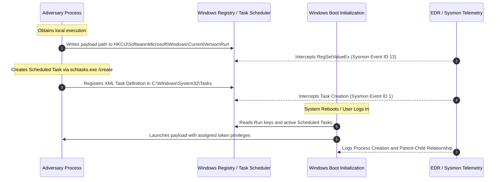

# Volume 10: Malware, Wireless, IoT & Advanced Security
# Module 14: System Security, Host Defense Engineering & Endpoint Detection (EDR)

---

## 1. Learning Objectives

By completing this module, systems defenders, endpoint engineers, and security auditors will be able to:
1. Deconstruct the internal security architectures of Microsoft Windows (NT kernel) and enterprise Linux (Linux kernel), evaluating user-mode vs. kernel-mode boundaries, security tokens, and privilege rings.
2. Trace operating system authentication subsystems, analyzing Windows Local Security Authority Subsystem Service (LSASS), Kerberos tickets, and NTLM hashes, alongside Linux Pluggable Authentication Modules (PAM) and shadow file hashing.
3. Systematically identify and audit operating system persistence mechanisms across the enterprise lifecycle: Windows Registry Run/RunOnce keys, Scheduled Tasks, Windows Services, WMI Event Subscriptions, Linux systemd units, cron jobs, and dynamic linker preloading (`LD_PRELOAD`).
4. Evaluate modern Endpoint Detection and Response (EDR) telemetry pipelines, inspecting Event Tracing for Windows (ETW), kernel mini-filter drivers, Antimalware Scan Interface (AMSI), and Linux extended Berkeley Packet Filters (eBPF).
5. Implement host-based application whitelisting and integrity controls via Windows Defender Application Control (WDAC), AppLocker, and Linux Mandatory Access Controls (SELinux/AppArmor).
6. Formulate enterprise administrative tiering architectures (Active Directory Tier 0/1/2, Privileged Access Workstations) and apply CIS Host Security Benchmarks.
7. Deploy automated host defense auditing scripts to detect unauthorized persistence artifacts and unquoted service path vulnerabilities.

---

## 2. Prerequisites

To derive the maximum technical benefit from this module, practitioners should possess:
* Thorough grounding in operating system architectures, process management, memory paging, and command-line administration (covered in [Module 01](file:///home/kali/Ethical_Hacking_VAPT_Master_Notes/Volume_01_Computer_and_Programming_Foundations/Module_01_Computer_Hardware_OS_and_Productivity.md) and [Module 05](file:///home/kali/Ethical_Hacking_VAPT_Master_Notes/Volume_02_Linux_Networking_and_Security_Foundations/Module_05_Linux_Architecture_and_Administration.md)).
* Familiarity with user/group identity concepts, file system permissions (NTFS ACLs, POSIX permissions), and cryptographic hash validation.
* Understanding of system call interfaces (`NtCreateProcess`, `ptrace`, `execve`).

---

## 3. What Is It?

System Security and Host Defense is the technical engineering discipline of configuring, monitoring, and shielding individual operating system endpoints (workstations, servers, cloud virtual machines, and domain controllers) against unauthorized access, privilege escalation, and persistent adversarial residency.

While network perimeter firewalls and web proxies filter inbound and outbound traffic, modern attacks frequently bypass network perimeters through phishing, compromised valid credentials, supply-chain dependencies, or encrypted channels. Once initial access is obtained, the individual host operating system becomes the primary operational environment. Host defense engineering ensures that every process, user token, file modification, and memory region is strictly bounded by least privilege, continuous telemetry collection, and tamper-resistant detection controls.

---

## 4. Technical Explanation: Operating System Internals & Telemetry

### 4.1 Windows Security Architecture: Tokens, SIDs, and Integrity Levels

Windows NT security operates around the **Security Reference Monitor (SRM)** located in the kernel (`ntoskrnl.exe`), which enforces access validation on every object access:

```
[ User Logon (Winlogon.exe) ] ---> [ Credential Provider ] ---> [ LSASS.exe ]
                                                                     |
                                  +----------------------------------+
                                  | Authenticates via Kerberos / NTLM
                                  v
                    [ Primary Access Token Generated ]
                    - User SID (e.g., S-1-5-21-...-1001)
                    - Group SIDs (e.g., S-1-5-32-544 Administrators)
                    - Privileges (e.g., SeDebugPrivilege, SeImpersonatePrivilege)
                    - Mandatory Integrity Control (MIC) Label
                                  |
                                  v
                    [ Process Execution (explorer.exe) ]
```

#### 4.1.1 Mandatory Integrity Control (MIC)
Windows assigns an integrity level SID to processes and securing objects:
1. **Untrusted (`S-1-16-0`)**: Anonymous sessions and AppContainer sandboxes.
2. **Low (`S-1-16-4096`)**: Sandboxed browsers, Protected Mode Office documents.
3. **Medium (`S-1-16-8192`)**: Standard interactive user processes.
4. **High (`S-1-16-12288`)**: Elevated administrative processes (UAC token split).
5. **System (`S-1-16-16384`)**: OS kernel and SYSTEM services (LSASS, Winlogon).

*No-Write-Up / No-Read-Up Rule*: A process at Medium integrity cannot obtain write access or inject code (via `VirtualAllocEx`/`WriteProcessMemory`) into a High or System integrity process, preventing privilege escalation within the same user session.

### 4.2 Linux Security Architecture: Kernel Rings, PAM, and Capabilities

Linux enforces discretionary access control (DAC) via traditional UID/GID permissions, supplemented by POSIX Capabilities and Mandatory Access Control (MAC) frameworks:

```
+-----------------------------------------------------------------------------------------------+
| User Space: Application Processes (UID 1000)                                                  |
| Pluggable Authentication Modules (PAM) Stack: /etc/pam.d/common-auth                          |
+-----------------------------------------------------------------------------------------------+
                             | System Calls (syscall / sysenter)
+-----------------------------------------------------------------------------------------------+
| Kernel Space:                                                                                 |
| - Virtual File System (VFS) DAC Checks (inode->i_uid, inode->i_gid, inode->i_mode)            |
| - POSIX Capabilities Engine (CAP_SYS_ADMIN, CAP_NET_ADMIN, CAP_SETUID)                       |
| - Linux Security Modules (LSM) Hooks: SELinux / AppArmor policy enforcement                   |
| - Extended Berkeley Packet Filter (eBPF) Probes: kprobes, uprobes, tracepoints               |
+-----------------------------------------------------------------------------------------------+
```

### 4.3 Modern EDR Telemetry Mechanics

Endpoint Detection and Response (EDR) agents rely on low-level operating system hooks to capture adversarial behavior in real time:

```
+------------------------------------------------------------------------------------------------------------+
| Operating System | Telemetry Mechanism | Architectural Hook Location | Monitored Adversarial Actions       |
+------------------+---------------------+-----------------------------+-------------------------------------+
| Windows          | Kernel Callbacks    | `PsSetCreateProcessNotify`  | Process creation, thread injection, |
|                  |                     | `ObRegisterCallbacks`       | handle opening to `lsass.exe`.      |
| Windows          | File System Filter  | File System Mini-Filter     | Ransomware mass encryption, shadow  |
|                  | Drivers (FLTMGR)    | Driver stack                | copy deletion, driver dropping.     |
| Windows          | Event Tracing for   | Kernel ETW Providers        | Memory injection, AMSI bypass,      |
|                  | Windows (ETW)       | `Microsoft-Windows-Threat-` | .NET assembly loading (C# tradecraft)|
| Linux            | eBPF Probes         | Kernel kprobes & tracepoints| `execve`, file modifications, root  |
|                  |                     | attached to `sys_enter_*`   | privilege escalation, raw sockets.  |
| Linux            | Audit Subsystem     | Linux Auditd daemon         | Configuration changes, PAM auth,    |
|                  | (auditd)            | hooked into VFS layer       | execution of setuid binaries.       |
+------------------------------------------------------------------------------------------------------------+
```

---

## 5. How It Works: Persistence Mechanics & State Machines

### 5.1 Windows Persistence State Machine: Scheduled Tasks & Registry

Adversaries establish persistence so their implants survive host reboots. A primary technique is manipulating auto-start extensibility points (ASEPs):



### 5.2 Linux Persistence: Systemd Units & Dynamic Linker Hijacking

```
[ Method 1: Systemd Service Unit ]
/etc/systemd/system/malicious.service
  ├── ExecStart=/usr/local/bin/backdoor
  ├── Restart=always
  └── WantedBy=multi-user.target
      (Executes as UID 0 at runlevel multi-user)

[ Method 2: Dynamic Linker Preloading (LD_PRELOAD) ]
/etc/ld.so.preload
  └── /lib/x86_64-linux-gnu/libhook.so
      (Intercepts libc calls such as getdents64 to hide processes and files from ps/ls)
```

---

## 6. Security Perspective: Attack Surface & Threat Vectors

### 6.1 Vulnerability & Persistence Taxonomy (MITRE ATT&CK Mapping)

```
+------------------------------------------------------------------------------------------------------------+
| Attack Technique           | MITRE ATT&CK  | Root Cause / Mechanism        | Impact & Defensive Risk       |
+----------------------------+---------------+-------------------------------+-------------------------------+
| LSASS Memory Dumping       | T1003.001     | `SeDebugPrivilege` allows     | Plaintext credentials and NTLM|
|                            |               | `MiniDumpWriteDump` on LSASS. | hashes compromised across AD. |
+----------------------------+---------------+-------------------------------+-------------------------------+
| Unquoted Service Paths     | T1574.009     | Path contains spaces without  | Privilege escalation to       |
|                            | (CWE-428)     | quotes; Windows parses space. | `NT AUTHORITY\SYSTEM`.        |
+----------------------------+---------------+-------------------------------+-------------------------------+
| Registry Run Keys / ASEP   | T1547.001     | User/Machine auto-start keys  | Persistent reboot survival    |
|                            |               | execute unverified binaries.  | within user/system context.   |
+----------------------------+---------------+-------------------------------+-------------------------------+
| WMI Event Subscriptions    | T1546.003     | `__EventFilter` linked to     | Fileless reboot persistence   |
|                            |               | `CommandLineEventConsumer`.   | executing as SYSTEM.          |
+----------------------------+---------------+-------------------------------+-------------------------------+
| SUID Binary Abuse          | T1548.001     | Misconfigured binary with     | Local privilege escalation    |
| (Linux GTFOBins)           |               | SUID bit owned by root.       | to UID 0 without password.    |
+----------------------------+---------------+-------------------------------+-------------------------------+
| DLL Sideloading / Hijack   | T1574.002     | Insecure DLL search order     | Execution of arbitrary code in|
|                            | (CWE-427)     | loads attacker DLL from CWD.  | trusted application process.  |
+------------------------------------------------------------------------------------------------------------+
```

---

## 7. Auditing Methodology: The Host Security Assessment Workflow

```
[Phase 1: Privilege & Identity Enumeration]
      | Inspect whoami /priv, UAC level, sudo -l, POSIX capabilities (getpcaps)
      v
[Phase 2: Service & Executable Integrity Audit]
      | Audit unquoted service paths, writable service binaries, and setuid files
      v
[Phase 3: Persistence Mechanism Inspection]
      | Enumerate Registry Run keys, Scheduled Tasks, WMI consumers, cron, systemd
      v
[Phase 4: Memory & Authentication Defense Review]
      | Verify LSASS RunAsPPL, Credential Guard, PAM configurations, and password policies
      v
[Phase 5: Telemetry & EDR Efficacy Validation]
      | Verify Sysmon/auditd operational status, ETW provider health, and log forwarding
      v
[Phase 6: Reporting & CIS Benchmark Alignment]
      | Generate remediation scripts, AppLocker/WDAC XML rules, and CIS hardening checklist
```

---

## 8. Tooling Deep-Dive: Sysinternals, Osquery, and Auditd

### 8.1 Windows Host Auditing with Sysinternals & PowerShell
```powershell
# 1. Inspect Active Privileges for Current Token
whoami /priv

# 2. Audit Unquoted Service Paths Vulnerable to Execution Hijacking (CWE-428)
Get-CimInstance -ClassName Win32_Service | 
    Where-Object {$_.PathName -notmatch '^"' -and $_.PathName -match ' ' -and $_.StartMode -ne 'Disabled'} | 
    Select-Object Name, PathName, StartMode, StartName

# 3. Enumerate User and System Auto-Start Registry Keys
Get-ItemProperty -Path "HKLM:\Software\Microsoft\Windows\CurrentVersion\Run"
Get-ItemProperty -Path "HKCU:\Software\Microsoft\Windows\CurrentVersion\Run"

# 4. Enumerate WMI Persistence Consumers
Get-CimInstance -Namespace root\subscription -ClassName CommandLineEventConsumer
```

### 8.2 Linux Host Auditing with Osquery & Auditd
```bash
# 1. Query all listening network ports and associated process binary paths via osquery
osqueryi "SELECT p.name, p.path, l.port, l.address FROM listening_ports l JOIN processes p ON l.pid = p.pid;"

# 2. Query all scheduled cron jobs across the entire filesystem
osqueryi "SELECT command, path FROM crontab;"

# 3. Audit SUID binaries owned by root
find / -perm -4000 -user root -type f 2>/dev/null

# 4. View active Linux auditd rules monitoring execution of setuid binaries
sudo auditctl -l
```

---

## 9. Practical Lab: Standalone Python Host Defense Auditor

This standalone diagnostic tool audits local system persistence points, evaluates unquoted service paths, checks executable digital integrity, and simulates EDR persistence detection.

See executable script: [`labs/module_14/host_defense_auditor.py`](file:///home/kali/Ethical_Hacking_VAPT_Master_Notes/labs/module_14/host_defense_auditor.py).

```python
#!/usr/bin/env python3
"""
Host Security & Persistence Defense Auditor
Detects unquoted service paths (CWE-428), inspects cron/registry artifacts,
and verifies binary hashing integrity.
"""
import os
import re
import hashlib
from typing import List, Dict

def audit_service_path_vulnerability(path_string: str) -> Dict[str, any]:
    """
    Evaluates a service path string for CWE-428 (Unquoted Service Path).
    If a path contains spaces, does not start and end with quotes, and contains subpaths,
    Windows will attempt to execute intermediary executables.
    """
    trimmed = path_string.strip()
    is_quoted = trimmed.startswith('"') and ('"' in trimmed[1:])
    has_spaces = ' ' in trimmed
    
    # Extract executable portion
    match = re.search(r'^(.*?\.exe)', trimmed, re.IGNORECASE)
    binary_path = match.group(1) if match else trimmed
    
    is_vulnerable = has_spaces and not is_quoted and (not binary_path.startswith('"'))
    
    candidates = []
    if is_vulnerable:
        parts = binary_path.split(' ')
        for i in range(1, len(parts)):
            candidates.append(' '.join(parts[:i]) + '.exe')
            
    return {
        "Raw_Path": path_string,
        "Is_Quoted": is_quoted,
        "Has_Spaces": has_spaces,
        "Is_Vulnerable_CWE_428": is_vulnerable,
        "Hijack_Candidates": candidates,
        "Risk_Level": "HIGH" if is_vulnerable else "LOW"
    }

def calculate_sha256(filepath: str) -> str:
    """Calculates SHA-256 hash of a file for integrity verification."""
    if not os.path.exists(filepath):
        return "FILE_NOT_FOUND"
    h = hashlib.sha256()
    with open(filepath, 'rb') as f:
        while chunk := f.read(8192):
            h.update(chunk)
    return h.hexdigest()
```

---

## 10. Evidence & Verification: Deterministic Artifact Analysis

When investigating suspected host compromise, auditors must establish deterministic evidence:

```
+------------------------------------------------------------------------------------------------------------+
| Investigation Target       | Verification Evidence Required              | Anti-Tamper Countermeasure      |
+----------------------------+---------------------------------------------+---------------------------------+
| Unauthorized Windows Svc   | Service DLL path, StartType, and parent     | Verify Authenticode digital     |
|                            | Service Control Manager event (Event 7045). | signature against Microsoft CA. |
+----------------------------+---------------------------------------------+---------------------------------+
| Linux Cron Injection       | File mtime/ctime in `/etc/cron*`, user      | Inspect auditd records for      |
|                            | crontab spool (`/var/spool/cron/crontabs`). | `crontab` binary execution.     |
+----------------------------+---------------------------------------------+---------------------------------+
| Hidden Process Injection   | Memory region marked `PAGE_EXECUTE_`        | Cross-reference OS process list |
| (Process Hollowing)        | `READWRITE` lacking disk backing (VAD).     | against ETW process callbacks.  |
+----------------------------+---------------------------------------------+---------------------------------+
```

---

## 11. Telemetry & Defensive Detection: Sysmon & Auditd Engineering

### 11.1 Microsoft Sysmon High-Fidelity Detection Configuration (`sysmon.xml`)
```xml
<Sysmon schemaversion="4.90">
  <EventFiltering>
    <!-- Event 1: Process Creation - Detect Suspicious Persistence & Recon Execution -->
    <RuleGroup name="ProcessCreation" groupRelation="or">
      <ProcessCreate onmatch="include">
        <Image condition="image">schtasks.exe</Image>
        <Image condition="image">sc.exe</Image>
        <Image condition="image">reg.exe</Image>
        <CommandLine condition="contains">/create</CommandLine>
        <CommandLine condition="contains">CurrentVersion\Run</CommandLine>
      </ProcessCreate>
    </RuleGroup>

    <!-- Event 10: ProcessAccess - Detect LSASS Memory Dumping -->
    <RuleGroup name="LsassAccess" groupRelation="or">
      <ProcessAccess onmatch="include">
        <TargetImage condition="is">C:\Windows\system32\lsass.exe</TargetImage>
        <!-- GrantedAccess: 0x1010 (PROCESS_VM_READ | PROCESS_QUERY_LIMITED_INFORMATION) -->
        <GrantedAccess condition="contains">0x10</GrantedAccess>
      </ProcessAccess>
    </RuleGroup>

    <!-- Event 13: RegistryEvent - Detect Persistence Additions in Run Keys -->
    <RuleGroup name="RegistryPersistence" groupRelation="or">
      <RegistryEvent onmatch="include">
        <TargetObject condition="contains">\CurrentVersion\Run</TargetObject>
        <TargetObject condition="contains">\CurrentVersion\RunOnce</TargetObject>
        <TargetObject condition="contains">\Services\</TargetObject>
      </RegistryEvent>
    </RuleGroup>
  </EventFiltering>
</Sysmon>
```

### 11.2 Linux Auditd Security Rules (`/etc/audit/rules.d/host-defense.rules`)
```bash
# Monitor execution of privilege-modifying system calls
-a always,exit -F arch=b64 -S setuid -S setgid -S setreuid -S setregid -k priv_escalation

# Monitor changes to critical persistence directories
-w /etc/cron.d/ -p wa -k cron_tamper
-w /etc/crontab -p wa -k cron_tamper
-w /etc/systemd/system/ -p wa -k systemd_tamper
-w /etc/ld.so.preload -p wa -k rootkit_preload

# Monitor read/write access to sensitive identity files
-w /etc/shadow -p rwa -k shadow_access
-w /etc/passwd -p wa -k passwd_tamper
-w /etc/sudoers -p wa -k sudoers_tamper
```

---

## 12. Mitigation & Secure Implementation

### 12.1 Windows LSA Protection & Credential Guard
To prevent credential dumping from `lsass.exe` by tools like Mimikatz, configure **RunAsPPL (Protected Process Light)**:

```powershell
# Enforce LSA Protection via Registry (RunAsPPL = 1)
Set-ItemProperty -Path "HKLM:\SYSTEM\CurrentControlSet\Control\Lsa" -Name "RunAsPPL" -Value 1 -Type DWord

# Enable Credential Guard via Group Policy or Registry (Isolates credentials in Virtualization-based Security)
Set-ItemProperty -Path "HKLM:\SYSTEM\CurrentControlSet\Control\DeviceGuard" -Name "EnableVirtualizationBasedSecurity" -Value 1 -Type DWord
Set-ItemProperty -Path "HKLM:\SYSTEM\CurrentControlSet\Control\Lsa" -Name "LsaCfgFlags" -Value 1 -Type DWord
```

### 12.2 Linux Dynamic Linker & PAM Hardening
```bash
# 1. Restrict permissions on dynamic linker configuration to prevent library preloading
sudo chown root:root /etc/ld.so.preload 2>/dev/null || true
sudo chmod 644 /etc/ld.so.preload 2>/dev/null || true

# 2. Enforce strict password hashing algorithm in Linux PAM (Use SHA-512 with high rounds or yescrypt)
# Edit /etc/pam.d/common-password:
password [success=1 default=ignore] pam_unix.so obscure sha512 rounds=65536 shadow
```

---

## 13. System Hardening Checklist

| Control ID | Platform | Hardening Requirement | Benchmark Standard |
|---|---|---|---|
| **HOST-01** | Windows | Enable LSA Protection (`RunAsPPL = 1`) and Credential Guard. | CIS Windows Server 10.2.1 |
| **HOST-02** | Windows | Enforce Windows Defender Application Control (WDAC) in Enforce mode. | NIST SP 800-53 CM-7 |
| **HOST-03** | Windows | Quote all service binary paths with embedded spaces (CWE-428 fix). | CIS Windows Server 9.3.1 |
| **HOST-04** | Linux | Enforce SELinux in `Enforcing` mode or AppArmor in `enforce`. | CIS Linux Benchmark 1.6.1 |
| **HOST-05** | Linux | Disable unprivileged user namespaces (`sysctl kernel.unprivileged_userns_clone=0`). | CIS Linux Benchmark 1.5.3 |
| **HOST-06** | Cross-Platform | Forward all host security telemetry (Sysmon/Auditd) to immutable SIEM. | PCI-DSS v4.0 Req 10.2 |

---

## 14. Documented Case Studies

### 14.1 Case Study 1: The SolarWinds SUNBURST Backdoor Persistence Architecture
* **Background**: In 2020, state-sponsored actors compromised SolarWinds Orion software builds, distributing a backdoor to thousands of enterprises.
* **Mechanism**: SUNBURST established persistence by operating directly within a legitimate Windows service process (`SolarWinds.BusinessLayerHost.exe`). It monitored the host process list for over 40 security processes and diagnostic tools. If analysis tools were absent, it delayed execution for 14 days before establishing C2 communication via DGA (Domain Generation Algorithm) DNS requests.
* **Defensive Failure**: Host defenses trusted the process because it was signed with a legitimate SolarWinds digital certificate, bypassing standard signature-based antivirus.
* **Remediation**: Modern host defense mandates behavioral anomaly monitoring and network outbound baselining regardless of binary signature trust.

### 14.2 Case Study 2: NotPetya Credential Harvesting Pipeline (2017)
* **Background**: The NotPetya wiper spread globally by harvesting host credentials and rapidly propagating across enterprise Active Directory environments.
* **Mechanism**: Once inside a host, NotPetya deployed an embedded memory-scraping module based on Mimikatz to extract plaintext passwords and NTLM hashes from `lsass.exe`. It subsequently used extracted admin tokens to execute payloads on adjacent network hosts via PsExec and WMI.
* **Defensive Failure**: Hosts lacked LSA Protection (`RunAsPPL`), Credential Guard, and administrative network segmentation.
* **Remediation**: Implementing LSA Protection and restricting local administrator password reuse (via Microsoft LAPS) prevents lateral credential reuse.

---

## 15. Common Mistakes & Anti-Patterns

```
+------------------------------------------------------------------------------------------------------------+
| Anti-Pattern Architecture              | Defensive Assumption               | Technical Reality & Bypass   |
+------------------------------------------------------------------------------------------------------------+
| Relying exclusively on Antivirus       | "Antivirus will catch all running  | Obfuscated memory payloads   |
| signature scanning                     | malicious executables."            | execute in memory without disk|
|                                        |                                    | footprints (fileless / AMSI).|
+------------------------------------------------------------------------------------------------------------+
| Unquoted Windows Service Paths         | "Paths without quotes execute the  | Spaces cause Windows to probe|
| with spaces in folder names            | intended binary anyway."           | `Program.exe` prior to target|
|                                        |                                    | resulting in SYSTEM privesc. |
+------------------------------------------------------------------------------------------------------------+
| Shared Local Administrator Passwords   | "Local admins can only manage one  | Extracting local admin hash  |
| across all fleet endpoints             | individual machine."               | allows Pass-the-Hash across  |
|                                        |                                    | all workstations (use LAPS). |
+------------------------------------------------------------------------------------------------------------+
| Disabling SELinux/AppArmor             | "Disabling MAC eliminates app      | Compromised web application  |
| during initial deployment              | permission conflicts safely."      | escapes web root and accesses|
|                                        |                                    | full operating system.       |
+------------------------------------------------------------------------------------------------------------+
```

---

## 16. Professional vs. Naive Methodology

```
+------------------------------------------------------------------------------------------------------------+
| Dimension                | Naive / Junior Administrator Approach   | Senior Host Defense Engineer Approach |
+--------------------------+-----------------------------------------+---------------------------------------+
| Credential Protection    | Relies on standard Windows logon.       | Deploys Credential Guard, RunAsPPL,   |
|                          | Leaves `lsass.exe` accessible.          | and Microsoft LAPS fleet-wide.        |
+--------------------------+-----------------------------------------+---------------------------------------+
| Persistence Management   | Inspects `msconfig` or desktop startup  | Audits Registry ASEPs, WMI event      |
|                          | folders only.                           | subscriptions, and systemd units.     |
+--------------------------+-----------------------------------------+---------------------------------------+
| Logging & Detection      | Relies on default 20MB Windows Event Log| Configures Sysmon with high-fidelity  |
|                          | without process tracking.               | XML rules and forwards to cloud SIEM. |
+--------------------------+-----------------------------------------+---------------------------------------+
| Application Execution    | Allows all non-admin users to execute   | Enforces WDAC / AppLocker application |
|                          | binaries from `C:\Users\*\AppData`.     | whitelisting with publisher cert rules|
+------------------------------------------------------------------------------------------------------------+
```

---

## 17. Knowledge Check & Interview Questions

### Question 1 (Intermediate)
*Explain the mechanics of an Unquoted Service Path vulnerability (CWE-428) in Microsoft Windows, detailing why it allows privilege escalation.*
> **Answer**: When the Windows Service Control Manager (SCM) executes a service binary whose image path contains spaces and is not enclosed in quotation marks (e.g., `C:\Program Files\Vendor App\service.exe`), the Windows path parsing algorithm interprets spaces as argument delimiters. Windows sequentially attempts to execute: (1) `C:\Program.exe`, (2) `C:\Program Files\Vendor.exe`, and finally (3) `C:\Program Files\Vendor App\service.exe`. If an unprivileged user possesses write permissions to `C:\` or `C:\Program Files\`, they can plant an executable named `Program.exe`. Upon system reboot or service restart, the SCM executes `Program.exe` with the security context of the service account (commonly `NT AUTHORITY\SYSTEM`), resulting in full privilege escalation.

### Question 2 (Advanced)
*How does Windows Protected Process Light (RunAsPPL) protect `lsass.exe` from credential dumping, and what is the bypass attack surface?*
> **Answer**: RunAsPPL enforces cryptographic signature and privilege verification at the kernel level before granting handles to a process. When `lsass.exe` runs as PPL (`RunAsPPL=1`), the Windows kernel (`ntoskrnl.exe`) restricts `OpenProcess` calls: even an elevated administrator running with `SeDebugPrivilege` cannot obtain handles with `PROCESS_VM_READ` or `PROCESS_DUP_HANDLE` permissions. Consequently, standard API calls like `MiniDumpWriteDump` fail with `STATUS_ACCESS_DENIED`. The primary attack surface against PPL involves loading a vulnerable, legitimately signed third-party kernel driver (Bring Your Own Vulnerable Driver - BYOVD). Once in Ring 0 (kernel space), an attacker can locate the `EPROCESS` structure of `lsass.exe` and zero out the `PS_PROTECTION` byte flags, stripping the PPL status dynamically.

---

## 18. Progressive Practice Exercises

1. **Exercise 1 (Beginner - Path Audit)**: Execute [`host_defense_auditor.py`](file:///home/kali/Ethical_Hacking_VAPT_Master_Notes/labs/module_14/host_defense_auditor.py) on a test system. Identify all unquoted service path candidates and compute SHA-256 hashes of system binaries.
2. **Exercise 2 (Intermediate - Persistence Detection)**: On a Linux virtual machine, author a benign testing systemd unit in `/etc/systemd/system/audit-test.service`. Use `auditd` to capture the file creation event and verify the audit rule trigger.
3. **Exercise 3 (Advanced - Sysmon Rule Engineering)**: Write a custom Sysmon XML rule to detect unauthorized execution of `reg.exe` or `powershell.exe` modifying keys within `HKCU\Software\Microsoft\Windows\CurrentVersion\Run`.

---

## 19. Key Takeaways

* Host endpoints are the ultimate trust boundary; perimeter defenses cannot prevent internal credential movement.
* Windows access tokens dictate privilege; LSASS memory protection (RunAsPPL, Credential Guard) is mandatory to halt credential harvesting.
* Persistence mechanisms exploit standard system configuration points (Registry ASEPs, Tasks, Services, systemd, cron).
* High-fidelity host telemetry (Sysmon, ETW, auditd, eBPF) provides the deterministic visibility required for rapid containment.
* Application whitelisting (WDAC, AppLocker) and Mandatory Access Control (SELinux) neutralize unauthorized binary execution.

---

## 20. Authoritative References

* **Microsoft Learn**: *Windows Security Architecture & Mandatory Integrity Control*.
* **NIST Special Publication 800-179 Rev 1**: *Guide to Securing Apple macOS and Microsoft Windows Workstations*.
* **CIS Security Benchmarks**: *CIS Microsoft Windows Server Benchmark* and *CIS Ubuntu Linux Benchmark*.
* **MITRE ATT&CK Framework**: *Matrix for Enterprise: Persistence (TA0003) & Privilege Escalation (TA0004)*.
* **Linux Foundation**: *Linux Security Modules (LSM) & eBPF Security Architecture*.
