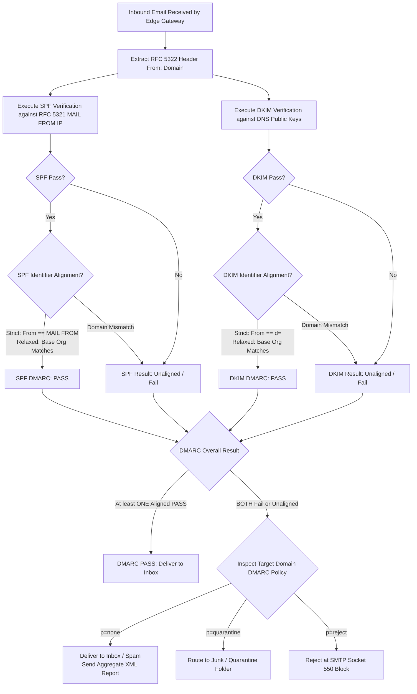

# Volume 10: Malware, Wireless, IoT & Advanced Security
# Module 15: Phishing Architecture, Credential Harvesting Infrastructure & Email Security Engineering

---

## 1. Learning Objectives

By completing this module, security engineers, red team operators, and threat detection specialists will be able to:
1. Deconstruct modern **Adversary-in-the-Middle (AiTM)** phishing architectures (Evilginx, Modlishka), evaluating how reverse proxies proxy live TLS sessions to bypass traditional Multi-Factor Authentication (MFA) and harvest session tokens.
2. Evaluate domain deception mechanisms, contrasting Internationalized Domain Name (IDN) homoglyph punycode conversions (RFC 3492), typosquatting algorithms (Levenshtein distance), and brand impersonation.
3. Trace the cryptographic mechanics and recursive lookup constraints of **Sender Policy Framework (SPF - RFC 7208)**, calculating the 10-DNS-lookup limit and identifying PermError triggers.
4. Dissect **DomainKeys Identified Mail (DKIM - RFC 6376)** header construction, comparing `relaxed` vs. `simple` canonicalization, body hashing (`bh=`), and RSA-2048 / Ed25519 digital signature validation.
5. Architect and enforce **Domain-based Message Authentication, Reporting, and Conformance (DMARC - RFC 7489)** policies, analyzing strict vs. relaxed alignment (`adkim=s`, `aspf=s`) and operational transitions to `p=reject`.
6. Inspect **Authenticated Received Chain (ARC - RFC 8617)** headers to verify message authentication preservation across intermediaries and mailing lists.
7. Deploy automated Python verification engines to parse SPF lookup trees, evaluate DMARC alignment, and detect AiTM reverse proxy session manipulation.

---

## 2. Prerequisites

To derive the maximum technical benefit from this module, practitioners should possess:
* Solid comprehension of DNS record types (TXT, MX, A, CNAME) and DNS resolver mechanics (covered in [Module 06](file:///home/kali/Ethical_Hacking_VAPT_Master_Notes/Volume_03_Reconnaissance_OSINT_and_Enumeration/Module_06_Information_Gathering_and_Footprinting.md)).
* Familiarity with HTTP/1.1 and HTTP/2 headers, TLS termination, session cookies, and authentication tokens (covered in [Module 21](file:///home/kali/Ethical_Hacking_VAPT_Master_Notes/Volume_05_Web_Security_Foundations/Module_21_Web_Security_Foundations.md)).
* Understanding of asymmetric cryptography and digital signatures (covered in [Module 24](file:///home/kali/Ethical_Hacking_VAPT_Master_Notes/Volume_02_Linux_Networking_and_Security_Foundations/Module_24_Applied_Cryptography_and_PKI.md)).

---

## 3. What Is It?

Phishing Architecture and Email Security Engineering encompasses both the offensive tradecraft of user deception / credential harvesting and the defensive architecture of cryptographic sender verification and gateway filtering.

Electronic mail remains the primary initial access vector across global cyber intrusions (MITRE ATT&CK Initial Access TA0001). Because the core Simple Mail Transfer Protocol (SMTP - RFC 821/5321) lacks native identity verification, any sending host can populate arbitrary values into the envelope sender (`MAIL FROM:`) and human-readable header (`From:`). 

Simultaneously, modern phishing tradecraft has evolved beyond static credential-harvesting web forms. Advanced adversaries deploy dynamic Adversary-in-the-Middle (AiTM) reverse proxies that transparently relay communication between the victim and legitimate identity providers (e.g., Microsoft Entra ID, Okta), intercepting authenticated session tokens and completely bypassing traditional SMS, email, and TOTP multi-factor authentication. Defending against these threats requires combining cryptographic email authentication (SPF, DKIM, DMARC, ARC) with FIDO2/WebAuthn phishing-resistant hardware credentials.

---

## 4. Technical Explanation: Phishing Infrastructure & Cryptographic Verification

### 4.1 Adversary-in-the-Middle (AiTM) Reverse Proxy Architecture

Unlike legacy phishing that duplicates static HTML login forms, AiTM reverse proxies (e.g., Evilginx) act as dynamic proxy gateways between the victim's browser and the legitimate enterprise authentication server:

```
[ Victim Browser ] <====== TLS ======> [ AiTM Phishing Proxy ] <====== TLS ======> [ Real Identity Provider ]
 (Victim enters                         (Evilginx Server)                          (login.microsoftonline.com)
  user + password)                      - Terminates TLS with valid Let's Encrypt  - Validates password
                                        - Proxies HTTP requests in real-time       - Prompts for MFA
                                        - Rewrites domains in responses            - Generates Session Cookies:
                                        - Intercepts Set-Cookie headers              ESTSAUTH, ESTSAUTHPERSISTENT
```

```
+---------------------------------------------------------------------------------------------------------------+
| Component             | Architectural Role & Mechanics                                                        |
+-----------------------+---------------------------------------------------------------------------------------+
| Phishlet Definition   | YAML configuration defining target subdomains, request/response header replacement    |
|                       | rules, credentials regex filters, and session cookie capture triggers.               |
+-----------------------+---------------------------------------------------------------------------------------+
| Subdomain Mapping     | Proxy dynamically handles subdomains (e.g., `login.evilcorp.com` -> `login.idp.com`).|
|                       | Requests wildcard TLS certificates via Let's Encrypt ACME challenges.                |
+-----------------------+---------------------------------------------------------------------------------------+
| Session Token Capture | Once victim completes MFA on the real IdP, the IdP issues `Set-Cookie` tokens.        |
|                       | AiTM proxy extracts these tokens from memory, saving them for immediate replay.       |
+-----------------------+---------------------------------------------------------------------------------------+
```

*Why FIDO2 / WebAuthn Neutralizes AiTM*: FIDO2 binds the client authentication challenge cryptographically to the browser's origin (`origin` header). Because the victim connects to `login.evilcorp.com`, the hardware key signs a challenge containing the phishing domain. The real identity provider (`login.microsoftonline.com`) rejects the assertion due to origin mismatch, completely preventing authentication bypass.

### 4.2 The Cryptographic Email Authentication Triad

```
+---------------------------------------------------------------------------------------------------------------+
| Protocol      | RFC Spec | What It Authenticates           | Storage Location | Primary Failure Mode          |
+---------------+----------+---------------------------------+------------------+-------------------------------+
| SPF           | RFC 7208 | Connecting MTA IP against       | DNS TXT at apex  | Breaks on email forwarding.   |
|               |          | envelope MAIL FROM (RFC 5321).  | (e.g. corp.com)  | Does not check visible From:. |
+---------------+----------+---------------------------------+------------------+-------------------------------+
| DKIM          | RFC 6376 | Cryptographic signature over    | DNS TXT at       | Survives forwarding, but lacks|
|               |          | headers and body content.       | <selector>._domainkey policy for missing signatures.  |
+---------------+----------+---------------------------------+------------------+-------------------------------+
| DMARC         | RFC 7489 | Enforces identifier alignment   | DNS TXT at       | Ineffective if set to         |
|               |          | between visible From: and auth. | _dmarc.corp.com  | `p=none` (monitoring only).   |
+---------------+----------+---------------------------------+------------------+-------------------------------+
| ARC           | RFC 8617 | Preserves authentication status | Appended headers | Intermediary signature must   |
|               |          | across mailing lists/relays.    | in message MIME  | be explicitly trusted by recvr|
+---------------------------------------------------------------------------------------------------------------+
```

#### 4.2.1 The SPF 10-DNS-Lookup Limit (RFC 7208 §4.6.4)
To prevent recursive DNS amplification attacks against receiving mail servers, RFC 7208 strictly limits the number of DNS-querying mechanisms (`include`, `a`, `mx`, `ptr`, `exists`, `redirect`) to **at most 10**:

$$\text{Total Lookups} = \sum (\text{include} + \text{a} + \text{mx} + \text{ptr} + \text{exists} + \text{redirect}) \le 10$$

If evaluating an SPF record triggers an 11th DNS query, the receiving MTA immediately aborts evaluation and returns an **SPF PermError**, which can cause legitimate mail to be quarantined or rejected.

#### 4.2.2 DKIM Signature Verification Math (RFC 6376)
DKIM headers contain two distinct cryptographic components:
1. **Body Hash (`bh=`)**: Base64-encoded hash of the canonicalized email body:
   $$\text{bh} = \text{Base64}(\text{SHA-256}(\text{Canonicalize}(\text{Body})))$$
2. **Signature Data (`b=`)**: Asymmetric digital signature calculated over the concatenated header fields listed in `h=`, including the `DKIM-Signature` header itself (with `b=` empty):
   $$b = \text{Sign}_{\text{PrivKey}}(\text{SHA-256}(\text{Canonicalize}(\text{Headers})))$$

---

## 5. How It Works: Inbound DMARC Policy Evaluation & Alignment

### 5.1 The DMARC Inbound Evaluation State Machine



---

## 6. Security Perspective: Threat Vectors & Attack Surface

### 6.1 Vulnerability & Exploitation Matrix

```
+------------------------------------------------------------------------------------------------------------+
| Attack Technique           | Target Component      | Root Cause Mechanism          | Impact & CVSS Score   |
+----------------------------+-----------------------+-------------------------------+-----------------------+
| Reverse Proxy Session Steal| User Session Identity | AiTM proxies live TLS session;| Bypasses SMS/TOTP MFA;|
| (Evilginx AiTM)            | & Authentication      | steals session cookies.       | Full ATO: CVSS 8.8    |
+----------------------------+-----------------------+-------------------------------+-----------------------+
| IDN Homoglyph Spoofing     | Human Visual Trust /  | Cyrillic/Greek characters     | Credential harvest via|
| (RFC 3492 Punycode)        | Browser Display       | rendered visually identical.  | deceptive link:CVSS7.4|
+----------------------------+-----------------------+-------------------------------+-----------------------+
| Envelope vs Header Spoofing| Email Gateway / MUA   | SPF validates MAIL FROM only; | Display name & header |
| (Lack of DMARC)            | Display Logic         | visible From: is forged.      | impersonation: CVSS7.5|
+----------------------------+-----------------------+-------------------------------+-----------------------+
| DMARC Monitoring Inaction  | Enterprise Email Posture| Organization sets `p=none`   | Attackers spoof domain|
| (`p=none` Misconfig)       | Policy Enforcement    | without enforcing rejection.  | without blocks:CVSS7.5|
+----------------------------+-----------------------+-------------------------------+-----------------------+
| SPF PermError Exploitation | SPF DNS Lookup Tree   | SPF record exceeds 10 DNS     | Legitimate mail drops |
| (CWE-400 / Resource Limit) | (§4.6.4 RFC 7208)     | queries; triggers PermError.  | or bypass: CVSS 5.3   |
+------------------------------------------------------------------------------------------------------------+
```

---

## 7. Auditing Methodology: Email Security & Phishing Assessment Workflow

```
[Phase 1: DNS Record Harvesting & OSINT]
      | Query TXT records for apex domain, _dmarc.domain, and known DKIM selectors
      v
[Phase 2: SPF Recursion Tree & PermError Analysis]
      | Trace nested include: directives; calculate exact lookup count against the 10-limit
      v
[Phase 3: DMARC Policy & Alignment Rigor Audit]
      | Verify policy tag (p=none vs p=quarantine vs p=reject), check sp=, aspf=, adkim=
      v
[Phase 4: Homoglyph & Lookalike Infrastructure Recon]
      | Run dnstwist/punycode algorithms to detect registered lookalike phishing domains
      v
[Phase 5: Gateway Anti-Spoofing & Filter Verification]
      | Transmit benign diagnostic probe using swaks to verify gateway DMARC socket rejection
      v
[Phase 6: Reporting & Remediation Architecture]
      | Deliver SPF flattening blueprint, DMARC p=reject transition schedule, FIDO2 roadmap
```

---

## 8. Tooling Deep-Dive: Diagnostic Utilities & Testing Commands

### 8.1 DNS Harvesting & Querying
```bash
# 1. Query apex SPF TXT record
dig TXT corporate.corp +short

# 2. Query DMARC policy record
dig TXT _dmarc.corporate.corp +short

# 3. Query DKIM public key for specific selector (e.g., 'google' or 'k1')
dig TXT google._domainkey.corporate.corp +short

# 4. Enumerate lookalike / punycode domains using dnstwist
dnstwist --registered corporate.corp
```

### 8.2 Safe Diagnostic Probing with `swaks` (Swiss Army Knife for SMTP)
```bash
# Test inbound gateway DMARC rejection handling (Benign testing to authorized test mailbox)
swaks --to security-test@corporate.corp \
      --from spoof-probe@corporate.corp \
      --server mail.corporate.corp \
      --header "Subject: SEC-TEST: DMARC Rejection Enforcement Verification" \
      --body "This is a benign diagnostic probe verifying DMARC socket-level enforcement."
```

---

## 9. Practical Lab: Standalone Python Phishing & Email Auth Engine

This standalone tool recursively audits SPF lookup trees (validating the 10-lookup limit), checks DMARC alignment and policy posture, and inspects HTTP headers for AiTM reverse-proxy footprints.

See executable script: [`labs/module_15/phishing_analysis_engine.py`](file:///home/kali/Ethical_Hacking_VAPT_Master_Notes/labs/module_15/phishing_analysis_engine.py).

```python
#!/usr/bin/env python3
"""
Phishing Architecture & Email Security Analysis Engine
Audits SPF lookup trees, evaluates DMARC alignment, and detects AiTM proxy indicators.
"""
import re
from typing import Dict, List, Tuple

def evaluate_dmarc_record(record_str: str) -> Dict[str, any]:
    """Parses a DMARC TXT record and evaluates enforcement posture."""
    tags = {}
    for part in record_str.split(';'):
        part = part.strip()
        if '=' in part:
            k, v = part.split('=', 1)
            tags[k.strip().lower()] = v.strip().lower()
            
    policy = tags.get('p', 'none')
    subdomain_policy = tags.get('sp', policy)
    aspf = tags.get('aspf', 'r')  # r = relaxed, s = strict
    adkim = tags.get('adkim', 'r')
    
    is_hardened = (policy == 'reject') and (subdomain_policy == 'reject')
    
    return {
        "Raw_Record": record_str,
        "Policy": policy,
        "Subdomain_Policy": subdomain_policy,
        "SPF_Alignment": "STRICT" if aspf == 's' else "RELAXED",
        "DKIM_Alignment": "STRICT" if adkim == 's' else "RELAXED",
        "Is_Hardened_Reject": is_hardened,
        "Risk_Level": "LOW" if is_hardened else ("MEDIUM" if policy == 'quarantine' else "CRITICAL")
    }

def count_spf_lookups(mechanisms: List[str]) -> Tuple[int, bool]:
    """Calculates the total DNS lookup count under RFC 7208 §4.6.4 (Max 10)."""
    dns_mechanisms = ('include', 'a', 'mx', 'ptr', 'exists', 'redirect')
    count = sum(1 for m in mechanisms if m.split(':')[0].lower() in dns_mechanisms)
    is_permerror = count > 10
    return count, is_permerror
```

---

## 10. Evidence & Verification: Distinguishing False Positives

```
+------------------------------------------------------------------------------------------------------------+
| Verification Scenario      | Observed Evidence                           | Deterministic Confirmation       |
+----------------------------+---------------------------------------------+----------------------------------+
| DMARC "Protected" Claim    | Domain publishes DMARC TXT record.          | Inspect `p=` tag. If `p=none`, the|
|                            |                                             | domain is UNPROTECTED (Monitor). |
+----------------------------+---------------------------------------------+----------------------------------+
| SPF Broken Delivery        | Receiving MTA returns 550 / PermError.      | Audit nested `include:` depth.   |
|                            |                                             | Lookup count exceeds 10 RFC limit|
+----------------------------+---------------------------------------------+----------------------------------+
| Suspected AiTM Proxy       | TLS cert is valid; MFA prompt appears       | Check HTTP response headers for  |
|                            | authentic to end-user.                      | stripped CSP, rewritten cookies, |
|                            |                                             | or reverse proxy header offsets. |
+------------------------------------------------------------------------------------------------------------+
```

---

## 11. Telemetry & Defensive Detection: SEG & SIEM Engineering

### 11.1 YARA-L Rule: Detection of Inbound Phishing with DMARC Alignment Failure
```yaml
rule seg_inbound_dmarc_fail_spoof {
  meta:
    description = "Detects inbound email attempting executive impersonation failing DMARC alignment"
    author = "Enterprise Security Engineering"
    severity = "HIGH"

  events:
    $email.metadata.event_type = "EMAIL_TRANSACTION"
    $email.network.direction = "INBOUND"
    // Visible From header claims internal corporate identity
    re.regex($email.target.user.email, `(?i)@corporate\.corp$`)
    // Mail gateway reports DMARC failure
    $email.security_result.dmarc_result = "FAIL"

  condition:
    $email
}
```

### 11.2 Sysmon & Browser Telemetry for AiTM Defense
* Monitor network connections from browser processes (`chrome.exe`, `msedge.exe`) to newly registered domains (<30 days old).
* Enforce Conditional Access Policies: Require Compliant Device (Intune MDM) or Hybrid Azure AD Join, blocking non-enrolled external machines even if session tokens are replayed.

---

## 12. Mitigation & Secure Implementation

### 12.1 Deploying a Fully Hardened Apex DMARC Record
```dns
# /var/named/zones/db.corporate.corp - Master Hardened DMARC Record
_dmarc.corporate.corp.  IN  TXT  "v=DMARC1; p=reject; sp=reject; pct=100; adkim=s; aspf=s; rua=mailto:dmarc-rua@corporate.corp; ruf=mailto:dmarc-ruf@corporate.corp;"
```

### 12.2 Phishing-Resistant MFA Architecture (FIDO2 / WebAuthn)
To permanently neutralize AiTM reverse proxies, organizations must transition authentication from legacy MFA to FIDO2 / WebAuthn:

```
[ Phishing Vulnerable ]                  [ Phishing Resistant ]
- SMS Verification Codes                  - FIDO2 / WebAuthn Hardware Security Keys (YubiKey)
- Voice Call OTPs                         - Windows Hello for Business (TPM Bound)
- Push Notifications (Number Matching)    - Apple Passkeys (FIDO Alliance Standard)
- Authenticator TOTP Codes (6-Digit)      (Cryptographically binds session to origin URL)
```

---

## 13. System Hardening Checklist

| Control ID | Domain | Hardening Requirement | Reference Standard |
|---|---|---|---|
| **MAIL-01** | Apex & Subdomains | Enforce DMARC `p=reject` and `sp=reject` with `pct=100`. | RFC 7489 / NIST SP 800-177 |
| **MAIL-02** | SPF DNS Record | Enforce `-all` (HardFail); keep lookups $\le 10$ via SPF flattening. | RFC 7208 §4.6.4 |
| **MAIL-03** | DKIM Key Length | Deploy 2048-bit RSA or Ed25519 DKIM keys; rotate every 180 days. | NIST SP 800-57 |
| **MAIL-04** | Identity & Access | Enforce FIDO2 / WebAuthn phishing-resistant MFA for all users. | CISA Phishing-Resistant MFA |
| **MAIL-05** | SEG Gateway | Enable Inbound Display Name Protection and lookalike domain filtering. | CIS Control 9.4 |

---

## 14. Documented Case Studies

### 14.1 Case Study 1: Large-Scale AiTM Campaign Bypassing Microsoft 365 MFA (2022)
* **Background**: Microsoft Threat Intelligence tracked widespread campaigns deploying Evilginx AiTM proxies targeting enterprise executives across over 10,000 organizations.
* **Root Cause Mechanism**: Attackers created deceptive landing pages that proxied the genuine Microsoft Entra ID authentication flow. Users successfully authenticated using their username, password, and mobile push notification MFA. The reverse proxy intercepted the resulting `ESTSAUTH` and `ESTSAUTHPERSISTENT` session cookies, saving them in real-time.
* **Exploitation Impact**: The attackers replayed the stolen session cookies directly in their own browsers, accessing corporate Outlook mailboxes and initiating fraudulent wire transfers without triggering MFA challenges.
* **Remediation**: Enforcement of FIDO2 hardware keys and Conditional Access Device Compliance policies, rendering stolen cookies non-replayable from unmanaged devices.

### 14.2 Case Study 2: The Multi-Million Dollar "p=none" Executive Wire Transfer (2021)
* **Background**: A global real-estate developer lost $3.1 million when an attacker spoofed the CFO's email to authorize an escrow payment.
* **Root Cause Mechanism**: The organization published a DMARC record two years earlier with `p=none` for "monitoring" but never completed the rollout to `p=reject`. An attacker transmitted an unauthenticated SMTP message with envelope sender `mail@attacker-vps.com` but header `From: CFO <cfo@realestate.corp>`.
* **Exploitation Impact**: Recipient servers inspected the DMARC policy, observed `p=none`, and delivered the fraudulent email to the closing attorney's inbox without warning.
* **Remediation**: Transitioned apex domain and all subdomains to `p=reject` with automated aggregate report ingestion.

---

## 15. Common Mistakes & Anti-Patterns

```
+------------------------------------------------------------------------------------------------------------+
| Anti-Pattern Architecture              | Defensive Assumption               | Technical Reality & Bypass   |
+------------------------------------------------------------------------------------------------------------+
| Leaving DMARC at `p=none`              | "We have DMARC configured, so      | `p=none` instructs MTAs to   |
| for multiple years                     | our domain is protected."          | deliver spoofed mail anyway. |
+------------------------------------------------------------------------------------------------------------+
| Unchecked Nested SPF `include:`s       | "Adding our third-party marketing  | Exceeding 10 DNS queries     |
| (Exceeding 10 lookups)                 | SaaS ensures email delivery."      | triggers PermError; drops    |
|                                        |                                    | legitimate enterprise mail.  |
+------------------------------------------------------------------------------------------------------------+
| Relying on SMS/TOTP MFA                | "MFA guarantees account security   | Reverse proxies (Evilginx)   |
| for executive accounts                 | against credential theft."         | capture session cookies,     |
|                                        |                                    | bypassing non-FIDO2 MFA.     |
+------------------------------------------------------------------------------------------------------------+
| Ignoring Subdomain Policies (`sp=`)    | "Protecting apex `corp.com`        | Attackers spoof unregistered |
|                                        | protects all corporate emails."    | subdomains (`mail.corp.com`).|
+------------------------------------------------------------------------------------------------------------+
```

---

## 16. Professional vs. Naive Methodology

```
+------------------------------------------------------------------------------------------------------------+
| Dimension                | Naive / Junior Auditor Approach         | Professional Security Auditor Approach|
+--------------------------+-----------------------------------------+---------------------------------------+
| DMARC Verification      | Confirms TXT record exists via `nslookup`| Inspects `p=`, `sp=`, `adkim`, `aspf`,|
|                          | and marks finding as "Resolved".        | and validates RUA reporting pipeline. |
+--------------------------+-----------------------------------------+---------------------------------------+
| SPF Assessment           | Reads top-level SPF string only.        | Traverses recursive DNS include trees |
|                          |                                         | to verify RFC 7208 10-lookup limit.   |
+--------------------------+-----------------------------------------+---------------------------------------+
| MFA Posture Audit        | Recommends "Turn on 2FA (SMS/TOTP)".    | Recommends FIDO2/WebAuthn phishing-   |
|                          |                                         | resistant keys to neutralize AiTM.    |
+--------------------------+-----------------------------------------+---------------------------------------+
| Phishing Surface Mapping | Runs simple whois search.               | Executes homoglyph/punycode permutations|
|                          |                                         | and monitors Certificate Transparency.|
+------------------------------------------------------------------------------------------------------------+
```

---

## 17. Knowledge Check & Interview Questions

### Question 1 (Intermediate)
*Explain the difference between RFC 5321 `MAIL FROM` and RFC 5322 `From:`, and clarify which header SPF and DMARC evaluate.*
> **Answer**: RFC 5321 `MAIL FROM` (also called the envelope sender, return-path, or bounce address) is transmitted during the initial SMTP handshake (`MAIL FROM: <sender@example.com>`) and is used by mail transfer agents to route non-delivery receipts (NDRs). RFC 5322 `From:` is the payload header within the email body displayed visually to the end-user in their email client (MUA). **SPF evaluates exclusively the RFC 5321 `MAIL FROM` domain** against the connecting server's IP address; it completely ignores the visible `From:` header. Because an attacker can authenticate their own domain in RFC 5321 while forging an executive's address in RFC 5322, **DMARC is required** to enforce *identifier alignment*, mandating that the visible RFC 5322 `From:` domain must match (or align with) the SPF or DKIM authenticated domain.

### Question 2 (Advanced)
*How does an Adversary-in-the-Middle (AiTM) reverse proxy bypass traditional TOTP and SMS Multi-Factor Authentication, and why is FIDO2/WebAuthn mathematically immune to this attack?*
> **Answer**: An AiTM proxy (e.g., Evilginx) does not attempt to "crack" or predict MFA codes. Instead, it transparently relays the entire TLS session between the victim and the legitimate Identity Provider (IdP). When the victim enters their username, password, and TOTP/SMS code, the proxy forwards these credentials to the real IdP. The real IdP validates them and responds with authenticated session tokens (e.g., HTTP `Set-Cookie` headers such as `ESTSAUTH`). The proxy intercepts and records these tokens before passing them to the victim. The attacker then injects these session cookies into their own browser, inheriting an already-authenticated session without needing to re-authenticate. In contrast, **FIDO2/WebAuthn** relies on public-key cryptography bound to the browser's origin. The browser extracts the domain from the address bar (the phishing proxy domain, e.g., `login.evilcorp.com`) and hashes it into the ClientData JSON sent to the hardware authenticator. When the signed assertion is relayed to the real IdP (`login.microsoftonline.com`), the IdP verifies the signature against its own expected origin, detects the origin mismatch, and immediately terminates authentication.

---

## 18. Progressive Practice Exercises

1. **Exercise 1 (Beginner - DMARC Parsing)**: Run [`phishing_analysis_engine.py`](file:///home/kali/Ethical_Hacking_VAPT_Master_Notes/labs/module_15/phishing_analysis_engine.py) to audit sample DNS records. Identify domains vulnerable to email impersonation due to `p=none` policies.
2. **Exercise 2 (Intermediate - SPF Tree Recursion)**: Trace an enterprise SPF record with 4 nested `include:` domains. Map the total DNS lookup cost and identify whether the 10-lookup limit is breached.
3. **Exercise 3 (Advanced - AiTM Footprint Detection)**: Analyze an HTTP request/response log containing simulated AiTM session proxying. Detect domain replacement strings and unmasked cookie headers.

---

## 19. Key Takeaways

* SMTP was designed without authentication; SPF, DKIM, and DMARC form the mandatory triad of modern email defense.
* SPF authenticates envelope senders, DKIM authenticates message integrity via digital signatures, and DMARC enforces alignment with the visible `From:` header.
* Only DMARC `p=reject` with `pct=100` stops active domain spoofing; `p=none` is merely an observational state.
* Modern phishing uses Adversary-in-the-Middle (AiTM) reverse proxies to bypass traditional SMS and TOTP MFA by intercepting session cookies.
* FIDO2/WebAuthn hardware credentials cryptographically bind authentication to domain origins, completely neutralizing AiTM phishing.

---

## 20. Authoritative References

* **IETF RFC 7208**: *Sender Policy Framework (SPF) for Authorizing Use of Domains in Email*.
* **IETF RFC 6376**: *DomainKeys Identified Mail (DKIM) Signatures*.
* **IETF RFC 7489**: *Domain-based Message Authentication, Reporting, and Conformance (DMARC)*.
* **IETF RFC 8617**: *The Authenticated Received Chain (ARC) Protocol*.
* **CISA Fact Sheet**: *Implementing Phishing-Resistant MFA*.
* **NIST Special Publication 800-177 Rev 1**: *Trustworthy Email*.
