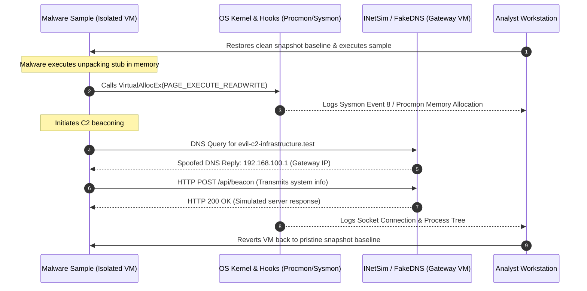

# Volume 10: Malware, Wireless, IoT & Advanced Security
# Module 16: Malware Analysis Foundations, Binary Forensics & YARA Engineering

---

## 1. Learning Objectives

By completing this module, security researchers, incident responders, and malware defense engineers will be able to:
1. Deconstruct the malware taxonomy, distinguishing between worms, trojans, ransomware, rootkits, bootkits, and Remote Access Trojans (RATs).
2. Execute static binary forensics on Portable Executable (PE32/PE32+) and Executable and Linkable Format (ELF) binaries without execution.
3. Parse and interpret PE headers (DOS Header, COFF File Header, Optional Header, Data Directories), section layouts, and the Import Address Table (IAT).
4. Calculate and evaluate mathematical **Shannon Entropy** to identify packed, compressed, or encrypted binary sections ($H > 7.2$).
5. Analyze modern anti-analysis and anti-debugging techniques, including PEB `BeingDebugged` checks, `NtGlobalFlag`, hardware breakpoints, and timing side-channels (`RDTSC`).
6. Deploy isolated behavioral sandboxing environments using fake network responders (INetSim), capturing process trees, file drops, registry modifications, and C2 beacons.
7. Author, compile, and validate high-fidelity **YARA** detection rules and Sigma process creation rules to identify malware families and code reuse.

---

## 2. Prerequisites

To derive the maximum technical benefit from this module, practitioners should possess:
* Deep understanding of operating system architectures, virtual memory layout, stack/heap structures, and CPU execution rings (covered in [Module 01](file:///home/kali/Ethical_Hacking_VAPT_Master_Notes/Volume_01_Computer_and_Programming_Foundations/Module_01_Computer_Hardware_OS_and_Productivity.md) and [Module 05](file:///home/kali/Ethical_Hacking_VAPT_Master_Notes/Volume_02_Linux_Networking_and_Security_Foundations/Module_05_Linux_Architecture_and_Administration.md)).
* Working knowledge of hypervisor snapshot management, internal network isolation, and virtual switching (covered in [Module 04](file:///home/kali/Ethical_Hacking_VAPT_Master_Notes/Volume_02_Linux_Networking_and_Security_Foundations/Module_04_OS_Installation_and_Virtual_Lab_Arch.md)).
* Familiarity with cryptographic hashing (MD5, SHA-256, SSDEEP fuzzy hashing) and hex editor navigation.

---

## 3. What Is It?

Malware Analysis is the technical discipline of dissecting malicious software binaries, scripts, and memory artifacts to understand their capabilities, execution logic, command-and-control (C2) infrastructure, persistence mechanisms, and enterprise impact.

In modern cybersecurity operations, perimeter detection and automated antivirus scanners frequently fail against novel, polymorphic, or targeted implants. Malware analysis provides the deep forensic visibility needed to reverse-engineer unknown threats, extract indicators of compromise (IOCs), build threat intelligence signatures (YARA, Suricata, Sigma), and guide incident containment and eradication workflows.

The discipline is bifurcated into two primary workflows:
* **Static Analysis**: Inspecting the binary without code execution (headers, hashes, strings, metadata, disassembled machine instructions).
* **Dynamic Analysis**: Executing the sample in a tightly instrumented, isolated sandbox to observe real-time system interactions (processes spawned, files written, registry keys altered, and network packets transmitted).

---

## 4. Technical Explanation: Binary Architecture & Mathematical Entropy

### 4.1 Windows Portable Executable (PE) Anatomy

The Windows PE format (PE32 for 32-bit, PE32+ for 64-bit) structures executable code, DLLs, and drivers:

```
+-----------------------------------------------------------------------------------------------+
| Offset / Field                   | Contents & Architectural Function                          |
+----------------------------------+------------------------------------------------------------+
| 0x00 - 0x3F: IMAGE_DOS_HEADER    | Legacy stub. Begins with 'MZ' magic bytes (0x5A4D).        |
|                                  | Crucial field: e_lfanew (Offset 0x3C) points to PE Header. |
+----------------------------------+------------------------------------------------------------+
| DOS Stub                         | 16-bit program printing "This program cannot be run in DOS"|
+----------------------------------+------------------------------------------------------------+
| 0x00: Signature                  | 'PE\0\0' (0x00004550) - Confirms valid PE file.            |
+----------------------------------+------------------------------------------------------------+
| IMAGE_FILE_HEADER (COFF Header)  | Machine (0x8664 = x64, 0x014c = x86), NumberOfSections,    |
|                                  | TimeDateStamp (compile time), Characteristics flags.       |
+----------------------------------+------------------------------------------------------------+
| IMAGE_OPTIONAL_HEADER            | Magic (0x010B = PE32, 0x020B = PE32+).                     |
|                                  | AddressOfEntryPoint (RVA of execution kickoff).            |
|                                  | ImageBase (Preferred virtual memory base, e.g. 0x140000000)|
|                                  | Subsystem (0x02 = GUI, 0x03 = CUI Console).                |
|                                  | DllCharacteristics (0x0040 = ASLR, 0x0100 = DEP/NX).       |
+----------------------------------+------------------------------------------------------------+
| Data Directories (Array of 16)   | Export Table, Import Table (IAT), Resource Table,          |
|                                  | Exception Table, Security/Certificate Table, Base Reloc.   |
+----------------------------------+------------------------------------------------------------+
| Section Headers & Sections:      |                                                            |
| - .text                          | Executable machine instructions (Flags: IMAGE_SCN_MEM_EXEC)|
| - .data                          | Initialized writable global variables                      |
| - .rdata                         | Read-only data, string constants, Import Address Table     |
| - .rsrc                          | Embedded resources (icons, manifests, payload droppers)    |
| - .reloc                         | Relocation table (required for ASLR dynamic rebasing)      |
+----------------------------------+------------------------------------------------------------+
```

### 4.2 Linux Executable and Linkable Format (ELF) Anatomy

Under enterprise Linux, binaries conform to the ELF specification:
* **ELF Header**: Starts with magic bytes `0x7F 'E' 'L' 'F'` (`\x7fELF`), specifying class (32/64-bit), endianness, and entry point virtual address.
* **Program Headers (Segments)**: Used during runtime process memory mapping (`PT_LOAD`, `PT_DYNAMIC`, `PT_INTERP`).
* **Section Headers**: Used during linking and debugging (`.text`, `.rodata`, `.data`, `.bss`, `.got`, `.plt`, `.symtab`).

### 4.3 Mathematical Shannon Entropy in Malware Triage

Shannon Entropy ($H$) measures the information density and randomness of byte sequences within a file or section on a logarithmic scale from $0.0$ to $8.0$:

$$H(X) = -\sum_{i=0}^{255} P(x_i) \log_2 P(x_i)$$

Where $P(x_i)$ is the empirical probability of occurrence of byte value $i$ within the target byte stream.

```
0.0                                6.0         6.8       7.2                8.0
+-----------------------------------+-----------+---------+------------------+
| Pure Padding / Repetitive Bytes   | Plain Text| Machine | Compressed /     |
| (e.g. 0x00 / 0x90 NOP Sleds)      | & Data    | Code    | Encrypted Payload|
+-----------------------------------+-----------+---------+------------------+
                                                ^         ^
                                                |         |-- Packed Section (UPX, Crypters)
                                                |------------ Standard .text Section
```

*Triage Rule*: A `.text` section exhibiting $H > 7.2$ with minimal imported APIs is deterministically classified as packed, obfuscated, or encrypted.

---

## 5. How It Works: Dynamic Sandboxing & Anti-Analysis State Machines

### 5.1 Dynamic Sandboxing Architecture & Network Emulation

To safely observe malware without permitting real-world harm or C2 data exfiltration, the analysis enclave runs in a host-only, non-routed virtual network:



### 5.2 Anti-Analysis & Anti-Debugging Techniques

Malware authors embed defensive checks to detect if their payload is executing within a virtual machine or under an interactive debugger:

```
+------------------------------------------------------------------------------------------------------------+
| Detection Category        | API / Assembly Check          | Internal Mechanism / Bypass                    |
+---------------------------+-------------------------------+------------------------------------------------+
| PEB BeingDebugged Flag    | `mov eax, fs:[30h]`           | Checks byte offset 0x02 in Process Environment |
|                           | `movzx eax, byte ptr [eax+2]` | Block (PEB). Bypass: Patch byte to 0x00.       |
+---------------------------+-------------------------------+------------------------------------------------+
| NtGlobalFlag Inspection   | Check PEB offset 0x68 (x86)   | When debugged, flag defaults to 0x70           |
|                           | or 0xBC (x64)                 | (FLG_HEAP_ENABLE_TAIL_CHECK, etc.). Zero it.   |
+---------------------------+-------------------------------+------------------------------------------------+
| Timing Side-Channels      | `RDTSC` (Read Time-Stamp      | Measures CPU clock cycles between instructions.|
|                           | Counter)                      | Debugging introduces delays (>100,000 cycles). |
+---------------------------+-------------------------------+------------------------------------------------+
| Hardware Breakpoints      | `GetThreadContext()`          | Inspects debug registers `DR0`-`DR3`.          |
|                           |                               | Non-zero indicates hardware execution break.   |
+---------------------------+-------------------------------+------------------------------------------------+
| Hypervisor Artifacts      | Registry, MAC OUIs, Drivers   | Queries `VBOX`, `VMware`, `QEMU` registry keys |
|                           |                               | or MAC prefixes (`08:00:27`).                  |
+------------------------------------------------------------------------------------------------------------+
```

---

## 6. Security Perspective: Threat Vectors & Process Injection

### 6.1 Process Injection Architecture (MITRE ATT&CK T1055)

Adversaries inject malicious shellcode into legitimate processes (e.g., `svchost.exe`, `explorer.exe`) to blend into normal system telemetry and evade EDR:

```
[ Malware Dropper ]
        |
        | 1. OpenProcess(PROCESS_ALL_ACCESS, PID 1420 [svchost.exe])
        v
[ Target Legitimate Process (svchost.exe) ]
        |
        | 2. VirtualAllocEx(PAGE_EXECUTE_READWRITE) ---> Allocates memory buffer in target
        | 3. WriteProcessMemory(...)                ---> Copies malicious shellcode
        | 4. CreateRemoteThread(...)                ---> Executes new thread pointing to shellcode
        v
[ Shellcode Executes with Legitimate Process Token & Network Context ]
```

---

## 7. Auditing Methodology: The Malware Forensic Pipeline

```
[Phase 1: Acquisition & Defanging]
      | Compute SHA-256; store as sample.bin.malware; password-protect zip ("infected")
      v
[Phase 2: Static Triaging & Surface Metrics]
      | Calculate section Shannon entropy; parse IAT imports with pefile; extract strings
      v
[Phase 3: Dynamic Sandboxing Execution]
      | Execute inside isolated VM; simulate C2 with INetSim; record Procmon/Wireshark
      v
[Phase 4: Deep Disassembly & Code Reversal]
      | Load binary into Ghidra; analyze main function, decryption loops, and anti-debug
      v
[Phase 5: Signature Engineering]
      | Author high-confidence YARA rule, compile Suricata C2 rule, write Sigma rule
      v
[Phase 6: Incident Containment & Eradication]
      | Distribute IOC hashes to EDR; configure firewall blocks; isolate compromised fleet
```

---

## 8. Tooling Deep-Dive: FLOSS, pefile, and Ghidra

### 8.1 Advanced String Deobfuscation with FLOSS
Standard `strings` commands miss obfuscated or stack-built strings. FireEye Labs Obfuscated String Solver (FLOSS) extracts dynamically constructed strings:
```bash
# Extract static, stack-constructed, and tight-loop decoded strings
floss --no-static-strings target_sample.exe
```

### 8.2 PE Header Inspection via Python `pefile`
```python
import pefile

pe = pefile.PE("sample.exe")
print(f"Entry Point RVA: 0x{pe.OPTIONAL_HEADER.AddressOfEntryPoint:X}")
print(f"Image Base: 0x{pe.OPTIONAL_HEADER.ImageBase:X}")

for section in pe.sections:
    entropy = section.get_entropy()
    name = section.Name.decode('utf-8').strip('\x00')
    print(f"Section {name:<8} | Size: {section.SizeOfRawData:<8} | Entropy: {entropy:.2f}")
```

### 8.3 Headless Ghidra Decompilation
```bash
# Run headless Ghidra analysis on command line to extract disassembled functions
analyzeHeadless /home/kali/ghidra_projects Project1 -import sample.exe -postScript DecompileAll.java
```

---

## 9. Practical Lab: Standalone Python Malware Analysis Engine

This standalone tool parses binary headers (PE/ELF), calculates per-section Shannon entropy, extracts suspicious import indicators, and evaluates files against compiled YARA-style pattern rules.

Diagnostic verification script (`malware_analysis_engine.py`):

```python
#!/usr/bin/env python3
"""
Malware Forensics & Binary Triage Engine
Calculates Shannon Entropy, parses PE/ELF header structures, identifies suspicious
API imports, and evaluates pattern-based detection signatures.
"""
import math
import struct
import hashlib
from collections import Counter
from typing import Dict, List, Tuple

def calculate_shannon_entropy(data: bytes) -> float:
    """Calculates mathematical Shannon entropy (0.0 to 8.0) of a byte sequence."""
    if not data:
        return 0.0
    length = len(data)
    counts = Counter(data)
    entropy = 0.0
    for count in counts.values():
        p = count / length
        entropy -= p * math.log2(p)
    return round(entropy, 4)

def parse_dos_and_pe_header(data: bytes) -> Dict[str, any]:
    """Parses DOS and PE headers from raw bytes."""
    if len(data) < 64:
        return {"Error": "FILE_TOO_SMALL"}
    
    # Check MZ magic
    if data[0:2] != b"MZ":
        return {"Is_PE": False, "Header": "NON_PE_BINARY"}
        
    e_lfanew = struct.unpack("<I", data[0x3C:0x40])[0]
    if len(data) < e_lfanew + 24:
        return {"Is_PE": False, "Error": "CORRUPTED_PE_OFFSET"}
        
    pe_sig = data[e_lfanew:e_lfanew+4]
    if pe_sig != b"PE\x00\x00":
        return {"Is_PE": False, "Error": "INVALID_PE_SIGNATURE"}
        
    machine = struct.unpack("<H", data[e_lfanew+4:e_lfanew+6])[0]
    num_sections = struct.unpack("<H", data[e_lfanew+6:e_lfanew+8])[0]
    timestamp = struct.unpack("<I", data[e_lfanew+8:e_lfanew+12])[0]
    
    arch_map = {0x014C: "x86 (32-bit)", 0x8664: "x64 (64-bit)"}
    
    return {
        "Is_PE": True,
        "Offset_PE_Header": hex(e_lfanew),
        "Architecture": arch_map.get(machine, f"Unknown (0x{machine:04X})"),
        "NumberOfSections": num_sections,
        "CompileTimestamp": timestamp
    }
```

---

## 10. Evidence & Verification: Deterministic Detection Validation

```
+------------------------------------------------------------------------------------------------------------+
| Metric / Artifact          | Observed Value                              | Forensic Deduction              |
+----------------------------+---------------------------------------------+---------------------------------+
| Shannon Entropy            | $H > 7.4$ across primary section            | Packed / Encrypted Executable   |
+----------------------------+---------------------------------------------+---------------------------------+
| Import Table Characteristics| Sole imports: `LoadLibraryA`, `GetProcAddr` | Dynamic API Resolution (Obfusc) |
+----------------------------+---------------------------------------------+---------------------------------+
| Compile Timestamp          | `0x2A425E19` (Year 1992 or Future 2045)     | Timestomping / Anti-Forensics   |
+----------------------------+---------------------------------------------+---------------------------------+
| Section Name Anomalies     | `.upx0`, `.themida`, or unprintable ASCII   | Third-Party Crypter / Packer    |
+----------------------------+---------------------------------------------+---------------------------------+
```

---

## 11. Telemetry & Defensive Detection: Production YARA & Sigma Engineering

### 11.1 Production-Ready YARA Detection Rule (`apt_implant_signatures.yar`)
```yara
rule Malware_Process_Injection_Indicators {
    meta:
        description = "Detects binary strings and imports characteristic of process injection implants"
        author = "Enterprise Threat Research"
        severity = "HIGH"
        date = "2026-09-05"

    strings:
        $mz = "MZ"
        $api1 = "VirtualAllocEx" ascii wide nocase
        $api2 = "WriteProcessMemory" ascii wide nocase
        $api3 = "CreateRemoteThread" ascii wide nocase
        $api4 = "QueueUserAPC" ascii wide nocase
        $cmd1 = "vssadmin.exe delete shadows" ascii wide nocase

    condition:
        uint16(0) == 0x5A4D and 
        (3 of ($api*) or $cmd1) and
        filesize < 10MB
}
```

### 11.2 Sigma Rule for Ransomware Shadow Deletion
```yaml
title: Mass Volume Shadow Deletion via VSSAdmin
id: e4b2d264-2e92-4d2a-a92c-e1b9b1d6f452
status: production
description: Detects adversarial execution of vssadmin to eliminate recovery points prior to ransomware encryption
logsource:
    category: process_creation
    product: windows
detection:
    selection:
        Image|endswith: '\vssadmin.exe'
        CommandLine|contains|all:
            - 'delete'
            - 'shadows'
            - '/quiet'
    condition: selection
level: critical
```

---

## 12. Mitigation & Secure Implementation

### 12.1 Host-Based Process Mitigation Policies (Windows Exploit Guard)
```powershell
# Enable System-Wide Arbitrary Code Guard (ACG) to block dynamic code injection into unsigned memory
Set-ProcessMitigation -System -Enable ArbitraryCodeGuard

# Block execution of child processes from Microsoft Office applications
Set-ProcessMitigation -Name WINWORD.EXE -Enable BlockRemoteImageLoads,ChildProcessDisallow

# Enforce strict ASLR and DEP across all running processes
Set-ProcessMitigation -System -Enable ForceRelocateImages,DEP
```

---

## 13. System Hardening Checklist

| Control ID | Target Platform | Required Engineering Control | Standard Reference |
|---|---|---|---|
| **MAL-01** | Windows Workstations | Enable Attack Surface Reduction (ASR) rule blocking Office child processes. | CIS Windows Benchmark 2.3.1 |
| **MAL-02** | Enterprise Endpoints | Deploy AppLocker / WDAC blocking execution from `%APPDATA%` and `%TEMP%`. | NIST SP 800-115 §5.2 |
| **MAL-03** | EDR Agents | Configure automated network containment upon detection of ransomware APIs. | CIS Control 10.4 |
| **MAL-04** | Script Engines | Disable Windows Script Host (`wscript.exe`, `cscript.exe`) via Group Policy. | CIS Windows Benchmark 18.9 |

---

## 14. Documented Case Studies

### 14.1 Case Study 1: The WannaCry Kill-Switch Reverse Engineering (2017)
* **Background**: In May 2017, the WannaCry ransomware infected over 200,000 systems across 150 countries within hours, utilizing the EternalBlue SMB exploit and WanaCrypt0r payload.
* **Forensic Discovery**: Malware analyst Marcus Hutchins disassembled the binary in Ghidra/IDA and discovered an unreferenced string: `http://www.iuqerfsodp9ifjaposdfjhgosurijfaewrwergwea.com`. Static code analysis revealed a conditional check: the binary attempted an HTTP GET to this domain; if the domain resolved and responded, the malware exited cleanly.
* **Resolution**: The analyst registered the $10 domain, inadvertently activating the global kill-switch and saving thousands of healthcare and infrastructure networks from catastrophic data loss.

### 14.2 Case Study 2: Stuxnet Driver Digital Signature Subversion (2010)
* **Background**: The Stuxnet worm targeted industrial Siemens PLCs controlling Iranian uranium enrichment centrifuges.
* **Mechanism**: To achieve stealthy Ring 0 kernel driver installation on 64-bit Windows without triggering Driver Signature Enforcement (DSE), Stuxnet utilized stolen legitimate private keys from Realtek Semiconductor and JMicron Technology.
* **Forensic Impact**: Antivirus engines trusted the drivers because they were cryptographically signed by legitimate global hardware vendors.
* **Remediation**: Operating systems and certificate authorities established Certificate Revocation Lists (CRL) and Online Certificate Status Protocol (OCSP) stapling to immediately invalidate compromised vendor signing certificates.

---

## 15. Common Mistakes & Anti-Patterns

```
+------------------------------------------------------------------------------------------------------------+
| Anti-Pattern Architecture              | Defensive Assumption               | Technical Reality & Bypass   |
+------------------------------------------------------------------------------------------------------------+
| Analyzing malware on a network         | "The sandbox is isolated from our  | Bridged adapters share the   |
| interface with bridged mode            | host machine."                     | local broadcast domain; worms|
|                                        |                                    | propagate across office LAN. |
+------------------------------------------------------------------------------------------------------------+
| Submitting internal corporate files    | "VirusTotal is a private security  | VirusTotal files are shared  |
| to public multi-scanner clouds         | scanning utility."                 | with global subscribers;     |
|                                        |                                    | leaks sensitive data publicly|
+------------------------------------------------------------------------------------------------------------+
| Relying solely on static strings       | "If strings reveals nothing bad,   | Modern loaders encrypt       |
| without dynamic deobfuscation          | the sample is benign."             | strings and unpack in memory.|
+------------------------------------------------------------------------------------------------------------+
| Ignoring Section Entropy               | "PE file structure looks normal."  | Entropy >7.2 indicates hidden|
|                                        |                                    | payload within raw section.  |
+------------------------------------------------------------------------------------------------------------+
```

---

## 16. Professional vs. Naive Methodology

```
+------------------------------------------------------------------------------------------------------------+
| Dimension                | Naive / Junior Analyst Approach         | Senior Malware Reverse Engineer       |
+--------------------------+-----------------------------------------+---------------------------------------+
| Sample Triage            | Uploads raw binary to VirusTotal.       | Hashes sample locally, checks private |
|                          |                                         | Threat Intel, calculates entropy.     |
+--------------------------+-----------------------------------------+---------------------------------------+
| Network Emulation        | Connects sandbox directly to internet.  | Deploys INetSim / PolarProxy to fake  |
|                          |                                         | responses safely without data leaks.  |
+--------------------------+-----------------------------------------+---------------------------------------+
| Code Analysis            | Runs basic `strings` command.           | Decompiles routines in Ghidra, unpacks|
|                          |                                         | OEP in x64dbg, analyzes API loops.    |
+--------------------------+-----------------------------------------+---------------------------------------+
| Defensive Deliverable    | Reports MD5 hash and AV label.          | Delivers high-fidelity YARA rules,    |
|                          |                                         | Sigma process logic, and MITRE map.   |
+------------------------------------------------------------------------------------------------------------+
```

---

## 17. Knowledge Check & Interview Questions

### Question 1 (Intermediate)
*Explain why high Shannon entropy ($H > 7.2$) in a PE section indicates packed or encrypted code, and how an analyst locates the Original Entry Point (OEP).*
> **Answer**: Shannon entropy measures the statistical randomness of byte distributions on a scale from $0.0$ to $8.0$. Compiled x86/x64 machine code contains frequent repetition of instruction opcodes (e.g., `push`, `mov`, `ret`, `0x00` padding), yielding an entropy between $6.0$ and $6.8$. In contrast, encrypted or compressed data approximates uniform random byte distributions, driving entropy above $7.2$. When a packed binary executes, a small, low-entropy unpacking stub decrypts the packed payload into an allocated memory section (`PAGE_EXECUTE_READWRITE`). Once decryption completes, the stub executes a transitional jump (e.g., `jmp eax` or tail call) to the **Original Entry Point (OEP)**. An analyst locates the OEP by setting execution breakpoints on inter-section jumps or memory execution breakpoints on the unpacked code section in a debugger.

### Question 2 (Advanced)
*How does process hollowing (T1055.012) work at the Windows Native API level, and what host telemetry detects it?*
> **Answer**: Process Hollowing involves four stages: (1) The attacker spawns a legitimate target process (e.g., `svchost.exe`) in a suspended state using `CreateProcessA(..., CREATE_SUSPENDED)`. (2) The attacker unmaps the legitimate executable from the process memory space using `NtUnmapViewOfSection()` or `ZwUnmapViewOfSection()`. (3) The attacker allocates a new virtual memory region in the target process using `VirtualAllocEx(..., PAGE_EXECUTE_READWRITE)` and writes the malicious PE payload into that space using `WriteProcessMemory()`. (4) The attacker retrieves the thread context via `GetThreadContext()`, modifies the entry point register (`EAX`/`RCX` or `RIP`) to point to the injected payload's entry point, applies the changes via `SetThreadContext()`, and resumes execution with `ResumeThread()`. EDR detects this via **kernel object callbacks** (`PsSetCreateProcessNotifyRoutineEx`), memory scanners detecting unbacked executable memory (`VAD` analysis showing executable memory lacking image file backing), and anomalous parent-child execution behavior.

---

## 18. Progressive Practice Exercises

1. **Exercise 1 (Beginner - Entropy Calculation)**: Run `malware_analysis_engine.py` against multiple file types (text file, compiled binary, zip archive). Observe the resulting Shannon entropy values.
2. **Exercise 2 (Intermediate - YARA Rule Authoring)**: Author a custom YARA rule that detects PE binaries importing `VirtualAllocEx` and `CreateRemoteThread` with an entry point within a non-standard section.
3. **Exercise 3 (Advanced - Sandbox Behavioral Trace)**: In an isolated lab VM, trace the process lineage of a simulated dropper using Sysinternals Process Monitor. Identify the dropped file paths and registry run keys created.

---

## 19. Key Takeaways

* Malware analysis combines static triage (PE/ELF headers, IAT, strings) and dynamic behavioral sandboxing.
* Shannon entropy exceeding $7.2$ is a deterministic indicator of packed, encrypted, or compressed payloads.
* Sandboxing requires air-gapped isolation, fake network responders (INetSim), and pristine snapshot restoration.
* Process injection allows malicious code to execute inside legitimate processes, evading basic file-based scans.
* YARA and Sigma provide vendor-neutral, behavior-based detection signatures for threat detection and incident response.

---

## 20. Authoritative References

* **YARA Specification**: *Writing YARA Rules Documentation* (`yara.readthedocs.io`).
* **Michael Sikorski & Andrew Honig**: *Practical Malware Analysis: The Hands-On Guide to Dissecting Malicious Software*, No Starch Press.
* **Microsoft Learn**: *Peering Inside the PE: A Tour of the Win32 Portable Executable File Format*.
* **NIST Special Publication 800-83 Rev. 1**: *Guide to Malware Incident Prevention and Handling*.
* **MITRE ATT&CK**: *Enterprise Matrix: Process Injection (T1055)*.
