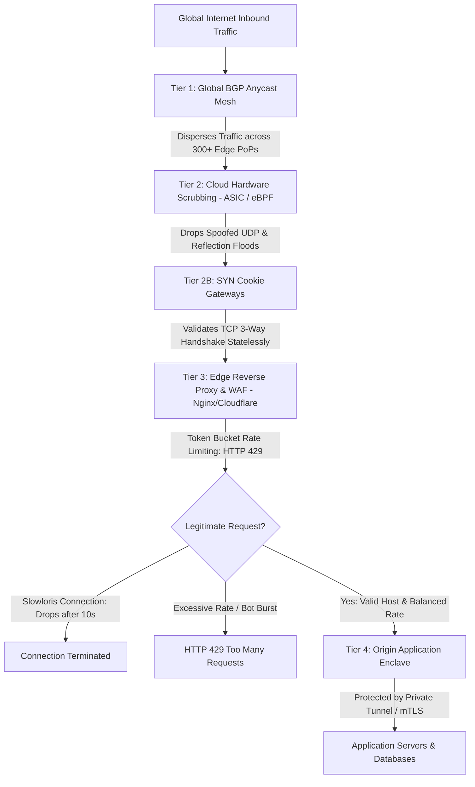

# Volume 10: Malware, Wireless, IoT & Advanced Security
# Module 20: Denial of Service (DoS/DDoS) Mitigation, Rate Limiting & Threat Engineering

---

## 1. Learning Objectives

By completing this module, security engineers, site reliability engineers (SREs), and infrastructure defenders will be able to:
1. Deconstruct the mechanics of volumetric Layer 4 attacks (UDP reflection/amplification, TCP SYN flood, ACK flood) and application-layer Layer 7 attacks (Slowloris, HTTP POST/RUDY, HTTP/2 Rapid Reset, ReDoS).
2. Quantify UDP reflection and amplification multipliers across modern protocols (DNS EDNS0, NTP monlist, Memcached, SSDP, CLDAP).
3. Trace the cryptographic and mathematical formulation of **TCP SYN Cookies** (RFC 4987), analyzing how kernel state allocation is bypassed during half-open queue saturation.
4. Formulate the state-machine differences between Non-Deterministic Finite Automata (NFA) and Deterministic Finite Automata (DFA) in regular expression engines, auditing applications for **ReDoS (CWE-1333)** catastrophic backtracking.
5. Architect multi-tiered DDoS defense pipelines combining BGP Anycast routing, Cloud Scrubbing Centers, Edge Reverse Proxies (Leaky/Token Bucket rate limiters), and origin cloaking.
6. Contrast **HTTP/2 Rapid Reset (CVE-2023-44487)** stream cancellation dynamics with legacy HTTP/1.1 connection exhaustion.
7. Deploy automated Python diagnostic engines to calculate amplification ratios, audit regular expression execution bounds, and simulate Token Bucket rate-limiting algorithms.

---

## 2. Prerequisites

To derive the maximum technical benefit from this module, practitioners should possess:
* Thorough understanding of OSI Layer 4 transport mechanics, TCP 3-way handshakes, sequence numbers, and UDP statelessness (covered in [Module 08](../Volume_02_Linux_Networking_and_Security_Foundations/Module_08_Networking_Protocols_and_Security.md)).
* Deep familiarity with HTTP/1.1, HTTP/2 multiplexing, and web application reverse proxy routing (covered in [Module 21](../Volume_05_Web_Security_Foundations/Module_21_Web_Security_Foundations.md)).
* Working knowledge of Linux networking sysctl parameters and iptables/nftables connection tracking (`conntrack`).

---

## 3. What Is It?

Denial of Service (DoS) and Distributed Denial of Service (DDoS) are availability attacks designed to exhaust network bandwidth, server processing capacity, memory state structures, or application thread pools, rendering digital services unavailable to legitimate users.

While confidentiality and integrity attacks target unauthorized data access or tampering, availability attacks strike the core operational viability of business infrastructure. In modern cloud and software-defined environments, availability defense requires a strict engineering approach:
* In security assessments, **actual disruption of production systems is strictly prohibited**. Penetration testers audit availability posture by modeling resource limits, reviewing concurrency bounds, verifying reverse-proxy rate-limiting configurations, and testing algorithmic complexity in isolated staging environments.
* In defensive engineering, protection is achieved through distributed capacity absorption (BGP Anycast), hardware-accelerated stateless filtering (SYN cookies, BPF/XDP drop rules), edge request throttling (Token Bucket algorithms), and architectural origin shielding.

---

## 4. Technical Explanation: Attack Taxonomy & Mathematical Mechanics

### 4.1 Taxonomy of Denial of Service Attacks

```
+---------------------------------------------------------------------------------------------------------------+
| OSI Layer | Attack Vector                  | Primary Operational Mechanism           | Exhausted Resource     |
+-----------+--------------------------------+-----------------------------------------+------------------------+
| Layer 4   | UDP Reflection / Amplification | Forges victim IP in small requests to   | Upstream transit pipe  |
|           | (DNS, NTP, Memcached, SSDP)    | open reflectors; reflects massive reply.| & ISP bandwidth (Tbps).|
+-----------+--------------------------------+-----------------------------------------+------------------------+
| Layer 4   | TCP SYN Flood                  | Sends continuous TCP SYN packets without| OS TCP backlog queue   |
|           | (RFC 4987)                     | completing 3-way handshake (no ACK).    | memory (kernel TCBs).  |
+-----------+--------------------------------+-----------------------------------------+------------------------+
| Layer 7   | Slowloris / Slow HTTP POST     | Holds HTTP connections open indefinitely| Web server worker      |
|           | (Low-and-Slow Attack)          | by transmitting headers/chunks slowly.  | threads (MaxClients).  |
+-----------+--------------------------------+-----------------------------------------+------------------------+
| Layer 7   | HTTP/2 Rapid Reset             | Exploits HTTP/2 stream multiplexing by  | Web server CPU / event |
|           | (CVE-2023-44487)               | firing HEADERS + immediate RST_STREAM.  | loop processing frames.|
+-----------+--------------------------------+-----------------------------------------+------------------------+
| Layer 7   | Algorithmic Complexity / ReDoS | Submits inputs that trigger exponential | CPU execution threads  |
|           | (CWE-1333)                     | backtracking ($O(2^n)$) in regexes.     | pinned at 100% load.   |
+---------------------------------------------------------------------------------------------------------------+
```

### 4.2 UDP Reflection & Amplification Multipliers

UDP is completely stateless; the source IP address in the UDP packet header is neither authenticated nor validated by default. Adversaries forge the victim's IP as the source and send tiny queries to exposed third-party servers:

$$\text{Amplification Factor} = \frac{\text{Payload Size}_{\text{Response}}}{\text{Payload Size}_{\text{Request}}}$$

```
+---------------------------------------------------------------------------------------------------------------+
| Protocol         | Port / Transport | Vulnerable Command / Request             | Amplification Factor (Max)   |
+------------------+------------------+------------------------------------------+------------------------------+
| Memcached        | UDP 11211        | Small `get` query for pre-stored payload | 10,000x to 51,000x           |
| NTP (Network     | UDP 123          | `monlist` command (returns last 600 IPs) | 556x                         |
| Time Protocol)   |                  |                                          |                              |
| DNS (EDNS0)      | UDP 53           | `ANY` record query with EDNS0 buffer     | 28x to 54x                   |
| SSDP (UPnP)      | UDP 1900         | `M-SEARCH` discovery broadcast           | 30x                          |
| CLDAP (Active    | UDP 389          | Search request with base schema filter   | 56x to 70x                   |
| Directory LDAP)  |                  |                                          |                              |
+---------------------------------------------------------------------------------------------------------------+
```

### 4.3 TCP SYN Cookies: Stateless Handshake Protection (RFC 4987)

In standard TCP connection establishment, receiving a SYN forces the server kernel to allocate a Transmission Control Block (TCB) in memory, placing the socket into the half-open backlog queue (`SYN_RECV`). A SYN flood quickly saturates this queue, causing the kernel to drop subsequent legitimate SYN packets.

When **SYN Cookies** are activated (`net.ipv4.tcp_syncookies = 1`), the kernel **allocates zero memory state** for incoming SYNs when the backlog fills. Instead, the server encodes the connection state directly into the 32-bit Initial Sequence Number ($ISN$) of the SYN-ACK:

$$ISN_{\text{Cookie}} = \text{TruncatedHMAC-SHA1}(s_{\text{secret}}, \text{SrcIP} \parallel \text{DstIP} \parallel \text{SrcPort} \parallel \text{DstPort} \parallel t) + t + \text{MSS\_Index}$$

Where:
* $t$: 3-bit slowly incrementing timestamp (ticks every 64 seconds).
* $\text{MSS\_Index}$: 3-bit table index encoding the Maximum Segment Size chosen by the server.
* $s_{\text{secret}}$: Cryptographic random key rotated periodically in kernel memory.

*Verification*: When a legitimate client returns the final ACK with `Acknowledgment Number = ` $ISN_{\text{Cookie}} + 1$, the server subtracts $1$, re-calculates the HMAC over the source/destination tuples and timestamp, and extracts the MSS. Only upon successful cryptographic validation does the server allocate memory for the active socket.

### 4.4 Regular Expression Denial of Service (ReDoS - CWE-1333)

Most programming language runtimes (Python `re`, JavaScript V8, Java `java.util.regex`, Ruby, PHP) utilize Non-Deterministic Finite Automata (NFA) engines supporting backreferences and lookaround assertions. When an NFA regex encounters ambiguous overlapping branches combined with nested quantifiers (e.g., `^(a+)+$`), processing time scales exponentially ($O(2^n)$):

```
Pattern: ^(a+)+$
Target String: "aaaaaaaaaaaaaaaaaaaaaaaaaaaa!" (28 'a's followed by non-matching '!')

Backtracking Steps:
- Length 10: 1,024 comparisons
- Length 20: 1,048,576 comparisons
- Length 30: 1,073,741,824 comparisons (Locks CPU core for minutes!)
```

---

## 5. How It Works: Multi-Tiered DDoS Defensive Architecture



### 5.1 Rate Limiting Algorithms: Token Bucket vs. Leaky Bucket

```
+---------------------------------------------------------------------------------------------------------------+
| Algorithm        | Mathematical Mechanics                              | Operational Trade-Off                |
+------------------+-----------------------------------------------------+--------------------------------------+
| Token Bucket     | Tokens added to a bucket of capacity $b$ at a fixed | Allows short bursts up to bucket     |
|                  | rate $r$ tokens/sec. Each request consumes 1 token. | capacity $b$, but enforces average   |
|                  | If bucket is empty, request dropped/delayed.        | throughput rate $r$. Ideal for APIs. |
+------------------+-----------------------------------------------------+--------------------------------------+
| Leaky Bucket     | Requests enter a fixed-capacity FIFO queue. Queue   | Strictly smooths traffic. Prevents   |
|                  | leaks at a constant rate $r$. If queue overflows,   | any bursts regardless of prior idle  |
|                  | excess requests are immediately dropped.            | time. Ideal for traffic shaping.     |
+------------------+-----------------------------------------------------+--------------------------------------+
```

---

## 6. Security Perspective: Economic Denial of Service (EDoS)

In modern auto-scaling serverless and cloud architectures (AWS Lambda, Azure Functions, Google Cloud Run, Kubernetes HPA):
* **The EDoS Mechanism**: Attackers do not attempt to crash the target application. Instead, they transmit a continuous, calibrated stream of valid API requests just beneath detection thresholds (e.g., 500 requests/second).
* **Financial Impact**: Cloud infrastructure automatically spins up thousands of additional container pods and serverless workers to satisfy the demand. Within days, the victim organization incurs tens of thousands of dollars in cloud execution, egress bandwidth, and database transaction fees.
* **Remediation**: Enforce hard billing quotas, concurrency execution caps, and edge rate-limiting independent of autoscaling thresholds.

---

## 7. Auditing Methodology: The Non-Destructive DoS Assessment

Auditing systems for DoS resilience requires strict adherence to non-destructive verification:

```
[Phase 1: Architecture & Origin Cloaking Recon]
      | Query DNS historical records, SSL certificates (Censys), and headers for origin IP leaks
      v
[Phase 2: Reverse Proxy Rate-Limiting Verification]
      | Transmit small, calibrated request bursts (e.g. 20 req in 2s); verify HTTP 429 response
      v
[Phase 3: Connection Timeout & Slowloris Hardening Review]
      | Audit web server configurations (client_header_timeout, client_body_timeout in Nginx)
      v
[Phase 4: Static Algorithmic Complexity & ReDoS Audit]
      | Scan source code regex patterns using automated NFA analyzers for nested quantifiers
      v
[Phase 5: Kernel TCP Stack Configuration Verification]
      | Inspect sysctl values: tcp_syncookies, tcp_max_syn_backlog, and connection tracking limits
      v
[Phase 6: Reporting & Cloud Scrubbing Architecture]
      | Document origin isolation controls, Cloudflare Tunnel adoption, and rate-limit baselines
```

---

## 8. Tooling Deep-Dive: Nginx Rate Limiting, ModSecurity, and Sysctl

### 8.1 Hardened Nginx Rate Limiting & Connection Throttling
In `/etc/nginx/nginx.conf`:
```nginx
http {
    # 1. Shared memory zone tracking client IPs (10MB holds ~160,000 IP states)
    # Rate: 10 requests per second
    limit_req_zone $binary_remote_addr zone=api_gateway_limit:10m rate=10r/s;
    
    # 2. Connection limit zone: max concurrent TCP connections per IP
    limit_conn_zone $binary_remote_addr zone=per_ip_conn_limit:10m;

    server {
        listen 443 ssl http2;
        server_name api.corporate.corp;

        # Mitigate Slowloris: Enforce strict connection and header receive timeouts
        client_header_timeout 5s;
        client_body_timeout 5s;
        keepalive_timeout 15s;
        send_timeout 5s;

        location /api/v1/ {
            # Enforce rate limit: allow burst buffer of 5 requests without delay
            limit_req zone=api_gateway_limit burst=5 nodelay;
            limit_req_status 429;

            # Limit concurrent TCP connections per IP to 10
            limit_conn per_ip_conn_limit 10;
            limit_conn_status 429;

            proxy_pass http://backend_cluster;
        }
    }
}
```

### 8.2 Linux Kernel TCP SYN Flood Mitigation (`/etc/sysctl.conf`)
```ini
# Enable TCP SYN Cookies (RFC 4987)
net.ipv4.tcp_syncookies = 1

# Increase SYN backlog queue size (default is often 128 or 512)
net.ipv4.tcp_max_syn_backlog = 4096

# Drop SYN-ACK retransmissions to 2 (discards half-open slots faster)
net.ipv4.tcp_synack_retries = 2

# Increase system-wide socket backlog limit
net.core.somaxconn = 4096

# Recycle sockets in TIME_WAIT state safely
net.ipv4.tcp_max_tw_buckets = 2000000
```
Apply immediately: `sudo sysctl -p`.

---

## 9. Practical Lab: Standalone Python DoS Mitigation & ReDoS Engine

This standalone tool tests regular expressions against catastrophic backtracking, implements a simulated Token Bucket rate limiter, and calculates UDP amplification multipliers.

Diagnostic verification script (`dos_mitigation_engine.py`):

```python
#!/usr/bin/env python3
"""
DoS Threat Engineering & Rate Limiting Engine
Evaluates ReDoS regex patterns, simulates Token Bucket rate limiters,
and calculates reflection amplification multipliers.
"""
import time
import re
from typing import Dict, List, Tuple

def audit_redos_backtracking(pattern_str: str, max_length: int = 24) -> Dict[str, any]:
    """Tests a regular expression against evil inputs to detect exponential backtracking."""
    compiled = re.compile(pattern_str)
    times = []
    
    for length in range(12, max_length + 1, 2):
        payload = ("a" * length) + "!"
        t0 = time.time()
        compiled.match(payload)
        elapsed = time.time() - t0
        times.append((length, elapsed))
        
    is_exponential = False
    if len(times) >= 3 and times[-1][1] > 0.05:
        # Check if execution time is accelerating rapidly
        ratio = times[-1][1] / max(times[-2][1], 0.0001)
        if ratio > 2.0:
            is_exponential = True
            
    return {
        "Pattern": pattern_str,
        "Timing_Results": times,
        "Is_ReDoS_Vulnerable": is_exponential,
        "Risk_Level": "CRITICAL" if is_exponential else "LOW"
    }

class TokenBucketRateLimiter:
    """Simulates Token Bucket algorithm for API rate limiting."""
    def __init__(self, capacity: int, fill_rate_per_sec: float):
        self.capacity = capacity
        self.tokens = capacity
        self.fill_rate = fill_rate_per_sec
        self.last_update = time.time()

    def allow_request(self) -> bool:
        now = time.time()
        elapsed = now - self.last_update
        self.tokens = min(self.capacity, self.tokens + elapsed * self.fill_rate)
        self.last_update = now
        
        if self.tokens >= 1.0:
            self.tokens -= 1.0
            return True
        return False
```

---

## 10. Evidence & Verification: Distinguishing DoS from Backend Deadlocks

```
+------------------------------------------------------------------------------------------------------------+
| Observed Symptom           | Potential Root Cause A: Volumetric DDoS     | Root Cause B: Application Flaw  |
+----------------------------+---------------------------------------------+---------------------------------+
| HTTP 502 / 504 Timeouts    | Reverse proxy pipe saturated by external    | Backend database thread pool    |
|                            | bandwidth flood.                            | deadlock on unindexed SQL query.|
+----------------------------+---------------------------------------------+---------------------------------+
| 100% CPU on Single Core    | High volume network packet interrupt load   | Single thread trapped in ReDoS  |
|                            | (`ksoftirqd`).                              | catastrophic backtracking.      |
+----------------------------+---------------------------------------------+---------------------------------+
| SYN Backlog Overflow Log   | External TCP SYN flood saturating half-open | Local application hung; stopped |
| (`Possible SYN flooding`)  | socket queue.                               | calling `accept()` on socket.   |
+------------------------------------------------------------------------------------------------------------+
```

---

## 11. Telemetry & Defensive Detection: NetFlow & Web Metrics

### 11.1 Suricata Rule: Detection of Inbound DNS Amplification Flood
```yaml
alert udp any 53 -> $HOME_NET any (
    msg:"SEC-DOS-001: Excessive Inbound DNS Amplification Reflection Response Size";
    dsize:>2048;
    threshold: type both, track by_dst, count 50, seconds 2;
    classtype: attempted-dos;
    sid: 9002001; rev: 1;
)
```

### 11.2 NetFlow (IPFIX) Anomalous Flow Rate Detection (Elastic / Splunk)
```spl
index=netflow direction=inbound
| stats sum(bytes) as total_bytes, count as total_packets by dest_ip, protocol
| eval mbps = (total_bytes * 8) / (1024 * 1024 * 60)
| where mbps > 500 AND protocol="UDP"
| table dest_ip, protocol, mbps, total_packets
```

---

## 12. Mitigation & Secure Implementation: Origin Shielding

### 12.1 Origin IP Cloaking via Cloudflare Tunnels (`cloudflared`)
To completely neutralize direct-to-origin DDoS attacks, eliminate all public listening ports and tunnel traffic securely over outbound-only connections:

```mermaid
flowchart LR
    A[Public Client] -->|HTTPS| B[Cloudflare Global Anycast Edge]
    B -->|Encrypted Tunnel| C[cloudflared daemon on Origin Server]
    C -->|Loopback HTTP| D[Local Web Application: 127.0.0.1:8080]
    
    subgraph Origin Server Firewall (iptables)
        E[DROP ALL Inbound Ports 80 & 443]
    end
```

---

## 13. System Hardening Checklist

| Control ID | Target Subsystem | Required Hardening Action | Standard |
|---|---|---|---|
| **DOS-01** | Linux Kernel Network | Enable TCP SYN Cookies (`net.ipv4.tcp_syncookies = 1`). | RFC 4987 / CIS Linux 3.2.8 |
| **DOS-02** | Reverse Proxy | Enforce Leaky/Token Bucket rate limits returning `HTTP 429`. | NIST SP 800-53 SC-5 |
| **DOS-03** | Web Application Server| Configure `client_header_timeout` and `client_body_timeout` to $\le 10$s. | OWASP ASVS v4.0 Req 13.1 |
| **DOS-04** | Edge DNS Routing | Deploy authoritative DNS across multi-provider BGP Anycast networks. | NIST SP 800-189 |
| **DOS-05** | Origin Infrastructure | Block direct public ingress; mandate CDN tunnels or mTLS interconnects. | CIS Cloud Architecture |

---

## 14. Documented Case Studies

### 14.1 Case Study 1: The Dyn Mirai Botnet Attack (2016)
* **Background**: In October 2016, the Mirai botnet (compromising hundreds of thousands of default-credential IoT cameras and routers) targeted Managed DNS provider Dyn.
* **Mechanism**: Launched multi-vector volumetric floods exceeding 1.2 Tbps, combining DNS query floods, TCP SYN floods, and UDP floods on port 53.
* **Impact**: Authoritative resolution for major platforms (Twitter, Netflix, GitHub, Spotify, Amazon) failed across North America and Europe for several hours.
* **Lesson Learned**: DNS cannot rely on a single upstream provider or unicast infrastructure; mission-critical domains must maintain multi-provider Anycast DNS redundancy.

### 14.2 Case Study 2: The HTTP/2 Rapid Reset Zero-Day (CVE-2023-44487)
* **Background**: In August 2023, cloud providers (Cloudflare, Google, Amazon) mitigated the largest DDoS attack in internet history, peaking at **398 million requests per second**.
* **Root Cause Mechanism**: Under HTTP/2, clients can open thousands of concurrent requests across a single TCP socket via multiplexed streams. In the Rapid Reset attack, the client transmits a `HEADERS` frame to initiate a request, and immediately transmits a `RST_STREAM` frame to cancel it. The server begins processing the request (consuming CPU and memory) before processing the reset. Because the stream is canceled immediately, it never counts against the maximum concurrent stream limit (`SETTINGS_MAX_CONCURRENT_STREAMS`).
* **Remediation**: Web servers and reverse proxies patched their HTTP/2 implementations to monitor the ratio between stream resets and total requests, immediately terminating TCP connections that display anomalous reset patterns.

---

## 15. Common Mistakes & Anti-Patterns

```
+------------------------------------------------------------------------------------------------------------+
| Anti-Pattern Architecture              | Defensive Assumption               | Technical Reality & Bypass   |
+------------------------------------------------------------------------------------------------------------+
| Relying on Cloud WAF while leaving     | "Nobody knows the direct IP of     | Attackers discover origin IP |
| origin IP open on ports 80/443         | our cloud web server."             | via DNS history or Censys SSL|
|                                        |                                    | cert scans; bypass WAF fully.|
+------------------------------------------------------------------------------------------------------------+
| Using complex nested regexes for user  | "Regex input validation is fast    | Evil inputs trigger ReDoS    |
| input validation without timeouts      | and safe for email and URLs."      | (CWE-1333); 100% CPU lock.   |
+------------------------------------------------------------------------------------------------------------+
| Rate limiting based purely on client IP| "Every user has a distinct IP."    | Corporate proxy users share  |
| without session/token tracking         |                                    | one IP; rate limits block    |
|                                        |                                    | hundreds of valid customers. |
+------------------------------------------------------------------------------------------------------------+
| Setting auto-scaling policies without  | "Auto-scaling ensures our site     | Creates Economic Denial of   |
| maximum billing or container caps      | will never go down."               | Service (EDoS); massive bill.|
+------------------------------------------------------------------------------------------------------------+
```

---

## 16. Professional vs. Naive Methodology

```
+------------------------------------------------------------------------------------------------------------+
| Dimension                | Naive / Junior Auditor Approach         | Professional Security Auditor Approach|
+--------------------------+-----------------------------------------+---------------------------------------+
| DoS Resilience Testing   | Runs high-volume stress tools (LOIC)    | Audits concurrency limits, rate-limit |
|                          | against production, risking outages.    | boundaries, and regex time complexity.|
+--------------------------+-----------------------------------------+---------------------------------------+
| Origin Protection        | Assumes pointing DNS CNAME to CDN       | Enforces origin IP cloaking, firewall |
|                          | completely shields the server.          | CIDR whitelisting, or private tunnels.|
+--------------------------+-----------------------------------------+---------------------------------------+
| Rate Limiting Design     | Configures arbitrary request counts     | Implements Token Bucket algorithms    |
|                          | without burst tolerance.                | with `Retry-After` headers and bursts.|
+--------------------------+-----------------------------------------+---------------------------------------+
| Cloud Scale Management   | Leaves autoscaling limits unbounded.    | Defines strict hard billing alerts,   |
|                          |                                         | concurrency caps, and EDoS limits.    |
+------------------------------------------------------------------------------------------------------------+
```

---

## 17. Knowledge Check & Interview Questions

### Question 1 (Intermediate)
*Explain how the Slowloris attack causes a complete web server denial of service with negligible bandwidth, and name two reverse-proxy configurations that defeat it.*
> **Answer**: Slowloris operates at Layer 7 by exploiting thread-based or process-based web server architectures (e.g., Apache HTTPD with `mpm_worker` or `mpm_prefork`). The attacker opens hundreds of standard TCP connections to the web server and transmits valid partial HTTP request headers (e.g., `X-Header-1: value\r\n`), but never sends the terminating blank line (`\r\n\r\n`). At regular intervals (e.g., every 10–15 seconds), the attacker transmits an additional benign header line to keep the socket alive. The server keeps each connection worker thread open, waiting for the completed request. Within seconds, the server reaches its maximum concurrent worker pool limit (`MaxRequestWorkers`), preventing legitimate clients from establishing connections. Slowloris is defeated by: (1) Placing an event-driven reverse proxy (e.g., Nginx or Envoy) in front of the server, which handles thousands of concurrent connections on a single epoll thread without allocating worker threads until full headers are received; and (2) Enforcing aggressive header timeouts (e.g., `client_header_timeout 5s;` in Nginx).

### Question 2 (Advanced)
*How does an NFA regular expression engine enter catastrophic backtracking (CWE-1333 ReDoS), and how can a developer mathematically guarantee linear-time evaluation?*
> **Answer**: An NFA (Non-Deterministic Finite Automata) engine explores matching paths recursively. When a regular expression contains nested quantifiers with overlapping characters (e.g., `(a+)+`), the engine has multiple valid ways to group the characters for every single `a`. If the input string matches completely, the engine succeeds quickly. However, if the string concludes with an unmatched character (e.g., `aaaaaaaaaaaaa!`), the engine must backtrack and exhaustively evaluate *every possible grouping combination* before it can definitively determine that the match fails. For an input of length $n$, the number of combinations scales exponentially as $O(2^n)$. To mathematically guarantee linear-time $O(n)$ evaluation, developers can: (1) Use a **Deterministic Finite Automata (DFA)** engine (such as Google's **RE2** or Rust's `regex` crate), which processes each character exactly once without backtracking; or (2) Rewrite the regex pattern to ensure that adjacent repeated tokens are mutually exclusive (possessive quantifiers `(a+)++` or atomic groupings `(?>a+)+`), which completely prohibit backtracking.

---

## 18. Progressive Practice Exercises

1. **Exercise 1 (Beginner - ReDoS Detection)**: Execute `dos_mitigation_engine.py`. Measure the execution time of exponential backtracking patterns and verify the automated risk calculation.
2. **Exercise 2 (Intermediate - Token Bucket Simulation)**: Using Python, simulate a Token Bucket rate limiter with a capacity of 10 tokens and a refill rate of 2 tokens/second. Simulate 15 rapid requests and verify that exactly 5 requests are rejected with `HTTP 429`.
3. **Exercise 3 (Advanced - Origin Shielding Audit)**: Audit a public web domain's SSL certificate history on Censys. Determine whether previous DNS records expose an IP address that directly responds to HTTPS requests with the domain's certificate.

---

## 19. Key Takeaways

* DoS attacks span volumetric bandwidth floods (Layer 4) and algorithmic/thread exhaustion (Layer 7).
* UDP reflection attacks leverage open internet reflectors to amplify attack traffic by up to 51,000x.
* TCP SYN Cookies eliminate kernel state allocation for half-open sockets during SYN floods.
* NFA regular expression engines are vulnerable to catastrophic backtracking (ReDoS) when nested quantifiers overlap.
* Multi-tiered defense requires BGP Anycast routing, Cloud Scrubbing, Token Bucket rate limiting, and origin IP cloaking.

---

## 20. Authoritative References

* **IETF RFC 4987**: *TCP SYN Flooding Attacks and Common Mitigations*.
* **MITRE CWE-1333**: *Inefficient Regular Expression Complexity (ReDoS)*.
* **Cloudflare Threat Intelligence**: *HTTP/2 Rapid Reset: Deconstructing the Record-Breaking Attack (CVE-2023-44487)*.
* **NIST Special Publication 800-189**: *Resilient Interdomain Traffic Routing: BGP Security & DDoS*.
* **Google RE2 Specification**: *Linear-Time Regular Expression Search Engine* (`github.com/google/re2`).
