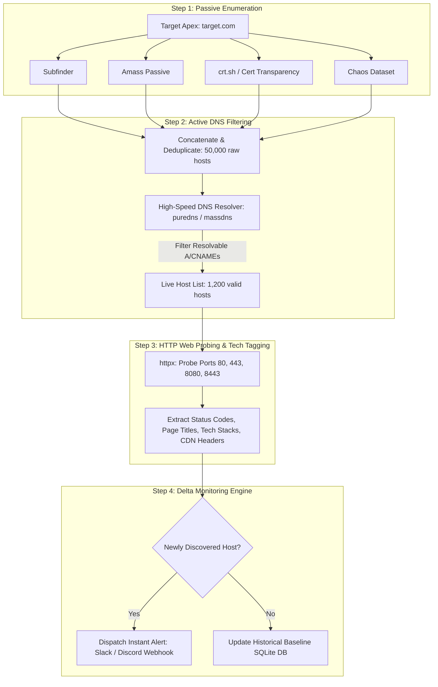

# Volume 11: Reporting, Methodology & Professional Practice
# Professional Bug Bounty Hunting Methodology: Continuous Recon, Deep Asset Discovery & High-Signal Reporting

---

## 1. Executive Overview & The Modern Bug Bounty Ecosystem

Bug Bounty Hunting is the open, crowdsourced practice of identifying, rigorously validating, and professionally disclosing security vulnerabilities to organizations in exchange for monetary rewards (bounties), reputation, and responsible remediation.

Unlike traditional penetration testing—where an assessor operates with a guaranteed consulting fee, defined testing windows, and white-box internal documentation—bug bounty hunters operate in an intensely competitive, performance-based environment. Thousands of global security researchers simultaneously inspect public attack surfaces. Consequently, relying on basic automated vulnerability scanners (e.g., automated Nuclei sweeps or default Nessus scans) produces almost zero viable results, as these tools have already been run against the target thousands of times.

Success in modern bug bounty requires moving to:
1. **Continuous Reconnaissance Automation**: Discovering newly provisioned assets, subdomains, and cloud buckets minutes after deployment, before other researchers detect them.
2. **Deep Content Discovery & JavaScript Mining**: Extracting undocumented API endpoints, parameters, and business logic routes hidden in client-side bundles.
3. **Complex Manual Business Logic Analysis**: Auditing multi-step workflows, Broken Object Level Authorization (BOLA/IDOR), Race Conditions, and Cloud SSRF vulnerabilities that automated scanners are fundamentally blind to.
4. **High-Signal Technical Reporting**: Constructing reproducible, minimally invasive proofs-of-concept with clear business risk quantification.

---

## 2. Legal Boundaries & Safe Harbor Protocols

Operating within legal and ethical boundaries is non-negotiable in bug bounty hunting. Exceeding scope or violating testing terms exposes a researcher to civil litigation and criminal prosecution under statutes such as the United States Computer Fraud and Abuse Act (CFAA - 18 U.S.C. § 1030) or the UK Computer Misuse Act 1990.

```
+---------------------------------------------------------------------------------------------------------------+
| Safe Harbor Classification    | Legal Terms & Protections                    | Researcher Action Mandate      |
+-------------------------------+----------------------------------------------+--------------------------------+
| Full / Gold Safe Harbor       | Organization guarantees not to initiate civil| Highest safety. Safe to test   |
| (Disclose.io Standard)        | or criminal legal action for in-scope testing| as long as actions remain      |
|                               | conducted in good faith.                     | strictly within defined scope. |
+-------------------------------+----------------------------------------------+--------------------------------+
| Partial Safe Harbor           | Safe harbor applies only to explicit primary | Extreme caution required. Any  |
|                               | domains; excludes third-party integrations.  | deviation risks legal exposure.|
+-------------------------------+----------------------------------------------+--------------------------------+
| Vulnerability Disclosure (VDP)| Unpaid program. Security recognition only.   | Do NOT request compensation.   |
| (No Bounty / Hall of Fame)    | Governed by standard responsible disclosure. | Follow disclosure SLAs.        |
+-------------------------------+----------------------------------------------+--------------------------------+
```

### 2.1 The Golden Rules of Ethical Engagement
* **Respect Explicit Scope**: If a program specifies `*.corp.com` but explicitly lists `careers.corp.com` as Out-of-Scope, testing `careers.corp.com` is a direct violation of program rules.
* **Stop at First Proof**: When verifying access (e.g., SQL Injection, IDOR, or SSRF), prove the vulnerability with a single non-destructive read (e.g., `SELECT user()` or accessing your own test records). **Never dump entire production databases, alter other users' records, or execute invasive pivots.**
* **Never Interfere with Availability**: DoS/DDoS testing, high-velocity brute-force spamming, and resource-exhaustion tests are strictly prohibited across all programs.

---

## 3. The Continuous Reconnaissance Pipeline Architecture

The primary competitive advantage in bug bounty is **Time-to-Discovery**: detecting an exposed asset before it is secured or reported by another hunter.



### 3.1 Constructing the Reconnaissance Pipeline CLI Chain
```bash
#!/usr/bin/env bash
# Continuous Reconnaissance Discovery Script
TARGET="corporate.corp"
OUTPUT_DIR="/home/kali/recon_${TARGET}"
mkdir -p "$OUTPUT_DIR"

echo "[*] Step 1: Passive Subdomain Enumeration..."
subfinder -d "$TARGET" -silent -all > "$OUTPUT_DIR/subfinder.txt"
assetfinder --subs-only "$TARGET" > "$OUTPUT_DIR/assetfinder.txt"

# Merge and deduplicate
sort -u "$OUTPUT_DIR/subfinder.txt" "$OUTPUT_DIR/assetfinder.txt" > "$OUTPUT_DIR/raw_domains.txt"

echo "[*] Step 2: Active DNS Resolution with Trusted Resolvers..."
# Resolves thousands of subdomains in seconds using massdns engine
puredns resolve "$OUTPUT_DIR/raw_domains.txt" -r /home/kali/resolvers.txt -w "$OUTPUT_DIR/resolved_domains.txt"

echo "[*] Step 3: Probing Live HTTP Services & Technology Fingerprinting..."
httpx -l "$OUTPUT_DIR/resolved_domains.txt" \
      -ports 80,443,8000,8080,8443,9000 \
      -silent \
      -status-code \
      -title \
      -tech-detect \
      -follow-redirects \
      -json \
      -o "$OUTPUT_DIR/live_web_services.json"

echo "[*] Reconnaissance complete. Output saved to $OUTPUT_DIR/live_web_services.json"
```

---

## 4. Deep Surface Mapping & JavaScript Mining

Modern single-page web applications (React, Angular, Vue, Next.js) compile application logic into client-side JavaScript bundles. Mining these files uncovers unindexed API endpoints, internal staging URLs, and hidden parameters.

```
[ Target Web Application: https://app.target.corp ]
                     │
                     ▼ (Spidering & Asset Crawling via Katana)
[ Extract All Referenced JavaScript Files (.js) ]
  - app.bundle.1042.js
  - vendor.8932.js
  - admin-route-manifest.js
                     │
                     ▼ (Regex Extraction & AST Analysis via LinkFinder / SecretFinder)
[ Discovered Attack Surface Elements ]
├── Internal Staging APIs: `https://api-staging.internal.corp/v3/`
├── Unauthenticated Debug Routes: `/debug/pprof`, `/api/health/metrics`
├── Hidden Parameters: `?is_admin=`, `?debug=true`, `?override_tenant=`
└── Exposed Client Keys: `firebaseConfig`, `algolia_api_key`
```

### 4.1 Automated JavaScript Endpoint Extraction
```bash
# Crawl target and extract all active JavaScript resources
katana -u https://app.target.corp -jc -silent | grep "\.js$" | sort -u > js_files.txt

# Extract API endpoints and URL paths from collected JS files
cat js_files.txt | while read -r url; do
    python3 /opt/LinkFinder/linkfinder.py -i "$url" -o cli
done | sort -u | grep -E "^/api/|^https?://" > discovered_endpoints.txt
```

---

## 5. High-Bounty Vulnerability Hunting Strategies

```
+---------------------------------------------------------------------------------------------------------------+
| Vulnerability Class           | Target Location                              | Typical Bounty Yield (USD)     |
+-------------------------------+----------------------------------------------+--------------------------------+
| Broken Object Level Auth      | Multi-tenant APIs: `/api/users/{id}`,        | $3,000 – $15,000               |
| (BOLA / IDOR)                 | `/api/invoices/{uuid}`, `/api/tenants/{id}`   | (Direct data leakage / PII)    |
+-------------------------------+----------------------------------------------+--------------------------------+
| Server-Side Request Forgery   | URL preview generators, webhook callbacks,   | $5,000 – $25,000               |
| (Cloud Metadata SSRF)         | PDF export renderers, image import tools     | (Cloud credential extraction)  |
+-------------------------------+----------------------------------------------+--------------------------------+
| Race Conditions / TOCTOU      | Gift card redemption, balance transfers,     | $2,000 – $10,000               |
| (Concurrency Exploitation)    | invite acceptance, checkout discounts        | (Financial / business impact)  |
+-------------------------------+----------------------------------------------+--------------------------------+
| Account Takeover (ATO)        | OAuth2 redirect_uri manipulation,            | $5,000 – $20,000               |
|                               | password reset token leakage in referrers    | (Direct victim impersonation)  |
+-------------------------------+----------------------------------------------+--------------------------------+
| Pre-Auth RCE / SQLi           | Legacy portals, unindexed admin tools,       | $10,000 – $50,000+             |
|                               | forgotten microservices                      | (Critical system compromise)   |
+---------------------------------------------------------------------------------------------------------------+
```

### 5.1 Hunting Broken Object Level Authorization (BOLA / IDOR)
BOLA occurs when an API endpoint uses user-supplied input to access an object without validating whether the authenticated user has permission to that object:

```
[ Step 1: Create Two Test Accounts ]
- Account A (Attacker): Attacker UUID = 1111-aaaa
- Account B (Victim):   Victim UUID   = 2222-bbbb

[ Step 2: Identify Sensitive Endpoints in Account B ]
Victim accesses private medical record:
GET /api/v1/patients/2222-bbbb/medical-history
Authorization: Bearer <Victim_Token>
HTTP/1.1 200 OK -> Returns private data.

[ Step 3: Test Cross-Tenant Access using Account A's Token ]
Attacker attempts to query Victim's UUID:
GET /api/v1/patients/2222-bbbb/medical-history
Authorization: Bearer <Attacker_Token>

[ Step 4: Evaluate Response ]
- If HTTP 403 / 404: SECURE (Proper Authorization Enforced)
- If HTTP 200 OK with Victim's data: CRITICAL BOLA VULNERABILITY CONFIRMED!
```

### 5.2 Hunting Concurrency & Race Conditions (Turbo Intruder)
Race conditions exploit the window of time between checking a condition and executing an action (Time-of-Check to Time-of-Use - TOCTOU). For example, redeeming a one-time discount coupon:

```python
# Turbo Intruder Script: Parallel Connection Synchronization
def queueRequests(target, wordlists):
    engine = RequestEngine(endpoint=target.endpoint,
                           concurrentConnections=30,
                           requestsPerConnection=1,
                           pipeline=False)

    # Queue 20 identical requests to redeem the same one-time coupon
    for i in range(20):
        engine.queue(target.req, gate='race_gate')

    # Release all 20 requests simultaneously onto the network socket
    engine.openGate('race_gate')

def handleResponse(req, interesting):
    table.add(req)
```
*Impact*: If the database fails to use atomic transactions (`SELECT FOR UPDATE`), the coupon is applied 20 times before the `is_redeemed` flag is written to disk.

---

## 6. Non-Destructive Proof of Concept (PoC) Packaging

In bug bounty reports, clarity, safety, and non-destructive verification determine whether a report is rewarded or dismissed.

```
+---------------------------------------------------------------------------------------------------------------+
| Vulnerability Class           | Prohibited Invasive Action                   | Mandatory Benign Proof         |
+-------------------------------+----------------------------------------------+--------------------------------+
| Remote Code Execution (RCE)   | Dropping webshells, modifying system files,  | Execute `id` or `whoami`.      |
|                               | scanning internal networks.                  | Capture mathematical output.   |
+-------------------------------+----------------------------------------------+--------------------------------+
| Server-Side Template Inj (SSTI| Spawning reverse shells.                     | Inject `{{7*7}}` -> `49`.      |
+-------------------------------+----------------------------------------------+--------------------------------+
| SQL Injection (SQLi)          | Dumping entire database tables, altering data| Extract `@@version` or benign  |
|                               | with `DROP` or `UPDATE`.                     | sleep timing (`pg_sleep(5)`).  |
+-------------------------------+----------------------------------------------+--------------------------------+
| Cloud Metadata SSRF           | Exfiltrating AWS production secrets, calling | Fetch `169.254.169.254/latest/`|
|                               | unauthorized IAM API endpoints.              | metadata directory listing.    |
+-------------------------------+----------------------------------------------+--------------------------------+
| Account Takeover (ATO)        | Modifying passwords on real customer accounts| Perform ATO strictly against   |
|                               | or reading real customer emails.             | your own second test account.  |
+-------------------------------+----------------------------------------------+--------------------------------+
```

---

## 7. Constructing the Top 1% Bug Bounty Report

Triage analysts on platforms like HackerOne and Bugcrowd review hundreds of submissions daily. A disorganized, verbose, or vague report slows down triage and risks invalidation. A high-signal report is structured, factual, and reproducible within 60 seconds.

### 7.1 Report Blueprint Structure
```markdown
# [Vulnerability Type] on [Target Domain/Endpoint] leading to [Concrete Business Impact]

## Summary
Brief 2-3 sentence executive overview describing what the vulnerability is, the exact asset affected, and what an attacker can achieve.

## Severity
- Estimated CVSS v3.1 / v4.0 Vector String and Score
- Weakness: CWE Identifier

## Affected Asset & Endpoint
- URL: `https://target.corp/api/v2/endpoint`
- Parameter / Method: `id` (HTTP GET)

## Pre-Requisites & Testing Environment
- Account 1 (Attacker): Username, Role
- Account 2 (Victim): Username, Role

## Step-by-Step Reproduction Steps
1. Navigate to ...
2. Send the following HTTP request via curl:
   ```bash
   curl -s -H "Authorization: Bearer <TOKEN>" ...
   ```
3. Observe the response:
   ```http
   HTTP/1.1 200 OK
   Content-Type: application/json
   ...
   ```

## Non-Destructive Proof of Concept
[Screenshot or minimal raw HTTP payload proving access]

## Real-World Impact
Explain the business, financial, regulatory, or privacy risk to the organization (e.g. GDPR Article 33 breach, direct financial loss).

## Recommended Remediation
Actionable, production-ready code patch or configuration change.
```

---

## 8. Real-World High-Signal Report Examples

### 8.1 Example 1: Broken Object Level Authorization (BOLA / IDOR)
```markdown
# High-Signal Report: Broken Object Level Authorization on Invoicing API exposes Customer PII

## Summary
A Broken Object Level Authorization (BOLA) vulnerability was identified on the customer invoice generation endpoint `GET /api/v2/invoices/{invoice_uuid}`. An authenticated user belonging to Tenant A can view the private financial invoices, home addresses, and credit card last-4 digits of any customer in Tenant B by modifying the `invoice_uuid` parameter.

## Severity
- CVSS v3.1: 6.5 (CVSS:3.1/AV:N/AC:L/PR:L/UI:N/S:U/C:H/I:N/A:N)
- Weakness: CWE-639: Authorization Bypass Through User-Controlled Key

## Affected Asset
- URL: `https://billing.target.corp/api/v2/invoices/{invoice_uuid}`
- HTTP Method: `GET`

## Step-by-Step Reproduction
1. Log in to test Account A (`attacker_test@target.corp`) and obtain session bearer token.
2. Log in to second test Account B (`victim_test@target.corp`) and create a draft invoice. Observe that Account B's invoice UUID is `e8b2c4a1-7789-4921-91a1-38294821a001`.
3. Using curl, execute the following request using Account A's authorization token while querying Account B's invoice UUID:

```bash
curl -s -X GET "https://billing.target.corp/api/v2/invoices/e8b2c4a1-7789-4921-91a1-38294821a001" \
     -H "Authorization: Bearer eyJh****REDACTED" \
     -H "Accept: application/json"
```

4. Observe that the server returns `HTTP/1.1 200 OK` containing Account B's full customer name, billing address, and transaction amount.

## Impact Analysis
An attacker can iterate through invoice UUIDs (or harvest them via public search/logs) to scrape the entire corporate invoicing database, exposing confidential customer contracts and violating GDPR Article 32 data protection mandates.

## Remediation
Enforce server-side tenancy verification before returning invoice objects:
```python
# Secure Tenant Verification in Django REST Framework / FastAPI
invoice = get_object_or_404(Invoice, uuid=invoice_uuid)
if invoice.organization_id != request.user.organization_id:
    raise PermissionDenied("You do not have permission to view this invoice.")
```
```

---

## 9. Authoritative References

* **HackerOne**: *Hacker101 Bug Bounty Methodology & Vulnerability Taxonomy* (`hacker101.com`).
* **Bugcrowd**: *Vulnerability Rating Taxonomy (VRT)* (`bugcrowd.com/vrt`).
* **Disclose.io**: *Open Source Terms for Coordinated Vulnerability Disclosure (Safe Harbor)* (`disclose.io`).
* **OWASP API Security Top 10 (2023)**: *API1:2023 - Broken Object Level Authorization (BOLA)*.
* **PortSwigger Web Security Academy**: *Race Conditions & Business Logic Vulnerabilities*.
