# Volume 11: Reporting, Methodology & Professional Practice
# Enterprise VAPT Execution Workflow: Scoping, Governance, Testing Coordination & Retest Lifecycles

---

## 1. Executive Overview & Industry Context

Enterprise Vulnerability Assessment and Penetration Testing (VAPT) is a formalized, legally authorized cybersecurity evaluation program executed across complex corporate, financial, healthcare, and government environments. Unlike ad-hoc vulnerability scanning or bug bounty hunting, enterprise VAPT requires rigorous organizational governance, formal legal contracting, close operational synchronization with IT engineering and Security Operations Centers (SOC), strict evidence chain-of-custody, and executive-level risk accountability.

This comprehensive standard operating procedure (SOP) defines the end-to-end lifecycle of an enterprise VAPT engagement:
* **Pre-Engagement Governance**: Scoping boundaries, Master Services Agreements (MSA), Statements of Work (SOW), and Rules of Engagement (RoE).
* **Operational Coordination**: Testing windows, IP whitelisting, SOC deconfliction, and the mandatory 2-hour Critical Defect Notification protocol.
* **Testing Phase Execution**: Calibrated scanning, manual defect verification, evidence minimization, and non-destructive proof-of-concept guidelines.
* **Reporting & Debrief**: Technical Dossiers, Executive Risk Presentations, and Remediation Service Level Agreements (SLAs).
* **Retesting & Remediation Attestation**: Verification methodology, regression auditing, and formal issuance of Attestation of Remediation certificates.

---

## 2. Standards Alignment & Regulatory Frameworks

Enterprise VAPT engagements must align with globally recognized security assessment frameworks:

```
+---------------------------------------------------------------------------------------------------------------+
| Standard / Framework          | Governing Body | Core Focus & Enterprise Application                          |
+-------------------------------+----------------+--------------------------------------------------------------+
| NIST SP 800-115               | NIST (US DOC)  | Technical Guide to Information Security Testing & Assessment.|
|                               |                | Standard methodology for federal and enterprise audits.      |
+-------------------------------+----------------+--------------------------------------------------------------+
| PTES                          | Independent    | Penetration Testing Execution Standard: Pre-engagement,      |
| (Penetration Testing Standard)| Consortium     | Threat Modeling, Vuln Analysis, Exploitation, Post-Exploit.  |
+-------------------------------+----------------+--------------------------------------------------------------+
| OWASP WSTG / MASVS            | OWASP          | Web Security Testing Guide & Mobile App Security Standard.   |
|                               | Foundation     | Comprehensive technical baseline for application layers.     |
+-------------------------------+----------------+--------------------------------------------------------------+
| OSSTMM v3.0                   | ISECOM         | Open Source Security Testing Methodology Manual. Metrics-    |
|                               |                | driven operational security and trust boundary verification. |
+-------------------------------+----------------+--------------------------------------------------------------+
| PCI-DSS v4.0 Requirement 11.4 | PCI SSC        | Annual external and internal penetration testing mandate for |
|                               |                | payment processing environments (CDE).                       |
+-------------------------------+----------------+--------------------------------------------------------------+
```

---

## 3. The 6-Phase Enterprise VAPT Lifecycle

```mermaid
flowchart TD
    subgraph Phase 1: Pre-Engagement & Scoping
        A1[Scoping Questionnaire & Architecture Review] --> A2[Define SOW, MSA & Target CIDRs/URLs]
        A2 --> A3[Execute Rules of Engagement - RoE]
        A3 --> A4[Formal Technical Kick-Off Meeting]
    end

    subgraph Phase 2: Logistics & Reconnaissance
        B1[IP Whitelisting & WAF Bypass Coordination] --> B2[Active Recon & Asset Inventory Validation]
        B2 --> B3[Credential Provisioning & MFA Testing Accounts]
    end

    subgraph Phase 3: Active Testing & Coordination
        C1[Calibrated Automated Vulnerability Sweeps] --> C2[Deep Manual Penetration Testing]
        C2 --> C3{Critical Flaw Identified?}
        C3 -->|Yes: RCE/SQLi/BOLA| C4[Emergency 2-Hour Escalation Notice]
        C3 -->|No| C5[Daily Standup & Progress Sync]
    end

    subgraph Phase 4: Analysis & Deliverable Generation
        D1[Calculate CVSS v3.1 / v4.0 & Map CWEs] --> D2[Draft Executive Summary & Technical Findings]
        D2 --> D3[Internal Quality Assurance - Peer QA Review]
    end

    subgraph Phase 5: Debrief & Remediation Planning
        E1[Technical Debrief with Engineering Teams] --> E2[Executive Risk Presentation to CISO & Board]
        E2 --> E3[Establish Remediation Window: 30/60/90 Day SLA]
    end

    subgraph Phase 6: Retest & Formal Attestation
        F1[Patch Deployment Verification] --> F2[Re-Execute Reproduction Steps & Test Bypasses]
        F2 --> F3[Issue Formal Attestation of Remediation Certificate]
    end

    A4 --> B1
    B3 --> C1
    C4 --> C5
    C5 --> D1
    D3 --> E1
    E3 --> F1
```



---

## 4. Phase 1: Pre-Engagement Governance & Scoping Methodology

### 4.1 The Scoping Process & In-Scope Asset Definition
Accurate scoping prevents operational disruption, billing disputes, and legal ambiguity. The scoping document must explicitly catalog targets into three categories:

```
+---------------------------------------------------------------------------------------------------------------+
| Target Scope Category         | Inclusions & Specifications                  | Explicit Exclusions / Off-Limits|
+-------------------------------+----------------------------------------------+--------------------------------+
| Production External IP Blocks | `198.51.100.0/24`, `203.0.113.16/28`          | Third-party hosted services,   |
|                               | (Directly owned corporate CIDRs).            | CDN shared IPs (Cloudflare).   |
+-------------------------------+----------------------------------------------+--------------------------------+
| Web Applications & APIs       | `https://app.corp.com`, `https://api.corp.com`| Third-party SaaS (Salesforce), |
|                               | (All endpoints, REST, GraphQL).              | payment gateway redirect pages.|
+-------------------------------+----------------------------------------------+--------------------------------+
| Internal Corporate Network    | Internal Active Directory Domain, server     | Critical medical devices,      |
|                               | subnets, workstation segments.               | ICS/SCADA production rings.    |
+-------------------------------+----------------------------------------------+--------------------------------+
| Cloud Infrastructure          | AWS Accounts: `123456789012`                 | Shared cloud provider control  |
|                               | Azure Tenants: `corp.onmicrosoft.com`        | planes (AWS/Azure backbone).   |
+-------------------------------+----------------------------------------------+--------------------------------+
```

### 4.2 Legal Documentation & Contracting
1. **Master Services Agreement (MSA)**: Governs the overarching legal relationship, indemnification, liability caps, confidentiality (NDA), and intellectual property rights.
2. **Statement of Work (SOW)**: Details specific engagement deliverables, dates, pricing, hours of testing, and consultant staffing.
3. **Rules of Engagement (RoE)**: The foundational operational contract signed by technical stakeholders defining allowed testing techniques, emergency contacts, and escalation paths.

---

## 5. Phase 2: Operational Coordination & Logistics

### 5.1 SOC Deconfliction & White-Hat Whitelisting
To ensure testing evaluates actual application controls rather than merely testing web application firewall (WAF) IP rate limits:
* **Testing From Static IPs**: The assessment team provides static public IP addresses (`203.0.113.195/32`) in advance.
* **Custom Request Headers**: Testers configure automated tools and interception proxies to inject an agreed-upon non-standard tracking header in every HTTP request:
  ```http
  X-Security-Assessment: Enterprise-VAPT-Auth-2026
  X-Assessor-ID: ConsultingGroup-TeamAlpha
  ```
* **SOC Deconfliction**: The client SOC is informed of the testing dates and tester IPs. SOC analysts maintain visibility to observe whether security information and event management (SIEM) correlation rules successfully detect the penetration testing activities.

---

## 6. Phase 3: Active Testing & Critical Escalation SLA

### 6.1 The 2-Hour Critical Vulnerability Notification Protocol
When an assessor discovers a critical defect that poses an immediate risk of system compromise or data exfiltration (e.g., unauthenticated Remote Code Execution, mass SQL injection, or unauthenticated AWS root credentials):

```
[ Step 1: Verification (0 to 15 Minutes) ]
  - Verify deterministic reproducibility; eliminate false positives.
  - Formulate minimal, non-destructive proof (e.g. `whoami` or `{{7*7}}`).
  - Redact all tokens (`sk_live_1234****REDACTED`) in captured evidence.
        │
        ▼
[ Step 2: Emergency Advisory Drafting (15 to 45 Minutes) ]
  - Complete the standardized Critical Defect Notification Form.
  - Encrypt advisory with client PGP public key.
        │
        ▼
[ Step 3: Out-of-Band Notification (Within 2 Hours) ]
  - Transmit encrypted notification via designated secure channel (Signal / Encrypted Portal).
  - Place voice telephone call to Primary Emergency Technical Contact.
        │
        ▼
[ Step 4: Emergency Mitigation Bridge Call ]
  - Convene emergency alignment call with client DevOps / Security team.
  - Implement immediate compensating control (WAF virtual patch or host isolation).
        │
        ▼
[ Step 5: Document Incident & Resume Testing ]
  - Document client acknowledgment; resume assessment across remaining scope.
```

---

## 7. Phase 4: Analysis & Professional Deliverable Generation

### 7.1 Deliverable Structure Requirements
An enterprise VAPT report is divided into two distinct components tailored to different organizational audiences:

1. **Executive Summary (Target: C-Suite, Board of Directors, Legal)**:
   * High-level narrative evaluating overall enterprise risk posture.
   * Visual risk distribution charts (Findings by Severity: Critical, High, Medium, Low, Informational).
   * Strategic business impact analysis (GDPR liability, operational downtime risks).
   * Strategic remediation roadmap prioritizing resource allocation over 30, 60, and 90 days.
2. **Technical Findings Dossiers (Target: Engineering, DevOps, System Administrators)**:
   * Vulnerability Classification: CWE Name, ID, CVSS v3.1 and v4.0 vector strings.
   * Asset Location: Exact URLs, ports, parameters, or file paths.
   * Step-by-Step Reproduction: Copy-paste commands (`curl`), minimal benign probes, and raw HTTP request/response evidence.
   * Root Cause Analysis: Source code or architectural flaw explanation.
   * Remediation Guidance: Actionable, production-ready code patches and secure framework configurations.

---

## 8. Phase 5: Technical Debrief & Remediation SLAs

### 8.1 Enterprise Remediation Timelines (SLA Matrix)

```
+---------------------------------------------------------------------------------------------------------------+
| Severity Tier       | CVSS Score Range | Enterprise Remediation SLA   | Required Escalation Action            |
+---------------------+------------------+------------------------------+---------------------------------------+
| Critical            | 9.0 - 10.0       | $\le$ 48 Hours               | Emergency hotfix or host isolation;   |
|                     |                  |                              | daily CISO briefings until resolved.  |
+---------------------+------------------+------------------------------+---------------------------------------+
| High                | 7.0 - 8.9        | $\le$ 14 Calendar Days       | Scheduled sprint priority patch;      |
|                     |                  |                              | temporary WAF virtual rule deployed.  |
+---------------------+------------------+------------------------------+---------------------------------------+
| Medium              | 4.0 - 6.9        | $\le$ 30 Calendar Days       | Incorporated into standard product    |
|                     |                  |                              | development sprint backlog.           |
+---------------------+------------------+------------------------------+---------------------------------------+
| Low                 | 0.1 - 3.9        | $\le$ 90 Calendar Days       | Addressed during regular software     |
|                     |                  |                              | maintenance and dependency updates.   |
+---------------------+------------------+------------------------------+---------------------------------------+
| Informational       | 0.0              | Discretionary / Next Release | Best-practice hardening recommendation.|
+---------------------------------------------------------------------------------------------------------------+
```

---

## 9. Phase 6: Retesting, Verification & Attestation Workflow

### 9.1 The Retesting Verification Lifecycle
Retesting is not merely a formality; it is a full security evaluation of the deployed patch to prevent regressions and patch bypasses:

```
[ Client Deploys Patch to Staging / Production ]
                      │
                      ▼
[ Assessor Re-Executes Original Reproduction Steps ]
                      │
            +─────────┴─────────+
            │                   │
         [ FAILS ]           [ SUCCEEDS ]
            │                   │
            ▼                   ▼
[ Patch Bypass Testing ]    [ Status: NOT REMEDIATED ]
- Test alternative encodings- Document failure details
- Test parameter pollution  - Return to Engineering team
- Test boundary values
            │
            ▼
[ Confirmed Patched? ]
   ├── YES ──> [ Status: REMEDIATED (100% Closed) ]
   └── NO  ──> [ Status: PARTIALLY REMEDIATED (Bypass Found) ]
```

### 9.2 Attestation of Retest / Remediation Certificate
Upon completing retesting, the security assessment firm issues a formal **Letter of Attestation (LoA)**. This document is provided to external auditors, regulatory bodies (PCI SSC), insurance underwriters, and enterprise customers to certify that identified high-risk vulnerabilities have been systematically verified as resolved.

---

## 10. Complete Documentation Templates

### 10.1 Template: Critical Vulnerability Escalation Notice
```markdown
CRITICAL VULNERABILITY ESCALATION ADVISORY
CONFIDENTIAL - ENCRYPTED TRANSMISSION ONLY

Date/Time of Discovery: 2026-09-05 14:22:15 UTC
Assessing Organization: Apex Security Auditing Group
Lead Assessor Contact: +1 (555) 019-2834 / assessor@apex-audit.test

1. Vulnerability Summary:
Unauthenticated Remote Code Execution (RCE) via Expression Language Injection in the invoicing reporting portal.

2. Affected Asset:
Host: https://billing.internal.corp.com/reports/generate
Parameter: export_template (HTTP POST)

3. Severity & Classification:
CVSS v3.1: 9.8 (CVSS:3.1/AV:N/AC:L/PR:N/UI:N/S:U/C:H/I:H/A:H)
CWE-917: Improper Neutralization of Special Elements used in an Expression Language Statement

4. Non-Destructive Proof-of-Concept:
Submitting benign mathematical expression probe:
POST /reports/generate HTTP/1.1
Host: billing.internal.corp.com
Content-Type: application/x-www-form-urlencoded

export_template=%24%7B7%2A7%7D

Observed Response:
HTTP/1.1 200 OK
Template evaluation confirmed execution: result=49

5. Recommended Immediate Compensating Control:
Deploy WAF rule immediately blocking incoming requests to /reports/generate containing '${' or '%24%7B' strings, or restrict ingress to internal administrative management IPs pending application patch.
```

### 10.2 Template: Attestation of Remediation Letter
```markdown
SECURITY ASSESSMENT & REMEDIATION ATTESTATION

Date: September 30, 2026
To Whom It May Concern:

Apex Security Auditing Group was engaged by Target Corporation to perform an enterprise Vulnerability Assessment and Penetration Testing (VAPT) evaluation of their core payment processing and web infrastructure between August 1, 2026 and August 15, 2026.

Assessment Scope:
- Core Web Application: https://app.targetcorp.test
- Customer Payment Gateway API: https://api.targetcorp.test
- External Network IP Range: 198.51.100.0/28

Following the delivery of the initial findings report on August 16, 2026, Target Corporation's engineering team deployed remediations. Apex Security Auditing Group conducted formal retesting between September 20, 2026 and September 25, 2026.

Retest Verification Summary:
- Total Vulnerabilities Identified: 14
- Critical Severity Findings: 2 (2 Verified Remediated - 100%)
- High Severity Findings: 4 (4 Verified Remediated - 100%)
- Medium Severity Findings: 5 (5 Verified Remediated - 100%)
- Low / Informational Findings: 3 (2 Remediated, 1 Formally Risk-Accepted with Compensating Controls)

Conclusion:
Apex Security Auditing Group confirms that all Critical and High severity findings identified during the August 2026 assessment have been systematically retested and verified as fully remediated. No critical exposure remains open within the defined scope.

Signed:
Alex Mercer, Lead Security Auditor, CISSP, OSCP
Apex Security Auditing Group
```

---

## 11. Authoritative References

* **NIST Special Publication 800-115**: *Technical Guide to Information Security Testing and Assessment*.
* **The Penetration Testing Execution Standard (PTES)**: *MindMap and Technical Guidelines* (`pentest-standard.org`).
* **PCI Security Standards Council**: *Information Supplement: Penetration Testing Guidance*, Requirement 11.4.
* **ISO/IEC 27001:2022**: *Information Security Management Systems—Control A.8.8: Management of Technical Vulnerabilities*.
