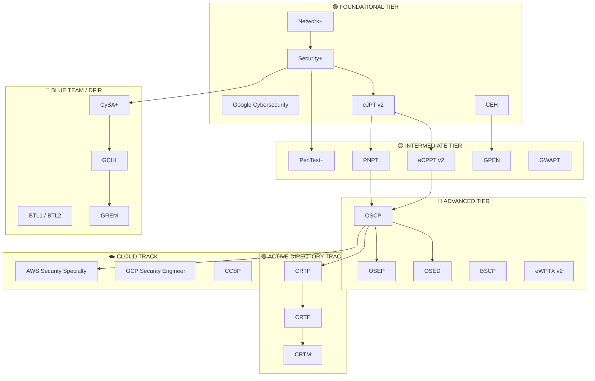
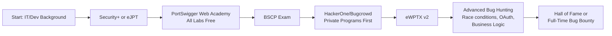
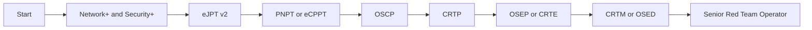
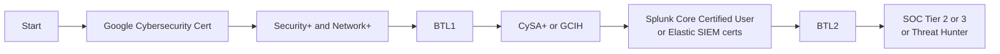
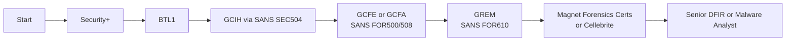

# Certifications Roadmap — CEH to OSCP to CRTP and Beyond

> **Volume 12 · Career Checklists & Reference Material**  
> Last Updated: September 2026 | Maintainer: VAPT Master Notes Project

---

## Table of Contents

1. [Why Certifications Matter](#1-why-certifications-matter)
2. [Certification Tiers Overview](#2-certification-tiers-overview)
3. [Foundational Certifications](#3-foundational-certifications)
4. [Intermediate Certifications](#4-intermediate-certifications)
5. [Advanced Certifications](#5-advanced-certifications)
6. [Active Directory Specific Certifications](#6-active-directory-specific-certifications)
7. [Cloud Security Certifications](#7-cloud-security-certifications)
8. [Defensive / Blue Team Certifications](#8-defensive--blue-team-certifications)
9. [Recommended Study Paths](#9-recommended-study-paths)
10. [Free Learning Resources](#10-free-learning-resources)
11. [Paid Learning Resources](#11-paid-learning-resources)
12. [Study Tips & Lab Setup](#12-study-tips--lab-setup)
13. [Summary Table — All Certifications](#13-summary-table--all-certifications)

---

## 1. Why Certifications Matter

### 1.1 Industry Perspective

Cybersecurity certifications serve as a **standardized signal** in a field where skills vary wildly and there is no universal degree pathway. In the hiring process, certifications accomplish several things:

- **Baseline filtering**: HR and applicant tracking systems (ATS) often filter resumes by certifications. Without Security+ or equivalent, many government and enterprise roles will never be reviewed by a human.
- **Proven commitment**: Obtaining a certification shows investment of time, money, and effort — qualities employers value.
- **Knowledge benchmarking**: Certifications define a minimum knowledge baseline for roles, especially in regulated industries like finance, healthcare, and government contracting.
- **Client trust**: In consulting and VAPT roles, clients frequently require contractors to hold specific certifications (e.g., OSCP, CREST, GPEN) before authorizing a penetration test.

### 1.2 Employer Expectations by Role

| Role | Commonly Expected Certs |
|------|------------------------|
| SOC Analyst (Tier 1/2) | Security+, CySA+, BTL1 |
| Penetration Tester (Junior) | Security+, eJPT, CEH |
| Penetration Tester (Mid) | OSCP, PNPT, PenTest+ |
| Red Team Operator | OSCP, CRTP, CRTE, OSEP |
| Cloud Security Engineer | CCSP, AWS Security Specialty |
| Malware Analyst / DFIR | GREM, GCIH, GCFE |
| Application Security | BSCP, eWPTX, GWEB |

### 1.3 The Government & Compliance Angle

The U.S. Department of Defense **Directive 8570/8140** mandates certifications for all personnel with privileged access to DoD information systems. Specific IAT/IAM/IASAE categories require:

- **IAT Level II**: Security+, CCNA-Security, CySA+
- **IAT Level III**: CISM, GCED, GCIH
- **CSSP Analyst**: CEH, CFR, CySA+
- **CSSP Incident Responder**: CEH, GCIH, GCFA

Without these, employment in DoD-adjacent contractors (Northrop Grumman, Raytheon, Booz Allen, SAIC) is effectively impossible.

### 1.4 Limitations of a Cert-Only Approach

> **Critical Warning**: Certifications are a floor, not a ceiling. Over-reliance on certifications without practical skills leads to a well-known phenomenon in the industry: **"paper tigers"** — professionals who can pass exams but cannot perform real-world work.

Key limitations to understand:

- **MCQ exams test memory, not skill**: CompTIA, EC-Council, and (ISC)² exams are largely multiple-choice. Passing them proves knowledge of definitions and concepts, not hands-on capability.
- **Certification decay**: Security knowledge becomes outdated rapidly. A Security+ from 2018 and one from 2024 represent dramatically different knowledge bases.
- **Practical skill gap**: Labs, CTFs, bug bounty programs, and real-world engagements are irreplaceable. Certifications should complement — never substitute — hands-on practice.
- **The OSCP exception**: Performance-based certifications like OSCP, PNPT, and BSCP correlate much more strongly with actual competence because they require demonstrating skill under exam conditions.
- **Credential stuffing**: Some candidates accumulate certifications without deepening expertise. Employers (especially technical ones) now look for GitHub portfolios, write-ups, and bug bounty acknowledgments alongside certifications.

**Best practice**: Certify to open doors, but build skills to keep them open.

---

## 2. Certification Tiers Overview

### 2.1 The Four-Tier Model

Cybersecurity certifications span from entry-level compliance-oriented credentials all the way to elite, performance-based expert credentials recognized globally by red teams and researchers.



### 2.2 Progression Summary

| Tier | Target Audience | Time Investment | Cost Range |
|------|----------------|-----------------|------------|
| Foundational | Students, career changers, IT generalists | 1–6 months | $100–$950 |
| Intermediate | Junior security professionals with 1+ yr experience | 2–6 months | $200–$2,000 |
| Advanced | Mid-level pentesters and red teamers | 3–12 months | $800–$9,000 |
| Expert (AD/Cloud/DFIR) | Senior specialists | 6–18 months | $1,500–$10,000+ |

---

## 3. Foundational Certifications

### 3.1 CompTIA Network+ (N10-009)

| Field | Details |
|-------|---------|
| **Issuing Body** | CompTIA |
| **Exam Format** | MCQ + Performance-Based Questions (max 90 questions) |
| **Duration** | 90 minutes |
| **Passing Score** | 720 / 900 |
| **Validity** | 3 years (CE credits or retake) |
| **Cost** | ~$358 USD |
| **Difficulty** | 3 / 10 |
| **Prerequisites** | None (CompTIA A+ recommended) |

**What It Covers:**
- Networking fundamentals: OSI model, TCP/IP, subnetting (VLSM/CIDR)
- Network infrastructure: switches, routers, firewalls, load balancers
- Network operations: monitoring, documentation, policies
- Network security: AAA, VPNs, IDS/IPS, firewalls
- Network troubleshooting: methodology and tools (ping, traceroute, nmap basics)

**Ideal For:** IT helpdesk professionals transitioning to networking or security; anyone who needs a solid networking foundation before tackling security-focused certifications.

**Top Study Resources:**
- Professor Messer's free N10-009 course (professormesser.com)
- Mike Meyers All-in-One Network+ book
- Dion Training Network+ Udemy course
- ExamCompass practice tests
- Jason Dion's practice exams (Udemy)

---

### 3.2 CompTIA Security+ (SY0-701)

| Field | Details |
|-------|---------|
| **Issuing Body** | CompTIA |
| **Exam Format** | MCQ + Performance-Based Questions (max 90 questions) |
| **Duration** | 90 minutes |
| **Passing Score** | 750 / 900 |
| **Validity** | 3 years (CE credits or retake) |
| **Cost** | ~$392 USD |
| **Difficulty** | 4 / 10 |
| **Prerequisites** | Network+ recommended; 2 years IT with security focus |

**What It Covers (SY0-701 Domains):**
- General Security Concepts (12%)
- Threats, Vulnerabilities, and Mitigations (22%)
- Security Architecture (18%)
- Security Operations (28%)
- Security Program Management and Oversight (20%)

**Ideal For:** Anyone seeking entry into cybersecurity; DoD 8570 IAT Level II compliance; SOC analysts, security admins, and junior pentesters.

**Top Study Resources:**
- Professor Messer SY0-701 course (free on YouTube)
- Darril Gibson CompTIA Security+ Get Certified Get Ahead book
- Jason Dion Udemy Security+ course + practice tests
- Mike Chapple/David Seidl CompTIA Security+ Study Guide (Sybex)
- CompTIA CertMaster practice

---

### 3.3 Google Cybersecurity Certificate

| Field | Details |
|-------|---------|
| **Issuing Body** | Google (via Coursera) |
| **Exam Format** | Coursera graded quizzes and hands-on labs |
| **Duration** | ~6 months at 7 hrs/week (self-paced) |
| **Passing Score** | 80% per module |
| **Validity** | No expiry (non-renewing credential) |
| **Cost** | ~$49/month Coursera subscription (~$200–$300 total) |
| **Difficulty** | 2 / 10 |
| **Prerequisites** | None — complete beginner friendly |

**What It Covers:**
- Cybersecurity fundamentals and history
- Network security basics and Linux CLI
- SQL for security log analysis
- Python for automation
- SIEM tools (Splunk, Chronicle)
- Incident detection and response
- Portfolio-building projects

**Ideal For:** Absolute beginners with no IT background; career changers from non-technical fields; individuals who want a structured introduction before pursuing CompTIA certifications.

**Top Study Resources:**
- The course itself is self-contained on Coursera
- Google's supplemental reading materials
- Cybersecurity communities on Reddit (r/cybersecurity, r/learnprogramming)

---

### 3.4 EC-Council CEH — Certified Ethical Hacker (v13)

| Field | Details |
|-------|---------|
| **Issuing Body** | EC-Council |
| **Exam Format** | 125 MCQ (Knowledge) + 6-hour Practical exam (optional for CEH Master) |
| **Duration** | 4 hours (MCQ exam) |
| **Passing Score** | 70% (varies by form, typically 70–85%) |
| **Validity** | 3 years (ECE credits required) |
| **Cost** | ~$950–$1,199 (self-study voucher); ~$850 with approved training |
| **Difficulty** | 5 / 10 |
| **Prerequisites** | 2 years information security experience OR complete EC-Council training |

**What It Covers (19 Domains):**
- Footprinting and Reconnaissance
- Scanning Networks
- Enumeration
- Vulnerability Analysis
- System Hacking (gaining access, escalation, persistence)
- Malware Threats
- Sniffing, Social Engineering, DoS/DDoS
- Session Hijacking, Web Servers, Web Applications
- SQL Injection
- Wireless, Mobile, IoT, OT Hacking
- Cloud Computing, Cryptography

**Ideal For:** Corporate security professionals who need a widely-recognized certification for HR compliance; those working with clients who require "CEH-certified testers"; government contractors.

**Limitations:** The MCQ-only format means it is largely theoretical. The practical exam (CEH Practical / CEH Master) partially addresses this but is optional.

**Top Study Resources:**
- EC-Council official courseware (included in training)
- Matt Walker CEH All-in-One Exam Guide (McGraw-Hill)
- TotalSem CEH v12 Study Guide
- Practice tests on Boson, ExamTopics (use critically)
- iLabs virtual lab environment (EC-Council)

---

### 3.5 eLearnSecurity eJPT v2 (Junior Penetration Tester)

| Field | Details |
|-------|---------|
| **Issuing Body** | INE / eLearnSecurity |
| **Exam Format** | Fully practical — 35 questions answered via live lab environment |
| **Duration** | 48 hours access window |
| **Passing Score** | 70% (25/35 correct) |
| **Validity** | No expiry |
| **Cost** | ~$200 (exam voucher); INE Starter Pass included in some subscriptions |
| **Difficulty** | 3 / 10 |
| **Prerequisites** | None formally; INE Penetration Testing Student path recommended |

**What It Covers:**
- TCP/IP networking and routing
- Web application basics and attacks (SQLi, XSS)
- Manual enumeration with Nmap, Gobuster, Nikto
- Exploitation with Metasploit Framework
- Pivoting and tunneling concepts
- Basic post-exploitation and reporting

**Ideal For:** Beginners wanting their first practical hacking certification; students who want proof of hands-on capability before OSCP or PNPT.

**Top Study Resources:**
- INE Penetration Testing Student path (free tier access)
- TryHackMe Jr Penetration Tester pathway
- HackTheBox Starting Point machines
- TCM Security free YouTube content

---

## 4. Intermediate Certifications

### 4.1 CompTIA PenTest+ (PT0-003)

| Field | Details |
|-------|---------|
| **Issuing Body** | CompTIA |
| **Exam Format** | MCQ + Performance-Based Questions (max 85 questions) |
| **Duration** | 165 minutes |
| **Passing Score** | 750 / 900 |
| **Validity** | 3 years |
| **Cost** | ~$392 USD |
| **Difficulty** | 5 / 10 |
| **Prerequisites** | Network+, Security+, or 3–4 years hands-on experience |

**What It Covers:**
- Planning and scoping engagements
- Information gathering and vulnerability scanning
- Attacks: network, wireless, application, cloud, social engineering
- Reporting and communication
- Tools: Nmap, Metasploit, Burp Suite, Wireshark

**Ideal For:** Security professionals who need a compliance-recognized pentest credential; those in organizations that require CompTIA ecosystem certs.

**Top Study Resources:**
- Mike Chapple/David Seidl PenTest+ Study Guide (Sybex)
- Jason Dion Udemy PenTest+ course
- CompTIA PenTest+ official practice tests
- TryHackMe Jr Penetration Tester pathway

---

### 4.2 PNPT — Practical Network Penetration Tester (TCM Security)

| Field | Details |
|-------|---------|
| **Issuing Body** | TCM Security |
| **Exam Format** | 5-day practical exam + 24-hour report submission |
| **Duration** | 5 days hacking + 2 days reporting |
| **Passing Score** | Pass/Fail (reviewed by TCM assessors) |
| **Validity** | No expiry |
| **Cost** | ~$399 USD (includes course bundle) |
| **Difficulty** | 6 / 10 |
| **Prerequisites** | None formal; TCM course completion recommended |

**What It Covers:**
- OSINT and external reconnaissance
- Network scanning and enumeration
- Active Directory attacks (Kerberoasting, Pass-the-Hash, BloodHound)
- Web application testing fundamentals
- Post-exploitation and pivoting
- Professional penetration test report writing

**Ideal For:** Anyone seeking an affordable, practical alternative to OSCP; junior pentesters; those who want a real-world exam format without OffSec pricing; employers increasingly recognize this cert.

**Top Study Resources:**
- TCM Security Practical Ethical Hacking course (included)
- TCM Security Active Directory course (included)
- Heath Adams' YouTube channel (The Cyber Mentor)
- TryHackMe and HackTheBox for additional practice

---

### 4.3 eCPPT v2 — eLearnSecurity Certified Professional Penetration Tester

| Field | Details |
|-------|---------|
| **Issuing Body** | INE / eLearnSecurity |
| **Exam Format** | Fully practical — Letter of Engagement with report submission |
| **Duration** | 7-day exam + 7-day reporting window |
| **Passing Score** | Pass/Fail (professional report required) |
| **Validity** | No expiry |
| **Cost** | ~$400 (exam voucher); INE subscription recommended |
| **Difficulty** | 6 / 10 |
| **Prerequisites** | eJPT or equivalent experience |

**What It Covers:**
- Network penetration testing methodology
- Web application attacks
- Wi-Fi security testing
- Metasploit advanced usage
- Pivoting through networks
- Buffer overflow exploitation (32-bit)
- Professional report writing

**Ideal For:** OSCP aspirants who want a stepping stone; those who prefer a report-based practical exam format; security professionals in Europe where INE certs have strong recognition.

**Top Study Resources:**
- INE Penetration Testing Professional path
- TCM Practical Ethical Hacking course
- VulnHub machines (Kioptrix series, Mr-Robot)

---

### 4.4 GPEN — GIAC Penetration Tester

| Field | Details |
|-------|---------|
| **Issuing Body** | GIAC (SANS Institute) |
| **Exam Format** | 115 MCQ (open-book/proctored) |
| **Duration** | 3 hours |
| **Passing Score** | 74% |
| **Validity** | 4 years |
| **Cost** | ~$849 (exam only); ~$7,000–$9,000 with SANS SEC560 course |
| **Difficulty** | 6 / 10 |
| **Prerequisites** | SEC560 (recommended) or equivalent knowledge |

**What It Covers:**
- Comprehensive pentest planning and scoping
- Reconnaissance and target profiling
- Scanning, enumeration, and exploitation
- Password attacks and privilege escalation
- Pivoting and lateral movement
- Web application attacks

**Ideal For:** Corporate penetration testers; those with training budget who want SANS-quality curriculum; government contractors requiring GIAC credentials.

**Top Study Resources:**
- SANS SEC560: Enterprise Penetration Testing (official prep)
- GPEN index building (the "SANS book" method)
- Practice exams from GIAC's practice test portal

---

### 4.5 GWAPT — GIAC Web Application Penetration Tester

| Field | Details |
|-------|---------|
| **Issuing Body** | GIAC (SANS Institute) |
| **Exam Format** | 75 MCQ (open-book/proctored) |
| **Duration** | 2 hours |
| **Passing Score** | 70% |
| **Validity** | 4 years |
| **Cost** | ~$849 (exam only); ~$7,000–$9,000 with SANS SEC542 |
| **Difficulty** | 6 / 10 |
| **Prerequisites** | SEC542 (recommended) |

**What It Covers:**
- Web application architecture and HTTP fundamentals
- Injection attacks (SQLi, XSS, XXE, SSTI)
- Authentication and session management attacks
- CSRF, CORS, and clickjacking
- SSRF and logic flaws
- Web application fuzzing and API testing

**Ideal For:** Developers moving into application security; web-focused penetration testers; AppSec engineers.

**Top Study Resources:**
- SANS SEC542: Web Application Penetration Testing and Ethical Hacking
- PortSwigger Web Security Academy (free)
- OWASP Testing Guide v4.2

---

## 5. Advanced Certifications

### 5.1 OSCP — OffSec Certified Professional

> **Industry Gold Standard for Penetration Testers**

| Field | Details |
|-------|---------|
| **Issuing Body** | Offensive Security (OffSec) |
| **Exam Format** | 100% Practical — 24-hour exam + 24-hour report submission |
| **Duration** | 24 hours active exploitation + 24 hours report writing |
| **Passing Score** | 70 points (out of 100) |
| **Validity** | No expiry |
| **Cost** | ~$1,499 (90-day lab + exam); ~$999 (30-day); Learn One subscription ~$2,499/yr |
| **Difficulty** | 8 / 10 |
| **Prerequisites** | No formal prerequisite; strong Linux, networking, and scripting skills strongly recommended |

#### PWK Course (Penetration Testing with Kali Linux)

The PEN-200 course accompanying OSCP is one of the most comprehensive self-study penetration testing curricula available:

**Course Modules:**
1. Introduction to Cybersecurity and Pentesting Concepts
2. Report Writing for Penetration Testers
3. Information Gathering (passive + active)
4. Vulnerability Scanning with Nessus and Nmap NSE
5. Web Application Attacks (SQLi, XSS, directory traversal, file inclusion)
6. Locating Public Exploits and Fixing Exploit Code
7. Antivirus Evasion
8. Password Attacks (offline/online, Hashcat, Hydra)
9. Windows and Linux Privilege Escalation
10. Active Directory — Enumeration and Exploitation
11. Tunneling and Port Forwarding
12. The Metasploit Framework (limited use in exam)
13. Assembling the Pieces — exam simulation

#### Exam Structure

```
OSCP Exam Environment (100 points total)
├── Standalone Machines (3 machines)
│   ├── Machine 1: 20 points (10 low/10 high priv)
│   ├── Machine 2: 20 points (10 low/10 high priv)
│   └── Machine 3: 20 points (10 low/10 high priv)
└── Active Directory Set (1 domain — 40 points)
    ├── Client 1 (foothold)
    ├── Client 2 (lateral movement)
    └── Domain Controller (domain admin = 40 pts)
```

**Scoring Breakdown:**
- 10 pts: Low-privilege shell on standalone machine
- 10 pts: Privilege escalation on standalone machine
- 40 pts: Complete AD set (all-or-nothing for full credit)
- Bonus points: 10 pts available for completing 80%+ of course exercises + 30 lab machines

**Minimum passing = 70 points**

#### OSCP Exam Tips

1. **Enumerate thoroughly before exploiting** — the exam rewards methodical approach, not speed
2. **Take breaks** — after 4–5 hours, fatigue causes errors; 15-minute breaks restore focus
3. **Document everything in real-time** — screenshots, commands, timestamps; don't rely on memory
4. **Start with AD** — getting the full 40 points secures your pass before touching standalones
5. **Practice report writing** — a technically successful exam with a poor report can still fail you
6. **Master manual exploitation** — Metasploit is restricted to one machine in the exam
7. **Buffer overflow is predictable** — drill BOF methodology until it's automatic (if still on exam)
8. **Build a methodology checklist** — use it during the exam to avoid missing obvious vectors
9. **Sleep before the exam** — start well-rested; most people hit a wall at hour 12–15
10. **Submit screenshots of flags** — local.txt and proof.txt must be visible with hostname and ip addr

**Top Study Resources:**
- OffSec PEN-200 course (required)
- TJNull's OSCP prep list (HackTheBox + VulnHub machines)
- ippsec YouTube channel (HTB walkthroughs)
- HackTheBox Pro Labs (Offshore, RastaLabs for AD practice)
- TCM Windows/Linux Privilege Escalation courses
- PortSwigger Web Academy for web modules

---

### 5.2 OSEP — OffSec Experienced Penetration Tester

| Field | Details |
|-------|---------|
| **Issuing Body** | Offensive Security (OffSec) |
| **Exam Format** | Practical — 48-hour exam (capture secret.txt via AD/network) |
| **Duration** | 48 hours |
| **Passing Score** | Pass/Fail (obtain secret.txt on exam network) |
| **Validity** | No expiry |
| **Cost** | ~$1,299 (course + exam); Learn One subscription |
| **Difficulty** | 9 / 10 |
| **Prerequisites** | OSCP strongly recommended |

**What It Covers (PEN-300):**
- Advanced evasion techniques (AV/EDR bypass)
- Custom C# payload development
- Process injection and migration
- Advanced Active Directory attacks (LAPS bypass, constrained/unconstrained delegation)
- Microsoft SQL Server attacks and lateral movement
- Kerberos delegation abuse (S4U2Proxy, S4U2Self)
- AMSI bypass techniques
- Custom shellcode runners and droppers
- Advanced pivoting through complex network topologies

**Ideal For:** OSCP holders moving into red team operations; offensive security engineers who need EDR evasion skills.

---

### 5.3 OSED — OffSec Exploit Developer

| Field | Details |
|-------|---------|
| **Issuing Body** | Offensive Security (OffSec) |
| **Exam Format** | Practical — 48-hour exam (develop working exploits) |
| **Duration** | 48 hours |
| **Passing Score** | Pass/Fail |
| **Validity** | No expiry |
| **Cost** | ~$1,299 (course + exam) |
| **Difficulty** | 9 / 10 |
| **Prerequisites** | OSCP; strong Python, x86 assembly understanding |

**What It Covers (EXP-301):**
- x86 Windows exploit development
- WinDbg usage for exploit development
- SEH (Structured Exception Handler) overflows
- ASLR and DEP bypass techniques
- ROP chain construction
- Format string vulnerabilities
- Custom shellcode writing
- Heap spraying and use-after-free vulnerabilities

**Ideal For:** Exploit developers, vulnerability researchers, and offensive security engineers working with custom tooling.

---

### 5.4 BSCP — Burp Suite Certified Practitioner

| Field | Details |
|-------|---------|
| **Issuing Body** | PortSwigger |
| **Exam Format** | Practical — 4-hour exam with 2 web application targets |
| **Duration** | 4 hours |
| **Passing Score** | Complete both applications (read secret from admin account) |
| **Validity** | No expiry |
| **Cost** | ~$99 USD per attempt |
| **Difficulty** | 8 / 10 |
| **Prerequisites** | None formal; deep web application security knowledge required |

**What It Covers:**
- All OWASP Top 10 and beyond
- SQL injection (in-band, blind, time-based)
- XSS (reflected, stored, DOM-based)
- CSRF, CORS, and clickjacking
- SSRF (basic and advanced)
- XXE injection
- Insecure deserialization
- Authentication bypass techniques
- Web cache poisoning
- HTTP request smuggling
- OAuth 2.0 flaws
- JWT attacks
- GraphQL API vulnerabilities
- Prototype pollution
- Business logic vulnerabilities

**Ideal For:** Web application penetration testers; bug bounty hunters; AppSec engineers; anyone wanting to master Burp Suite professionally.

**Top Study Resources:**
- PortSwigger Web Security Academy (free — all labs)
- Intigriti and HackerOne write-ups
- Rana Khalil YouTube channel (BSCP-focused)

---

### 5.5 eWPTX v2 — eLearnSecurity Web Application Penetration Tester eXtreme

| Field | Details |
|-------|---------|
| **Issuing Body** | INE / eLearnSecurity |
| **Exam Format** | Practical — letter of engagement with report |
| **Duration** | 7-day exam + 7-day reporting window |
| **Passing Score** | Pass/Fail (professional report required) |
| **Validity** | No expiry |
| **Cost** | ~$400 (exam voucher) |
| **Difficulty** | 7 / 10 |
| **Prerequisites** | eWPT or equivalent web security knowledge |

**What It Covers:**
- Advanced XSS and filter bypass techniques
- Advanced SQL injection (NoSQL, ORM)
- SSRF, XXE, and SSTI attacks
- Advanced authentication attacks
- Deserialization vulnerabilities
- Web services and API security (REST, SOAP, GraphQL)
- Advanced Burp Suite techniques

**Ideal For:** Web pentesters seeking an advanced practical credential; bug bounty hunters wanting structured curriculum.

---

## 6. Active Directory Specific Certifications

### 6.1 CRTP — Certified Red Team Professional

| Field | Details |
|-------|---------|
| **Issuing Body** | AlteredSecurity (formerly Pentester Academy) |
| **Exam Format** | Practical — 24-hour lab exam + report submission |
| **Duration** | 24 hours + 48-hour report window |
| **Passing Score** | Pass/Fail |
| **Validity** | No expiry |
| **Cost** | ~$249 (bootcamp with exam voucher) |
| **Difficulty** | 6 / 10 |
| **Prerequisites** | Basic Windows/AD knowledge; OSCP or equivalent experience helpful |

**What It Covers:**
- Active Directory architecture and trust relationships
- Domain enumeration with PowerView and BloodHound
- Local privilege escalation in AD environments
- Domain privilege escalation:
  - Kerberoasting
  - AS-REP Roasting
  - DCSync attacks
  - Unconstrained Delegation
  - Constrained Delegation
  - Resource-Based Constrained Delegation (RBCD)
- Domain persistence:
  - Golden Ticket attacks
  - Silver Ticket attacks
  - Skeleton Key
  - DSRM abuse
  - AdminSDHolder
- Cross-domain and cross-forest attacks
- MSSQL attacks in AD environments
- Bypassing defenses: PowerShell AMSI, Defender, CLM

**Practical Exam Environment:**
- 5 Windows machines in a multi-domain AD forest
- Must compromise all machines and document findings
- Report must demonstrate understanding, not just flag capture

**Ideal For:** OSCP holders wanting AD depth; pentesters who encounter AD environments regularly; red team operators; anyone preparing for OSEP.

**Top Study Resources:**
- AlteredSecurity Attacking and Defending Active Directory lab (Bootcamp)
- BloodHound documentation and SharpHound collection
- Harmj0y's blog (SpecterOps)
- S1ckB0y1337 Active Directory Cheat Sheet (GitHub)

---

### 6.2 CRTE — Certified Red Team Expert

| Field | Details |
|-------|---------|
| **Issuing Body** | AlteredSecurity |
| **Exam Format** | Practical — 48-hour lab exam + report |
| **Duration** | 48 hours + 48-hour report window |
| **Passing Score** | Pass/Fail |
| **Validity** | No expiry |
| **Cost** | ~$399 (bootcamp with exam voucher) |
| **Difficulty** | 8 / 10 |
| **Prerequisites** | CRTP or equivalent |

**What It Covers (beyond CRTP):**
- Advanced AD persistence mechanisms
- PAM (Privileged Access Management) trust abuse
- AD CS (Active Directory Certificate Services) attacks:
  - ESC1 through ESC8 vulnerabilities
  - Certificate template abuse
  - CA abuse
- Trust abuse across forests with SID filtering bypass
- Azure AD and hybrid identity attacks
- Advanced OPSEC techniques
- Custom C# tooling usage
- Detection evasion in monitored environments
- LAPS (Local Administrator Password Solution) attacks

**Ideal For:** Advanced red teamers; those preparing for CRTM or OSEP; security engineers who need deep AD attack knowledge.

---

### 6.3 CRTM — Certified Red Team Master

| Field | Details |
|-------|---------|
| **Issuing Body** | AlteredSecurity |
| **Exam Format** | Practical — 48-hour complex multi-forest exam |
| **Duration** | 48 hours + 48-hour report window |
| **Passing Score** | Pass/Fail |
| **Validity** | No expiry |
| **Cost** | ~$599 (bootcamp with exam voucher) |
| **Difficulty** | 9 / 10 |
| **Prerequisites** | CRTE strongly recommended |

**What It Covers:**
- Multi-forest, multi-domain complex attack paths
- Advanced Azure AD integration attacks
- Custom tooling and C2 framework usage
- Adversary simulation (APT-level techniques)
- Detection and bypass of enterprise security controls (EDR, PAM, JIT)
- Advanced AD CS exploitation
- OPSEC-conscious attack chains
- Red team reporting at enterprise level

**Ideal For:** Senior red team operators; red team leads; security consultants running adversary simulations.

---

## 7. Cloud Security Certifications

### 7.1 AWS Certified Security — Specialty (SCS-C02)

| Field | Details |
|-------|---------|
| **Issuing Body** | Amazon Web Services |
| **Exam Format** | 65 MCQ / scenario-based questions |
| **Duration** | 170 minutes |
| **Passing Score** | 750 / 1000 |
| **Validity** | 3 years |
| **Cost** | ~$300 USD |
| **Difficulty** | 7 / 10 |
| **Prerequisites** | AWS Solutions Architect Associate or equivalent; 5+ years IT security experience |

**What It Covers:**
- IAM advanced (roles, policies, SCP, permission boundaries)
- KMS, CloudHSM, and secrets management (Secrets Manager, SSM Parameter Store)
- GuardDuty, Security Hub, Inspector, Macie
- VPC security (NACLs, Security Groups, VPC Flow Logs)
- CloudTrail, Config, and logging for forensics
- S3 security and encryption
- Incident response in AWS environments
- Network security (WAF, Shield, Firewall Manager)

**Ideal For:** Cloud security engineers; DevSecOps practitioners; pentesters moving into cloud attack/defense.

**Top Study Resources:**
- Adrian Cantrill AWS course
- A Cloud Guru AWS Security Specialty path
- AWS official practice exam
- CloudGoat (Rhino Security Labs) — vulnerable AWS environment

---

### 7.2 Google Professional Cloud Security Engineer

| Field | Details |
|-------|---------|
| **Issuing Body** | Google Cloud |
| **Exam Format** | 50–60 MCQ / scenario-based |
| **Duration** | 120 minutes |
| **Passing Score** | Not publicly disclosed (~70%) |
| **Validity** | 2 years |
| **Cost** | ~$200 USD |
| **Difficulty** | 7 / 10 |
| **Prerequisites** | GCP Associate Cloud Engineer or equivalent |

**What It Covers:**
- IAM in GCP (service accounts, roles, VPC Service Controls)
- Data security (CMEK, Cloud KMS, DLP API)
- Network security (Cloud Armor, VPC firewall policies)
- Security monitoring (Security Command Center, Chronicle SIEM)
- Compliance and governance on GCP
- Incident response on GCP

**Top Study Resources:**
- Google Cloud Skills Boost learning path
- Dan Sullivan Professional Cloud Security Engineer guide (Sybex)
- GCP free tier for hands-on labs

---

### 7.3 CCSP — Certified Cloud Security Professional

| Field | Details |
|-------|---------|
| **Issuing Body** | (ISC)² |
| **Exam Format** | 125 MCQ (CAT — Computerized Adaptive Testing) |
| **Duration** | 4 hours |
| **Passing Score** | 700 / 1000 |
| **Validity** | 3 years (CPE credits) |
| **Cost** | ~$599 USD |
| **Difficulty** | 7 / 10 |
| **Prerequisites** | 5 years IT experience (including 3 in IT security, 1 in cloud security); CISSP holders waived |

**What It Covers (6 Domains):**
1. Cloud Concepts, Architecture and Design
2. Cloud Data Security
3. Cloud Platform and Infrastructure Security
4. Cloud Application Security
5. Cloud Security Operations
6. Legal, Risk and Compliance

**Ideal For:** Cloud architects, cloud security managers, security engineers working in multi-cloud environments; those needing a vendor-neutral cloud security credential.

**Top Study Resources:**
- Mike Chapple/David Seidl CCSP Official Study Guide
- Prabh Nair Coffee Shots videos (free on YouTube)
- (ISC)² official practice tests

---

## 8. Defensive / Blue Team Certifications

### 8.1 BTL1 & BTL2 — Blue Team Labs One and Two

| Field | Details |
|-------|---------|
| **Issuing Body** | Security Blue Team |
| **Exam Format** | Practical — 24-hour hands-on exam |
| **Duration** | 24 hours |
| **Passing Score** | BTL1: 70%; BTL2: 70% |
| **Validity** | No expiry |
| **Cost** | BTL1: ~$399; BTL2: ~$399 |
| **Difficulty** | BTL1: 4/10; BTL2: 7/10 |
| **Prerequisites** | None (BTL1); BTL1 or equivalent (BTL2) |

**BTL1 Covers:**
- Phishing analysis (header analysis, URL analysis, sandbox)
- Threat intelligence fundamentals (MITRE ATT&CK)
- Digital forensics (FTK Imager, Autopsy, Volatility)
- SIEM fundamentals (Splunk)
- Incident response workflow

**BTL2 Covers:**
- Advanced threat hunting with Splunk/ELK
- Malware traffic analysis (Wireshark, Suricata)
- Advanced DFIR techniques
- Threat intelligence correlation
- Advanced log analysis and alerting

**Ideal For:** Aspiring SOC analysts; DFIR professionals; those from non-security IT backgrounds transitioning to blue team roles.

---

### 8.2 CompTIA CySA+ (CS0-003)

| Field | Details |
|-------|---------|
| **Issuing Body** | CompTIA |
| **Exam Format** | MCQ + Performance-Based Questions (max 85 questions) |
| **Duration** | 165 minutes |
| **Passing Score** | 750 / 900 |
| **Validity** | 3 years |
| **Cost** | ~$392 USD |
| **Difficulty** | 5 / 10 |
| **Prerequisites** | Security+ or 4 years IT experience |

**What It Covers:**
- Security operations and monitoring (SIEM, SOAR)
- Vulnerability management lifecycle
- Incident response procedures
- Threat intelligence and threat hunting
- Software and systems security analysis
- Compliance and assessment

**Ideal For:** SOC Tier 2/3 analysts; security operations engineers; DoD 8570 CSSP Analyst compliance.

---

### 8.3 GCIH — GIAC Certified Incident Handler

| Field | Details |
|-------|---------|
| **Issuing Body** | GIAC (SANS Institute) |
| **Exam Format** | 106 MCQ (open-book/proctored) |
| **Duration** | 4 hours |
| **Passing Score** | 73% |
| **Validity** | 4 years |
| **Cost** | ~$849 (exam only); ~$7,000–$9,000 with SANS SEC504 |
| **Difficulty** | 6 / 10 |
| **Prerequisites** | SEC504 (recommended) |

**What It Covers:**
- Incident handling process (PICERL framework)
- Computer crime investigation and legal considerations
- Hacker techniques, tools, and incident indicators
- Worm and bot computer defense
- Network infrastructure attacks
- Scanning, enumeration, and exploitation from defender perspective
- Containment, eradication, and recovery procedures

**Ideal For:** SOC analysts, incident response teams, threat hunters; DoD 8570 CSSP Incident Responder compliance.

---

### 8.4 GREM — GIAC Reverse Engineering Malware

| Field | Details |
|-------|---------|
| **Issuing Body** | GIAC (SANS Institute) |
| **Exam Format** | 66 MCQ (open-book/proctored) |
| **Duration** | 2 hours |
| **Passing Score** | 71% |
| **Validity** | 4 years |
| **Cost** | ~$849 (exam only); ~$7,000–$9,000 with SANS FOR610 |
| **Difficulty** | 8 / 10 |
| **Prerequisites** | FOR610 (recommended); strong assembly/C knowledge helpful |

**What It Covers:**
- Malware analysis lab setup (REMnux, FlareVM)
- Static analysis (strings, PE headers, imports)
- Dynamic analysis (process monitor, Wireshark, ApateDNS)
- Disassembly with IDA Pro and Ghidra
- Debugging with x64dbg/OllyDbg
- Unpacking malware
- Analyzing obfuscated malware (packing, encoding)
- Document format malware (macros, PDFs, Office documents)
- Web-based malware (JavaScript deobfuscation)
- Rootkit and bootkit analysis

**Ideal For:** Malware analysts, threat intelligence analysts, advanced incident responders; one of the most respected blue team certifications globally.

---

## 9. Recommended Study Paths

### 9.1 Bug Bounty Hunter Path



**Milestones:**
1. **Month 1–2**: Security+ + Web fundamentals (HTTP, JavaScript, SQL)
2. **Month 3–4**: Complete all PortSwigger labs (apprentice + practitioner level)
3. **Month 5–6**: First private bug bounty programs; BSCP exam attempt
4. **Month 7–12**: Public programs + eWPTX + specialize in one vulnerability class

**Key skills to develop**: Burp Suite mastery, JavaScript analysis, API fuzzing, HTTP request manipulation, recon automation (Amass, subfinder, httpx)

---

### 9.2 Red Teamer Path



**Milestones:**
1. **Month 1–3**: Network+, Security+, Linux/Windows fundamentals
2. **Month 3–6**: eJPT + TryHackMe Jr Pentester path + HackTheBox Starting Point
3. **Month 6–12**: PNPT (budget) or eCPPT + HTB Pro machines
4. **Month 12–18**: OSCP — this is the core commitment; allocate 90-day labs
5. **Month 18–24**: CRTP for AD specialization
6. **Month 24+**: OSEP + CRTE — senior operator territory

**Key skills**: PowerShell, C# development, Cobalt Strike/Havoc/Sliver C2 usage, evasion techniques, AD attack paths

---

### 9.3 SOC Analyst Path



**Milestones:**
1. **Month 1–3**: Google Cybersecurity Cert + Security+ prep
2. **Month 4–6**: Security+ exam + BTL1 labs (included in training)
3. **Month 6–9**: BTL1 exam + CySA+ study
4. **Month 9–12**: CySA+ + GCIH (SANS if budget allows)
5. **Month 12–18**: Splunk/ELK specialization + BTL2

**Key tools**: Splunk, ELK Stack, Suricata/Snort, Wireshark, Velociraptor, TheHive/MISP, MITRE ATT&CK Navigator

---

### 9.4 DFIR Specialist Path



**Milestones:**
1. **Month 1–6**: Security+, BTL1, basic forensics tools (Autopsy, FTK Imager, Volatility)
2. **Month 6–12**: GCIH — incident response methodology
3. **Month 12–18**: GCFA (Advanced Forensics) — in-depth Windows/Linux forensics
4. **Month 18–24**: GREM — malware analysis specialization
5. **Month 24+**: Specialize in memory forensics, mobile forensics, or threat intelligence

**Key tools**: Volatility3, FTK Imager, Autopsy, Velociraptor, YARA, Ghidra, IDA Pro, REMnux, FlareVM, x64dbg

---

## 10. Free Learning Resources

### 10.1 TryHackMe (tryhackme.com)

- **Cost**: Free tier available; Premium ~$14/month
- **Best For**: Complete beginners to intermediate learners
- **Notable Paths**: Pre-Security, Jr Penetration Tester, SOC Level 1, Red Teaming
- **Format**: Guided rooms with hints and step-by-step walkthroughs
- **Certifications Prep**: eJPT, Security+, BTL1, PNPT

**Key Free Rooms:**
- Learn Linux
- Intro to Networking
- OWASP Top 10
- Metasploit
- Active Directory Basics
- Splunk: Basics

---

### 10.2 HackTheBox (hackthebox.com)

- **Cost**: Free machines available; VIP ~$14/month for retired machines
- **Best For**: Intermediate to advanced practitioners
- **Notable Features**: Academy (structured learning), Pro Labs (enterprise networks)
- **Format**: Unguided CTF-style machines; Academy has structured modules
- **Certifications Prep**: OSCP (TJNull list), CPTS (HTB-native cert), CRTP

**Key Free Content:**
- Starting Point machines (guided walkthroughs available)
- Academy free modules (Linux Fundamentals, Web Requests, Intro to Networking)

---

### 10.3 PicoCTF (picoctf.org)

- **Cost**: Completely free
- **Best For**: Students and absolute beginners; intro to CTF mindset
- **Format**: Jeopardy-style CTF challenges (always-on practice platform)
- **Topics**: Binary exploitation, cryptography, forensics, reverse engineering, web exploitation
- **Certifications Prep**: Foundation for all certifications

---

### 10.4 PortSwigger Web Security Academy (portswigger.net/web-security)

- **Cost**: Completely free
- **Best For**: Web application security learners at all levels
- **Format**: Theory + hands-on labs (500+ labs total)
- **Topics Covered**: All major web vulnerabilities including advanced topics
- **Certifications Prep**: BSCP, eWPTX, OSCP (web modules), GWAPT

**Learning Path Recommendation:**
1. Complete all Apprentice labs first
2. Move to Practitioner labs by category
3. Attempt Expert labs after BSCP prep
4. Use Mystery Lab for exam simulation

---

### 10.5 TCM Security Free Courses (youtube.com/@TCMSecurityAcademy)

- **Cost**: Free on YouTube
- **Best For**: Pentest beginners; PNPT/OSCP prep
- **Notable Content**:
  - Practical Ethical Hacking (partial)
  - Linux for Ethical Hackers
  - Python 101 for Hackers
  - Open-Source Intelligence (OSINT) Fundamentals
  - Movement, Pivoting and Persistence

---

### 10.6 VulnHub (vulnhub.com)

- **Cost**: Completely free
- **Best For**: Offline lab practice; OSCP prep
- **Format**: Download vulnerable VMs and run locally in VMware/VirtualBox
- **Notable VMs**: Kioptrix series, Mr. Robot, DC series, HarryPotter series
- **Certifications Prep**: OSCP (TJNull VulnHub list)

---

## 11. Paid Learning Resources

### 11.1 Offensive Security (OffSec) — offensive-security.com

- **Best For**: OSCP, OSEP, OSED, OSWE preparation
- **Learn One subscription**: ~$2,499/year (all PEN/EXP/WEB paths)
- **Individual courses**: $999–$1,499 (includes lab time + 1 exam attempt)
- **Unique value**: Industry-recognized lab environments; official OSCP prep is PEN-200
- **Lab networks**: 75+ machines, Active Directory labs included

---

### 11.2 TCM Security — tcmsecurity.com

- **Best For**: PNPT, budget-conscious pentest learners
- **Subscription**: ~$30/month (all courses)
- **Individual courses**: $30–$97 per course
- **Notable Courses**:
  - Practical Ethical Hacking (~$30)
  - Windows Privilege Escalation for Beginners
  - Linux Privilege Escalation for Beginners
  - Practical Active Directory Basics
  - Practical Malware Analysis and Triage
  - OSINT Fundamentals

---

### 11.3 INE / eLearnSecurity — ine.com

- **Best For**: eJPT, eCPPT, eWPTX, eMAPT preparation
- **Premium subscription**: ~$749/year
- **Business subscription**: ~$2,999/year
- **Notable Paths**:
  - Penetration Testing Student (free tier)
  - Penetration Testing Professional
  - Web Application Penetration Testing
  - Mobile Application Security

---

### 11.4 SANS Institute — sans.org

- **Best For**: GPEN, GWAPT, GCIH, GREM preparation; enterprise training
- **Cost**: $7,000–$9,000 per course (includes certification exam)
- **Formats**: In-person events, OnDemand (self-paced), vLive (virtual)
- **Work Study Program**: Discounted SANS training for financial assistance
- **Notable Courses**:
  - SEC504: Hacker Tools, Techniques, and Incident Handling
  - SEC560: Enterprise Penetration Testing
  - SEC542: Web App Penetration Testing
  - FOR610: Reverse-Engineering Malware
  - FOR508: Advanced Incident Response

---

### 11.5 PentesterLab Pro — pentesterlab.com

- **Best For**: Web application security deep dives
- **Cost**: ~$20/month or ~$200/year (Pro)
- **Format**: Progressive badge system with hands-on lab exercises
- **Notable Courses**:
  - Unix badge (Linux fundamentals)
  - Web for Pentester series
  - JWT attacks
  - Code review (PHP, Ruby, Python, Go)
  - Android security

---

## 12. Study Tips & Lab Setup

### 12.1 Lab Environment Setup

#### Minimum Hardware Requirements

| Component | Minimum | Recommended |
|-----------|---------|-------------|
| CPU | Quad-core (i5/Ryzen 5) | 8-core (i7/Ryzen 7) or better |
| RAM | 16 GB | 32 GB |
| Storage | 500 GB SSD | 1 TB NVMe SSD |
| Network | 100 Mbps | 1 Gbps |

#### Recommended Software Stack

```bash
# Hypervisor: VMware Workstation Pro or VirtualBox
# Primary Attack VM: Kali Linux or Parrot OS
# Windows Target VMs:
#   - Windows Server 2019/2022 (AD lab)
#   - Windows 10/11 (workstation targets)
# Linux Target VMs:
#   - Ubuntu 20.04/22.04
#   - CentOS / Debian (for service practice)

# AD Lab Setup (minimum)
# VM1: Windows Server 2022 — Domain Controller (DC01)
# VM2: Windows Server 2022 — Member Server (FS01)
# VM3: Windows 10 Pro — Workstation (WS01)
# VM4: Kali Linux — Attacker machine

# Network configuration: Internal network / NAT
# All VMs on same internal network for AD communication
```

#### Automated AD Lab Setup

```bash
# Detection Lab by Chris Long (GitHub: clong/DetectionLab)
# Vagrant + VirtualBox/VMware setup
git clone https://github.com/clong/DetectionLab.git
cd DetectionLab/Vagrant
vagrant up

# GOAD (Game of Active Directory) by Orange CyberDefense
git clone https://github.com/Orange-Cyberdefense/GOAD.git
cd GOAD
# Follow setup instructions for Vagrant/Ansible provisioning
```

---

### 12.2 Note-Taking Methodology

Effective note-taking is a career-defining skill in penetration testing. Poor notes lead to failed exam reports and incomplete client deliverables.

#### Recommended Tools

| Tool | Use Case | Cost |
|------|----------|------|
| **Obsidian** | Linked knowledge base, offline, markdown | Free |
| **CherryTree** | Hierarchical notes, pentest-focused | Free |
| **Notion** | Cloud-based, shareable | Free/Paid |
| **Joplin** | Open-source Obsidian alternative | Free |
| **KeepNote** | Lightweight, OSCP-popular | Free |

#### Note-Taking Template for Each Target

```markdown
# Target: [IP/Hostname]
## Enumeration
### Nmap Output
nmap -sC -sV -oA target [IP]

### Open Services
| Port | Service | Version | Notes |

## Exploitation
### Vulnerability Found
- CVE/technique:
- Tool/exploit used:
- Command run:
- Screenshot path:

## Post-Exploitation
### User Shell
- Username:
- Hash:
- Cracked password:

### Privilege Escalation
- Technique used:
- Evidence captured:

## Flags
- local.txt: [value]
- proof.txt: [value]
```

---

### 12.3 CTF Practice Strategy

1. **Start with guided content** (TryHackMe rooms) before unguided CTFs
2. **Use the 20-minute rule**: Spend 20 minutes stuck before consulting a hint
3. **Write up every machine** you complete — even simple ones build writing habit
4. **Follow ippsec on YouTube** for HTB walkthroughs after attempting machines
5. **Track your progress** in a spreadsheet: machine name, IP, techniques used, time spent
6. **Revisit old machines** after learning new techniques — perspective changes dramatically

#### OSCP-Specific CTF Prep List (TJNull's Curated List)

| Platform | Machine Name | Focus Area |
|----------|-------------|-----------|
| HackTheBox | Lame, Shocker, Bashed | Linux fundamentals |
| HackTheBox | Beep, Nibbles, Optimum | Web + Windows |
| HackTheBox | Legacy, Blue, Jerry | Windows exploitation |
| HackTheBox | Active, Forest, Resolute | Active Directory |
| HackTheBox | Monteverde, Cascade | AD + Azure |
| VulnHub | Kioptrix 1–5 | Classic pentest |
| VulnHub | DC series | Linux privilege escalation |
| VulnHub | SkyTower | Multi-stage |

---

### 12.4 Report Writing Practice

A penetration test report is the final deliverable that justifies your value. Practice this from day one.

#### Report Structure Template

```
1. Executive Summary (1-2 pages)
   - Engagement overview
   - Critical findings summary
   - Business risk assessment
   - Remediation priority matrix

2. Technical Findings
   For each finding:
   - Finding title and severity (Critical/High/Medium/Low/Info)
   - CVSS score
   - Affected system(s)
   - Description of vulnerability
   - Evidence (screenshots, commands, output)
   - Business impact
   - Remediation recommendation
   - References (CVE, OWASP, vendor advisory)

3. Appendices
   - Scope definition
   - Testing methodology
   - Tools used
   - Raw output (optional)
```

#### Severity Ratings Table

| Severity | CVSS Range | Example |
|----------|-----------|---------|
| Critical | 9.0–10.0 | Unauthenticated RCE leading to domain admin |
| High | 7.0–8.9 | Authenticated RCE, privilege escalation to root |
| Medium | 4.0–6.9 | SQL injection (requires auth), stored XSS |
| Low | 0.1–3.9 | Open redirect, information disclosure |
| Informational | N/A | Security headers missing, outdated TLS |

**Free report templates:**
- TCM Security public report template (GitHub: hmaverickadams/TCM-Security-Sample-Pentest-Report)
- OSCP exam report template (OffSec GitHub)
- Serpico report generation tool

---

## 13. Summary Table — All Certifications

| Certification | Issuing Body | Format | Approx. Cost (USD) | Difficulty (1-10) | Focus Area |
|---------------|-------------|--------|---------------------|-------------------|-----------|
| Network+ | CompTIA | MCQ+PBQ | $358 | 3 | Networking Fundamentals |
| Security+ | CompTIA | MCQ+PBQ | $392 | 4 | Security Fundamentals |
| Google Cybersecurity | Google/Coursera | Lab+Quiz | ~$200–300 | 2 | IT Security Intro |
| CEH | EC-Council | MCQ (+Practical opt.) | $950–1,199 | 5 | Ethical Hacking Theory |
| eJPT v2 | INE/eLearnSecurity | Practical Lab | $200 | 3 | Intro Penetration Testing |
| PenTest+ | CompTIA | MCQ+PBQ | $392 | 5 | Penetration Testing |
| PNPT | TCM Security | Practical+Report | $399 | 6 | Network Penetration Testing |
| eCPPT v2 | INE/eLearnSecurity | Practical+Report | $400 | 6 | Professional Pentest |
| GPEN | GIAC/SANS | MCQ (open book) | $849+ | 6 | Penetration Testing |
| GWAPT | GIAC/SANS | MCQ (open book) | $849+ | 6 | Web App Penetration Testing |
| OSCP | OffSec | Practical 24hr+Report | $1,499 | 8 | Professional Penetration Testing |
| OSEP | OffSec | Practical 48hr | $1,299 | 9 | Advanced Red Team / Evasion |
| OSED | OffSec | Practical 48hr | $1,299 | 9 | Exploit Development |
| BSCP | PortSwigger | Practical 4hr | $99 | 8 | Web Application Security |
| eWPTX v2 | INE/eLearnSecurity | Practical+Report | $400 | 7 | Advanced Web App Pentest |
| CRTP | AlteredSecurity | Practical 24hr+Report | $249 | 6 | Active Directory Red Team |
| CRTE | AlteredSecurity | Practical 48hr+Report | $399 | 8 | Advanced AD / Azure Red Team |
| CRTM | AlteredSecurity | Practical 48hr+Report | $599 | 9 | Expert Multi-Forest Red Team |
| AWS Security Specialty | Amazon AWS | MCQ | $300 | 7 | AWS Cloud Security |
| GCP Security Engineer | Google Cloud | MCQ | $200 | 7 | GCP Cloud Security |
| CCSP | (ISC)² | MCQ (CAT) | $599 | 7 | Cloud Security (Vendor-Neutral) |
| BTL1 | Security Blue Team | Practical 24hr | $399 | 4 | Blue Team / SOC Analyst |
| BTL2 | Security Blue Team | Practical 24hr | $399 | 7 | Advanced Blue Team / DFIR |
| CySA+ | CompTIA | MCQ+PBQ | $392 | 5 | Security Analytics |
| GCIH | GIAC/SANS | MCQ (open book) | $849+ | 6 | Incident Handling |
| GREM | GIAC/SANS | MCQ (open book) | $849+ | 8 | Malware Reverse Engineering |

---

## Appendix A — Quick Reference by Career Goal

| Career Goal | First Cert | Next Cert | Advanced Cert |
|-------------|-----------|-----------|---------------|
| SOC Analyst | Security+ | BTL1 | CySA+ / GCIH |
| Junior Pentester | eJPT v2 | PNPT | OSCP |
| Red Team Operator | OSCP | CRTP | OSEP / CRTE |
| Web App Hacker | Security+ | BSCP | eWPTX v2 |
| Bug Bounty Hunter | Security+ | BSCP | — (program focus) |
| Cloud Security | Security+ | AWS Security | CCSP |
| Malware Analyst | Security+ | GCIH | GREM |
| DFIR Specialist | BTL1 | GCIH | GCFA / GREM |
| AppSec Engineer | Security+ | BSCP | GWEB / eWPTX |

---

## Appendix B — Budget Planning Guide

| Budget | Recommended Certification Path |
|--------|-------------------------------|
| Under $500 | Google Cert → eJPT v2 → PNPT |
| $500–$1,500 | Security+ → eJPT v2 → PNPT → BSCP |
| $1,500–$3,000 | Security+ → PNPT → OSCP |
| $3,000–$5,000 | Security+ → OSCP → CRTP → BSCP |
| $5,000+ | Security+ → OSCP → SANS course (GPEN/GCIH) → CRTP |

**Tip**: Always check for discount codes. OffSec offers annual Black Friday sales (~30% off). TCM Security frequently runs promotions. SANS Work Study reduces course cost by 50%+ for eligible candidates.

---

## Appendix C — Exam Day Checklist

```
PRE-EXAM (Day Before)
[ ] Verify proctoring software installed (ProctorU, PSI, etc.)
[ ] Test webcam and microphone
[ ] Prepare snacks, water, coffee
[ ] Review your personal methodology checklist
[ ] Get 7-8 hours of sleep

EXAM DAY (Morning)
[ ] Start VPN and verify connectivity to exam environment
[ ] Screenshot your start time and exam control panel
[ ] Open note-taking application (CherryTree / Obsidian)
[ ] Have methodology checklist open in secondary window

DURING EXAM
[ ] Screenshot every successful command with output visible
[ ] Note IP, port, service, username, hash, flag for each machine
[ ] Take a break every 90 minutes (at least 15 minutes)
[ ] Do not fixate — move to next machine if stuck more than 45 minutes

POST-EXAM / REPORT
[ ] Compile all screenshots chronologically per machine
[ ] Write executive summary last (after technical sections)
[ ] Proofread for clarity and technical accuracy
[ ] Verify all proof.txt values are documented with required screenshots
[ ] Submit before deadline (allow 2+ hours buffer)
```

---

## Appendix D — Key Tools by Certification

| Certification | Core Tools |
|---------------|-----------|
| eJPT v2 | Nmap, Gobuster, Metasploit, Burp Suite (Community) |
| PNPT | Nmap, Responder, BloodHound, CrackMapExec, Impacket |
| OSCP | Nmap, Gobuster, Netcat, Metasploit (limited), Burp Suite, LinPEAS, WinPEAS |
| CRTP | PowerView, BloodHound, Rubeus, Mimikatz, PowerShell Empire |
| CRTE | Certify, Certipy, Rubeus, Mimikatz, SharpHound, ADCSPwn |
| BSCP | Burp Suite Professional (all features), custom payloads |
| GCIH | Wireshark, Snort, Volatility, Sysmon, EventLog Analyzer |
| GREM | Ghidra, IDA Pro (free), x64dbg, Wireshark, YARA, REMnux |

---

*This document is part of the Ethical Hacking VAPT Master Notes repository.*  
*All certification costs and details are approximate and subject to change.*  
*Always verify current pricing and exam objectives on the issuing body's official website before registering.*
